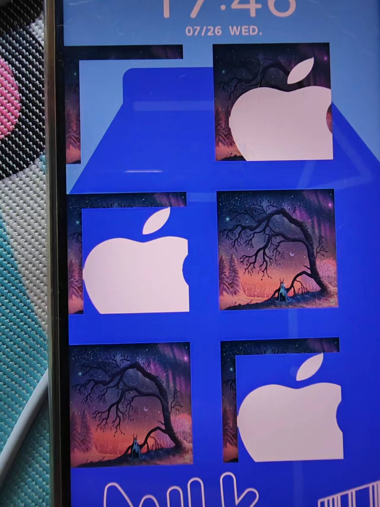
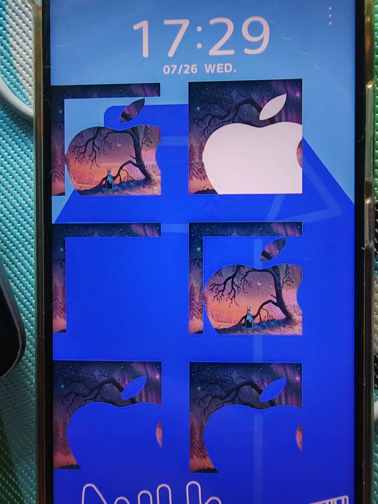
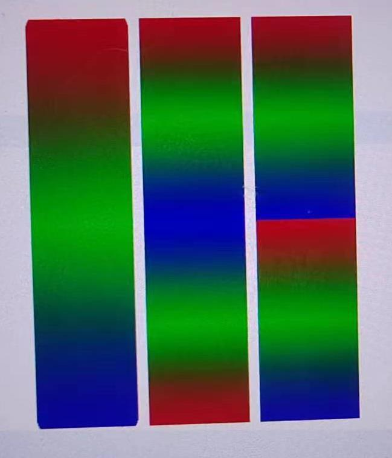
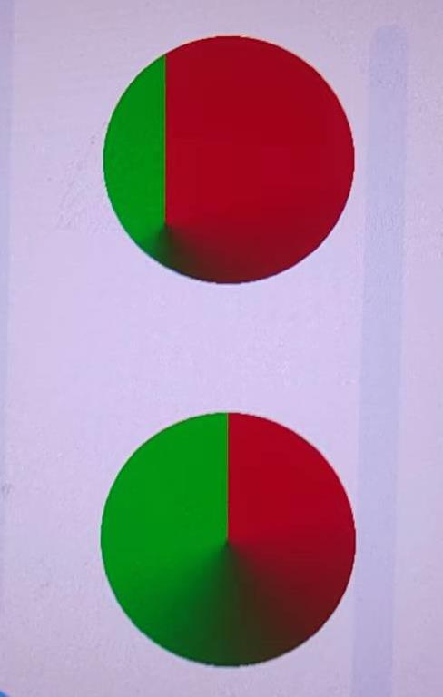

# 主题


<!-- TOC -->

- [主题](#主题)
    - [配置](#配置)
    - [基础功能](#基础功能)
        - [文本](#文本)
        - [图片](#图片)
        - [视频](#视频)
        - [串联图片](#串联图片)
        - [帧解锁视图](#帧解锁视图)
            - [loop](#loop)
        - [遮罩](#遮罩)
        - [几何图形](#几何图形)
            - [Arc](#arc)
            - [Linear 渐变和 Radial 渐变的三种平铺模式（`tileMode` 属性）](#linear-渐变和-radial-渐变的三种平铺模式tilemode-属性)
            - [`position` 属性](#position-属性)
            - [Sweep 渐变](#sweep-渐变)
            - [动态改变渐变色](#动态改变渐变色)
        - [组](#组)
        - [虚拟屏幕](#虚拟屏幕)
        - [滑块](#滑块)
            - [坐标和尺寸](#坐标和尺寸)
            - [`Path`](#path)
        - [解锁](#解锁)
        - [变量](#变量)
            - [0 1 toggle 的写法](#0-1-toggle-的写法)

<!-- /TOC -->


## 配置
* 编辑器加载主题后主题文件所在目录：`C:\Users\samoyi\AppData\Roaming\ThemeStudio\workspace`


## 基础功能
### 文本
* `showStyle` 为 0 是灯从左到右不断重复，为 1 时 灯到了右边再返回左边。如果为 1 且有多个灯，则要到最左边的灯到右边时才返回。
* `tileMode` 为 `STRETCH` 时，文本再长也只有一个灯；为 `LOOP` 时，会根据文本长度增加灯的数量。
* `<PathItem>` 中的坐标都是相对于 `<Text>` 中的 x 和 y 的。

### 图片
* 图片作为背景时，设置 `isBackground="true"` 和 `scaleType="center_crop"`，图片会按照屏幕宽高的比例进行缩放，使图片居中充满整个屏幕，多余部分裁剪，实现多机型的适配
* 动态图片的 `save` 属性为 1 时就会保存至手机，虽然文档写的是要大于 1

### 视频
* 视频作为背景时，设置 `isBackground="true"` 和 `scaleType="center_crop"`，图片会按照屏幕宽高的比例进行缩放，使图片居中充满整个屏幕，多余部分裁剪，实现多机型的适配

### 串联图片
1. 比如你想用图片来组合成字符串 `"Aa/Bb/Cc/Dd/"`，也就是其中每个字符都用一张对应的图片来显示，那么一共需要 9 张图片。
2. 实现如下
    ```xml
    <ImageSeries x="200" y="750" space="10" 
        src="letter.png" string="Aa/Bb/Cc/Dd/" mapList="aa,bb,cc,dd,Aaa,Bbb,Ccc,Ddd,/dot" />
    ```
    * `string` 属性：要用图片显示的字符串；
    * `src` 属性：9 张图片的文件名需要用共同的前缀 `letter_` 且都是 `png`  格式。
    * `mapList` 属性：每个字符和图片名的映射关系，用逗号分割每一项：
        1. 每项的首字母是要转换为图片的那个字符，后面的一个或多个字符是对应的图片的名称后缀；
        2. 例如 `aa` 表示把字符 `a` 映射为图片 `letter_a.png`， `Aaa` 表示把字符 `A` 映射为图片 `letter_aa.png`， `/dot` 表示把字符 `/` 映射为图片 `letter_dot.png`。
        3. 这里没有把字符 `A` 映射为图片 `letter_A.png`，是因为在目录中不区分文件名字母大小写，所以不能和 `letter_a.png` 混淆。
    
### 帧解锁视图
TODO，逻辑混乱

#### loop
* `loop` 为 `false` 时：
    * 如果不点击或长按屏幕
    * 在当前帧数小于 `unlockTo` 设置的帧数时点击屏幕，以每次 3 帧的速度回退，如果不能刚好退到首帧，则会停在第二或第三帧。例如首帧是 0 时：
        * 如果从 8 帧回退，会依次显示 5 帧、2 帧，并停在 2 帧；
        * 如果从 7 帧回退，会依次显示 4 帧、1 帧，并停在 1 帧；
        * 如果从 6 帧回退，会依次显示 3 帧、0 帧，并停在 0 帧；
    * 在当前帧数大于等于 `unlockTo` 设置的帧数时点击屏幕，立刻停止。
    * 在当前帧数小于 `unlockTo` 设置的帧数时长按屏幕，则序列帧会继续进行并停留在  `unlockTo`；
    * 在当前帧数大于等于 `unlockTo` 设置的帧数时长按屏幕，立刻停止。
* `loop` 为 `true` 时：
    * 如果不点击或长按屏幕，动画会一直进行


### 遮罩
1. TODO 和文档说的不一样。和 CSS 的 `-webkit-mask-composite` 样式看起来一样 
2. 用一下代码测试，`hybridMode` 测试不同模式
    ```xml
    <Image x="0" y="400" w="400" h="400"
        src="test/tumblr.jpg">
        <Mask x="50" y="50" w="400" h="400" src="test/mask.png" align="relative"
            hybridMode="6" />
    </Image>
    ```
3. 第一张图的第一列是 0~2，第二列是 3~5，第二张图的第一列是 6~8，第二列是 9~11
    
    
4. 区分图片重叠和像素重叠：如果遮罩是没有透明部分的，则图片重叠部分和像素重叠部分是一样的；如果有透明部分，则像素重叠部分只是遮罩中有像素的区域与源图片重叠的区域。
    * clear：遮罩图片不显示，源图片中图片重叠部分不显示。
    * ori：遮罩图片正常显示，源图片中图片重叠部分不显示。
    * tgt：遮罩图片不显示
    * oriOver：遮罩图片渲染到源图片之上。
    * rgtOver：源图片渲染到遮罩图片之上。
    * oriIn：源图片图片重叠部分被删除，遮罩图片正藏显示。
    * tgtIn：遮罩图片不显示；遮罩图片和源图片的重叠部分中，遮罩图片有像素的区域，源图片保留该区域，其他区域删除
    * oriOut：遮罩图片不显示；源图片图片重叠部分直接删除。
    * gtgOut：遮罩图片不显示；源图片像素重叠部分不显示。
    * oriATop：遮罩图片直接覆盖到源图片上
    * rgtATop：遮罩图片不显示；遮罩图片和源图片的重叠部分中，遮罩图片有像素的区域，源图片保留该区域，其他区域删除
    * xor：遮罩图片不显示；源图片像素重叠部分不显示。

### 几何图形
#### Arc
不封闭的话应用渐变无效

#### Linear 渐变和 Radial 渐变的三种平铺模式（`tileMode` 属性）
1. 注意后两个的渐变终点都是到一半，另一半是 mirror 和 loop
    ```xml
	<Rectangle x="340" y="500" w="100" h="400" cornerRadius="5,10">
		<FillGradient>
			<Linear x="0" y="0" x1="0" y1="400" tileMode="stretch">
				<GradientPoint color="#aa0000" position="0" />
				<GradientPoint color="#00aa00" position="0.5" />
				<GradientPoint color="#0000aa" position="1" />
			</Linear>
		</FillGradient>
	</Rectangle>
	<Rectangle x="450" y="500" w="100" h="400">
		<FillGradient>
			<Linear x="0" y="0" x1="0" y1="200" tileMode="mirror">
				<GradientPoint color="#aa0000" position="0" />
				<GradientPoint color="#00aa00" position="0.5" />
				<GradientPoint color="#0000aa" position="1" />
			</Linear>
		</FillGradient>
	</Rectangle>
	<Rectangle x="560" y="500" w="100" h="400">
		<FillGradient>
			<Linear x="0" y="0" x1="0" y1="200" tileMode="loop">
				<GradientPoint color="#aa0000" position="0" />
				<GradientPoint color="#00aa00" position="0.5" />
				<GradientPoint color="#0000aa" position="1" />
			</Linear>
		</FillGradient>
	</Rectangle>
    ```
    
    
#### `position` 属性
如果没有从 0 开始，则从 0 到 第一个 position 之间就是第一个 position 所设置颜色的无渐变纯色。如果最后一个 position 不是 1，则从最后一个 position 到 1 之间就是一个 position 所设置颜色的无渐变纯色（见下面的 Sweep 渐变示例图片）。
```xml
<Rectangle x="340" y="500" w="100" h="400" cornerRadius="5,10">
    <FillGradient>
        <Linear x="0" y="0" x1="0" y1="400" tileMode="stretch">
            <GradientPoint color="#aa0000" position="0" />
            <GradientPoint color="#00aa00" position="0.5" />
            <GradientPoint color="#0000aa" position="1" />
        </Linear>
    </FillGradient>
</Rectangle>
<Rectangle x="450" y="500" w="100" h="400">
    <FillGradient>
        <Linear x="0" y="0" x1="0" y1="400" tileMode="stretch">
            <GradientPoint color="#aa0000" position="0.2" />
            <GradientPoint color="#00aa00" position="0.5" />
            <GradientPoint color="#0000aa" position="1" />
        </Linear>
    </FillGradient>
</Rectangle>
```


#### Sweep 渐变
渐变的起始线是从设定的坐标点平直向右的线
```xml
<Circle x="300" y="800" r="100">
    <FillGradient>
        <Sweep x="100" y="100">
            <GradientPoint color="#aa0000" position="0.2" />
            <GradientPoint color="#00aa00" position="0.7" />
        </Sweep>
    </FillGradient>
</Circle>
<Circle x="600" y="800" r="100">
    <FillGradient>
        <Sweep x="50" y="50">
            <GradientPoint color="#aa0000" position="0.2" />
            <GradientPoint color="#00aa00" position="0.7" />
        </Sweep>
    </FillGradient>
</Circle>
```


#### 动态改变渐变色
TODO 不正确
```xml
<Var name="color" expression="argb(255,141,83,255)+argb(255,183,187,180)+argb(25,133,110,200)"
    type="string" />
<Button x="0" y="0" w="420" h="420">
    <Trigger action="up">
        <VariableCommand name="color"
            expression="argb(255,141,183,255)+argb(255,83,187,180)+argb(255,107,205,164)"
            type="string" />
    </Trigger>
</Button>
<Rectangle fillColor="@color" h="400" w="200" x="510" y="610">
    <FillGradient>
        <Linear tileMode="stretch" x="0" x1="130" y="0" y1="0">
            <GradientPoint color="#000000" position="0" />
            <GradientPoint color="#00ff00" position="0.5" />
            <GradientPoint color="#ffffff" position="1" />
        </Linear>
    </FillGradient>
</Rectangle>
```

### 组
* TODO，为什么设了组的坐标，结果图片还是在屏幕左上角
    ```xml
	<Group x="200" y="200" w="800" h="800" layered="true">
		<Image x="0" y="0" w="400" h="400" align="center" alignV="center" src="test/tumblr.jpg" />
		<Image x="50" y="50" w="400" h="400" align="center" alignV="center" src="test/tumblr.jpg" />
		<Image x="100" y="100" w="400" h="400" align="center" alignV="center" src="test/tumblr.jpg"
			hybridMode="1" />
	</Group>
    ```
* TODO，为了加了 layered 就不显示了
    ```xml
    <Group x="0" y="0" w="#screen_width" h="#screen_height" layered="true">
		<Rectangle x="100" y="100" w="100" h="100" fillColor="#ffffadff" />
		<!-- <Image src="test/letter_dot.png" x="200" y="250" w="300" h="300" /> -->
		<Rectangle x="200" y="250" w="300" h="300" fillColor="#ffaaadff" />
	</Group>
    ```
* TODO，图片位置超过组范围了，但没看到 clip 效果
    ```xml
	<Group x="200" y="200" w="200" h="200" alpha="200" rotation="90" clip="true">
		<Image x="300" y="0" align="center" alignV="center" src="test/letter_dot.png" />
		<Image x="0" y="300" align="center" alignV="center" src="test/letter_dot.png" />
		<PositionAnimation>
			<Position x="0" y="0" time="0" />
			<Position x="300" y="0" time="600" />
			<Position x="0" y="0" time="1800" />
		</PositionAnimation>
		<RotationAnimation>
			<Rotation angle="0" time="0" />
			<Rotation angle="360" time="600" />
			<Rotation angle="0" time="1800" />
		</RotationAnimation>
	</Group>
    ```

### 虚拟屏幕
对一组元素进行复用。下面的例子中，<Image> 通过 `src` 引用虚拟屏幕中的内容
```xml
<VirtualScreen name="vs">
    <Image x="400" y="400" w="200" h="200" align="center" alignV="center" src="test/mask.png" />
    <Image x="400" y="400" w="100" h="100" align="center" alignV="center" src="test/letter_dot.png" />
</VirtualScreen>
<Image x="0" y="0" w="1080" h="1920" src="vs" useVirtualScreen="true" />
<Image x="0" y="400" w="1080" h="1920" src="vs" useVirtualScreen="true" />
<Image x="0" y="800" w="1080" h="1920" src="vs" useVirtualScreen="true" />
```

### 滑块
#### 坐标和尺寸
* `<PressedState>` 和 `<ReachedState>` 中的图片设置的坐标如果和 `NormalState` 不一致，会以它们的差值作为一个相对位置来设定拖动时图片的位置。例如
    ```xml
    <NormalState>
        <Image x="30" y="500" src="add.png"></Image>
    </NormalState>
    <PressedState>
        <Image x="30" y="300" src="info.png"></Image>
    </PressedState>
    ```
    刚开始图片纵坐标是 500，但是拖动起来后，图片的位置会在当前拖动点上方距离 200 像素的位置。
* `<StartPoint>` 中的 `w` 和 `h` 定义的是虚拟滑块的尺寸，在其内部如果在设置图片，如果图片尺寸小于虚拟滑块的尺寸，实际的可拖动区域仍然是按照虚拟滑块的尺寸。
* `<EndPoint>` 也可使设置 `<PressedState>` 和 `<ReachedState>`，不过表示的也是 `<StartPoint>` 被按下和到达时的状态，并不是 `<EndPoint>` 本身的状态。比如按下 `<EndPoint>` 时并不会触发它内部的 `<PressedState>`
    ```xml
	<Slider name="slider" bounceInitSpeed="10" bounceAcceleration="100">
		<StartPoint x="200" y="500" w="200" h="200">
			<NormalState>
				<Image x="200" y="500" src="add.png"></Image>
				<Trigger>
					<Command target="test_trigger.visibility" value="true" />
				</Trigger>
			</NormalState>
			<PressedState>
				<Image x="200" y="500" src="add.png"></Image>
				<Trigger>
					<Command target="test_trigger.visibility" value="false" />
				</Trigger>
			</PressedState>
			<ReachedState>
				<Image x="200" y="500" src="add.png"></Image>
				<Trigger>
					<Command target="test_trigger.visibility" value="true" />
				</Trigger>
			</ReachedState>
		</StartPoint>
		<EndPoint x="200" y="1000" w="200" h="200">
			<NormalState>
				<Image x="200" y="1000" src="reduce.png"></Image>
			</NormalState>
			<PressedState>
				<Image x="200" y="1000" w="100" h="300" src="reduce.png"></Image>
			</PressedState>
			<ReachedState>
				<Image x="200" y="1000" w="100" h="500" src="reduce.png"></Image>
			</ReachedState>
			<Path x="0" y="0">
				<Position x="200" y="500" />
				<Position x="200" y="1000" />
			</Path>
		</EndPoint>
	</Slider>
    ```

#### `Path`
1. `Path` 定义的滑动路径。如果不定义的话，可以任意拖动起始的图片，而定义了之后，其实图片只能按照该路径运动。
2. 任意拖动的话，到达结束点一样可以触发响应的状态，只不过不限于特定的路径。例如下面就定义了只能在起始点和结束点之间的连线上拖动
    ```xml
	<Slider name="slider" bounceInitSpeed="10" bounceAcceleration="100">
		<StartPoint x="200" y="500" w="200" h="200">
			<NormalState>
				<Image x="200" y="500" src="add.png"></Image>
			</NormalState>
		</StartPoint>
		<EndPoint x="200" y="1000" w="200" h="200">
			<PressedState>
				<Image x="200" y="1000" src="reduce.png"></Image>
			</PressedState>
			<Path x="0" y="0">
				<Position x="200" y="500" />
				<Position x="200" y="1000" />
			</Path>
		</EndPoint>
	</Slider>
    ```
3. 注意上面例子中 `<Path>` 的 `x` 和 `y` 都是设置的 0，这两个属性会分别加载 `<Position>` 的对应属性上。例如如果设置为
    ```xml
    <Path x="100" y="100">
        <Position x="200" y="500" />
        <Position x="200" y="1000" />
    </Path>
    ```
    则实际的路径起点是 (300，600)，而终点坐标是 (300,1100)。

### 解锁
1. 把一个图标移到另一个图标位置时解锁
    ```xml
	<Unlocker name="unlocker">
		<StartPoint x="200" y="500" w="100" h="100">
			<NormalState>
				<Image x="200" y="500" src="add.png"></Image>
			</NormalState>
		</StartPoint>
		<EndPoint x="200" y="1000" w="100" h="100">
			<NormalState>
				<Image x="200" y="1000" src="reduce.png"></Image>
			</NormalState>
		</EndPoint>
	</Unlocker>
    ```
2. 在任意位置移动指定距离解锁，实际上就是把 `<StartPoint>` 设置为全屏
    ```xml
	<Unlocker name="unlocker" bounceInitSpeed="2000" bounceAcceleration="3000">
		<StartPoint x="0" y="0" w="#screen_width" h="#screen_height">
		</StartPoint>
		<EndPoint x="0" y="-300" w="#screen_width" h="200">
			<Path x="0" y="0" w="#screen_width" h="#screen_height">
				<Position x="0" y="0" />
				<Position x="0" y="-150" />
			</Path>
		</EndPoint>
	</Unlocker>
    ```

### 变量
* 整数变量输出后也是浮点数形式。例如 `5` 输出后为 `5.0`
* TODO 切换后 `ishour12` 还是 0，而且 `hour12` 和 `hour24` 显示的总是相同的，要么都是 12 小时制的要么都是 24 小时制的

#### 0 1 toggle 的写法
1. 不能像下面这样，因为这两个命令都会执行，导致变量恢复之前的值
    ```xml
    <VariableCommand name="num" expression="1" condition="eq(#num, 0)" persist="true" />
    <VariableCommand name="num" expression="0" condition="eq(#num, 1)" persist="true" />
    ```
2. 而是应该这样
    ```xml
    <VariableCommand name="num" expression="#num+1" condition="le(#num,2)" persist="true" />
    <VariableCommand name="num" expression="0" condition="eq(#num,2)" persist="true" />
    ```