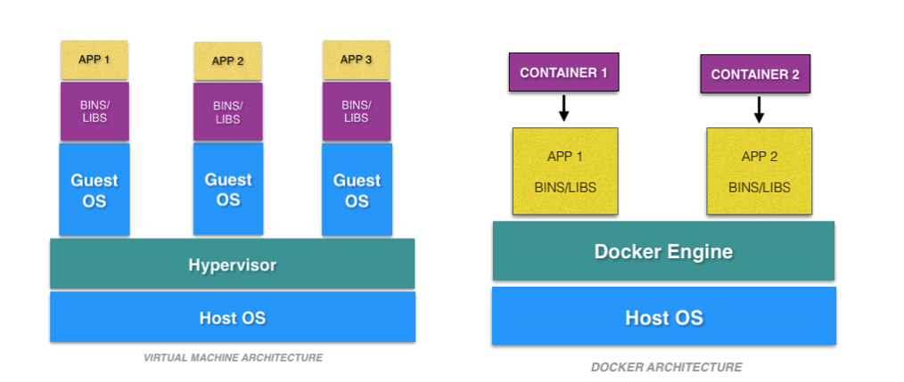

# Docker 和虚拟机的区别

<!-- TOC -->

- [Docker 和虚拟机的区别](#docker-和虚拟机的区别)
    - [虚拟机](#虚拟机)
    - [Docker](#docker)
    - [Comparison](#comparison)
        - [OS Support and Architecture](#os-support-and-architecture)
        - [Security](#security)
        - [Portability](#portability)
        - [Performance](#performance)
        - [Some other differences](#some-other-differences)
    - [References](#references)

<!-- /TOC -->

## 虚拟机
1. Virtual machines, on the other hand, are created to perform tasks that, if otherwise performed directly on the host environment, may prove to be risky.
2. Virtual machines are isolated from the rest of the system; the software inside the virtual machine cannot tamper with the host computer.
3. Therefore, implementing tasks such as accessing virus infected data and testing of operating systems are done using virtual machines.
4. We can define a virtual machine as:
   A virtual machine is a computer file or software usually termed as a **guest**, or an **image** that is created within a computing environment called the host.
5. Another sector where virtual machines are of great use is server virtualization. In server virtualization, a physical server is divided into multiple isolated and unique servers, thereby allowing each server to run its operating system independently. Each virtual machine provides its virtual hardware, such as CPUs, memory, network interfaces, hard drives, and other devices.
6. A host can have several virtual machines running at a specific time. Although several virtual machines running at a time may sound efficient, it leads to unstable performance. As the guest OS would have its kernel, set of libraries and dependencies, this would take up a large chunk of system resources.
7. Other drawbacks include inefficient hypervisor and long boot uptime. The concept of Containerization overcomes these flaws. Docker is one such containerization platform.
8. Virtual machines are broadly divided into two categories depending upon their use:
   - System Virtual Machines: A platform that allows multiple virtual machines, each running with its copy of the operating system to share the physical resources of the host system. **Hypervisor**, which is also a software layer, provides the virtualization technique. The hypervisor executes at the top of the operating system or the hardware alone.
   - Process Virtual Machine: Provides a platform-independent programming environment. The process virtual machine is designed to hide the information of the underlying hardware and operating system and allows the program to execute in the same manner on every given platform.

## Docker
1. Docker is a software development tool and a virtualization technology that makes it easy to develop, deploy, and manage applications by using **container**s.
2. Container refers to a lightweight, stand-alone, executable package of a piece of software that contains all the libraries, configuration files, dependencies, and other necessary parts to operate the application.
3. In other words, applications run the same irrespective of where they are and what machine they are running on because the container provides the environment throughout the software development life cycle of the application.
4. Since containers are isolated, they provide security, thus allowing multiple containers to run simultaneously on the given host.
5. Also, containers are lightweight because they do not require an extra load of a hypervisor. A hypervisor is a guest operating system like VMWare or VirtualBox, but instead, containers run directly within the host’s machine kernel.
6. Containers provide the following benefits
   - Reduced IT management resources
   - Reduced size of snapshots
   - Quicker spinning up apps
   - Reduced and simplified security updates
   - Less code to transfer, migrate, and upload workloads

## Comparison
### OS Support and Architecture

1. Virtual machines have host OS and the guest OS inside each VM. Guest OS can be any OS, like Linux or Windows, irrespective of host OS. TODO，这里说的应该不是虚拟机里也能访问 host OS 吧？而是说每个虚拟机都要有自己的 OS。
2. In contrast, Docker containers host on a single physical server with a host OS, which shares among them. Docker 容器就不需要自己的 OS。
3. Sharing the host OS between containers makes them light and increases the boot time.
4. Docker containers are considered suitable to run multiple applications over a single OS kernel; whereas, virtual machines are needed if the applications or services required to run on different OS.

### Security
1. Virtual machines are stand-alone with their kernel and security features. Therefore, applications needing more privileges and security run on virtual machines.
2. On the flip side, providing root access to applications and running them with administrative premises is not recommended in the case of Docker containers because containers share the host kernel.
3. The container technology has access to the kernel subsystems; as a result, a single infected application is capable of hacking the entire host system.

### Portability
1. Virtual machines are isolated from their OS, and so, they are not ported across multiple platforms without incurring compatibility issues.
2. Docker containers packages are self-contained and can run applications in any environment, and since they don’t need a guest OS, they can be easily ported across different platforms. 不懂，虚拟机和主机隔离为什么不容易移植，而容器可以访问 kernel subsystems 为什么反倒容易移植？从 [这篇文章](https://geekflare.com/docker-vs-virtual-machine/) 看，因为虚拟机有自己的操作系统，所以移植的时候需要考虑到操作系统的环境，所以可移植性相对较差。
3. Docker containers can be easily deployed in servers since containers being lightweight can be started and stopped in very less time compared to virtual machines.
4. At the development level, if an application is to be tested on different platforms, then Docker containers must be considered.

### Performance
1. Virtual machines are more resource-intensive than Docker containers as the virtual machines need to load the entire OS to start. The lightweight architecture of Docker containers is less resource-intensive than virtual machines.
2. In the case of virtual machines, resources like CPU, memory, and I/O may not be allocated permanently to containers — unlike in the case of containers, where the resource usage with the load or traffic. 不懂
3. Scaling up and duplicating containers in simple and easy as compared to virtual machines because there is no need to install an operating system in them.

### Some other differences
<table>
    <tbody>
        <tr>
            <td></td>
            <td>Docker</td>
            <td>Virtual Machines (VMs)</td>
        </tr>
        <tr>
            <td><b>Boot-Time</b></td>
            <td>Boots in a few seconds.</td>
            <td>It takes a few minutes for VMs to boot.</td>
        </tr>
        <tr>
            <td><b>Runs on</b></td>
            <td>Dockers make use of the execution engine.</td>
            <td>VMs make use of the hypervisor.</td>
        </tr>
        <tr>
            <td><b>Memory Efficiency</b></td>
            <td>No space is needed to virtualize, hence less memory.&nbsp;</td>
            <td>Requires entire OS to be loaded before starting the surface, so less efficient.&nbsp;</td>
        </tr>
        <tr>
            <td><b>Isolation</b></td>
            <td>Prone to adversities as no provisions for isolation systems.</td>
            <td>Interference possibility is minimum because of the efficient isolation mechanism.</td>
        </tr>
        <tr>
            <td><b>Deployment</b></td>
            <td>Deploying is easy as only a single image, containerized can be used across all platforms.&nbsp;</td>
            <td>Deployment is comparatively lengthy as separate instances are responsible for execution.</td>
        </tr>
        <tr>
            <td><b>Usage</b></td>
            <td>Docker has a complex usage mechanism consisting of both third party and docker managed tools.</td>
            <td>Tools are easy to use and simpler to work with.&nbsp;</td>
        </tr>
    </tbody>
</table>

## References
* [Docker vs. Virtual Machines: Differences You Should Know](https://cloudacademy.com/blog/docker-vs-virtual-machines-differences-you-should-know/)
* [Docker vs Virtual Machine (VM) – Understanding the Differences](https://geekflare.com/docker-vs-virtual-machine/)