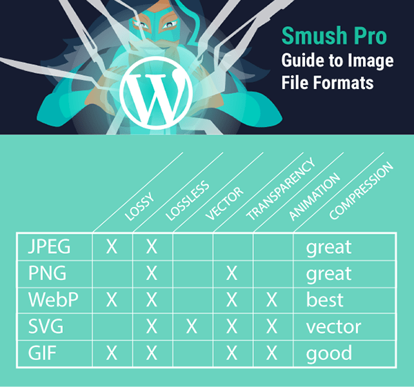

# 图片格式比较

<!-- TOC -->

- [图片格式比较](#图片格式比较)
    - [如何压缩图像：有损与无损](#如何压缩图像有损与无损)
    - [jpeg](#jpeg)
    - [png](#png)
    - [webp](#webp)
    - [矢量图像 SVG](#矢量图像-svg)
    - [Gif](#gif)
    - [比较](#比较)
    - [References](#references)

<!-- /TOC -->

## 如何压缩图像：有损与无损
1. 为了选择理想的图像格式，您需要了解有损压缩和无损压缩之间的区别。理想情况下，您的图像应利用这两种算法过程来生成最小的文件大小。
2. 并非所有格式都支持这两种格式。
3. 使用有损压缩，您的某些数据将永远丢失。有损图像压缩会永久删除图像数据并在此过程中降低图像质量。这并不像听起来那么糟糕，因为其中一些额外的细节甚至可能无法被人眼察觉。
4. 相比之下，无损图像压缩可以保留数据，因此不会丢失任何内容。无损算法保留所有必要的数据以准确重新创建图像。
5. 理想情况下，您的图像将首先经历有损压缩阶段，然后是无损阶段，其中剩余的内容将被优化。

## jpeg
1. 可以有损压缩到很小但仍然支持丰富的色彩，因此适合用于照片。
2. 但是不适合高对比图像，因为图像上带有文本时 jpeg 不适合好选择，比如 logo 之类的。

## png
1. 无损压缩，所以大小也较大。
2. png24 可以同时支持丰富的色彩和高对比度，但大小要比 jpeg 大得多。

## webp
1. 可以有损压缩也可以无损压缩，有损压缩 webp 比 jpeg 小，无损压缩的 webp 也比 png 小。
2. 相比于 jpeg 和 png，webp 还支持动画。

## 矢量图像 SVG
1. SVG 实际上不是一种图像文件格式，SVG 是一种标记语言，允许您创建二维图形。SVG 更像 HTML 而不是 PNG或JPEG。
2. SVG 在技术上是基于 XML 的，可以用 Javascript 和 CSS 进行操作和动画。
3. 它们创建矢量图像，这意味着图像是无限可缩放的，并且在所有分辨率下看起来都不错，不会获得其他图像文件类型中出现的像素化。
4. 但是，由于 SVG 旨在显示基于几何形状的简单图像，例如徽标、旗帜、图表和图标。它们不适合摄影。
5. 如果创建简单的图像，则生成的文件大小将比 PNG，JPEG 或 WebP 图像小得多，即使是高分辨率的大图像。不过，复杂的 SVG 文件将抵消这些优势。
6. 由于 SVG 是一种标记语言，因此它们对恶意软件注入开放。如果您是网站管理员，并且启用了 SVG，但网站的作者和贡献者没有意识到风险，他们可能会在不知情的情况下上传受损的 SVG 文件。

## Gif
文件很大，色彩也很有限，使用 WebM 是更好的选择。或者哪怕使用颜色同样有限但大小小得多的 png8。

## 比较

## References
* [Best Image Formats for Websites Compared―PNG, JPG, GIF, and WebP](https://wpmudev.com/blog/best-image-formats-png-vs-jpg-svg-gif-webp/)