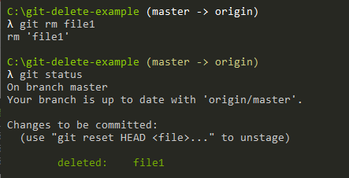
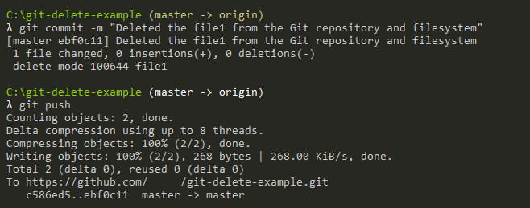
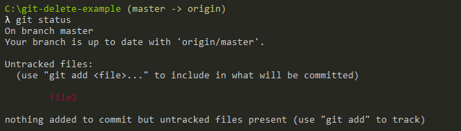

# 基本操作


<!-- TOC -->

- [基本操作](#基本操作)
    - [Getting a Git Repository](#getting-a-git-repository)
    - [Recording Changes to the Repository](#recording-changes-to-the-repository)
        - [Status of Your Files](#status-of-your-files)
        - [Viewing Your Staged and Unstaged Changes](#viewing-your-staged-and-unstaged-changes)
        - [Skipping the Staging Area](#skipping-the-staging-area)
        - [Moving Files](#moving-files)
        - [Removing Files](#removing-files)
            - [真正删除一个文件](#真正删除一个文件)
            - [从 git 仓库中删除](#从-git-仓库中删除)
    - [Viewing the Commit History](#viewing-the-commit-history)
    - [Undoing Things](#undoing-things)
        - [覆盖前一次的提交](#覆盖前一次的提交)
        - [Unstaging a Staged File](#unstaging-a-staged-file)
        - [Unmodifying a Modified File](#unmodifying-a-modified-file)
    - [Working with Remotes](#working-with-remotes)
        - [Showing Your Remotes](#showing-your-remotes)
        - [Adding Remote Repositories](#adding-remote-repositories)
        - [Fetching and Pulling from Your Remotes](#fetching-and-pulling-from-your-remotes)
        - [Pushing to Your Remotes](#pushing-to-your-remotes)
        - [Inspecting a Remote](#inspecting-a-remote)
        - [Renaming and Removing Remotes](#renaming-and-removing-remotes)
    - [Tagging](#tagging)
        - [Listing Your Tags](#listing-your-tags)
        - [Creating Tags](#creating-tags)
            - [Annotated Tags](#annotated-tags)
        - [Lightweight Tags](#lightweight-tags)
        - [Tagging Later](#tagging-later)
        - [Sharing Tags](#sharing-tags)
        - [Deleting Tags](#deleting-tags)
        - [Checking out Tags](#checking-out-tags)
    - [References](#references)

<!-- /TOC -->


## Getting a Git Repository
1. You typically obtain a Git repository in one of two ways:
    * You can take a local directory that is currently not under version control, and turn it into a Git repository, or
    * You can clone an existing Git repository from elsewhere.
2. If you want to clone the repository into a directory named something other than libgit2, you can specify the new directory name as an additional argument:
    ```
    $ git clone https://github.com/libgit2/libgit2 mylibgit
    ```


## Recording Changes to the Repository 
### Status of Your Files
1. 现在我们的机器上有了一个真实项目的 Git 仓库，并从这个仓库中检出了所有文件的工作副本。通常，你会对这些文件做些修改，每当完成了一个阶段的目标，想要将记录下它时，就将它提交到仓库。
2. 从是否跟踪这个维度，工作目录下的每一个文件都不外乎这两种状态：已跟踪（tracked）或 未跟踪（untracked）。
3. 已跟踪的文件是指那些被纳入了版本控制的文件，在上一次快照中有它们的记录，在工作一段时间后，它们的状态可能是未修改，已修改或已放入暂存区。简而言之，已跟踪的文件就是 Git 已经知道的文件。
4. 但这么说也不准确，如果这么说，那未追踪的文件就是创建之后从没有被 `commit` 的文件。但实际上，只要新创建的文件被 `add` 之后，它就是已追踪的状态了。当然被 `add` 后也可以通过 `reset` 取消 `add` 再变回未追踪状态。
5. 编辑过某些文件之后，由于自上次提交后你对它们做了修改，Git 将它们标记为已修改文件。在工作时，你可以选择性地将这些修改过的文件放入暂存区，然后提交所有已暂存的修改，如此反复
    
6. `add` 命令有三个功能：
    * 既可以把未追踪的文件变成已追踪的并放入暂存区；
    * 可以已追踪但发生修改的文件并放入暂存区；
    * 可以用于合并时把有冲突的文件标记为已解决状态并放入暂存区。
7. 使用 `git status -s` 命令或 `git status --short` 命令，你将得到一种格式更为紧凑的输出
    ```
    $ git status -s
     M README
    MM Rakefile
    A  lib/git.rb
    M  lib/simplegit.rb
    ?? LICENSE.txt
    ```
    但是规则比较复杂：New files that aren’t tracked have a ?? next to them, new files that have been added to the staging area have an A, modified files have an M and so on. There are two columns to the output — the left-hand column indicates the status of the staging area and the right-hand column indicates the status of the working tree. So for example in that output, the README file is modified in the working directory but not yet staged, while the lib/simplegit.rb file is modified and staged. The Rakefile was modified, staged and then modified again, so there are changes to it that are both staged and unstaged.

### Viewing Your Staged and Unstaged Changes
1. `git diff` 可以用来回答两个问题：当前做的哪些更新尚未暂存？有哪些更新已暂存并准备好下次提交？
2. 不加参数直接输入 `git diff` 比较的是工作目录中当前文件和暂存区域快照之间的差异。也就是修改之后还没有暂存起来的变化内容。
3. 若要查看已暂存的将要添加到下次提交里的内容，可以用 `git diff --staged` 命令。这条命令将比对已暂存文件与最后一次提交的文件差异。

### Skipping the Staging Area
Git 提供了一个跳过使用暂存区域的方式，只要在提交的时候，给 `git commit` 加上 `-a` 选项，Git 就会自动把所有已经跟踪过的文件暂存起来一并提交，从而跳过 `git add` 步骤。

### Moving Files
1. 不像其它的 VCS 系统，Git 并不显式跟踪文件移动操作。如果在 Git 中重命名了某个文件，仓库中存储的元数据并不会体现出这是一次改名操作，而是删除和新加操作。
2. 不过 Git 推断出究竟发生了什么。例如使用下面的移动命令时
    ```
    $ git mv file_from file_to
    ```
    其实内部执行的是
    ```
    $ mv README.md README
    $ git rm README.md
    $ git add README
    ```

### Removing Files
1. 这里的删除有两个意思：
    * 真正删除一个文件。
    * 把一个文件变成未追踪的状态（从 git 仓库中删除）。

#### 真正删除一个文件
1. 使用 `git rm` 命令可以真正删除一个文件
    
    现在你从文件系统里看到不 `file1` 了，而且 git 仓库也有了删除的记录。但本次的删除操作还没有提交，也就是说文件还在暂存区中。
2. 如果提交了本次删除操作，则文件从暂存区里删除，git 仓库也完成了删除该文件
    
3. 如果要删除之前修改过或已经放到暂存区的文件，则必须使用强制删除选项 `-f`。这是一种安全特性，用于防止误删尚未添加到快照的数据，这样的数据不能被 Git 恢复。
   
#### 从 git 仓库中删除
1. 如果只希望把一个文件从仓库中删除，变成未追踪状态，则需要使用 `git rm --cached` 命令。例如
    ```
    $ git rm --cached file2
    ```
2. 看一下此时 `git status` 的效果
    
3. 之后需要把这个文件加入到 `.gitignore` 中。


## Viewing the Commit History
* `-p`/`--patch` 选项显示每次提交所引入的差异
* `-n` 只显示最近的 n 条提交记录
    ```
    $ git log -p -2
    commit ca82a6dff817ec66f44342007202690a93763949
    Author: Scott Chacon <schacon@gee-mail.com>
    Date:   Mon Mar 17 21:52:11 2008 -0700

        changed the version number

    diff --git a/Rakefile b/Rakefile
    index a874b73..8f94139 100644
    --- a/Rakefile
    +++ b/Rakefile
    @@ -5,7 +5,7 @@ require 'rake/gempackagetask'
    spec = Gem::Specification.new do |s|
        s.platform  =   Gem::Platform::RUBY
        s.name      =   "simplegit"
    -    s.version   =   "0.1.0"
    +    s.version   =   "0.1.1"
        s.author    =   "Scott Chacon"
        s.email     =   "schacon@gee-mail.com"
        s.summary   =   "A simple gem for using Git in Ruby code."

    commit 085bb3bcb608e1e8451d4b2432f8ecbe6306e7e7
    Author: Scott Chacon <schacon@gee-mail.com>
    Date:   Sat Mar 15 16:40:33 2008 -0700

        removed unnecessary test

    diff --git a/lib/simplegit.rb b/lib/simplegit.rb
    index a0a60ae..47c6340 100644
    --- a/lib/simplegit.rb
    +++ b/lib/simplegit.rb
    @@ -18,8 +18,3 @@ class SimpleGit
        end

    end
    -
    -if $0 == __FILE__
    -  git = SimpleGit.new
    -  puts git.show
    -end
    ```
* `--stat` 选项在每次提交的下面列出所有被修改过的文件、有多少文件被修改了以及被修改过的文件的哪些行被移除或是添加了。在每次提交的最后还有一个总结
    ```
    $ git log --stat
    commit ca82a6dff817ec66f44342007202690a93763949
    Author: Scott Chacon <schacon@gee-mail.com>
    Date:   Mon Mar 17 21:52:11 2008 -0700

        changed the version number

    Rakefile | 2 +-
    1 file changed, 1 insertion(+), 1 deletion(-)

    commit 085bb3bcb608e1e8451d4b2432f8ecbe6306e7e7
    Author: Scott Chacon <schacon@gee-mail.com>
    Date:   Sat Mar 15 16:40:33 2008 -0700

        removed unnecessary test

    lib/simplegit.rb | 5 -----
    1 file changed, 5 deletions(-)

    commit a11bef06a3f659402fe7563abf99ad00de2209e6
    Author: Scott Chacon <schacon@gee-mail.com>
    Date:   Sat Mar 15 10:31:28 2008 -0700

        first commit

    README           |  6 ++++++
    Rakefile         | 23 +++++++++++++++++++++++
    lib/simplegit.rb | 25 +++++++++++++++++++++++++
    3 files changed, 54 insertions(+)
    ```
* `--pretty` 选项可以使用不同于默认格式的方式展示提交历史。这个选项有一些内建的子选项供你使用
    * `oneline` 会将每个提交放在一行显示，在浏览大量的提交时非常有用
        ```
        $ git log --pretty=oneline
        ca82a6dff817ec66f44342007202690a93763949 changed the version number
        085bb3bcb608e1e8451d4b2432f8ecbe6306e7e7 removed unnecessary test
        a11bef06a3f659402fe7563abf99ad00de2209e6 first commit
        ```
    * 另外还有 `short`、`full` 和 `fuller` 选项，它们展示信息的格式基本一致，但是详尽程度不一。
    * 还有 `format`，可以定制记录的显示格式，这样的输出对后期提取分析格外有用。
    * `format` 可以定制记录的显示格式。 这样的输出对后期提取分析格外有用
    * 当 `oneline` 或 `format` 与另一个 log 选项 `--graph` 结合使用时尤其有用。这个选项添加了一些 ASCII 字符串来形象地展示你的分支、合并历史：
        ```
        $ git log --pretty=format:"%h %s" --graph
        * 2d3acf9 ignore errors from SIGCHLD on trap
        *  5e3ee11 Merge branch 'master' of git://github.com/dustin/grit
        |\
        | * 420eac9 Added a method for getting the current branch.
        * | 30e367c timeout code and tests
        * | 5a09431 add timeout protection to grit
        * | e1193f8 support for heads with slashes in them
        |/
        * d6016bc require time for xmlschema
        *  11d191e Merge branch 'defunkt' into local
        ```
    * 限制输出长度。可以根据时间和其他若干维度来筛选显示。[文档](https://git-scm.com/book/en/v2/Git-Basics-Viewing-the-Commit-History#_limiting_log_output)。


## Undoing Things
注意，有些撤消操作是不可逆的。这是在使用 Git 的过程中，会因为操作失误而导致之前的工作丢失的少有的几个地方之一。

### 覆盖前一次的提交
使用 `git commit --amend` 命令
```
$ git commit -m 'initial commit'
$ git add forgotten_file
$ git commit --amend
```

### Unstaging a Staged File
1. 使用 `git reset HEAD <file>` 命令。
2. 例如一次暂存了两个文件
    ```
    $ git add *
    $ git status
    On branch master
    Changes to be committed:
    (use "git reset HEAD <file>..." to unstage)

        renamed:    README.md -> README
        modified:   CONTRIBUTING.md
    ```
3. 但实际上还不想暂存 `CONTRIBUTING.md`，则可以取消暂存
    ```
    $ git reset HEAD CONTRIBUTING.md
    Unstaged changes after reset:
    M	CONTRIBUTING.md
    $ git status
    On branch master
    Changes to be committed:
    (use "git reset HEAD <file>..." to unstage)

        renamed:    README.md -> README

    Changes not staged for commit:
    (use "git add <file>..." to update what will be committed)
    (use "git checkout -- <file>..." to discard changes in working directory)

        modified:   CONTRIBUTING.md
    ```
4. `git reset` 确实是个危险的命令，如果加上了 `--hard` 选项则更是如此。然而在上述场景中，工作目录中的文件尚未修改，因此相对安全一些。

### Unmodifying a Modified File
1. `git checkout --`
2. 请务必记得 `git checkout -- <file>` 是一个危险的命令：你对那个文件在本地的任何修改都会消失，git 会用最近提交的版本覆盖掉它。除非你确实清楚不想要对那个文件的本地修改了，否则请不要使用这个命令。
3. 如果你仍然想保留对那个文件做出的修改，但是现在仍然需要撤消，使用分支操作通常是更好的做法。
4. 记住，在 Git 中任何 **已提交** 的东西几乎总是可以恢复的。甚至那些被删除的分支中的提交或使用 `--amend` 选项覆盖的提交也可以恢复。然而，任何你未提交的东西丢失后很可能再也找不到了。


## Working with Remotes
### Showing Your Remotes
1. `git remote` 命令会列出你指定的每一个远程服务器的简写。
2. You can also specify `-v`, which shows you the URLs that Git has stored for the shortname to be used when reading and writing to that remote:
    ```
    $ git remote -v
    origin	https://github.com/schacon/ticgit (fetch)
    origin	https://github.com/schacon/ticgit (push)
    ```

### Adding Remote Repositories
1. `git clone` command implicitly adds the origin remote for you. Here’s how to add a new remote explicitly. 
2. To add a new remote Git repository as a shortname you can reference easily, run `git remote add <shortname> <url>`
    ```
    $ git remote
    origin
    $ git remote add pb https://github.com/paulboone/ticgit
    $ git remote -v
    origin	https://github.com/schacon/ticgit (fetch)
    origin	https://github.com/schacon/ticgit (push)
    pb	https://github.com/paulboone/ticgit (fetch)
    pb	https://github.com/paulboone/ticgit (push)
    ```
3. Now you can use the string `pb` on the command line in lieu of the whole URL. For example, if you want to fetch all the information that Paul has but that you don’t yet have in your repository, you can run `git fetch pb`
    ```
    $ git fetch pb
    remote: Counting objects: 43, done.
    remote: Compressing objects: 100% (36/36), done.
    remote: Total 43 (delta 10), reused 31 (delta 5)
    Unpacking objects: 100% (43/43), done.
    From https://github.com/paulboone/ticgit
    * [new branch]      master     -> pb/master
    * [new branch]      ticgit     -> pb/ticgit
    ```

### Fetching and Pulling from Your Remotes
1. As you just saw, to get data from your remote projects, you can run:
    ```
    $ git fetch <remote>
    ```
2. The command goes out to that remote project and pulls down all the data from that remote project that you don’t have yet. 
3. After you do this, you should have references to all the branches from that remote, which you can merge in or inspect at any time.
4. If you clone a repository, the command automatically adds that remote repository under the name “origin”. So, `git fetch origin` fetches any new work that has been pushed to that server since you cloned (or last fetched from) it. 
5. It’s important to note that the `git fetch` command only downloads the data to your local repository — it doesn’t automatically merge it with any of your work or modify what you’re currently working on. You have to merge it manually into your work when you’re ready.
6. If your current branch is set up to track a remote branch, you can use the `git pull` command to automatically fetch and then merge that remote branch into your current branch. 
7. By default, the `git clone` command automatically sets up your local `master` branch to track the remote `master` branch (or whatever the default branch is called) on the server you cloned from. 
8. Running `git pull` generally fetches data from the server you originally cloned from and automatically tries to merge it into the code you’re currently working on.
9. In the simplest terms, `git pull` does a `git fetch` followed by a `git merge`
    * You can do a `git fetch` at any time to update your remote-tracking branches under `refs/remotes/<remote>/`. This operation never changes any of your own local branches under `refs/heads`, and is safe to do without changing your working copy.
    * A `git pull` is what you would do to bring a local branch up-to-date with its remote version, while also updating your other remote-tracking branches.s


### Pushing to Your Remotes
1. When you have your project at a point that you want to share, you have to push it upstream. The command for this is simple: `git push <remote> <branch>`. 
2. If you want to push your `master` branch to your origin server (again, cloning generally sets up both of those names for you automatically), then you can run this to push any commits you’ve done back up to the server
    ```
    $ git push origin master
    ```
3. This command works only if you cloned from a server to which you have write access and if nobody has pushed in the meantime. If you and someone else clone at the same time and they push upstream and then you push upstream, your push will rightly be rejected. You’ll have to fetch their work first and incorporate it into yours before you’ll be allowed to push. 

### Inspecting a Remote
1. 如果想要查看某一个远程仓库的更多信息，可以使用 `git remote show <remote>` 命令。 如果想以一个特定的缩写名运行这个命令，例如 `origin`，会得到像下面类似的信息：
    ```sh
    $ git remote show origin
    * remote origin
    # 远程仓库的 URL 和 fetch、push 操作的 URL
    URL: https://github.com/my-org/complex-project
    Fetch URL: https://github.com/my-org/complex-project
    Push  URL: https://github.com/my-org/complex-project
    # 当前分支
    HEAD branch: master
    # 已追踪的分支、未追踪的分支和已经被服务器移除的分支
    Remote branches:
        master                           tracked
        dev-branch                       tracked
        markdown-strip                   tracked
        issue-43                         new (next fetch will store in remotes/origin)
        issue-45                         new (next fetch will store in remotes/origin)
        refs/remotes/origin/issue-11     stale (use 'git remote prune' to remove)
    # pull 操作对应的分支
    Local branches configured for 'git pull':
        dev-branch merges with remote dev-branch
        master     merges with remote master
    # push 操作对应的分支
    Local refs configured for 'git push':
        dev-branch                     pushes to dev-branch                     (up to date)
        markdown-strip                 pushes to markdown-strip                 (up to date)
        master                         pushes to master                         (up to date)
    ```

### Renaming and Removing Remotes
1. You can run git remote rename to change a remote’s shortname. For instance, if you want to rename pb to paul, you can do so with git remote rename:
    ```
    $ git remote rename pb paul
    $ git remote
    origin
    paul
    ```
2. It’s worth mentioning that this changes all your remote-tracking branch names, too. What used to be referenced at `pb/master` is now at `paul/master`.
3. If you want to remove a remote for some reason — you’ve moved the server or are no longer using a particular mirror, or perhaps a contributor isn’t contributing anymore — you can either use `git remote remove` or git `remote rm`:
    ```
    $ git remote remove paul
    $ git remote
    origin
    ```
4. Once you delete the reference to a remote this way, all remote-tracking branches and configuration settings associated with that remote are also deleted.


## Tagging
Like most VCSs, Git has the ability to tag specific points in a repository’s history as being important. Typically, people use this functionality to mark release points (v1.0, v2.0 and so on).

### Listing Your Tags
1. Listing the existing tags in Git is straightforward. Just type `git tag`
    ```
    $ git tag
    v1.0
    v2.0
    ```
2. This command lists the tags in alphabetical order; the order in which they are displayed has no real importance.
3. You can also search for tags that match a particular pattern. The Git source repo, for instance, contains more than 500 tags. If you’re interested only in looking at the `1.8.5` series, you can run this:
    ```
    $ git tag -l "v1.8.5*"
    v1.8.5
    v1.8.5-rc0
    v1.8.5-rc1
    v1.8.5-rc2
    v1.8.5-rc3
    v1.8.5.1
    v1.8.5.2
    v1.8.5.3
    v1.8.5.4
    v1.8.5.5
    ```

### Creating Tags
1. Git supports two types of tags: **lightweight** and **annotated**.
2. A lightweight tag is very much like a branch that doesn’t change — it’s just a pointer to a specific commit.
3. Annotated tags, however, are stored as full objects in the Git database. They’re checksummed; contain the tagger name, email, and date; have a tagging message; and can be signed and verified with GNU Privacy Guard (GPG). It’s generally recommended that you create annotated tags so you can have all this information.

#### Annotated Tags
1. Creating an annotated tag in Git is simple. The easiest way is to specify `-a` when you run the tag command:
    ```
    $ git tag -a v1.4 -m "my version 1.4"
    $ git tag
    v0.1
    v1.3
    v1.4
    ```
2. The `-m` specifies a tagging message, which is stored with the tag. 
3. You can see the tag data along with the commit that was tagged by using the `git show` command
    ```
    $ git show v1.4
    tag v1.4
    Tagger: Ben Straub <ben@straub.cc>
    Date:   Sat May 3 20:19:12 2014 -0700

    my version 1.4

    commit ca82a6dff817ec66f44342007202690a93763949
    Author: Scott Chacon <schacon@gee-mail.com>
    Date:   Mon Mar 17 21:52:11 2008 -0700

        Change version number
    ```

### Lightweight Tags
1. Another way to tag commits is with a lightweight tag. This is basically the commit checksum stored in a file — no other information is kept
    ```
    $ git tag v1.4-lw
    $ git tag
    v0.1
    v1.3
    v1.4
    v1.4-lw
    v1.5
    ```
2. This time, if you run git show on the tag, you don’t see the extra tag information. The command just shows the commit
    ```
    $ git show v1.4-lw
    commit ca82a6dff817ec66f44342007202690a93763949
    Author: Scott Chacon <schacon@gee-mail.com>
    Date:   Mon Mar 17 21:52:11 2008 -0700

        Change version number
    ```

### Tagging Later

### Sharing Tags
1. `git push <remote> <tagname>`。
2. If you have a lot of tags that you want to push up at once, you can also use `git push <remote> --tags`. This will transfer all of your tags to the remote server that are not already there.
3. `git push <remote> --tags` will push both lightweight and annotated tags. There is currently no option to push only lightweight tags, but if you use `git push <remote> --follow-tags` only annotated tags will be pushed to the remote.

### Deleting Tags
1. To delete a tag on your local repository, you can use `git tag -d <tagname>`. For example, we could remove our lightweight tag above as follows:
    ```
    $ git tag -d v1.4-lw
    Deleted tag 'v1.4-lw' (was e7d5add)
    ```
2. Note that this does not remove the tag from any remote servers. There are two common variations for deleting a tag from a remote server.
    * The first variation is `git push <remote> :refs/tags/<tagname>`
        ```
        $ git push origin :refs/tags/v1.4-lw
        To /git@github.com:schacon/simplegit.git
        - [deleted]         v1.4-lw
        ```
        The way to interpret the above is to read it as the null value before the colon is being pushed to the remote tag name, effectively deleting it.

    * The second (and more intuitive) way to delete a remote tag is with:
        ```
        $ git push origin --delete <tagname>
        ```

### Checking out Tags
TODO


## References
* [How To Delete File on Git](https://devconnected.com/how-to-delete-file-on-git)
* [What is the difference between 'git pull' and 'git fetch'?](https://stackoverflow.com/a/292359)