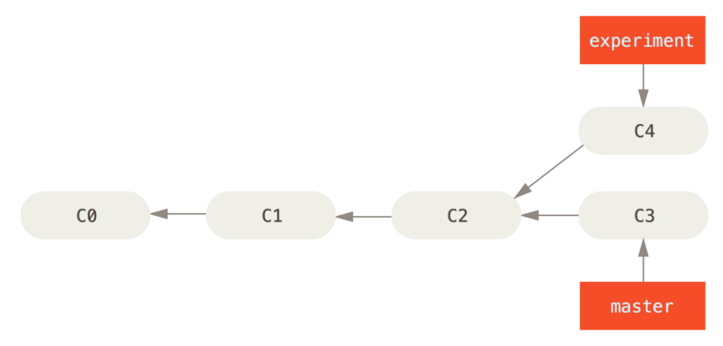
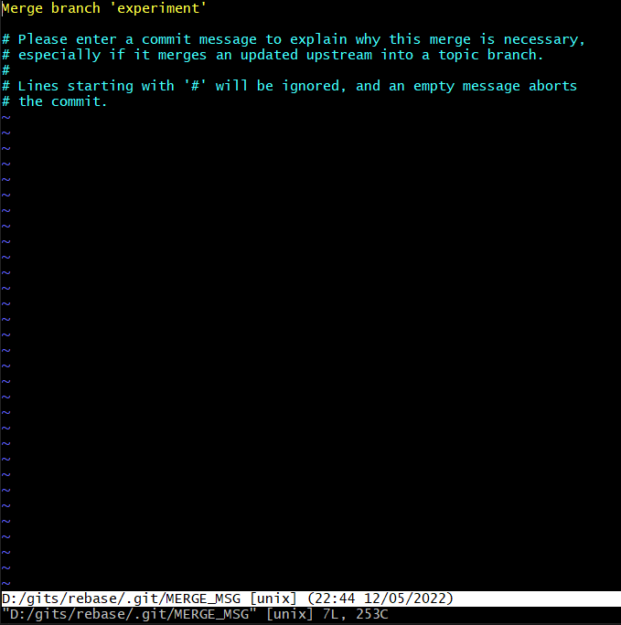
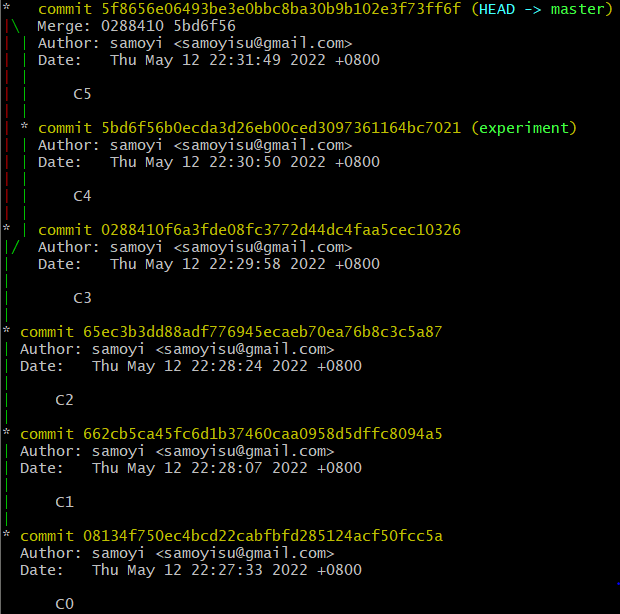
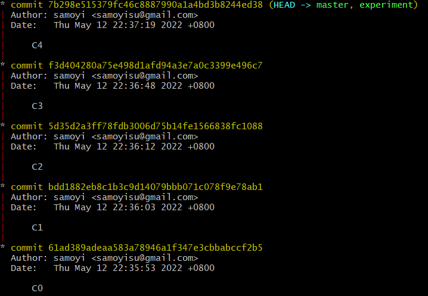

# Rebasing
In Git, there are two main ways to integrate changes from one branch into another: the `merge` and the `rebase`.


<!-- TOC -->

- [Rebasing](#rebasing)
    - [The Basic Rebase](#the-basic-rebase)
    - [More Interesting Rebases](#more-interesting-rebases)

<!-- /TOC -->


$ git rebase master
First, rewinding head to replay your work on top of it...
Applying: C4


之后 experiment 就是 01234了

$ git merge experiment
Updating f3d4042..7b298e5
Fast-forward
 experiiment.txt | 1 +
 1 file changed, 1 insertion(+)
 create mode 100644 experiiment.txt


## The Basic Rebase
1. 看下面分叉的两个分支
    
2. 之前介绍过，整合分支最容易的方法是 `merge` 命令。 它会把两个分支的最新快照（C3 和 C4）以及二者最近的共同祖先（C2）进行三方合并，合并的结果是生成一个新的快照（并提交）
    
3. 此时因为要把两个各自不同的分支进行 merge，所以 merge 时会出现要求填写 merge 信息的窗口
    
4. merge 之后再用 `git log --graph` 查看记录也能看到分支情况
    
5. 其实，还有一种方法：你可以提取在 C4 中引入的补丁和修改，然后在 C3 的基础上应用一次。在 Git 中，这种操作就叫做 rebase。 
6. 你可以使用 `rebase` 命令将提交到某一分支上的所有修改都移至另一分支上，就好像 replay 一样
    ```
    $ git checkout experiment
    ```
    ```
    $ git rebase master
    First, rewinding head to replay your work on top of it...
    Applying: C4
    ```
5. 它的原理是首先找到这两个分支（即当前分支 `experiment`、rebase 操作的目标基底分支 `master`） 的最近共同祖先 C2，然后对比当前分支相对于该祖先的历次提交，提取相应的修改并存为临时文件。然后将当前分支指向目标基底 C3, 最后以此将之前另存为临时文件的修改依序应用。从上面 rebase 命令的提示也可能看到是从 C4 那里 rebase 的
    
6. 现在 `experiment` 分支的提交记录不再是 C0-C1-C2-C4 了，变成了 C0-C1-C2-C3-C4。相当于把这个分叉移植到 `master` 分支后部了。
7. 现在回到 `master` 分支，因为两个分支已经没有分叉了，`experiment` 是在 `master` 之上更近一步，所以此时的合并就是 fast-forward 的
    ```
    $ git checkout master
    ```
    ```
    $ git merge experiment
    Updating f3d4042..7b298e5
    Fast-forward
     experiment.txt | 1 +
     1 file changed, 1 insertion(+)
     create mode 100644 experiiment.txt
    ```
    
    
    此时，C4' 指向的快照就和上面使用 `merge` 中 C5 指向的快照一模一样了。
8. 再看看现在 `git log --graph` 的分支情况，就不显示分叉了，好像不是并行开发一样
    
9. 这两种整合方法的最终结果没有任何区别，但是 rebase 使得提交历史更加整洁。你在查看一个经过 rebase 的分支的历史记录时会发现，尽管实际的开发工作是并行的，但它们看上去就像是串行的一样，提交历史是一条直线没有分叉。rebase 是将一系列提交按照原有次序依次应用到另一分支上，而 `merge` 是把最终结果合在一起。


## More Interesting Rebases
1. 看下面三个分支的提交
    
2. 假设你希望将 `client` 中的修改合并到主分支并发布，但暂时并不想合并 `server` 中的修改，因为它们还需要经过更全面的测试。这时，你就可以使用 `git rebase` 命令的 `--onto` 选项，选中在 `client` 分支里但不在 `server` 分支里的修改（即 C8 和 C9），将它们在 `master` 分支上重放
    ```
    $ git rebase --onto master server client
    ```
    以上命令的意思是：“取出 `client` 分支，找出它从 `server` 分支分歧之后的补丁，然后把这些补丁在 `master` 分支上重放一遍，让 `client` 看起来像直接基于 `master` 修改一样”
    
3. Now you can fast-forward your master branch
    ```
    $ git checkout master
    $ git merge client
    ```
    
4. Let’s say you decide to pull in your `server` branch as well. You can rebase the `server` branch onto the `master` branch without having to check it out first by running `git rebase <basebranch> <topicbranch>` — which checks out the topic branch (in this case, `server`) for you and replays it onto the base branch (`master`)
    ```
    $ git rebase master server
    ```
    
5. Then, you can fast-forward the base branch (`master`)
    ```
    $ git checkout master
    $ git merge server
    ```
6. You can remove the `client` and `server` branches because all the work is integrated and you don’t need them anymore
    ```
    $ git branch -d client
    $ git branch -d server
    ```
    