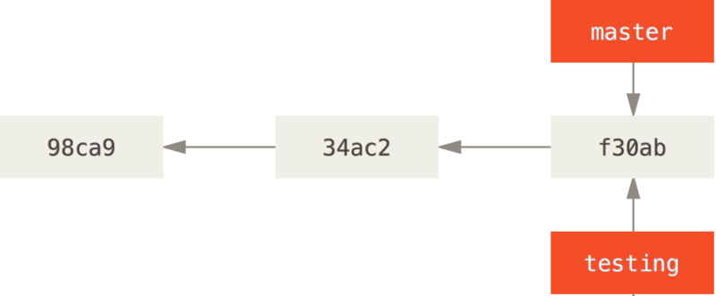
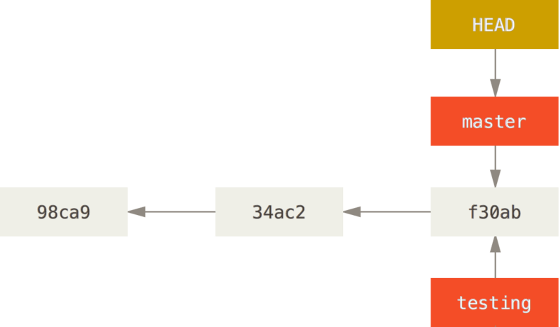

# 核心概念


<!-- TOC -->

- [核心概念](#核心概念)
    - [How Git stores its data](#how-git-stores-its-data)
        - [每次提交创建一个 commit object](#每次提交创建一个-commit-object)
        - [一个 commit object 会引用它之前提交的 commit object](#一个-commit-object-会引用它之前提交的-commit-object)
    - [Creating a New Branch](#creating-a-new-branch)
    - [Switching Branches](#switching-branches)

<!-- /TOC -->


## How Git stores its data
### 每次提交创建一个 commit object
1. 假设一个我们有一个目录里有三个文件，我们要暂存然后提交它们。
2. 暂存时会为每个文件计算一个 checksum（这个 checksum 和 snapshot 是什么关系？也是在暂存阶段生成的), 然后会把当前版本的 snapshot 保存到 Git 仓库中 （Git 使用 blob 对象来保存它们），最终三个文件的 checksum 加入到暂存区域等待提交。
3. 当提交时，git 会为项目的每个目录创建 checksum（本例只有一个目录）。因为目录是树状结构，所以各级目录的 checksum 也会被保存为一个树结构。看起来，在暂存阶段会为每个文件创建校验和，而在提交阶段会为每个目录创建校验和。
4. 然后 git 会创建一个 commit object，该对象除了保存一些元数据外，还包含一个指针指向树结构的根目录
    
5. 看起来，上图中蓝色和黄色的部分就是本次提交的 snapshot，其中最核心的就是目录和文件的 checksum。
6. Git doesn’t store data as a series of changesets or differences, but instead as a series of snapshots.

### 一个 commit object 会引用它之前提交的 commit object
1. 一个 commit object 除了引用本次提交的树结构外，还会引用之前提交的 commit object
    
2. 具体分为三种情况
    * 如果是初次提交，那就没有 commit object 可引用；
    * 如果是普通的再次提交，那就引用上次提交的那个 commit object；
    * 如果是 merge 之后的提交，那就会引用多个 commit object。
3. 这种对 commit object 的链式引用，就是分支操作的基础。Git 的分支其实就是指向某个 commit object 的可变指针。
4. 默认的分支名的 `master`，当你不断进行提交时，`master` 分支对应的指针会不断的向前移动，保持指向最新的 commit object
    
5. `master` 分支并没有什么特别总支出，它和其他分支都是一样的。只不过 `git init` 命令创建的默认分支名叫做 `master`。


## Creating a New Branch
1. Git 是怎么创建新分支的呢？很简单，它只是为你创建了一个可以移动的新的指针。比如，使用 `git branch testing` 创建一个 `testing` 分支时，会在当前所在的 commit object 上创建一个指针
    
2. 那么，Git 又是怎么知道当前在哪一个分支上呢？也很简单，它有一个名为 `HEAD` 的特殊指针，指向当前所在的本地分支。
3. 在本例中，此时你仍然在 `master` 分支上。 因为 `git branch` 命令仅仅创建一个新分支，并不会自动切换到新分支中去。
    
4. 你可以简单地使用 `git log` 命令查看各个分支当前所指的对象。 提供这一功能的参数是 `--decorate`
    ````
    $ git log --oneline --decorate
    f30ab (HEAD -> master, testing) add feature #32 - ability to add new formats to the central interface
    34ac2 Fixed bug #1328 - stack overflow under certain conditions
    98ca9 The initial commit of my project
    ````
    正如你所见，当前 `master` 和 `testing` 分支均指向校验和以 `f30ab` 开头的 commit object。


## Switching Branches
1. 要切换到一个已存在的分支，你需要使用 `git checkout` 命令。我们现在切换到新创建的 `testing` 分支去
    ```
    $ git checkout testing
    ```
2. 这样 `HEAD` 就指向 `testing` 分支了
    
3. 此时如果再提交一次，`testing` 分支向前移动了，但是 `master` 分支却没有，它仍然指向运行 `git checkout` 时所指的对象
    
4. 然后我们再通过 `git checkout master` 切回 `master` 分支
    
5. `git checkout master` 命令做了两件事。 一是使 `HEAD` 指回 `master` 分支，二是将工作目录恢复成 `master` 分支所指向的快照内容。 也就是说，你现在做修改的话，项目将始于一个较旧的版本。本质上来讲，这就是忽略 `testing` 分支所做的修改，以便于向另一个方向进行开发。
6. 我们现在在 `master` 分支上再做些修改。现在，这个项目的提交历史已经产生了分叉
    
7. 你可以简单地使用 `git log` 命令查看分叉历史。运行 `git log --oneline --decorate --graph --all`，它会输出你的提交历史、各个分支的指向以及项目的分支分叉情况
    ```
    $ git log --oneline --decorate --graph --all
    * c2b9e (HEAD, master) made other changes
    | * 87ab2 (testing) made a change
    |/
    * f30ab add feature #32 - ability to add new formats to the
    * 34ac2 fixed bug #1328 - stack overflow under certain conditions
    * 98ca9 initial commit of my project
    ```
8. 由于 Git 的分支实质上仅是包含所指对象校验和（长度为 40 的 SHA-1 值字符串）的文件，所以它的创建和销毁都异常高效。创建一个新分支就相当于往一个文件中写入 41 个字节（40 个字符和 1 个换行符）。不懂，只记录快照那怎么知道修改了哪些？
9. 通常我们会在创建一个新分支后立即切换过去，这可以用 `git checkout -b <newbranchname>` 一条命令搞定。
10. 在 Git 中，任何规模的项目都能在瞬间创建新分支。同时，由于每次提交都会记录父对象，所以寻找恰当的合并基础（共同祖先）也是同样的简单和高效。