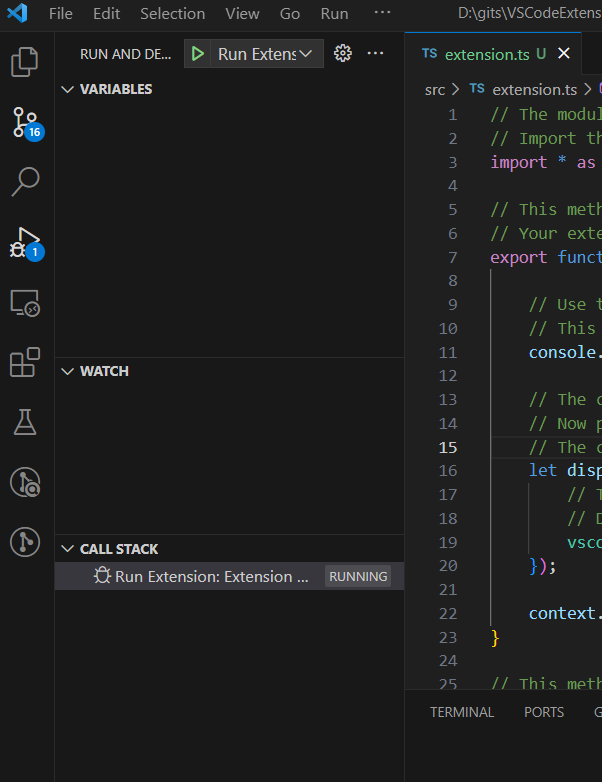
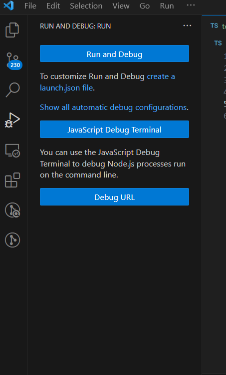
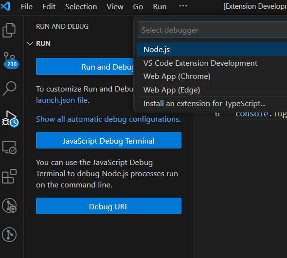

## 初次配置
1. 按照文档说明的初始化项目后，按照文档说的在编辑器里打开 `src/extension.ts` 然后 F5，没法启动 Extension Development Host。
2. 查到说 Python 版本低的原因，安装了新版本之后，环境变量配不好。重新安装，安装选项有一个是自动设置环境变量，勾选后 Python 可以正常使用。
3. 但 F5 还是不行。只能点击左侧工具栏的调试按钮，然后进一步点击里面的运行才行。


## 运行扩展时遇到的问题
1. 最初打开 `src/extension.ts` 然后点击 Run and Debug 后出现的侧边栏如下
    
    这时点击上面的 Run Extention 就可以正常的启动 Extension Development Host 然后可以正常的运行命令。
2. 但不知道什么原因，点击 Run and Debug 之后变成了下面这样的侧边栏
    
    这时点击 Run and Debug 后也会启动 Extension Development Host，但 Ctrl+Shift+P 里找到不到插件定义的命令。重启 VS Code 后虽然找到命令了，但运行时报错说命令没有注册。
3. 不过，好像上面中的 Run and Debug 不知在很么情况下点击后会有一个选项窗口，如下图
    
    还没试，不知道是不是选了 VS Code Extension Development 就能正常启动和正常执行命令。 


## 配置文件
### `package.json`
#### `contributes` 字段
1. 指明这个插件有哪些功能。
2. 例如插件 `vscode-markdown-toc` 的 `contributes`
    ```json
    "contributes": {
        "commands": [
            {
                "command": "extension.markdownToc",
                "title": "Generate TOC for Markdown"
            }
        ]
    }
    ```
    说明它有一个功能：通过执行 `extension.markdownToc` 命令为 Markdown 文件生成 TOC。
3. 又例如插件 `vscode-javascript` 的 `contributes`
    ```json
    "contributes": {
        "snippets": [
            {
                "language": "javascript",
                "path": "./snippets/snippets.json"
            }, 
            {
                "language": "typescript",
                "path": "./snippets/snippets.json"
            }, 
            {
                "language": "javascriptreact",
                "path": "./snippets/snippets.json"
            }, 
            {
                "language": "typescriptreact",
                "path": "./snippets/snippets.json"
            }, 
            {
                "language": "html",
                "path": "./snippets/snippets.json"
            }, 
            {
                "language": "vue",
                "path": "./snippets/snippets.json"
            }
        ]
    }
    ```
    说明它有 5 个 snippets 功能。


## References
* [VSCode 语法插件开发指南](https://juejin.cn/post/7124499906399567879)
