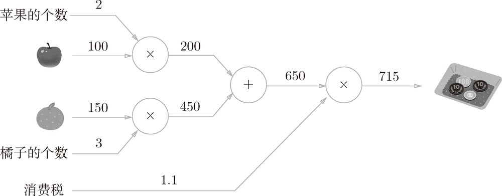
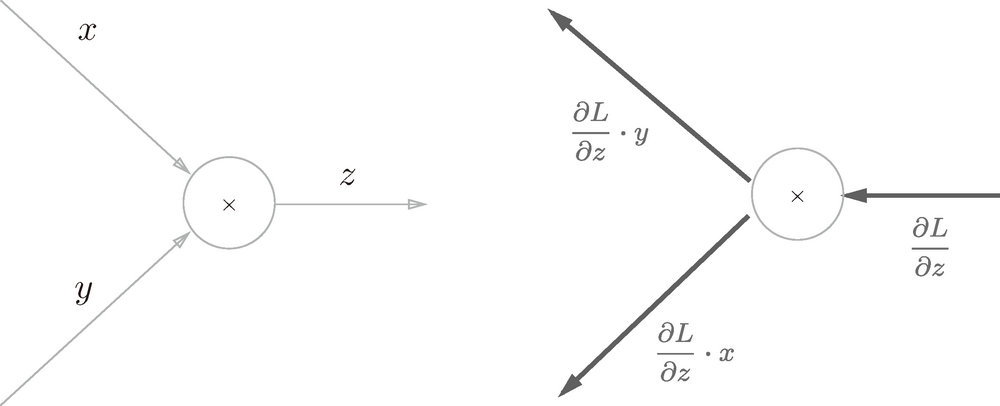
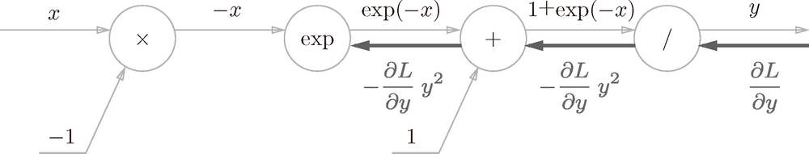
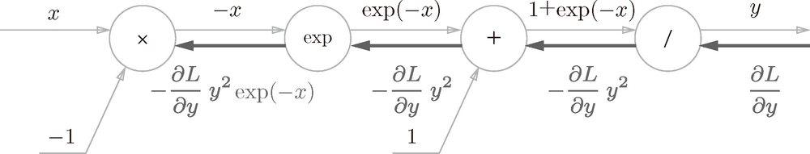
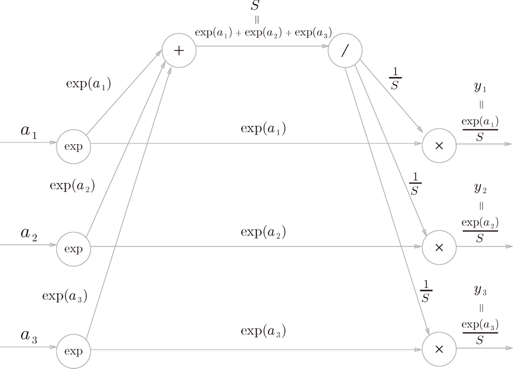

# Basic


<!-- TOC -->

- [Basic](#basic)
    - [0. 思想](#0-思想)
        - [正向与反向](#正向与反向)
    - [1 数值微分求梯度的局限](#1-数值微分求梯度的局限)
    - [2. 计算图](#2-计算图)
        - [2.1 为什么使用计算图](#21-为什么使用计算图)
        - [2.2 用计算图求解问题实例](#22-用计算图求解问题实例)
        - [2.3 局部计算](#23-局部计算)
        - [2.3 为何用计算图解题](#23-为何用计算图解题)
    - [3. 反向传播](#3-反向传播)
        - [3.1 计算图的反向传播](#31-计算图的反向传播)
        - [3.2 加法节点的反向传播](#32-加法节点的反向传播)
        - [3.3 乘法节点的反向传播](#33-乘法节点的反向传播)
        - [3.4 苹果的例子](#34-苹果的例子)
        - [3.5 反向传播为什么能求导](#35-反向传播为什么能求导)
            - [3.5.1 实际上就是复合函数求导](#351-实际上就是复合函数求导)
    - [4. 简单层的实现](#4-简单层的实现)
        - [4.1 乘法层的实现](#41-乘法层的实现)
        - [4.2 加法层的实现](#42-加法层的实现)
    - [5. 激活函数层的实现](#5-激活函数层的实现)
        - [5.1. ReLU层](#51-relu层)
        - [5.2 Sigmoid 层](#52-sigmoid-层)
            - [5.2.1 正向传播计算图](#521-正向传播计算图)
            - [5.2.2 反向传播步骤](#522-反向传播步骤)
                - [步骤1](#步骤1)
                - [步骤2](#步骤2)
                - [步骤3](#步骤3)
                - [步骤4](#步骤4)
            - [5.2.3 整理反向传播计算](#523-整理反向传播计算)
            - [5.2.4 Python 实现 Sigmoid 层](#524-python-实现-sigmoid-层)
    - [6.Affine/Softmax 层的实现](#6affinesoftmax-层的实现)
        - [6.1 Affine 层](#61-affine-层)
            - [6.1.1 正向传播](#611-正向传播)
            - [6.1.2 反向传播](#612-反向传播)
            - [6.1.3 看一下反向传播的过程](#613-看一下反向传播的过程)
        - [6.2 批版本的 Affine 层](#62-批版本的-affine-层)
            - [6.2.1 偏置的求导](#621-偏置的求导)
            - [6.2.2 Affine 的实现](#622-affine-的实现)
        - [6.3 Softmax-with-Loss 层](#63-softmax-with-loss-层)
            - [6.3.1 Softmax 层计算图](#631-softmax-层计算图)
            - [6.3.2 Softmax-with-Loss 层计算图的推导](#632-softmax-with-loss-层计算图的推导)
                - [6.3.2.1 Softmax 层正向传播](#6321-softmax-层正向传播)
                - [6.3.2.2 Cross entropy error 层正向传播](#6322-cross-entropy-error-层正向传播)
                - [6.3.2.3 Cross entropy error 层反向传播](#6323-cross-entropy-error-层反向传播)
                - [6.3.2.4 Softmax 层反向传播](#6324-softmax-层反向传播)
                    - [步骤 1](#步骤-1)
                    - [步骤 2](#步骤-2)
                    - [步骤 3](#步骤-3)
                    - [步骤 4](#步骤-4)
            - [6.3.3 对反向传播结果的分析](#633-对反向传播结果的分析)
            - [6.3.4 Softmax-with-Loss 层的实现](#634-softmax-with-loss-层的实现)
    - [7. 误差反向传播法的实现](#7-误差反向传播法的实现)
        - [7.1 神经网络学习的全貌图](#71-神经网络学习的全貌图)
        - [7.2 对应误差反向传播法的神经网络的实现 TODO 重新看](#72-对应误差反向传播法的神经网络的实现-todo-重新看)
        - [7.3 误差反向传播法的梯度确认](#73-误差反向传播法的梯度确认)
        - [7.4 使用误差反向传播法的学习](#74-使用误差反向传播法的学习)

<!-- /TOC -->


## 0. 思想
1. 反向传播的过程，其实求偏导的过程。2.4 的例子，其实就是 $y = price * count * tax$ 三个自变量求偏导。Sigmoid 函数反向传播求导的结果，和下面数学方法求导的结果也是一样的（以 $e$ 为底的指数函数的导数还是它本身）
    
2. 对比一下计算图反向传播求导的方法和上面数学法求导的过程，特别是看到 2.4 中求导的过程，可以看到计算图的求导很容易理解导数的本质，是一步步计算每个节点对之后节点的影响方式：税率对不含税总价对含税总价的影响->单价和数量（间接的通过不含税总价）对含税总价的影响。

### 正向与反向
1. 正向传播，实际上是根据因来计算果。我们掌握了若干个因，然后算出来结果是什么；而反向传播，则是根据结果，来反推原因对结果的影响。
2. 正向传播关注的不是原因，它关心的是结果，它是利用原因来结算结果；反向传播是在知道结果和原因的情况下，推导因果关系。
3. 正向传播是为了获得事物的结果；反向传播是为了推演因果律。


## 1 数值微分求梯度的局限
通过数值微分计算神经网络的权重参数的梯度虽然简单，也容易实现，但缺点是计算上比较费时间。不懂，为什么


## 2. 计算图
### 2.1 为什么使用计算图 
1. 要正确理解误差反向传播法，有两种方法：一种是基于数学式；另一种是基于 **计算图**（computational graph）。
2. 前者是比较常见的方法，机器学习相关的图书中多数都是以数学式为中心展开论述的。因为这种方法严密且简洁，所以确实非常合理。
3. 但如果一上来就围绕数学式进行探讨，会忽略一些根本的东西，止步于式子的罗列。因此，这里通过计算图，直观地理解误差反向传播法。然后，再结合实际的代码加深理解。

### 2.2 用计算图求解问题实例
1. 问题 1：太郎在超市买了 2 个 100 日元一个的苹果，消费税是 10%，请计算支付金额。
    
2. 问题 2：太郎在超市买了 2 个苹果、3 个橘子。其中，苹果每个 100 日元，橘子每个 150 日元。消费税是 10%，请计算支付金额。
    
3. 构建了计算图后，从左向右进行计算。就像电路中的电流流动一样，计算结果从左向右传递。到达最右边的计算结果后，计算过程就结束了。
4. 这里的 “从左向右进行计算” 是一种正方向上的传播，简称为 **正向传播**（forward propagation）。
5. 正向传播是从计算图出发点到结束点的传播。既然有正向传播这个名称，当然也可以考虑反向（从图上看的话，就是从右向左）的传播。
6. 实际上，这种传播称为 **反向传播**（backward propagation）。反向传播将在接下来的导数计算中发挥重要作用。

### 2.3 局部计算
1. 计算图的特征是可以通过传递“局部计算”获得最终结果。局部计算是指，无论全局发生了什么，都能只根据与自己相关的信息输出接下来的结果。
2. 我们用一个具体的例子来说明局部计算。比如，在超市买了 2 个苹果和其他很多东西。
    
3. 假设（经过复杂的计算）购买的其他很多东西总共花费 4000 日元。这里的重点是，各个节点处的计算都是局部计算。
4. 这意味着，例如苹果和其他很多东西的求和运算（4000 + 200 → 4200）并不关心 4000 这个数字是如何计算而来的，只要把两个数字相加就可以了。
5. 换言之，各个节点处只需进行与自己有关的计算（在这个例子中是对输入的两个数字进行加法运算），不用考虑全局。
6. 综上，计算图可以集中精力于局部计算。无论全局的计算有多么复杂，各个步骤所要做的就是对象节点的局部计算。虽然局部计算非常简单，但是通过传递它的计算结果，可以获得全局的复杂计算的结果。

### 2.3 为何用计算图解题
计算图的优点是，可以通过正向传播和反向传播高效地计算各个变量的导数值。下述。


## 3. 反向传播
### 3.1 计算图的反向传播
1. 假设存在 $y = f (x)$ 的计算，这个计算的反向传播如下图所示
    
2. 反向传播的计算顺序是，将信号 E 乘以节点的局部导数 $(\frac{\partial y}{\partial x})$，然后将结果传递给下一个节点。
3. 这里所说的局部导数是指正向传播中 $y = f (x)$ 的导数，也就是 $y$ 关于 $x$ 的导数 $\large \frac{\partial y}{\partial x}$。比如，假设 $y=f(x)=x^2$，则局部导数为 $ {\large \frac{\partial y}{\partial x}} = 2x$。把这个局部导数乘以上游传过来的值（本例中为 E），然后传递给前面的节点。

### 3.2 加法节点的反向传播
1. 假设有下面的加法运算：某个计算求出一个 $x$ 值，另一个计算求出一个 $y$ 值，它们相加得出 $z$ 值，也可以说 $z$ 是关于 $x$ 和 $y$ 的函数 $z(x, y)$；$z$ 再参与一个函数 $L$ 的计算 
    
2. 它表示为函数就是 $L = f(z(x, y))$。其中函数 $z(x, y) = x + y$，函数 $f(z)$ 是对 $z$ 进行某种计算。
3. 使用链式法则求导：$\large \frac{\partial L}{\partial x} = \frac{\partial L}{\partial z} \frac{\partial z}{\partial x}$，$\large \frac{\partial L}{\partial y} = \frac{\partial L}{\partial z} \frac{\partial z}{\partial y}$。
4. 又因为函数 $z$ 是两数相加，所以 $\large \frac{\partial z}{\partial x}$ 和 $\large \frac{\partial z}{\partial y}$ 的值都是 1。
5. 所以：$\large \frac{\partial L}{\partial x} = \frac{\partial L}{\partial z}$，$\large \frac{\partial L}{\partial y} = \frac{\partial L}{\partial z}$。
6. 反向传播求导图示如下
    
7. 也就是说，使用反向传播求导时，对于加法运算的局部，每个加数对于最终结果的导数都是上游传过来的那个导数。
8. 假设有 “10 + 5 = 15” 这一计算，并且反向传播时，从 15 参与的某种运算对 15 求导是 1.3。用计算图表示的话
    

### 3.3 乘法节点的反向传播
1. 考虑 $z = xy$，根据求导的乘积法则，可以知道 $\frac{\partial z}{\partial x}=y$ 和 $\frac{\partial z}{\partial y}=x$ ，所以反向传播的计算如下
    
2. 一个具体的例子。比如，假设有 “10 × 5 = 50” 这一计算，反向传播时，如果从上游传来的导数是 1.3，用计算图表示的话
    
3. 因为乘法的反向传播会乘以输入信号的翻转值，所以各自可按 $1.3 × 5 = 6.5$、$1.3 × 10 = 13$ 计算。
4. 加法的反向传播只是将上游的偏导传给下游，并不需要正向传播的输入信号。但是，乘法的反向传播需要正向传播时的输入信号值。因此，实现乘法节点的反向传播时，要保存正向传播的输入信号。

### 3.4 苹果的例子
1. 再来思考一下购买苹果的例子（2 个苹果和消费税）。这里要解的问题是苹果的价格、苹果的个数、消费税这 3 个变量各自如何影响最终支付的金额。
2. 这个问题相当于求 “支付金额关于苹果的价格的导数”、“支付金额关于苹果的个数的导数” 和 “支付金额关于消费税的导数”。
3. 用计算图的反向传播来解的话，求解过程如下图所示
    
4. 如前所述，乘法节点的反向传播会将输入信号翻转后传给下游。从上图的结果可知，苹果的价格的导数是 2.2，苹果的个数的导数是 110，消费税的导数是 200。

### 3.5 反向传播为什么能求导
1. 以苹果的例子来分析。分析为什么反向传播可以求得三个参数（苹果单价、苹果数量、消费税）对最终结果的导数。
2. 反向传播最初的输入是 1，这个 1 表示这里的变量对最终结果的导数。这里的变量，就是支付金额，而最终的结果，也是支付金额，所以支付金额对最终结果的导数就是 1。
3. 第一步反向，可以求出当苹果总价是 200 时、消费税是 1.1 时，支付金额关于苹果总价和消费税的导数，即 1.1 和 200。这一步就已经求出消费税这个参数的导数了。
4. 现在要求苹果单价和苹果数量对最终结果支付金额的导数。
5. 可以知道，在苹果单价是 100 时、苹果数量是 2 时，苹果总价关于苹果单价和苹果数量的导数分别是 2 和 100。
6. 也就是说，此时苹果单价加 1，苹果总价就加 2；苹果数量加 1，苹果总价就加 100。
7. 而此时，支付金额关于苹果总价的导数又是 1.1。也就是说，苹果总价此时加 1，则支付金额就增加 1.1。
8. 综合起来如果此时苹果单价加 1，苹果总价就加 2，支付金额就加 2.2；苹果数量加 1，苹果总价就加 100，支付金额就加 110.
9. 所以，支付金额关于苹果单价和苹果数量的导数就是 2.2 和 110。

#### 3.5.1 实际上就是复合函数求导
1. 第一步反向传播求得了关于苹果总价和消费税的导数，苹果总价又是关于苹果单价和苹果数量的函数。所以这其实是一个复合函数 $f(g(x))$。
2. 其中，$g(price, amount) = price * amount$，$f(sum, tax) = sum * tax$。所以，函数 $f$ 的导数就是 $f'(g(x))g'(x)$。
3. 上面的第一步反向传播，就是对函数 $f$ 求关于总价和消费税的偏导。接下来第二步的的反向传播，就是要求，在苹果单价是 100、苹果数量是 2 时，函数 $g$ 求关于单价和数量的偏导。
4. 其实就这个例子，是可以通过解析法求导的。可以求导出价格的导数是 $amount * tax$，数量的导数是 $price * tax$，消费税的导数是 $price * amount$。但实际的情况中函数会很复杂，只能通过反向传播求导并梯度下降。


## 4. 简单层的实现
1. 本节将用 Python 实现前面购买苹果的例子。这里，我们把要实现的计算图的乘法节点称为 “乘法层”（MulLayer），加法节点称为 “加法层”（AddLayer）。
2. 这里所说的 “层” 是神经网络中功能的单位。比如，负责 sigmoid 函数的 Sigmoid、负责矩阵乘积的 Affine 等，都以层为单位进行实现。
3. 层的实现中有两个共通的方法（接口）`forward()` 和` backward()`。`forward()` 对应正向传播，`backward()` 对应反向传播。

### 4.1 乘法层的实现
1. 代码实现
    ```py
    class MulLayer:
        def __init__(self):
            # x 和 y 用于保存正向传播时的输入值
            self.x = None
            self.y = None

        # 接收 x 和 y 两个参数，将它们相乘后输出
        def forward(self, x, y):
            self.x = x
            self.y = y
            out = x * y

            return out

        # 将从上游传来的导数（dOut）乘以正向传播的翻转值，然后传给下游
        def backward(self, dOut):
            dx = dOut * self.y  # 翻转 x 和 y
            dy = dOut * self.x

            return dx, dy
    ```
2. 前面说了，乘法的反向传播需要正向传播时的输入信号值，所以乘法的正向传播 `forward` 方法中会保存输入的两个乘数。
3. 现在我们使用 `MulLayer` 实现前面的购买苹果的例子（2 个苹果和消费税）
    ```py
    appleUnitPrice = 100
    apple_count = 2
    taxRate = 1.1

    # 因为实例要保存各自的乘数，所以要实例化两个乘法层
    mul_apple_layer = MulLayer()
    mul_tax_layer = MulLayer()

    # forward
    priceBeforeTax = mul_apple_layer.forward(appleUnitPrice, apple_count)
    priceAfterTax = mul_tax_layer.forward(priceBeforeTax, taxRate)
    print(priceAfterTax)  # 220

    # backward
    dPrice = 1
    dPriceBeforeTax, dTax = mul_tax_layer.backward(dPrice)
    dAppleUnitPrice, dAppleCount = mul_apple_layer.backward(dPriceBeforeTax)
    print(dAppleUnitPrice, dAppleCount, dTax)  # 2.2 110 200
    ```

### 4.2 加法层的实现
1. 加法的反向传播只是将上游的偏导传给下游，并不需要正向传播的输入信号，所以不需要保存加数。
2. 实现加法层
    ```py
    class AddLayer:
        def __init__(self):
            pass # 什么也不运行

        def forward(self, x, y):
            out = x + y
            return out

        def backward(self, dOut):
            dx = dOut * 1
            dy = dOut * 1
            return dx, dy
    ```
3. 使用加法层和乘法层，实现下图所示的购买 2 个苹果和 3 个橘子的例子
    
    ```py
    appleUnitPrice = 100
    appleCount = 2
    orangeUnitPrice = 150
    orangeCount = 3
    taxRate = 1.1

    # layer 
    mul_apple_layer = MulLayer()
    mul_orange_layer = MulLayer()
    add_apple_orange_layer = AddLayer()
    mul_tax_layer = MulLayer()

    # forward
    appleTotalPrice = mul_apple_layer.forward(appleUnitPrice, appleCount)
    orangeTotalPrice = mul_orange_layer.forward(orangeUnitPrice, orangeCount)
    totalPriceBeforeTax = add_apple_orange_layer.forward(appleTotalPrice, orangeTotalPrice)
    totalPriceAfterTax = mul_tax_layer.forward(totalPriceBeforeTax, taxRate)

    # backward
    dPrice = 1
    dTotalPriceBeforeTax, dTax = mul_tax_layer.backward(dPrice)
    dAppleTotalPrice, dOrangeTotalPrice = add_apple_orange_layer.backward(dTotalPriceBeforeTax)
    dOrangeUnitPrice, dOrangeCount = mul_orange_layer.backward(dOrangeTotalPrice)
    dAppleUnitPrice, dAppleCount = mul_apple_layer.backward(dAppleTotalPrice)

    print(totalPriceAfterTax)  # 715
    print(dAppleCount, dAppleUnitPrice, dOrangeUnitPrice, dOrangeCount, dTax)  
    # 110 2.2 3.3 165 650
    ```


## 5. 激活函数层的实现
### 5.1. ReLU层
1. 激活函数 ReLU（Rectified Linear Unit）在 $x > 0$ 导数为 1，在 $x <= 0$ 时导数为 0。
2. 因此，如果正向传播时的输入 x 大于 0，则反向传播会将上游的值原封不动地传给下游；反过来，如果正向传播时的 x 小于等于 0，则反向传播中传给下游的信号将停在此处。
3. 用计算图表示的话
    
4. 现在我们来实现 ReLU 层。在神经网络的层的实现中，一般假定 `forward()` 和 `backward()` 的参数是 `NumPy` 数组。
    ```py
    class Relu:
        def __init__(self):
            self.mask = None

        def forward(self, x):
            self.mask = (x <= 0)
            out = x.copy()
            out[self.mask] = 0
            return out

        def backward(self, dout):
            dout[self.mask] = 0
            dx = dout
            return dx
    ```
5. Relu 类有实例变量 `mask`。这个变量 `mask` 是由 `True`/`False` 构成的 `NumPy` 数组，它会把正向传播时的输入 `x` 的元素中小于等于 0 的地方保存为 `True`，其他地方（大于 0 的元素）保存为 `False`。如下例所示，
    ```py
    >>> x = np.array( [[1.0, -0.5], [-2.0, 3.0]] )
    >>> print(x)
    [[ 1.  -0.5]
    [-2.   3. ]]
    >>> mask = (x <= 0)
    >>> print(mask)
    [[False  True]
    [ True False]]
    ```
6. 如果正向传播时的输入值小于等于 0，则反向传播的值为 0。因此，反向传播中会使用正向传播时保存的 `mask`，将从上游传来的 `dout` 的 `mask` 中的元素为 `True` 的地方设为 0。

### 5.2 Sigmoid 层 
#### 5.2.1 正向传播计算图


#### 5.2.2 反向传播步骤
##### 步骤1
1.  “/” 节点表示 $y= \Large \frac{1}{x}$，它的导数可以解析性地表示为下式。

    $\begin{aligned}\frac{\partial y}{\partial x}&=-\frac{1}{x^2}=-y^2\end{aligned}$

2. 反向传播时，会将上游的值乘以 $-y^2$ 后，再传给下游。计算图如下
    

##### 步骤2
1. “+” 节点将上游的值原封不动地传给下游。计算图如下所示
    

##### 步骤3
1. “exp” 节点表示 $y = exp(x)$，以 $e$ 为底的指数函数的导数还是它本身。它的导数由下式表示

    $\frac{\partial y}{\partial x}=\exp(x)$

2. 计算图如下
    

##### 步骤4
1. “×” 节点将正向传播时的值翻转后做乘法运算。因此，这里要乘以 -1
    

#### 5.2.3 整理反向传播计算
1. 从上图的结果可知，反向传播的输出为 $\frac{\partial L}{\partial y}y^2\exp(-x)$，这个值会传播给下游的节点。
2. 这里要注意，$\frac{\partial L}{\partial y}y^2\exp(-x)$ 这个值只根据正向传播时的输入 $x$ 和输出 $y$ 就可以算出来。因此，上面的计算图可以画成下图的集约化的 “sigmoid” 节点
    
3. 简洁版的计算图可以省略反向传播中的计算过程，因此计算效率更高。此外，通过对节点进行集约化，可以不用在意 Sigmoid 层中琐碎的细节，而只需要专注它的输入和输出。
4. 另外 $\frac{\partial L}{\partial y}y^2\exp(-x)$ 可以进一步整理如下。

    $\begin{aligned}\frac{\partial L}{\partial y}y^2\exp(-x)&=\frac{\partial L}{\partial y}\frac{1}{(1+\exp(-x))^2}\exp(-x)\\&=\frac{\partial L}{\partial y}\frac{1}{1+\exp(-x)}\frac{\exp(-x)}{1+\exp(-x)}\\&=\frac{\partial L}{\partial y}y(1-y)\end{aligned}$

5. 进一步更新计算图如下
    
6. 顺便，根据导数商法则以及 $({\rm e}^{-x})'=-{\rm e}^{-x}$，也可以直接求出 sigmoid 函数的导数 $\sigma'(x)=\sigma(x)(1-\sigma(x))$。推导如下：
    $$
        因为 y = \frac{1}{1 + e^{-x}} \\
        所以 \frac{dy}{dx} = \frac{1' \times (1 + e^{-x}) - 1 \times (1 + e^{-x})'}{(1 + e^{-x})^2} \\
        = \frac{-(1 + e^{-x})'}{(1 + e^{-x})^2} \\
        = \frac{e^{-x}}{(1 + e^{-x})^2} \\
        = \frac{e^{-x}}{1 + e^{-x}} \times \frac{1}{1 + e^{-x}} \\
        = \frac{1 + e^{-x} - 1}{1 + e^{-x}} \times y \\
        = (1 - y)y
    $$

#### 5.2.4 Python 实现 Sigmoid 层
```py
class Sigmoid:
    def __init__(self):
        self.out = None

    def forward(self, x):
        out = 1 / (1 + np.exp(-x))
        self.out = out
        return out

    def backward(self, dout):
        dx = dout * (1.0 - self.out) * self.out
        return dx
```


## 6.Affine/Softmax 层的实现
### 6.1 Affine 层
#### 6.1.1 正向传播
1. 神经网络的正向传播中进行的矩阵的乘积运算在几何学领域被称为 **仿射变换**（affine transformation）。因此，这里将进行仿射变换的处理实现为 “Affine 层”。
2. 几何中，仿射变换包括一次线性变换和一次平移，分别对应神经网络的加权和运算与加偏置运算。
3. 将这里进行的求矩阵的乘积与偏置的和的运算用计算图表示出来
    
4. 要注意 $\boldsymbol{X}$、$\boldsymbol{W}$、$\boldsymbol{B}$ 是矩阵（多维数组）。之前我们见到的计算图中各个节点间流动的是标量，而这个例子中各个节点间传播的是矩阵。

#### 6.1.2 反向传播
1. 上面计算图反向传播求偏导的结果如下（TODO 关于矩阵导数的知识）

    $\begin{aligned}\frac{\partial L}{\partial\boldsymbol{X}}&=\frac{\partial L}{\partial\boldsymbol{Y}}\cdot\boldsymbol{W}^{{\rm T}}\\\frac{\partial L}{\partial\boldsymbol{W}}&=\boldsymbol{X}^{{\rm T}}\cdot\frac{\partial L}{\partial\boldsymbol{Y}}\end{aligned}$
    
2. 注意上面不是乘法而是点积运算，所以顺序不能颠倒。
3. 上式中 $\boldsymbol{W}^{{\rm T}}$ 的 $T$ 表示转置。转置操作会把 $\boldsymbol{W}$ 的元素 (i, j) 换成元素 (j, i)。用数学式表示的话，可以写成下面这样。

    $\begin{aligned}\boldsymbol{W}=\begin{pmatrix}w_{11}&w_{12}&w_{13}\\w_{21}&w_{22}&w_{23}\end{pmatrix}&\\\boldsymbol{W}^{{\rm T}}\begin{pmatrix}w_{11}&w_{21}\\w_{12}&w_{22}\\w_{13}&w_{23}\end{pmatrix}&\end{aligned}$

4. 现在，我们根据上面求偏导的公式，尝试写出计算图的反向传播
    

#### 6.1.3 看一下反向传播的过程
1. Affine 层的最终输出 $\boldsymbol{Y}$，对最终结果的导数是 $\frac{\partial L}{\partial\boldsymbol{Y}}$。没问题。
2. 下一步是加偏置运算。加法节点中两个变量的偏导都是 1，所以偏置 $\boldsymbol{B}$ 和 $\boldsymbol{X}\cdot\boldsymbol{W}$ 的导数都是 $\Large \frac{\partial L}{\partial\boldsymbol{Y}}$。
3. 这里可以想象，一维矩阵偏置 $\boldsymbol{B}$ 如果其中某一个值加 1，那么同为一维矩阵 $\boldsymbol{Y}$ 对应的那个值肯定也是加 1。 
4. 最后一步是输入和权重的点积运算，前面已经给出了输入和权重的导数。可以看出来，点积运算求偏导和标量乘法运算求偏导有些类似，只不过导数不是直接的另一方，而是另一方的转置。
5. 而且还要注意因为是点积运算，所以顺序不能颠倒。

### 6.2 批版本的 Affine 层
1. 前面介绍的 Affine 层的输入 $\boldsymbol{X}$ 是以单个数据为对象的。现在我们考虑 N 个数据一起进行正向传播的情况，也就是批版本的 Affine 层。
2. 先给出批版本的 Affine层的计算图
    
3. 与刚刚不同的是，现在输入 $\boldsymbol{X}$ 的形状是 (N, 2)。之后就和前面一样，在计算图上进行单纯的矩阵计算。
4. 反向传播时，如果注意矩阵的形状，就可以和前面一样推导出 $\Large \frac{\partial L}{\partial\boldsymbol{X}}$ 和 $\Large \frac{\partial L}{\partial\boldsymbol{W}}$。

#### 6.2.1 偏置的求导
1. 加上偏置时，需要特别注意。正向传播时，偏置被加到 $\boldsymbol{X}\cdot\boldsymbol{W}$ 的各个数据上。比如，N = 2（数据为 2 个）时，偏置会被分别加到这 2 个数据（各自的计算结果）上，具体的例子如下所示。
    ```py
    >>> X_dot_W = np.array([[0, 0, 0], [10, 10, 10]])
    >>> B = np.array([1, 2, 3])
    >>>
    >>> X_dot_W
    array([[ 0,  0,  0],
        [ 10, 10, 10]])
    >>> X_dot_W + B
    array([[ 1,  2,  3],
        [11, 12, 13]])
    ```
2. 前面单个数据的情况中，$\boldsymbol{X}\cdot\boldsymbol{W}$ 是一维矩阵，一维矩阵的偏置 $\boldsymbol{B}$ 是加到这个一维矩阵上的。
3. 所以，如果 $\boldsymbol{B}$ 中有一个元素加 1，结果的一维矩阵 $\boldsymbol{Y}$ 只会有一个元素加 1。
4. 而这里的批版本中，$\boldsymbol{X}\cdot\boldsymbol{W}$ 是一个二维矩阵，一维矩阵的偏置 $\boldsymbol{B}$ 是加到这个二维矩阵上的。
5. 这时，$\boldsymbol{B}$ 的每一个值都会加到对应的  $\boldsymbol{N}$ 条数据的每一个对应的元素上。
6. 所以，$\boldsymbol{B}$ 的每一个值对 $\boldsymbol{Y}$ 的导数都是 $\boldsymbol{N}$。也就是说，$\boldsymbol{B}$ 的某一个元素增加了 1，那么 $\boldsymbol{Y}$ 上对应的那  $\boldsymbol{N}$ 个元素都会增加 1。
7. 但是要注意，我们这里不是在求 $\boldsymbol{B}$ 对 $\boldsymbol{Y}$ 的导数，而是在求 $\boldsymbol{B}$ 对最终结果的导数。看下面的例子
    ```py
    >>> dY = np.array([[1, 2, 3,], [4, 5, 6]])
    >>> dY
    array([[1, 2, 3],
        [4, 5, 6]])
    >>>
    >>> dB = np.sum(dY, axis=0)
    >>> dB
    array([5, 7, 9])
    ```
8.  $\boldsymbol{Y}$ 对最终结果的导数是 `np.array([[1, 2, 3,], [4, 5, 6]])`。也就是说，`Y[0][0]` 的 “导数” 是 1，`Y[1][0]` 的 “导数” 是 4。
9. 那么此时如果 `B[0]` 增加了 1，则 `Y[0][0]` 和 `Y[1][0]` 都会分别增加 1，而它俩对最终结果的导数是 1 和 4，所以最终结果的增加就是 $1+4$。
10. 不懂，为什么能直接这样加呢？也就是说，`B[0]` 增加 1，最终结果增加 5。但最终结果可能还是个矩阵或者向量，比如你不能说向量从 `[1, 2, 3]` 变为 `[6, 2, 3]` 是增加了 5 吧？一个是向量，一个是标量。除非最终结果是对矩阵所有元素求和。

#### 6.2.2 Affine 的实现
```py
class Affine:
    def __init__(self, W, b):
        self.W = W
        self.b = b
        self.x = None
        self.dW = None
        self.db = None

    def forward(self, x):
        self.x = x
        out = np.dot(x, self.W) + self.b

        return out

    def backward(self, dout):
        dx = np.dot(dout, self.W.T)
        self.dW = np.dot(self.x.T, dout)
        self.db = np.sum(dout, axis=0)

        return dx
```

### 6.3 Softmax-with-Loss 层
1. softmax 函数会将输入值正规化之后再输出。比如手写数字识别时，Softmax 层的输出如图
    
2. 神经网络中进行的处理有 **推理**（inference）和 **学习** 两个阶段。神经网络的推理通常不使用 Softmax 层。比如，用上图的网络进行推理时，会将最后一个 Affine 层的输出作为识别结果。
3. 神经网络中未被正规化的输出结果（Softmax 层前面的 Affine 层的输出）有时被称为 “得分”(logits)
。也就是说，当神经网络的推理只需要给出一个答案的情况下，因为此时只对得分最大值感兴趣，所以不需要 Softmax 层。不过，神经网络的学习阶段则需要 Softmax 层。

#### 6.3.1 Softmax 层计算图
1. 下面来实现 Softmax 层。考虑到这里也包含作为损失函数的交叉熵误差（cross entropy error），所以称为 “Softmax-with-Loss 层”。Softmax-with-Loss 层（Softmax 函数和交叉熵误差）的计算图如下
    
    * softmax 激活函数：$\Large y_k=\frac{\exp(a_k)}{\sum_{i=1}^n\exp(a_i)}$   
    * cross entropy error 损失函数：$E=-\sum_kt_k\log y_k$
2. 上面的计算图可以简化成下图
    
3. 这个简化的计算图中，假设要进行 3 类分类，从前面的层接收 3 个输入（得分）。Softmax 层将输入 ($a_1$,$a_2$,$a_3$) 正规化，输出 ($y_1$,$y_2$,$y_3$)。Cross Entropy Error 层接收 Softmax 的输出 ($y_1$,$y_2$,$y_3$) 和监督标签 ($t_1$,$t_2$,$t_3$)，从这些数据中输出损失 $L$。

#### 6.3.2 Softmax-with-Loss 层计算图的推导
##### 6.3.2.1 Softmax 层正向传播


1. 三个输入分别进行指数运算。
2. 三个指数运算的结果相加得到 $S$，再进行被 1 除的运算，作为分母。
3. 三个指数结果再分别乘以 $\large \frac{1}{S}$ 作为分子，得到结果。

##### 6.3.2.2 Cross entropy error 层正向传播


##### 6.3.2.3 Cross entropy error 层反向传播


1. 因为该层的输出就是最终结果，即导数为 1，所以反向传播的初始值就是 1。
2. 以及根据自然对数的导数公式 $\Large \frac{{\rm d}}{{\rm d}x} \large {\log_{{\rm e}}(x)} = \Large \frac{1}{x}$，最后一步的导数就是 $\Large \frac{1}{y_1}$ 这样的。

##### 6.3.2.4 Softmax 层反向传播
###### 步骤 1

接收前面的层（Cross Entropy Error 层）的反向传播的值传过来，并对乘法的一条分支进行反向传播。之后也会计算另一条。

###### 步骤 2


1. 这一步要进行 $\large \frac{1}{S}$ 节点的反向传播。函数 $\large \frac{1}{S}$ 的对 $S$ 导数是 $\large -\frac{1}{S^2}$。
2. 正向传播时若有分支流出，则反向传播时它们的反向传播的值会相加。因为自变量作用于多个分支，自变量增加了一点，三个分支对应的增加一些，这些分支增加的总和就是最终结果的增加值。
3. 因为正向传播时 $\large \frac{1}{S}$ 的结果流向了三个分支，因此，这里分成了三支的反向传播的值 $(-t_1S,-t_2S,-t_3S)$ 会被求和。
4. 也就是说，$\large \frac{1}{S}$ 第一条分支的值如果增加 1，则最终结果增加 $-t_1S$，$\large \frac{1}{S}$ 第二条分支的值如果增加 1，则最终结果增加 $-t_2S$，$\large \frac{1}{S}$ 第三条分支的值如果增加 1，则最终结果增加 $-t_3S$，所以综合起来，$\large \frac{1}{S}$ 增加 1 的话，最终结果就增加 $-S(t_1 + t_2 + t_3)$。
5. 而这里 $(t_1,t_2,t_3)$ 是监督标签，也是 one-hot 向量。one-hot 向量意味着 $(t_1,t_2,t_3)$中只有一个元素是 1，其余都是 0。因此，$(t_1,t_2,t_3)$ 的和为 1。
6. 所以，$\large \frac{1}{S}$ 增加 1 的话，最终结果就增加 $-S$。也就是说，$\large \frac{1}{S}$ 对结果的导数是 $-S$。
7. 注意，这时 $\large \frac{1}{S}$ 对最终结果的导数。但我们这里要求的是 $S$ 对最终结果的导数。
8. 那么根据链式法则，还要再乘上 $\large \frac{1}{S}$ 对 $S$的导数 $\large -\frac{1}{S^2}$，也就是：$\large{-\frac{1}{S^2}} \times \footnotesize -S = \large{\frac{1}{S}}$

###### 步骤 3


1. 加法节点原封不动地传递上游的值。然后就来到了 $exp$ 节点。
2. $exp$ 节点的结果流向了两个地方：一个是求和作为分母，一个是作为分子。所以 $exp$ 节点就会从这两方面影响最终结果。那么，该节点反向传播时的输入值，就应该是把这两个方向传来的导数相加。
3. 所以还要计算从乘法节点到 $exp$ 节点的反向传播。根据乘法求导规则以及变形，可以求得如图的结果。
4. 最终可以计算出这两个方向的导数和为 $\Large \Bigl(\frac{1}{S}-\frac{t_1}{\exp(a_1)}\Bigr)$
5. 但注意，这是 $\exp(a_1)$ 对最终结果的导数，并不是 $a_1$ 对最终结果的导数。所以下面继续求 $a_1$ 对最终结果的导数。

###### 步骤 4


1. 然后是最后一步 $exp$ 节点的反向传播。
2. 因为 $e^x$ 的导数还是它本身，即 $\exp(a_1)$ 这样的。所以输入值 $a_1$ 对最终结果的导数就是 $\Large {\Bigl(\frac{1}{S}-\frac{t_1}{\exp(a_1)}\Bigr)} \normalsize \exp(a_1)$，整理之后为 $y_1-t_1$。
3. 也就是说，如果 $a_1$ 增加 1，则最终结果增加 $y_1-t_1$。


#### 6.3.3 对反向传播结果的分析
1. 由于 ($y_1$,$y_2$,$y_3$) 是 Softmax 层的输出，($t_1$,$t_2$,$t_3$) 是监督数据，所以 ($y_1-t_1$,$y_2-t_2$,$y_3-t_3$) 是 Softmax 层的输出和监督标签的差分。神经网络的反向传播会把这个差分表示的误差传递给前面的层，这是神经网络学习中的重要性质。
2. 使用交叉熵误差作为 softmax 函数的损失函数后，反向传播得到 ($y_1-t_1$,$y_2-t_2$,$y_3-t_3$) 这样 “漂亮” 的结果。实际上，这样 “漂亮” 的结果并不是偶然的，而是为了得到这样的结果，特意设计了交叉熵误差函数。
3. 回归问题中输出层使用 “恒等函数”，损失函数使用 “平方和误差”，也是出于同样的理由。也就是说，使用 “平方和误差” 作为 “恒等函数” 的损失函数，反向传播才能得到 ($y_1-t_1$,$y_2-t_2$,$y_3-t_3$) 这样 “漂亮” 的结果。
4. 神经网络学习的目的就是通过调整权重参数，使神经网络的输出（Softmax 的输出）接近监督标签。因此，必须将神经网络的输出与监督标签的误差高效地传递给前面的层。刚刚的 ($y_1-t_1$,$y_2-t_2$,$y_3-t_3$) 正是 Softmax 层的输出与监督标签的差，直截了当地表示了当前神经网络的输出与监督标签的误差。
5. 这里考虑一个具体的例子，比如思考监督标签是（0, 1, 0），Softmax 层的输出是 (0.3, 0.2, 0.5) 的情形。因为正确解标签处的概率是 0.2（20%），这个时候的神经网络未能进行正确的识别。此时，Softmax 层的反向传播传递的是 (0.3, -0.8, 0.5) 这样一个大的误差。因为这个大的误差会向前面的层传播，所以 Softmax 层前面的层会从这个大的误差中学习到 “大” 的内容，说明此时的参数的值距离最优值差的比较多。而 (0.3, -0.8, 0.5) 是一个大的梯度，在学习率确定的情况下，这个大的梯度将导致参数调整的更多，更快的接近最优值。
6. 再举一个例子，比如思考监督标签是 (0, 1, 0)，Softmax 层的输出是 (0.01, 0.99, 0) 的情形（这个神经网络识别得相当准确）。此时 Softmax 层的反向传播传递的是 (0.01, -0.01, 0) 这样一个小的误差。这个小的误差也会向前面的层传播，因为误差很小，所以 Softmax 层前面的层学到的内容也很 “小”，说明此时的参数的值距离最优值差的比较少。而 (0.01, -0.01, 0) 是一个大的梯度，在学习率确定的情况下，这个大的梯度将导致参数调整的比较小，不容易直接跨越最优值。

#### 6.3.4 Softmax-with-Loss 层的实现
```py
import numpy as np

def softmax(x):
    max_x = np.max(x, axis=1, keepdims=True)
    exp_x = np.exp(x - max_x)
    return exp_x / np.sum(exp_x, axis=1, keepdims=True)

# 用户提供的代码在实现Softmax-with-Loss时存在一个关键问题：交叉熵损失函数中引入的数值稳定性处理与反向传播梯度计算不一致。具体分析如下：

# 关键问题：交叉熵的数值稳定性处理破坏梯度一致性
# 在 cross_entropy_error 函数中，计算交叉熵时使用了 log(y + 1e-7)，以应对 y=0 导致 log(0) 的数值问题。然而，这一操作会引入以下问题：

# 前向传播与反向传播不一致：

# 前向传播中，交叉熵的计算基于修改后的概率 y + 1e-7。
# 反向传播时，梯度公式 dx = (y - one_hot(t)) / batch_size 却基于原始的 y（未添加 1e-7 的 y）。
# 这导致梯度计算错误，尤其是在 y 接近 0 时，log(y + 1e-7) 的导数应为 1/(y + 1e-7)，但代码中实际导数被错误地计算为 1/y。
# Softmax的数值稳定性已足够：

# softmax 函数已通过减去最大值 (x - max(x)) 避免指数爆炸，输出的 y 理论上不会出现 0（除非输入极端）。添加 1e-7 反而会引入不必要的误差。

def cross_entropy_error(y, t):
    batch_size = y.shape[0]
    # 直接使用 log(y)，依赖 softmax 的数值稳定性
    loss = -np.sum(np.log(y[np.arange(batch_size), t])) / batch_size
    return loss

class SoftmaxWithLoss:
    def __init__(self):
        self.params, self.grads = [], []
        self.y, self.t = None, None

    def forward(self, x, t):
        self.t = t
        self.y = softmax(x)
        loss = cross_entropy_error(self.y, t)
        return loss

    # def backward(self, dout=1):
    #     batch_size = self.t.shape[0]
    #     dx = (self.y - self.t) / batch_size 
    #     return dx
    def backward(self, dout=1):
        batch_size = self.t.shape[0]
        dx = self.y.copy()
        # 等价于 dx = y - one_hot(t)，因为只有正确的那个类的 one-hot 对应的值是 1，其他不正确的对应的都是 0
        dx[np.arange(batch_size), self.t] -= 1
        dx *= dout / batch_size  # 合并乘除操作
        return dx
    
```

1. 注意 `backward` 中还除以了批的大小（batch_size）。因为这里输入数据一个 batch 的，也就是 `x` 是一个二维数组。也就是说，我们这里的梯度，是只对 【一整个 batch】的梯度。
2. `dx` 是个二维数组，在没有除以 `batch_size` 之前，它的任意一项 `dx[m][n]` 表示的是某一个样本中的某一个输入对【一整个 batch】的结果的梯度。
3. 例如某个 `dx[m][n]` 等于 2，那就说明如果这个 `dx[m][n]` 增加 1，那么【一整个 batch】最终结果就要增加 2。比如此时批大小是 100，那也就是说，`dx[m][n]` 如果增加 1，那么这【 100 个一整个 batch】数据整体将增加 2。
4. 此时如果批大小翻倍变为 200，那么 `dx[m][n]` 就会等于 4，因为 `dx[m][n]` 对 100 个结果的贡献是 2，那对 200 个的贡献就是 4。
5. 所以需要给 `dx[m][n]` 除以 `batch_size`，这样计算的就是一个输入对单独一个结果的平均影响。
6. 比如根据上面的例子，这个 `dx[m][n]` 对于单独一个结果的梯度就是 0.02。所以它对 100 个结果的整体影响是 2，对 200 个结果的整体影响是 4。


## 7. 误差反向传播法的实现
### 7.1 神经网络学习的全貌图
1. 在进行具体的实现之前，我们再来确认一下神经网络学习的全貌图。神经网络学习的步骤如下所示。
   
    0. **前提**：神经网络中有合适的权重和偏置，调整权重和偏置以便拟合训练数据的过程称为学习。神经网络的学习分为下面 4 个步骤。
    2. **步骤 1（mini-batch）**：从训练数据中随机选择一部分数据。
    2. **步骤 2（计算梯度）**：计算损失函数关于各个权重参数的梯度。
    3. **步骤 3（更新参数）**：将权重参数沿梯度方向进行微小的更新。
    4. **步骤 4（重复）**：重复步骤 1、步骤 2、步骤 3。
2. 之前利用数值微分求梯度，数值微分虽然实现简单，但是计算要耗费较多的时间。和需要花费较多时间的数值微分不同，误差反向传播法可以快速高效地计算梯度。

### 7.2 对应误差反向传播法的神经网络的实现 TODO 重新看
（源码在`./demos/two_layer_net.py`）
```py
import sys, os
sys.path.append(os.pardir)
import numpy as np
from common.layers import *
from common.gradient import numerical_gradient
from collections import OrderedDict

class TwoLayerNet:

    def __init__(self, input_size, hidden_size, output_size,
                 weight_init_std=0.01):
        # 初始化权重
        self.params = {}
        self.params['W1'] = weight_init_std * np.random.randn(input_size, hidden_size)
        self.params['b1'] = np.zeros(hidden_size)
        self.params['W2'] = weight_init_std * np.random.randn(hidden_size, output_size)
        self.params['b2'] = np.zeros(output_size)

        # 生成层
        self.layers = OrderedDict()
        self.layers['Affine1'] = Affine(self.params['W1'], self.params['b1'])
        self.layers['Relu1'] = Relu()
        self.layers['Affine2'] = Affine(self.params['W2'], self.params['b2'])

        self.lastLayer = SoftmaxWithLoss()

    def predict(self, x):
        for layer in self.layers.values():
            x = layer.forward(x)

        return x

    # x:输入数据, t:监督数据
    def loss(self, x, t):
        y = self.predict(x)
        return self.lastLayer.forward(y, t)

    def accuracy(self, x, t):
        y = self.predict(x)
        y = np.argmax(y, axis=1)
        if t.ndim != 1 : t = np.argmax(t, axis=1)
        accuracy = np.sum(y == t) / float(x.shape[0])
        return accuracy

    # x:输入数据, t:监督数据
    def numerical_gradient(self, x, t):
        loss_W = lambda W: self.loss(x, t)

        grads = {}
        grads['W1'] = numerical_gradient(loss_W, self.params['W1'])
        grads['b1'] = numerical_gradient(loss_W, self.params['b1'])
        grads['W2'] = numerical_gradient(loss_W, self.params['W2'])
        grads['b2'] = numerical_gradient(loss_W, self.params['b2'])

        return grads

    def gradient(self, x, t):
        # forward
        self.loss(x, t)

        # backward
        dout = 1
        dout = self.lastLayer.backward(dout)

        layers = list(self.layers.values())
        layers.reverse()
        for layer in layers:
            dout = layer.backward(dout)

        # 设定
        grads = {}
        grads['W1'] = self.layers['Affine1'].dW
        grads['b1'] = self.layers['Affine1'].db
        grads['W2'] = self.layers['Affine2'].dW
        grads['b2'] = self.layers['Affine2'].db

        return grads
```

### 7.3 误差反向传播法的梯度确认
1. 数值微分的计算很耗费时间，而且如果有误差反向传播法的（正确的）实现的话，就没有必要使用数值微分的实了。
2. 那么数值微分有什么用呢？实际上，在确认误差反向传播法的实现是否正确时，是需要用到数值微分的。
3. 数值微分的优点是实现简单，因此，一般情况下不太容易出错。而误差反向传播法的实现很复杂，容易出错。所以，经常会比较数值微分的结果和误差反向传播法的结果，以确认误差反向传播法的实现是否正确。
4. 确认数值微分求出的梯度结果和误差反向传播法求出的结果是否一致（严格地讲，是非常相近）的操作称为 **梯度确认**（gradient check）。梯度确认的代码实现如下所示（源码在`./demos/gradient_check.py`）
    ```py
    import sys, os
    import numpy as np
    sys.path.append(os.path.join(os.path.dirname(__file__), '../../'))
    from dataset.mnist import load_mnist
    from two_layer_net import TwoLayerNet

    # 读入数据
    (x_train, t_train), (x_test, t_test) = load_mnist(normalize=True, one_hot_label = True)

    network = TwoLayerNet(input_size=784, hidden_size=50, output_size=10)

    x_batch = x_train[:3]
    t_batch = t_train[:3]

    grad_numerical = network.numerical_gradient(x_batch, t_batch)
    grad_backprop = network.gradient(x_batch, t_batch)

    # 求各个权重的绝对误差的平均值
    for key in grad_numerical.keys():
        diff = np.average( np.abs(grad_backprop[key] - grad_numerical[key]) )
        print(key + ":" + str(diff))

    # W1: 4.321490489815039e-10
    # b1: 2.664336438774938e-09
    # W2: 5.167563159743217e-09
    # b2: 1.3990253508733287e-07
    ```
5. 从这个结果可以看出，通过数值微分和误差反向传播法求出的梯度的差非常小。这样一来，我们就知道了通过误差反向传播法求出的梯度是正确的，误差反向传播法的实现没有错误。
6. 数值微分和误差反向传播法的计算结果之间的误差为 0 是很少见的。这是因为计算机的计算精度有限（比如，32 位浮点数）。受到数值精度的限制，刚才的误差一般不会为 0，但是如果实现正确的话，可以期待这个误差是一个接近 0 的很小的值。如果这个值很大，就说明误差反向传播法的实现存在错误。

### 7.4 使用误差反向传播法的学习
使用误差反向传播法实现神经网络的学习。和之前的实现相比，不同之处仅在于通过误差反向传播法求梯度（源码在`./demos/train_neuralnet.py`）
```py
import sys, os
sys.path.append(os.path.join(os.path.dirname(__file__), '../../'))
import numpy as np
from dataset.mnist import load_mnist
from two_layer_net import TwoLayerNet

# 读入数据
(x_train, t_train), (x_test, t_test) = load_mnist(normalize=True, one_hot_label=True)

network = TwoLayerNet(input_size=784, hidden_size=50, output_size=10)

iters_num = 10000
train_size = x_train.shape[0]
batch_size = 100
learning_rate = 0.1
train_loss_list = []
train_acc_list = []
test_acc_list = []

iter_per_epoch = max(train_size / batch_size, 1)

for i in range(iters_num):
    batch_mask = np.random.choice(train_size, batch_size)
    x_batch = x_train[batch_mask]
    t_batch = t_train[batch_mask]

    # 通过误差反向传播法求梯度
    grad = network.gradient(x_batch, t_batch)

    # 更新
    for key in ('W1', 'b1', 'W2', 'b2'):
        network.params[key] -= learning_rate * grad[key]

    loss = network.loss(x_batch, t_batch)
    train_loss_list.append(loss)

    if i % iter_per_epoch == 0:
        train_acc = network.accuracy(x_train, t_train)
        test_acc = network.accuracy(x_test, t_test)
        train_acc_list.append(train_acc)
        test_acc_list.append(test_acc)
        print(train_acc, test_acc)
```
