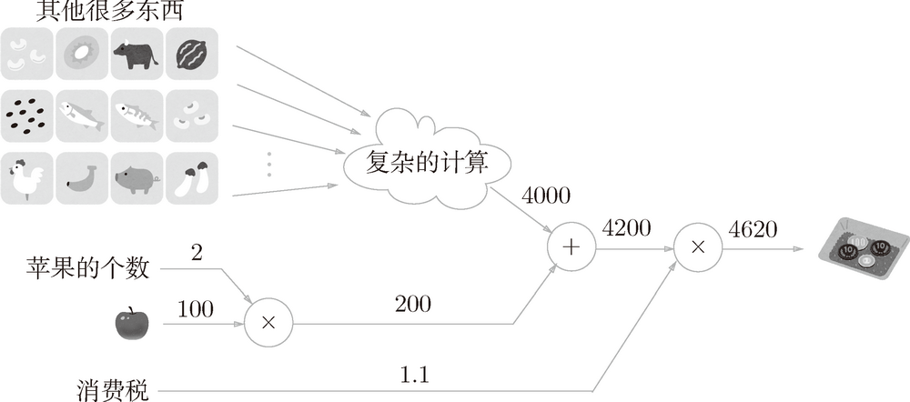
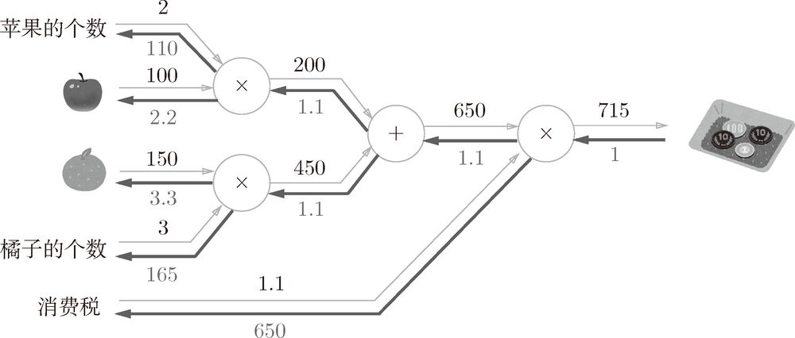

# Basic

1. 通过数值微分计算了神经网络的权重参数的梯度虽然简单，也容易实现，但缺点是计算上比较费时间。这里将学习一个能够高效计算权重参数的梯度的方法——误差反向传播法。
2. 要正确理解误差反向传播法，有两种方法：一种是基于数学式；另一种是基于**计算图**（computational graph）。前者是比较常见的方法，机器学习相关的图书中多数都是以数学式为中心展开论述的。因为这种方法严密且简洁，所以确实非常合理，但如果一上来就围绕数学式进行探讨，会忽略一些根本的东西，止步于式子的罗列。因此，这里希望大家通过计算图，直观地理解误差反向传播法。然后，再结合实际的代码加深理解。

<!-- TOC -->

- [Basic](#basic)
    - [1. 计算图](#1-计算图)
        - [1.1 用计算图求解](#11-用计算图求解)
        - [1.2 局部计算](#12-局部计算)
        - [1.3 为何用计算图解题](#13-为何用计算图解题)
    - [2. 反向传播](#2-反向传播)
        - [2.1 计算图的反向传播](#21-计算图的反向传播)
        - [2.2 加法节点的反向传播](#22-加法节点的反向传播)
        - [2.3 乘法节点的反向传播](#23-乘法节点的反向传播)
        - [2.4 苹果的例子](#24-苹果的例子)
    - [3. 简单层的实现](#3-简单层的实现)
        - [3.1 乘法层的实现](#31-乘法层的实现)
        - [3.2 加法层的实现](#32-加法层的实现)

<!-- /TOC -->


## 1. 计算图
计算图将计算过程用图形表示出来。这里说的图形是数据结构图，通过多个节点和边表示（连接节点的直线称为“边”）。为了让大家熟悉计算图，本节先用计算图解一些简单的问题。从这些简单的问题开始，逐步深入，最终抵达误差反向传播法。

### 1.1 用计算图求解
1. 现在，我们尝试用计算图解简单的问题。下
2. 问题 1：太郎在超市买了 2 个 100 日元一个的苹果，消费税是 10%，请计算支付金额。
    
3. 如上图所示，开始时，苹果的 100 日元流到“× 2”节点，变成 200 日元，然后被传递给下一个节点。接着，这个 200 日元流向“× 1.1”节点，变成 220 日元。因此，从这个计算图的结果可知，答案为 220 日元。
4. 虽然上图中把“× 2”“× 1.1”等作为一个运算整体用○括起来了，不过只用○表示乘法运算“×”也是可行的。此时，如下图所示，可以将“2”和“1.1”分别作为变量“苹果的个数”和“消费税”标在○外面
    
5. 问题 2：太郎在超市买了 2 个苹果、3 个橘子。其中，苹果每个 100 日元，橘子每个 150 日元。消费税是 10%，请计算支付金额。
    
6. 构建了计算图后，从左向右进行计算。就像电路中的电流流动一样，计算结果从左向右传递。到达最右边的计算结果后，计算过程就结束了。
7. 综上，用计算图解题的情况下，需要按如下流程进行。
    1. 构建计算图。
    2. 在计算图上，从左向右进行计算。
8. 这里的第 2 歩“从左向右进行计算”是一种正方向上的传播，简称为**正向传播**（forward propagation）。
9. 正向传播是从计算图出发点到结束点的传播。既然有正向传播这个名称，当然也可以考虑反向（从图上看的话，就是从右向左）的传播。实际上，这种传播称为**反向传播**（backward propagation）。反向传播将在接下来的导数计算中发挥重要作用。

### 1.2 局部计算
1. 计算图的特征是可以通过传递“局部计算”获得最终结果。局部计算是指，无论全局发生了什么，都能只根据与自己相关的信息输出接下来的结果。
2. 我们用一个具体的例子来说明局部计算。比如，在超市买了 2 个苹果和其他很多东西。
    
3. 假设（经过复杂的计算）购买的其他很多东西总共花费 4000 日元。这里的重点是，各个节点处的计算都是局部计算。
4. 这意味着，例如苹果和其他很多东西的求和运算（4000 + 200 → 4200）并不关心 4000 这个数字是如何计算而来的，只要把两个数字相加就可以了。
5. 换言之，各个节点处只需进行与自己有关的计算（在这个例子中是对输入的两个数字进行加法运算），不用考虑全局。
6. 综上，计算图可以集中精力于局部计算。无论全局的计算有多么复杂，各个步骤所要做的就是对象节点的局部计算。虽然局部计算非常简单，但是通过传递它的计算结果，可以获得全局的复杂计算的结果。

### 1.3 为何用计算图解题
计算图的优点是，可以通过正向传播和反向传播高效地计算各个变量的导数值。下述。


## 2. 反向传播
### 2.1 计算图的反向传播
1. 假设存在 $y = f (x)$ 的计算，这个计算的反向传播如下图所示
    
2. 反向传播的计算顺序是，将信号 E 乘以节点的局部导数 $(\frac{\partial y}{\partial x})$，然后将结果传递给下一个节点。
3. 这里所说的局部导数是指正向传播中 $y = f (x)$ 的导数，也就是 $y$ 关于 $x$ 的导数 $(\frac{\partial y}{\partial x})$。比如，假设 $y=f(x)=x^2$，则局部导数为 $\frac{\partial y}{\partial x}=2x$。把这个局部导数乘以上游传过来的值（本例中为 E），然后传递给前面的节点。

### 2.2 加法节点的反向传播
1. $z = x + y$的计算中，加法节点局部导数 $\frac{\partial z}{\partial x}$ 和 $\frac{\partial z}{\partial y}$ 同时都等于 1。
2. 假设有“10 + 5 = 15”这一计算，反向传播时，从上游会传来值 1.3。用计算图表示的话，如图所示
    
3. 因为加法节点的两个局部导数都是1，所以输入信号原因原样输出给 $x$ 和 $y$。

### 2.3 乘法节点的反向传播
1. 考虑 $z = xy$，因为 $\frac{\partial z}{\partial x}=y$ 和 $\frac{\partial z}{\partial y}=x$ ，所以反向传播的计算如下
    
2. 一个具体的例子。比如，假设有“10 × 5 = 50”这一计算，反向传播时，从上游会传来值 1.3。用计算图表示的话
    
3. 因为乘法的反向传播会乘以输入信号的翻转值，所以各自可按 $1.3 × 5 = 6.5$、$1.3 × 10 = 13$ 计算。
4. 另外，加法的反向传播只是将上游的值传给下游，并不需要正向传播的输入信号。但是，乘法的反向传播需要正向传播时的输入信号值。因此，实现乘法节点的反向传播时，要保存正向传播的输入信号。

### 2.4 苹果的例子
1. 再来思考一下购买苹果的例子（2 个苹果和消费税）。这里要解的问题是苹果的价格、苹果的个数、消费税这 3 个变量各自如何影响最终支付的金额。
2. 这个问题相当于求“支付金额关于苹果的价格的导数”“支付金额关于苹果的个数的导数”“支付金额关于消费税的导数”。用计算图的反向传播来解的话，求解过程如下图所示
    
3. 如前所述，乘法节点的反向传播会将输入信号翻转后传给下游。从上图的结果可知，苹果的价格的导数是 2.2，苹果的个数的导数是 110，消费税的导数是 200。
4. 这可以解释为，如果消费税和苹果的价格增加相同的值，则消费税将对最终价格产生 200 倍大小的影响，苹果的价格将产生 2.2 倍大小的影响。
5. 这里看起来似乎消费税对最终价格的影响特别大，这是因为这个例子中消费税和苹果的价格的量纲不同，所以才形成了这样的结果。消费税的 1 是 100%，苹果的价格的 1 是 1 日元。如果都只是在当前基础上增长1，价格其实只增长了 $1%$，而消费税却增长了 $100%$。


## 3. 简单层的实现
1. 本节将用 Python 实现前面的购买苹果的例子。这里，我们把要实现的计算图的乘法节点称为“乘法层”（MulLayer），加法节点称为“加法层”（AddLayer）。
2. 这里所说的“层”是神经网络中功能的单位。比如，负责 sigmoid 函数的 Sigmoid、负责矩阵乘积的 Affine 等，都以层为单位进行实现。
3. 层的实现中有两个共通的方法（接口）`forward()` 和` backward()`。`forward()` 对应正向传播，`backward()` 对应反向传播。

### 3.1 乘法层的实现
1. 代码实现
    ```py
    class MulLayer:
        def __init__(self):
            # x 和 y 用于保存正向传播时的输入值
            self.x = None
            self.y = None

        # 接收 x 和 y 两个参数，将它们相乘后输出
        def forward(self, x, y):
            self.x = x
            self.y = y
            out = x * y

            return out

        # 将从上游传来的导数（dout）乘以正向传播的翻转值，然后传给下游
        def backward(self, dout):
            dx = dout * self.y  # 翻转x和y
            dy = dout * self.x

            return dx, dy
    ```
2. 现在我们使用 `MulLayer` 实现前面的购买苹果的例子（2 个苹果和消费税）
    ```py
    apple = 100
    apple_num = 2
    tax = 1.1

    # layer
    mul_apple_layer = MulLayer()
    mul_tax_layer = MulLayer()

    # forward
    apple_price = mul_apple_layer.forward(apple, apple_num)
    price = mul_tax_layer.forward(apple_price, tax)
    print(price)  # 220

    # backward
    dprice = 1
    dapple_price, dtax = mul_tax_layer.backward(dprice)
    dapple, dapple_num = mul_apple_layer.backward(dapple_price)
    print(dapple, dapple_num, dtax)  # 2.2 110 200
    ```

### 3.2 加法层的实现
1. 实现加法层
    ```py
    class AddLayer:
        def __init__(self):
            pass # 什么也不运行

        def forward(self, x, y):
            out = x + y
            return out

        def backward(self, dout):
            dx = dout * 1
            dy = dout * 1
            return dx, dy
    ```
2. 使用加法层和乘法层，实现下图所示的购买 2 个苹果和 3 个橘子的例子
    
    ```py
    apple = 100
    apple_num = 2
    orange = 150
    orange_num = 3
    tax = 1.1

    # layer 
    mul_apple_layer = MulLayer()
    mul_orange_layer = MulLayer()
    add_apple_orange_layer = AddLayer()
    mul_tax_layer = MulLayer()

    # forward
    apple_price = mul_apple_layer.forward(apple, apple_num)
    orange_price = mul_orange_layer.forward(orange, orange_num)
    all_price = add_apple_orange_layer.forward(apple_price, orange_price)
    price = mul_tax_layer.forward(all_price, tax)

    # backward
    dprice = 1
    dall_price, dtax = mul_tax_layer.backward(dprice)
    dapple_price, dorange_price = add_apple_orange_layer.backward(dall_price)
    dorange, dorange_num = mul_orange_layer.backward(dorange_price)
    dapple, dapple_num = mul_apple_layer.backward(dapple_price)

    print(price)  # 715
    print(dapple_num, dapple, dorange, dorange_num, dtax)  # 110 2.2 3.3 165 650
    ```