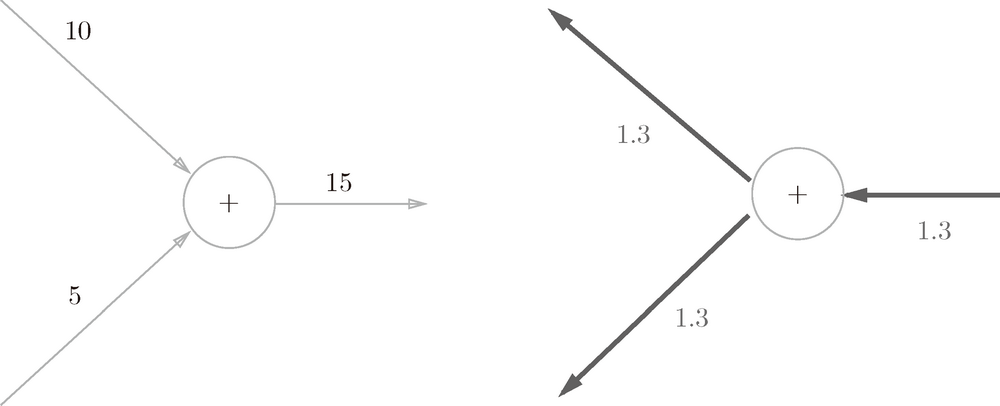
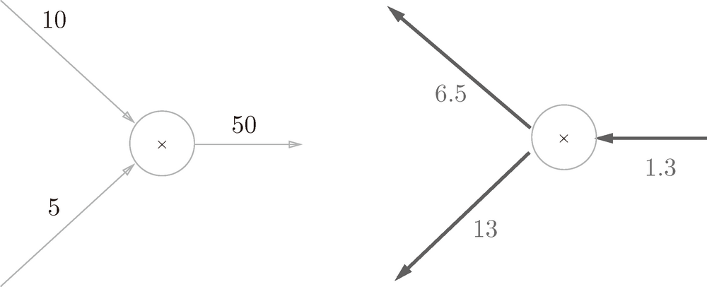
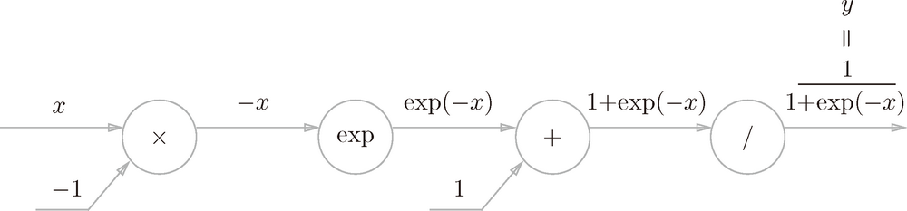
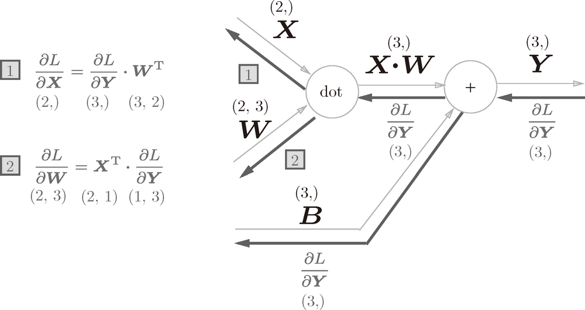
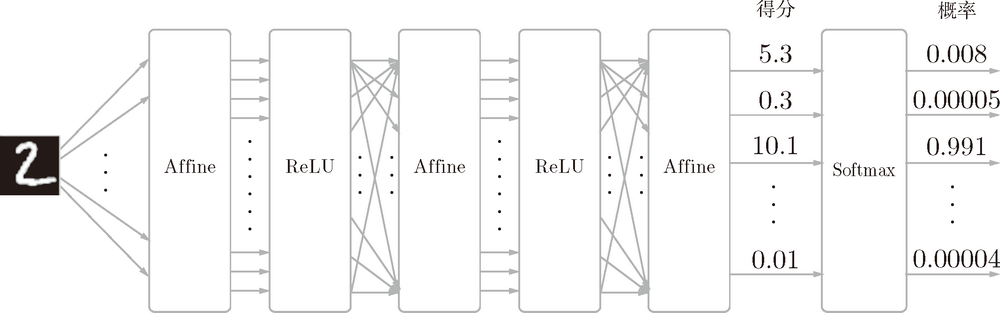
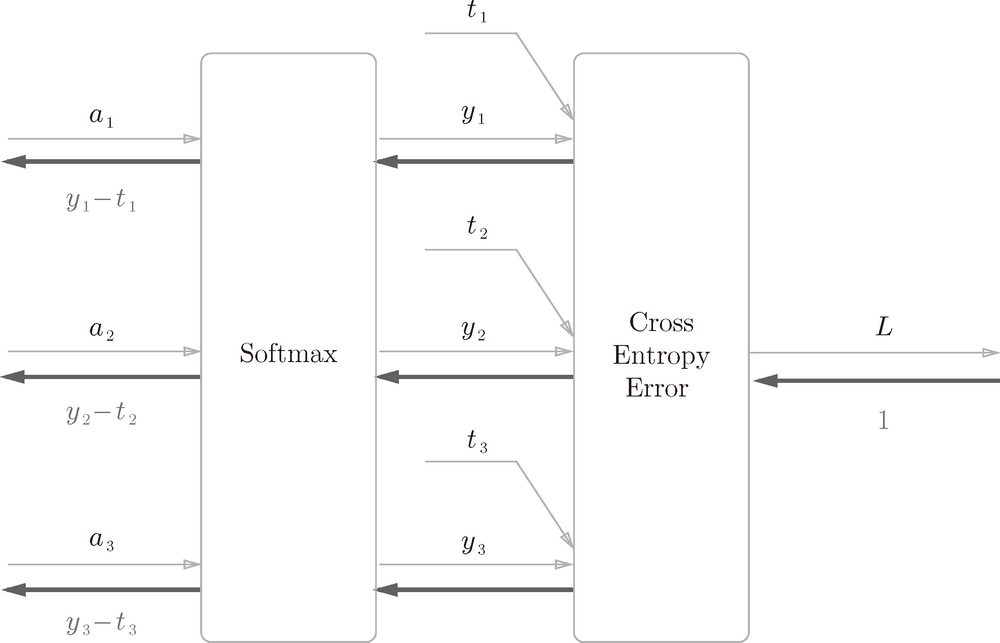

# Basic

1. 通过数值微分计算神经网络的权重参数的梯度虽然简单，也容易实现，但缺点是计算上比较费时间。这里将学习一个能够高效计算权重参数的梯度的方法——误差反向传播法。
2. 要正确理解误差反向传播法，有两种方法：一种是基于数学式；另一种是基于**计算图**（computational graph）。前者是比较常见的方法，机器学习相关的图书中多数都是以数学式为中心展开论述的。因为这种方法严密且简洁，所以确实非常合理，但如果一上来就围绕数学式进行探讨，会忽略一些根本的东西，止步于式子的罗列。因此，这里希望大家通过计算图，直观地理解误差反向传播法。然后，再结合实际的代码加深理解。

<!-- TOC -->

- [Basic](#basic)
    - [思想](#思想)
    - [1. 计算图](#1-计算图)
        - [1.1 用计算图求解](#11-用计算图求解)
        - [1.2 局部计算](#12-局部计算)
        - [1.3 为何用计算图解题](#13-为何用计算图解题)
    - [2. 反向传播](#2-反向传播)
        - [2.1 计算图的反向传播](#21-计算图的反向传播)
        - [2.2 加法节点的反向传播](#22-加法节点的反向传播)
        - [2.3 乘法节点的反向传播](#23-乘法节点的反向传播)
        - [2.4 苹果的例子](#24-苹果的例子)
    - [3. 简单层的实现](#3-简单层的实现)
        - [3.1 乘法层的实现](#31-乘法层的实现)
        - [3.2 加法层的实现](#32-加法层的实现)
    - [4. 激活函数层的实现](#4-激活函数层的实现)
        - [4.1. ReLU层](#41-relu层)
        - [4.2 Sigmoid 层](#42-sigmoid-层)
            - [4.2.1 正向传播计算图](#421-正向传播计算图)
            - [4.2.2 反向传播步骤](#422-反向传播步骤)
                - [步骤1](#步骤1)
                - [步骤2](#步骤2)
                - [步骤3](#步骤3)
                - [步骤4](#步骤4)
            - [4.2.3 整理反向传播计算](#423-整理反向传播计算)
            - [4.2.4 Python 实现 Sigmoid 层](#424-python-实现-sigmoid-层)
    - [4.Affine/Softmax 层的实现](#4affinesoftmax-层的实现)
        - [4.1 Affine 层](#41-affine-层)
        - [4.2 批版本的 Affine 层](#42-批版本的-affine-层)
        - [4.3 Softmax-with-Loss 层](#43-softmax-with-loss-层)
            - [Softmax-with-Loss 层的实现](#softmax-with-loss-层的实现)
    - [5. 误差反向传播法的实现](#5-误差反向传播法的实现)
        - [5.1　神经网络学习的全貌图](#51　神经网络学习的全貌图)
        - [5.2 对应误差反向传播法的神经网络的实现 TODO 重新看](#52-对应误差反向传播法的神经网络的实现-todo-重新看)
        - [5.3 误差反向传播法的梯度确认](#53-误差反向传播法的梯度确认)
        - [5.4 使用误差反向传播法的学习](#54-使用误差反向传播法的学习)

<!-- /TOC -->


## 思想
1. 反向传播的过程，其实求偏导的过程。2.4 的例子，其实就是 $y = price * count * tax$ 三个自变量求偏导。Sigmoid 函数反向传播求导的结果，和下面数学方法求导的结果也是一样的（以 $e$ 为底的指数函数的导数还是它本身）
    
2. 对比一下计算图反向传播求导的方法和上面数学法求导的过程，特别是看到 2.4 中求导的过程，可以看到计算图的求导很容易理解导数的本质，是一步步计算每个节点对之后节点的影响方式：税率对不含税总价对含税总价的影响->单价和数量（间接的通过不含税总价）对含税总价的影响。
3. 使用误差反向传播法求参数的倒数而不是直接用数学方法，大概就是因为在实际的复杂参数和很多层的情况下，直接用数学方法求导是无法实现的。


## 1. 计算图
计算图将计算过程用图形表示出来。这里说的图形是数据结构图，通过多个节点和边表示（连接节点的直线称为“边”）。为了让大家熟悉计算图，本节先用计算图解一些简单的问题。从这些简单的问题开始，逐步深入，最终抵达误差反向传播法。

### 1.1 用计算图求解
1. 现在，我们尝试用计算图解简单的问题。下
2. 问题 1：太郎在超市买了 2 个 100 日元一个的苹果，消费税是 10%，请计算支付金额。
    
3. 如上图所示，开始时，苹果的 100 日元流到“× 2”节点，变成 200 日元，然后被传递给下一个节点。接着，这个 200 日元流向“× 1.1”节点，变成 220 日元。因此，从这个计算图的结果可知，答案为 220 日元。
4. 虽然上图中把“× 2”“× 1.1”等作为一个运算整体用○括起来了，不过只用○表示乘法运算“×”也是可行的。此时，如下图所示，可以将“2”和“1.1”分别作为变量“苹果的个数”和“消费税”标在○外面
    
5. 问题 2：太郎在超市买了 2 个苹果、3 个橘子。其中，苹果每个 100 日元，橘子每个 150 日元。消费税是 10%，请计算支付金额。
    
6. 构建了计算图后，从左向右进行计算。就像电路中的电流流动一样，计算结果从左向右传递。到达最右边的计算结果后，计算过程就结束了。
7. 综上，用计算图解题的情况下，需要按如下流程进行。
    1. 构建计算图。
    2. 在计算图上，从左向右进行计算。
8. 这里的第 2 歩“从左向右进行计算”是一种正方向上的传播，简称为**正向传播**（forward propagation）。
9. 正向传播是从计算图出发点到结束点的传播。既然有正向传播这个名称，当然也可以考虑反向（从图上看的话，就是从右向左）的传播。实际上，这种传播称为**反向传播**（backward propagation）。反向传播将在接下来的导数计算中发挥重要作用。

### 1.2 局部计算
1. 计算图的特征是可以通过传递“局部计算”获得最终结果。局部计算是指，无论全局发生了什么，都能只根据与自己相关的信息输出接下来的结果。
2. 我们用一个具体的例子来说明局部计算。比如，在超市买了 2 个苹果和其他很多东西。
    
3. 假设（经过复杂的计算）购买的其他很多东西总共花费 4000 日元。这里的重点是，各个节点处的计算都是局部计算。
4. 这意味着，例如苹果和其他很多东西的求和运算（4000 + 200 → 4200）并不关心 4000 这个数字是如何计算而来的，只要把两个数字相加就可以了。
5. 换言之，各个节点处只需进行与自己有关的计算（在这个例子中是对输入的两个数字进行加法运算），不用考虑全局。
6. 综上，计算图可以集中精力于局部计算。无论全局的计算有多么复杂，各个步骤所要做的就是对象节点的局部计算。虽然局部计算非常简单，但是通过传递它的计算结果，可以获得全局的复杂计算的结果。

### 1.3 为何用计算图解题
计算图的优点是，可以通过正向传播和反向传播高效地计算各个变量的导数值。下述。


## 2. 反向传播
### 2.1 计算图的反向传播
1. 假设存在 $y = f (x)$ 的计算，这个计算的反向传播如下图所示
    
2. 加法的偏导很容易理解，y 不变 x 增加一个单位，它们的和肯定也增加一个单位，所以偏导为 1。
3. 反向传播的计算顺序是，将信号 E 乘以节点的局部导数 $(\frac{\partial y}{\partial x})$，然后将结果传递给下一个节点。
4. 这里所说的局部导数是指正向传播中 $y = f (x)$ 的导数，也就是 $y$ 关于 $x$ 的导数 $(\frac{\partial y}{\partial x})$。比如，假设 $y=f(x)=x^2$，则局部导数为 $\frac{\partial y}{\partial x}=2x$。把这个局部导数乘以上游传过来的值（本例中为 E），然后传递给前面的节点。

### 2.2 加法节点的反向传播
1. $z = x + y$的计算中，加法节点局部导数 $\frac{\partial z}{\partial x}$ 和 $\frac{\partial z}{\partial y}$ 同时都等于 1。
2. 假设有“10 + 5 = 15”这一计算，反向传播时，从上游会传来值 1.3。用计算图表示的话，如图所示
    
3. 因为加法节点的两个局部导数都是1，所以输入信号原因原样输出给 $x$ 和 $y$。

### 2.3 乘法节点的反向传播
1. 考虑 $z = xy$，因为 $\frac{\partial z}{\partial x}=y$ 和 $\frac{\partial z}{\partial y}=x$ ，所以反向传播的计算如下
    
2. 一个具体的例子。比如，假设有“10 × 5 = 50”这一计算，反向传播时，从上游会传来值 1.3。用计算图表示的话
    
3. 因为乘法的反向传播会乘以输入信号的翻转值，所以各自可按 $1.3 × 5 = 6.5$、$1.3 × 10 = 13$ 计算。
4. 乘法偏导同样很好理解，因为是 x、y 是相乘关系，x 增加一个单位 y 保持不变，肯定乘积多了一个单位乘以 y。即关于 x 的偏导为 y。
5. 另外，加法的反向传播只是将上游的值传给下游，并不需要正向传播的输入信号。但是，乘法的反向传播需要正向传播时的输入信号值。因此，实现乘法节点的反向传播时，要保存正向传播的输入信号。

### 2.4 苹果的例子
1. 再来思考一下购买苹果的例子（2 个苹果和消费税）。这里要解的问题是苹果的价格、苹果的个数、消费税这 3 个变量各自如何影响最终支付的金额。
2. 这个问题相当于求“支付金额关于苹果的价格的导数”“支付金额关于苹果的个数的导数”“支付金额关于消费税的导数”。用计算图的反向传播来解的话，求解过程如下图所示
    
3. 如前所述，乘法节点的反向传播会将输入信号翻转后传给下游。从上图的结果可知，苹果的价格的导数是 2.2，苹果的个数的导数是 110，消费税的导数是 200。
4. 这可以解释为，如果消费税和苹果的价格增加相同的值，则消费税将对最终价格产生 200 倍大小的影响，苹果的价格将产生 2.2 倍大小的影响。
5. 这里看起来似乎消费税对最终价格的影响特别大，这是因为这个例子中消费税和苹果的价格的量纲不同，所以才形成了这样的结果。消费税的 1 是 100%，苹果的价格的 1 是 1 日元。如果都只是在当前基础上增长1，价格其实只增长了 1%，而消费税却增长了 100%。


## 3. 简单层的实现
1. 本节将用 Python 实现前面的购买苹果的例子。这里，我们把要实现的计算图的乘法节点称为“乘法层”（MulLayer），加法节点称为“加法层”（AddLayer）。
2. 这里所说的“层”是神经网络中功能的单位。比如，负责 sigmoid 函数的 Sigmoid、负责矩阵乘积的 Affine 等，都以层为单位进行实现。
3. 层的实现中有两个共通的方法（接口）`forward()` 和` backward()`。`forward()` 对应正向传播，`backward()` 对应反向传播。

### 3.1 乘法层的实现
1. 代码实现
    ```py
    class MulLayer:
        def __init__(self):
            # x 和 y 用于保存正向传播时的输入值
            self.x = None
            self.y = None

        # 接收 x 和 y 两个参数，将它们相乘后输出
        def forward(self, x, y):
            self.x = x
            self.y = y
            out = x * y

            return out

        # 将从上游传来的导数（dout）乘以正向传播的翻转值，然后传给下游
        def backward(self, dout):
            dx = dout * self.y  # 翻转x和y
            dy = dout * self.x

            return dx, dy
    ```
2. 现在我们使用 `MulLayer` 实现前面的购买苹果的例子（2 个苹果和消费税）
    ```py
    apple = 100
    apple_num = 2
    tax = 1.1

    # layer
    mul_apple_layer = MulLayer()
    mul_tax_layer = MulLayer()

    # forward
    apple_price = mul_apple_layer.forward(apple, apple_num)
    price = mul_tax_layer.forward(apple_price, tax)
    print(price)  # 220

    # backward
    dprice = 1
    dapple_price, dtax = mul_tax_layer.backward(dprice)
    dapple, dapple_num = mul_apple_layer.backward(dapple_price)
    print(dapple, dapple_num, dtax)  # 2.2 110 200
    ```

### 3.2 加法层的实现
1. 实现加法层
    ```py
    class AddLayer:
        def __init__(self):
            pass # 什么也不运行

        def forward(self, x, y):
            out = x + y
            return out

        def backward(self, dout):
            dx = dout * 1
            dy = dout * 1
            return dx, dy
    ```
2. 使用加法层和乘法层，实现下图所示的购买 2 个苹果和 3 个橘子的例子
    
    ```py
    apple = 100
    apple_num = 2
    orange = 150
    orange_num = 3
    tax = 1.1

    # layer 
    mul_apple_layer = MulLayer()
    mul_orange_layer = MulLayer()
    add_apple_orange_layer = AddLayer()
    mul_tax_layer = MulLayer()

    # forward
    apple_price = mul_apple_layer.forward(apple, apple_num)
    orange_price = mul_orange_layer.forward(orange, orange_num)
    all_price = add_apple_orange_layer.forward(apple_price, orange_price)
    price = mul_tax_layer.forward(all_price, tax)

    # backward
    dprice = 1
    dall_price, dtax = mul_tax_layer.backward(dprice)
    dapple_price, dorange_price = add_apple_orange_layer.backward(dall_price)
    dorange, dorange_num = mul_orange_layer.backward(dorange_price)
    dapple, dapple_num = mul_apple_layer.backward(dapple_price)

    print(price)  # 715
    print(dapple_num, dapple, dorange, dorange_num, dtax)  # 110 2.2 3.3 165 650
    ```


## 4. 激活函数层的实现
### 4.1. ReLU层
1. 激活函数 ReLU（Rectified Linear Unit）在 $x > 0$ 导数为 1，在 $x <= 0$ 时倒数为 0。因此，如果正向传播时的输入 x 大于 0，则反向传播会将上游的值原封不动地传给下游。反过来，如果正向传播时的 x 小于等于 0，则反向传播中传给下游的信号将停在此处。
2. 用计算图表示的话
    
3. 现在我们来实现 ReLU 层。在神经网络的层的实现中，一般假定 `forward()` 和 `backward()` 的参数是 `NumPy` 数组。
    ```py
    class Relu:
        def __init__(self):
            self.mask = None

        def forward(self, x):
            self.mask = (x <= 0)
            out = x.copy()
            out[self.mask] = 0

            return out

        def backward(self, dout):
            dout[self.mask] = 0
            dx = dout

            return dx
    ```
4. Relu 类有实例变量 `mask`。这个变量 `mask` 是由 `True`/`False` 构成的 `NumPy` 数组，它会把正向传播时的输入 `x` 的元素中小于等于 0 的地方保存为 `True`，其他地方（大于 0 的元素）保存为 `False`。如下例所示，
    ```py
    >>> x = np.array( [[1.0, -0.5], [-2.0, 3.0]] )
    >>> print(x)
    [[ 1.  -0.5]
    [-2.   3. ]]
    >>> mask = (x <= 0)
    >>> print(mask)
    [[False  True]
    [ True False]]
    ```
5. 如果正向传播时的输入值小于等于 0，则反向传播的值为 0。因此，反向传播中会使用正向传播时保存的 `mask`，将从上游传来的 `dout` 的 `mask` 中的元素为 `True` 的地方设为 0。

### 4.2 Sigmoid 层 
#### 4.2.1 正向传播计算图
    

#### 4.2.2 反向传播步骤
##### 步骤1
1.  “/”节点表示 $y=\frac{1}{x}$，它的导数可以解析性地表示为下式。

    $\begin{aligned}\frac{\partial y}{\partial x}&=-\frac{1}{x^2}\\&=-y^2\end{aligned}$

2. 反向传播时，会将上游的值乘以 $-y^2$ 后，再传给下游。计算图如下
    

##### 步骤2
1. “+”节点将上游的值原封不动地传给下游。计算图如下所示
    

##### 步骤3
1. “exp”节点表示 $y = exp(x)$，以 $e$ 为底的指数函数的导数还是它本身。它的导数由下式表示

    $\frac{\partial y}{\partial x}=\exp(x)$

2. 计算图如下
    

##### 步骤4
1. “×”节点将正向传播时的值翻转后做乘法运算。因此，这里要乘以 -1
    

#### 4.2.3 整理反向传播计算
1. 从上图的结果可知，反向传播的输出为 $\frac{\partial L}{\partial y}y^2\exp(-x)$，这个值会传播给下游的节点。
2. 这里要注意，$\frac{\partial L}{\partial y}y^2\exp(-x)$ 这个值只根据正向传播时的输入 $x$ 和输出 $y$ 就可以算出来。因此，上面的计算图可以画成下图的集约化的“sigmoid”节点
    
3. 简洁版的计算图可以省略反向传播中的计算过程，因此计算效率更高。此外，通过对节点进行集约化，可以不用在意 Sigmoid 层中琐碎的细节，而只需要专注它的输入和输出。
4. 另外 $\frac{\partial L}{\partial y}y^2\exp(-x)$ 可以进一步整理如下。

    $\begin{aligned}\frac{\partial L}{\partial y}y^2\exp(-x)&=\frac{\partial L}{\partial y}\frac{1}{(1+\exp(-x))^2}\exp(-x)\\&=\frac{\partial L}{\partial y}\frac{1}{1+\exp(-x)}\frac{\exp(-x)}{1+\exp(-x)}\\&=\frac{\partial L}{\partial y}y(1-y)\end{aligned}$

5. 进一步更新计算图如下
    

#### 4.2.4 Python 实现 Sigmoid 层
```py
class Sigmoid:
    def __init__(self):
        self.out = None

    def forward(self, x):
        out = 1 / (1 + np.exp(-x))
        self.out = out

        return out

    def backward(self, dout):
        dx = dout * (1.0 - self.out) * self.out

        return dx
```


## 4.Affine/Softmax 层的实现
### 4.1 Affine 层
1. 神经网络的正向传播中进行的矩阵的乘积运算在几何学领域被称为**仿射变换**（affine transformation）。因此，这里将进行仿射变换的处理实现为“Affine 层”。
2. 几何中，仿射变换包括一次线性变换和一次平移，分别对应神经网络的加权和运算与加偏置运算。
3. 将这里进行的求矩阵的乘积与偏置的和的运算用计算图表示出来
    
4. 要注意 $\boldsymbol{X}$、$\boldsymbol{W}$、$\boldsymbol{B}$ 是矩阵（多维数组）。之前我们见到的计算图中各个节点间流动的是标量，而这个例子中各个节点间传播的是矩阵。
5. 上面计算图反向传播求偏导的结果如下（TODO 推导过程）

    $\begin{aligned}\frac{\partial L}{\partial\boldsymbol{X}}&=\frac{\partial L}{\partial\boldsymbol{Y}}\cdot\boldsymbol{W}^{{\rm T}}\\\frac{\partial L}{\partial\boldsymbol{W}}&=\boldsymbol{X}^{{\rm T}}\cdot\frac{\partial L}{\partial\boldsymbol{Y}}\end{aligned}$
    
6. 注意上面不是乘法而是点积运算，所以顺序不能颠倒。
7. 上式中 $\boldsymbol{W}^{{\rm T}}$ 的 T 表示转置。转置操作会把 $\boldsymbol{W}$ 的元素 (i, j) 换成元素 (j, i)。用数学式表示的话，可以写成下面这样。
    $\begin{aligned}\boldsymbol{W}=\begin{pmatrix}w_{11}&w_{12}&w_{13}\\w_{21}&w_{22}&w_{23}\end{pmatrix}&\\\boldsymbol{W}^{{\rm T}}\begin{pmatrix}w_{11}&w_{21}\\w_{12}&w_{22}\\w_{13}&w_{23}\end{pmatrix}&\end{aligned}$

8. 现在，我们根据上面求偏导的公式，尝试写出计算图的反向传播
    
9. 可以看出来，点积运算求偏导和标量乘法运算求偏导有些类似，只不过导数不是直接的另一方，而是另一方的转置。而且还要注意因为是点积运算，所以顺序不能颠倒。

### 4.2 批版本的 Affine 层
1. 前面介绍的 Affine 层的输入 $\boldsymbol{X}$ 是以单个数据为对象的。现在我们考虑 N 个数据一起进行正向传播的情况，也就是批版本的 Affine 层。
2. 先给出批版本的 Affine层的计算图
    
3. 与刚刚不同的是，现在输入 $\boldsymbol{X}$ 的形状是 (N, 2)。之后就和前面一样，在计算图上进行单纯的矩阵计算。
4. 反向传播时，如果注意矩阵的形状，就可以和前面一样推导出 $\frac{\partial L}{\partial\boldsymbol{X}}$ 和 $\frac{\partial L}{\partial\boldsymbol{W}}$。
5. 加上偏置时，需要特别注意。正向传播时，偏置被加到 $\boldsymbol{X}\cdot\boldsymbol{W}$ 的各个数据上。比如，N = 2（数据为 2 个）时，偏置会被分别加到这 2 个数据（各自的计算结果）上，具体的例子如下所示。
    ```py
    >>> X_dot_W = np.array([[0, 0, 0], [10, 10, 10]])
    >>> B = np.array([1, 2, 3])
    >>>
    >>> X_dot_W
    array([[ 0,  0,  0],
        [ 10, 10, 10]])
    >>> X_dot_W + B
    array([[ 1,  2,  3],
        [11, 12, 13]])
    ```
6. 因此，反向传播时，各个数据的反向传播的值需要汇总为偏置的元素。用代码表示的话，如下所示。
    ```py
    >>> dY = np.array([[1, 2, 3,], [4, 5, 6]])
    >>> dY
    array([[1, 2, 3],
        [4, 5, 6]])
    >>>
    >>> dB = np.sum(dY, axis=0)
    >>> dB
    array([5, 7, 9])
    ```
7. 这个例子中，假定数据有 2 个（N = 2）。偏置的反向传播会对这 2 个数据的导数按元素进行求和。因此，这里使用了 `np.sum()` 对第 0 轴（以数据为单位的轴，axis=0）方向上的元素进行求和。
8. 综上所述，Affine 的实现如下所示
    ```py
    class Affine:
        def __init__(self, W, b):
            self.W = W
            self.b = b
            self.x = None
            self.dW = None
            self.db = None

        def forward(self, x):
            self.x = x
            out = np.dot(x, self.W) + self.b

            return out

        def backward(self, dout):
            dx = np.dot(dout, self.W.T)
            self.dW = np.dot(self.x.T, dout)
            self.db = np.sum(dout, axis=0)

            return dx
    ```

### 4.3 Softmax-with-Loss 层
1. softmax 函数会将输入值正规化之后再输出。比如手写数字识别时，Softmax 层的输出如图（TODO 推导过程）
    
2. 神经网络中进行的处理有**推理**（inference）和**学习**两个阶段。神经网络的推理通常不使用 Softmax 层。比如，用上图的网络进行推理时，会将最后一个 Affine 层的输出作为识别结果。神经网络中未被正规化的输出结果（Softmax 层前面的 Affine 层的输出）有时被称为“得分”。也就是说，当神经网络的推理只需要给出一个答案的情况下，因为此时只对得分最大值感兴趣，所以不需要 Softmax 层。不过，神经网络的学习阶段则需要 Softmax 层。
3. 下面来实现 Softmax 层。考虑到这里也包含作为损失函数的交叉熵误差（cross entropy error），所以称为“Softmax-with-Loss 层”。Softmax-with-Loss 层（Softmax 函数和交叉熵误差）的计算图如下
    
    * softmax 激活函数：$y_k=\frac{\exp(a_k)}{\sum_{i=1}^n\exp(a_i)}$   
    * cross entropy error 损失函数：$E=-\sum_kt_k\log y_k$
    * $\frac{{\rm d}}{{\rm d}x}\log_{{\rm e}}(x)=\frac{1}{x}$
4. 上面的计算图可以简化成下图
    
5. 这这个简化的计算图中，假设要进行 3 类分类，从前面的层接收 3 个输入（得分）Softmax 层将输入 ($a_1$,$a_2$,$a_3$) 正规化，输出 ($y_1$,$y_2$,$y_3$)。Cross Entropy Error 层接收 Softmax 的输出 ($y_1$,$y_2$,$y_3$) 和监督标签 ($t_1$,$t_2$,$t_3$)，从这些数据中输出损失 $L$。
6. Softmax 层的反向传播得到了 ($y_1-t_1$,$y_2-t_2$,$y_3-t_3$)这样“漂亮”的结果。由于 ($y_1$,$y_2$,$y_3$) 是 Softmax 层的输出，($t_1$,$t_2$,$t_3$) 是监督数据，所以 ($y_1-t_1$,$y_2-t_2$,$y_3-t_3$) 是 Softmax 层的输出和监督标签的差分。神经网络的反向传播会把这个差分表示的误差传递给前面的层，这是神经网络学习中的重要性质。
7. 使用交叉熵误差作为 softmax 函数的损失函数后，反向传播得到 ($y_1-t_1$,$y_2-t_2$,$y_3-t_3$) 这样“漂亮”的结果。实际上，这样“漂亮”的结果并不是偶然的，而是为了得到这样的结果，特意设计了交叉熵误差函数。回归问题中输出层使用“恒等函数”，损失函数使用“平方和误差”，也是出于同样的理由（3.5 节）。也就是说，使用“平方和误差”作为“恒等函数”的损失函数，反向传播才能得到 ($y_1-t_1$,$y_2-t_2$,$y_3-t_3$) 这样“漂亮”的结果。
8. 神经网络学习的目的就是通过调整权重参数，使神经网络的输出（Softmax 的输出）接近监督标签。因此，必须将神经网络的输出与监督标签的误差高效地传递给前面的层。刚刚的 ($y_1-t_1$,$y_2-t_2$,$y_3-t_3$) 正是 Softmax 层的输出与监督标签的差，直截了当地表示了当前神经网络的输出与监督标签的误差。
9. 这里考虑一个具体的例子，比如思考监督标签是（0, 1, 0），Softmax 层的输出是 (0.3, 0.2, 0.5) 的情形。因为正确解标签处的概率是 0.2（20%），这个时候的神经网络未能进行正确的识别。此时，Softmax 层的反向传播传递的是 (0.3, -0.8, 0.5) 这样一个大的误差。因为这个大的误差会向前面的层传播，所以 Softmax 层前面的层会从这个大的误差中学习到“大”的内容。
10. 再举一个例子，比如思考监督标签是 (0, 1, 0)，Softmax 层的输出是 (0.01, 0.99, 0) 的情形（这个神经网络识别得相当准确）。此时 Softmax 层的反向传播传递的是 (0.01, -0.01, 0) 这样一个小的误差。这个小的误差也会向前面的层传播，因为误差很小，所以 Softmax 层前面的层学到的内容也很“小”。

#### Softmax-with-Loss 层的实现
```py
def softmax(a):
    c = np.max(a)
    exp_a = np.exp(a - c)
    sum_exp_a = np.sum(exp_a)
    y = exp_a / sum_exp_a
    return y
    
def cross_entropy_error(y, t):
    delta = 1e-7
    return -np.sum(t * np.log(y + delta))

class SoftmaxWithLoss:
    def __init__(self):
        self.loss = None # 损失
        self.y = None    # softmax的输出
        self.t = None    # 监督数据（one-hot vector）

    def forward(self, x, t):
        self.t = t
        self.y = softmax(x)
        self.loss = cross_entropy_error(self.y, self.t)

        return self.loss

    def backward(self, dout=1):
        batch_size = self.t.shape[0]
        dx = (self.y - self.t) / batch_size # 将要传播的值除以批的大小（batch_size）后，传递给前面的层的是单个数据的误差。TODO 不懂

        return dx
```


## 5. 误差反向传播法的实现
### 5.1　神经网络学习的全貌图
1. 在进行具体的实现之前，我们再来确认一下神经网络学习的全貌图。神经网络学习的步骤如下所示。
   
    0. **前提**：神经网络中有合适的权重和偏置，调整权重和偏置以便拟合训练数据的过程称为学习。神经网络的学习分为下面 4 个步骤。
    2. **步骤 1（mini-batch）**：从训练数据中随机选择一部分数据。
    2. **步骤 2（计算梯度）**：计算损失函数关于各个权重参数的梯度。
    3. **步骤 3（更新参数）**：将权重参数沿梯度方向进行微小的更新。
    4. **步骤 4（重复）**：重复步骤 1、步骤 2、步骤 3。
2. 之前利用数值微分求梯度，数值微分虽然实现简单，但是计算要耗费较多的时间。和需要花费较多时间的数值微分不同，误差反向传播法可以快速高效地计算梯度。

### 5.2 对应误差反向传播法的神经网络的实现 TODO 重新看
（源码在`./demos/two_layer_net.py`）
```py
import sys, os
sys.path.append(os.pardir)
import numpy as np
from common.layers import *
from common.gradient import numerical_gradient
from collections import OrderedDict

class TwoLayerNet:

    def __init__(self, input_size, hidden_size, output_size,
                 weight_init_std=0.01):
        # 初始化权重
        self.params = {}
        self.params['W1'] = weight_init_std * \
                            np.random.randn(input_size, hidden_size)
        self.params['b1'] = np.zeros(hidden_size)
        self.params['W2'] = weight_init_std * \
                            np.random.randn(hidden_size, output_size)
        self.params['b2'] = np.zeros(output_size)

        # 生成层
        self.layers = OrderedDict()
        self.layers['Affine1'] = \
            Affine(self.params['W1'], self.params['b1'])
        self.layers['Relu1'] = Relu()
        self.layers['Affine2'] = \
            Affine(self.params['W2'], self.params['b2'])

        self.lastLayer = SoftmaxWithLoss()

    def predict(self, x):
        for layer in self.layers.values():
            x = layer.forward(x)

        return x

    # x:输入数据, t:监督数据
    def loss(self, x, t):
        y = self.predict(x)
        return self.lastLayer.forward(y, t)

    def accuracy(self, x, t):
        y = self.predict(x)
        y = np.argmax(y, axis=1)
        if t.ndim != 1 : t = np.argmax(t, axis=1)
        accuracy = np.sum(y == t) / float(x.shape[0])
        return accuracy

    # x:输入数据, t:监督数据
    def numerical_gradient(self, x, t):
        loss_W = lambda W: self.loss(x, t)

        grads = {}
        grads['W1'] = numerical_gradient(loss_W, self.params['W1'])
        grads['b1'] = numerical_gradient(loss_W, self.params['b1'])
        grads['W2'] = numerical_gradient(loss_W, self.params['W2'])
        grads['b2'] = numerical_gradient(loss_W, self.params['b2'])

        return grads

    def gradient(self, x, t):
        # forward
        self.loss(x, t)

        # backward
        dout = 1
        dout = self.lastLayer.backward(dout)

        layers = list(self.layers.values())
        layers.reverse()
        for layer in layers:
            dout = layer.backward(dout)

        # 设定
        grads = {}
        grads['W1'] = self.layers['Affine1'].dW
        grads['b1'] = self.layers['Affine1'].db
        grads['W2'] = self.layers['Affine2'].dW
        grads['b2'] = self.layers['Affine2'].db

        return grads
```

### 5.3 误差反向传播法的梯度确认
1. 数值微分的计算很耗费时间，而且如果有误差反向传播法的（正确的）实现的话，就没有必要使用数值微分的实了。
2. 那么数值微分有什么用呢？实际上，在确认误差反向传播法的实现是否正确时，是需要用到数值微分的。
3. 数值微分的优点是实现简单，因此，一般情况下不太容易出错。而误差反向传播法的实现很复杂，容易出错。所以，经常会比较数值微分的结果和误差反向传播法的结果，以确认误差反向传播法的实现是否正确。
4. 确认数值微分求出的梯度结果和误差反向传播法求出的结果是否一致（严格地讲，是非常相近）的操作称为**梯度确认**（gradient check）。梯度确认的代码实现如下所示（源码在`./demos/gradient_check.py`）
    ```py
    import sys, os
    import numpy as np
    sys.path.append(os.path.join(os.path.dirname(__file__), '../../'))
    from dataset.mnist import load_mnist
    from two_layer_net import TwoLayerNet

    # 读入数据
    (x_train, t_train), (x_test, t_test) = load_mnist(normalize=True, one_hot_label = True)

    network = TwoLayerNet(input_size=784, hidden_size=50, output_size=10)

    x_batch = x_train[:3]
    t_batch = t_train[:3]

    grad_numerical = network.numerical_gradient(x_batch, t_batch)
    grad_backprop = network.gradient(x_batch, t_batch)

    # 求各个权重的绝对误差的平均值
    for key in grad_numerical.keys():
        diff = np.average( np.abs(grad_backprop[key] - grad_numerical[key]) )
        print(key + ":" + str(diff))

    # W1: 4.321490489815039e-10
    # b1: 2.664336438774938e-09
    # W2: 5.167563159743217e-09
    # b2: 1.3990253508733287e-07
    ```
5. 从这个结果可以看出，通过数值微分和误差反向传播法求出的梯度的差非常小。这样一来，我们就知道了通过误差反向传播法求出的梯度是正确的，误差反向传播法的实现没有错误。
6. 数值微分和误差反向传播法的计算结果之间的误差为 0 是很少见的。这是因为计算机的计算精度有限（比如，32 位浮点数）。受到数值精度的限制，刚才的误差一般不会为 0，但是如果实现正确的话，可以期待这个误差是一个接近 0 的很小的值。如果这个值很大，就说明误差反向传播法的实现存在错误。

### 5.4 使用误差反向传播法的学习
使用误差反向传播法实现神经网络的学习。和之前的实现相比，不同之处仅在于通过误差反向传播法求梯度（源码在`./demos/train_neuralnet.py`）
```py
import sys, os
sys.path.append(os.path.join(os.path.dirname(__file__), '../../'))
import numpy as np
from dataset.mnist import load_mnist
from two_layer_net import TwoLayerNet

# 读入数据
(x_train, t_train), (x_test, t_test) = load_mnist(normalize=True, one_hot_label=True)

network = TwoLayerNet(input_size=784, hidden_size=50, output_size=10)

iters_num = 10000
train_size = x_train.shape[0]
batch_size = 100
learning_rate = 0.1
train_loss_list = []
train_acc_list = []
test_acc_list = []

iter_per_epoch = max(train_size / batch_size, 1)

for i in range(iters_num):
    batch_mask = np.random.choice(train_size, batch_size)
    x_batch = x_train[batch_mask]
    t_batch = t_train[batch_mask]

    # 通过误差反向传播法求梯度
    grad = network.gradient(x_batch, t_batch)

    # 更新
    for key in ('W1', 'b1', 'W2', 'b2'):
        network.params[key] -= learning_rate * grad[key]

    loss = network.loss(x_batch, t_batch)
    train_loss_list.append(loss)

    if i % iter_per_epoch == 0:
        train_acc = network.accuracy(x_train, t_train)
        test_acc = network.accuracy(x_test, t_test)
        train_acc_list.append(train_acc)
        test_acc_list.append(test_acc)
        print(train_acc, test_acc)
```
