# Basic

<!-- TOC -->

- [Basic](#basic)
    - [0. 思想](#0-思想)
    - [1. 整体结构](#1-整体结构)
    - [2. 卷积层](#2-卷积层)
        - [2.1 全连接层存在的问题](#21-全连接层存在的问题)
        - [2.2 卷积运算](#22-卷积运算)
        - [2.3 填充](#23-填充)
        - [2.4 步幅](#24-步幅)
        - [2.5 三维数据的卷积运算](#25-三维数据的卷积运算)
        - [2.6 结合方块思考](#26-结合方块思考)
        - [2.7 批处理](#27-批处理)
    - [3. 池化层](#3-池化层)
        - [3.1 池化层的特征](#31-池化层的特征)
            - [没有要学习的参数](#没有要学习的参数)
            - [通道数不发生变化](#通道数不发生变化)
            - [对微小的位置变化具有鲁棒性](#对微小的位置变化具有鲁棒性)
    - [References](#references)

<!-- /TOC -->

## 0. 思想

## 1. 整体结构
1. 首先，来看一下 CNN 的网络结构，了解 CNN 的大致框架。
2. CNN 和之前介绍的神经网络一样，可以像乐高积木一样通过组装层来构建。不过，CNN 中新出现了卷积层（Convolution 层）和池化层（Pooling 层）。
3. 之前介绍的神经网络中，相邻层的所有神经元之间都有连接，这称为 **全连接**（fully-connected）。
4. 另外，我们用 Affine 层实现了全连接层。如果使用这个 Affine 层，一个 5 层的全连接的神经网络就可以通过下图所示的网络结构来实现
    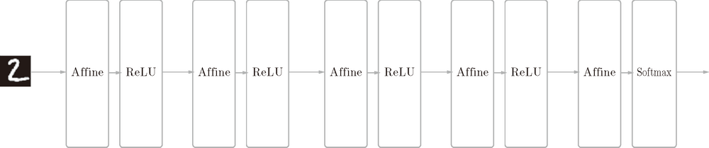
5. 全连接的神经网络中，Affine 层后面跟着激活函数 ReLU 层（或者 Sigmoid 层）。这里堆叠了 4 层 “Affine-ReLU” 组合，然后第 5 层是 Affine 层，最后由 Softmax 层输出最终结果（概率）。
6. 下图是 CNN 的一个例子，新增了 Convolution 层和 Pooling 层
    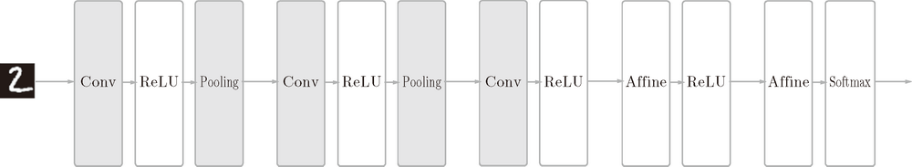

## 2. 卷积层
### 2.1 全连接层存在的问题
1. 全连接层存在的问题是，数据的形状被 “忽视” 了。比如，输入数据是图像时，图像通常是高、长、通道方向上的 3 维形状。但是，向全连接层输入时，需要将 3 维数据拉平为 1 维数据。
2. 实际上，全连接中使用了 MNIST 数据集时，输入图像就是 1 通道、高 28 像素、长 28 像素的（1, 28, 28）形状，但却被排成 1 列，以 784 个数据的形式输入到最开始的 Affine 层。
3. 图像是 3 维形状，这个形状中应该含有重要的空间信息。比如，空间上邻近的像素为相似的值、RGB 的各个通道之间分别有密切的关联性、相距较远的像素之间没有什么关联等，3 维形状中可能隐藏有值得提取的本质模式。
4. 但是，因为全连接层会忽视形状，将全部的输入数据作为相同的神经元（同一维度的神经元）处理，所以无法利用与形状相关的信息。
5. 而卷积层可以保持形状不变。当输入数据是图像时，卷积层会以 3 维数据的形式接收输入数据，并同样以 3 维数据的形式输出至下一层。因此，在 CNN 中，可以（有可能）正确理解图像等具有形状的数据。
6. 另外，CNN 中，有时将卷积层的输入输出数据称为 **特征图**（feature map）。其中，卷积层的输入数据称为 **输入特征图**（input feature map），输出数据称为 **输出特征图**（output feature map）。

### 2.2 卷积运算
1. 卷积层进行的处理就是卷积运算。卷积运算相当于图像处理中的“滤波器运算”。先来看一个具体的例子，下图用 $\circledast$ 符号表示卷积运算
    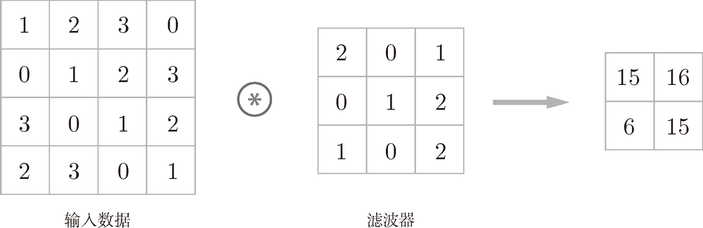
2. 具体的计算过程如下
    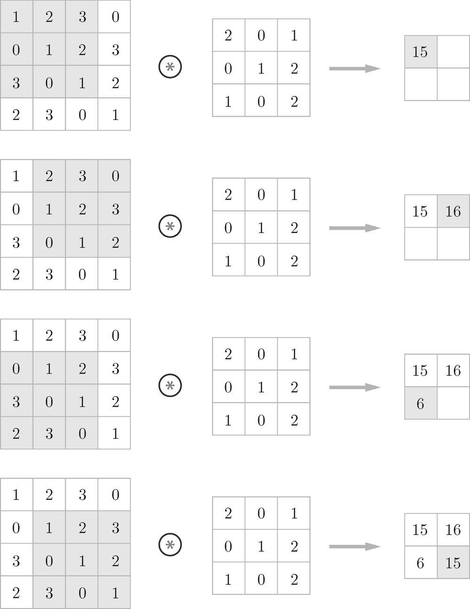
3. 对于输入数据，卷积运算以一定间隔滑动滤波器的窗口并应用。将各个位置上滤波器的元素和输入的对应元素相乘，然后再求和（有时将这个计算称为 **乘积累加运算**）。然后，将这个结果保存到输出的对应位置。将这个过程在所有位置都进行一遍，就可以得到卷积运算的输出。
4. 在全连接的神经网络中，除了权重参数，还存在偏置。CNN 中，滤波器的参数就对应之前的权重。并且，CNN 中也存在偏置。包含偏置的卷积运算的处理流如下图所示，偏置通常只有 1 个（1 × 1），这个值会被加到应用了滤波器的所有元素上
    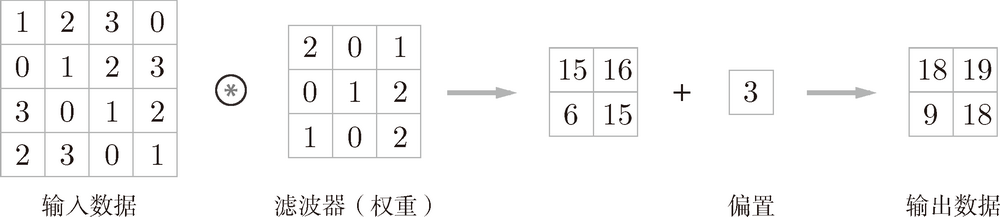

### 2.3 填充
1. 在进行卷积层的处理之前，有时要向输入数据的周围填入固定的数据（比如 0 等），这称为 **填充**（padding），是卷积运算中经常会用到的处理。
2. 在下图的例子中，对大小为 (4, 4) 的输入数据应用了幅度为 1 的填充
    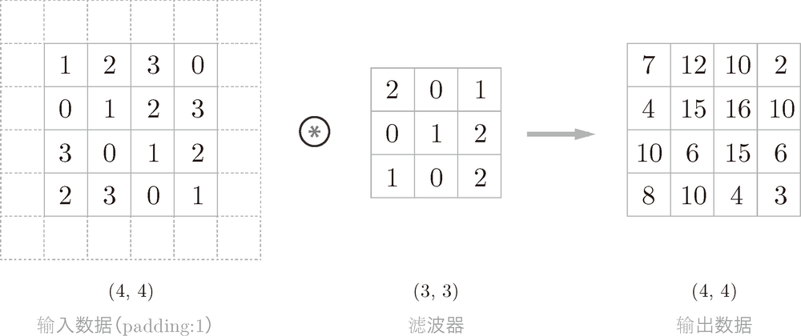
3. 使用填充主要是为了调整输出的大小。比如，对大小为 (4, 4) 的输入数据应用 (3, 3) 的滤波器时，输出大小变为 (2, 2)，相当于输出大小比输入大小缩小了 2 个元素。这在反复进行多次卷积运算的深度网络中会成为问题。
2. 因为如果每次进行卷积运算都会缩小空间，那么在某个时刻输出大小就有可能变为 1，导致无法再应用卷积运算。
3. 为了避免出现这样的情况，就要使用填充。在刚才的例子中，将填充的幅度设为 1，那么相对于输入大小 (4, 4)，输出大小也保持为原来的 (4, 4)。因此，卷积运算就可以在保持空间大小不变的情况下将数据传给下一层。

### 2.4 步幅
1. 应用滤波器的位置间隔称为 **步幅**（stride）。之前的例子中步幅都是 1，如果将步幅设为 2，则如下图所示
    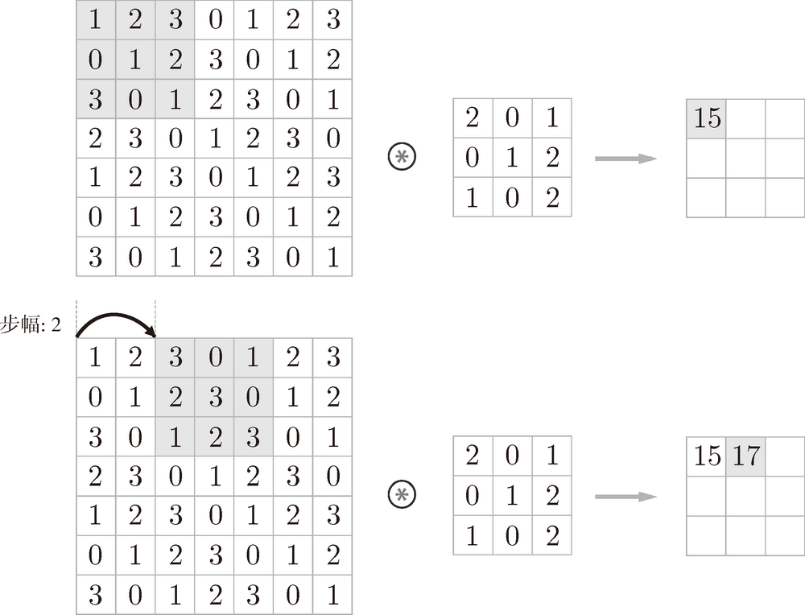
2. 接下来，我们看一下对于填充和步幅，如何计算输出大小。
3. 这里，假设输入大小为 (H, W)，滤波器大小为 (FH, FW)，输出大小为 (OH, OW)，填充为 P，步幅为 S。此时，输出大小可通过式 (7.1) 进行计算。

    $$\begin{aligned}OH&=\frac{H+2P-FH}{S}+1\\OW&=\frac{W+2P-FW}{S}+1\end{aligned}$$

### 2.5 三维数据的卷积运算
1. 例如图像是 3 维数据，除了高、长方向之外，还需要处理通道方向。下图是对加上了通道方向的 3 维数据进行卷积运算的例子
    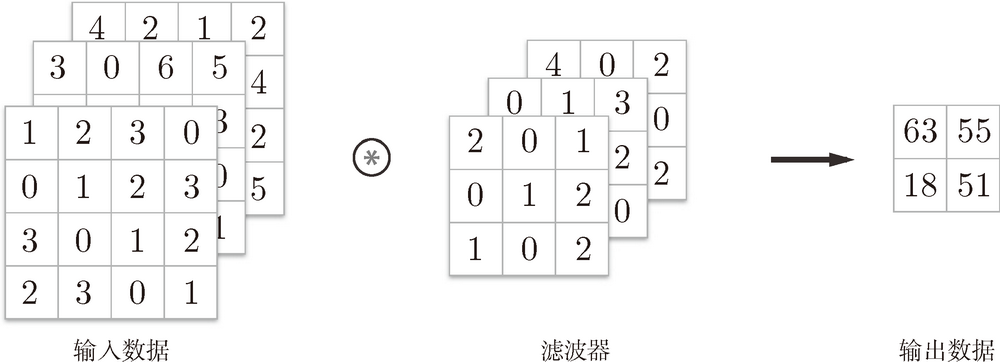
2. 下面是计算步骤
    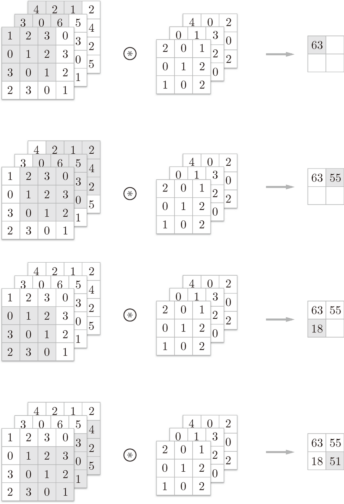

### 2.6 结合方块思考
1. 将数据和滤波器结合长方体的方块来考虑，方块是如下图所示的 3 维长方体
    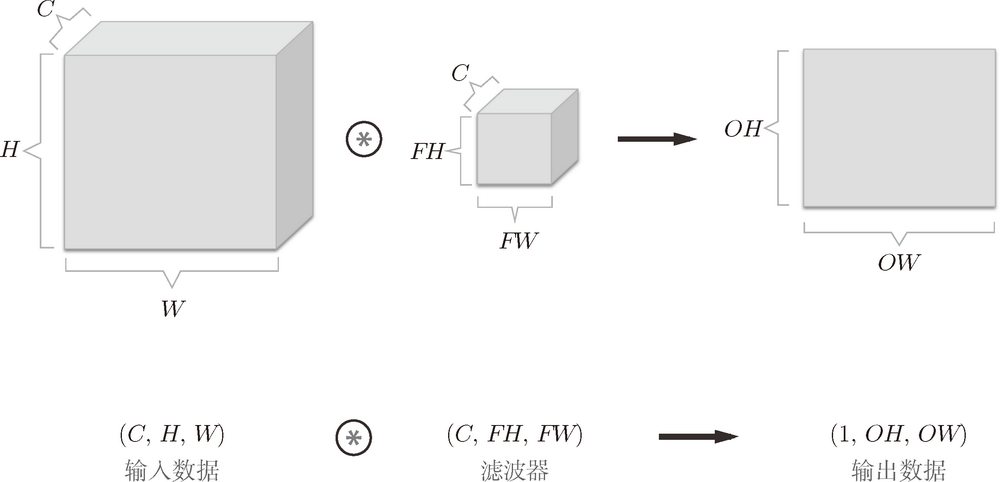
2. 把 3 维数据表示为多维数组时，书写顺序为（channel, height, width）。比如，通道数为 C、高度为 H、长度为 W 的数据的形状可以写成（C, H, W）。滤波器也一样，要按（channel, height, width）的顺序书写。比如，通道数为 C、滤波器高度为 FH（Filter Height）、长度为 FW（Filter Width）时，可以写成（C, FH, FW）。
3. 在这个例子中，数据输出是 1 张特征图。所谓 1 张特征图，换句话说，就是通道数为 1 的特征图。
4. 如果要在通道方向上也拥有多个卷积运算的输出，就需要用到多个滤波器（权重）。如下图所示
    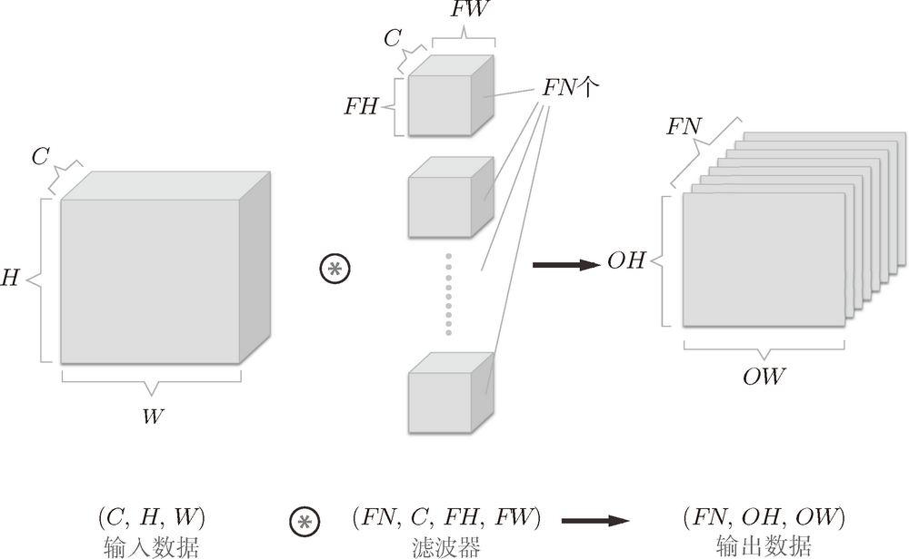
5. 通过应用 FN 个滤波器，输出特征图也生成了 FN 个。如果将这 FN 个特征图汇集在一起，就得到了形状为 (FN, OH, OW) 的方块。将这个方块传给下一层，就是 CNN 的处理流。
6. 卷积运算中也存在偏置，如果进一步追加偏置的加法运算处理，则结果如下图所示
    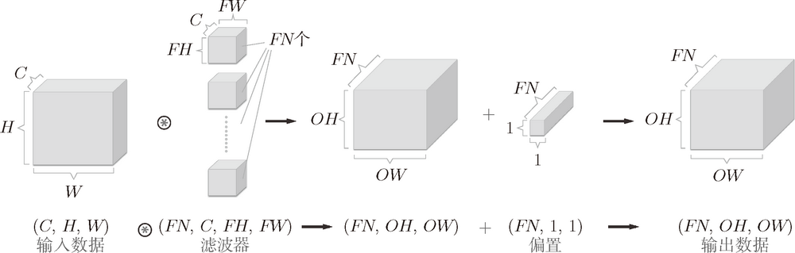
7. 这里，偏置的形状是 (FN, 1, 1)，滤波器的输出结果的形状是 (FN, OH, OW)。这两个方块相加时，要对滤波器的输出结果 (FN, OH, OW) 按通道加上相同的偏置值。
8. 另外，不同形状的方块相加时，可以基于 NumPy 的广播功能轻松实现。

### 2.7 批处理
为了使卷积运算也可以批处理，需要将在各层间传递的数据保存为 4 维数据。具体地讲，就是按 (batch_num, channel, height, width) 的顺序保存数据。
    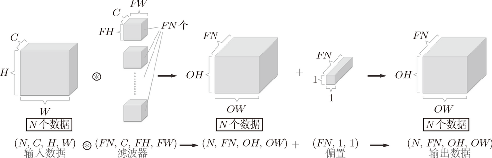

## 3. 池化层
1. 池化是缩小高、长方向上的空间的运算。比如下图，是进行将 2 × 2 的区域集约成 1 个元素的处理，缩小空间大小。
    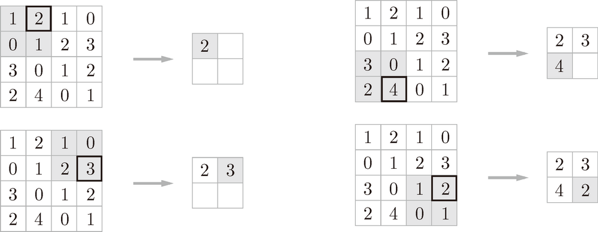
2. 这里是按步幅 2 进行 2 × 2 的 Max 池化时的处理顺序。“Max 池化” 是获取最大值的运算，“2 × 2” 表示目标区域的大小。这个例子中将步幅设为了 2，所以 2 × 2 的窗口的移动间隔为 2 个元素。
3. 另外，一般来说，池化的窗口大小会和步幅设定成相同的值。
4. 除了 Max 池化之外，还有 Average 池化等。相对于 Max 池化是从目标区域中取出最大值，Average 池化则是计算目标区域的平均值。在图像识别领域，主要使用 Max 池化。

### 3.1 池化层的特征
#### 没有要学习的参数
池化层和卷积层不同，没有要学习的参数。池化只是从目标区域中取最大值（或者平均值）。

#### 通道数不发生变化
经过池化运算，输入数据和输出数据的通道数不会发生变化。如下图所示，计算是按通道独立进行的
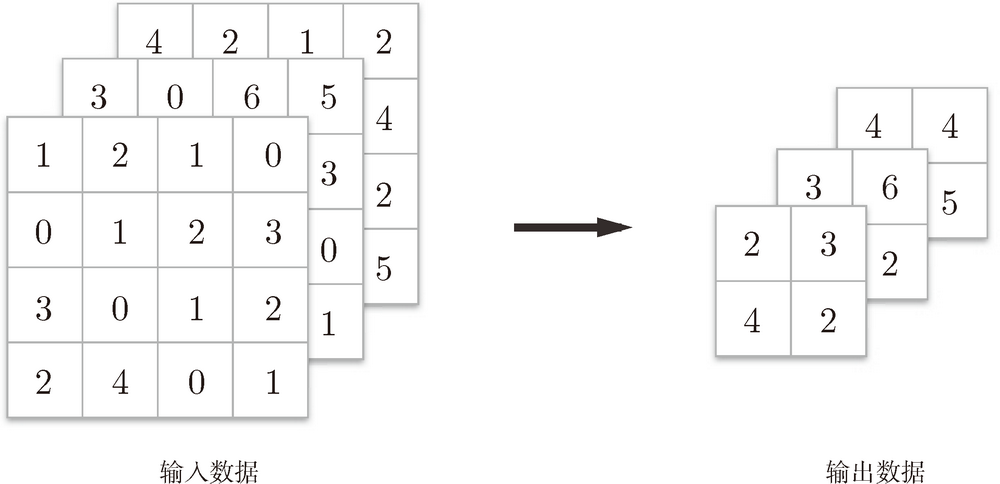

#### 对微小的位置变化具有鲁棒性
输入数据发生微小偏差时，池化仍会返回相同的结果。因此，池化对输入数据的微小偏差具有鲁棒性。比如，3 × 3 的池化的情况下，如下图所示，池化会吸收输入数据的偏差
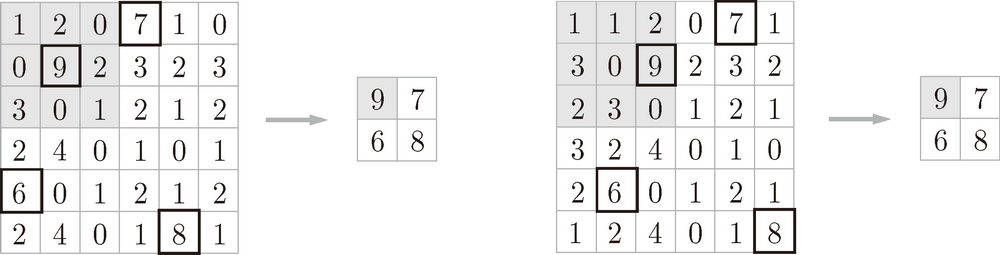

## References
* [《深度学习入门》](https://book.douban.com/subject/30270959/)