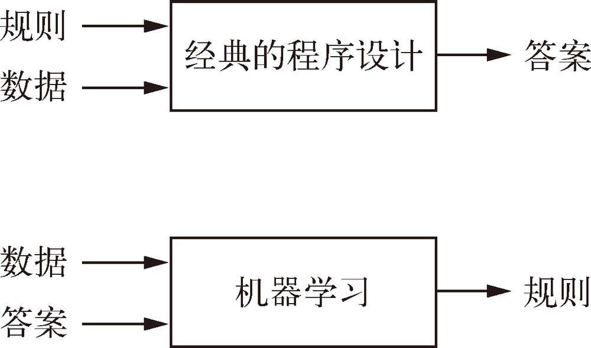
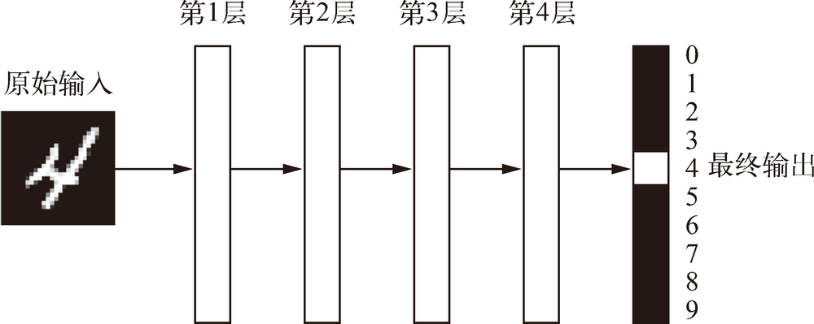
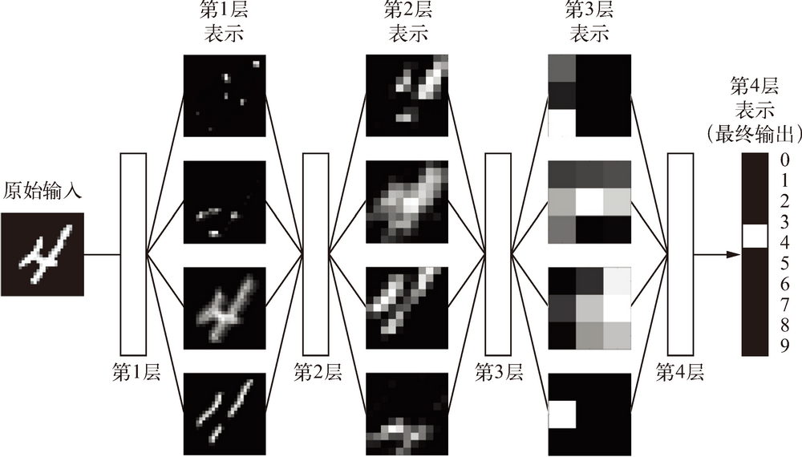
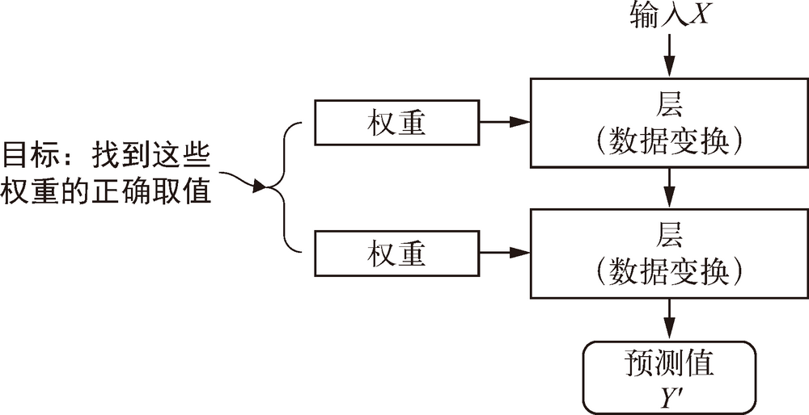
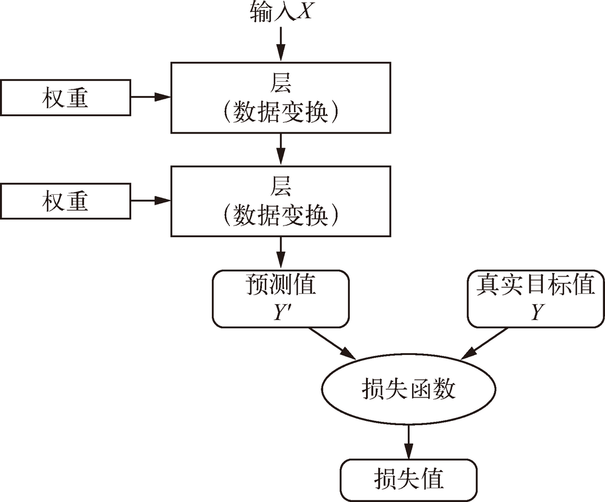
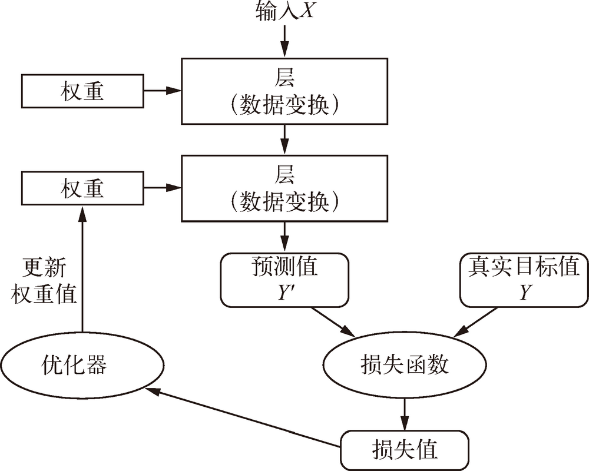

# Basic

## 人工智能、机器学习与深度学习
### 人工智能
1. 人工智能的简洁定义如下：努力将通常由人类完成的智力任务自动化。
2. 人工智能是一个综合性的领域，不仅包括机器学习与深度学习，还包括更多不涉及学习的方法。例如，早期的国际象棋程序仅包含程序员精心编写的硬编码规则，并不属于机器学习。
3. 在相当长的时间内，许多专家相信，只要程序员精心编写足够多的明确规则来处理知识，就可以实现与人类水平相当的人工智能。这一方法被称为**符号主义人工智能**（symbolic AI），从 20 世纪 50 年代到 80 年代末是人工智能的主流范式。
4. 在 20 世纪 80 年代的**专家系统**（expert system）热潮中，这一方法的热度达到了顶峰。

### 机器学习
1. 在经典的程序设计（即符号主义人工智能的范式）中，人们输入的是规则（即程序）和需要根据这些规则进行处理的数据，系统输出的是答案。
2. 利用机器学习，人们输入的是数据和从这些数据中预期得到的答案，系统输出的是规则。这些规则随后可应用于新的数据，并使计算机自主生成答案。
    
3. 机器学习系统是**训练出来的**，而不是明确地用程序编写出来的。将与某个任务相关的许多示例输入机器学习系统，它会在这些示例中找到统计结构，从而最终找到规则将任务自动化。
4. 机器学习与数理统计密切相关，但二者在几个重要方面有所不同。
5. 不同于统计学，机器学习经常用于处理复杂的大型数据集（比如包含数百万张图像的数据集，每张图像又包含数万个像素），用经典的统计分析（比如贝叶斯分析）来处理这种数据集是不切实际的。
6. 因此，机器学习（尤其是深度学习）呈现出相对较少的数学理论（可能太少了），并且是以工程为导向的。这是一门需要上手实践的学科，想法更多地是靠实践来证明，而不是靠理论推导。
7. 可以看出来，符号主义人工智能的范式是人在学习，人会很明确处理问题的每一个步骤。而机器学习则是人在帮助机器来学习，学习的主体是机器，人只是通过类似于奖惩规则的体系来约束机器往对的方向发展。

### 从数据中学习表示
1. 为了给出深度学习的定义并搞清楚深度学习与其他机器学习方法的区别，我们首先需要知道机器学习算法在做什么。
2. 前面说过，给定包含预期结果的示例，机器学习将会发现执行一项数据处理任务的规则。因此，我们需要以下三个要素来进行机器学习
    * **输入数据点**。例如，你的任务是语音识别，那么这些数据点可能是记录人们说话的声音文件。如果你的任务是为图像添加标签，那么这些数据点可能是图像。
    * **预期输出的示例**。对于语音识别任务来说，这些示例可能是人们根据声音文件整理生成的文本。对于图像标记任务来说，预期输出可能是“狗”“猫”之类的标签。
    * **衡量算法效果好坏的方法**。这一衡量方法是为了计算算法的当前输出与预期输出的差距。衡量结果是一种反馈信号，用于调节算法的工作方式。这个调节步骤就是我们所说的**学习**。
3. 机器学习模型将输入数据变换为有意义的输出，这是一个从已知的输入和输出示例中进行“学习”的过程。
4. 因此，机器学习和深度学习的核心问题在于有意义地变换数据，换句话说，在于学习输入数据的有用表示（representation）——这种表示可以让数据更接近预期输出。
5. 什么是表示？这一概念的核心在于以一种不同的方式来查看数据（即表征数据或将数据编码）。
6. 比如说要识别图像中的女人。输入的图片最开始的时候只是像素，这时可以说是最基础的表示。机器需要以不同的方式来看待它们，比如说先以颜色，那个根据颜色这一维度，这些像素点就有了一种新的表示；然后可以再一步步的抽象，数据的表示不断变化也不断接近结果，比如图像时是否为生物-是否为人-是否为女人，每一个新的维度都是最基础的像素的不同表示形式，但都会一步步的更接近于想要的结果。
7. 这种不断的对数据进行转化、分类，进而寻找数据更合适的表现的过程，就是机器学习中的学习。
8. 所有机器学习算法都包括自动寻找这样一种变换：这种变换可以根据任务将数据转化为更加有用的表示。机器学习算法在寻找这些变换时通常没有什么创造性，而仅仅是遍历一组预先定义好的操作，这组操作叫作**假设空间**（hypothesis space）。
9. 这就是机器学习的技术定义：在预先定义好的可能性空间中，利用反馈信号的指引来寻找输入数据的有用表示。这个简单的想法可以解决相当多的智能任务，从语音识别到自动驾驶都能解决。

### 深度学习之“深度”
1. 深度学习是机器学习的一个分支领域：它是从数据中学习表示的一种新方法，强调从连续的**层**（layer）中进行学习，这些层对应于越来越有意义的表示。
2. “深度学习”中的“深度”指的并不是利用这种方法所获取的更深层次的理解，而是指一系列连续的表示层。
3. 数据模型中包含多少层，这被称为模型的**深度**（depth）。
4. 这一领域的其他名称包括**分层表示学习**（layered representations learning）和**层级表示学习**（hierarchical representations learning）。
5. 现代深度学习通常包含数十个甚至上百个连续的表示层，这些表示层全都是从训练数据中自动学习的。
6. 与此相反，其他机器学习方法的重点往往是仅仅学习一两层的数据表示，因此有时也被称为**浅层学习**（shallow learning）。
7. 在深度学习中，这些分层表示几乎总是通过叫作**神经网络**（neural network）的模型来学习得到的。神经网络的结构是逐层堆叠。就我们的目的而言，深度学习是从数据中学习表示的一种数学框架。
8. 深度学习算法学到的表示是什么样的？我们来看下面这个多层网络如何对数字图像进行变换，以便识别图像中所包含的数字。
    
9. 如下图所示，这个网络将数字图像转换成与原始图像差别越来越大的表示，而其中关于最终结果的信息却越来越丰富。你可以将深度网络看作多级信息蒸馏操作：信息穿过连续的过滤器，其纯度越来越高（即对任务的帮助越来越大）。
    
10. 这就是深度学习的技术定义：学习数据表示的多级方法。这个想法很简单，但事实证明，非常简单的机制如果具有足够大的规模，将会产生魔法般的效果。

### 用三张图理解深度学习的工作原理
### 权重
1. 现在你已经知道，机器学习是将输入（比如图像）映射到目标（比如标签“猫”），这一过程是通过观察许多输入和目标的示例来完成的。
2. 你还知道，深度神经网络通过一系列简单的数据变换（层）来实现这种输入到目标的映射，而这些数据变换都是通过观察示例学习到的。下面来具体看一下这种学习过程是如何发生的。
3. 神经网络中每层对输入数据所做的具体操作保存在该层的**权重**（weight）中，其本质是一串数字。用术语来说，每层实现的变换由其权重来**参数化**（parameterize）。权重有时也被称为该层的**参数**（parameter）。
4. 在这种语境下，学习的意思是为神经网络的所有层找到一组权重值，使得该网络能够将每个示例输入与其目标正确地一一对应。
    
5. 但重点来了：一个深度神经网络可能包含数千万个参数。找到所有参数的正确取值可能是一项非常艰巨的任务，特别是考虑到修改某个参数值将会影响其他所有参数的行为。

### 损失函数
1. 想要控制一件事物，首先需要能够观察它。想要控制神经网络的输出，就需要能够衡量该输出与预期值之间的距离。
2. 这是神经网络**损失函数**（loss function）的任务，该函数也叫**目标函数**（objective function）。
3. 损失函数的输入是网络预测值与真实目标值（即你希望网络输出的结果），然后计算一个距离值，衡量该网络在这个示例上的效果好坏。
    
4. 深度学习的基本技巧是利用这个距离值作为反馈信号来对权重值进行微调，以降低当前示例对应的损失值。

### 训练
1. 上面提到的微调由**优化器**（optimizer）来完成，它实现了所谓的**反向传播**（backpropagation）算法，这是深度学习的核心算法。
    
2. 一开始对神经网络的权重随机赋值，因此网络只是实现了一系列随机变换。其输出结果自然也和理想值相去甚远，相应地，损失值也很高。
3. 但随着网络处理的示例越来越多，权重值也在向正确的方向逐步微调，损失值也逐渐降低。这就是**训练循环**（training loop），将这种循环重复足够多的次数（通常对数千个示例进行数十次迭代），得到的权重值可以使损失函数最小。
4. 具有最小损失的网络，其输出值与目标值尽可能地接近，这就是训练好的网络。
5. 再次强调，这是一个简单的机制，一旦具有足够大的规模，将会产生魔法般的效果。

## References
* [Python深度学习](https://book.douban.com/subject/30293801/)