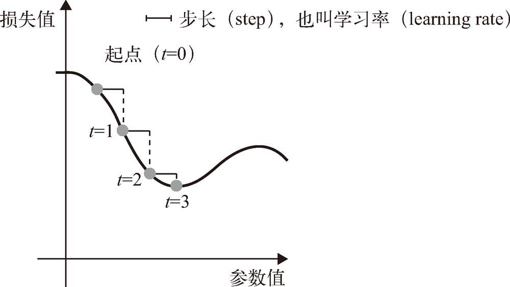
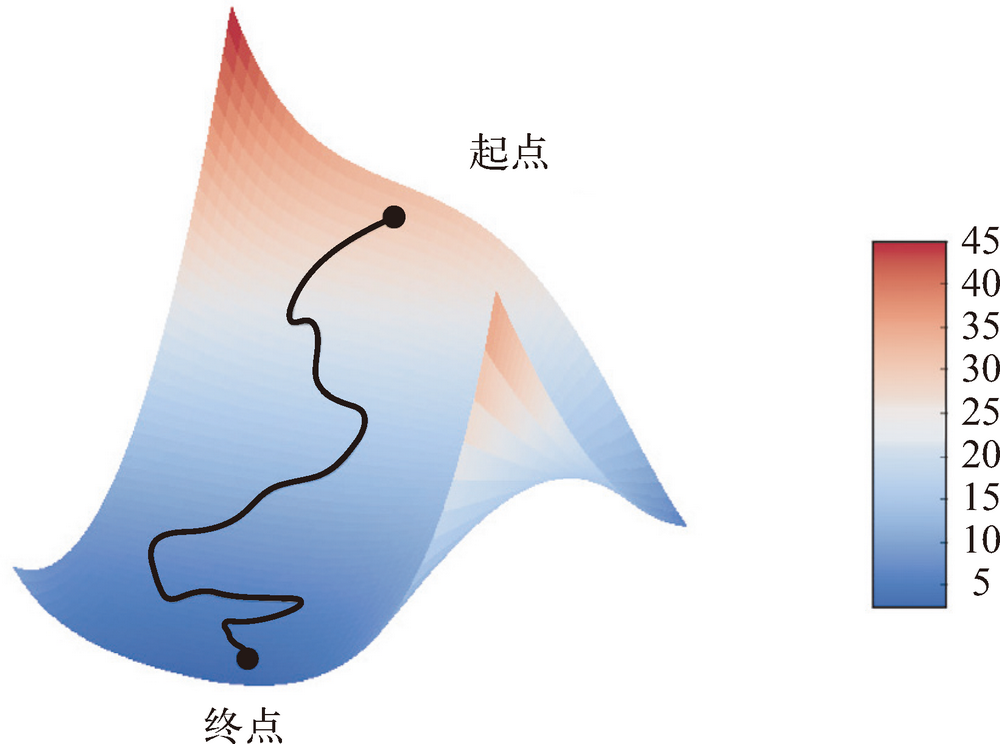
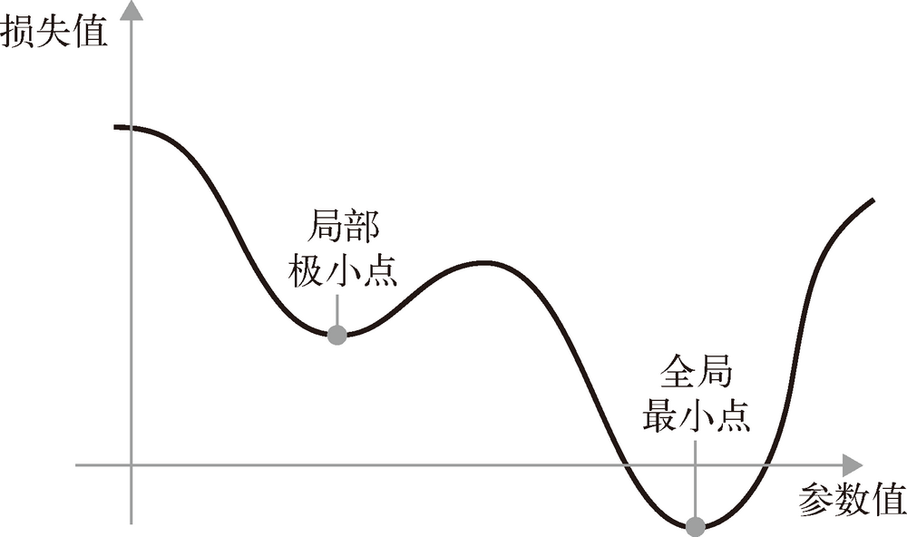

# Differentiation——基于梯度的优化

1. 一个神经网络初始的**权重**（weight）或**可训练参数**（trainable parameter）只会取较小的随机值，这一步叫作**随机初始化**（random initialization）。当然，计算结果肯定不会得到任何有用的表示。
2. 虽然得到的表示是没有意义的，但这是一个起点。下一步则是根据反馈信号逐渐调节这些权重。
3. 这个逐渐调节的过程叫作**训练**，也就是机器学习中的学习。
4. 上述过程发生在一个**训练循环**（training loop）内，其具体过程如下。必要时一直重复这些步骤。
    1. 抽取训练样本 `x` 和对应目标 `y` 组成的数据批量。
    2. 在 `x` 上运行网络［这一步叫作**前向传播**（forward pass）］，得到预测值 `y_pred`。
    3. 计算网络在这批数据上的损失，用于衡量 `y_pred` 和 `y` 之间的距离。
    4. 更新网络的所有权重，使网络在这批数据上的损失略微下降。
5. 最终得到的网络在训练数据上的损失非常小，即预测值 `y_pred` 和预期目标 `y` 之间的距离非常小。网络“学会”将输入映射到正确的目标。乍一看可能像魔法一样，但如果你将其简化为基本步骤，那么会变得非常简单。
6. 第一步看起来非常简单，只是输入 / 输出（I/O）的代码。第二步和第三步仅仅是一些张量运算的应用。难点在于第四步：更新网络的权重。考虑网络中某个权重系数，你怎么知道这个系数应该增大还是减小，以及变化多少？
7. 一种简单的解决方案是，保持网络中其他权重不变，只考虑某个标量系数，让其尝试不同的取值。假设这个系数的初始值为 0.3。对一批数据做完前向传播后，网络在这批数据上的损失是 0.5。如果你将这个系数的值改为 0.35 并重新运行前向传播，损失会增大到 0.6。但如果你将这个系数减小到 0.25，损失会减小到 0.4。在这个例子中，将这个系数减小 0.05 似乎有助于使损失最小化。对于网络中的所有系数都要重复这一过程。
8. 但这种方法是非常低效的，因为对每个系数（系数很多，通常有上千个，有时甚至多达上百万个）都需要计算两次前向传播（计算代价很大）。
9. 一种更好的方法是利用网络中所有运算都是`可微`（differentiable）的这一事实，计算损失相对于网络系数的**梯度**（gradient），然后向梯度的反方向改变系数，从而使损失降低。


## 导数
1. 假设有一个连续的光滑函数 $f(x) = y$，将实数 $x$ 映射为另一个实数 $y$。
2. 由于函数是连续的，$x$ 的微小变化只能导致 $y$ 的微小变化——这就是函数连续性的直观解释。
3. 假设 $x$ 增大了一个很小的因子 $epsilon_x$，这导致 $y$ 也发生了很小的变化，即 $epsilon_y$：
    ```
    f(x + epsilon_x) = y + epsilon_y
    ```
4. 此外，由于函数是光滑的（即函数曲线没有突变的角度），在某个点 p 附近，如果 $epsilon_x$ 足够小，就可以将 $f$ 近似为斜率为 $a$ 的线性函数，这样 $epsilon_y$ 就变成了 $a * epsilon_x$：
    ```
    f(x + epsilon_x) = y + a * epsilon_x
    ```
    显然，只有在 x 足够接近 p 时，这个线性近似才有效。
5. 斜率 $a$ 被称为 $f$ 在 p 点的**导数**（derivative）。


## 张量运算的导数：梯度
1. **梯度**（gradient）是张量运算的导数。它是导数这一概念向多元函数导数的推广。多元函数是以张量作为输入的函数。
2. 假设有一个输入向量 $x$、一个矩阵 $W$、一个目标 $y$ 和一个损失函数 $loss$。你可以用 $W$ 来计算预测值 $y_pred$，然后计算损失，或者说预测值 $y_pred$ 和目标 $y$ 之间的距离。
    ```
    y_pred = dot(W, x)
    loss_value = loss(y_pred, y)
    ```
3. 如果输入数据 $x$ 和 $y$ 保持不变，那么这可以看作将 $W$ 映射到损失值的函数。也就是说，可以通过调整矩阵 $W$ 的参数来寻找最小的 $loss_value$。
    ```
    loss_value = f(W)
    ```
4. 假设 $W$ 的当前值为 $W0$。$f$ 在 $W0$ 点的导数是一个张量 $gradient(f)(W0)$，其形状与 $W$ 相同。TODO，导数也是张量且形状与 $W$ 相同的原因是什么？
5. 每个系数 $gradient(f)(W0)[i, j]$ （$W0$ 这个矩阵是导函数的自变量，而 $[i, j]$ 是矩阵 $(W0)$ 的某个具体坐标值）表示改变 $W0[i, j]$ 时 $loss_value$ 变化的方向和大小。张量 $gradient(f)(W0)$ 是函数 $f(W) = loss_value$ 在 $W0$ 的导数。
6. 前面已经看到，单变量函数 $f(x)$ 的导数可以看作函数 $f$ 曲线的斜率。同样，$gradient(f)(W0)$ 也可以看作表示 $f(W)$ 在 $W0$ 附近**曲率**（curvature）的张量。


## 随机梯度下降
1. 给定一个可微函数，理论上可以用解析法找到它的最小值：函数的最小值是导数为 0 的点，因此你只需找到所有导数为 0 的点，然后计算函数在其中哪个点具有最小值。
2. 将这一方法应用于神经网络，就是用解析法求出最小损失函数对应的所有权重值。
3. 可以通过对方程 $gradient(f)(W) = 0$ 求解 $W$ 来实现这一方法。
4. 这是包含 N 个变量的多项式方程，其中 N 是网络中系数的个数。N=2 或 N=3 时可以对这样的方程求解，但对于实际的神经网络是无法求解的，因为参数的个数不会少于几千个，而且经常有上千万个。
5. 但是，可以使用前面总结的四步算法：基于当前在随机数据批量上的损失，一点一点地对参数进行调节。
6. 由于处理的是一个可微函数，你可以计算出它的梯度，从而有效地实现第四步。应该是说在梯度导函数中，不断调整 $W$ 使得梯度导函数的值接近于0.
    1. 抽取训练样本 $$x 和对应目标 $y$ 组成的数据批量。
    2. 在 $x$ 上运行网络，得到预测值 $y_pred$。
    3. 计算网络在这批数据上的损失，用于衡量 $y_pred$ 和 $y$ 之间的距离。
    4. 计算损失相对于网络参数的梯度［一次**反向传播**（backward pass）］。
    5. 将参数沿着梯度的反方向移动一点，比如 $W -= step * gradient$，从而使这批数据上的损失减小一点。
7. 这个方法叫作**小批量随机梯度下降**（mini-batch stochastic gradient descent，又称为小批量 SGD）。术语**随机**（stochastic）是指每批数据都是随机抽取的（**stochastic** 是 **random** 在科学上的同义词）。
8. 下图给出了一维的情况，网络只有一个参数，并且只有一个训练样本
    
9. 直观上来看，为 `step` 因子选取合适的值是很重要的。如果取值太小，则沿着曲线的下降需要很多次迭代，而且可能会陷入局部极小点（下述）。如果取值太大，则更新权重值之后可能会出现在曲线上完全随机的位置。
10. 注意，小批量 SGD 算法的一个变体是每次迭代时只抽取一个样本和目标，而不是抽取一批数据。这叫作**真 SGD**（有别于**小批量 SGD**）。还有另一种极端，每一次迭代都在所有数据上运行，这叫作**批量 SGD**。这样做的话，每次更新都更加准确，但计算代价也高得多。这两个极端之间的有效折中则是选择合理的批量大小。
11. 上图描述的是一维参数空间中的梯度下降，但在实践中需要在高维空间中使用梯度下降。神经网络的每一个权重参数都是空间中的一个自由维度，网络中可能包含数万个甚至上百万个参数维度。下面的图将梯度下降沿着二维损失曲面可视化，但你不可能将神经网络的实际训练过程可视化。
    

### 优化方法
1. SGD 还有多种变体，其区别在于计算下一次权重更新时还要考虑上一次权重更新，而不是仅仅考虑当前梯度值，比如带动量的 SGD、Adagrad、RMSProp 等变体。
2. 这些变体被称为**优化方法**（optimization method）或**优化器**（optimizer）。
3. 其中**动量**的概念尤其值得关注，它在许多变体中都有应用。动量解决了 SGD 的两个问题：收敛速度和局部极小点。
4. 参考下图，给出了损失作为网络参数的函数的曲线
    
5. 如你所见，在某个参数值附近，有一个**局部极小点**（local minimum）：在这个点附近，向左移动和向右移动都会导致损失值增大。
6. 如果使用小学习率的 SGD 进行优化，那么优化过程可能会陷入局部极小点，导致无法找到全局最小点。
7. 使用动量方法可以避免这样的问题，这一方法的灵感来源于物理学。有一种有用的思维图像，就是将优化过程想象成一个小球从损失函数曲线上滚下来。如果小球的动量足够大，那么它不会卡在峡谷里，最终会到达全局最小点。
8. 动量方法的实现过程是每一步都移动小球，不仅要考虑当前的斜率值（当前的加速度），还要考虑当前的速度（来自于之前的加速度）。
9. 这在实践中指的是，更新参数 w 不仅要考虑当前的梯度值，还要考虑上一次的参数更新，其简单实现如下所示 不懂
    ```py
    past_velocity = 0.
    momentum = 0.1  # 不变的动量因子
    while loss > 0.01:   # 优化循环
        w, loss, gradient = get_current_parameters()
        velocity = past_velocity * momentum - learning_rate * gradient
        w = w + momentum * velocity - learning_rate * gradient
        past_velocity = velocity
        update_parameter(w)
    ```


## 链式求导：反向传播算法
1. 在前面的算法中，我们假设函数是可微的，因此可以明确计算其导数。在实践中，神经网络函数包含许多连接在一起的张量运算，每个运算都有简单的、已知的导数。
2. 例如，下面这个网络 $$f 包含 3 个张量运算 $a$、$b$ 和 $c$，还有 3 个权重矩阵 $W1$、$W2$ 和 $W3$。
    ```
    f(W1, W2, W3) = a(W1, b(W2, c(W3)))
    ```
3. 根据微积分的知识，这种函数链可以利用下面这个恒等式进行求导，它称为**链式法则**（chain rule）：$(f(g(x)))' = f'(g(x)) * g'(x)$。
4. 将链式法则应用于神经网络梯度值的计算，得到的算法叫作**反向传播**（backpropagation，有时也叫**反式微分**，reverse-mode differentiation）。
5. 反向传播从最终损失值开始，从最顶层反向作用至最底层，利用链式法则计算每个参数对损失值的贡献大小。