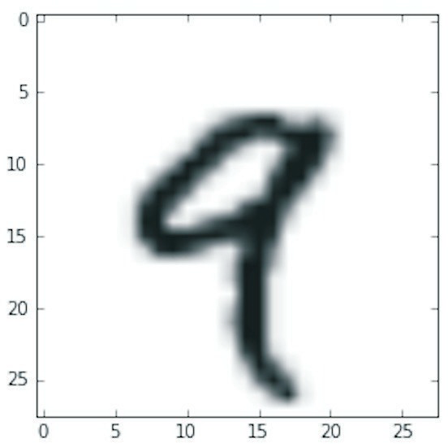
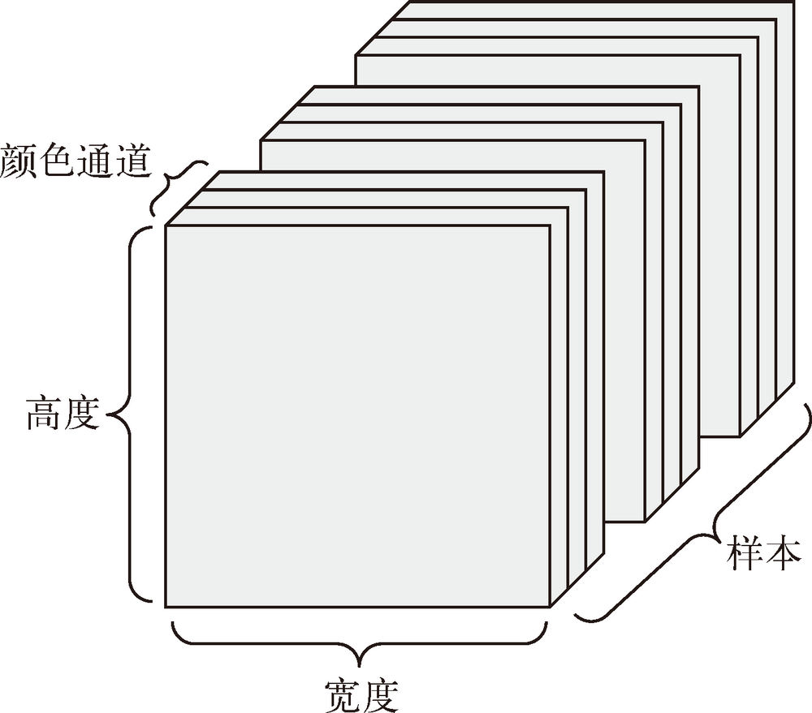

## Tensor
1. 一般来说，当前所有机器学习系统都使用张量作为基本数据结构。
2. 张量这一概念的核心在于，它是一个数据容器。它包含的数据几乎总是数值数据，因此它是数字的容器。
3. 你可能对矩阵很熟悉，它是二维张量。张量是矩阵向任意维度的推广
4. 张量的**维度**（dimension）通常叫作**轴**（axis）］。张量轴的个数也叫作**阶**（rank）。


## 不同维度的张量
### 标量（0D 张量）
1. 仅包含一个数字的张量叫作**标量**（scalar，也叫标量张量、零维张量、0D 张量）。
2. 标量张量有 0 个轴。
3. 在 Numpy 中，一个 float32 或 float64 的数字就是一个标量张量（或标量数组）。

### 向量（1D 张量）
1. 数字组成的数组叫作**向量**（vector）或一维张量（1D 张量）。
2. 一维张量只有一个轴。
3. 下面是一个 Numpy 向量。
    ```py
    >>> x = np.array([12, 3, 6, 14, 7])
    >>> x
    array([12, 3, 6, 14, 7])
    >>> x.ndim
    1
    ```
4. 这个向量有 5 个元素，所以被称为 **5D 向量**。不要把 5D 向量和 5D 张量弄混！ 5D 向量只有一个轴，沿着轴有5 个维度，而 5D 张量有 5 个轴（沿着每个轴可能有任意个维度）。
6. **维度**（dimensionality）可以表示沿着某个轴上的元素个数（比如 5D 向量），也可以表示张量中轴的个数（比如 5D 张量），这有时会令人感到混乱。对于后一种情况，技术上更准确的说法是 **5 阶张量**（张量的阶数即轴的个数），但 **5D 张量**这种模糊的写法更常见。

### 矩阵（2D 张量）
1. 向量组成的数组叫作**矩阵**（matrix）或二维张量（2D 张量）。矩阵有 2 个轴（通常叫作**行**和**列**）。
2. 你可以将矩阵直观地理解为数字组成的矩形网格。

### 3D 张量与更高维张量
1. 将多个矩阵组合成一个新的数组，可以得到一个 3D 张量，你可以将其直观地理解为数字组成的立方体。
2. 将多个 3D 张量组合成一个数组，可以创建一个 4D 张量，以此类推。
3. 深度学习处理的一般是 0D 到 4D 的张量，但处理视频数据时可能会遇到 5D 张量。


## 关键属性
张量是由以下三个关键属性来定义的。
* **轴的个数（阶）**。例如，3D 张量有 3 个轴，矩阵有 2 个轴。
* **形状**。这是一个整数元组，表示张量沿每个轴的维度大小（元素个数）。向量的形状只包含一个元素，比如 `(5,)`，而标量的形状为空，即 `()`。
* **数据类型**。这是张量中所包含数据的类型，例如，张量的类型可以是 float32、uint8、float64 等。在极少数情况下，你可能会遇到字符（char）张量。

### MNIST 数据集的例子
1. 首先加载 MNIST 数据集。
    ```py
    from keras.datasets import mnist

    (train_images, train_labels), (test_images, test_labels) = mnist.load_data()
    ```
2. 接下来，我们给出张量 train_images 的轴的个数，即 ndim 属性
    ```py
    >>> print(train_images.ndim)
    3
    ```
3. 下面是它的形状
    ```py
    >>> print(train_images.shape)
    (60000, 28, 28)
    ```
4. 下面是它的数据类型
    ```py
    >>> print(train_images.dtype)
    uint8
    ```
5. 所以，这里 `train_images` 是一个由 8bit 整数组成的 3D 张量。更确切地说，它是 60 000 个矩阵组成的数组，每个矩阵由 28×28 个 8bit 整数组成。
6. 每个这样的矩阵都是一张灰度图像，元素取值范围为 0~255（8bit，$2^8$）。我们用 Matplotlib 库（Python 标准科学套件的一部分）来显示这个 3D 张量中的第 4 个数字，如图
    


## 张量切片
1. 选择张量的特定元素叫作**张量切片**（tensor slicing）。
2. 下面这个例子选择第 10~100 个数字（不包括第 100 个），并将其放在形状为 `(90, 28, 28)` 的数组中。
    ```py
    >>> my_slice = train_images[10:100]
    >>> print(my_slice.shape)
    (90, 28, 28)
    ```
3. 它等同于下面这个更复杂的写法，给出了切片沿着每个张量轴的起始索引和结束索引。注意，: 等同于选择整个轴。
    ```py
    >>> my_slice = train_images[10:100, :, :] ←------ 等同于前面的例子
    >>> my_slice.shape
    (90, 28, 28)
    >>> my_slice = train_images[10:100, 0:28, 0:28] ←------也等同于前面的例子
    >>> my_slice.shape
    (90, 28, 28)
    ```


## 2数据批量的概念
1. 通常来说，深度学习中所有数据张量的第一个轴（0 轴，因为索引从 0 开始）都是**样本轴**（samples axis，有时也叫**样本维度**）。在 MNIST 的例子中，样本就是数字图像。
2. **此外，深度学习模型不会同时处理整个数据集，而是将数据拆分成小批量。具体来看，下面是 MNIST 数据集的一个批量，批量大小为 128。
    ```py
    batch = train_images[:128]
    ```
    然后是下一个批量。
    ```py
    batch = train_images[128:256]
    ```
    然后是第 n 个批量。
    ```py
    batch = train_images[128 * n:128 * (n + 1)]
    ```
3. 对于这种批量张量，第一个轴（0 轴）叫作**批量轴**（batch axis）或**批量维度**（batch dimension）。


## 现实世界中的数据张量
### 向量数据
1. 这是最常见的数据。对于这种数据集，每个数据点都被编码为一个向量，因此一个数据批量就被编码为 2D 张量（即向量组成的数组）。
2. 其中第一个轴是**样本轴**，第二个轴是**特征轴**。
3. 我们来看两个例子。
    * 人口统计数据集，其中包括每个人的年龄、邮编和收入。每个人可以表示为包含 3 个值的向量，而整个数据集包含 100 000 个人，因此可以存储在形状为 `(100000, 3)` 的 2D 张量中。
    * 文本文档数据集，我们将每个文档表示为每个单词在其中出现的次数（字典中包含 20 000 个常见单词）。每个文档可以被编码为包含 20 000 个值的向量（每个值对应于字典中每个单词的出现次数），整个数据集包含 500 个文档，因此可以存储在形状为 `(500, 20000)` 的张量中。

### 时间序列数据或序列数据
1. 当时间（或序列顺序）对于数据很重要时，应该将数据存储在带有时间轴的 3D 张量中。每个样本可以被编码为一个向量序列（即 2D 张量），因此一个数据批量就被编码为一个 3D 张量。
2. 根据惯例，时间轴始终是第 2 个轴（索引为 1 的轴）。
3. 我们来看几个例子。
    * 股票价格数据集。每一分钟，我们将股票的当前价格、前一分钟的最高价格和前一分钟的最低价格保存下来。因此每分钟被编码为一个 3D 向量，整个交易日被编码为一个形状为 `(390, 3)` 的 2D 张量（一个交易日有 390 分钟），而 250 天的数据则可以保存在一个形状为 `(250, 390, 3)` 的 3D 张量中。这里每个样本是一天的股票数据。
    * 推文数据集。我们将每条推文编码为 280 个字符组成的序列，而每个字符又来自于 128 个字符组成的字母表。在这种情况下，每个字符可以被编码为大小为 128 的二进制向量（只有在该字符对应的索引位置取值为 1，其他元素都为 0）。那么每条推文可以被编码为一个形状为 `(280, 128)` 的 2D 张量，而包含 100 万条推文的数据集则可以存储在一个形状为 `(1000000, 280, 128)` 的张量中。

### 图像数据
1. 图像通常具有三个维度：高度、宽度和颜色深度。
2. 虽然灰度图像（比如 MNIST 数字图像）只有一个颜色通道，因此可以保存在 2D 张量中，但按照惯例，图像张量始终都是 3D 张量。TODO，用 2D 张量表示，是比如某个像素的宽和高都为1则为黑色，否则为透明？
3. 灰度图像的彩色通道只有一维。因此，如果图像大小为 256×256，那么 128 张灰度图像组成的批量可以保存在一个形状为 `(128, 256, 256, 1)` 的张量中。
4. 而 128 张彩色图像组成的批量则可以保存在一个形状为 `(128, 256, 256, 3)` 的张量中。
    

### 视频数据
1. 视频数据是现实生活中需要用到 5D 张量的少数数据类型之一。视频可以看作一系列帧，每一帧都是一张彩色图像。
2. 由于每一帧都可以保存在一个形状为 `(height, width, color_depth)` 的 3D 张量中，因此一系列帧可以保存在一个形状为 `(frames, height, width, color_depth)` 的 4D 张量中，而不同视频组成的批量则可以保存在一个 5D 张量中，其形状为 `(samples, frames, height, width, color_depth)`。
3. 举个例子，一个以每秒 4 帧采样的 60 秒 YouTube 视频片段，视频尺寸为 144×256，这个视频共有 240 帧。4 个这样的视频片段组成的批量将保存在形状为 `(4, 240, 144, 256, 3)` 的张量中。总共有 106 168 320 个值。如果张量的数据类型是 float32，每个值都是 32 位，那么这个张量共有 405MB。你在现实生活中遇到的视频要小得多，因为它们不以 float32 格式存储，而且通常被大大压缩，比如 MPEG 格式。


## References
* [Python深度学习](https://book.douban.com/subject/30293801/)