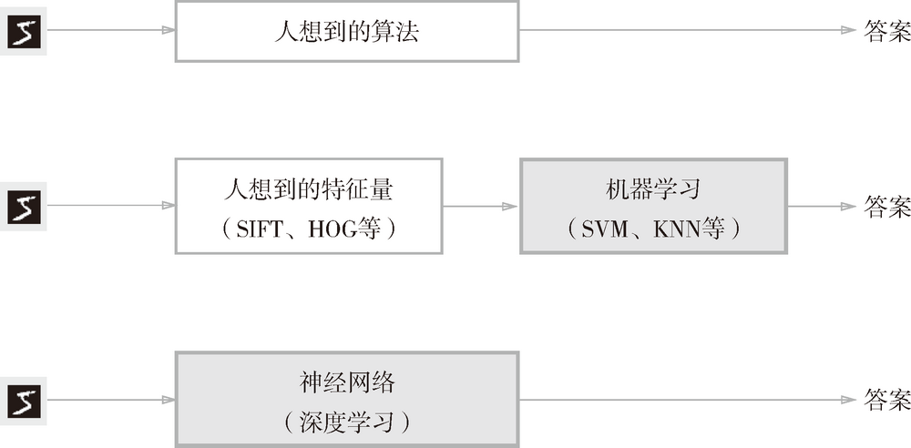
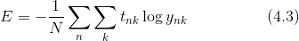
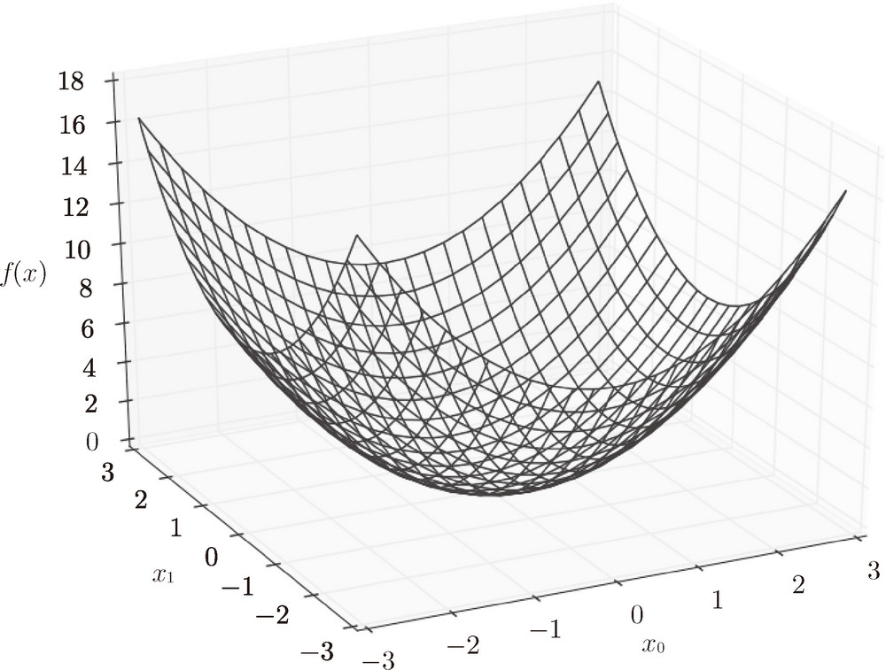

# Basic


<!-- TOC -->

- [Basic](#basic)
    - [思想](#思想)
    - [从数据中学习](#从数据中学习)
        - [数据驱动](#数据驱动)
        - [古典人工智能、机器学习和深度学习的区别](#古典人工智能机器学习和深度学习的区别)
        - [训练数据和测试数据](#训练数据和测试数据)
    - [损失函数](#损失函数)
        - [均方误差（mean squared error）损失函数](#均方误差mean-squared-error损失函数)
        - [交叉熵误差（cross entropy error）损失函数](#交叉熵误差cross-entropy-error损失函数)
    - [mini-batch 学习](#mini-batch-学习)
        - [从数据集中选择批量数据](#从数据集中选择批量数据)
        - [mini-batch 版交叉熵误差的实现](#mini-batch-版交叉熵误差的实现)
    - [为何要设定损失函数](#为何要设定损失函数)
    - [数值微分](#数值微分)
        - [导数](#导数)
        - [数值微分的例子](#数值微分的例子)
        - [偏导数](#偏导数)

<!-- /TOC -->


## 思想
1. 对于智能问题，最初的想法可能也是和古典人工智能的思路一样，即有人设计好思考方式。
2. 最初的人工智能就是这个思路，而我们最初思考人的智能的时候，也会很容易想到人的智能或是被设计或者天然形成了一套完备的机制。
3. 但是，在人类的智能和物理世界中一样，我们目前是无法完备的认识到所有的因果律的，也就是说麦克斯韦妖至少目前还是无法存在的。同样，人工智能在处理复杂问题时，也无法通过预先创造完备的算法来手把手教会机器每一步的思考。
4. 就像对于人的教育一样，教育孩子不仅仅是要告诉他们规则，很多时候，甚至说大多时候，孩子以及长大之后的人生中，都是通过反馈来不断的修补式的学习的。
5. 人只是学习课本知识，能力是很有限的。还需要在实践中不断的检验和学习，接收反馈，然后调整自我。这正如机器学习使用大量数据输入和反馈的过程一样。


## 从数据中学习
1. 神经网络的特征就是可以从数据中学习。所谓“从数据中学习”，是指可以由数据自动决定权重参数的值。
2. 在实际的神经网络中，参数的数量成千上万，在层数更深的深度学习中，参数的数量甚至可以上亿，想要人工决定这些参数的值是不可能的。
3. 对于线性可分问题，感知机是可以利用数据自动学习的。根据“感知机收敛定理”，通过有限次数的学习，线性可分问题是可解的。但是，非线性可分问题则无法通过（自动）学习来解决。

### 数据驱动
1. 数据是机器学习的核心。这种数据驱动的方法，也可以说脱离了过往以人为中心的方法。
2. 通常要解决某个问题，特别是需要发现某种模式时，人们一般会综合考虑各种因素后再给出回答。“这个问题好像有这样的规律性？”“不对，可能原因在别的地方。”——类似这样，人们以自己的经验和直觉为线索，通过反复试验推进工作。而机器学习的方法则极力避免人为介入，尝试从收集到的数据中发现答案（模式）。
3. 神经网络或深度学习则比以往的机器学习方法更能避免人为介入。

### 古典人工智能、机器学习和深度学习的区别
1. 如果让我们自己来设计一个能将图像数字 `5` 正确分类的程序，就会意外地发现这是一个很难的问题。人可以简单地识别出 `5`，但却很难明确说出是基于何种规律而识别出了 `5`。
2. 因此，与其绞尽脑汁，从零开始想出一个可以识别 `5` 的算法，不如考虑通过有效利用数据来解决这个问题。
3. 一种方案是，先从图像中提取**特征量**，再用机器学习技术学习这些特征量的模式。这里所说的“特征量”是指可以从输入数据（输入图像）中准确地提取本质数据（重要的数据）的转换器。例如为了识别数字，人工需要先找出一系列特征，符合哪些特征是 `1`，符合哪些特征是 `2`，等等。
4. 图像的特征量通常表示为向量的形式。在计算机视觉领域，常用的特征量包括 SIFT、SURF 和 HOG 等。使用这些特征量将图像数据转换为向量，然后对转换后的向量使用机器学习中的 SVM、KNN 等分类器进行学习。
5. 机器学习的方法中，由机器从收集到的数据中，按照人工设计的设置的特征量找出规律性。与从零开始想出算法相比，这种方法可以更高效地解决问题，也能减轻人的负担。
6. 但是需要注意的是，将图像转换为向量时使用的特征量仍是由人设计的。对于不同的问题，必须使用合适的特征量（必须设计专门的特征量），才能得到好的结果。
7. 比如，为了区分狗的脸部，人们需要考虑与用于识别 5 的特征量不同的其他特征量。也就是说，即使使用特征量和机器学习的方法，也需要针对不同的问题人工考虑合适的特征量。
8. 运用神经网络的深度学习与普通的机器学习不同。机器学习的方法中，特征量仍是由人工设计的，而在神经网络中，连图像中包含的重要特征量也都是由机器来学习的。
    
9. 深度学习有时也称为端到端机器学习（end-to-end machine learning）。这里所说的端到端是指从一端到另一端的意思，也就是从原始数据（输入）中获得目标结果（输出）的意思。
10. 神经网络的优点是对所有的问题都可以用同样的流程来解决。比如，不管要求解的问题是识别 `5`，还是识别狗，抑或是识别人脸，神经网络都是通过不断地学习所提供的数据，尝试发现待求解的问题的模式。
11. 也就是说，与待处理的问题无关，神经网络可以将数据直接作为原始数据，进行“端对端”的学习。

### 训练数据和测试数据
1. 机器学习中，一般将数据分为训练数据（也被称为监督数据）和测试数据两部分来进行学习和实验等。
2. 首先，使用训练数据进行学习，寻找最优的参数；然后，使用测试数据评价训练得到的模型的实际能力。
3. 为什么需要将数据分为训练数据和测试数据呢？因为我们追求的是模型的泛化能力。为了正确评价模型的泛化能力，就必须划分训练数据和测试数据。
4. 泛化能力是指处理未被观察过的数据（不包含在训练数据中的数据，即，从适用于训练数据泛化到适用于实际数据）的能力。获得泛化能力是机器学习的最终目标。
5. 因此，仅仅用一个数据集去学习和评价参数，是无法进行正确评价的。这样会导致可以顺利地处理某个数据集，但无法处理其他数据集的情况。
6. 顺便说一下，只对某个数据集过度拟合的状态称为**过拟合**（over fitting）。避免过拟合也是机器学习的一个重要课题。


## 损失函数
1. 神经网络的学习通过某个指标表示现在的状态。然后，以这个指标为基准，寻找最优权重参数。
2. 神经网络的学习中所用的指标称为**损失函数**（loss function）。这个损失函数可以使用任意函数，但一般用均方误差和交叉熵误差等。
3. 损失函数是表示神经网络性能的“恶劣程度”的指标，即当前的神经网络对监督数据在多大程度上不拟合，在多大程度上不一致。以“性能的恶劣程度”为指标可能会使人感到不太自然，但是如果给损失函数乘上一个负值，就可以解释为“在多大程度上不坏”，即“性能有多好”。

### 均方误差（mean squared error）损失函数


1. 这里，`y` 表示神经网络的输出，`t` 表示监督数据，`k` 表示数据的维数。
2. 在识别一个手写数字的例子中，`y`是对该数字判断是从 0 到 9 的概率，`t`是对应的监督数据 one-hot 表示
   ```py
    y = [0.1, 0.05, 0.6, 0.0, 0.05, 0.1, 0.0, 0.1, 0.0, 0.0]
    t = [0, 0, 1, 0, 0, 0, 0, 0, 0, 0]
    ``` 
3. 上述数据可以看出，神经网络判断该图片最后可能是数字 2，有60%的概率；监督数据也表示该图片就是数字 2。
4. 根据均方误差函数的逻辑可以看出，当神经网络对一条数据判断的越准确是，y 和 t 就越相似，均方误差函数的值也就最小，损失也就最小，就代表判断越准确。
5. 均方误差损失函数实际上计算的就是每一项的答案和正确答案的差距的总和。
6. 该损失函数的 Python 实现如下
    ```py
    def mean_squared_error(y, t):
        return 0.5 * np.sum((y-t)**2)
    ```
7. 测试两次神经网络输出的损失函数计算
    ```py
    import numpy as np

    def mean_squared_error(y, t):
        return 0.5 * np.sum((y-t)**2)  
            
    # 假设“2”为正确解
    t = [0, 0, 1, 0, 0, 0, 0, 0, 0, 0]

    # 例1：判断“2”的概率最高的情况（0.6）
    y = [0.1, 0.05, 0.6, 0.0, 0.05, 0.1, 0.0, 0.1, 0.0, 0.0]

    print(mean_squared_error(np.array(y), np.array(t)))
    # 0.09750000000000003

    # 例2：判断“7”的概率最高的情况（0.6）
    y = [0.1, 0.05, 0.1, 0.0, 0.05, 0.1, 0.0, 0.6, 0.0, 0.0]
    print(mean_squared_error(np.array(y), np.array(t)))
    # 0.5975
    ```
    可以看到，根据损失函数的计算，可以的出第一种情况的损失要明显比第二种少，也就是说准确的概率更大。

### 交叉熵误差（cross entropy error）损失函数


1. log 表示以e为底数的自然对数。
2. t 中只有正确解标签的索引为 1，其他均为 0（one-hot 表示）。因此，交叉熵误差实际上只计算对应正确解标签的输出的自然对数。
3. 神经网络对正确的选项给出的概率越高（越接近1），对数的值（负值）就越接近0，损失函数的结果作为该负值的绝对值也就越小。
4. 注意到，对于非正确标签对应的项，`t`的值都是0。所以虽然说是求 sum，但其实有效的值也只是正确标签对应的那一项，而正确项对应的$t_K$又恰好是1。所以计算的只是 $-log(y_{正确})$。对正确值 $y_{正确}$ 估算的越准确，这个式子的值就是一个越接近于0的正数。
5. 所以相比于均方误差损失函数计算每一项的差别的总和，交叉熵误差损失函数只计算正确项的误差。
6. Python 实现如下
    ```py
    def cross_entropy_error(y, t):
        delta = 1e-7
        return -np.sum(t * np.log(y + delta))
    ```
7. 函数内部在计算 `np.log` 时，加上了一个微小值 `delta`。这是因为，当出现 `np.log(0)` 时，`np.log(0)` 会变为负无限大的 `-inf`，这样一来就会导致后续计算无法进行。作为保护性对策，添加一个微小值可以防止负无限大的发生。
8. 测试
    ```py
    import numpy as np


    def cross_entropy_error(y, t):
        delta = 1e-7
        return -np.sum(t * np.log(y + delta))
            
    # 假设“2”为正确解
    t = [0, 0, 1, 0, 0, 0, 0, 0, 0, 0]

    # 例1：判断“2”的概率最高的情况（0.6）
    y = [0.1, 0.05, 0.6, 0.0, 0.05, 0.1, 0.0, 0.1, 0.0, 0.0]

    print(cross_entropy_error(np.array(y), np.array(t)))
    # 0.510825457099338

    # 例2：判断“7”的概率最高的情况（0.6）
    y = [0.1, 0.05, 0.1, 0.0, 0.05, 0.1, 0.0, 0.6, 0.0, 0.0]
    print(cross_entropy_error(np.array(y), np.array(t)))
    # 2.302584092994546
    ```


## mini-batch 学习
1. 上面的例子都是对单一输出进行损失函数计算，如果一次对多个输出结果进行计算，可以写成下面的形式
    
    也就是计算 n 个数据计算损失函数结果的平均值
2. 训练数据集的数据通常量很大，不可能使用所有的数据进行训练。神经网络的学习也是从训练数据中选出一批数据（称为 mini-batch, 小批量），然后对每个 mini-batch 进行学习。比如，从 60000 个训练数据中随机选择 100 笔，再用这 100 笔数据进行学习。这种学习方式称为 **mini-batch 学习**。

### 从数据集中选择批量数据
```py
(x_train, t_train), (x_test, t_test) = \
    load_mnist(normalize=True, one_hot_label=True)

# 训练数据的所有的输入数据和监督数据
# 60000 条输入数据，每条数据是 28 × 28 像素的图像数据
# 60000 条监督数据，每条数据是一个 1 九个 0 的一维数组
print(x_train.shape) # (60000, 784) 
print(t_train.shape) # (60000, 10)

train_size = x_train.shape[0]
batch_size = 10
# 从 60000 （train_size）条训练数据中随机选择 10 （batch_size）条数据作为 mini-batch 进行训练
batch_mask = np.random.choice(train_size, batch_size) # batch_size 个索引号
x_batch = x_train[batch_mask] # batch_size 个随机输入数据
t_batch = t_train[batch_mask] # 对应的 batch_size 个监督数据
```

### mini-batch 版交叉熵误差的实现
1. 可以同时处理单个数据和批量数据（数据作为 batch 集中输入）两种情况的函数
    ```py
    # y 是神经网络的输出，t 是监督数据
    def cross_entropy_error(y, t):
        # 如果输入的是单条数据（一维数组），则格式化为二维数组，以便下面的统一计算
        if y.ndim == 1:
            t = t.reshape(1, t.size)
            y = y.reshape(1, y.size)
        # 计算所有数据的平均交叉熵误差
        batch_size = y.shape[0]
        return -np.sum(t * np.log(y + 1e-7)) / batch_size
    ```
2. 当监督数据是标签形式（非 one-hot 表示，而是像“2”“7”这样的标签）时，交叉熵误差可通过如下代码实现
    ```py
    def cross_entropy_error(y, t):
        if y.ndim == 1:
            t = t.reshape(1, t.size)
            y = y.reshape(1, y.size)

        batch_size = y.shape[0]
        # np.arange (batch_size) 会生成一个从 0 到 batch_size-1 的数组。
        # 因为不是 one-hot 形式，所以 t 的每一项不再是一个十项数组，而只是一个表示正确答案的从 0 到 9 的整# 数。
        # 因此，y[np.arange(batch_size), t] 会抽出批处理输入中的每一个输出（一个10项数组）中正确结果对应
        # 的那个概率值。y[np.arange(batch_size), t] 的结果类似[y[0,2], y[1,7], y[2,0], y[3,9], y[4,4]]
        return -np.sum(np.log(y[np.arange(batch_size), t] + 1e-7)) / batch_size
    ```


## 为何要设定损失函数
1. 上面我们讨论了损失函数，可能有人要问：“为什么要导入损失函数呢？”
2. 以数字识别任务为例，我们想获得的是能提高识别精度的参数，特意再导入一个损失函数不是有些重复劳动吗？也就是说，既然我们的目标是获得使识别精度尽可能高的神经网络，那不是应该把识别精度（45%、89%之类的正确率）作为指标吗？
3. 假设某个神经网络正确识别出了 100 笔训练数据中的 32 笔，此时识别精度为 32% 。如果以识别精度为指标（即识别精度函数关于参数求导），即使稍微改变权重参数的值，识别精度也仍将保持在 32% ，不会出现变化。
4. 比如调整了参数，某些之前识别正确的项，它估算正确的概率从 0.6 变成了 0.8，但仍然是识别为正确，所以最终正确率还是没有变。这就导致你调节参数后，看不出调节参数意义。
5. 也就是说，仅仅微调参数，是无法改善识别精度的。即便识别精度有所改善，它的值也不会像 32.0123 ... % 这样连续变化，而是变为 33%、34% 这样的不连续的、离散的值。
6. 而如果把损失函数作为指标（即损失函数关于参数求导），则当前损失函数的值可以表示为 0.92543 ... 这样的值。并且，如果稍微改变一下参数的值，对应的损失函数也会像 0.93432 ... 这样发生连续性的变化。
7. 出于相同的原因，如果使用阶跃函数作为激活函数，神经网络的学习将无法进行。阶跃函数的导数在绝大多数地方（除了 0 以外的地方）均为 0（参数的变化不会引起函数值的变化）。也就是说，如果使用了阶跃函数，那么即便将损失函数作为指标，参数的微小变化也会被阶跃函数抹杀，导致损失函数的值不会产生任何变化。


## 数值微分
### 导数
1. 所谓**数值微分**（numerical differentiation）就是用数值方法、利用微小的差分近似求解函数的导数的过程。而基于数学式的推导求导数的过程，则用“**解析性**”（analytic）一词，称为“解析性求解”或者“解析性求导”。解析性求导得到的导数是不含误差的“真的导数”。
2. 一个不好的数值微分实现
    ```py
    def numerical_diff(f, x):
        h = 10e-50
        return (f(x+h) - f(x)) / h
    ```
3. 这段代码有两处需要改进的地方。在上面的实现中，因为想把尽可能小的值赋给 $h$（可以话，想让 $h$ 无限接近 0），所以 $h$ 使用了 $10e^{-50}$ 这个微小值。但是，这样反而产生了**舍入误差**（rounding error）。所谓舍入误差，是指因省略小数的精细部分的数值（比如，小数点第 8 位以后的数值）而造成最终的计算结果上的误差。比如，在 Python 中，舍入误差可如下表示。
    ```py
    >>> np.float32(1e-50)
    0.0
    ```
4. 如上所示，如果用 `float32` 类型（32 位的浮点数）来表示 $1e^{-50}$，就会变成 `0.0`，无法正确表示出来。也就是说，使用过小的值会造成计算机出现计算上的问题。
5. 这是第一个需要改进的地方，即将微小值 $h$ 改为 $10^{-4}$。使用 $10^{-4}$ 就可以得到正确的结果。
6. 第二个需要改进的地方与函数 $f$ 的差分有关。虽然上述实现中计算了函数 $f$ 在 $x+h$ 和 $x$ 之间的差分，但是必须注意到，这个计算从一开始就有误差。如下图所示，“真的导数”对应函数在 $x$ 处的斜率（称为切线），但上述实现中计算的导数对应的是 $(x + h)$ 和 $x$ 之间的斜率。因此，真的导数（真的切线）和上述实现中得到的导数的值在严格意义上并不一致。这个差异的出现是因为 $h$ 不可能无限接近 $0$。
    
7. 为了减小这个误差，我们可以计算函数 $f$ 在 $(x + h)$ 和 $(x - h)$ 之间的差分。因为这种计算方法以 $x$ 为中心，计算它左右两边的差分，所以也称为**中心差分**（而 $(x + h)$ 和 $x$ 之间的差分称为**前向差分**）。
8. 下面，我们基于上述两个要改进的点来实现数值微分（数值梯度）
    ```py
    def numerical_diff(f, x):
        h = 1e-4 # 0.0001
        return (f(x+h) - f(x-h)) / (2*h)
    ```

### 数值微分的例子
1. 函数 $y=0.01x^2 + 0.1x$ 的 python 表示为
    ```py
    def function_1(x):
        return 0.01 * x**2 + 0.1 * x
    ```
2. 绘制这个函数在在 $[0, 20]$ 区间的图像
    ```py
    import numpy as np
    import matplotlib.pylab as plt


    def function_1(x):
        return 0.01 * x**2 + 0.1 * x

    x = np.arange(0.0, 20.0, 0.1)
    y = function_1(x)
    plt.xlabel('x')
    plt.ylabel('f(x)')
    plt.plot(x, y)
    plt.show()
    ```
3. 计算一下这个函数在 $x = 5$ 和 $x = 10$ 处的导数。
    ```py
    d5 = numerical_diff(function_1, 5)
    print(d5)  # 0.1999999999990898

    d10 = numerical_diff(function_1, 10)
    print(d10)  # 0.2999999999986347
    ```
4. $f(x)=0.01x^2+0.1x$ 的解析解是 $\frac{{\rm d}f(x)}{{\rm d}x}=0.02x+0.1$。因此，在 $x = 5$ 和 $x = 10$ 处，“真的导数”分别为 $0.2$ 和 $0.3$。和上面的结果相比，我们发现虽然严格意义上它们并不一致，但误差非常小。实际上，误差小到基本上可以认为它们是相等的。

### 偏导数
1. 观察 $f(x_0, x_1) = x_0^2 + x_1^2$，虽然它只是一个计算参数的平方和的简单函数，但是请注意和上例不同的是，这里有两个变量
2. 这个式子可以用 Python 来实现，如下所示。
    ```py
    def function_2(x):
        return x[0]**2 + x[1]**2
        # 或者return np.sum(x**2)
    ```
3. 我们来画一下这个函数的图，是一个三维图像
    
4. 现在我们来求的导数。这里需要注意的是，函数有两个变量，所以有必要区分对哪个变量求导数，即对 $x_0$ 和 $x_1$ 两个变量中的哪一个求导数。
5. 我们把这里讨论的有多个变量的函数的导数称为**偏导数**，用数学式表示的话，可以写成$\frac{∂f}{∂x_0}$、$\frac{∂f}{∂x_1}$。
5. 求 $x_0 = 3, x_1 = 4$ 时，关于 $x_0$ 的偏导数
    ```py
    def function_tem1(x0):
        return x0*x0 + 4.0 * 4.0


    d = numerical_diff(function_tem1, 3.0)
    print(d)  # 6.00000000000378
    ```
6. 求 $x_0 = 3, x_1 = 4$ 时，关于 $x_1$ 的偏导数
    ```py
    def function_tem2(x1):
        return 3*3 + x1 * x1


    d = numerical_diff(function_tem2, 4.0)
    print(d)  # 7.999999999999119
    ```
7. 像这样，偏导数和单变量的导数一样，都是求某个地方的斜率。不过，偏导数需要将多个变量中的某一个变量定为目标变量，并将其他变量固定为某个值。在上例的代码中，为了将目标变量以外的变量固定到某些特定的值上，我们定义了新函数。然后，对新定义的函数应用了之前的求数值微分的函数，得到偏导数。