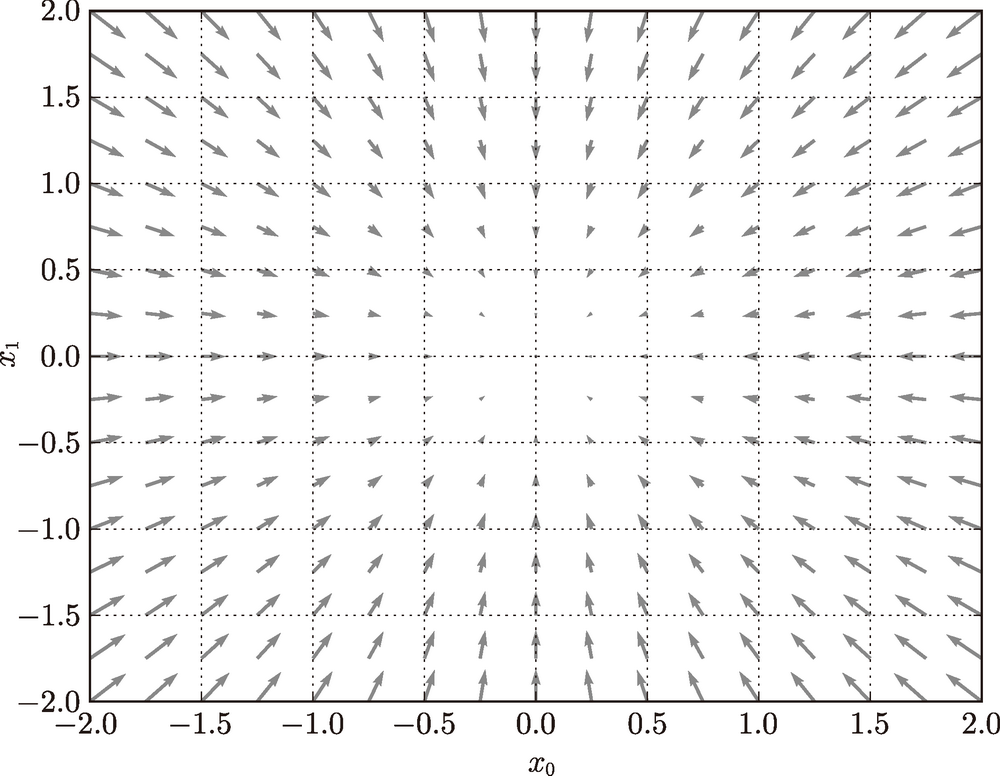

# Basic

<!-- vscode-markdown-toc -->
* 1. [思想](#)
* 2. [从数据中学习](#-1)
	* 2.1. [数据驱动](#-1)
	* 2.2. [训练数据和测试数据](#-1)
* 3. [损失函数](#-1)
	* 3.1. [均方误差（mean squared error）损失函数](#meansquarederror)

<!-- vscode-markdown-toc-config
	numbering=true
	autoSave=true
	/vscode-markdown-toc-config -->
<!-- /vscode-markdown-toc -->


##  1. <a name=''></a>思想
1. 对于智能问题，最初的想法可能也是和古典人工智能的思路一样，即有人设计好思考方式。
2. 最初的人工智能就是这个思路，而我们最初思考人的智能的时候，也会很容易想到人的智能或是被设计或者天然形成了一套完备的机制。
3. 但是，在人类的智能和物理世界中一样，我们目前是无法完备的认识到所有的因果律的，也就是说麦克斯韦妖至少目前还是无法存在的。
4. 同样，人工智能在处理复杂问题时，也无法通过预先创造完备的算法来手把手教会机器每一步的思考。
5. 就像对于人的教育一样，教育孩子不仅仅是要告诉他们规则，很多时候，甚至说大多时候，孩子以及长大之后的人生中，都是通过反馈来不断的修补式的学习的。
6. 人只是学习课本知识，能力是很有限的。还需要在实践中不断的检验和学习，接收反馈，然后调整自我。这正如机器学习使用大量数据输入和反馈的过程一样。


##  2. <a name='-1'></a>从数据中学习
1. 神经网络的特征就是可以从数据中学习。所谓 “从数据中学习”，是指可以由数据自动决定权重参数的值。
2. 在实际的神经网络中，参数的数量成千上万，在层数更深的深度学习中，参数的数量甚至可以上亿，想要人工决定这些参数的值是不可能的。
3. 对于线性可分问题，感知机是可以利用数据自动学习的。根据 “感知机收敛定理”，通过有限次数的学习，线性可分问题是可解的。但是，非线性可分问题则无法通过（自动）学习来解决。

###  2.1. <a name='-1'></a>数据驱动
1. 数据是机器学习的核心，这种数据驱动的方法，也可以说脱离了过往以人为中心的方法。
2. 一种方案是，先从图像中提取 **特征量**，再用机器学习技术学习这些特征量的模式。特征量是指可以从输入数据中准确地提取本质数据的转换器。
3. 特征量通常表示为向量的形式。在计算机视觉领域，常用的特征量包括 SIFT、SURF 和 HOG 等。使用这些特征量将图像数据转换为向量，然后对
转换后的向量使用机器学习中的 SVM、KNN 等分类器进行学习。
4. 但是，将输入数据转换为向量时使用的特征量仍是由人设计的。对于不同的问题，必须使用合适的特征量（必须设计专门的特征量），才能得到好的结果。
5. 而神经网络或深度学习则比以往的机器学习方法更能避免人为介入，连输入数据中包含的重要特征量也都是由机器来学习的。
6. 神经网络的优点是对所有的问题都可以用同样的流程来解决。也就是说，与待处理的问题无关，神经网络可以将数据直接作为原始数据，进行 “端对端” 的学习。

###  2.2. <a name='-1'></a>训练数据和测试数据
1. 机器学习中，一般将数据分为训练数据（也被称为监督数据）和测试数据两部分来进行学习和实验等。
2. 首先，使用训练数据进行学习，寻找最优的参数；然后，使用测试数据评价训练得到的模型的实际能力。
3. 为什么需要将数据分为训练数据和测试数据呢？因为我们追求的是模型的泛化能力。为了正确评价模型的泛化能力，就必须划分训练数据和测试数据。
4. 泛化能力是指处理未被观察过的数据（不包含在训练数据中的数据，即，从适用于训练数据泛化到适用于实际数据）的能力。获得泛化能力是机器学习的最终目标。
5. 因此，仅仅用一个数据集去学习和评价参数，是无法进行正确评价的。这样会导致可以顺利地处理某个数据集，但无法处理其他数据集的情况。
6. 顺便说一下，只对某个数据集过度拟合的状态称为 **过拟合**（over fitting）。避免过拟合也是机器学习的一个重要课题。


##  3. <a name='-1'></a>损失函数
1. 神经网络的学习通过某个指标表示现在的状态。然后，以这个指标为基准，寻找最优权重参数。
2. 神经网络的学习中所用的指标称为 **损失函数**（loss function）。这个损失函数可以使用任意函数，但一般用均方误差和交叉熵误差等。
3. 损失函数是表示神经网络性能的 “恶劣程度” 的指标，即当前的神经网络对监督数据在多大程度上不拟合，在多大程度上不一致。

###  3.1. <a name='meansquarederror'></a>均方误差（mean squared error）损失函数
$$E=\frac{1}{2}\sum_k(y_k-t_k)^2$$

1. 这里，`y` 表示神经网络的输出，`t` 表示监督数据，`k` 表示数据的维数。
2. 在识别一个手写数字的例子中，`y` 是对该数字判断是从 0 到 9 的概率，`t` 是对应的监督数据 one-hot 表示
   ```py
    y = [0.1, 0.05, 0.6, 0.0, 0.05, 0.1, 0.0, 0.1, 0.0, 0.0]
    t = [0, 0, 1, 0, 0, 0, 0, 0, 0, 0]
    ``` 
3. 上述数据可以看出，神经网络判断该图片最后可能是数字 2，有 60% 的概率；监督数据也表示该图片就是数字 2。
4. 根据均方误差函数的逻辑可以看出，当神经网络对一条数据判断的越准确时，`y` 和 `t` 就越相似，均方误差函数的值也就最小，损失也就最小，就代表判断越准确。
5. 均方误差损失函数实际上计算的就是每一项的答案和正确答案的差距的总和。
6. 该损失函数的 Python 实现如下
    ```py
    def mean_squared_error(y, t):
        return 0.5 * np.sum((y-t)**2)
    ```
7. 测试两次神经网络输出的损失函数计算
    ```py
    import numpy as np

    def mean_squared_error(y, t):
        return 0.5 * np.sum((y-t)**2)  
            
    # 假设 2 为正确解
    t = [0, 0, 1, 0, 0, 0, 0, 0, 0, 0]

    # 例1：判断 2 的概率最高的情况（0.6）
    y = [0.1, 0.05, 0.6, 0.0, 0.05, 0.1, 0.0, 0.1, 0.0, 0.0]

    print(mean_squared_error(np.array(y), np.array(t)))
    # 0.09750000000000003

    # 例2：判断 7 的概率最高的情况（0.6）
    y = [0.1, 0.05, 0.1, 0.0, 0.05, 0.1, 0.0, 0.6, 0.0, 0.0]
    print(mean_squared_error(np.array(y), np.array(t)))
    # 0.5975
    ```
    可以看到，根据损失函数的计算，可以得出第一种情况的损失要明显比第二种少，也就是说准确的概率更大。

### 2.2 交叉熵误差（cross entropy error）损失函数
$$E=-\sum_kt_k\log y_k$$

1. $log$ 表示以 $e$ 为底数的自然对数。
2. $t$ 中只有正确解标签的索引为 1，其他均为 0（one-hot 表示）。因此，交叉熵误差实际上只计算对应正确解标签的输出的自然对数。
3. 神经网络对正确的选项给出的概率越高（越接近 1），对数的值就越大，损失函数的结果就越小。
4. Python 实现如下
    ```py
    def cross_entropy_error(y, t):
        delta = 1e-7
        return -np.sum(t * np.log(y + delta))
    ```
5. 函数内部在计算 `np.log` 时，加上了一个微小值 `delta`。这是因为，当出现 `np.log(0)` 时，`np.log(0)` 会变为负无限大的 `-inf`，这样一来就会导致后续计算无法进行。
6. 测试
    ```py
    import numpy as np

    def cross_entropy_error(y, t):
        delta = 1e-7
        return -np.sum(t * np.log(y + delta))
            
    # 假设 2 为正确解
    t = [0, 0, 1, 0, 0, 0, 0, 0, 0, 0]

    # 例1：判断 2 的概率最高的情况（0.6）
    y = [0.1, 0.05, 0.6, 0.0, 0.05, 0.1, 0.0, 0.1, 0.0, 0.0]

    print(cross_entropy_error(np.array(y), np.array(t)))
    # 0.510825457099338

    # 例2：判断 7 的概率最高的情况（0.6）
    y = [0.1, 0.05, 0.1, 0.0, 0.05, 0.1, 0.0, 0.6, 0.0, 0.0]
    print(cross_entropy_error(np.array(y), np.array(t)))
    # 2.302584092994546
    ```

## mini-batch 学习
1. 上面的例子都是对单一输出进行损失函数计算，如果一次对多个输出结果进行计算，可以写成下面的形式
    
    $$E=-\frac{1}{N}\sum_n\sum_k t_{nk}\log y_{nk}$$
    
    也就是计算 n 个数据计算损失函数结果的平均值
2. 训练数据集的数据通常量很大，不可能使用所有的数据进行训练。神经网络的学习也是从训练数据中选出一批数据（称为 mini-batch, 小批量），然后对每个 mini-batch 进行学习。
3. 比如，从 60000 个训练数据中随机选择 100 笔，再用这 100 笔数据进行学习。这种学习方式称为 **mini-batch 学习**。

### 3.1 从数据集中选择批量数据
```py
(x_train, t_train), (x_test, t_test) = load_mnist(normalize=True, one_hot_label=True)

# 训练数据的所有的输入数据和监督数据
# 60000 条输入数据，每条数据是 28 × 28 像素的图像数据
# 60000 条监督数据，每条数据是一个 1 九个 0 的一维数组
print(x_train.shape) # (60000, 784) 
print(t_train.shape) # (60000, 10)

train_size = x_train.shape[0]
batch_size = 10
# 从 60000 （train_size）条训练数据中随机选择 10 （batch_size）条数据作为 mini-batch 进行训练
# random.choice 方法第一个参数如果是数组，则将从数组中随机取出若干个项；
# 如果第一个参数是整数 n，则会从 np.arange(a) 中随机取出若干个项，所以这里选出来的就是一组 10 个索引值；
# replace=False 表示不能取到重复的
batch_mask = np.random.choice(train_size, batch_size, replace=False)
x_batch = x_train[batch_mask] # batch_size 个随机输入数据
t_batch = t_train[batch_mask] # 对应的 batch_size 个监督数据
```

### 3.2 mini-batch 版交叉熵误差的实现
1. 可以同时处理单个数据和批量数据（数据作为 batch 集中输入）两种情况的函数
    ```py
    # y 是神经网络的输出，t 是监督数据
    def cross_entropy_error(y, t):
        # 如果输入的是单条数据（一维数组），则格式化为二维数组，以便下面的统一计算
        if y.ndim == 1:
            t = t.reshape(1, t.size)
            y = y.reshape(1, y.size)
        # 计算所有数据的平均交叉熵误差
        batch_size = y.shape[0]
        return -np.sum(t * np.log(y + 1e-7)) / batch_size
    ```
    * `y` 现在是二维数组，`np.log(y)` 就是对其中每个数求自然对数，然后返回同样形状的数组
        ```py
        y = np.array([
                        [1, 2], 
                        [3, 1]
                    ])

        print( np.log(y) )  
        # [
        #     [0.         0.69314718]
        #     [1.09861229 0.        ]
        # ]
        ```
    * `np.sum` 用在多维数组上，是累加其中的每个值，然后返回一个数
        ```py
        y = np.array([
                        [1, 2, 3], 
                        [3, 4, 5]
                    ])

        print( np.sum(y) )  # 18
        ```
2. 先看一下下面会用到了一种特殊的多维数组数组项提取方式。下面每一对 `print`，第一个是普通方式，第二种是特殊方式
    ```py
    y = np.array([
                    [1, 2, 3], 
                    [4, 5, 6], 
                    [7, 8, 9]
                ])

    print( y[1, 0] )     # 4
    print( y[[1], [0]] ) # [4]

    print( y[1, 1], y[2, 2] )   # 5 9
    print( y[[1, 2], [1, 2]] )  # [5 9]

    print( y[1, 0], y[2, 1] )   # 4 8
    print( y[[1, 2], [0, 1]] )  # [4 8]

    print( y[1] )   # [4 5 6]
    print( y[[1]] ) # [[4 5 6]]

    print( y[1, 0, 2] ) # IndexError: too many indices for array: array is 2-dimensional, but 3 were indexed
    print( y[[1], [0], [2]] ) # IndexError: too many indices for array: array is 2-dimensional, but 3 were indexed
    ```
    所以，对于 m×n 二维数组来说，这种提取方法中，第一个数组里的值都是 m 维的索引，第二个数组里的值都是对应的 n 维的索引。
3. 当监督数据是标签形式（非 one-hot 表示，而是像 “2” “7” 这样的标签）时，交叉熵误差可通过如下代码实现
    ```py
    def cross_entropy_error(y, t):
        if y.ndim == 1:
            t = t.reshape(1, t.size)
            y = y.reshape(1, y.size)

        batch_size = y.shape[0]
        # 下面 .sum() 的参数从 t * np.log(y + 1e-7) 变成了 np.log(y[np.arange(batch_size), t] + 1e-7)
        # 上面说了，one-hot 形式下，np.sum(t * np.log(y + 1e-7)) 虽然是累加，但实际上的值只是正解项对应的那一个预测值（带一个极小的值 1e-7）；
        # 那现在不是 one-hot 形式，np.sum(y[np.arange(batch_size), t] + 1e-7) 仍然需要是正解项对应的那一个预测值（带一个极小的值 1e-7）。我们来看看它是不是；
        # np.arange (batch_size) 会生成一个从 0 到 batch_size-1 的整数数组；
        # 因为不是 one-hot 形式，所以数组 t 的每一项不再是一个十项数组，而只是一个表示正确答案的从 0 到 9 的整数。
        # 所以，y[np.arange(batch_size), t] 的结果类似是类似于下面的一个 batch_size-1 项数组：[y[0,2], y[1,7], y[2,0], y[3,9], y[4,4], ...]
        # 也就是从该批的每一个输出（一个10项数组）中选出正确结果对应的那个概率值。
        # 例如 y[0] 是 [0.1, 0.05, 0.6, 0.0, 0.05, 0.1, 0.0, 0.1, 0.0, 0.0]，则 y[0,2] 就是 0.6；
        # 所以 y[np.arange(batch_size), t] 是类似于下面的一个 batch_size-1 项数组：[0.6, 0.75, 0.12, 0.06, 0.8, ...]
        return -np.sum(np.log(y[np.arange(batch_size), t] + 1e-7)) / batch_size
    ```


## 4 为何要设定损失函数
1. 以数字识别任务为例，我们想获得的是能提高识别精度的参数，特意再导入一个损失函数不是有些重复劳动吗？也就是说，既然我们的目标是获得使识别精度尽可能高的神经网络，那不是应该把识别精度（45%、89%之类的正确率）作为指标吗？
2. 假设某个神经网络正确识别出了 100 笔训练数据中的 32 笔，此时识别精度为 32% 。如果以识别精度为指标（即识别精度函数关于参数求导），即使稍微改变权重参数的值，识别精度也仍将保持在 32% ，不会出现变化。
3. 比如调整了参数，某些之前识别正确的项，它估算正确的概率从 0.6 变成了 0.8，但仍然是识别为正确，所以最终正确率还是没有变。这就导致你调节参数后，看不出调节参数意义。因为我们的精度是直接用正确的笔数处于总笔数，所以这次调整虽然实际上估算的更准确了，但总得正确笔数并没有变，所以最终的正确率也没变。
4. 也就是说，仅仅微调参数，是无法改善识别精度的。即便识别精度有所改善，它的值也不会像 32.0123 ... % 这样连续变化，而是变为 33%、34% 这样的不连续的、离散的值。
5. 而如果把损失函数作为指标（即损失函数关于参数求导），则当前损失函数的值可以表示为 0.92543 ... 这样的值。并且，如果稍微改变一下参数的值，对应的损失函数也会像 0.93432 ... 这样发生连续性的变化。
6. 出于相同的原因，如果使用阶跃函数作为激活函数，神经网络的学习将无法进行。阶跃函数的导数在绝大多数地方（除了 0 以外的地方）均为 0（参数的变化不会引起函数值的变化）。也就是说，如果使用了阶跃函数，那么即便将损失函数作为指标，参数的微小变化也会被阶跃函数抹杀，导致损失函数的值不会产生任何变化。


## 5 数值微分
### 5.1 导数
#### 5.1.1 数值微分和解析微分
1. 所谓 **数值微分**（numerical differentiation），就是用数值方法、利用微小的差分近似求解函数的导数的过程。
2. 而基于数学式的推导求导数的过程，则用 **解析性**（analytic）一词，称为 “解析性求解” 或者 “解析性求导”。解析性求导得到的导数是不含误差的 “真的导数”。

#### 5.1.2 数值微分的实现
1. 一个不好的数值微分实现
    ```py
    def numerical_diff(f, x):
        h = 10e-50
        return (f(x+h) - f(x)) / h
    ```
2. 看起来合理，但有两处需要改进的地方。

##### 5.1.2.1 舍入误差
1. 在上面的实现中，因为想把尽可能小的值赋给 $h$（想让 $h$ 无限接近 0），所以 $h$ 使用了 $10e^{-50}$ 这个微小值。
2. 但是，这样反而产生了 **舍入误差**（rounding error）。
3. 所谓舍入误差，是指因省略小数的精细部分的数值（比如，小数点第 8 位以后的数值）而造成最终的计算结果上的误差。比如，在 Python 中，舍入误差可如下表示。
    ```py
    >>> np.float32(1e-50)
    0.0
    ```
4. 如上所示，如果用 `float32` 类型（32 位的浮点数）来表示 $1e^{-50}$，就会变成 `0.0`，无法正确表示出来。也就是说，使用过小的值会造成计算机出现计算上的问题。
5. 这是第一个需要改进的地方，即将微小值 $h$ 改为 $10^{-4}$。使用 $10^{-4}$ 就可以得到正确的结果。

##### 5.1.2.2 前向差分
1. 第二个需要改进的地方与函数 $f$ 的差分有关。
2. 虽然上述实现中计算了函数 $f$ 在 $x+h$ 和 $x$ 之间的差分，但是必须注意到，这个计算从一开始就有误差。
3. 如下图所示，“真的导数” 对应函数在 $x$ 处的斜率（称为切线），但上述实现中计算的导数对应的是 $(x + h)$ 和 $x$ 之间的斜率。
    
4. 因此，真的导数（真的切线）和上述实现中得到的导数的值在严格意义上并不一致。这个差异的出现是因为 $h$ 不可能无限接近 $0$。
5. 为了减小这个误差，我们可以计算函数 $f$ 在 $(x + h)$ 和 $(x - h)$ 之间的差分。
6. 因为这种计算方法以 $x$ 为中心，计算它左右两边的差分，所以也称为 **中心差分**（而 $(x + h)$ 和 $x$ 之间的差分称为 **前向差分**）。

##### 5.1.2.3 改进后的数值微分实现
```py
def numerical_diff(f, x):
    h = 1e-4 # 0.0001
    return (f(x+h) - f(x-h)) / (2*h)
```

### 5.3 偏导数
#### 5.3.1 偏导数的概念
1. 观察 $f(x_0, x_1) = x_0^2 + x_1^2$，虽然它只是一个计算参数的平方和的简单函数，但是请注意和上例不同的是，这里有两个变量
2. 这个式子可以用 Python 来实现，如下所示。
    ```py
    def function_2(x):
        return x[0]**2 + x[1]**2
        # 或者return np.sum(x**2)
    ```
3. 我们来画一下这个函数的图，是一个三维图像
    
4. 现在我们来求 $f(x_0, x_1)$ 的导数。这里需要注意的是，函数有两个变量，所以有必要区分对哪个变量求导数，即对 $x_0$ 和 $x_1$ 两个变量中的哪一个求导数。也就是考虑其中一个变量在某个位置单独变化时，对整个函数的值的影响。
5. 我们把这里讨论的有多个变量的函数的导数称为 **偏导数**，用数学式表示的话，可以写成$\frac{∂f}{∂x_0}$、$\frac{∂f}{∂x_1}$。

#### 5.3.2 求偏导数
1. 求 $x_0 = 3, x_1 = 4$ 时，关于 $x_0$ 的偏导数。所以 $x_1 = 4$ 是固定的，在这个求导过程中，它就是一个已知量，而不是自变量未知数。所以本次求导的函数实际上是
    ```py
    def function_tem1(x0):
        return x0*x0 + 4.0 * 4.0
    ```        
2. 这个新函数 `function_tem1` 现在只有一个自变量，也就是 $x_0$。那么就可以使用上面求单变量数值微分的函数 `numerical_diff`，看看 $x_0$ 在 3 附近微小变化时对函数值的影响
    ```py
    d = numerical_diff(function_tem1, 3.0)
    print(d)  # 6.00000000000378
    ```
3. 同理，求 $x_0 = 3, x_1 = 4$ 时，关于 $x_1$ 的偏导数
    ```py
    def function_tem2(x1):
        return 3*3 + x1 * x1


    d = numerical_diff(function_tem2, 4.0)
    print(d)  # 7.999999999999119
    ```
4. 像这样，偏导数和单变量的导数一样，都是求某个地方的斜率。不过，偏导数需要将多个变量中的某一个变量定为目标变量，并将其他变量固定为某个值。
5. 在上例的代码中，为了将目标变量以外的变量固定到某些特定的值上，我们定义了新函数。然后，对新定义的函数应用了之前的求数值微分的函数，得到偏导数。


## 6 梯度
先要确保理解了 `..\MathematicalFoundations\Calculus\GradientDescent.md` 中的内容

### 6.1 梯度下降法是干什么用的？
#### 6.1.1 我们希望找到神经网络的最优权重
1. 我们希望找到，使得神经网络的损失函数取得最小值时的权重值。
2. 这里我们把神经网络作为一个函数 $f$，自变量是权重，函数的值是损失函数的值。
3. 也就是说，我们要找到函数 $f$ 取得最小值时的自变量的值。

#### 6.1.2 解析法求导不现实
1. 我们知道，函数最小值的点是导数为 0 的点。
2. 所以最直接的方法就是对 $f$ 求导，然后看当导数为 0 时，自变量参数可能取哪些值。
3. 但现实是，多层神经网络对应的函数的复杂性，使用解析法求导几乎是不可能的。

#### 6.1.3 通过改变权重逐步逼近函数最小值
1. 我们无法一下确定函数最小值，但我们可以不断摸索前进。
2. 我们每次都通过改变权重值让函数减小一点点，这样最终就会来到函数的最小值。
3. 每次的步子不能太大，因为太大就定位不到最小值，可能只会在它上面跨来跨去。
4. 我们每次怎么改变权重来让函数值减小呢？
5. 因为函数值的变化等于自变量的变化值和导数的乘积，所以我们只要每次让权重的变化值和当前导数正负号相反即可。
6. 因为解析法求导不现实，所以这一章求当前的导数时，用到的方法是数值微分。之后会通过反向传播的方法求当前导数。总之两个方法都不是解析求导，只能求当前函数值时的导数。
7. 所以们每次一小步做的事情就是：求出当前的导数 $d$，让权重改变 $-\eta * d（\eta 为正的微小常数）$


### 6.2 梯度的表达式和意义
TODO 和 《深度学习的数学》 2-9 中 近似公式的关系。那个近似公式直接把自变量从 $x$ 换成了 $\Delta x$，那不就是不是同一个函数了吗？

1. 在上面的例子中，我们按变量分别计算了 $x_0$ 和 $x_1$ 的偏导数。现在，我们希望一起计算 $x_0$ 和 $x_1$ 的偏导数。比如，我们来考虑求 $x_0=3,x_1=4$ 时 $(x_0,x_1)$ 的偏导数 $\large \Bigl(\frac{\partial f}{\partial x_0},\frac{\partial f}{\partial x_1}\Bigr)$。
2. 像 $\large \Bigl(\frac{\partial f}{\partial x_0},\frac{\partial f}{\partial x_1}\Bigr)$ 这样的由全部变量的偏导数汇总而成的向量称为 **梯度**（gradient）
3. 梯度可以像下面这样来实现
    ```py
    def numerical_gradient(f, x):
        h = 1e-4  # 0.0001
        grad = np.zeros_like(x)  # 生成和 x 形状相同的数组

        for idx in range(x.size):
            tmp_val = x[idx]
            # f(x+h) 的计算
            x[idx] = tmp_val + h
            fxh1 = f(x)

            # f(x-h)的计算
            x[idx] = tmp_val - h
            fxh2 = f(x)

            grad[idx] = (fxh1 - fxh2) / (2*h)
            x[idx] = tmp_val  # 还原值

        return grad
    ```
4. 函数 `numerical_gradient(f, x)` 中，参数 `f` 为函数，`x` 为 NumPy 数组，该函数对 NumPy 数组 `x` 的各个元素求数值微分。也就是说分别对每个自变量求偏导，最后再输出每个偏导组成的向量。
5. 注意通过使用变量 `tmp_val`，保证了比如在计算完第一个自变量的偏导后再计算第二个自变量的偏导时，第一个自变量的值让然维持输入值。比如 `x` 输入的是 `np.array([3.0, 4.0])`，内部会循环两次：第一次计算时 `x[1]` 是 4，求第一个自变量的偏导；求完后第一个自变量 `x[0]` 恢复为 3，再求第二个自变量的偏导。
5. 我们用这个函数实际计算一下梯度。这里我们求 $f(x_0, x_1) = x_0^2 + x_1^2$ 在点 $(3, 4)$、$(0, 2)$、$(3, 0)$ 处的梯度
    ```py
    def function_2(x):
        return np.sum(x**2)

    np.array([0.0, 2.0])
    grad1 = numerical_gradient(function_2, np.array([3.0, 4.0]))
    print(grad1)  # [6. 8.]

    grad2 = numerical_gradient(function_2, np.array([0.0, 2.0]))
    print(grad2)  # [0. 4.]

    grad3 = numerical_gradient(function_2, np.array([1.0, 2.0]))
    print(grad3)  # [2. 4.]
    ```
6. 像这样，我们可以计算 $(x_0,x_1)$ 在各点处的梯度。这个梯度意味着什么呢？
7. 注意到输出的偏导向量和输入的 `x` 向量是形状相同的。以输入 $(1.0, 2.0)$ 为例，梯度的计算结果也是输出一个 2D 向量。它的意义在于，当两个自变量分别处于 3 和 4 时，第一个自变量的微小变化 $h$ 将引起因变量相应变化 $2h$，而第二个自变量的微小变化 $h$ 将引起因变量相应变化 $4h$
    ```py
    grad1 = numerical_gradient(function_2, np.array([1.0, 2.0]))
    print(grad1)  # [2. 4.]

    y0 = function_2(np.array([1.0, 2.0]))
    print(y0) # 5.0
    y1 = function_2(np.array([1.00001, 2.0]))
    print(y1)  # 5.0000200001
    y2 = function_2(np.array([1.0, 2.00001]))
    print(y2)  # 5.0000400001
    y3 = function_2(np.array([1.00001, 2.00001]))
    print(y3)  # 5.0000600002
    ```

### 6.3 图像
1. 画出 `function_2` 的负梯度向量
    
2. 输入的是一个 2D 向量，即 $(x_1, x_2)$。这个向量确定了图上的一点，这个点会作为图上向量的起点。
3. 输出值也是一个 2D 向量，这个向量确定了图上向量的终点。
4. 但是看起来比例好像不对？比如输入 $(1.0, 2.0)$，梯度向量应该是 $(2.0, 4.0)$，但图中的向量长度明显是很短的，因为向量 $(2.0, 4.0)$ 的长度应该是 $\sqrt{20}$。下面会解释。
5. 另外，因为这里绘制采用负梯度方向，所以方向是相反的。负梯度方向是梯度法中变量的更新方向，也就是权重更新的方向。
6. 和梯度相反的方向，再结合上面说的比例明显缩小，可以看出来，这个图里面的向量，并不是梯度的向量，而是权重改变的向量。这个向量和梯度方向相反，且比例小了很多，正是上面 $-\eta * d（\eta 为正的微小常数）$ 对应的向量。

### 6.4 图像分析
这个图的负梯度向量，是 `function_2` 的，也就是 $f(x_0,x_1)=x^2_0+x^2_1$ 的。

#### 6.4.1 箭头方向
1. 可以看出来，如果自变量按照箭头方向移动，实际上自变量都是往绝对值减小的方向移动的。
2. 自变量绝对值减小，所以函数值 $f(x_0,x_1)$ 的值也就会减小。
3. 这就说明，这是自变量移动的正确方向，即，会导致函数值降低的方向。
4. 实际上，负梯度指示的方向是各点处的函数值减小最多的方向。因为是和梯度方向相反，根据矩阵乘法公式 $|a||b|cosθ$，可以知道方向相反时两个矩阵的内积最小，也就是一个绝对值最大的负数。
5. 而这个此时绝对值最大的负数，也就是本次函数变化的值。
4. 另外，图中向量恰好都指向了最低处，但并非任何时候都这样。显然根据上面说的，箭头方向实际上指向的是当前位置会导致函数值最大减小的自变量矩阵变化方向。

#### 6.4.1 箭头长短
1. 可以看出来，越靠外的箭头越长。
2. 因为箭头向量是 $-\eta * d{\footnotesize（\eta 为正的微小常数）}$，那可以推断出，越靠外 $f(x_0,x_1)$ 的梯度向量的绝对值越大。
3. 实际上 $f(x_0,x_1)$ 梯度的解析解是向量 $(2x, 2y)$，确实也是越远离中心绝对值越大。

### 6.5 梯度法

#### 6.5.1 数学表达
1. 数学式表示梯度法
    
    $$\begin{aligned}x_0=x_0-\eta\frac{\partial f}{\partial x_0}\\x_1=x_1-\eta\frac{\partial f}{\partial x_1}\end{aligned}$$

2. $η$ 表示更新量，在神经网络的学习中，称为 **学习率**（learning rate）。学习率决定在一次学习中，应该学习多少，以及在多大程度上更新参数。
3. 上式是表示更新一次的式子，这个步骤会反复执行。也就是说，每一步都按该式更新变量的值，通过反复执行此步骤，逐渐减小函数值。
4. 虽然这里只展示了有两个变量时的更新过程，但是即便增加变量的数量，也可以通过类似的式子（各个变量的偏导数）进行更新。
5. 学习率需要事先确定为某个值，比如 0.01 或 0.001。一般而言，这个值过大或过小，都无法抵达一个 “好的位置”。在神经网络的学习中，一般会一边改变学习率的值，一边确认学习是否正确进行了。

#### 6.5.2 Python 实现梯度下降法
```py
def gradient_descent(f, init_x, lr=0.01, step_num=100):
    x = init_x

    for i in range(step_num):
        grad = numerical_gradient(f, x)
        x -= lr * grad

    return x
```
1. 参数 `f` 是要进行最优化的函数，`init_x` 是初始值，`lr` 是学习率 learning rate，`step_num` 是梯度法的重复次数。
2. `numerical_gradient(f,x)` 会求函数的梯度，用该梯度乘以学习率得到的值进行更新操作，由 step_num 指定重复的次数。
3. 使用这个函数可以求函数的极小值，顺利的话，还可以求函数的最小值。

#### 6.5.3 实例
1. 用梯度法求 $f(x_0+x_1)=x^2_0+x^2_1$ 的最小值
    ```py
    init_x = np.array([-3.0, 4.0])
    minX = gradient_descent(function_2, init_x=init_x, lr=0.1, step_num=100)
    print(minX)  # [-6.11110793e-10  8.14814391e-10]
    ```
2. 这里，设初始值为 $(-3.0, 4.0)$，开始使用梯度法寻找最小值。最终的结果是 $(-6.1e-10, 8.1e-10)$，非常接近 $(0, 0)$，通过梯度法我们基本得到了正确结果。
3. 如果用图来表示梯度法的更新过程
    
4. 前面说过，学习率过大或者过小都无法得到好的结果。我们来做个实验验证一下。
    ```py
    # 学习率过大的例子：lr=10.0
    >>> init_x = np.array([-3.0, 4.0])
    >>> gradient_descent(function_2, init_x=init_x, lr=10.0, step_num=100)
    array([ -2.58983747e+13,  -1.29524862e+12])

    # 学习率过小的例子：lr=1e-10
    >>> init_x = np.array([-3.0, 4.0])
    >>> gradient_descent(function_2, init_x=init_x, lr=1e-10, step_num=100)
    array([-2.99999994,  3.99999992])
    ```
    实验结果表明，学习率过大的话，会发散成一个很大的值；反过来，学习率过小的话，基本上没怎么更新就结束了。也就是说，设定合适的学习率是一个很重要的问题。
5. 像学习率这样的参数称为 **超参数**。这是一种和神经网络的参数（权重和偏置）性质不同的参数。相对于神经网络的权重参数是通过训练数据和学习算法自动获得的，学习率这样的超参数则是人工设定的。一般来说，超参数需要尝试多个值，以便找到一种可以使学习顺利进行的设定。

### 6.6 神经网络的梯度
1. 神经网络的梯度是指损失函数关于权重参数的梯度。
2. 例如有一个神经网络有 2×3 的权重
    $\boldsymbol{W} = \begin{bmatrix} w_{11} & w_{12} & w_{13} \\ w_{21} & w_{22} & w_{23} \end{bmatrix}$
3. 损失函数用 $L$ 表示的话，它的梯度就是
    $\Large \frac{\partial{L}}{\partial{\boldsymbol{W}}} = \begin{bmatrix} \frac{\partial{L}}{\partial{w_{11}}} & \frac{\partial{L}}{\partial{w_{12}}} & \frac{\partial{L}}{\partial{w_{13}}} \\ \frac{\partial{L}}{\partial{w_{21}}} & \frac{\partial{L}}{\partial{w_{22}}} & \frac{\partial{L}}{\partial{w_{23}}} \end{bmatrix}$

#### 6.6.1 实例：实现一个简单的神经网络并求梯度
1. 先实现一个简单的神经网络，该神经网络的权重会作为损失函数的自变量，然后以损失函数最小值为目标来不断调整权重。
2. 神经网络实现，源码在 `./demo/gradient_simplenet.py`
    ```py
    # coding: utf-8
    import sys, os
    sys.path.append(os.path.join(os.path.dirname(__file__), '../../'))
    from common.gradient import numerical_gradient
    from common.functions import softmax, cross_entropy_error
    import numpy as np


    class simpleNet:
        def __init__(self):
            # random.randn 返回的值符合标准正态分布，也就是说，例如，它返回的 95% 的数都在 ±1.96 的范围内，68% 的数都在 ±1 的范围内
            # random.randn(2, 3) 表示返回一个两行三列数组，所有的值符合标准正态分布
            self.W = np.random.randn(2, 3)  # 用高斯分布进行初始化一组 2×3 的权重

        # 这里只有一层隐藏层，直接用输入值和该层权重求点积即可
        def predict(self, x):
            return np.dot(x, self.W)

        # 使用 softmax 函数作为激活函数，使用交叉熵误差作为损失函数
        # x 接收输入数据，t 接收正确解标签
        def loss(self, x, t):
            z = self.predict(x)
            y = softmax(z)
            loss = cross_entropy_error(y, t)

            return loss
    ```
2. 实例化并使用一组参数进行一次预测
    ```py
    net = simpleNet()

    print(net.W)  # 随机生成的参数
    # [
    #   [-0.31211728  0.81783696  1.0369602]
    #   [-0.35531326 - 0.40729509  1.30223118]
    # ]

    t = np.array([0, 0, 1])  # 假定正确答案是最后一项
    x = np.array([0.6, 0.9])
    p = net.predict(x) # 使用随机参数预测三个结果
    print(p)  # [-0.5070523   0.1241366   1.79418418]   预测结果正好倾向于最后一项
    print(net.loss(x, t))  # 0.25338010072421907   
    ```
3. 现在，输入不变，分别测试正确答案是前两项的损失函数值，可以看到损失值都明显变大了
    ```py
    t = np.array([0, 1, 0])
    p = net.predict(x)
    print(net.loss(x, t)) # 1.9234271308654354  

    t = np.array([1, 0, 0])
    p = net.predict(x)
    print(net.loss(x, t)) # 2.5546154256672673 
    ```
4. 现在，我们想要调整参数，让新的损失函数的值比上面的更小一些。因此，需要求损失函数在当前参数下的梯度。
5. 注意到，上面实现的 `numerical_gradient`，它表示函数自变量的第二个参数是一个一维数组，但我们这里的的自变量 $\boldsymbol{W}$ 是二维的。我们这里实现一个支持多维数组的 `numerical_gradient`。先看一下其中用到的遍历多维数组的方法
    ```py
    x = np.array([
        [1, 2, 3],
        [4, 5, 6],
    ])

    it = np.nditer(x, flags=['multi_index'], op_flags=['readwrite'])

    while not it.finished:
        print(it.multi_index)
        it.iternext()  
    # (0, 0)
    # (0, 1)
    # (0, 2)
    # (1, 0)
    # (1, 1)
    # (1, 2)
    ```
6. 新的 `numerical_gradient` 实现如下
    ```py
    def numerical_gradient(f, x):
        h = 1e-4 # 0.0001
        grad = np.zeros_like(x)
        
        it = np.nditer(x, flags=['multi_index'], op_flags=['readwrite'])
        while not it.finished:
            idx = it.multi_index

            tmp_val = x[idx]

            # TODO 为什么要显示转型
            x[idx] = float(tmp_val) + h
            fxh1 = f(x) # f(x+h)
            
            x[idx] = tmp_val - h 
            fxh2 = f(x) # f(x-h)

            grad[idx] = (fxh1 - fxh2) / (2*h)
            
            x[idx] = tmp_val # 还原值

            it.iternext()   
        return grad
    ```
7. 上面损失函数是 `net.loss`，但它的函数参数不是神经网络的权重 $\boldsymbol{W}$。我们在使用 `numerical_gradient` 求数值微分时，第二个函数参数必须要是第一个函数参数所指定的函数的自变量。
8. 看一下 `numerical_gradient` 的实现，如果你直接 `numerical_gradient(net.loss, net.W)`，那么函数内部就会计算 `net.loss(net.W)`，这显然是不正确的。
9. 所以我们要把 `net.loss` 在包装成一个新函数，让新函数的参数为 $\boldsymbol{W}$
    ```py
    # 损失值关于参数的函数
    def f(W):
        return net.loss(x, t)
    # 或者使用 lambda 表示法定义函数
    # f = lambda w: net.loss(x, t)
    ```
10. 这个新函数 `f` 看起来有点奇怪，它的参数是 $\boldsymbol{W}$，但它的内部并没有用到 $\boldsymbol{W}$。但实际上，这个传参 $\boldsymbol{W}$ 是没有意义的，因为 `net.loss` 调用时内部会根据 $\boldsymbol{W}$ 计算损失值。所以，新函数 `f` 其实不需要这个参数，`f` 唯一真正的作用只是避免 `net.loss(net.W)`
11. 现在，我们使用 `numerical_gradient` 求当前 $\boldsymbol{W}$ 下的梯度
    ```py
    # 求当前参数下的函数梯度
    # 这个求梯度的函数不是上面定义的那个，那个只支持向量。这里的参数是矩阵
    dW = numerical_gradient(f, net.W) 
    print(dW)
    # [
    #   [0.0466332   0.08766316  -0.13429636]
    #   [0.06994981  0.13149474  -0.20144454]
    # ]
    ```
12. 简单来说，左边四个偏导是正、右边两个偏导是否，说明如果在当前参数的位置，左边四个参数如果稍微减小，则损失函数的会减小，右边两个参数如果稍微增大，损失函数的值也会减小。
13. 而且绝对值的大小也说明它们各自更新的作用有大有小。比如右下角稍微增大一点的贡献就要比左上角减小同样值起的作用要大。
14. 求出神经网络的梯度后，接下来只需根据梯度法，乘以学习率计算出此时合适的权重变化值，更新权重参数即可。
15. 我们这里可以先简单测试一下。假定学习率是 0.1，那么得出新的权重是 
    ```py
    net.W -= 0.1 * dW
    print(net.W)
    # [
    #     [-0.3167806   0.80907064  1.05038984]
    #     [-0.36230824 -0.42044456  1.32237563]
    # ]
    ```
16. 用这个新权重再进行一次预测，得出的损失函数值是 0.2444572434502961，比之前的 0.25338009946586093 小了一点。


## 7 学习算法的实现
1. 神经网络的学习步骤如下所示：
    1. **mini-batch**：从训练数据中随机选出一部分数据，这部分数据称为 mini-batch。我们的目标是减小 mini-batch 的损失函数的值。
    2. **计算梯度**：为了减小 mini-batch 的损失函数的值，需要求出各个权重参数的梯度。梯度表示损失函数的值减小最多的方向。
    3. **更新参数**：将权重参数沿梯度方向进行微小更新。
    4. **重复**：重复步骤 1、步骤 2、步骤 3。
2. 神经网络的学习按照上面 4 个步骤进行。这个方法通过梯度下降法更新参数，不过因为这里使用的数据是随机选择的 mini batch 数据，所以又称为 **随机梯度下降法**（stochastic gradient descent）。
3. “随机” 指的是 “随机选择的” 的意思，因此，随机梯度下降法是 “对随机选择的数据进行的梯度下降法”。
4. 深度学习的很多框架中，随机梯度下降法一般由一个名为 **SGD** 的函数来实现。SGD 来源于随机梯度下降法的英文名称的首字母。

### 7.1 实现 2 层神经网络（隐藏层为 1 层的网络）的类
源码在 `./demo/two_layer_net.py`
```py
import numpy as np
import sys
import os
sys.path.append(os.path.join(os.path.dirname(__file__), '../../'))
from common.gradient import numerical_gradient
from common.functions import *


class TwoLayerNet:
    # input_size:  输入层的神经元数
    # hidden_size: 隐藏层的神经元数
    # output_size: 输出层的神经元数
    def __init__(self, input_size, hidden_size, output_size,
                 weight_init_std=0.01):
        # 根据各层神经元的数量，初始化权重和偏置
        # 权重在标准正态分布的基础上乘以了 weight_init_std，这个值的设定由什么决定呢
        self.params = {}
        self.params['W1'] = weight_init_std * np.random.randn(input_size, hidden_size) # 第 1 层权重
        self.params['b1'] = np.zeros(hidden_size) # 第 1 层偏置
        self.params['W2'] = weight_init_std * np.random.randn(hidden_size, output_size) # 第 2 层权重
        self.params['b2'] = np.zeros(output_size) # 第 2 层偏置

    # 用当前的参数进行预测
    def predict(self, x):
        W1, W2 = self.params['W1'], self.params['W2']
        b1, b2 = self.params['b1'], self.params['b2']

        a1 = np.dot(x, W1) + b1
        z1 = sigmoid(a1)
        a2 = np.dot(z1, W2) + b2
        y = softmax(a2)

        return y

    # x:输入数据, t:监督数据
    def loss(self, x, t):
        y = self.predict(x)

        return cross_entropy_error(y, t)

    # 计算当前参数预测的准确率
    def accuracy(self, x, t):
        y = self.predict(x)
        y = np.argmax(y, axis=1)
        t = np.argmax(t, axis=1)

        accuracy = np.sum(y == t) / float(x.shape[0])
        return accuracy

    # x:输入数据, t:监督数据
    # 因为要使用梯度下降法，所以实现求当前梯度的方法
    # 这里定义的方法和 common.gradient 中求梯度的函数同名
    def numerical_gradient(self, x, t):
        # 基于当前输入数据的数据，定义损失函数值关于权重和偏置的函数
        # 该函数的自变量是权重和偏置，函数值是损失函数的输出值
        def loss_W(W): return self.loss(x, t)

        # 计算关于当前权重和偏置的梯度，确定怎么调整权重和偏置
        # 调用 common.gradient 中的 numerical_gradient 函数具体求梯度
        grads = {}
        grads['W1'] = numerical_gradient(loss_W, self.params['W1']) # 第 1 层权重的梯度
        grads['b1'] = numerical_gradient(loss_W, self.params['b1']) # 第 1 层偏置的梯度
        grads['W2'] = numerical_gradient(loss_W, self.params['W2']) # 第 2 层权重的梯度
        grads['b2'] = numerical_gradient(loss_W, self.params['b2']) # 第 2 层偏置的梯度

        return grads
```

### 7.2 mini-batch 的实现
1. 源码在 `./demo/train_neuralnet.py`
    ```py
    import numpy as np
    import sys
    import os
    sys.path.append(os.path.join(os.path.dirname(__file__), '../../'))
    from dataset.mnist import load_mnist
    from two_layer_net import TwoLayerNet

    (x_train, t_train), (x_test, t_test) = load_mnist(normalize=True, one_hot_label = True)

    train_loss_list = []

    # 超参数
    iters_num = 10000  # 梯度法的更新次数
    train_size = x_train.shape[0]
    batch_size = 100
    learning_rate = 0.1

    network = TwoLayerNet(input_size=784, hidden_size=50, output_size=10)

    # 进行 iters_num 次梯度下降
    for i in range(iters_num):
        # 获取 mini-batch
        # 实际上，一般做法是事先将所有训练数据随机打乱，然后按指定的批次大小，按序生成 mini-batch。
        # 这样每个 mini-batch 均有一个索引号，然后用索引号可以遍历所有的 mini-batch。
        # 这里的 mini-batch 作为示例，每次都是随机选择的。
        batch_mask = np.random.choice(train_size, batch_size) # 每次从 60000 个训练数据中取出 100 个
        x_batch = x_train[batch_mask]
        t_batch = t_train[batch_mask]

        # 计算当前参数下的梯度
        grad = network.numerical_gradient(x_batch, t_batch)
        # grad = network.gradient(x_batch, t_batch) # 使用用误差反向传播法计算梯度的高速版

        # 使用随机梯度下降法（SGD）更新参数
        for key in ('W1', 'b1', 'W2', 'b2'):
            network.params[key] -= learning_rate * grad[key]

        # 记录学习过程
        loss = network.loss(x_batch, t_batch)
        train_loss_list.append(loss)
    ```
2. 用图像来表示这个损失函数的值的推移
    

### 7.3 基于测试数据的评价
#### 7.3.1 需要确认泛化能力
1. 上图呈现的结果，我们确认了通过反复学习可以使损失函数的值逐渐减小这一事实。
2. 不过这个损失函数的值，严格地讲是 “对训练数据的某个 mini-batch 的损失函数” 的值。
3. 训练数据的损失函数值减小，虽说是神经网络的学习正常进行的一个信号，但光看这个结果还不能说明该神经网络在其他数据集上也一定能有同等程度的表现。
4. 神经网络的学习中，必须确认是否能够正确识别训练数据以外的其他数据，即确认是否会发生过拟合。过拟合是指，虽然训练数据中的数字图像能被正确辨别，但是不在训练数据中的数字图像却无法被识别的现象。
5. 神经网络学习的最初（不是最终？）目标是掌握泛化能力，因此，要评价神经网络的泛化能力，就必须使用不包含在训练数据中的数据。

#### 7.3.2 确认泛化能力的代码实现
1. 下面的代码在进行学习的过程中，会定期地对训练数据和测试数据记录识别精度。这里，每经过一个 epoch，我们都会记录下训练数据和测试数据的识别精度。
2. **epoch** 是一个单位。一个 epoch 表示学习中所有训练数据均被使用过一次时的更新次数。比如，对于 10000 笔训练数据，用大小为 100 笔数据的 mini-batch 进行学习时，重复随机梯度下降法 100 次，所有的训练数据就都被 “看过” 了。此时，100 次就是一个 epoch。
3. 为了正确进行评价，我们来稍稍修改一下前面的代码
    ```py
    import numpy as np
    import time
    import sys
    import os
    sys.path.append(os.path.join(os.path.dirname(__file__), '../../'))
    from dataset.mnist import load_mnist
    from two_layer_net import TwoLayerNet

    (x_train, t_train), (x_test, t_test) = load_mnist(normalize=True, one_hot_label = True)

    train_loss_list = []
    train_acc_list = []
    test_acc_list = []
    # 平均每个 epoch 的要进行多少次梯度下降
    iter_per_epoch = max(train_size / batch_size, 1)

    # 超参数
    iters_num = 100  # 梯度法的更新次数
    train_size = x_train.shape[0]
    batch_size = 100
    learning_rate = 0.1

    network = TwoLayerNet(input_size=784, hidden_size=50, output_size=10)

    for i in range(iters_num):
        print(str(i) + ': ' + time.strftime("%H:%M:%S", time.localtime(time.time())))
        batch_mask = np.random.choice(train_size, batch_size)
        x_batch = x_train[batch_mask]
        t_batch = t_train[batch_mask]
        grad = network.numerical_gradient(x_batch, t_batch)
        # grad = network.gradient(x_batch, t_batch)

        for key in ('W1', 'b1', 'W2', 'b2'):
            network.params[key] -= learning_rate * grad[key]

        # 记录学习过程
        loss = network.loss(x_batch, t_batch)
        train_loss_list.append(loss)

        # 计算每个 epoch 的识别精度
        # 模为 0 就证明遍历了一次所有的数据
        if i % iter_per_epoch == 0:
            # 分别计算当前参数对训练数据和测试数据的准确率
            train_acc = network.accuracy(x_train, t_train)
            test_acc = network.accuracy(x_test, t_test)
            train_acc_list.append(train_acc)
            test_acc_list.append(test_acc)
            print("train acc, test acc | " + str(train_acc) + ", " + str(test_acc))
    ```
4. 这里，每经过一个 epoch，就对所有的训练数据和测试数据计算识别精度，并记录结果。
5. 之所以每一个 epoch 才计算一次识别精度，是因为如果在 `for` 语句的循环中一直计算识别精度，会花费太多时间。并且，也没有必要那么频繁地记录识别精度（只要从大方向上大致把握识别精度的推移就可以了）。因此，我们才会每经过一个 epoch 记录一次训练数据的识别精度。
6. 把从上面的代码中得到的结果用图表示
    
7. 实线表示训练数据的识别精度，虚线表示测试数据的识别精度。如图所示，随着 epoch 的前进（学习的进行），我们发现使用训练数据和测试数据评价的识别精度都提高了，并且，这两个识别精度基本上没有差异（两条线基本重叠在一起）。因此，可以说这次的学习中没有发生过拟合的现象。