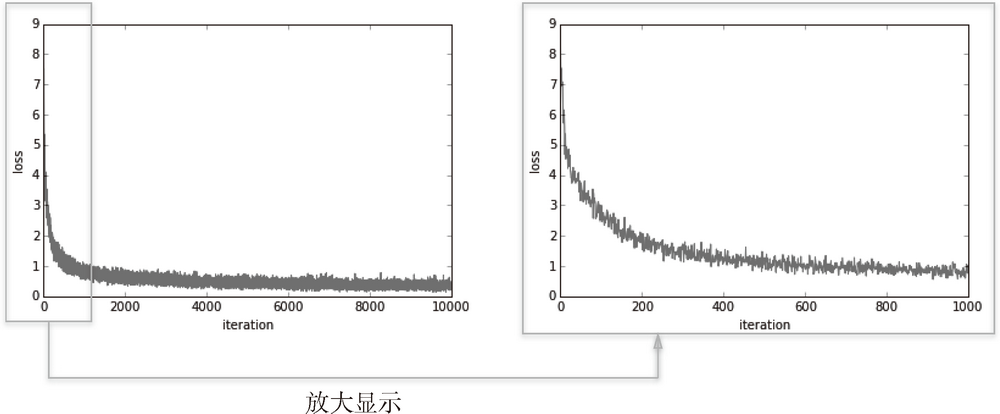

# Basic


<!-- TOC -->

- [Basic](#basic)
    - [0 思想](#0-思想)
    - [1 从数据中学习](#1-从数据中学习)
        - [1.1 数据驱动](#11-数据驱动)
        - [1.2 古典人工智能、机器学习和深度学习的区别](#12-古典人工智能机器学习和深度学习的区别)
            - [1.2.1 古典人工智能完全由人来设计算法](#121-古典人工智能完全由人来设计算法)
            - [1.2.2 机器学习使用人工提取的特征量](#122-机器学习使用人工提取的特征量)
            - [1.2.3 深度学习由机器来学习特征量](#123-深度学习由机器来学习特征量)
        - [1.3 训练数据和测试数据](#13-训练数据和测试数据)
    - [2 损失函数](#2-损失函数)
        - [2.1 均方误差（mean squared error）损失函数](#21-均方误差mean-squared-error损失函数)
        - [2.2 交叉熵误差（cross entropy error）损失函数](#22-交叉熵误差cross-entropy-error损失函数)
    - [3 mini-batch 学习](#3-mini-batch-学习)
        - [3.1 从数据集中选择批量数据](#31-从数据集中选择批量数据)
        - [3.2 mini-batch 版交叉熵误差的实现](#32-mini-batch-版交叉熵误差的实现)
    - [4 为何要设定损失函数](#4-为何要设定损失函数)
    - [5 数值微分](#5-数值微分)
        - [5.1 导数](#51-导数)
            - [5.1.1 数值微分和解析微分](#511-数值微分和解析微分)
            - [5.1.2 数值微分的实现](#512-数值微分的实现)
                - [5.1.2.1 舍入误差](#5121-舍入误差)
                - [5.1.2.2 前向差分](#5122-前向差分)
                - [5.1.2.3 改进后的数值微分实现](#5123-改进后的数值微分实现)
        - [5.2 数值微分的例子](#52-数值微分的例子)
        - [5.3 偏导数](#53-偏导数)
            - [5.3.1 偏导数的概念](#531-偏导数的概念)
            - [5.3.2 求偏导数](#532-求偏导数)
    - [6 梯度](#6-梯度)
        - [6.1 梯度下降法是干什么用的？](#61-梯度下降法是干什么用的)
            - [6.1.1 我们希望找到神经网络的最优权重](#611-我们希望找到神经网络的最优权重)
            - [6.1.2 解析法求导不显示](#612-解析法求导不显示)
            - [6.1.3 通过改变权重逐步逼近函数最小值](#613-通过改变权重逐步逼近函数最小值)
        - [6.2 梯度的表达式和意义](#62-梯度的表达式和意义)
        - [图像](#图像)
            - [方向](#方向)
        - [梯度法](#梯度法)
            - [数学表达](#数学表达)
            - [Python 实现梯度下降法](#python-实现梯度下降法)
            - [实例](#实例)
        - [神经网络的梯度](#神经网络的梯度)
            - [实例：实现一个简单的神经网络并求梯度](#实例实现一个简单的神经网络并求梯度)
    - [学习算法的实现](#学习算法的实现)
        - [实现 2 层神经网络（隐藏层为 1 层的网络）的类](#实现-2-层神经网络隐藏层为-1-层的网络的类)
        - [mini-batch 的实现](#mini-batch-的实现)
        - [基于测试数据的评价](#基于测试数据的评价)

<!-- /TOC -->


## 0 思想
1. 对于智能问题，最初的想法可能也是和古典人工智能的思路一样，即有人设计好思考方式。
2. 最初的人工智能就是这个思路，而我们最初思考人的智能的时候，也会很容易想到人的智能或是被设计或者天然形成了一套完备的机制。
3. 但是，在人类的智能和物理世界中一样，我们目前是无法完备的认识到所有的因果律的，也就是说麦克斯韦妖至少目前还是无法存在的。
4. 同样，人工智能在处理复杂问题时，也无法通过预先创造完备的算法来手把手教会机器每一步的思考。
5. 就像对于人的教育一样，教育孩子不仅仅是要告诉他们规则，很多时候，甚至说大多时候，孩子以及长大之后的人生中，都是通过反馈来不断的修补式的学习的。
6. 人只是学习课本知识，能力是很有限的。还需要在实践中不断的检验和学习，接收反馈，然后调整自我。这正如机器学习使用大量数据输入和反馈的过程一样。


## 1 从数据中学习
1. 神经网络的特征就是可以从数据中学习。所谓 “从数据中学习”，是指可以由数据自动决定权重参数的值。
2. 在实际的神经网络中，参数的数量成千上万，在层数更深的深度学习中，参数的数量甚至可以上亿，想要人工决定这些参数的值是不可能的。
3. 对于线性可分问题，感知机是可以利用数据自动学习的。根据 “感知机收敛定理”，通过有限次数的学习，线性可分问题是可解的。但是，非线性可分问题则无法通过（自动）学习来解决。

### 1.1 数据驱动
1. 数据是机器学习的核心，这种数据驱动的方法，也可以说脱离了过往以人为中心的方法。
2. 通常要解决某个问题，特别是需要发现某种模式时，人们一般会综合考虑各种因素后再给出回答。“这个问题好像有这样的规律性？” “不对，可能原因在别的地方。”——类似这样，人们以自己的经验和直觉为线索，通过反复试验推进工作。
3. 而机器学习的方法则极力避免人为介入，尝试从收集到的数据中发现答案（模式）。
4. 神经网络或深度学习则比以往的机器学习方法更能避免人为介入。

### 1.2 古典人工智能、机器学习和深度学习的区别
#### 1.2.1 古典人工智能完全由人来设计算法
1. 如果让我们自己来设计一个能将图像数字 `5` 正确分类的程序，就会意外地发现这是一个很难的问题。人可以简单地识别出 `5`，但却很难明确说出是基于何种规律而识别出了 `5`。
2. 因此，与其绞尽脑汁，从零开始想出一个可以识别 `5` 的算法，不如考虑通过有效利用数据来解决这个问题。

#### 1.2.2 机器学习使用人工提取的特征量
1. 一种方案是，先从图像中提取 **特征量**，再用机器学习技术学习这些特征量的模式。这里所说的“特征量”是指可以从输入数据（输入图像）中准确地提取本质数据（重要的数据）的转换器。例如为了识别数字，人工需要先找出一系列特征，符合哪些特征是 `1`，符合哪些特征是 `2`，等等。
2. 图像的特征量通常表示为向量的形式。在计算机视觉领域，常用的特征量包括 SIFT、SURF 和 HOG 等。使用这些特征量将图像数据转换为向量，然后对转换后的向量使用机器学习中的 SVM、KNN 等分类器进行学习。
3. 机器学习的方法中，由机器从收集到的数据中，按照人工设计的设置的特征量找出规律性。与从零开始想出算法相比，这种方法可以更高效地解决问题，也能减轻人的负担。
4. 但是需要注意的是，将图像转换为向量时使用的特征量仍是由人设计的。对于不同的问题，必须使用合适的特征量（必须设计专门的特征量），才能得到好的结果。
5. 比如，为了区分狗的脸部，人们需要考虑与用于识别 `5` 的特征量不同的其他特征量。也就是说，即使使用特征量和机器学习的方法，也需要针对不同的问题人工考虑合适的特征量。

#### 1.2.3 深度学习由机器来学习特征量
1. 运用神经网络的深度学习与普通的机器学习不同。机器学习的方法中，特征量仍是由人工设计的，而在神经网络中，连图像中包含的重要特征量也都是由机器来学习的。
    
2. 深度学习有时也称为端到端机器学习（end-to-end machine learning）。这里所说的端到端是指从一端到另一端的意思，也就是从原始数据（输入）中获得目标结果（输出）的意思。
3. 神经网络的优点是对所有的问题都可以用同样的流程来解决。比如，不管要求解的问题是识别 `5`，还是识别狗，抑或是识别人脸，神经网络都是通过不断地学习所提供的数据，尝试发现待求解的问题的模式。
4. 也就是说，与待处理的问题无关，神经网络可以将数据直接作为原始数据，进行 “端对端” 的学习。

### 1.3 训练数据和测试数据
1. 机器学习中，一般将数据分为训练数据（也被称为监督数据）和测试数据两部分来进行学习和实验等。
2. 首先，使用训练数据进行学习，寻找最优的参数；然后，使用测试数据评价训练得到的模型的实际能力。
3. 为什么需要将数据分为训练数据和测试数据呢？因为我们追求的是模型的泛化能力。为了正确评价模型的泛化能力，就必须划分训练数据和测试数据。
4. 泛化能力是指处理未被观察过的数据（不包含在训练数据中的数据，即，从适用于训练数据泛化到适用于实际数据）的能力。获得泛化能力是机器学习的最终目标。
5. 因此，仅仅用一个数据集去学习和评价参数，是无法进行正确评价的。这样会导致可以顺利地处理某个数据集，但无法处理其他数据集的情况。
6. 顺便说一下，只对某个数据集过度拟合的状态称为 **过拟合**（over fitting）。避免过拟合也是机器学习的一个重要课题。


## 2 损失函数
1. 神经网络的学习通过某个指标表示现在的状态。然后，以这个指标为基准，寻找最优权重参数。
2. 神经网络的学习中所用的指标称为 **损失函数**（loss function）。这个损失函数可以使用任意函数，但一般用均方误差和交叉熵误差等。
3. 损失函数是表示神经网络性能的 “恶劣程度” 的指标，即当前的神经网络对监督数据在多大程度上不拟合，在多大程度上不一致。
4. 以 “性能的恶劣程度” 为指标可能会使人感到不太自然，但是如果给损失函数乘上一个负值，就可以解释为“在多大程度上不坏”，即 “性能有多好”。

### 2.1 均方误差（mean squared error）损失函数
$$E=\frac{1}{2}\sum_k(y_k-t_k)^2$$

1. 这里，`y` 表示神经网络的输出，`t` 表示监督数据，`k` 表示数据的维数。
2. 在识别一个手写数字的例子中，`y` 是对该数字判断是从 0 到 9 的概率，`t` 是对应的监督数据 one-hot 表示
   ```py
    y = [0.1, 0.05, 0.6, 0.0, 0.05, 0.1, 0.0, 0.1, 0.0, 0.0]
    t = [0, 0, 1, 0, 0, 0, 0, 0, 0, 0]
    ``` 
3. 上述数据可以看出，神经网络判断该图片最后可能是数字 2，有 60% 的概率；监督数据也表示该图片就是数字 2。
4. 根据均方误差函数的逻辑可以看出，当神经网络对一条数据判断的越准确是，`y` 和 `t` 就越相似，均方误差函数的值也就最小，损失也就最小，就代表判断越准确。
5. 均方误差损失函数实际上计算的就是每一项的答案和正确答案的差距的总和。
6. 该损失函数的 Python 实现如下
    ```py
    def mean_squared_error(y, t):
        return 0.5 * np.sum((y-t)**2)
    ```
7. 测试两次神经网络输出的损失函数计算
    ```py
    import numpy as np

    def mean_squared_error(y, t):
        return 0.5 * np.sum((y-t)**2)  
            
    # 假设 2 为正确解
    t = [0, 0, 1, 0, 0, 0, 0, 0, 0, 0]

    # 例1：判断 2 的概率最高的情况（0.6）
    y = [0.1, 0.05, 0.6, 0.0, 0.05, 0.1, 0.0, 0.1, 0.0, 0.0]

    print(mean_squared_error(np.array(y), np.array(t)))
    # 0.09750000000000003

    # 例2：判断 7 的概率最高的情况（0.6）
    y = [0.1, 0.05, 0.1, 0.0, 0.05, 0.1, 0.0, 0.6, 0.0, 0.0]
    print(mean_squared_error(np.array(y), np.array(t)))
    # 0.5975
    ```
    可以看到，根据损失函数的计算，可以得出第一种情况的损失要明显比第二种少，也就是说准确的概率更大。

### 2.2 交叉熵误差（cross entropy error）损失函数
$$E=-\sum_kt_k\log y_k$$

1. $log$ 表示以 $e$ 为底数的自然对数。
2. $t$ 中只有正确解标签的索引为 1，其他均为 0（one-hot 表示）。因此，交叉熵误差实际上只计算对应正确解标签的输出的自然对数。
3. 神经网络对正确的选项给出的概率越高（越接近1），对数的值（负值）就越接近0，损失函数的结果作为该负值的绝对值也就越小。
4. 注意到，对于非正确标签对应的项，`t`的值都是 0。所以虽然说是求 sum，但其实有效的值也只是正确标签对应的那一项，而正确项对应的 $t_K$ 又恰好是 1。所以计算的只是 $-log(y_{正确})$。对正确值 $y_{正确}$ 估算的越准确，这个式子的值就是一个越接近于 0 的正数。
5. 所以相比于均方误差损失函数计算每一项的差别的总和，交叉熵误差损失函数只计算正确项的误差。
6. Python 实现如下
    ```py
    def cross_entropy_error(y, t):
        delta = 1e-7
        return -np.sum(t * np.log(y + delta))
    ```
7. 函数内部在计算 `np.log` 时，加上了一个微小值 `delta`。这是因为，当出现 `np.log(0)` 时，`np.log(0)` 会变为负无限大的 `-inf`，这样一来就会导致后续计算无法进行。作为保护性对策，添加一个微小值可以防止负无限大的发生。
8. 测试
    ```py
    import numpy as np


    def cross_entropy_error(y, t):
        delta = 1e-7
        return -np.sum(t * np.log(y + delta))
            
    # 假设 2 为正确解
    t = [0, 0, 1, 0, 0, 0, 0, 0, 0, 0]

    # 例1：判断 2 的概率最高的情况（0.6）
    y = [0.1, 0.05, 0.6, 0.0, 0.05, 0.1, 0.0, 0.1, 0.0, 0.0]

    print(cross_entropy_error(np.array(y), np.array(t)))
    # 0.510825457099338

    # 例2：判断 7 的概率最高的情况（0.6）
    y = [0.1, 0.05, 0.1, 0.0, 0.05, 0.1, 0.0, 0.6, 0.0, 0.0]
    print(cross_entropy_error(np.array(y), np.array(t)))
    # 2.302584092994546
    ```


## 3 mini-batch 学习
1. 上面的例子都是对单一输出进行损失函数计算，如果一次对多个输出结果进行计算，可以写成下面的形式
    
    $$E=-\frac{1}{N}\sum_n\sum_k t_{nk}\log y_{nk}$$
    
    也就是计算 n 个数据计算损失函数结果的平均值
2. 训练数据集的数据通常量很大，不可能使用所有的数据进行训练。神经网络的学习也是从训练数据中选出一批数据（称为 mini-batch, 小批量），然后对每个 mini-batch 进行学习。
3. 比如，从 60000 个训练数据中随机选择 100 笔，再用这 100 笔数据进行学习。这种学习方式称为 **mini-batch 学习**。

### 3.1 从数据集中选择批量数据
```py
(x_train, t_train), (x_test, t_test) = \
    load_mnist(normalize=True, one_hot_label=True)

# 训练数据的所有的输入数据和监督数据
# 60000 条输入数据，每条数据是 28 × 28 像素的图像数据
# 60000 条监督数据，每条数据是一个 1 九个 0 的一维数组
print(x_train.shape) # (60000, 784) 
print(t_train.shape) # (60000, 10)

train_size = x_train.shape[0]
batch_size = 10
# 从 60000 （train_size）条训练数据中随机选择 10 （batch_size）条数据作为 mini-batch 进行训练
batch_mask = np.random.choice(train_size, batch_size) # batch_size 个索引号
x_batch = x_train[batch_mask] # batch_size 个随机输入数据
t_batch = t_train[batch_mask] # 对应的 batch_size 个监督数据
```

### 3.2 mini-batch 版交叉熵误差的实现
1. 可以同时处理单个数据和批量数据（数据作为 batch 集中输入）两种情况的函数
    ```py
    # y 是神经网络的输出，t 是监督数据
    def cross_entropy_error(y, t):
        # 如果输入的是单条数据（一维数组），则格式化为二维数组，以便下面的统一计算
        if y.ndim == 1:
            t = t.reshape(1, t.size)
            y = y.reshape(1, y.size)
        # 计算所有数据的平均交叉熵误差
        batch_size = y.shape[0]
        return -np.sum(t * np.log(y + 1e-7)) / batch_size
    ```
2. 当监督数据是标签形式（非 one-hot 表示，而是像 “2” “7” 这样的标签）时，交叉熵误差可通过如下代码实现
    ```py
    def cross_entropy_error(y, t):
        if y.ndim == 1:
            t = t.reshape(1, t.size)
            y = y.reshape(1, y.size)

        batch_size = y.shape[0]
        # np.arange (batch_size) 会生成一个从 0 到 batch_size-1 的数组。
        # 因为不是 one-hot 形式，所以 t 的每一项不再是一个十项数组，而只是一个表示正确答案的从 0 到 9 的整数。
        # 因此，y[np.arange(batch_size), t] 会抽出批处理输入中的每一个输出（一个10项数组）中正确结果对应的那个概率值。
        # y[np.arange(batch_size), t] 的结果类似[y[0,2], y[1,7], y[2,0], y[3,9], y[4,4]]
        return -np.sum(np.log(y[np.arange(batch_size), t] + 1e-7)) / batch_size
    ```


## 4 为何要设定损失函数
1. 以数字识别任务为例，我们想获得的是能提高识别精度的参数，特意再导入一个损失函数不是有些重复劳动吗？也就是说，既然我们的目标是获得使识别精度尽可能高的神经网络，那不是应该把识别精度（45%、89%之类的正确率）作为指标吗？
2. 假设某个神经网络正确识别出了 100 笔训练数据中的 32 笔，此时识别精度为 32% 。如果以识别精度为指标（即识别精度函数关于参数求导），即使稍微改变权重参数的值，识别精度也仍将保持在 32% ，不会出现变化。
3. 比如调整了参数，某些之前识别正确的项，它估算正确的概率从 0.6 变成了 0.8，但仍然是识别为正确，所以最终正确率还是没有变。这就导致你调节参数后，看不出调节参数意义。
4. 也就是说，仅仅微调参数，是无法改善识别精度的。即便识别精度有所改善，它的值也不会像 32.0123 ... % 这样连续变化，而是变为 33%、34% 这样的不连续的、离散的值。
5. 而如果把损失函数作为指标（即损失函数关于参数求导），则当前损失函数的值可以表示为 0.92543 ... 这样的值。并且，如果稍微改变一下参数的值，对应的损失函数也会像 0.93432 ... 这样发生连续性的变化。
6. 出于相同的原因，如果使用阶跃函数作为激活函数，神经网络的学习将无法进行。阶跃函数的导数在绝大多数地方（除了 0 以外的地方）均为 0（参数的变化不会引起函数值的变化）。也就是说，如果使用了阶跃函数，那么即便将损失函数作为指标，参数的微小变化也会被阶跃函数抹杀，导致损失函数的值不会产生任何变化。


## 5 数值微分
### 5.1 导数
#### 5.1.1 数值微分和解析微分
1. 所谓 **数值微分**（numerical differentiation），就是用数值方法、利用微小的差分近似求解函数的导数的过程。
2. 而基于数学式的推导求导数的过程，则用 **解析性**（analytic）一词，称为 “解析性求解” 或者 “解析性求导”。解析性求导得到的导数是不含误差的 “真的导数”。

#### 5.1.2 数值微分的实现
1. 一个不好的数值微分实现
    ```py
    def numerical_diff(f, x):
        h = 10e-50
        return (f(x+h) - f(x)) / h
    ```
2. 看起来合理，但有两处需要改进的地方。

##### 5.1.2.1 舍入误差
1. 在上面的实现中，因为想把尽可能小的值赋给 $h$（想让 $h$ 无限接近 0），所以 $h$ 使用了 $10e^{-50}$ 这个微小值。
2. 但是，这样反而产生了 **舍入误差**（rounding error）。
3. 所谓舍入误差，是指因省略小数的精细部分的数值（比如，小数点第 8 位以后的数值）而造成最终的计算结果上的误差。比如，在 Python 中，舍入误差可如下表示。
    ```py
    >>> np.float32(1e-50)
    0.0
    ```
4. 如上所示，如果用 `float32` 类型（32 位的浮点数）来表示 $1e^{-50}$，就会变成 `0.0`，无法正确表示出来。也就是说，使用过小的值会造成计算机出现计算上的问题。
5. 这是第一个需要改进的地方，即将微小值 $h$ 改为 $10^{-4}$。使用 $10^{-4}$ 就可以得到正确的结果。

##### 5.1.2.2 前向差分
1. 第二个需要改进的地方与函数 $f$ 的差分有关。
2. 虽然上述实现中计算了函数 $f$ 在 $x+h$ 和 $x$ 之间的差分，但是必须注意到，这个计算从一开始就有误差。
3. 如下图所示，“真的导数” 对应函数在 $x$ 处的斜率（称为切线），但上述实现中计算的导数对应的是 $(x + h)$ 和 $x$ 之间的斜率。
    
4. 因此，真的导数（真的切线）和上述实现中得到的导数的值在严格意义上并不一致。这个差异的出现是因为 $h$ 不可能无限接近 $0$。
5. 为了减小这个误差，我们可以计算函数 $f$ 在 $(x + h)$ 和 $(x - h)$ 之间的差分。
6. 因为这种计算方法以 $x$ 为中心，计算它左右两边的差分，所以也称为 **中心差分**（而 $(x + h)$ 和 $x$ 之间的差分称为 **前向差分**）。

##### 5.1.2.3 改进后的数值微分实现
```py
def numerical_diff(f, x):
    h = 1e-4 # 0.0001
    return (f(x+h) - f(x-h)) / (2*h)
```

### 5.2 数值微分的例子
1. 函数 $y=0.01x^2 + 0.1x$ 的 Python 表示为
    ```py
    def function_1(x):
        return 0.01 * x**2 + 0.1 * x
    ```
2. 绘制这个函数在在 $[0, 20]$ 区间的图像
    ```py
    import numpy as np
    import matplotlib.pylab as plt


    def function_1(x):
        return 0.01 * x**2 + 0.1 * x

    x = np.arange(0.0, 20.0, 0.1)
    y = function_1(x)
    plt.xlabel('x')
    plt.ylabel('f(x)')
    plt.plot(x, y)
    plt.show()
    ```
3. 计算一下这个函数在 $x = 5$ 和 $x = 10$ 处的导数。
    ```py
    d5 = numerical_diff(function_1, 5)
    print(d5)  # 0.1999999999990898

    d10 = numerical_diff(function_1, 10)
    print(d10)  # 0.2999999999986347
    ```
4. $f(x)=0.01x^2+0.1x$ 的解析解是 $\frac{{\rm d}f(x)}{{\rm d}x}=0.02x+0.1$。因此，在 $x = 5$ 和 $x = 10$ 处，“真的导数” 分别为 $0.2$ 和 $0.3$。和上面的结果相比，我们发现虽然严格意义上它们并不一致，但误差非常小。实际上，误差小到基本上可以认为它们是相等的。

### 5.3 偏导数
#### 5.3.1 偏导数的概念
1. 观察 $f(x_0, x_1) = x_0^2 + x_1^2$，虽然它只是一个计算参数的平方和的简单函数，但是请注意和上例不同的是，这里有两个变量
2. 这个式子可以用 Python 来实现，如下所示。
    ```py
    def function_2(x):
        return x[0]**2 + x[1]**2
        # 或者return np.sum(x**2)
    ```
3. 我们来画一下这个函数的图，是一个三维图像
    
4. 现在我们来求 $f(x_0, x_1)$ 的导数。这里需要注意的是，函数有两个变量，所以有必要区分对哪个变量求导数，即对 $x_0$ 和 $x_1$ 两个变量中的哪一个求导数。
5. 我们把这里讨论的有多个变量的函数的导数称为 **偏导数**，用数学式表示的话，可以写成$\frac{∂f}{∂x_0}$、$\frac{∂f}{∂x_1}$。

#### 5.3.2 求偏导数
1. 求 $x_0 = 3, x_1 = 4$ 时，关于 $x_0$ 的偏导数
    ```py
    def function_tem1(x0):
        return x0*x0 + 4.0 * 4.0


    d = numerical_diff(function_tem1, 3.0)
    print(d)  # 6.00000000000378
    ```
2. 求 $x_0 = 3, x_1 = 4$ 时，关于 $x_1$ 的偏导数
    ```py
    def function_tem2(x1):
        return 3*3 + x1 * x1


    d = numerical_diff(function_tem2, 4.0)
    print(d)  # 7.999999999999119
    ```
3. 像这样，偏导数和单变量的导数一样，都是求某个地方的斜率。不过，偏导数需要将多个变量中的某一个变量定为目标变量，并将其他变量固定为某个值。
4. 在上例的代码中，为了将目标变量以外的变量固定到某些特定的值上，我们定义了新函数。然后，对新定义的函数应用了之前的求数值微分的函数，得到偏导数。


## 6 梯度
先要确保理解了 `Theories\AI\MathematicalFoundations\Calculus\GradientDescent.md` 中的内容

### 6.1 梯度下降法是干什么用的？
#### 6.1.1 我们希望找到神经网络的最优权重
1. 我们希望找到，使得神经网络的损失函数取得最小值时的权重值。
2. 这里我们把神经网络作为一个函数 $f$，自变量是权重，函数的值是损失函数的值。
3. 也就是说，我们要找到函数 $f$ 取得最小值是的自变量的值。

#### 6.1.2 解析法求导不显示
1. 我们知道，函数最小值的点是导数为 0 的点。
2. 所以最直接的方法就是对 $f$ 求导，然后看当导数为 0 时，自变量参数可能取哪些值。
3. 但现实是，多层神经网络对应的函数的复杂性，使用解析法求导几乎是不可能的。

#### 6.1.3 通过改变权重逐步逼近函数最小值
1. 我们无法一下确定函数最小值，但我们可以不断摸索前进。
2. 我们每次都通过改变权重值让函数减小一点点，这样最终就会来到函数的最小值。
3. 每次的步子不能太大，因为太大就定位不到最小值，可能只会在它上面跨来跨去。
4. 我们每次怎么改变权重来让函数值减小呢？
5. 因为函数值的变化等于自变量的变化值和导数的乘积，所以我们只要每次让权重的变化值和当前导数正负号相反即可。
6. 所以们每次一小步做的事情就是：求出当前的导数 $d$，让权重改变 $-\eta * d（\eta 为正的微小常数）$


### 6.2 梯度的表达式和意义
1. 在上面的例子中，我们按变量分别计算了 $x_0$ 和 $x_1$ 的偏导数。现在，我们希望一起计算 $x_0$ 和 $x_1$ 的偏导数。比如，我们来考虑求 $x_0=3,x_1=4$ 时 $(x_0,x_1)$ 的偏导数 $\Bigl(\frac{\partial f}{\partial x_0},\frac{\partial f}{\partial x_1}\Bigr)$。
2. 像 $\Bigl(\frac{\partial f}{\partial x_0},\frac{\partial f}{\partial x_1}\Bigr)$ 这样的由全部变量的偏导数汇总而成的向量称为 **梯度**（gradient）
3. 梯度可以像下面这样来实现
    ```py
    def numerical_gradient(f, x):
        h = 1e-4  # 0.0001
        grad = np.zeros_like(x)  # 生成和 x 形状相同的数组

        for idx in range(x.size):
            tmp_val = x[idx]
            # f(x+h) 的计算
            x[idx] = tmp_val + h
            fxh1 = f(x)

            # f(x-h)的计算
            x[idx] = tmp_val - h
            fxh2 = f(x)

            grad[idx] = (fxh1 - fxh2) / (2*h)
            x[idx] = tmp_val  # 还原值

        return grad
    ```
4. 函数 `numerical_gradient(f, x)` 中，参数 `f` 为函数，`x` 为 NumPy 数组，该函数对 NumPy 数组 `x` 的各个元素求数值微分。也就是说分别对每个自变量求偏导，最后再输出每个偏导组成的向量。
5. 注意通过使用变量 `tmp_val`，保证了比如在计算完第一个自变量的偏导后再计算第二个自变量的偏导时，第一个自变量的值让然维持输入值。比如 `x` 输入的是 `np.array([3.0, 4.0])`，内部会循环两次：第一次计算时 `x[1]` 是 4，求第一个自变量的偏导；求完后第一个自变量 `x[0]` 恢复为 3，再求第二个自变量的偏导。
5. 我们用这个函数实际计算一下梯度。这里我们求 $f(x_0, x_1) = x_0^2 + x_1^2$ 在点 $(3, 4)$、$(0, 2)$、$(3, 0)$ 处的梯度
    ```py
    def function_2(x):
        return np.sum(x**2)

    np.array([0.0, 2.0])
    grad1 = numerical_gradient(function_2, np.array([3.0, 4.0]))
    print(grad1)  # [6. 8.]

    grad2 = numerical_gradient(function_2, np.array([0.0, 2.0]))
    print(grad2)  # [0. 4.]

    grad3 = numerical_gradient(function_2, np.array([1.0, 2.0]))
    print(grad3)  # [2. 4.]
    ```
6. 像这样，我们可以计算 $(x_0,x_1)$ 在各点处的梯度。这个梯度意味着什么呢？
7. 注意到输出的偏导向量和输入的 `x` 向量是姓张相同的。以输入 $(1.0, 2.0)$ 为例，梯度的计算结果也是输出一个 2D 向量。它的意义在于，当两个自变量分别处于 3 和 4 时，第一个自变量的微小变化 $h$ 将引起因变量相应变化 $2h$，而第二个自变量的微小变化 $h$ 将引起因变量相应变化 $4h$
    ```py
    grad1 = numerical_gradient(function_2, np.array([1.0, 2.0]))
    print(grad1)  # [2. 4.]

    y0 = function_2(np.array([1.0, 2.0]))
    print(y0) # 5.0
    y1 = function_2(np.array([1.00001, 2.0]))
    print(y1)  # 5.0000200001
    y2 = function_2(np.array([1.0, 2.00001]))
    print(y2)  # 5.0000400001
    y3 = function_2(np.array([1.00001, 2.00001]))
    print(y3)  # 5.0000600002
    ```

### 图像
1. 画出 `function_2` 的梯度向量
    
2. 解释一下。输入的是一个 2D 向量，即 $(x_1 x_2)$。这个向量确定了图上的一点，这个点会作为图上有向向量箭头的起点。输出值也是一个 2D 向量，这个向量确定了图上有向向量箭头的位移。和起点结合起来，就是一个有向向量箭头。另外，因为这里绘制采用负梯度方向，所以方向是和值相反的。
3. 参考以下示例
    ```py
    grad1 = numerical_gradient(function_2, np.array([0.0, 0.0]))
    grad2 = numerical_gradient(function_2, np.array([0.5, 0.5]))
    grad3 = numerical_gradient(function_2, np.array([1.0, 1.0]))
    grad4 = numerical_gradient(function_2, np.array([1.5, 1.5]))
    grad5 = numerical_gradient(function_2, np.array([2.0, 2.0]))
    grad6 = numerical_gradient(function_2, np.array([2.0, -2.0]))
    grad7 = numerical_gradient(function_2, np.array([-2.0, -2.0]))
    print(grad1)  # [0. 0.]
    print(grad2)  # [1. 1.]
    print(grad3)  # [2. 2.]
    print(grad4)  # [3. 3.]
    print(grad5)  # [4. 4.]
    print(grad6)  # [4. -4.]
    print(grad7)  # [-4. -4.]
    ```
    * `[0, 0]` 处的梯度为 `[0, 0]`，所以绘制出来的有向向量长度为0
    * `[1, 1]` 处的梯度为 `[2, 2]`，所以绘制出来的有向向量起点为 `[1, 1]`；位移 `[2, 2]` ，但因为是负梯度方向，所以要从起点开始位移`[-2, -2]`，也 $x_1$、$x_2$ 分别位移 -2 个单位。看起来这里位移的单位并不和输入向量的单位一样。

#### 方向
1. 有向向量的方向说明了什么？
2. 如果梯度中两个偏导值都为正，则指向左下角。也就是说，对于函数中的某个点，如果两个自变量分别变化时，函数值也分别同向变化，则箭头指向左下角。
3. 从函数表达式可以看出来，符合这样特征的自变量范围是两个自变量都大于零；从图像也能看出来，右上角象限的所有箭头都是指向左下角的。
4. 为什么都是指向中心的？
5. 这是负梯度方向，先考虑正梯度方向。梯度为两个正数，向量方向肯定是向右上角；梯度为两个负数，向量方向肯定是向左下角。也就是说，右上角象限的自变量和因变量变化符号相同，而左下角想象的符号相反。
6. 右上角象限中，自变量越靠外，自变量越大，因为导数符号相同，所以函数值也越大。左下角象限中，自变量越靠外，自变量越小，因为导数符号相饭，所以函数值也越大。
7. 如果是正梯度方向，则箭头总是指向函数值增大的方向。反过来，使用负梯度方向时，箭头就指向函数值减小的方向。
8. “更严格地讲，梯度指示的方向是各点处的函数值减小最多的方向。高等数学告诉我们，方向导数 = cos(θ) × 梯度（θ 是方向导数的方向与梯度方向的夹角）。因此，所有的下降方向中，梯度方向下降最多。”。比如在右上角象限，只要是往左下角任何角度指向，都是函数值减小，但为什么是梯度的那个向量的方向减小的最多呢？不懂

### 梯度法
1. 机器学习的主要任务是在学习时寻找最优参数。同样地，神经网络也必须在学习时找到最优参数（权重和偏置）。
2. 这里所说的最优参数是指损失函数取最小值时的参数。但是，一般而言，损失函数很复杂，参数空间庞大，我们不知道它在何处能取得最小值。
3. 而通过巧妙地使用梯度来寻找函数最小值（或者尽可能小的值）的方法就是梯度法。
4. 这里需要注意的是，梯度表示的是各点处的函数值减小最多的方向。因此，无法保证梯度所指的方向就是函数的最小值或者真正应该前进的方向。实际上，在复杂的函数中，梯度指示的方向基本上都不是函数值最小处。
5. 函数的极小值、最小值以及被称为**鞍点**（saddle point）的地方，梯度为 0。极小值是局部最小值，也就是限定在某个范围内的最小值。鞍点是从某个方向上看是极大值，从另一个方向上看则是极小值的点。
6. 虽然梯度法是要寻找梯度为 0 的地方，但是那个地方不一定就是最小值（也有可能是极小值或者鞍点）。此外，当函数很复杂且呈扁平状时，学习可能会进入一个（几乎）平坦的地区，陷入被称为“学习高原”的无法前进的停滞期。
7. 虽然梯度的方向并不一定指向最小值，但沿着它的方向能够最大限度地减小函数的值。因此，在寻找函数的最小值（或者尽可能小的值）的位置的任务中，要以梯度的信息为线索，决定前进的方向。
8. 此时梯度法就派上用场了。在梯度法中，函数的取值从当前位置沿着梯度方向前进一定距离，然后在新的地方重新求梯度，再沿着新梯度方向前进，如此反复，不断地沿梯度方向前进。
9. 像这样，通过不断地沿梯度方向前进，逐渐减小函数值的过程就是**梯度法**（gradient method）。

#### 数学表达
1. 数学式表示梯度法

    $\begin{aligned}x_0=x_0-\eta\frac{\partial f}{\partial x_0}\\x_1=x_1-\eta\frac{\partial f}{\partial x_1}\end{aligned}\quad\quad\quad\quad\quad$

2. $η$ 表示更新量，在神经网络的学习中，称为**学习率**（learning rate）。学习率决定在一次学习中，应该学习多少，以及在多大程度上更新参数。
3. 上式是表示更新一次的式子，这个步骤会反复执行。也就是说，每一步都按该式更新变量的值，通过反复执行此步骤，逐渐减小函数值。
4. 虽然这里只展示了有两个变量时的更新过程，但是即便增加变量的数量，也可以通过类似的式子（各个变量的偏导数）进行更新。
5. 学习率需要事先确定为某个值，比如 0.01 或 0.001。一般而言，这个值过大或过小，都无法抵达一个“好的位置”。在神经网络的学习中，一般会一边改变学习率的值，一边确认学习是否正确进行了。

#### Python 实现梯度下降法
```py
def gradient_descent(f, init_x, lr=0.01, step_num=100):
    x = init_x

    for i in range(step_num):
        grad = numerical_gradient(f, x)
        x -= lr * grad

    return x
```
1. 参数 `f` 是要进行最优化的函数，`init_x` 是初始值，`lr` 是学习率 learning rate，`step_num` 是梯度法的重复次数。
2. `numerical_gradient(f,x)` 会求函数的梯度，用该梯度乘以学习率得到的值进行更新操作，由 step_num 指定重复的次数。
3. 使用这个函数可以求函数的极小值，顺利的话，还可以求函数的最小值。
4.  这里的梯度的功能其实并不是提供具体的导数向量，而是提供了方向和递减性。两个偏导值可能是正也可能是负，拿上面右上象限和左下下限为例：如果导数为正，则 `lr * grad` 是一个很小的正值，通过减去它实现一次下降，`x` 的值会更接近函数极小值时对应的`x`；如果导数为正，则 `lr * grad` 是一个很小的负值，通过减去它实现一次下降，`x` 实际上会增大，而此时 `x` 在左下象限，它的增大同样会导致函数值变小。总之就是经过不断的下降，`x` 会很接近函数极小值时对应的 `x`。

#### 实例
1. 用梯度法求 $f(x_0+x_1)=x^2_0+x^2_1$ 的最小值
    ```py
    init_x = np.array([2.0, 2.0])
    minX = gradient_descent(function_2, init_x=init_x, lr=0.1, step_num=100)
    print(minX)  # [4.07407195e-10 4.07407195e-10]
    ```
2. 这里，设初始值为 $(-3.0, 4.0)$，开始使用梯度法寻找最小值。最终的结果是 $(-6.1e-10, 8.1e-10)$，非常接近 $(0, 0)$，通过梯度法我们基本得到了正确结果。
3. 如果用图来表示梯度法的更新过程
    
4. 前面说过，学习率过大或者过小都无法得到好的结果。我们来做个实验验证一下。
    ```py
    # 学习率过大的例子：lr=10.0
    >>> init_x = np.array([-3.0, 4.0])
    >>> gradient_descent(function_2, init_x=init_x, lr=10.0, step_num=100)
    array([ -2.58983747e+13,  -1.29524862e+12])

    # 学习率过小的例子：lr=1e-10
    >>> init_x = np.array([-3.0, 4.0])
    >>> gradient_descent(function_2, init_x=init_x, lr=1e-10, step_num=100)
    array([-2.99999994,  3.99999992])
    ```
    实验结果表明，学习率过大的话，会发散成一个很大的值；反过来，学习率过小的话，基本上没怎么更新就结束了。也就是说，设定合适的学习率是一个很重要的问题。
5. 像学习率这样的参数称为**超参数**。这是一种和神经网络的参数（权重和偏置）性质不同的参数。相对于神经网络的权重参数是通过训练数据和学习算法自动获得的，学习率这样的超参数则是人工设定的。一般来说，超参数需要尝试多个值，以便找到一种可以使学习顺利进行的设定。

### 神经网络的梯度
1. 神经网络的学习也要求梯度。这里所说的梯度是指损失函数关于权重参数的梯度。
2. 比如，有一个只有一个形状为 2 × 3 的权重 $\boldsymbol{W}$ 的神经网络，损失函数用 $L$ 表示。此时，梯度可以用 $\frac{\partial L}{\partial \boldsymbol{W}}$ 表示。
3. 用数学式表示的话，如下所示。

    $\begin{aligned}\boldsymbol{W}&=\begin{pmatrix}w_{11}&w_{12}&w_{13}\\w_{21}&w_{22}&w_{23}\end{pmatrix}\\\frac{\partial L}{\partial \boldsymbol{W}}&=\begin{pmatrix}\frac{\partial L}{\partial w_{11}}&\frac{\partial L}{\partial w_{12}}&\frac{\partial L}{\partial w_{13}}\\\frac{\partial L}{\partial w_{21}}&\frac{\partial L}{\partial w_{22}}&\frac{\partial L}{\partial w_{23}}\end{pmatrix}\end{aligned}\quad\quad\quad\quad\quad$

4. $\frac{\partial L}{\partial \boldsymbol{W}}$ 的元素由各个元素关于 $\boldsymbol{W}$ 的偏导数构成。比如，第 1 行第 1 列的元素 $\frac{\partial L}{\partial w_{11}}$ 表示当 $w_{11}$ 稍微变化时，损失函数 $L$ 会发生多大变化。

#### 实例：实现一个简单的神经网络并求梯度
源码在`./demo/gradient_simplenet.py`

1. 先实现一个简单的神经网络
    ```py
    # coding: utf-8
    import sys, os
    sys.path.append(os.path.join(os.path.dirname(__file__), '../../'))
    from common.gradient import numerical_gradient
    from common.functions import softmax, cross_entropy_error
    import numpy as np


    class simpleNet:
        def __init__(self):
            self.W = np.random.randn(2, 3)  # 用高斯分布进行初始化参数

        def predict(self, x):
            return np.dot(x, self.W)

        #  x 接收输入数据，t 接收正确解标签
        def loss(self, x, t):
            z = self.predict(x)
            y = softmax(z)
            loss = cross_entropy_error(y, t)

            return loss
    ```
2. 实例化并使用一组参数进行一次预测
    ```py
    net = simpleNet()

    print(net.W)  # 随机生成的参数
    # [
    #   [-0.31211728  0.81783696  1.0369602]
    #   [-0.35531326 - 0.40729509  1.30223118]
    # ]

    t = np.array([0, 0, 1])  # 假定正确答案是最后一项
    x = np.array([0.6, 0.9])
    p = net.predict(x) # 使用随机参数预测三个结果
    print(p)  # [-0.5070523   0.1241366   1.79418418]   预测结果正好倾向于最后一项
    print(np.argmax(p))  # 如果使用随机参数预测的结果也是更倾向于最后一项，则损失函数的值会比较小
    print(net.loss(x, t))  # 0.25338010072421907   
    ```
3. 接下来求当前参数下的梯度
    ```py
    # 损失值关于参数的函数
    def f(W):
        return net.loss(x, t)

    # 求当前参数下的函数梯度
    # 这个求梯度的函数不是上面定义的那个，那个只支持向量。这里的参数是矩阵
    dW = numerical_gradient(f, net.W) 
    print(dW)
    # [
    #   [0.0466332   0.08766316 - 0.13429636]
    #   [0.06994981  0.13149474 - 0.20144454]
    # ]
    ```
4. 简单来说，左边四个偏导是正右边两个偏导是否，说明如果在当前参数的位置，左边四个参数如果稍微减小，则损失函数的会减小，右边两个参数如果稍微增大，损失函数的值也会减小。
5. 而且绝对值的大小也说明它们各自更新的作用有大有小。比如右下角稍微增大一点的贡献就要比左上角减小同样值起的作用要大。
6. 求出神经网络的梯度后，接下来只需根据梯度法，更新权重参数即可。


## 学习算法的实现
1. 神经网络的学习步骤如下所示：
    1. **mini-batch**：从训练数据中随机选出一部分数据，这部分数据称为 mini-batch。我们的目标是减小 mini-batch 的损失函数的值。
    2. **计算梯度**：为了减小 mini-batch 的损失函数的值，需要求出各个权重参数的梯度。梯度表示损失函数的值减小最多的方向。
    3. **更新参数**：将权重参数沿梯度方向进行微小更新。
    4. **重复**：重复步骤 1、步骤 2、步骤 3。
2. 神经网络的学习按照上面 4 个步骤进行。这个方法通过梯度下降法更新参数，不过因为这里使用的数据是随机选择的mini batch 数据，所以又称为**随机梯度下降法**（stochastic gradient descent）。“随机”指的是“随机选择的”的意思，因此，随机梯度下降法是“对随机选择的数据进行的梯度下降法”。
3. 深度学习的很多框架中，随机梯度下降法一般由一个名为 **SGD** 的函数来实现。SGD 来源于随机梯度下降法的英文名称的首字母。

### 实现 2 层神经网络（隐藏层为 1 层的网络）的类
源码在 `./demo/two_layer_net.py`
```py
import numpy as np
import sys
import os
sys.path.append(os.path.join(os.path.dirname(__file__), '../../'))
from common.gradient import numerical_gradient
from common.functions import *


class TwoLayerNet:
    # input_size:  输入层的神经元数
    # hidden_size: 隐藏层的神经元数
    # output_size: 输出层的神经元数
    def __init__(self, input_size, hidden_size, output_size,
                 weight_init_std=0.01):
        # 初始化权重
        self.params = {}
        self.params['W1'] = weight_init_std * \
            np.random.randn(input_size, hidden_size)   # 第 1 层权重
        self.params['b1'] = np.zeros(hidden_size)      # 第 1 层偏置
        self.params['W2'] = weight_init_std * \
            np.random.randn(hidden_size, output_size)  # 第 2 层权重
        self.params['b2'] = np.zeros(output_size)      # 第 2 层偏置

    def predict(self, x):
        W1, W2 = self.params['W1'], self.params['W2']
        b1, b2 = self.params['b1'], self.params['b2']

        a1 = np.dot(x, W1) + b1
        z1 = sigmoid(a1)
        a2 = np.dot(z1, W2) + b2
        y = softmax(a2)

        return y

    # x:输入数据, t:监督数据
    def loss(self, x, t):
        y = self.predict(x)

        return cross_entropy_error(y, t)

    def accuracy(self, x, t):
        y = self.predict(x)
        y = np.argmax(y, axis=1)
        t = np.argmax(t, axis=1)

        accuracy = np.sum(y == t) / float(x.shape[0])
        return accuracy

    # x:输入数据, t:监督数据
    def numerical_gradient(self, x, t):
        def loss_W(W): return self.loss(x, t)

        grads = {}
        grads['W1'] = numerical_gradient(loss_W, self.params['W1']) # 第 1 层权重的梯度
        grads['b1'] = numerical_gradient(loss_W, self.params['b1']) # 第 1 层偏置的梯度
        grads['W2'] = numerical_gradient(loss_W, self.params['W2']) # 第 2 层权重的梯度
        grads['b2'] = numerical_gradient(loss_W, self.params['b2']) # 第 2 层偏置的梯度

        return grads
```

### mini-batch 的实现
1. 源码在 `./demo/train_neuralnet.py`
    ```py
    import numpy as np
    import sys
    import os
    sys.path.append(os.path.join(os.path.dirname(__file__), '../../'))
    from dataset.mnist import load_mnist
    from two_layer_net import TwoLayerNet

    (x_train, t_train), (x_test, t_test) = load_mnist(normalize=True, one_hot_label = True)

    train_loss_list = []

    # 超参数
    iters_num = 10000  # 梯度法的更新次数
    train_size = x_train.shape[0]
    batch_size = 100
    learning_rate = 0.1

    network = TwoLayerNet(input_size=784, hidden_size=50, output_size=10)

    for i in range(iters_num):
        # 获取mini-batch
        # 实际上，一般做法是事先将所有训练数据随机打乱，然后按指定的批次大小，按序生成 mini-batch。这样每个 
        # mini-batch 均有一个索引号，比如此例可以是 0, 1, 2, ... , 99，然后用索引号可以遍历所有的
        # mini-batch。遍历一次所有数据，就称为一个epoch。这里的 mini-batch 作为示例，每次都是随机选择的
        batch_mask = np.random.choice(train_size, batch_size) # 每次从 60000 个训练数据中取出 100 个
        x_batch = x_train[batch_mask]
        t_batch = t_train[batch_mask]
        # 计算梯度
        grad = network.numerical_gradient(x_batch, t_batch)
        # grad = network.gradient(x_batch, t_batch) # 使用用误差反向传播法计算梯度的告诉版

        # 使用随机梯度下降法（SGD）更新参数
        for key in ('W1', 'b1', 'W2', 'b2'):
            network.params[key] -= learning_rate * grad[key]
        # 记录学习过程
        loss = network.loss(x_batch, t_batch)
        train_loss_list.append(loss)
    ```
2. 用图像来表示这个损失函数的值的推移
    

### 基于测试数据的评价
1. 上面的训练中，训练数据的损失函数值减小，虽说是神经网络的学习正常进行的一个信号，但光看这个结果还不能说明该神经网络在其他数据集上也一定能有同等程度的表现。
2. 神经网络的学习中，必须确认是否能够正确识别训练数据以外的其他数据，即确认是否会发生过拟合。过拟合是指，虽然训练数据中的数字图像能被正确辨别，但是不在训练数据中的数字图像却无法被识别的现象。
3. 神经网络学习的最初目标是掌握泛化能力，因此，要评价神经网络的泛化能力，就必须使用不包含在训练数据中的数据。
4. 下面的代码在进行学习的过程中，会定期地对训练数据和测试数据记录识别精度。这里，每经过一个 epoch，我们都会记录下训练数据和测试数据的识别精度。
5. **epoch** 是一个单位。一个 epoch 表示学习中所有训练数据均被使用过一次时的更新次数。比如，对于 10000 笔训练数据，用大小为 100 笔数据的 mini-batch 进行学习时，重复随机梯度下降法 100 次，所有的训练数据就都被“看过”了。此时，100 次就是一个 epoch。
6. 为了正确进行评价，我们来稍稍修改一下前面的代码
    ```py
    import numpy as np
    import time
    import sys
    import os
    sys.path.append(os.path.join(os.path.dirname(__file__), '../../'))
    from dataset.mnist import load_mnist
    from two_layer_net import TwoLayerNet

    (x_train, t_train), (x_test, t_test) = load_mnist(normalize=True, one_hot_label = True)

    train_loss_list = []
    train_acc_list = []
    test_acc_list = []
    # 平均每个epoch的重复次数
    iter_per_epoch = max(train_size / batch_size, 1)

    # 超参数
    iters_num = 100  # 梯度法的更新次数
    train_size = x_train.shape[0]
    batch_size = 100
    learning_rate = 0.1

    network = TwoLayerNet(input_size=784, hidden_size=50, output_size=10)

    for i in range(iters_num):
        print(str(i) + ': ' + time.strftime("%H:%M:%S", time.localtime(time.time())))
        # 获取mini-batch
        batch_mask = np.random.choice(train_size, batch_size) # 每次从 60000 个训练数据中随机取出 100 个
        x_batch = x_train[batch_mask]
        t_batch = t_train[batch_mask]
        # 计算梯度
        grad = network.numerical_gradient(x_batch, t_batch)
        # grad = network.gradient(x_batch, t_batch) # 使用用误差反向传播法计算梯度的告诉版

        # 使用随机梯度下降法（SGD）更新参数
        for key in ('W1', 'b1', 'W2', 'b2'):
            network.params[key] -= learning_rate * grad[key]
        # 记录学习过程
        loss = network.loss(x_batch, t_batch)
        train_loss_list.append(loss)
        # 计算每个epoch的识别精度
        if i % iter_per_epoch == 0:
            train_acc = network.accuracy(x_train, t_train)
            test_acc = network.accuracy(x_test, t_test)
            train_acc_list.append(train_acc)
            test_acc_list.append(test_acc)
            print("train acc, test acc | " + str(train_acc) + ", " + str(test_acc))
    ```
7. 这里，每经过一个 epoch，就对所有的训练数据和测试数据计算识别精度，并记录结果。之所以每一个 epoch 才计算一次识别精度，是因为如果在 `for` 语句的循环中一直计算识别精度，会花费太多时间。并且，也没有必要那么频繁地记录识别精度（只要从大方向上大致把握识别精度的推移就可以了）。因此，我们才会每经过一个 epoch 就记录一次训练数据的识别精度。
8. 把从上面的代码中得到的结果用图表示
    
9. 实线表示训练数据的识别精度，虚线表示测试数据的识别精度。如图所示，随着 epoch 的前进（学习的进行），我们发现使用训练数据和测试数据评价的识别精度都提高了，并且，这两个识别精度基本上没有差异（两条线基本重叠在一起）。因此，可以说这次的学习中没有发生过拟合的现象。