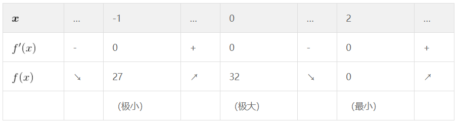
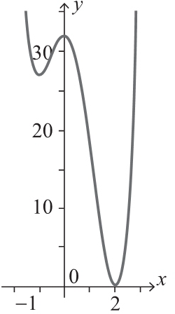
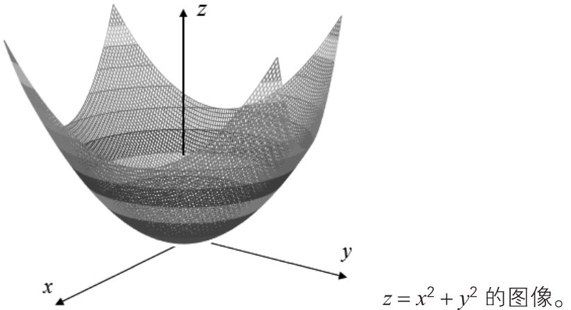
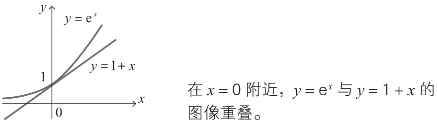
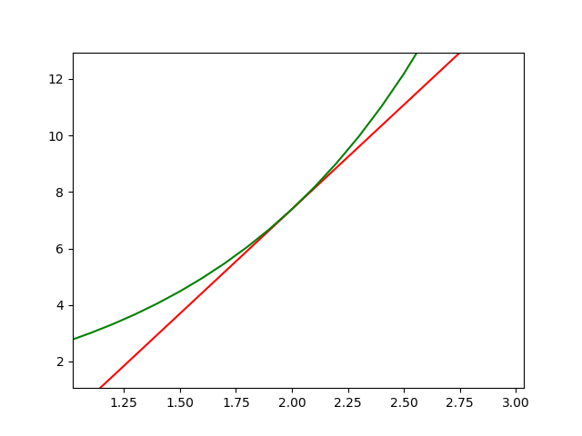
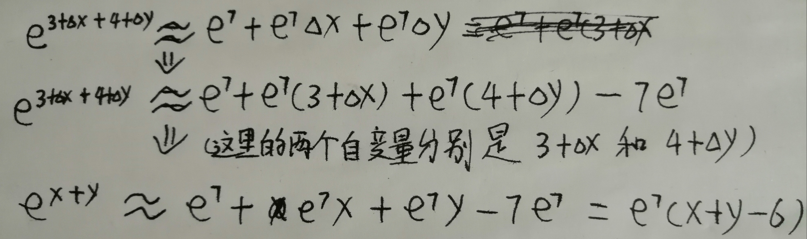

# Derivative


<!-- TOC -->

- [Derivative](#derivative)
    - [思想](#思想)
    - [导数](#导数)
        - [最小值](#最小值)
            - [根据增减表来确定最小值](#根据增减表来确定最小值)
        - [多变量函数链式法则](#多变量函数链式法则)
    - [偏导](#偏导)
        - [多变量函数的最小值条件](#多变量函数的最小值条件)
        - [拉格朗日乘数法](#拉格朗日乘数法)
    - [梯度下降法](#梯度下降法)
        - [导数法求函数的近似公式](#导数法求函数的近似公式)
            - [单变量函数的近似公式](#单变量函数的近似公式)
            - [多变量函数的近似公式](#多变量函数的近似公式)
            - [多变量函数近似公式的推广](#多变量函数近似公式的推广)
            - [近似公式的向量表示](#近似公式的向量表示)
        - [梯度下降法的含义与公式](#梯度下降法的含义与公式)
    - [References](#references)

<!-- /TOC -->


## 思想


## 导数
### 最小值
#### 根据增减表来确定最小值
1. $f'(a)=0$ 是函数 $f(x)$ 在 $x=a$ 处取得最小值的必要条件。
2. 但 $f'(a)=0$ 并不是充分条件，其他几种情况也有可能导数为0.这也导致梯度下降法求最小值时，这个性质有时会成为找到最小值时很大的障碍。
    
3. 尝试使用增减表来找到最小值。
4. 首先对函数 $f(x)=3x^4-4x^3-12x^2+32$ 求导，确定导数为0的点

    $f'(x)=12x^3-12x^2-24x=12x(x+1)(x-2)$
    
    可以看出来，x 在 0、-1 和 2 时，导数为0.  

5. 然后建立增减表，找到最小值
    
6. 从表中可以看出，$f(x)$ 在点 $x=2$ 处取得最小值 0。
7. 如果已知增减表，就可以画出函数图像的大体形状。这里我们使用例题中的增减表，画出函数 $f(x)=3x^4-4x^3-12x^2+32$ 的图像
    

### 多变量函数链式法则
1. 属于多变量微积分的内容，先记住规则
2. 变量 $z$ 为 $u$、$v$ 的函数，如果 $u$、$v$ 分别为 $x$、$y$ 的函数，则 $z$ 为 $x$、$y$ 的函数，此时下式（多变量函数的链式法则）成立。

    $\frac{\partial z}{\partial x}=\frac{\partial z}{\partial u}\frac{\partial u}{\partial x}+\frac{\partial z}{\partial v}\frac{\partial v}{\partial x}$

    $\frac{\partial z}{\partial y}=\frac{\partial z}{\partial u}\frac{\partial u}{\partial y}+\frac{\partial z}{\partial v}\frac{\partial v}{\partial y}$

3. 在三个以上的变量的情况下也同样成立。例如当 $C=u^2+v^2+w^2$，$u=a_1x+b_1y+c_1z$，$v=a_2x+b_2y+c_2z$，$w=a_3x+b_3y+c_3z$（$a_i$、$b_i$、$c_i$ 为常数，$i$=1,2,3）时，

    $\begin{aligned}\frac{\partial C}{\partial x}&=\frac{\partial C}{\partial u}\frac{\partial u}{\partial x}+\frac{\partial C}{\partial v}\frac{\partial v}{\partial x}+\frac{\partial C}{\partial w}\frac{\partial w}{\partial x}\end{aligned}$


## 偏导
### 多变量函数的最小值条件
1. 光滑的单变量函数 $y=f(x)$ 在点 $x$ 处取得最小值的必要条件是导函数在该点取值 0，这个事实对于多变量函数同样适用。
2. 函数 $z=f(x,y)$ 取得最小值的必要条件是 $\frac{\partial f}{\partial x}=0，\frac{\partial f}{\partial y}=0$。　　
3. 例如求函数 $z=x^2+y^2$ 取得最小值时 $x$、$y$ 的值。　
4. 需要求求关于 x、y 的偏导数

    $\frac{\partial z}{\partial x}=2x,~\frac{\partial z}{\partial y}=2y$

5. 因此，函数取得最小值的必要条件是 $x=0$，$y=0$。此时函数值 $z$ 为 0。由于 $z=x^2+y^2\geqslant0$，所以我们知道这个函数值 0 就是最小值。从下面的函数图像也能看出这一点
    

### 拉格朗日乘数法
1. 假设要求解：当 $x^2+y^2=1$ 时，求 $x+y$ 的最小值。
2. 这里是要求解函数 $f(x, y) = x + y$ 的极小值，但是同时要满足 $x^2+y^2=1$
3. 如果没有约束条件 $x^2+y^2=1$，求 $f(x, y) = x + y$ 的极小值只需要直接求 x 和 y 的偏导，但现在有了约束条件。
4. 我们把约束条件看做一个函数 $g(x) = x^2+y^2-1$。
5. 拉格朗日乘数法的规则是，通过引入一个参数 $\lambda$，把 $f(x)$ 和 $g(x)$ 组合为一个函数辅助函数 $\boldsymbol{L}$。
    $L=f(x,y)-\lambda g(x,y)=(x+y)+\lambda(x^2+y^2-1)$
6. 不用关心这个 $\lambda$ 到底是什么，总之就是通过 $\lambda$ 所代表的某种规则，辅助函数 $\boldsymbol{L}$ 同时满足 $f(x)$ 和 $g(x)$。
7. 现在， $\boldsymbol{L}$ 求极值就是满足 $x^2+y^2=1$ 时 $f(x, y) = x + y$ 的极值。
8. 因此现在需要求关于 $x$、$y$ 和 $\lambda$ 的偏导，然后让它们的值同时为0。即

    $\frac{\partial L}{\partial x}=1-2\lambda x=0$

    $\frac{\partial L}{\partial y}=1-2\lambda y=0$
    
    $\frac{\partial L}{\partial \lambda}=x^2 + y^2 - 1 = 0$

9. 解得 $x=y=\pm1/\sqrt{2}$。因而，当 $x=y=-1/\sqrt{2}$  时，$x+y$ 取得最小值 $-\sqrt{2}$。


## 梯度下降法
### 导数法求函数的近似公式
#### 单变量函数的近似公式
1. 根据导数定义，有

    $f'(x)=\lim_{\Delta x\to0}\frac{f(x+\Delta x)-f(x)}{\Delta x}$

2. 在这个定义式中，$\Delta x$ 为“无限小的值”，不过若将它替换为“微小的值”，也不会造成很大的误差。因而，下式近似成立。

    $f'(x)\fallingdotseq\frac{f(x+\Delta x)-f(x)}{\Delta x}$

3. 将上式变形，可以得到以下**单变量函数的近似公式**

    $f(x+\Delta x)\fallingdotseq f(x)+f'(x)\Delta x$　（$\Delta x$ 为微小的数）

4. 看一个例子。当 $f(x)={\rm e}^{x}$ 时，求 $x=0$ 附近的近似公式。
5. 因为 $e^x$ 的导数还是它本身，以及上面的近似公式，可得

    ${\rm e}^{x+\Delta x}\fallingdotseq{\rm e}^{x}+{\rm e}^{x}\Delta x$　（$\Delta x$ 为微小的数）

6. 取 x=0，下式成立

    ${\rm e}^{0+\Delta x}\fallingdotseq{\rm e}^{0}+{\rm e}^{0}\Delta x$

7. 也就是说，对于 $f(x)={\rm e}^{x}$ ，当自变量取一个很接近 0 的值 $0+\Delta x$ 时，上式成立。 
8. 上式的自变量实际上是 $0+\Delta x$。变形一下，

    ${\rm e}^{0+\Delta x}\fallingdotseq{\rm e}^{0}+{\rm e}^{0}\Delta x+0e^0={\rm e}^{0}+(0+\Delta x)e^0$
9. 重新用 $x$ 替换上式的自变量 $0+\Delta x$，得出 

    ${\rm e}^{x}\fallingdotseq 1+x$

10. 下面的图像是将 $y={\rm e}^{x}$ 与 $y=1+x$ 画在一张图上。在 $x=0$ 附近两个函数的图像重叠在一起，由此可以确认 $x=0$ 处的近似公式是正确的
    

10. 再求一下 $x=2$ 附近的近似公式

    ${\rm e}^{2+\Delta x}\fallingdotseq{\rm e}^{2}+{\rm e}^{2}\Delta x$

11. 同样，变形为

    ${\rm e}^{2+\Delta x}\fallingdotseq{\rm e}^{2}+{\rm e}^{2}\Delta x+2e^2-2e^2={\rm e}^{2}+(2+\Delta x)e^2-2e^2$

12. 同样，上式的自变量实际上是 $2+\Delta x$，重新用 $x$ 替换，得出 
    
    ${\rm e}^{x}\fallingdotseq e^2x-e^2$

13. 同样画图验证
    

#### 多变量函数的近似公式
1. 和上面原理相同，可以得出两个自变量的近似公式

    ${\rm e}^{x+\Delta x+y+\Delta y}\fallingdotseq{\rm e}^{x+y}+{\rm e}^{x+y}\Delta x+{\rm e}^{x+y}\Delta y　（\Delta x、\Delta y 为微小的数）$

2. 同样一例，对于函数 $z={\rm e}^{x+y}$ ，求 $x$、$y$ 分别在某个确定值附近的近似公式。
3. 直接 $x=3, y=4$ 为例推导
    
4. 验证一下
    ```py
    import numpy as np

    def foo (x, y):
        return np.exp(x + y)

    def foo00 (x, y):
        return 1 + x + y

    def foo22(x, y):
        return np.exp(4) * (x + y - 3)

    def foo34 (x, y):
        return np.exp(7) * (x + y - 6)


    print( foo(0, 0) )         # 1.0
    print( foo00(0, 0) )       # 1
    print( foo(2, 2) )         # 54.598150033144236
    print( foo22(2, 2) )       # 54.598150033144236
    print( foo(3, 4) )         # 1096.6331584284585
    print( foo34(3, 4) )       # 1096.6331584284585
    print( foo(3, 4.0001) )    # 1096.7428272276497
    print( foo34(3, 4.0001) )  # 1096.7428217443012
    ```

#### 多变量函数近似公式的推广
1. 首先定义如下的 $\Delta z$。

    $\Delta z=f(x+\Delta x,y+\Delta y)-f(x,y)$

2. 所以上面的近似公式可以写成

    $\Delta z\fallingdotseq\frac{\partial z}{\partial x}\Delta x+\frac{\partial z}{\partial y}\Delta y$

3. 通过这样的表示方式，就很容易将近似公式进行推广。例如，变量 $z$ 为三个变量 $w$、$x$、$y$ 的函数时，近似公式如下所示。

    $\Delta z\fallingdotseq\frac{\partial z}{\partial w}\Delta w+\frac{\partial z}{\partial x}\Delta x+\frac{\partial z}{\partial y}\Delta y$

#### 近似公式的向量表示
1. 根据上面多变量函数近似公式的推广，三个变量的函数的近似公式可以表示为如下两个向量的内积 $\nabla z\cdot\Delta x$

    $\nabla z=\left(\frac{\partial z}{\partial w},\frac{\partial z}{\partial x},\frac{\partial z}{\partial y}\right),~\Delta x=(\Delta w,\Delta x,\Delta y)$

2. 我们可以很容易地想象，对于一般的 n 变量函数，近似公式也可以像这样表示为内积的形式。这是梯度下降法会用到的的原理之一。

### 梯度下降法的含义与公式

## References
* [《深度学习的数学》](https://book.douban.com/subject/33414479/)