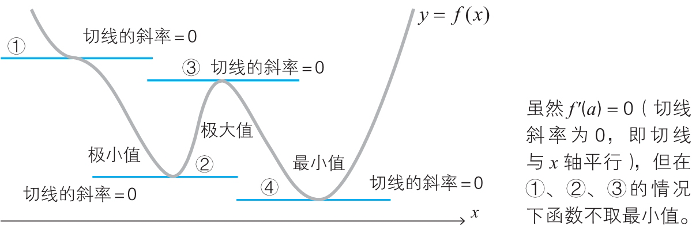

# Derivative

<!-- TOC -->

- [Derivative](#derivative)
    - [思想](#思想)
    - [导数](#导数)
        - [最小值](#最小值)
            - [根据增减表来确定最小值](#根据增减表来确定最小值)
    - [偏导](#偏导)
        - [多变量函数的最小值条件](#多变量函数的最小值条件)
        - [拉格朗日乘数法](#拉格朗日乘数法)
    - [References](#references)

<!-- /TOC -->

## 思想

## 导数
### 最小值
#### 根据增减表来确定最小值
1. $f'(a)=0$ 是函数 $f(x)$ 在 $x=a$ 处取得最小值的必要条件。
2. 但 $f'(a)=0$ 并不是充分条件，其他几种情况也有可能导数为0.这也导致梯度下降法求最小值时，这个性质有时会成为找到最小值时很大的障碍。
    
3. 尝试使用增减表来找到最小值。
4. 首先对函数 $f(x)=3x^4-4x^3-12x^2+32$ 求导，确定导数为0的点

    $f'(x)=12x^3-12x^2-24x=12x(x+1)(x-2)$
    
    可以看出来，x 在 0、-1 和 2 时，导数为0.  

5. 然后建立增减表，找到最小值
    
6. 从表中可以看出，$f(x)$ 在点 $x=2$ 处取得最小值 0。
7. 如果已知增减表，就可以画出函数图像的大体形状。这里我们使用例题中的增减表，画出函数 $f(x)=3x^4-4x^3-12x^2+32$ 的图像
    

## 偏导
### 多变量函数的最小值条件
1. 光滑的单变量函数 $y=f(x)$ 在点 $x$ 处取得最小值的必要条件是导函数在该点取值 0，这个事实对于多变量函数同样适用。
2. 函数 $z=f(x,y)$ 取得最小值的必要条件是 $\frac{\partial f}{\partial x}=0，\frac{\partial f}{\partial y}=0$。　　
3. 例如求函数 $z=x^2+y^2$ 取得最小值时 $x$、$y$ 的值。　
4. 需要求求关于 x、y 的偏导数

    $\frac{\partial z}{\partial x}=2x,~\frac{\partial z}{\partial y}=2y$

5. 因此，函数取得最小值的必要条件是 $x=0$，$y=0$。此时函数值 $z$ 为 0。由于 $z=x^2+y^2\geqslant0$，所以我们知道这个函数值 0 就是最小值。从下面的函数图像也能看出这一点
    

### 拉格朗日乘数法
1. 假设要求解：当 $x^2+y^2=1$ 时，求 $x+y$ 的最小值。
2. 这里是要求解函数 $f(x, y) = x + y$ 的极小值，但是同时要满足 $x^2+y^2=1$
3. 如果没有约束条件 $x^2+y^2=1$，求 $f(x, y) = x + y$ 的极小值只需要直接求 x 和 y 的偏导，但现在有了约束条件。
4. 我们把约束条件看做一个函数 $g(x) = x^2+y^2-1$。
5. 拉格朗日乘数法的规则是，通过引入一个参数 $\lambda$，把 $f(x)$ 和 $g(x)$ 组合为一个函数辅助函数 $\boldsymbol{L}$。
    $L=f(x,y)-\lambda g(x,y)=(x+y)+\lambda(x^2+y^2-1)$
6. 不用关心这个 $\lambda$ 到底是什么，总之就是通过 $\lambda$ 所代表的某种规则，辅助函数 $\boldsymbol{L}$ 同时满足 $f(x)$ 和 $g(x)$。
7. 现在， $\boldsymbol{L}$ 求极值就是满足 $x^2+y^2=1$ 时 $f(x, y) = x + y$ 的极值。
8. 因此现在需要求关于 $x$、$y$ 和 $\lambda$ 的偏导，然后让它们的值同时为0。即

    $\frac{\partial L}{\partial x}=1-2\lambda x=0$

    $\frac{\partial L}{\partial y}=1-2\lambda y=0$
    
    $\frac{\partial L}{\partial \lambda}=x^2 + y^2 - 1 = 0$

9. 解得 $x=y=\pm1/\sqrt{2}$。因而，当 $x=y=-1/\sqrt{2}$  时，$x+y$ 取得最小值 $-\sqrt{2}$。

## References
* [《深度学习的数学》](https://book.douban.com/subject/33414479/)