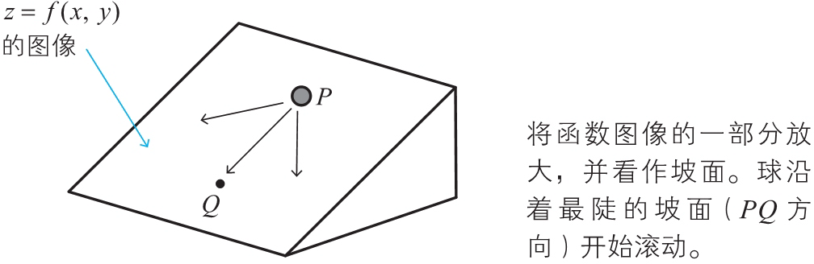
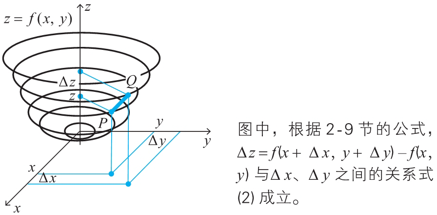
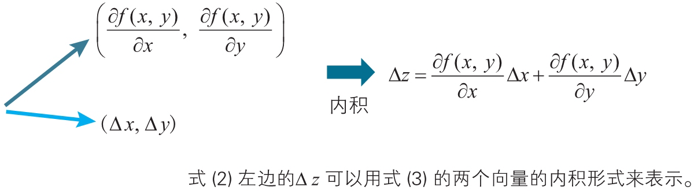
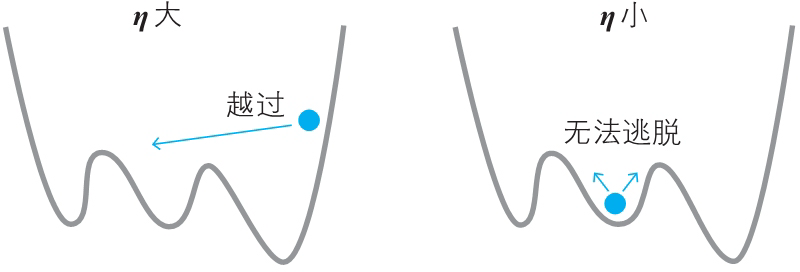

# Gradient Descent


<!-- TOC -->

- [Gradient Descent](#gradient-descent)
    - [0 思想](#0-思想)
    - [1 导数法求函数的近似公式](#1-导数法求函数的近似公式)
        - [1.1 单变量函数的近似公式](#11-单变量函数的近似公式)
        - [1.2 多变量函数的近似公式](#12-多变量函数的近似公式)
        - [1.3 多变量函数近似公式的推广](#13-多变量函数近似公式的推广)
        - [1.4 近似公式的向量表示](#14-近似公式的向量表示)
    - [2 梯度下降法的含义与公式](#2-梯度下降法的含义与公式)
        - [2.1 梯度下降法的思路](#21-梯度下降法的思路)
        - [2.2 用向量表示函数的变化值](#22-用向量表示函数的变化值)
        - [2.3 二变量函数的梯度下降法的基本式](#23-二变量函数的梯度下降法的基本式)
            - [2.3.1 一例](#231-一例)
        - [2.4 梯度下降法及其用法](#24-梯度下降法及其用法)
        - [2.5 将梯度下降法推广到三个变量以上的情况](#25-将梯度下降法推广到三个变量以上的情况)
        - [2.6 哈密顿算子 $\nabla$](#26-哈密顿算子-\nabla)
        - [2.7 $\eta$ 的含义以及梯度下降法的要点](#27-\eta-的含义以及梯度下降法的要点)
    - [References](#references)

<!-- /TOC -->


## 0 思想


## 1 导数法求函数的近似公式
### 1.1 单变量函数的近似公式
1. 根据导数定义，有

    $f'(x)=\lim_{\Delta x\to0}\frac{f(x+\Delta x)-f(x)}{\Delta x}$

2. 在这个定义式中，$\Delta x$ 为 “无限小的值”，不过若将它替换为 “微小的值”，也不会造成很大的误差。因而，下式近似成立。

    $f'(x)\fallingdotseq\frac{f(x+\Delta x)-f(x)}{\Delta x}$

3. 将上式变形，可以得到以下 **单变量函数的近似公式**

    $f(x+\Delta x)\fallingdotseq f(x)+f'(x)\Delta x$　（$\Delta x$ 为微小的数）

4. 看一个例子。当 $f(x)={\rm e}^{x}$ 时，求 $x=0$ 附近的近似公式。
5. 因为 $e^x$ 的导数还是它本身，以及上面的近似公式，可得

    ${\rm e}^{x+\Delta x}\fallingdotseq{\rm e}^{x}+{\rm e}^{x}\Delta x$　（$\Delta x$ 为微小的数）

6. 取 x=0，下式成立

    ${\rm e}^{0+\Delta x}\fallingdotseq{\rm e}^{0}+{\rm e}^{0}\Delta x$

7. 也就是说，对于 $f(x)={\rm e}^{x}$ ，当自变量取一个很接近 0 的值 $0+\Delta x$ 时，上式成立。 
8. 上式的自变量实际上是 $0+\Delta x$。变形一下，

    ${\rm e}^{0+\Delta x}\fallingdotseq{\rm e}^{0}+{\rm e}^{0}\Delta x+0e^0={\rm e}^{0}+(0+\Delta x)e^0$
9. 重新用 $x$ 替换上式的自变量 $0+\Delta x$，得出 

    ${\rm e}^{x}\fallingdotseq 1+x$

10. 下面的图像是将 $y={\rm e}^{x}$ 与 $y=1+x$ 画在一张图上。在 $x=0$ 附近两个函数的图像重叠在一起，由此可以确认 $x=0$ 处的近似公式是正确的
    

10. 再求一下 $x=2$ 附近的近似公式

    ${\rm e}^{2+\Delta x}\fallingdotseq{\rm e}^{2}+{\rm e}^{2}\Delta x$

11. 同样，变形为

    ${\rm e}^{2+\Delta x}\fallingdotseq{\rm e}^{2}+{\rm e}^{2}\Delta x+2e^2-2e^2={\rm e}^{2}+(2+\Delta x)e^2-2e^2$

12. 同样，上式的自变量实际上是 $2+\Delta x$，重新用 $x$ 替换，得出 
    
    ${\rm e}^{x}\fallingdotseq e^2x-e^2$

13. 同样画图验证
    

### 1.2 多变量函数的近似公式
1. 和上面原理相同，可以得出两个自变量的近似公式

    ${\rm e}^{x+\Delta x+y+\Delta y}\fallingdotseq{\rm e}^{x+y}+{\rm e}^{x+y}\Delta x+{\rm e}^{x+y}\Delta y　（\Delta x、\Delta y 为微小的数）$

2. 同样一例，对于函数 $z={\rm e}^{x+y}$ ，求 $x$、$y$ 分别在某个确定值附近的近似公式。
3. 直接 $x=3, y=4$ 为例推导
    
4. 验证一下
    ```py
    import numpy as np

    def foo (x, y):
        return np.exp(x + y)

    def foo00 (x, y):
        return 1 + x + y

    def foo22(x, y):
        return np.exp(4) * (x + y - 3)

    def foo34 (x, y):
        return np.exp(7) * (x + y - 6)


    print( foo(0, 0) )         # 1.0
    print( foo00(0, 0) )       # 1
    print( foo(2, 2) )         # 54.598150033144236
    print( foo22(2, 2) )       # 54.598150033144236
    print( foo(3, 4) )         # 1096.6331584284585
    print( foo34(3, 4) )       # 1096.6331584284585
    print( foo(3, 4.0001) )    # 1096.7428272276497
    print( foo34(3, 4.0001) )  # 1096.7428217443012
    ```

### 1.3 多变量函数近似公式的推广
1. 首先定义如下的 $\Delta z$。

    $\Delta z=f(x+\Delta x,y+\Delta y)-f(x,y)$

2. 所以上面的近似公式可以写成

    $\Delta z\fallingdotseq\frac{\partial z}{\partial x}\Delta x+\frac{\partial z}{\partial y}\Delta y$

3. 通过这样的表示方式，就很容易将近似公式进行推广。例如，变量 $z$ 为三个变量 $w$、$x$、$y$ 的函数时，近似公式如下所示。

    $\Delta z\fallingdotseq\frac{\partial z}{\partial w}\Delta w+\frac{\partial z}{\partial x}\Delta x+\frac{\partial z}{\partial y}\Delta y$

### 1.4 近似公式的向量表示
1. 根据上面多变量函数近似公式的推广，三个变量的函数的近似公式可以表示为如下两个向量的内积 $\nabla z\cdot\Delta x$

    $\nabla z=\left(\frac{\partial z}{\partial w},\frac{\partial z}{\partial x},\frac{\partial z}{\partial y}\right),~\Delta x=(\Delta w,\Delta x,\Delta y)$

2. 我们可以很容易地想象，对于一般的 n 变量函数，近似公式也可以像这样表示为内积的形式。这是梯度下降法会用到的的原理之一。


## 2 梯度下降法的含义与公式
### 2.1 梯度下降法的思路
1. 函数取得最小值的必要条件是各个自变量的偏导都为0。例如 $z=f(x,y)$ 取得最小值的必要条件是 

    $\frac{\partial f(x,y)}{\partial x}=0,~\frac{\partial f(x,y)}{\partial y}=0$

2. 然而，在实际问题中，上面的联立方程式通常不容易求解，那么该如何解决呢？梯度下降法是一种具有代表性的替代方法。该方法不直接求解方程，而是通过慢慢地移动图像上的点进行摸索，从而找出函数的最小值。
3. 这里我们将图像看作斜坡，在斜坡上的点 P 处放一个乒乓球，然后轻轻地松开手，球会沿着最陡的坡面开始滚动，待球稍微前进一点后，把球止住，然后从止住的位置再次松手，乒乓球会从这个点再次沿着最陡的坡面开始滚动。
    
4. 这个操作反复进行若干次后，乒乓球沿着最短的路径到达了图像的底部，也就是函数的最小值点。
5. 这里的重点是，每次移动一点就停住，然后再从静止开始，再移动一点。而不是一次滚动到底部。
6. 可以想象，在任何一个位置，如果从静止开始运动，那就会沿着最陡的路线运动。而一旦运动一小段之后，就有了初速度，“有了惯性”，继续的运动可能就不再是最陡的路线了。
7. TODO 不断减少函数的值就可以寻找最小值，那要按照最陡的方法来减小，是为了更快的找到最小值？

### 2.2 用向量表示函数的变化值
1. 以下关系式成立。

    $\Delta z=\frac{\partial f(x,y)}{\partial x}\Delta x+\frac{\partial f(x,y)}{\partial y}\Delta y$

2. 反映在图像上
    
3. 上面的变化量公式，可以表示为如下两个向量的内积形式

    $\left(\frac{\partial f(x,y)}{\partial x},\frac{\partial f(x,y)}{\partial y}\right),(\Delta x,\Delta y)$

4. 这个内积的关系，这就是梯度下降法的出发点
    
5. 既然函数的变化值是两个向量的内积，而向量内积 $\boldsymbol{a}\cdot\boldsymbol{b}$ 的计算为 $|a||b|cosθ$。可以知道两个向量夹角为 $180°$ 时内积最小，即满足以下关系

    $b=-ka（k 为正的常数）$

### 2.3 二变量函数的梯度下降法的基本式
1. 根据上面的结论，从点 $(x,y)$ 向点 $(x+\Delta x,y+\Delta y)$ 移动时，当满足以下关系式时，函数 $z=f(x,y)$ 减小得最快。这个关系式就是二变量函数的梯度下降法的基本式。

    $(\Delta x,\Delta y)=-\eta\left(\frac{\partial f(x,y)}{\partial x},\frac{\partial f(x,y)}{\partial y}\right)（\eta 为正的微小常数）$

2. 上式右边的向量 $\left(\frac{\partial f(x,y)}{\partial x},\frac{\partial f(x,y)}{\partial y}\right)$ 称为函数 $f(x,y)$ 在点 $(x,y)$ 处的 **梯度**（gradient）。这个名称来自于它给出了最陡的坡度方向。
3. 也就是说，当从点 $(x,y)$ 处移动很小的值时，如果希望这次移动可以使得函数值减小的最多，则移动的值应该为  $-\eta\left(\frac{\partial f(x,y)}{\partial x},\frac{\partial f(x,y)}{\partial y}\right)$ 

#### 2.3.1 一例
1. 设 $\Delta x$、$\Delta y$ 为微小的数。在函数 $z=x^2+y^2$ 中，当 $x$ 从 1 变到 $1+\Delta x$、$y$ 从 2 变到 $2+\Delta y$ 时，求使这个函数减小得最快的向量 $(\Delta x,\Delta y)$。
2. 根据式梯度下降法的基本式，$\Delta x$、$\Delta y$ 需要满足以下关系：

    $(\Delta x,\Delta y)=-\eta(\frac{\partial z}{\partial x},\frac{\partial z}{\partial y})　（\eta 为正的微小常数）$

3. 因为 $\frac{\partial z}{\partial x}=2x$，$\frac{\partial z}{\partial y}=2y$，依题意可知 x=1，y=2，于是得出

    $(\Delta x,\Delta y)=-\eta(2,4)　（\eta 为正的微小常数）$

### 2.4 梯度下降法及其用法
1. 为了弄清梯度下降法的思路，前面我们考察了乒乓球的移动方式。由于在不同的位置最陡坡的方向各不相同，通过反复进行 “一边慢慢地移动位置一边寻找最陡坡” 的操作，最终可以到达函数图像的底部，也就是函数的最小值点。
2. 下山的情形也是一样的。最陡的下坡方向在每个位置各不相同。因此，要想通过最短路径下山，就必须一边慢慢地下坡一边在每个位置寻找最陡的坡度。
3. 在函数的情况下也完全一样。要寻找函数的最小值，可以利用上面的结论，根据当前变量值的偏导找出当前使函数值减小得最快的向量 $(\Delta x,\Delta y)$ 并移动。在移动后到达的点处，再次根据当前新的变量值的偏导计算当前使函数值减小的最快的向量 $(\Delta x,\Delta y)$ 并移动。通过反复进行这样的计算和移动，就可以找到最小值点。
4. 这种寻找函数 $f(x,y)$ 的最小值点的方法称为二变量函数的 **梯度下降法**。
5. 神经网络损失函数对应这里的函数，权重就是损失函数的自变量。为了确定在某一点应该怎样改变权重才能让损失函数的值减小的最小，就要计算该点的梯度，再和一个合适的步长进行内积，得到权重合适的该变量。

### 2.5 将梯度下降法推广到三个变量以上的情况
1. 二变量函数的梯度下降法的基本式可以很容易地推广到三个变量以上的情形。当函数 $f$ 由 $n$ 个自变量 $x_1,x_2,\cdots,x_n$ 构成时，梯度下降法的基本式可以像下面这样进行推广。
2. 设 $\eta$ 为正的微小常数，变量 $x_1,x_2,\cdots,x_n$ 改变为 $x_1+\Delta x_1,x_2+\Delta x_2,\cdots,x_n+\Delta x_n$，当满足以下关系式时，函数 $f$ 减小得最快。

    $(\Delta x_1,\Delta x_2,\cdots,\Delta x_n)=-\eta\left(\frac{\partial f}{\partial x_1},\frac{\partial f}{\partial x_2},\cdots,\frac{\partial f}{\partial x_n}\right)$

3. 这里，以下向量称为函数 $f$ 在点 $(x_1,x_2,\cdots,x_n)$ 处的梯度。

    $\left(\frac{\partial f}{\partial x_1},\frac{\partial f}{\partial x_2},\cdots,\frac{\partial f}{\partial x_n}\right)$

4. 与二变量函数的情况一样，利用这个关系式，如果从点 $(x_1,x_2,\cdots,x_n)$ 向点 $(x_1+\Delta x_1,x_2+\Delta x_2,\cdots,x_n+\Delta x_n)$ 移动，就能够沿着函数减小得最快的方向移动。因此，反复依照上述规则来移动，就能够在 $n$ 维空间中算出坡度最陡的方向，从而找到最小值点。

### 2.6 哈密顿算子 $\nabla$
1. 在实际的神经网络中，主要处理由成千上万个变量构成的函数的最小值。在这种情况下，像那样的梯度写法显得十分冗长。因此我们来考虑更简洁的表示方法。
2. 在数学的世界中，有一个被称为向量分析的领域，其中有一个经常用到的符号 $\nabla$。$\nabla$ 称为 **哈密顿算子**，其定义如下所示

    $\nabla f=\left(\frac{\partial f}{\partial x_1},\frac{\partial f}{\partial x_2},\cdots,\frac{\partial f}{\partial x_n}\right)$

3. 利用这个符号，上面 $n$ 维梯度下降法的基本式可以如下表示

    $(\Delta x_1,\Delta x_2,\cdots,\Delta x_n)=-\eta\nabla f　（\eta 为正的微小常数）$

4. 其中，左边的向量 $(\Delta x_1,\Delta x_2,\cdots,\Delta x_n)$ 称为位移向量，记为 $\Delta x$。

    $\Delta x=(\Delta x_1,\Delta x_2,\cdots,\Delta x_n)$

5. 利用这个位移向量，梯度下降法的基本式可以更简洁地表示为

    $\Delta x=-\eta\nabla f　（\eta 为正的微小常数）$

### 2.7 $\eta$ 的含义以及梯度下降法的要点
1. 到目前为止，$\eta$ 只是简单地表示正的微小常数。而在实际使用计算机进行计算时，如何恰当地确定这个 $\eta$ 是一个大问题。
2. 如果步长较大，那么可能会到达最小值点，也可能会直接跨过了最小值点（左图）。而如果步长较小，则可能会滞留在局部极小值点（右图）
    
3. 在神经网络的世界中，$\eta$ 称为学习率。遗憾的是，它的确定方法没有明确的标准，只能通过反复试验来寻找恰当的值。


## References
* [《深度学习的数学》](https://book.douban.com/subject/33414479/)