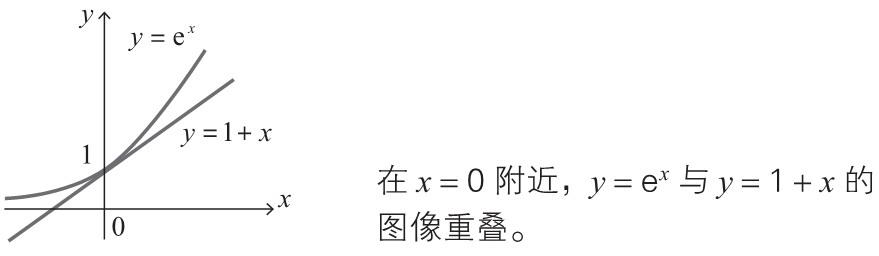
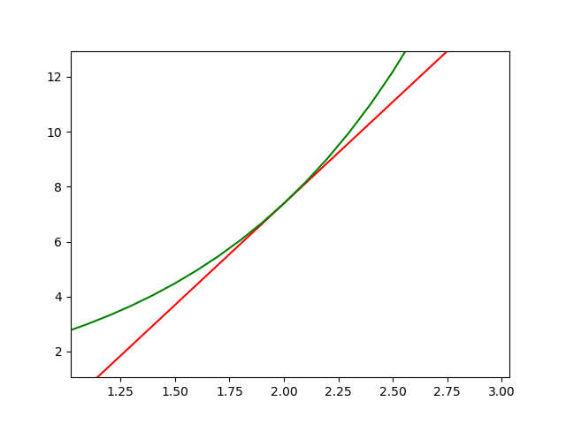

# Gradient Descent


<!-- TOC -->

- [Gradient Descent](#gradient-descent)
    - [0 思想](#0-思想)
    - [1 导数法求函数的近似公式](#1-导数法求函数的近似公式)
        - [1.1 单变量函数的近似公式](#11-单变量函数的近似公式)
            - [1.1.1 定义](#111-定义)
            - [1.1.2 近似公式的本质](#112-近似公式的本质)
            - [1.1.1.2 例1](#1112-例1)
            - [1.1.1.3 例2](#1113-例2)
        - [1.2 多变量函数的近似公式](#12-多变量函数的近似公式)
        - [1.3 多变量函数近似公式的推广](#13-多变量函数近似公式的推广)
        - [1.4 近似公式的向量表示](#14-近似公式的向量表示)
    - [2 梯度下降法的含义与公式](#2-梯度下降法的含义与公式)
        - [2.1 梯度下降法的思路](#21-梯度下降法的思路)
        - [2.2 近似公式和内积的关系](#22-近似公式和内积的关系)
        - [2.3 二变量函数的梯度下降法的基本式](#23-二变量函数的梯度下降法的基本式)
            - [2.3.1 一例](#231-一例)
        - [2.4 梯度下降法及其用法](#24-梯度下降法及其用法)
        - [2.5 将梯度下降法推广到三个变量以上的情况](#25-将梯度下降法推广到三个变量以上的情况)
        - [2.6 哈密顿算子 $\nabla$](#26-哈密顿算子-\nabla)
        - [2.7 $\eta$ 的含义以及梯度下降法的要点](#27-\eta-的含义以及梯度下降法的要点)
    - [References](#references)

<!-- /TOC -->


## 0 思想


## 1 导数法求函数的近似公式
### 1.1 单变量函数的近似公式
#### 1.1.1 定义
1. 根据导数定义，有
    $ \large f'(x)=\lim_{\Delta x\to0}\frac{f(x+\Delta x)-f(x)}{\Delta x}$
2. 在这个定义式中，$\Delta x$ 为 “无限小的值”，不过若将它替换为 “微小的值”，也不会造成很大的误差。因而，下式近似成立。
    $ \large f'(x)\fallingdotseq\frac{f(x+\Delta x)-f(x)}{\Delta x}$
3. 将上式变形，可以得到以下 **单变量函数的近似公式**
    $f(x+\Delta x)\fallingdotseq f(x)+f'(x)\Delta x$　（$\Delta x$ 为微小的数）
4. 这个式子的意思是，当函数 $f$ 的自变量为 $x+\Delta x$ 的时候，此时当前位置附近的一小段函数，可以近似为 $f(x)+f'(x)\Delta x$。
5. 注意，此时函数 $f$ 的自变量不是 $x$，而是 $x+\Delta x$。
6. 注意这里 $x$ 的意义发生了变化：最初的意义就是函数 $f$ 的自变量，但在这个近似公式中，则代表某一个确定的值。注意区分 “自变量” 和 “$x$”。

#### 1.1.2 近似公式的本质
1. 导数是自变量的变化趋近于 0 时，也就是只在一个点是，才是正确的，也就是上面第一步的等式。
2. 但是第二步做了一个近似，近似的认为在一个点周围 $\Delta x$ 的范围内，导数都是一样的。
3. 以平面的函数为例，如果近似的认为在一小段范围内导数都是一样的，也就是近似的认为在这一小段范围内，函数的图像是直线。
4. 既然近似的认为在这一小段范围内导数相同，所以在这小段的范围内，也就近似的认为上面第三步的近似公式是相等的。
5. 也就是说，在这一小段内的原始函数，可以近似的表示为新的函数 
    $f(x+\Delta x)\fallingdotseq f(x)+f'(x)\Delta x$　（$\Delta x$ 为微小的数）
6. 这个新函数的自变量是 $x+\Delta x$，右边是该函数的值。
7. 所以这个近似公式并不是说左边和右边近似，而是说在这一小段范围内，函数 $f(x)$ 可以近似的表示成函数 $f(x+\Delta x)$。
8. 这个函数的自变量 $x+\Delta x$ 看起来有些奇怪，但它确实就是自变量。在现实中，我们可以通过变形，把这个近似函数变得正常一些，同时也会消去引入的 $\Delta x$。


#### 1.1.1.2 例1
1. 当 $f(x)={\rm e}^{x}$ 时，求 $x=0$ 附近的近似公式。
2. 因为 $e^x$ 的导数还是它本身，以及上面的近似公式，可得
    ${\rm e}^{x+\Delta x}\fallingdotseq{\rm e}^{x}+{\rm e}^{x}\Delta x$　（$\Delta x$ 为微小的数）
3. 其实这个式子就已经是函数 $f(x)$ 在 x 附近 $\Delta x$ 范围内的近似公式了，但我们没办法直接用它，因为引入了一个未知的变量 $\Delta x$。
4. 所以需要把此时的 x 值 0 带入，然后变形一下把 $\Delta x$ 消去
    ${\rm e}^{0+\Delta x}\fallingdotseq{\rm e}^{0}+{\rm e}^{0}\Delta x+0e^0={\rm e}^{0}+(0+\Delta x)e^0$
5. 重新用 $x$ 替换上式的自变量 $0+\Delta x$，得出 
    ${\rm e}^{x}\fallingdotseq 1+x$
6. 下面的图像是将 $y={\rm e}^{x}$ 与 $y=1+x$ 画在一张图上。在 $x=0$ 附近两个函数的图像重叠在一起，由此可以确认 $x=0$ 处的近似公式是正确的
    
7. TODO。为什么必须要把具体的 x 的值带入，才能消去 $\Delta x$ 求得具体的近似函数？虽然我想象得到，原函数各处的近似函数不同，所以要求得具体的近似函数，肯定需要明确自变量的值。但是，我如果不通过思考函数，只看第2步的式子，怎么才能知道为啥必须要给 x 一个确定的值才能消去 $\Delta x$？

#### 1.1.1.3 例2 
1. 再求一下 $x=2$ 附近的近似公式
    ${\rm e}^{2+\Delta x}\fallingdotseq{\rm e}^{2}+{\rm e}^{2}\Delta x$
2. 同样，变形为
    ${\rm e}^{2+\Delta x}\fallingdotseq{\rm e}^{2}+{\rm e}^{2}\Delta x+2e^2-2e^2={\rm e}^{2}+(2+\Delta x)e^2-2e^2$
3. 同样，上式的自变量实际上是 $2+\Delta x$，重新用 $x$ 替换，得出 
    ${\rm e}^{x}\fallingdotseq e^2x-e^2$
4. 同样画图验证
    

### 1.2 多变量函数的近似公式
1. 下面我们将单变量函数的近似公式扩展到两个变量的函数
    $f(x+\Delta x,y+\Delta y)\fallingdotseq f(x,y)+\frac{\partial f(x,y)}{\partial x}\Delta x+\frac{\partial f(x,y)}{\partial y}\Delta y$
2. 一例：当 $z={\rm e}^{x+y}$ 时，求 $x=3, y=4$ 附近的近似公式。
3. 和上面方法相同，可以得出两个自变量的近似公式
    $ {\rm e}^{\footnotesize x+\Delta x+y+\Delta y}\fallingdotseq{\rm e}^{x+y}+{\rm e}^{x+y}\Delta x+{\rm e}^{x+y}\Delta y　{\small（\Delta x、\Delta y 为微小的数）}$
4. 带入 $x=3, y=4$
    $
        e^{\footnotesize (3 + \Delta{x}) + (4 + \Delta{y})} \fallingdotseq e^7 + e^7\Delta{x} + e^7\Delta{y} \\
        = e^7 + e^7(3 + \Delta{x}) + e^7(4+\Delta{y}) - 7e^7 \\
        \Downarrow {\footnotesize 此时自变量为 (3 + \Delta{x}) 和 (4 + \Delta{y})，分别替换为 x 和 y} \\
        e^{\footnotesize x + y} \fallingdotseq e^7x + e^7y - 6e^7 = e^7(x + y - 6)
    $
4. 验证一下
    ```py
    import numpy as np

    def foo (x, y):
        return np.exp(x + y)

    def foo00 (x, y):
        return 1 + x + y

    def foo22(x, y):
        return np.exp(4) * (x + y - 3)

    def foo34 (x, y):
        return np.exp(7) * (x + y - 6)


    print( foo(0, 0) )         # 1.0
    print( foo00(0, 0) )       # 1
    print( foo(2, 2) )         # 54.598150033144236
    print( foo22(2, 2) )       # 54.598150033144236
    print( foo(3, 4) )         # 1096.6331584284585
    print( foo34(3, 4) )       # 1096.6331584284585
    print( foo(3, 4.0001) )    # 1096.7428272276497
    print( foo34(3, 4.0001) )  # 1096.7428217443012
    ```

### 1.3 多变量函数近似公式的推广
1. 首先定义如下的 $\Delta z$。
    $\Delta z=f(x+\Delta x,y+\Delta y)-f(x,y)$
2. 所以上面的近似公式可以写成
    $\Delta z\fallingdotseq\frac{\partial z}{\partial x}\Delta x+\frac{\partial z}{\partial y}\Delta y$
3. 通过这样的表示方式，就很容易将近似公式进行推广。例如，变量 $z$ 为三个变量 $w$、$x$、$y$ 的函数时，近似公式如下所示。

    $\Delta z\fallingdotseq\frac{\partial z}{\partial w}\Delta w+\frac{\partial z}{\partial x}\Delta x+\frac{\partial z}{\partial y}\Delta y$

### 1.4 近似公式的向量表示
1. 根据上面多变量函数近似公式的推广，三个变量的函数的近似公式可以表示为如下两个向量的内积 $\nabla z\cdot\Delta x$
    $\nabla z=\left(\frac{\partial z}{\partial w},\frac{\partial z}{\partial x},\frac{\partial z}{\partial y}\right),~\Delta x=(\Delta w,\Delta x,\Delta y)$
2. 我们可以很容易地想象，对于一般的 n 变量函数，近似公式也可以像这样表示为内积的形式。这是梯度下降法会用到的的原理之一。


## 2 梯度下降法的含义与公式
### 2.1 梯度下降法的思路
1. 函数取得最小值的必要条件是各个自变量的偏导都为 0。例如 $z=f(x,y)$ 取得最小值的必要条件是 
    $\Large \frac{\partial f(x,y)}{\partial x}=0,~\frac{\partial f(x,y)}{\partial y}=0$
2. 然而，在实际问题中，上面的联立方程式通常不容易求解，那么该如何解决呢？梯度下降法是一种具有代表性的替代方法。该方法不直接求解方程，而是通过慢慢地移动图像上的点进行摸索，从而找出函数的最小值。
3. 这里我们将图像看作斜坡，在斜坡上的点 P 处放一个乒乓球，然后轻轻地松开手，球会沿着最陡的坡面开始滚动，待球稍微前进一点后，把球止住，然后从止住的位置再次松手，乒乓球会从这个点再次沿着最陡的坡面开始滚动。
    
4. 这个操作反复进行若干次后，乒乓球沿着最短的路径到达了图像的底部，也就是函数的最小值点。
5. 这里的重点是，每次移动一点就停住，然后再从静止开始，再移动一点。而不是一次滚动到底部。
6. 可以想象，在任何一个位置，如果从静止开始运动，那就会沿着最陡的路线运动。而一旦运动一小段之后，就有了初速度，“有了惯性”，继续的运动可能就不再是最陡的路线了。
7. 不断减少函数的值就可以寻找最小值，那要按照最陡的方法来减小，是为了更快的找到最小值？在数值分析领域，梯度下降法也称为 **最速下降法**，从这个名字来看，好像确实是为了更快的找到。

### 2.2 近似公式和内积的关系
1. 函数 $z=f(x,y)$ 中，当 $x$ 改变 $\Delta x$，$y$ 改变 $\Delta y$ 时，我们来考察函数 $f(x,y)$ 的值的变化 $\Delta z$。
2. 当 $\Delta x$、$\Delta y$ 趋向于无穷小是，下面的等式成立
    $\large \Delta z=\frac{\partial f(x,y)}{\partial x}\Delta x+\frac{\partial f(x,y)}{\partial y}\Delta y$
3. 根据近似公式，可以说当 $\Delta x$、$\Delta y$ 取很小的值时，这个关系式也 **近似** 成立。
4. 反映在图像上
    
5. 上式的右边可以表示为如下两个向量的内积形式
    $\Large \left(\frac{\partial f(x,y)}{\partial x},\frac{\partial f(x,y)}{\partial y}\right),{\normalsize (\Delta x,\Delta y)}$
6. 这第一个向量 $\Large \left(\frac{\partial f(x,y)}{\partial x},\frac{\partial f(x,y)}{\partial y}\right)$，就是梯度下降法的 **梯度**。
7. 向量内积 $\vec{a} \cdot \vec{b}$ 的计算为 $|\vec{a}||\vec{b}|cosθ$。可以知道两个向量夹角为 $180°$ 时内积最小，也就是共线且方向相反。即满足以下关系
    $\vec{b}=-k\vec{a} \ {\small (k 为正的常数)}$
    内积的这个性质就是梯度下降法的数学基础。
8. 那么，这里 $k$ 值的大小对内积大小的影响呢？单独看一个 $k$ 是无法判断的，因为它代表的只是两个向量长度的倍数，两个向量长度的乘积还要考虑它们的具体长度。但如果你确定了向量 $\vec{a}$，那么 $k$ 越大则内积越小。

### 2.3 二变量函数的梯度下降法的基本式
1. 从点 $(x,y)$ 向点 $(x+\Delta x,y+\Delta y)$ 移动时，$\Delta z = {\Large \frac{\partial f(x,y)}{\partial x}}\Delta x + {\Large \frac{\partial f(x,y)}{\partial y}}\Delta y = \left({\Large \frac{\partial f(x,y)}{\partial x},\frac{\partial f(x,y)}{\partial y}}\right) \cdot {(\Delta x,\Delta y)}$。
2. 我们希望 $\Delta z$ 尽可能的小（不是它的绝对值小，而是它本身的值小）。根据上面内积的说明，当满足以下关系式时，$\Delta z$ 会最小
    $(\Delta x,\Delta y) = -\eta{\Large \left(\frac{\partial f(x,y)}{\partial x},\frac{\partial f(x,y)}{\partial y}\right)}{\footnotesize（\eta 为正的微小常数）}$
3. 上式右边的向量 $\Large \left(\frac{\partial f(x,y)}{\partial x},\frac{\partial f(x,y)}{\partial y}\right)$ 称为函数 $f(x,y)$ 在点 $(x,y)$ 处的 **梯度**（gradient）。这个名称来自于它给出了最陡的坡度方向。
4. 也就是说，当从点 $(x,y)$ 处移动很小的值时，如果希望这次移动可以使得函数值减小的最多，则移动的值应该为  $-\eta\left({\Large \frac{\partial f(x,y)}{\partial x},\frac{\partial f(x,y)}{\partial y}}\right)$ 
5. 如果只看这个这个算式，那为了让函数值尽量减小，那么 $\eta$ 应该尽量的大。但是要注意，这个算式是从上面的那个近似公式得来的，也就是说，它只有在当前自变量值的附近才是可用的。所以，如果 $\eta$ 变得过大，那就是 $\Delta x$ 和 $\Delta y$ 变得过大了，就超过了近似公式的适用范围。

#### 2.3.1 一例
1. 设 $\Delta x$、$\Delta y$ 为微小的数。在函数 $z=x^2+y^2$ 中，当 $x$ 从 1 变到 $1+\Delta x$、$y$ 从 2 变到 $2+\Delta y$ 时，求使这个函数减小得最快的向量 $(\Delta x,\Delta y)$。
2. 根据梯度下降法的基本式，$\Delta x$、$\Delta y$ 需要满足以下关系：
    $(\Delta x,\Delta y)=-\eta{\Large (\frac{\partial z}{\partial x},\frac{\partial z}{\partial y})}　{\footnotesize（\eta 为正的微小常数）}$
3. 因为 ${\Large \frac{\partial z}{\partial x}} = 2x$，${\Large \frac{\partial z}{\partial y}} = 2y$，依题意可知 $x=1$，$y=2$，于是得出
    $(\Delta x,\Delta y)=-\eta(2,4)　{\footnotesize（（\eta 为正的微小常数）}$

### 2.4 梯度下降法及其用法
1. 为了弄清梯度下降法的思路，前面我们考察了乒乓球的移动方式。由于在不同的位置最陡坡的方向各不相同，通过反复进行 “一边慢慢地移动位置一边寻找最陡坡” 的操作，最终可以到达函数图像的底部，也就是函数的最小值点。
2. 下山的情形也是一样的。最陡的下坡方向在每个位置各不相同。因此，要想通过最短路径下山，就必须一边慢慢地下坡一边在每个位置寻找最陡的坡度。
3. 在函数的情况下也完全一样。要寻找函数的最小值，可以利用上面的结论，根据当前变量值的偏导找出当前使函数值减小得最快的向量 $(\Delta x,\Delta y)$ 并移动。在移动后到达的点处，再次根据当前新的变量值的偏导计算当前使函数值减小的最快的向量 $(\Delta x,\Delta y)$ 并移动。通过反复进行这样的计算和移动，就可以找到最小值点。
4. 这种寻找函数 $f(x,y)$ 的最小值点的方法称为二变量函数的 **梯度下降法**。
5. 神经网络损失函数对应这里的函数，权重就是损失函数的自变量。为了确定在某一点应该怎样改变权重才能让损失函数的值减小的最小，就要计算该点的梯度，再和一个合适的步长进行内积，得到权重合适的该变量。

### 2.5 将梯度下降法推广到三个变量以上的情况
1. 二变量函数的梯度下降法的基本式可以很容易地推广到三个变量以上的情形。当函数 $f$ 由 $n$ 个自变量 $x_1,x_2,\cdots,x_n$ 构成时，梯度下降法的基本式可以像下面这样进行推广。
2. 设 $\eta$ 为正的微小常数，变量 $x_1,x_2,\cdots,x_n$ 改变为 $x_1+\Delta x_1,x_2+\Delta x_2,\cdots,x_n+\Delta x_n$，当满足以下关系式时，函数 $f$ 减小得最快。

    $(\Delta x_1,\Delta x_2,\cdots,\Delta x_n)=-\eta\left(\frac{\partial f}{\partial x_1},\frac{\partial f}{\partial x_2},\cdots,\frac{\partial f}{\partial x_n}\right)$

3. 这里，以下向量称为函数 $f$ 在点 $(x_1,x_2,\cdots,x_n)$ 处的梯度。

    $\left(\frac{\partial f}{\partial x_1},\frac{\partial f}{\partial x_2},\cdots,\frac{\partial f}{\partial x_n}\right)$

4. 与二变量函数的情况一样，利用这个关系式，如果从点 $(x_1,x_2,\cdots,x_n)$ 向点 $(x_1+\Delta x_1,x_2+\Delta x_2,\cdots,x_n+\Delta x_n)$ 移动，就能够沿着函数减小得最快的方向移动。
5. 因此，反复依照上述规则来移动，就能够在 $n$ 维空间中算出坡度最陡的方向，从而找到最小值点。

### 2.6 哈密顿算子 $\nabla$
1. 在实际的神经网络中，主要处理由成千上万个变量构成的函数的最小值。在这种情况下，像上面那样的梯度写法显得十分冗长。因此我们来考虑更简洁的表示方法。
2. 在数学的世界中，有一个被称为向量分析的领域，其中有一个经常用到的符号 $\nabla$，被称为 **哈密顿算子**，其定义如下所示
    $\nabla f=\left(\frac{\partial f}{\partial x_1},\frac{\partial f}{\partial x_2},\cdots,\frac{\partial f}{\partial x_n}\right)$
3. 利用这个符号，上面 $n$ 维梯度下降法的基本式可以如下表示
    $(\Delta x_1,\Delta x_2,\cdots,\Delta x_n)=-\eta\nabla f　{\footnotesize（\eta 为正的微小常数）}$
4. 其中，左边的向量 $(\Delta x_1,\Delta x_2,\cdots,\Delta x_n)$ 称为位移向量，记为 $\Delta x$。
    $\Delta x=(\Delta x_1,\Delta x_2,\cdots,\Delta x_n)$
5. 利用这个位移向量，梯度下降法的基本式可以更简洁地表示为
    $\Delta x=-\eta\nabla f　{\footnotesize（\eta 为正的微小常数）}$

### 2.7 $\eta$ 的含义以及梯度下降法的要点
1. $\eta$ 越大，自变量的变化就越大。但并不代表
2. 到目前为止，$\eta$ 只是简单地表示正的微小常数。而在实际使用计算机进行计算时，如何恰当地确定这个 $\eta$ 是一个大问题。
3. 如果步长较大，那么可能会到达最小值点，也可能会直接跨过了最小值点（左图）。而如果步长较小，则可能会滞留在局部极小值点（右图）
    
4. 上面说 $\eta$ 过大时，就超过了近似公式的适用范围。看上图左侧的情况，在蓝点的初始位置，它的近似公式会表明，如果沿着 x 方向向左运动，则 y 值就会减小。但这个公式显然只是使用在蓝点所在附近的那条线上，如果 x 方向移动范围超过了最后边的波谷，那刚才的那个近似公式就不成立了。
5. 在神经网络的世界中，$\eta$ 称为学习率。遗憾的是，它的确定方法没有明确的标准，只能通过反复试验来寻找恰当的值。


## References
* [《深度学习的数学》](https://book.douban.com/subject/33414479/)