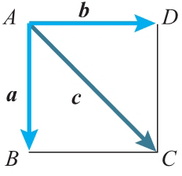
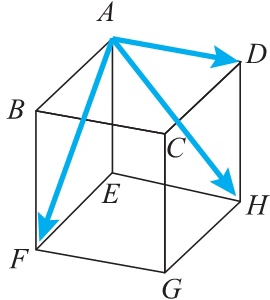
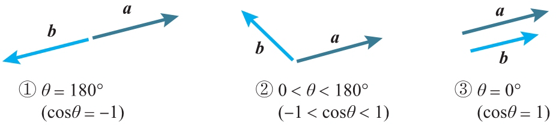
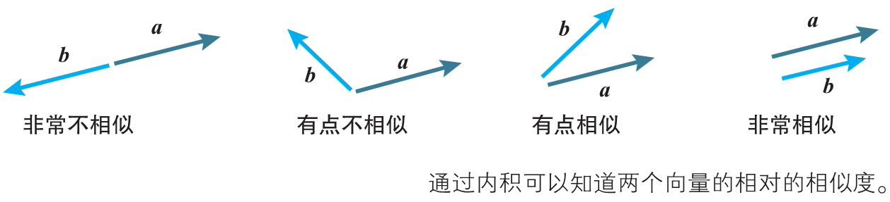

# Vector

<!-- TOC -->

- [Vector](#vector)
    - [思想](#思想)
    - [1. 向量的内积](#1-向量的内积)
        - [1.1 定义](#11-定义)
        - [1.2 柯西 - 施瓦茨不等式](#12-柯西---施瓦茨不等式)
        - [1.3 内积的坐标表示](#13-内积的坐标表示)
    - [References](#references)

<!-- /TOC -->

## 思想

## 1. 向量的内积
### 1.1 定义
1. 两个向量 $\boldsymbol{a}$、$\boldsymbol{b}$ 的内积 $\boldsymbol{a}\cdot\boldsymbol{b}$ 的定义如下所示

    $\boldsymbol{a}\cdot\boldsymbol{b}=|\boldsymbol{a}||\boldsymbol{b}|\cos\theta　（\theta 为 \boldsymbol{a}、\boldsymbol{b} 的夹角）$

2. 考虑边长为 1 的正方形 ABCD，
    

    $\begin{aligned}&\boldsymbol{a}\cdot\boldsymbol{a}=|\boldsymbol{a}||\boldsymbol{a}|\cos0\degree=|\boldsymbol{a}|^2=1^2=1\\&\boldsymbol{a}\cdot\boldsymbol{b}=|\boldsymbol{a}||\boldsymbol{b}|\cos90\degree=1\cdot1\cdot0=0\\&\boldsymbol{a}\cdot\boldsymbol{c}=|\boldsymbol{a}||\boldsymbol{c}|\cos45\degree=1\cdot\sqrt{2}\cdot\frac{1}{\sqrt{2}}=1\\&\boldsymbol{b}\cdot\boldsymbol{c}=|\boldsymbol{b}||\boldsymbol{c}|\cos45\degree=1\cdot\sqrt{2}\cdot\frac{1}{\sqrt{2}}=1\end{aligned}$

3. 在边长为 3 的立方体 ABCD-EFGH 中，
    

    $\begin{aligned}&\overrightarrow{\boldsymbol{AD}}\cdot\overrightarrow{\boldsymbol{AD}}=|\overrightarrow{\boldsymbol{AD}}||\overrightarrow{\boldsymbol{AD}}|\cos0\degree=3\cdot3\cdot1=9\\&\overrightarrow{\boldsymbol{AD}}\cdot\overrightarrow{\boldsymbol{AF}}=|\overrightarrow{\boldsymbol{AD}}||\overrightarrow{\boldsymbol{AF}}|\cos90\degree=3\cdot3\sqrt{2}\cdot0=0\\&\overrightarrow{\boldsymbol{AF}}\cdot\overrightarrow{\boldsymbol{AH}}=|\overrightarrow{\boldsymbol{AF}}||\overrightarrow{\boldsymbol{AH}}|\cos60\degree=3\sqrt{2}\cdot3\sqrt{2}\cdot\frac{1}{2}=9\end{aligned}$

### 1.2 柯西 - 施瓦茨不等式
1. $-|\boldsymbol{a}||\boldsymbol{b}|\leqslant\boldsymbol{a}\cdot\boldsymbol{b}\leqslant|\boldsymbol{a}||\boldsymbol{b}|$
2. 们通过图形来考察该不等式的性质
    
    1. 当两个向量方向相反时，内积取得最小值。
    2. 当两个向量不平行时，内积取平行时的中间值。
    3. 当两个向量方向相同时，内积取得最大值。
3. 性质1就是**梯度下降法**的基本原理。
4. 另外，可以认为内积表示两个向量在多大程度上指向相同方向。在考察**卷积神经网络**时，这个观点就变得十分重要
    

### 1.3 内积的坐标表示
1. 二维空间下，

    当 $\boldsymbol{a}=(a_1,a_2)$，$\boldsymbol{b}=(b_1,b_2)$ 时，$\boldsymbol{a}\cdot\boldsymbol{b}=a_1b_1+a_2b_2$

2. 在三维空间的情况下，内积的坐标表示只是在平面情况下添加了 z 分量：
    
    当 $\boldsymbol{a}=(a_1,a_2,a_3)$，$\boldsymbol{b}=(b_1,b_2,b_3)$ 时，$\boldsymbol{a}\cdot\boldsymbol{b}=a_1b_1+a_2b_2+a_3b_3$
    
    
## References
* [《深度学习的数学》](https://book.douban.com/subject/33414479/)

