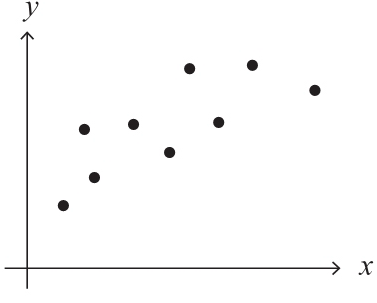
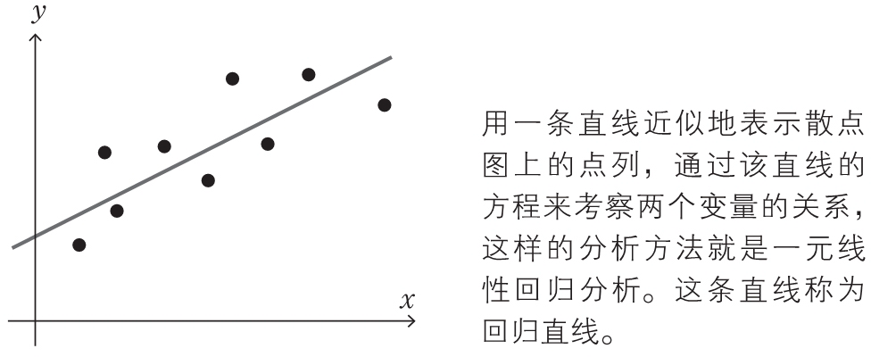
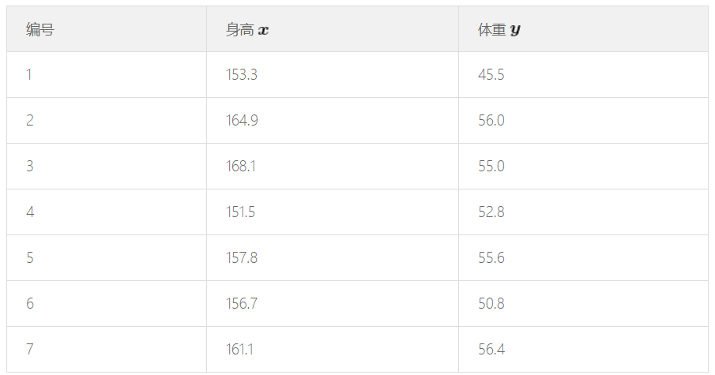
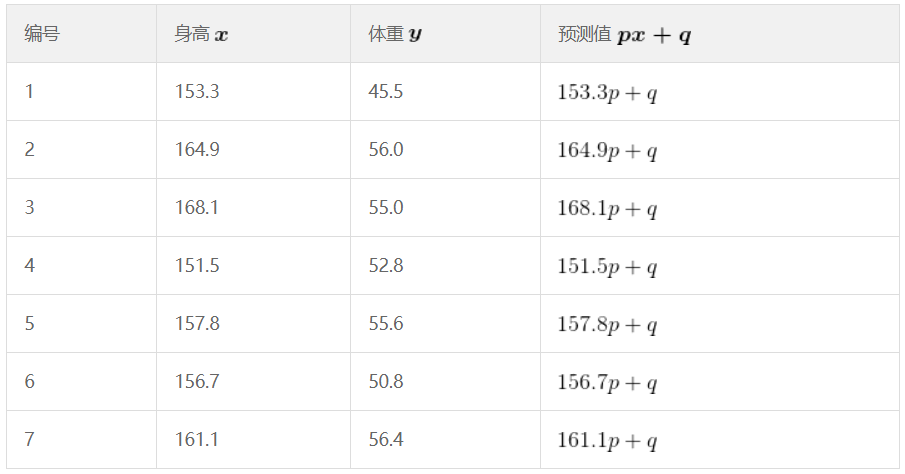
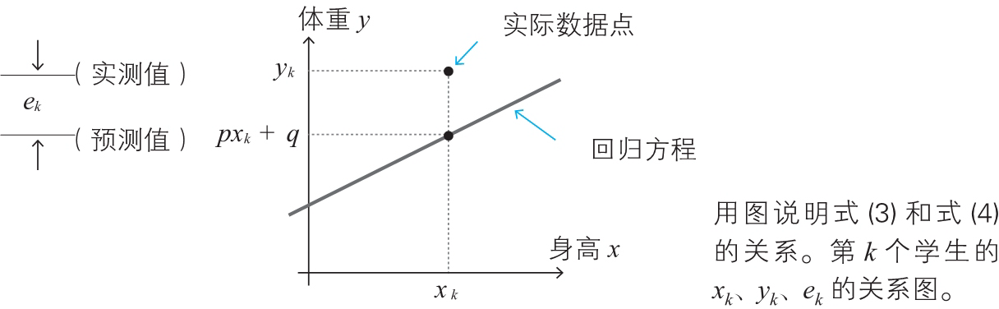
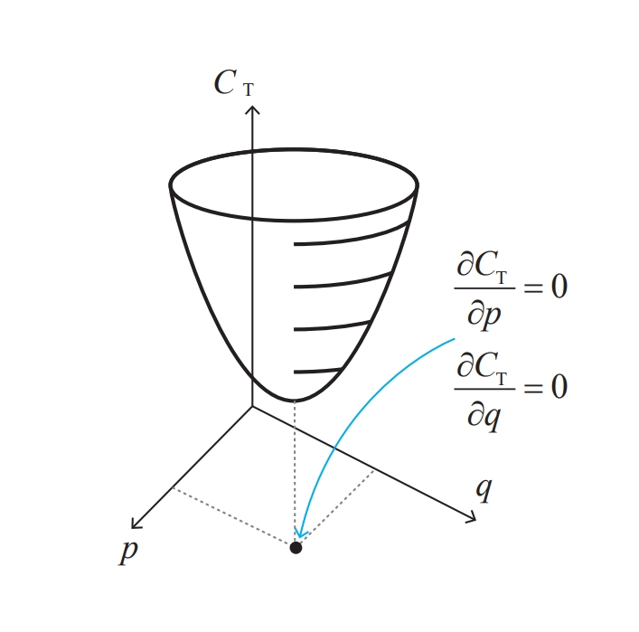
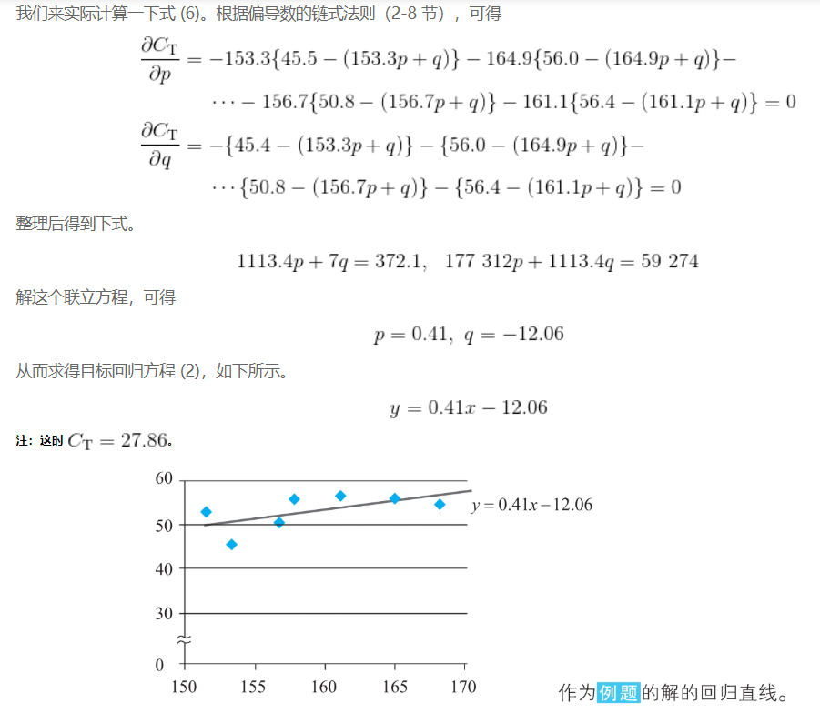
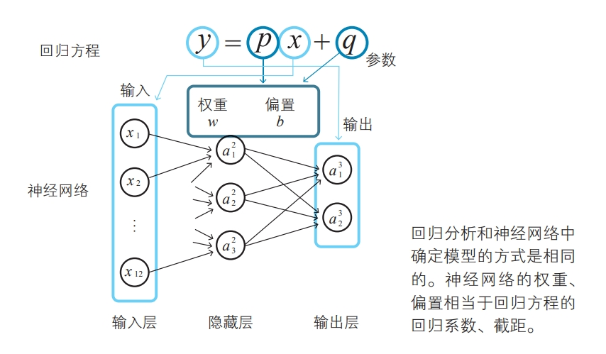

# Regression Analysis

## 最优化问题
1. 在为了分析数据而建立数学模型时，通常模型是由参数确定的。在数学世界中，最优化问题就是如何确定这些参数。
2. 从数学上来说，确定神经网络的参数是一个最优化问题，具体就是对神经网络的参数（即权重和偏置）进行拟合，使得神经网络的输出与实际数据相吻合。
3. 也就是说，找到一组模型的参数值，使得模型在使用这些参数是，对输入数据的处理得到的结果和实际数据的误差最小。
4. 为了理解最优化问题，最浅显的例子就是回归分析。

## 什么是回归分析
1. 由多个变量组成的数据中，着眼于其中一个特定的变量，用其余的变量来解释这个特定的变量，这样的方法称为回归分析。
2. 看一下最简单的一元线性回归分析。一元线性回归分析是以两个变量组成的数据为考察对象的，下图给出了一系列的 $x$、$y$ 的数据以及它们的散点图
    
3. 我们可以看出来这些数据大致呈现线性分布。（不过现实中也有很多数据并不能直接看出分布规律）
4. 那么，我们如果能构建出一个线性方程，让它的图像尽可能的拟合这些数据的分布，就像下图这样
    
5. 这条近似地表示点列的直线称为 **回归直线**。它对应的方程就是 **回归方程**，表示为如下：
    $\large y=px+q　（p、q 为常数)$
6. $x$、$y$ 是为了将构成数据的各个值代入而设定的变量，对应一个个的数据点。常数 $p$、$q$ 是这个回归分析模型的参数，由给出的数据来决定。$p$ 称为 **回归系数**，$q$ 称为 **截距**。
7. 回归分析就是要确定方程的 $p$、$q$ 。

## 一元线性回归一例
1. 根据这些数据，求以体重 $y$ 为因变量、身高 $x$ 为自变量的回归方程 $y=px+q$ （$p$、$q$ 为常数）。
    
2. 将第 $k$ 个学生的身高记为 $x_k$，体重记为 $y_k$，可以求得第 $k$ 个学生的回归分析预测的值（称为预测值）
    
3. 如下图所示，可以计算出某个实际的体重值 $y_k$ 和预测值的差距 $e_k=y_k-(px_k+q)$ 
    
4. 这里我们使用 **平方误差** $C_k$ 来计算差距
    $\large C_k=\frac{1}{2}(e_k)^2=\frac{1}{2}(y_k-(px_k+q))^2$
5. 遍历全体数据，将它们的平方误差加起来，假设得到的值为 $C_{{\rm T}}$
    $C_{{\rm T}}=C_1+C_2+\cdots+C_7$
6. 带入实际的数据
    $\begin{aligned}C_{{\rm T}}=&\frac{1}{2}(45.5-(153.3p+q))^2+\frac{1}{2}(56.0-(164.9p+q))^2\\&+\cdots+\frac{1}{2}(50.8-(156.7p+q))^2-\frac{1}{2}(56.4-(161.1p+q))^2\end{aligned}$
7. $C_{{\rm T}}$ 可以理解为回归方程和实际数据的整体误差，我们要使得这个误差尽可能的小，也就是要求 $C_{{\rm T}}$ 的最小值。
8. $C_{{\rm T}}$是一个二元函数，求它的最小值，我们可以通过求它导数为0时的变量值来确定。即
    $\large \frac{\partial C_{{\rm T}}}{\partial p}=0,~\frac{\partial C_{{\rm T}}}{\partial q}=0$
    
9. 根据两个函数的积的导数、链式法则以及多变量函数的链式法则计算导数
    
10. 可以看出来，这一过程的本质实际上就是神经网络确定最优参数和偏置的过程。
    

## References
* [《深度学习的数学》](https://book.douban.com/subject/26899701/) 2-12、3-4