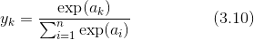
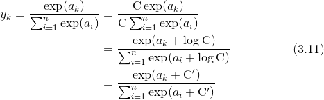

# Basic


## 从感知机到神经网络
### 神经网络概念
1. 用图来表示神经网络的话，如下图所示。
    
2. 我们把最左边的一列称为输入层，最右边的一列称为输出层，中间的一列称为中间层。中间层有时也称为隐藏层。

### 用函数来表示感知机
1. 感知机可以使用如下函数`h`来表示
    ```
    y = h(b + w1x1 + w2x2)
    ```
2. 图示如下
    
3. 输入值结合参数共同的计算结果，作为函数`h`的参数。函数`h`内部会计算参数的值：如果小于等于0，函数返回0；否则返回1
    
### 感知机用到的激活函数
1. 刚才登场的`h（x）`函数会将输入信号的总和转换为输出信号，这种函数一般称为激活函数（activation function）。激活函数的作用在于决定如何来激活输入信号的总和。
2. 下图明确的显示了激活函数的计算过程
    
3. `b + w1x1 + w2x2`的计算结果得到神经元`a`，神经元`a`作为参数传给激活函数`h`，`h`计算并输入为神经元`y`。


## 激活函数
### 阶跃函数
1. 激活函数以阈值为界，一旦输入超过阈值，就切换输出。这样的函数称为“阶跃函数”。
2. 因此，可以说感知机中使用了阶跃函数作为激活函数。
3. 下面就是感知机用到的阶跃函数
    ```py
    def step_function(x):
        if x > 0:
            return 1
        else:
            return 0
    ```
4. 改造一下，并使用 numpy，使它支持数组参数
    ```py
    import numpy as np
    def step_function(x):
        y = x > 0
        return y.astype(np.int)
    
    arr = np.array([-1, 0, 1])
    step_function(arr)  # [0 0 1]
    ```
5. 根据 NumPy 的广播功能，如果在标量和 NumPy 数组之间进行运算，则标量会和 NumPy 数组的各个元素进行运算。改造后的函数在传入单个数字时，`y`会是布尔值，通过转型函数转为整数，就会是 1 或 0；如果传入数组，以上面的`arr`为例，`y`的值会是`[False, False, True]`，最后转为期望的整数结果。
6. 打印阶跃函数的图形
    ```py
    import numpy as np
    import matplotlib.pylab as plt

    def step_function(x):
        return np.array(x > 0, dtype=np.int)

    x = np.arange(-5.0, 5.0, 0.1)
    y = step_function(x)
    plt.plot(x, y)
    plt.ylim(-0.1, 1.1)  # 指定y轴的范围
    plt.show()
    ```
    

### sigmoid 函数
1. 如果将激活函数从阶跃函数换成其他函数，就可以进入神经网络的世界了。神经网络中经常使用的一个激活函数就是如下的 sigmoid 函数（sigmoid function）。
        
2. 神经网络中用 sigmoid 函数作为激活函数，进行信号的转换，转换后的信号被传送给下一个神经元。实际上，上一章介绍的感知机和接下来要介绍的神经网络的主要区别就在于这个激活函数。其他方面，比如神经元的多层连接的构造、信号的传递方法等，基本上和感知机是一样的。
3. 用 Python 可以像下面这样写出 sigmoid 函数
    ```py
    def sigmoid(x):
        return 1 / (1 + np.exp(-x))
    ```
4. 打印 sygmoid 函数的图形
    ```py
    import numpy as np
    import matplotlib.pylab as plt

    def sigmoid(x):
        return 1 / (1 + np.exp(-x))

    x = np.arange(-5.0, 5.0, 0.1)
    y = sigmoid(x)
    plt.plot(x, y)
    plt.ylim(-0.1, 1.1)  # 指定y轴的范围
    plt.show()
    ```
    

### sigmoid 函数和阶跃函数的比较


1. 平滑性不同：输出是否随着输入发生连续性的变化。
2. 输出值不同：相对于阶跃函数只能返回 0 或 1，sigmoid 函数可以返回 0.731 ...、0.880 ... 等实数。也就是说，感知机中神经元之间流动的是 0 或 1 的二元信号，而神经网络中流动的是连续的实数值信号。
3. 两者的结构均是“输入小时，输出接近 0；随着输入增大，输出接近 1 ”。也就是说，当输入信号为重要信息时，阶跃函数和 sigmoid 函数都会输出较大的值；当输入信号为不重要的信息时，两者都输出较小的值。
4. 还有一个共同点是，不管输入信号有多小，或者有多大，输出信号的值都在 0 到 1 之间。

###　ReLU（Rectified Linear Unit）函数
 ReLU 函数在输入大于 0 时，直接输出该值；在输入小于等于 0 时，输出 0
```py
def relu(x):
    return np.maximum(0, x)
```


## 矩阵乘法与神经网络的内积运算
1.  矩阵乘法 **A** x **B** 要求 **A** 的列数必须要等于 **B** 的行数。
2. 一维数组和多维数组相乘是，看起来比较灵活：如果 **A** 是一维数组，则它会被当做单行；如果 **B** 是一维数组，则它会被当做单行。这样都可以和另一个数组进行矩阵乘法。
2. 神经网络的内积计算，正好可以使用矩阵乘法

    1. 在上面的神经网络中，输入为矩阵 **X** `[x1, x2]`，输出为`[x1*1+x2*2, x1*3+x2*4, x1*5+x2*6, ]`。
    2. 如果将权重表示为矩阵 **W** `[[1, 3, 5], [2, 4, 6]]`，则该神经网络的计算结果正好就是 **X** 和 **W** 的乘积。
4. 假设输入是`[1, 2]`，则使用矩阵乘法可以很容易的算出输出：
    ```py
    X = np.array([1, 2])
    W = np.array([[1, 3, 5], [2, 4, 6]])
    Y = np.dot(X, W)
    print(Y)  # [ 5 11 17]
    ```
5. 使用 `np.dot`，可以一次性计算出 **Y** 的结果。这意味着，即便 **Y** 的元素个数为 100 或 1000，也可以通过一次运算就计算出结果。如果不使用 `np.dot`，就必须对输入和权重进行循环的相乘相加，非常麻烦。


## 3 层神经网络的实现
1. 实现如下的三层结构神经网络
    
2. 最后一层的输出层所用的激活函数，要根据求解问题的性质决定。一般地，回归问题可以使用恒等函数，二元分类问题可以使用 sigmoid 函数，多元分类问题可以使用 softmax 函数。本例中输出层的激活函数使用恒等函数，恒等函数会将输入按原样输出，因此，这个例子中没有必要特意定义`identity_function()`，这里这样实现只是为了和之前的流程保持统一。
3. 代码实现
```py
import numpy as np
import matplotlib.pylab as plt


def sigmoid(x):
    return 1 / (1 + np.exp(-x))

# 恒等函数
def identity_function(x):
    return x

# 设置权重和偏置，定义神经网络
def init_network():
    network = {}
    # 三层的权重和偏置
    network['W1'] = np.array([[0.1, 0.3, 0.5], [0.2, 0.4, 0.6]])
    network['b1'] = np.array([0.1, 0.2, 0.3])
    network['W2'] = np.array([[0.1, 0.4], [0.2, 0.5], [0.3, 0.6]])
    network['b2'] = np.array([0.1, 0.2])
    network['W3'] = np.array([[0.1, 0.3], [0.2, 0.4]])
    network['b3'] = np.array([0.1, 0.2])

    return network

# 将输入信号转换为输出信号
def forward(network, x):
    W1, W2, W3 = network['W1'], network['W2'], network['W3']
    b1, b2, b3 = network['b1'], network['b2'], network['b3']

    # 每一层输入的加权和经过激活函数转换后，输出作为下一层的输入
    a1 = np.dot(x, W1) + b1
    z1 = sigmoid(a1)
    a2 = np.dot(z1, W2) + b2
    z2 = sigmoid(a2)
    a3 = np.dot(z2, W3) + b3
    y = identity_function(a3)

    return y


network = init_network()
x = np.array([1.0, 0.5])
y = forward(network, x)
print(y)  # [ 0.31682708 0.69627909]
```


## 输出层的设计
1. 神经网络可以用在分类问题和回归问题上，不过需要根据情况改变输出层的激活函数。一般而言，回归问题用恒等函数，分类问题用 softmax 函数。
2. 机器学习的问题大致可以分为分类问题和回归问题。分类问题是数据属于哪一个类别的问题。比如，区分图像中的人是男性还是女性的问题就是分类问题。而回归问题是根据某个输入预测一个（连续的）数值的问题。比如，根据一个人的图像预测这个人的体重的问题就是回归问题。

### 恒等函数和 softmax 函数
1. 图示（输出层的激活函数用 `σ()` 表示）
    
2. softmax 函数可以用下面的式（3.10）表示
    
3. 假设输出层共有 n 个神经元，softmax 函数计算第 k 个神经元的输出。可以看到，每个神经元的输出值都要除以每个自然底数加权和次方的总和。代码如下
    ```py

    def softmax(a):
        exp_a = np.exp(a)
        sum_exp_a = np.sum(exp_a)
        y = exp_a / sum_exp_a

    return y


    a = np.array([0.3, 2.9, 4.0])
    print(softmax(a)) # [0.01821127 0.24519181 0.73659691]
    ```

### 防止 softmax 函数溢出
1. 上面的 `softmax` 函数的实现虽然正确描述了式（3.10），但在计算机的运算上有一定的缺陷。这个缺陷就是溢出问题。softmax 函数的实现中要进行指数函数的运算，但是此时指数函数的值很容易变得非常大
    ```py
    a = np.array([1010, 1000, 990])
    print(softmax(a))  # [nan nan nan]
    ```
2. softmax 函数的实现可以像式（3.11）这样进行改进
    
3. 式（3.11）在分子和分母上都乘上 C 这个任意的常数。然后，把这个 C 移动到指数函数（exp）中，记为 log C（其实就是lnC，以e为底的对数）。最后，把 log C 替换为另一个符号 C'。
4. 式（3.11）说明，在进行 softmax 的指数函数的运算时，加上（或者减去）某个常数并不会改变运算的结果。这里的 C' 可以使用任何值，但是为了防止溢出，一般会使用输入信号中的最大值
    ```py
    def softmax(a):
        c = np.max(a)
        exp_a = np.exp(a - c)
        sum_exp_a = np.sum(exp_a)
        y = exp_a / sum_exp_a

        return y


    a = np.array([1010, 1000, 990])
    print(softmax(a))  # [9.99954600e-01 4.53978686e-05 2.06106005e-09]
    ```

### softmax 函数的特征
#### 反映概率
1. 使用 softmax() 函数，可以按如下方式计算神经网络的输出。
    ```py
    >>> a = np.array([0.3, 2.9, 4.0])
    >>> y = softmax(a)
    >>> print(y)
    [ 0.01821127  0.24519181  0.73659691]
    >>> np.sum(y)
    1.0
    ```
2. 如上所示，softmax 函数的输出是 0.0 到 1.0 之间的实数。并且，softmax 函数的输出值的总和是 1。输出总和为 1 是 softmax 函数的一个重要性质。正因为有了这个性质，我们才可以把 softmax 函数的输出解释为“概率”。
3. 比如，上面的例子可以解释成 `y[0]` 的概率是 0.018（1.8 %），`y[1]` 的概率是 0.245（24.5 %），`y[2]` 的概率是 0.737（73.7 %）。也就是说，通过使用 softmax 函数，我们可以用概率的（统计的）方法处理问题。

#### 可以省略 softmax 函数
1. 即便使用了 softmax 函数，各个元素之间的大小关系也不会改变。这是因为指数函数（y = exp(x)）是单调递增函数。实际上，上例中 `a` 的各元素的大小关系和 `y` 的各元素的大小关系并没有改变。
2. 一般而言，神经网络只把输出值最大的神经元所对应的类别作为识别结果。并且，即便使用 softmax 函数，输出值最大的神经元的位置也不会变。因此，神经网络在进行分类时，输出层的 softmax 函数可以省略。在实际的问题中，由于指数函数的运算需要一定的计算机运算量，因此输出层的 softmax 函数一般会被省略。
3. 求解机器学习问题的步骤可以分为“学习”和“推理”两个阶段。首先，在学习阶段进行模型的学习，然后，在推理阶段，用学到的模型对未知的数据进行推理（分类）。如前所述，推理阶段一般会省略输出层的 softmax 函数。在输出层使用 softmax 函数是因为它和神经网络的学习有关系。

### 输出层的神经元数量
1. 输出层的神经元数量需要根据待解决的问题来决定。
2. 对于分类问题，输出层的神经元数量一般设定为类别的数量。比如，对于某个输入图像，预测是图中的数字 0 到 9 中的哪一个的问题（10 类别分类问题），可以将输出层的神经元设定为 10 个。 


## 实例：手写数字识别
### MNIST 数据集
1. MNIST 数据集是由 0 到 9 的数字图像构成的。训练图像有 6 万张，测试图像有 1 万张，这些图像可以用于学习和推理。
2. MNIST 数据集的一般使用方法是，先用训练图像进行学习，再用学习到的模型度量能在多大程度上对测试图像进行正确的分类。
3. MNIST 的图像数据是 28 像素 × 28 像素的灰度图像（1 通道），各个像素的取值在 0 到 255 之间。每个图像数据都相应地标有 “7”、“2”、“1” 等标签。

### 代码实现
下面的代码来自`./mnist_demo/demo/mnist_show.py`
```py
# coding: utf-8
import sys, os
# sys.path.append(os.pardir)  # 为了导入父目录的文件而进行的设定
sys.path.append(os.path.join(os.path.dirname(__file__), os.pardir))

import numpy as np

from dataset.mnist import load_mnist # 导入加载 mnist 数据的函数
# PIL（Python Image Library） 需要安装 pillow
# 使用 `python - m pip Pillow` 安装时网络不好很可能安装超时，
# 使用下面的方法设定超时时间，多试几次可以安装成功：
# `python - m pip - -default-timeout = 100 install - U Pillow`
from PIL import Image


# 用来显示图像
def img_show(img):
    # 因为下面读取的图像数据是 NumPy 数组的形式，在显示图像时，需要使用 `Image.fromarray` 函数将其转换为 # PIL 所用的数据对象
    pil_img = Image.fromarray(np.uint8(img))
    pil_img.show()


# 读取数据集。第一次时如果没有下载，会先下载，会下载到 dataset 目录中
# 同样因为网络原因很可能下载不成功，直接上官网找连接迅雷下载：http://yann.lecun.com/exdb/mnist/
# load_mnist 函数以“(训练图像, 训练标签)，(测试图像, 测试标签 )”的形式返回读入的 MNIST 数据
# normalize 参数：是否将输入图像正规化为 0.0～1.0 的值。如果将该参数设置为 False，则输入图像的像素会保持原 #                 来的 0～255。
# flatten 参数：是否展开输入图像（变成一维数组）。如果将该参数设置为 False，则输入图像为 1 × 28 × 28 的三维
#               数组；若设置为 True，则输入图像会保存为由 784 个元素构成的一维数组。
(x_train, t_train), (x_test, t_test) = load_mnist(flatten=True, normalize=False)

img = x_train[0]
label = t_train[0]
print(label)  # 5

print(img.shape)  # (784,) # 上面使用一维数组的形式读取的第一个训练图像
img = img.reshape(28, 28)  # 因此，显示图像时，需要把它变为原来的 28 像素 × 28 像素的形状
print(img.shape)  # (28, 28)

img_show(img)
```

### pickle 功能
1. Python 有 pickle 这个便利的功能。这个功能可以将程序运行中的对象保存为文件。
2. 如果加载保存过的 pickle 文件，可以立刻复原之前程序运行中的对象。
3. 用于读入 MNIST 数据集的 `load_mnist()` 函数内部也使用了 pickle 功能（在第 2 次及以后读入时）。利用 pickle 功能，可以高效地完成 MNIST 数据的准备工作。

### 神经网络的推理处理
1. 这个神经网络的输入层有 784 个神经元，输出层有 10 个神经元。输入层的 784 这个数字来源于图像大小的 28 × 28 = 784，输出层的 10 这个数字来源于 10 类别分类（数字 0 到 9，共 10 类别）。
2. 此外，这个神经网络有 2 个隐藏层，第 1 个隐藏层有 50 个神经元，第 2 个隐藏层有 100 个神经元。这个 50 和 100 可以设置为任何值。

#### 代码实现
下面的代码来自`./mnist_demo/demo/neuralnet_mnist.py`
```py
# coding: utf-8
import sys, os
sys.path.append(os.pardir)  # 为了导入父目录的文件而进行的设定
# 如果当前工作目录（命令行工具的当前目录）不是该文件所在目录，就应该使用下面的绝对路径
# sys.path.append(os.path.join(os.path.dirname(__file__), os.pardir))
import numpy as np
import pickle
from dataset.mnist import load_mnist
from common.functions import sigmoid, softmax


# 读取数据集，返回测试用的图像和标签
def get_data():
    (x_train, t_train), (x_test, t_test) = load_mnist(normalize=True, flatten=True, one_hot_label=False)
    return x_test, t_test


# 读入保存在 pickle 文件 sample_weight.pkl 中的学习到的权重参数(假设学习已经完成，并将学习到的参数保存在# 这里)。这个文件中以字典变量的形式保存了权重和偏置参数。
def init_network():
    with open("sample_weight.pkl", 'rb') as f:
        network = pickle.load(f)
    return network


# 输入之前神经网络循环的权重和偏置，并接受一个图像数据，演算并推测结果
def predict(network, x):
    W1, W2, W3 = network['W1'], network['W2'], network['W3']
    b1, b2, b3 = network['b1'], network['b2'], network['b3']

    a1 = np.dot(x, W1) + b1
    z1 = sigmoid(a1)
    a2 = np.dot(z1, W2) + b2
    z2 = sigmoid(a2)
    a3 = np.dot(z2, W3) + b3
    y = softmax(a3)

    return y


x, t = get_data()  # 获得 MNIST 数据集
network = init_network()  # 生成神经网络，也就是之前循环得到的权重和偏置
accuracy_cnt = 0
# 遍历所有图像
for i in range(len(x)):
    # predict() 函数以 NumPy 数组的形式输出各个标签对应的概率。比如输出[0.1, 0.3, 0.2, ..., 0.04] 
    # 的数组，该数组表示“0”的概率为 0.1，“1”的概率为 0.3，等等。
    y = predict(network, x[i])
    p = np.argmax(y) # 获取概率最高的元素的索引。也就是说，神经网络判断图像中的数字最有可能为 p
    if p == t[i]:
        # 对比标签，如果真的为 p ，则准确次数加一
        accuracy_cnt += 1

# 输出准确率
print("Accuracy:" + str(float(accuracy_cnt) / len(x)))
```


## 预处理（pre-processing）
1. 在这个例子中，我们把 `load_mnist` 函数的参数 `normalize` 设置成了 `True` 。将 `normalize` 设置成 `True` 后，函数内部会进行转换，将图像的各个像素值除以 255，使得数据的值在 0.0～1.0 的范围内。
2. 像这样把数据限定到某个范围内的处理称为正规化（normalization）。此外，对神经网络的输入数据进行某种既定的转换称为预处理（pre-processing）。这里，作为对输入图像的一种预处理，我们进行了正规化。
3. 预处理在神经网络（深度学习）中非常实用，其有效性已在提高识别性能和学习的效率等众多实验中得到证明。在刚才的例子中，作为一种预处理，我们将各个像素值除以 255，进行了简单的正规化。
4. 实际上，很多预处理都会考虑到数据的整体分布。比如，利用数据整体的均值或标准差，移动数据，使数据整体以 0 为中心分布，或者进行正规化，把数据的延展控制在一定范围内。除此之外，还有将数据整体的分布形状均匀化的方法，即数据白化（whitening）等。


## 批处理
### 考虑形状
1. 先看一下神经网络和输入数据的形状
    ```py
    x, _ = get_data()
    network = init_network()
    W1, W2, W3 = network['W1'], network['W2'], network['W3']

    print(x.shape)     # (10000, 784) 
    print(x[0].shape)  # (784,)
    print(W1.shape)    # (784, 50)
    print(W2.shape)    # (50, 100)
    print(W3.shape)    # (100, 10)
    ```
2. 可以看出来，数据集中的图像有 10000 张，每张 784 像素。每张图片输入神经网络时，是作为 784 项的一维数组。
第一次点积运算的结果（a1）是 50 项的一维数组，第二次点积运算的结果（a2）是 100 项的一维数组，，第三次点积运算的结果（a2）是 10 项的一维数组。最终再通过激活函数，输出结果为 10 项的一维数组。
3. 也就是说，每次输入一张图片时，也就是输入 784 项的一维数组，得到 10 项的一维数组。

### 批处理
1. 基于上面的说明，考虑每次输入 100 张图片的，输入的数据就变成了 100 * 784 的二维数组。
2. 同样可以计算得出，通过三次点积运算，输出的结果会是 100 * 10 的二维数组。
3. 这表示，输入的 100 张图像的结果被一次性输出了。这种打包式的输入数据称为批（batch）。
4. 批处理对计算机的运算大有利处，可以大幅缩短每张图像的处理时间。那么为什么批处理可以缩短处理时间呢？
5. 这是因为大多数处理数值计算的库都进行了能够高效处理大型数组运算的最优化。并且，在神经网络的运算中，当数据传送成为瓶颈时，批处理可以减轻数据总线的负荷（严格地讲，相对于数据读入，可以将更多的时间用在计算上）。
6. 也就是说，批处理一次性计算大型数组要比分开逐步计算各个小型数组速度更快。

### 代码实现
下面的代码来自`./mnist_demo/demo/neuralnet_mnist_batch.py`
```py
# coding: utf-8
import sys, os
sys.path.append(os.pardir)
import numpy as np
import pickle
from dataset.mnist import load_mnist
from common.functions import sigmoid, softmax


def get_data():
    (x_train, t_train), (x_test, t_test) = load_mnist(normalize=True, flatten=True, one_hot_label=False)
    return x_test, t_test


def init_network():
    with open("sample_weight.pkl", 'rb') as f:
        network = pickle.load(f)
    return network


def predict(network, x):
    w1, w2, w3 = network['W1'], network['W2'], network['W3']
    b1, b2, b3 = network['b1'], network['b2'], network['b3']

    a1 = np.dot(x, w1) + b1
    z1 = sigmoid(a1)
    a2 = np.dot(z1, w2) + b2
    z2 = sigmoid(a2)
    a3 = np.dot(z2, w3) + b3
    y = softmax(a3)

    return y


x, t = get_data()
network = init_network()

batch_size = 100 # 批数量
accuracy_cnt = 0

# range(start, end, step)
# >>> list( range(0, 10) )
# [0, 1, 2, 3, 4, 5, 6, 7, 8, 9]
# >>> list( range(0, 10, 3) )
# [0, 3, 6, 9]
for i in range(0, len(x), batch_size):
    x_batch = x[i:i+batch_size] # 每个批次读取 batch_size 个图片数据
    y_batch = predict(network, x_batch) # 批量计算结果
    # 批量获取值最大的元素的索引
    # 注意现在 y_batch 是二维数组，需要告诉 argmax 对哪个维度的元素进行最大筛选
    # 第一个维度（ axis=0 ）的元素是数组，第二个维度（ axis=1 ）的元素是每个数组的数字数组项，
    # 所以我们这里应该是对第二维的数字数组中挑选最大元素的索引
    # 这样，没批输入 100 个图像数据，会得到 100 个预测结果索引
    p = np.argmax(y_batch, axis=1)
    # 再使用该批次的 100 个预测索引和标签中的对应的 100 个正确答案索引进行对比
    accuracy_cnt += np.sum(p == t[i:i+batch_size])

print("Accuracy:" + str(float(accuracy_cnt) / len(x)))
```