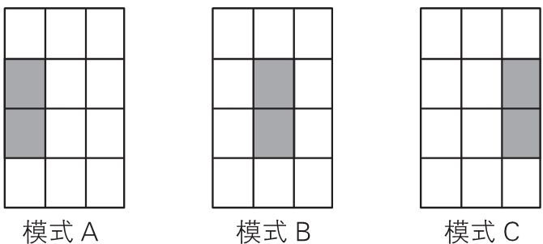

<!-- vscode-markdown-toc -->
* 1. [思想](#)
* 2. [从感知机到神经网络](#-1)
	* 2.1. [神经网络概念](#-1)
	* 2.2. [用函数来表示感知机](#-1)
	* 2.3. [感知机用到的激活函数](#-1)
* 3. [激活函数](#-1)
	* 3.1. [阶跃函数](#-1)
	* 3.2. [sigmoid 函数](#sigmoid)
	* 3.3. [sigmoid 函数和阶跃函数的异同](#sigmoid-1)
	* 3.4. [非线性函数](#-1)
	* 3.5. [ReLU（Rectified Linear Unit）函数以及和上述两个激活函数的比较](#ReLURectifiedLinearUnit)
* 4. [使用激活函数的两层神经网络实现非线性](#-1)
* 5. [矩阵乘法与神经网络的内积运算](#-1)
	* 5.1. [神经网络内积运算的意义](#-1)
* 6. [三层神经网络的实现](#-1)
* 7. [输出层的设计](#-1)
	* 7.1. [恒等函数和 softmax 函数](#softmax)
	* 7.2. [为什么 softmax 函数被设计成这样](#softmax-1)
	* 7.3. [防止 softmax 函数溢出](#softmax-1)
	* 7.4. [softmax 函数的特征](#softmax-1)
		* 7.4.1. [反映概率](#-1)
		* 7.4.2. [推理阶段可以省略 softmax 函数](#softmax-1)
	* 7.5. [输出层的神经元数量](#-1)
* 8. [实例：手写数字识别](#-1)
	* 8.1. [MNIST 数据集](#MNIST)
	* 8.2. [pickle 功能](#pickle)
	* 8.3. [加载 MNIST 数据并显示的代码实现](#MNIST-1)
	* 8.4. [神经网络的推理处理](#-1)
		* 8.4.1. [代码实现](#-1)
* 9. [预处理（pre-processing）](#pre-processing)
* 10. [批处理](#-1)
	* 10.1. [考虑形状](#-1)
	* 10.2. [批处理](#-1)
	* 10.3. [代码实现](#-1)
* 11. [神经网络基本工作模式的例子](#-1)
	* 11.1. [权重的优化](#-1)
	* 11.2. [权重优化的意义](#-1)
	* 11.3. [偏置](#-1)
* 12. [References](#References)

<!-- vscode-markdown-toc-config
	numbering=true
	autoSave=true
	/vscode-markdown-toc-config -->
<!-- /vscode-markdown-toc --># Basic

<!-- TOC -->

- [Basic](#basic)
    - [0. 思想](#0-思想)
    - [1. 从感知机到神经网络](#1-从感知机到神经网络)
        - [1.1 神经网络概念](#11-神经网络概念)
        - [1.2 用函数来表示感知机](#12-用函数来表示感知机)
        - [1.3 感知机用到的激活函数](#13-感知机用到的激活函数)
    - [2. 激活函数](#2-激活函数)
        - [2.1 阶跃函数](#21-阶跃函数)
        - [2.2 sigmoid 函数](#22-sigmoid-函数)
        - [2.3 sigmoid 函数和阶跃函数的比较](#23-sigmoid-函数和阶跃函数的比较)
        - [2.4 非线性函数](#24-非线性函数)
        - [2.5 ReLU（Rectified Linear Unit）函数以及和上述两个激活函数的比较](#25-relurectified-linear-unit函数以及和上述两个激活函数的比较)
    - [3. 使用激活函数的两层神经网络实现非线性](#3-使用激活函数的两层神经网络实现非线性)
    - [4. 矩阵乘法与神经网络的内积运算](#4-矩阵乘法与神经网络的内积运算)
        - [4.1 神经网络内积运算的意义](#41-神经网络内积运算的意义)
    - [5. 三层神经网络的实现](#5-三层神经网络的实现)
    - [6. 输出层的设计](#6-输出层的设计)
        - [6.1 恒等函数和 softmax 函数](#61-恒等函数和-softmax-函数)
        - [6.2 为什么 softmax 函数被设计成这样](#62-为什么-softmax-函数被设计成这样)
        - [6.3 防止 softmax 函数溢出](#63-防止-softmax-函数溢出)
        - [6.4 softmax 函数的特征](#64-softmax-函数的特征)
            - [6.4.1 反映概率](#641-反映概率)
            - [6.4.2 推理阶段可以省略 softmax 函数](#642-推理阶段可以省略-softmax-函数)
        - [6.5 输出层的神经元数量](#65-输出层的神经元数量)
    - [7. 实例：手写数字识别](#7-实例手写数字识别)
        - [7.1 MNIST 数据集](#71-mnist-数据集)
        - [7.2 代码实现](#72-代码实现)
        - [7.3 pickle 功能](#73-pickle-功能)
        - [7.4 神经网络的推理处理](#74-神经网络的推理处理)
            - [7.4.1 代码实现](#741-代码实现)
    - [8. 预处理（pre-processing）](#8-预处理pre-processing)
    - [9. 批处理](#9-批处理)
        - [9.1 考虑形状](#91-考虑形状)
        - [9.2 批处理](#92-批处理)
        - [9.3 代码实现](#93-代码实现)
    - [10. 神经网络基本工作模式的例子](#10-神经网络基本工作模式的例子)
        - [10.1 权重的优化](#101-权重的优化)
        - [10.2 权重优化的意义](#102-权重优化的意义)
        - [偏置](#偏置)
    - [References](#references)

<!-- /TOC -->


##  1. <a name=''></a>思想


##  2. <a name='-1'></a>从感知机到神经网络
1. 关于感知机，既有好消息，也有坏消息。好消息是，即便对于复杂的函数，感知机也隐含着能够表示它的可能性。即便是计算机进行的复杂处理，感知机（理论上）也可以将其表示出来。
2. 坏消息是，设定权重的工作，即确定合适的、能符合预期的输入与输出的权重，现在还是由人工进行的。
3. 神经网络的出现就是为了解决刚才的坏消息。具体地讲，神经网络的一个重要性质是它可以自动地从数据中学习到合适的权重参数。

###  2.1. <a name='-1'></a>神经网络概念
1. 用图来表示神经网络的话，如下图所示。
    
2. 我们把最左边的一列称为 **输入层**，最右边的一列称为 **输出层**，中间的一列称为 **中间层**。中间层有时也称为 **隐藏层**。
3. 输入层负责接收要处理的数据（例如待分类图片），输出层负责输出处理结果（例如分类结果），中间层负责 **特征提取**（feature extraction，根据图片的特征进行分类计算）
3. 神经网络的形状类似上一章的感知机。实际上，就神经元的连接方式而言，与感知机并没有任何差异。

###  2.2. <a name='-1'></a>用函数来表示感知机
1. 感知机可以使用如下函数 $h$ 来表示

    $y = h(b + w_1x_1 + w_2x_2)$
    
2. 图示如下
    
3. 输入值结合参数共同的计算结果，作为函数 $h$ 的参数。函数 $h$ 内部会计算参数的值：如果小于等于0，函数返回0；否则返回1
    

###  2.3. <a name='-1'></a>感知机用到的激活函数
1. 刚才登场的 $h(x)$ 函数会将输入信号的总和转换为输出信号，这种函数一般称为 **激活函数**（activation function）。激活函数的作用在于根据输入信号的总和来决定是否激活后续神经元。
2. 下图明确的显示了激活函数的计算过程
    
3. $b + w_1x_1 + w_2x_2$ 的计算结果得到节点 $a$，节点 $a$ 作为参数传给激活函数 $h$，$h$ 计算并输入为节点 $y$。


##  3. <a name='-1'></a>激活函数
###  3.1. <a name='-1'></a>阶跃函数
1. 激活函数以阈值为界，一旦输入超过阈值，就切换输出。这样的函数称为 **阶跃函数**(step function)。
2. 因此，可以说感知机中使用了阶跃函数作为激活函数。
3. 下面就是感知机用到的阶跃函数
    ```py
    def step_function(x):
        if x > 0:
            return 1
        else:
            return 0
    ```
4. 改造一下，并使用 numpy，使它支持数组参数
    ```py
    import numpy as np
    def step_function(x):
        y = x > 0
        return y.astype(int)
    
    arr = np.array([-1, 0, 1])
    step_function(arr)  # [0 0 1]
    ```
5. 根据 NumPy 的广播功能，如果在标量和 NumPy 数组之间进行运算，则标量会和 NumPy 数组的各个元素进行运算。改造后的函数在传入单个数字时，`y` 会是布尔值，通过转型函数转为整数，就会是 1 或 0；如果传入数组，以上面的 `arr` 为例，`y` 的值会是 `[False, False, True]`，最后转为期望的整数结果。
6. `step_function` 还有另一种实现方式：直接对输入的数组映射并转型
    ```py
    def step_function(x):
        return np.array(x > 0, dtype=int)
    ```
    如果输入不是数组同样适用
    ```py
    step_function(-1)   # 0
    step_function(-0)   # 0
    step_function(1)    # 1
    ```
7. 打印阶跃函数的图形
    ```py
    import numpy as np
    import matplotlib.pylab as plt

    def step_function(x):
        return np.array(x > 0, dtype=int)

    x = np.arange(-5.0, 5.0, 0.1)
    y = step_function(x)
    plt.plot(x, y)
    plt.ylim(-0.1, 1.1)  # 指定y轴的范围
    plt.show()
    ```
    

###  3.2. <a name='sigmoid'></a>sigmoid 函数
1. 如果将激活函数从阶跃函数换成其他函数，就可以进入神经网络的世界了。神经网络中经常使用的一个激活函数就是如下的 **sigmoid 函数**（sigmoid function）。
    $\Large f(x) = \frac{1}{1 + e^{-x}}$
2. 神经网络中用 sigmoid 函数作为激活函数，进行信号的转换，转换后的信号被传送给下一个神经元。
3. 实际上，感知机和接下来要介绍的神经网络的主要区别就在于这个激活函数。其他方面，比如神经元的多层连接的构造、信号的传递方法等，基本上和感知机是一样的。
3. 用 Python 可以像下面这样写出 sigmoid 函数
    ```py
    def sigmoid(x):
        return 1 / (1 + np.exp(-x))
    ```
4. 打印 sigmoid 函数的图形
    ```py
    import numpy as np
    import matplotlib.pylab as plt

    def sigmoid(x):
        return 1 / (1 + np.exp(-x))

    x = np.arange(-5.0, 5.0, 0.1)
    y = sigmoid(x)
    plt.plot(x, y)
    plt.ylim(-0.1, 1.1)  # 指定y轴的范围
    plt.show()
    ```
    

###  3.3. <a name='sigmoid-1'></a>sigmoid 函数和阶跃函数的异同


* 平滑性不同：输出是否随着输入发生连续性的变化。
* 输出值不同：相对于阶跃函数只能返回 0 或 1，sigmoid 函数可以返回 0.731 ...、0.880 ... 等实数。也就是说，感知机中神经元之间流动的是 0 或 1 的二元信号，而神经网络中流动的是连续的实数值信号。
* 两者的结构均是 “输入小时，输出接近 0；随着输入增大，输出接近 1 ”。也就是说，当输入信号为重要信息时，阶跃函数和 sigmoid 函数都会输出较大的值；当输入信号为不重要的信息时，两者都输出较小的值。
* 还有一个共同点是，不管输入信号有多小，或者有多大，输出信号的值都在 0 到 1 之间。

###  3.4. <a name='-1'></a>非线性函数
1. 阶跃函数和 sigmoid 函数还有其他共同点，就是两者均为非线性函数。sigmoid 函数是一条曲线，阶跃函数是一条像阶梯一样的折线，两者都属于非线性的函数。
2. 如果不使用非线性函数作为激活函数，那不管叠加多少层，最终的计算效果也都是线性的，都无法解决线性不可分的问题。
3. 考虑把线性函数 $h(x) = cx$ 作为激活函数，把 $y(x) = h(h(h(x)))$ 的运算对应 3 层神经网络。这个运算会进行 $y(x) = c × c × c × x$ 的乘法运算，但是同样的处理可以由 $y(x) = c^3x$ 这一次乘法运算（即没有隐藏层的神经网络）来表示。
4. 因此激活函数的意义就在于引入非线性，通过激活函数，神经网络就可以拟合各种曲线。

###  3.5. <a name='ReLURectifiedLinearUnit'></a>ReLU（Rectified Linear Unit）函数以及和上述两个激活函数的比较
1. ReLU 函数在输入大于 0 时，直接输出该值；在输入小于等于 0 时，输出 0
    ```py
    def relu(x):
        return np.maximum(0, x)
    ```
2. 对比阶跃函数和 sigmoid 函数的激活逻辑
    * 阶跃函数只能传递出信号强度是否达到阈值，不能传递出信号强度到底有多大。
    * ReLU 函数也有阈值的概念，它不仅能传递出信号强度是否能达到阈值，还能在达到阈值的情况下传递出信号的强度。但在信号没有达到阈值时，它也只会简单的传递出没有达到阈值，而并不能传递出当前的信号强度。
    * sigmoid 函数并没有阈值的概念。但它可以在任何情况下都传递出信号的强度。
3. 题外话，如果对生物神经元长时间的施加低于阈值的刺激，会是什么效果？又让我想到了光电效应。


##  4. <a name='-1'></a>使用激活函数的两层神经网络实现非线性
1. 与单层神经网络不同。理论证明，两层神经网络可以无限逼近任意连续函数。
2. 下面的例子，红色的线与蓝色的线代表数据。而红色区域和蓝色区域代表由神经网络划开的区域，两者的分界线就是决策分界
    
3. 可以看到，这个两层神经网络的决策分界是非常平滑的曲线，而且分类的很好。
4. 但是有趣的是，像是在叠加感知机实现异或以及在下面会实现的三层神经网络中，最后一层的计算用到的也是线性函数，但最终却可以解决非线性分类任务。
5. 把输出层的决策分界单独拿出来看一下
    
6. 可以看到，输出层的决策分界仍然是直线。但是，从输入层到隐藏层时，数据发生了空间变换。
7. 也就是说，两层神经网络中，隐藏层对原始的数据进行了一个空间变换，使其可以被线性分类，然后输出层的决策分界划出了一个线性分类分界线，对其进行分类。
8. 这样就导出了两层神经网络可以做非线性分类的关键——隐藏层。矩阵和向量相乘，本质上就是对向量的坐标空间进行一个变换。因此，隐藏层的参数矩阵的作用就是使得数据的原始坐标空间从线性不可分，转换成了线性可分。
9. 两层神经网络通过两层的线性模型模拟了数据内真实的非线性函数。因此，多层的神经网络的本质就是复杂函数拟合。


##  5. <a name='-1'></a>矩阵乘法与神经网络的内积运算
1. 根据矩阵乘法的规则， $\boldsymbol{A}$ x $\boldsymbol{B}$ 要求 $\boldsymbol{A}$ 的列数必须要等于 $\boldsymbol{B}$ 的行数。而且结果矩阵的行数等于 $\boldsymbol{A}$ 的行数，而列数等于 $\boldsymbol{B}$ 的列数
    
2. 一维数组和多维数组相乘时同理
    ```py
    A = np.array(
        [
            [1, 2], 
            [3, 4], 
            [5, 6]
        ]
    )
    print(A.shape) # (3, 2)
    B = np.array([7, 8])
    print(B.shape) # (2,)
    C = np.dot(A, B)
    print(C)  # [23 53 83]
    print(C.shape) # (3,)


    D = np.array([7, 8, 9])
    print(D.shape) #(3, )
    E =  np.array(
        [
            [1, 2],
            [3, 4],
            [5, 6]
        ]
    )
    print(E.shape) #(3, 2)
    F = np.dot(D, E)
    print(F) # [76 100]
    print(F.shape) #(2, )
    ```
3. 神经网络的内积计算，正好可以使用矩阵乘法
    
    1. 在上面的神经网络中，输入为矩阵 $\boldsymbol{X}$ $\begin{bmatrix} x_1 & x_2 \end{bmatrix}$，输出为 $\begin{bmatrix} x_1 \times 1+x_2 \times 2 & x_1 \times 3+x_2 \times 4 & x_1 \times 5+x_2 \times 6 \end{bmatrix}$。
    2. 如果将权重表示为矩阵 $\boldsymbol{W}$ $\begin{bmatrix} 1 & 3 & 5 \\ 2 & 4 & 6\end{bmatrix}$，则该神经网络的计算结果正好就是 $\boldsymbol{X}$ 和 $\boldsymbol{W}$ 的乘积。  
4. 假设输入是 $\begin{bmatrix} 1 & 2 \end{bmatrix}$，则使用矩阵乘法可以很容易的算出输出：
    ```py
    X = np.array([1, 2])
    W = np.array([[1, 3, 5], [2, 4, 6]])
    Y = np.dot(X, W)
    print(Y)  # [ 5 11 17]
    ```
5. 使用 `np.dot`，可以一次性计算出 $\boldsymbol{Y}$ 的结果。这意味着，即便 $\boldsymbol{Y}$ 的元素个数为 100 或 1000，也可以通过一次运算就计算出结果。如果不使用 `np.dot`，就必须对输入和权重进行循环的相乘相加，非常麻烦。

###  5.1. <a name='-1'></a>神经网络内积运算的意义
1. 假定上面的内积运算是在进行一个分类问题，即根据一个对象的 $x_1$、$x_2$ 两个特征，判断这个对象的是属于 $y_1$、$y_2$ 还是 $y_3$。
2. 因为直接的输出并不是只给定一个最终的判断结果，而是给出是 $y_1$、$y_2$ 和 $y_3$ 的概率分别是多大。所以神经网络会根据输入的特征 $x_1$、$x_2$ 来分别计算 $y_1$、$y_2$ 和 $y_3$ 的值。
3. 所以 $w_1$ 和 $w_2$ 是用来计算 $y_1$ 概率的，$w_3$ 和 $w_4$ 是用来计算 $y_2$ 概率的，$w_5$ 和 $w_6$ 是用来计算 $y_3$ 概率的。
4. 具体的计算方法，在下面 10.2 权重优化的意义 中讲到


##  6. <a name='-1'></a>三层神经网络的实现
1. 实现如下的三层结构神经网络
    
2. 最后一层的输出层所用的激活函数，要根据求解问题的性质决定。一般地，回归问题可以使用恒等函数，二元分类问题可以使用 sigmoid 函数，多元分类问题可以使用 softmax 函数。本例中输出层的激活函数使用恒等函数，恒等函数会将输入按原样输出，因此，这个例子中没有必要特意定义`identity_function()`，这里这样实现只是为了和之前的流程保持统一。
3. 代码实现
    ```py
    import numpy as np


    def sigmoid(x):
        return 1 / (1 + np.exp(-x))

    # 恒等函数
    def identity_function(x):
        return x

    # 设置权重和偏置，定义神经网络
    def init_network():
        network = {}
        # 三层的权重和偏置
        network['W1'] = np.array([[0.1, 0.3, 0.5], [0.2, 0.4, 0.6]])
        network['b1'] = np.array([0.1, 0.2, 0.3])
        network['W2'] = np.array([[0.1, 0.4], [0.2, 0.5], [0.3, 0.6]])
        network['b2'] = np.array([0.1, 0.2])
        network['W3'] = np.array([[0.1, 0.3], [0.2, 0.4]])
        network['b3'] = np.array([0.1, 0.2])

        return network

    # 将输入信号转换为输出信号
    def forward(network, x):
        W1, W2, W3 = network['W1'], network['W2'], network['W3']
        b1, b2, b3 = network['b1'], network['b2'], network['b3']

        # 每一层输入的加权和经过激活函数转换后，输出作为下一层的输入
        a1 = np.dot(x, W1) + b1
        z1 = sigmoid(a1)
        a2 = np.dot(z1, W2) + b2
        z2 = sigmoid(a2)
        a3 = np.dot(z2, W3) + b3
        y = identity_function(a3)

        return y


    network = init_network()
    x = np.array([1.0, 0.5])
    y = forward(network, x)
    print(y)  # [ 0.31682708 0.69627909]
    ```


##  7. <a name='-1'></a>输出层的设计
1. 神经网络可以用在分类问题和回归问题上，不过需要根据情况改变输出层的激活函数。一般而言，回归问题用恒等函数，分类问题用 softmax 函数。
2. 机器学习的问题大致可以分为分类问题和回归问题。分类问题是数据属于哪一个类别的问题。比如，区分图像中的人是男性还是女性的问题就是分类问题。而回归问题是根据某个输入预测一个（连续的）数值的问题。比如，根据一个人的图像预测这个人的体重的问题就是回归问题。

###  7.1. <a name='softmax'></a>恒等函数和 softmax 函数
1. 图示（输出层的激活函数用 $σ()$ 表示）
    
2. softmax 函数可以用下式表示
    $ \LARGE y_k = \frac{e^{a_k}}{\sum^{n}_{i=1}e^{a_i}} $
3. 上式表示假设输出层共有 n 个神经元，softmax 函数计算第 k 个神经元的输出。
4. softmax 函数的分子是输入信号 $a_k$ 的指数函数，分母是所有输入信号的指数函数的和。python 实现
    ```py
    def softmax(a):
        exp_a = np.exp(a)
        sum_exp_a = np.sum(exp_a)
        return exp_a / sum_exp_a

    a = np.array([0.3, 2.9, 4.0])
    print(softmax(a)) # [0.01821127 0.24519181 0.73659691]
    ```
5. 注意上面 numpy 的处理方式
    1. 输入 `a` 是个数组，所以 `exp_a` 也是个数组   
        ```py
        exp_a = np.exp([0.3, 2.9, 4.0])
        print(exp_a) # [ 1.34985881 18.17414537 54.59815003]
        ```
    2. `sum` 对数组求和，所以 `sum_exp_a` 是一个单独的数
        ```py
        sum_exp_a = np.sum(exp_a)
        print(sum_exp_a) # 74.1221542101633
        ```
    3. `exp_a / sum_exp_a` 是用一个数组除以一个单独的数，numpy 使用广播对数组的每一项都除以这个数，结果仍是数组
        ```py
        y = exp_a / sum_exp_a
        print(y) # [0.01821127 0.24519181 0.73659691]
        ```

###  7.2. <a name='softmax-1'></a>为什么 softmax 函数被设计成这样
1. 分类问题是要得出一个东西最有可能是哪一类。
2. 比如一个东西可能是会被分为四类，神经网络计算每一类的可能性得分是 `[1, 4, 2, 3]`。第二类的得分最高，也就是说最有可能是第二类。
3. 如果使用 argmax 函数来正规化，转化的结果会是 `[0, 1, 0, 0]`。argmax 函数的算法就是将值最大的转换为 1，其他都转换为 0。这样也预测了最有可能是第二类，而且总的概率确实也是 1。
4. 但问题在于，argmax 函数不是处处可微的。比如在调节权重之后，输入值变为 `[1, 4.5, 2, 2.5]`，其实神经网络的预测更准确了一些，但 argmax 的结果还是 `[0, 1, 0, 0]`，没有体现出调节权重的价值。
5. 那么直接加权归一呢？比如得出结果 `[0.1, 0.4, 0.2, 0.3]`。现在仍然可以正确预测处第二类，而且也是可微的。为什么要用 $e$ 为底、输入值为指数的幂的形式呢？
6. softmax 的算法有两个特点：
    * 即使一项的得分是 0，激活后的值也不会是 0。
    * 从 $e$ 为底指数函数的形态可以看到，当输入增大一些时，函数值会非线性的大幅度增大。因此指数函数的形式，会拉开概率的分布，使得大概率和小概率的差距变得更显著。
7. 不懂。但是为什么神经网络要利用这个两个特点？为什么得分为 0 还不认定为概率为 0？为什么要显著拉开概率的差距让得分最高的那个的概率更加的高？
8. 另外，softmax 和名字是相对于 argmax 很 hard 的只会返回一个 1 和若干个 0 的形式。

###  7.3. <a name='softmax-1'></a>防止 softmax 函数溢出
1. 上面的 `softmax` 函数的实现虽然正确实现了，但在计算机的运算上有一定的缺陷。这个缺陷就是溢出问题。softmax 函数的实现中要进行指数函数的运算，但是此时指数函数的值很容易变得非常大
    ```py
    a = np.array([1010, 1000, 990])
    print(softmax(a))  # [nan nan nan]
    ```
2. softmax 函数的实现可以如下这样进行改进，其中 $C$ 是非零常数
    $ 
        \LARGE y_k = \frac{e^{a_k}}{\sum^{n}_{i=1}e^{a_i}} \\
             \quad = \frac{Ce^{a_k}}{C\sum^{n}_{i=1}e^{a_i}} \\
             \quad = \frac{e^(a_k + \ln{C})}{\sum^{n}_{i=1}e^({a_i} + \ln{C})} \\
             \quad = \frac{e^(a_k + C')}{\sum^{n}_{i=1}e^({a_i} + C')}
    $
3. 在分子和分母上都乘上 $C$；然后，把这个 $C$ 移动到指数函数中；最后，把 $\ln{C}$ 替换为另一个符号 $C'$。
4. 这说明，在进行 softmax 的指数函数的运算时，加上（或者减去）某个常数并不会改变运算的结果。这里的 $C'$ 可以使用任何值，但是为了防止溢出，一般会使用输入信号中的最大值
    ```py
    def softmax(a):
        c = np.max(a)
        exp_a = np.exp(a - c)
        sum_exp_a = np.sum(exp_a)
        y = exp_a / sum_exp_a

        return y

    a = np.array([1010, 1000, 990])
    print(softmax(a))  # [9.99954600e-01 4.53978686e-05 2.06106005e-09]
    ```

###  7.4. <a name='softmax-1'></a>softmax 函数的特征
####  7.4.1. <a name='-1'></a>反映概率
1. 使用 softmax 函数，可以按如下方式计算神经网络的输出。
    ```py
    >>> a = np.array([0.3, 2.9, 4.0])
    >>> y = softmax(a)
    >>> print(y)
    [ 0.01821127  0.24519181  0.73659691]
    >>> np.sum(y)
    1.0
    ```
2. 如上所示，softmax 函数的输出是 0.0 到 1.0 之间的实数。并且，softmax 函数的输出值的总和是 1。输出总和为 1 是 softmax 函数的一个重要性质。正因为有了这个性质，我们才可以把 softmax 函数的输出解释为 “概率”。
3. 比如，上面的例子可以解释成 `y[0]` 的概率是 0.018（1.8 %），`y[1]` 的概率是 0.245（24.5 %），`y[2]` 的概率是 0.737（73.7 %）。也就是说，通过使用 softmax 函数，我们可以用概率的（统计的）方法处理问题。

####  7.4.2. <a name='softmax-1'></a>推理阶段可以省略 softmax 函数
1. 即便使用了 softmax 函数，各个元素之间的大小关系也不会改变。这是因为指数函数 $y = e^{x}$ 是单调递增函数。实际上，上例中 `a` 的各元素的大小关系和 `y` 的各元素的大小关系并没有改变。
2. 一般而言，神经网络只把输出值最大的神经元所对应的类别作为识别结果。并且，即便使用 softmax 函数，输出值最大的神经元的位置也不会变。因此，神经网络在进行分类时，输出层的 softmax 函数可以省略。在实际的问题中，由于指数函数的运算需要一定的计算机运算量，因此输出层的 softmax 函数一般会被省略。
3. 求解机器学习问题的步骤可以分为 “学习” 和 “推理” 两个阶段。首先，在学习阶段进行模型的学习，然后，在推理阶段，用学到的模型对未知的数据进行推理（分类）。如前所述，推理阶段一般会省略输出层的 softmax 函数。在输出层使用 softmax 函数是因为它和神经网络的学习有关系。

###  7.5. <a name='-1'></a>输出层的神经元数量
1. 输出层的神经元数量需要根据待解决的问题来决定。
2. 对于分类问题，输出层的神经元数量一般设定为类别的数量。比如，对于某个输入图像，预测是图中的数字 0 到 9 中的哪一个的问题（10 类别分类问题），可以将输出层的神经元设定为 10 个。 


##  8. <a name='-1'></a>实例：手写数字识别
假设学习已经全部结束，我们使用学习到的参数，先实现神经网络的“推理处理”。这个推理处理也称为神经网络的**前向传播**（forward propagation）。

###  8.1. <a name='MNIST'></a>MNIST 数据集
0. 注意，官网的下载链接已经失效了，即使是在官网直接访问它的下载链接也无法下载。
1. MNIST 数据集是由 0 到 9 的数字图像构成的。训练图像有 6 万张，测试图像有 1 万张，这些图像可以用于学习和推理。
2. MNIST 数据集的一般使用方法是，先用训练图像进行学习，再用学习到的模型度量能在多大程度上对测试图像进行正确的分类。
3. MNIST 的图像数据是 28 像素 × 28 像素的灰度图像（1 通道），各个像素的取值在 0 到 255 之间。每个图像数据都相应地标有 “7”、“2”、“1” 等标签。

###  8.2. <a name='pickle'></a>pickle 功能
1. Python 有 pickle 这个便利的功能。这个功能可以将程序运行中的对象保存为文件。
2. 如果加载保存过的 pickle 文件，可以立刻复原之前程序运行中的对象。
3. 用于读入 MNIST 数据集的 `load_mnist()` 函数内部也使用了 pickle 功能（在第 2 次及以后读入时）。利用 pickle 功能，可以高效地完成 MNIST 数据的准备工作。

###  8.3. <a name='MNIST-1'></a>加载 MNIST 数据并显示的代码实现
1. 测试时把下面两个文件放在同一个目录，并且因为官网下载失效，所以直接使用 .pkl 文件，也放在同一个目录
2. `./demo/mnist_show.py`
    ```py
    # coding: utf-8
    import sys, os
    # sys.path.append(os.pardir)  # 为了导入父目录的文件而进行的设定
    # 如果当前工作目录（命令行工具的当前目录）不是该文件所在目录，就应该使用下面的绝对路径
    # sys.path.append(os.path.join(os.path.dirname(__file__), os.pardir))
    # 这里我们测试时把 mnist.py 和 mnist_show.py 放在同一个目录

    import numpy as np

    from mnist import load_mnist # 从 dataset 目录的 mnist.py 中导入加载 mnist 数据的函数
    # 如果是安装的单独 Python 而不是 Anaconda 这样集成的环境，那么 PIL（Python Image Library） 需要安装 pillow
    # 使用 `python - m pip Pillow` 安装时网络不好很可能安装超时，
    # 使用下面的方法设定超时时间，多试几次可以安装成功：
    # `python - m pip - -default-timeout = 100 install - U Pillow`
    from PIL import Image


    # 用来显示图像
    def img_show(img):
        # 因为下面读取的图像数据是 NumPy 数组的形式，在显示图像时，需要使用 `Image.fromarray` 函数将其转换为 # PIL 所用的数据对象
        pil_img = Image.fromarray(np.uint8(img))
        pil_img.show()


    # 读取数据集。第一次时如果没有下载，会先下载，会下载到 dataset 目录中
    # 同样因为网络原因很可能下载不成功，直接上官网找连接迅雷下载：http://yann.lecun.com/exdb/mnist/
    # 不过现在官网也无法现在了，这里可以直接使用之前的 .pkl 文件
    # load_mnist 函数以 “(训练图像, 训练标签)，(测试图像, 测试标签 )” 的形式返回读入的 MNIST 数据
    # flatten 参数设置为 True，所以每个图像数据是一个 784 项的一维数组。
    # normalize 参数设置为 False，因此将输入图像为 0～255 的值。
    # one_hot_label 参数没设置，默认为 False，因此每个标签项是一个数而不是数组。
    (x_train, t_train), (x_test, t_test) = load_mnist(flatten=True, normalize=False)

    img = x_train[0]
    label = t_train[0]
    print(label)  # 5

    print(img.shape)  # (784,) # 上面使用一维数组的形式读取的第一个训练图像
    img = img.reshape(28, 28)  # 因此，显示图像时，需要把它变为原来的 28 像素 × 28 像素的形状
    print(img.shape)  # (28, 28)

    img_show(img)
    ```
3. `../../dataset/mnist.py`
    ```py
    # coding: utf-8
    try:
        import urllib.request
    except ImportError:
        raise ImportError('You should use Python 3.x')
    import os.path
    import gzip
    import pickle
    import os
    import numpy as np

    # 官网下载已经失效，这里直接使用之前的 .pkl 文件
    url_base = 'https://yann.lecun.com/exdb/mnist/'
    key_file = {
        'train_img':'train-images-idx3-ubyte.gz',
        'train_label':'train-labels-idx1-ubyte.gz',
        'test_img':'t10k-images-idx3-ubyte.gz',
        'test_label':'t10k-labels-idx1-ubyte.gz'
    }

    # os.path.dirname() method is used to get the directory name from the specified path.
    # os.path.abspath() returns a normalized absolutized version of the pathname path.
    # 一个模块的 .__file__ 属性的值是该模块所在文件的绝对路径。但这里 __file__ 作为属性，看起来就应该是指当前文件的绝对路径。实际测试也是这个结果。但 __file__ 已经是绝对路径了，为什么还要再使用 os.path.abspath() 呢？看到说 os.path.abspath() 的 normalized 是指使用 os.chdir() 改变 cwd 之后仍然成立，但我改变了 cwd，发现不管是否使用 os.path.abspath() 都没啥区别。
    # 那么最终，dataset_dir 就是当前文件所在目录
    dataset_dir = os.path.dirname(os.path.abspath(__file__))
    # 下载好的数据会保存到下面的 .pkl 文件中，之后直接使用本地的
    save_file = dataset_dir + "/mnist.pkl"

    train_num = 60000
    test_num = 10000
    img_dim = (1, 28, 28)
    img_size = 784


    # 下载一个远程文件
    def _download(file_name):
        # 下载下来的暂存路径
        file_path = dataset_dir + "/" + file_name
        
        if os.path.exists(file_path):
            return

        print("Downloading " + file_name + " ... ")
        urllib.request.urlretrieve(url_base + file_name, file_path)
        print("Done")
        
    # 从远程下载若干个数据文件
    def download_mnist():
        for v in key_file.values():
        # 具体下载每一个远程文件
        _download(v)
            
    # 把下载标签文件转换为 NumPy 数组形式
    def _load_label(file_name):
        file_path = dataset_dir + "/" + file_name
        
        print("Converting " + file_name + " to NumPy Array ...")
        with gzip.open(file_path, 'rb') as f:
                labels = np.frombuffer(f.read(), np.uint8, offset=8)
        print("Done")
        
        return labels

    # 把下载图片文件转换为 NumPy 数组形式
    def _load_img(file_name):
        file_path = dataset_dir + "/" + file_name
        
        print("Converting " + file_name + " to NumPy Array ...")    
        with gzip.open(file_path, 'rb') as f:
                data = np.frombuffer(f.read(), np.uint8, offset=16)
        data = data.reshape(-1, img_size)
        print("Done")
        
        return data
        
    # 把下载图片文件转换为 NumPy 数组形式，把下载标签文件转换为 NumPy 数组形式
    def _convert_numpy():
        dataset = {}
        dataset['train_img'] =  _load_img(key_file['train_img'])
        dataset['train_label'] = _load_label(key_file['train_label'])    
        dataset['test_img'] = _load_img(key_file['test_img'])
        dataset['test_label'] = _load_label(key_file['test_label'])
        
        return dataset

    # 如果初次加载，不存在 .pkl 文件，则调用 init_mnist 从远程下载数据并创建 .pkl 文件
    def init_mnist():
        # 从远程下载若干个数据文件
        download_mnist()
        # 把下载图片文件转换为 NumPy 数组形式，把下载标签文件转换为 NumPy 数组形式，都保存进 dataset
        dataset = _convert_numpy()
        print("Creating pickle file ...")
        # 把 dataset 的数据创建为 .pkl 文件
        with open(save_file, 'wb') as f:
            pickle.dump(dataset, f, -1)
        # 创建好 .pkl 文件，下载的那四个数据文件就不需要了
        print("Done!")

    def _change_one_hot_label(X):
        # X 是一维数组，每个数组项是一个数字，例如 5。这里要把它的每一项从一个数转为一个一维十项的数组，例如把 5 转为 [0, 0, 0, 0, 0, 1, 0, 0, 0, 0]
        T = np.zeros((X.size, 10))
        # 数组转为可枚举对象后，for...in 可以使用 索引和值 两个变量
        for idx, row in enumerate(T):
            row[X[idx]] = 1
            
        return T
        

    def load_mnist(normalize=True, flatten=True, one_hot_label=False):
        """读入MNIST数据集
        
        Parameters
        ----------
        normalize : 将图像的像素值正规化为0.0~1.0
        one_hot_label : 
            one_hot_label为True的情况下，标签作为one-hot数组返回
            one-hot数组是指[0,0,1,0,0,0,0,0,0,0]这样的数组
        flatten : 是否将图像展开为一维数组
        
        Returns
        -------
        (训练图像, 训练标签), (测试图像, 测试标签)
        """

        # 如果初次加载，不存在 .pkl 文件，则调用 init_mnist 从远程下载数据并创建 .pkl 文件
        if not os.path.exists(save_file):
            init_mnist()
            
        # 读取刚创建的或更早创建的 .pkl 文件，获得里面的数据 dataset
        with open(save_file, 'rb') as f:
            dataset = pickle.load(f)
        
        if normalize:
            for key in ('train_img', 'test_img'):
                # 为什么要先转型，不懂
                dataset[key] = dataset[key].astype(np.float32)
                dataset[key] /= 255.0
                
        if one_hot_label:
            dataset['train_label'] = _change_one_hot_label(dataset['train_label'])
            dataset['test_label'] = _change_one_hot_label(dataset['test_label'])
        
        if not flatten:
            for key in ('train_img', 'test_img'):
                # 1. 某个维度参数传 -1 是让 NumPy 自己计算这个维度应该是几。
                # 2. 例如下面的例子，前两个传了 2，那第三个只能也是 2 才行
                #     ```py
                #     arr = np.array([1, 2, 3, 4, 5, 6, 7, 8])
                #     newarr = arr.reshape(2, 2, -1)

                #     print(newarr)
                #     # [
                #     #     [
                #     #         [1 2]
                #     #         [3 4]
                #     #     ]
                #     #     [
                #     #         [5 6]
                #     #         [7 8]
                #     #     ]
                #     # ]

                #     print(newarr.shape) 
                #     # (2, 2, 2)
                #     ```
                # 3. -1 不一定要写在最后一位，其他地方也可以
                #     ```py
                #     arr.reshape(2, 2, -1)
                #     ```
                # 4. 如果确定的维度已经够了，那 -1 还会建一个单独的单项数组。下面本来 3x3 数组就刚好，但因为传了 -1，所以又把这个 3x3 数组整体放到一个数组里
                #     ```py
                #     arr = np.array([1, 2, 3, 4, 5, 6, 7, 8, 3])
                #     # newarr = arr.reshape(3, 3, -1)
                #     newarr = arr.reshape(-1, 3, 3)

                #     print(newarr)
                #     # [
                #     #     [
                #     #         [1 2 3]
                #     #         [4 5 6]
                #     #         [7 8 3]
                #     #     ]
                #     # ]

                #     print(newarr.shape) 
                #     # (1, 3, 3)
                #     ```
                #     如果 -1 在最后，则会把每个数都变成一个单项数组
                #     ```py
                #     newarr = arr.reshape(3, 3, -1)
                #     print(newarr)
                #     # [
                #     #     [
                #     #         [1]
                #     #         [2]
                #     #         [3]
                #     #     ]
                #     #     [
                #     #         [4]
                #     #         [5]
                #     #         [6]
                #     #     ]
                #     #     [
                #     #         [7]
                #     #         [8]
                #     #         [3]
                #     #     ]
                #     # ]

                #     print(newarr.shape) 
                #     # (3, 3, 1)
                #     ```
                # 5. 原本每个图像是一个包含 784 个值的单项数组，下面把每个图像改为 (1, 28, 28) 的三维数组。还要再加个 -1，因为 dataset[key] 不是一个图像，而是一组图像，所以 -1 会变成这一组图像的个数。
                dataset[key] = dataset[key].reshape(-1, 1, 28, 28)

        return (dataset['train_img'], dataset['train_label']), (dataset['test_img'], dataset['test_label']) 


    if __name__ == '__main__':
        init_mnist()
    ```

###  8.4. <a name='-1'></a>神经网络的推理处理
1. 这个神经网络的输入层有 784 个神经元，输出层有 10 个神经元。输入层的 784 这个数字来源于图像大小的 28 × 28 = 784，输出层的 10 这个数字来源于 10 类别分类（数字 0 到 9，共 10 类别）。
2. 此外，这个神经网络有 2 个隐藏层，第 1 个隐藏层有 50 个神经元，第 2 个隐藏层有 100 个神经元。这个 50 和 100 可以设置为任何值。

####  8.4.1. <a name='-1'></a>代码实现
下面的代码来自`./mnist_demo/demo/neuralnet_mnist.py`
```py
# coding: utf-8
import sys, os
sys.path.append(os.pardir)  # 为了导入父目录的文件而进行的设定
# 如果当前工作目录（命令行工具的当前目录）不是该文件所在目录，就应该使用下面的绝对路径
# sys.path.append(os.path.join(os.path.dirname(__file__), os.pardir))
import numpy as np
import pickle
from dataset.mnist import load_mnist
from common.functions import sigmoid, softmax


# 读取数据集，返回测试用的图像和标签
# 第 3 个参数 one_hot_label 设置是否将标签保存为 one-hot 表示（one-hot representation）。
# one-hot 表示是仅正确解标签为 1，其余皆为 0 的数组，就像 [0,0,1,0,0,0,0,0,0,0] 这样。
# 当 one_hot_label 为 False 时，只是像 7、2 这样简单保存正确解标签
def get_data():
    (x_train, t_train), (x_test, t_test) = load_mnist(normalize=True, flatten=True, one_hot_label=False)
    return x_test, t_test


# 读入保存在 pickle 文件 sample_weight.pkl 中的学习到的权重参数
# (假设学习已经完成，并将学习到的参数保存在这里)。这个文件中以字典变量的形式保存了权重和偏置参数。
def init_network():
    with open("sample_weight.pkl", 'rb') as f:
        network = pickle.load(f)
    return network


# 输入之前神经网络循环的权重和偏置，并接受一个图像数据，演算并推测结果
def predict(network, x):
    W1, W2, W3 = network['W1'], network['W2'], network['W3']
    b1, b2, b3 = network['b1'], network['b2'], network['b3']

    a1 = np.dot(x, W1) + b1
    z1 = sigmoid(a1)
    a2 = np.dot(z1, W2) + b2
    z2 = sigmoid(a2)
    a3 = np.dot(z2, W3) + b3
    y = softmax(a3)

    return y


x, t = get_data()  # 获得 MNIST 数据集
network = init_network()  # 生成神经网络，也就是之前循环得到的权重和偏置
accuracy_cnt = 0
# 遍历所有图像
for i in range(len(x)):
    # predict() 函数以 NumPy 数组的形式输出各个标签对应的概率。
    # 比如输出[0.1, 0.3, 0.2, ..., 0.04] 的数组，该数组表示“0”的概率为 0.1，“1”的概率为 0.3，等等。
    y = predict(network, x[i])
    p = np.argmax(y) # 获取概率最高的元素的索引。也就是说，神经网络判断图像中的数字最有可能为 p
    if p == t[i]:
        # 对比标签，如果真的为 p ，则准确次数加一
        accuracy_cnt += 1

# 输出准确率
print("Accuracy:" + str(float(accuracy_cnt) / len(x)))
```


##  9. <a name='pre-processing'></a>预处理（pre-processing）
1. 在这个例子中，我们把 `load_mnist` 函数的参数 `normalize` 设置成了 `True` 。将 `normalize` 设置成 `True` 后，函数内部会进行转换，将图像的各个像素值除以 255，使得数据的值在 0.0～1.0 的范围内。
2. 像这样把数据限定到某个范围内的处理称为**正规化**（normalization）。此外，对神经网络的输入数据进行某种既定的转换称为**预处理**（pre-processing）。这里，作为对输入图像的一种预处理，我们进行了正规化。
3. 预处理在神经网络（深度学习）中非常实用，其有效性已在提高识别性能和学习的效率等众多实验中得到证明。在刚才的例子中，作为一种预处理，我们将各个像素值除以 255，进行了简单的正规化。
4. 实际上，很多预处理都会考虑到数据的整体分布。比如，利用数据整体的均值或标准差，移动数据，使数据整体以 0 为中心分布，或者进行正规化，把数据的延展控制在一定范围内。除此之外，还有将数据整体的分布形状均匀化的方法，即数据**白化**（whitening）等。


##  10. <a name='-1'></a>批处理
###  10.1. <a name='-1'></a>考虑形状
1. 先看一下神经网络和输入数据的形状
    ```py
    x, _ = get_data()
    network = init_network()
    W1, W2, W3 = network['W1'], network['W2'], network['W3']

    print(x.shape)     # (10000, 784) 
    print(x[0].shape)  # (784,)
    print(W1.shape)    # (784, 50)
    print(W2.shape)    # (50, 100)
    print(W3.shape)    # (100, 10)
    ```
2. 可以看出来，数据集中的图像有 10000 张，每张 784 像素。每张图片输入神经网络时，是作为 784 项的一维数组。
第一次点积运算的结果（$a_1$）是 50 项的一维数组，第二次点积运算的结果（$a_2$）是 100 项的一维数组，，第三次点积运算的结果（$a_3$）是 10 项的一维数组。最终再通过激活函数，输出结果为 10 项的一维数组。
3. 也就是说，每次输入一张图片时，也就是输入 784 项的一维数组，得到 10 项的一维数组。

###  10.2. <a name='-1'></a>批处理
1. 基于上面的说明，考虑每次输入 100 张图片的，输入的数据就变成了 100 * 784 的二维数组。
2. 同样可以计算得出，通过三次点积运算，输出的结果会是 100 * 10 的二维数组。
3. 这表示，输入的 100 张图像的结果被一次性输出了。这种打包式的输入数据称为**批**（batch）。
4. 批处理对计算机的运算大有利处，可以大幅缩短每张图像的处理时间。那么为什么批处理可以缩短处理时间呢？
5. 这是因为大多数处理数值计算的库都进行了能够高效处理大型数组运算的最优化。并且，在神经网络的运算中，当数据传送成为瓶颈时，批处理可以减轻数据总线的负荷（严格地讲，相对于数据读入，可以将更多的时间用在计算上）。
6. 也就是说，批处理一次性计算大型数组要比分开逐步计算各个小型数组速度更快。

###  10.3. <a name='-1'></a>代码实现
下面的代码来自`./mnist_demo/demo/neuralnet_mnist_batch.py`
```py
# coding: utf-8
import sys, os
sys.path.append(os.pardir)
import numpy as np
import pickle
from dataset.mnist import load_mnist
from common.functions import sigmoid, softmax


def get_data():
    (x_train, t_train), (x_test, t_test) = load_mnist(normalize=True, flatten=True, one_hot_label=False)
    return x_test, t_test


def init_network():
    with open("sample_weight.pkl", 'rb') as f:
        network = pickle.load(f)
    return network


def predict(network, x):
    w1, w2, w3 = network['W1'], network['W2'], network['W3']
    b1, b2, b3 = network['b1'], network['b2'], network['b3']

    a1 = np.dot(x, w1) + b1
    z1 = sigmoid(a1)
    a2 = np.dot(z1, w2) + b2
    z2 = sigmoid(a2)
    a3 = np.dot(z2, w3) + b3
    y = softmax(a3)

    return y


x, t = get_data()
network = init_network()

batch_size = 100 # 批数量
accuracy_cnt = 0

# range(start, end, step)
# >>> list( range(0, 10) )
# [0, 1, 2, 3, 4, 5, 6, 7, 8, 9]
# >>> list( range(0, 10, 3) )
# [0, 3, 6, 9]
for i in range(0, len(x), batch_size):
    x_batch = x[i:i+batch_size] # 每个批次读取 batch_size 个图片数据
    y_batch = predict(network, x_batch) # 批量计算结果
    # 批量获取值最大的元素的索引
    # 注意现在 y_batch 是二维数组，需要告诉 argmax 对哪个维度的元素进行最大筛选
    # 第一个维度（ axis=0 ）的元素是数组，第二个维度（ axis=1 ）的元素是每个数组的数字数组项，
    # 所以我们这里应该是对第二维的数字数组中挑选最大元素的索引
    # 这样，每批输入 100 个图像数据，会得到 100 个预测结果索引
    p = np.argmax(y_batch, axis=1)
    # 再使用该批次的 100 个预测索引和标签中的对应的 100 个正确答案索引进行对比
    accuracy_cnt += np.sum(p == t[i:i+batch_size])

print("Accuracy:" + str(float(accuracy_cnt) / len(x)))
```


##  11. <a name='-1'></a>神经网络基本工作模式的例子
1. 现在要建立一个神经网络，用来识别通过 4×3 像素的图像读取的手写数字 0 和 1，其中像素是单色二值。
2. 假设建立了这样结构的神经网络
    
3. 输入层有 12 个神经元，分别对应图像上每个像素是否有颜色输入；输出层有 2 个神经元，对应过识别的 0 和 1。
    
4. 隐藏层有 3 个神经元，因为这里对图像识别会提取如下三个图像特征
    
5. 之所以要提取这三个图像特征，是因为对手写 0 和手写 1 的特征区分。例如，下面这些图像，当图像更符合模式 A 和模式 C 时，我们都认为它们更可能是 0；而如果图像更符合模式B时，我们认为它更可能是 1。
    
6. 这里之所以确定三个特征并不是神经网络训练的结果，而是需要设计者合理的预估。

###  11.1. <a name='-1'></a>权重的优化
1. 根据下图，看看是怎么对 0 正确判断的。
    
2. 神经网络在参数不断调整的过程中，会发现如果对 4-A、7-A、 6-C、9-C 设置相对较大的权重，以及对 A-0、C-0 设置相对较大权重时，如果输入图像是0，则最后输出层 0 的神经元的结果值也会较大。
3. 也就是说，经过这样的权重调整，如果图像符合模式 A 和模式 C，那么就能较准确的判断 0。
4. 同样，如果对 5-B、8-B 设置相对较大权重，以及对 B-1 设置相对较大权重时，如果图像时 1，最后输出层 1 的神经元的结果值也会更大一些。
5. 所以，当对上面提到的几个权重都设置的相对于其他权重更大一些是，对 0 和 1 的识别就会更加准确。

###  11.2. <a name='-1'></a>权重优化的意义
1. 下面这是一种 “0” 的图像的输入

    $$
    \left[
    \begin{matrix}
    0 & 1 & 0 & 1 & 0 & 1 & 1 & 0 & 1 & 0 & 1 & 0
    \end{matrix} 
    \right]
    $$
   
2. 下面这是一种 “1” 的图像的输入

    $$
    \left[
    \begin{matrix}
    0 & 1 & 0 & 0 & 1 & 0 & 0 & 1 & 0 & 0 & 1 & 0
    \end{matrix} 
    \right]
    $$

3. 下面假定是优化好的权重

    $$
    \left[
    \begin{matrix}
    2 & 1 & 2 \\
    1 & 1 & 1 \\
    3 & 3 & 2 \\
    43 & 1 & 1 \\
    1 & 56 & 3 \\
    2 & 3 & 61 \\
    47 & 2 & 1 \\
    2 & 62 & 2 \\
    3 & 1 & 59 \\
    2 & 3 & 2 \\
    1 & 1 & 1 \\
    3 & 2 & 3
    \end{matrix} 
    \right]
    $$

4. 根据前面神经网络的结构，可以知道神经元 A 和 C 是结合起来负责识别 0 的，神经元 B 是负责识别 1 的。
5. 反映在权重矩阵中，第一列和输入的乘积的结果会作为神经元 A 的输入，第三列和输入的乘积的结果会作为神经元 C 的输入，第二列和输入的乘积的结果会作为神经元 B 的输入。
6. 观察权重矩阵中比较大的那 6 个参数：如果一个图像符合模式 A 和模式 C，那么输出给神经元 A 和神经元 C 的值就会明显的偏大；如果一个图像符合模式 B，那个输出给神经元 B 的值就会明显的偏大。
7. 每个神经元对应一列权重，而一列权重负责识别输入的一个特征。
8. 权重优化，就是让某个神经元对它要负责识别的特征很敏感。
9. 其实和生物的神经元类似，在识别一个物体时，不同的细胞会被物体的不同特征敏感，感受到响应的特征，进而成功的给该物体分类。


###  11.3. <a name='-1'></a>偏置
TODO


##  12. <a name='References'></a>References
* [《深度学习入门》](https://book.douban.com/subject/30270959/)
* [神经网络浅讲：从神经元到深度学习](https://www.cnblogs.com/subconscious/p/5058741.html)
* [关于Softmax函数的三个问题](https://www.jianshu.com/p/1536f98c659c)
* [In softmax classifier, why use exp function to do normalization?
](https://datascience.stackexchange.com/q/23159)
* [《深度学习的数学》](https://book.douban.com/subject/33414479/)