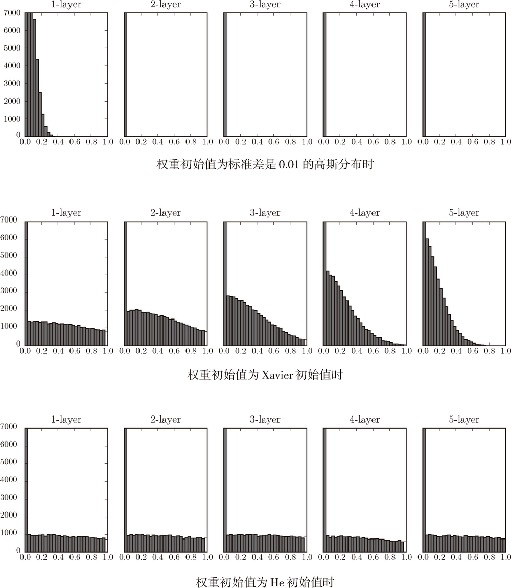
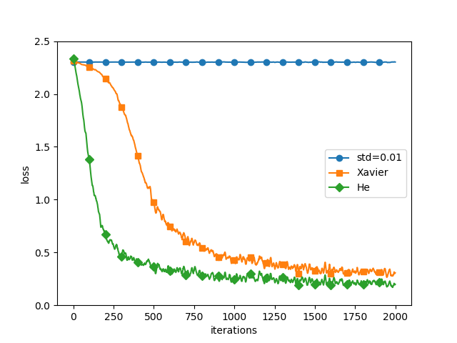
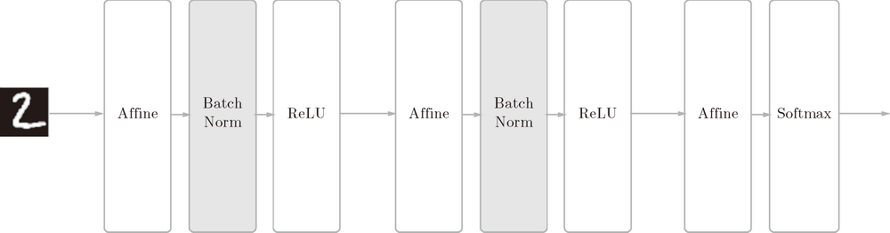
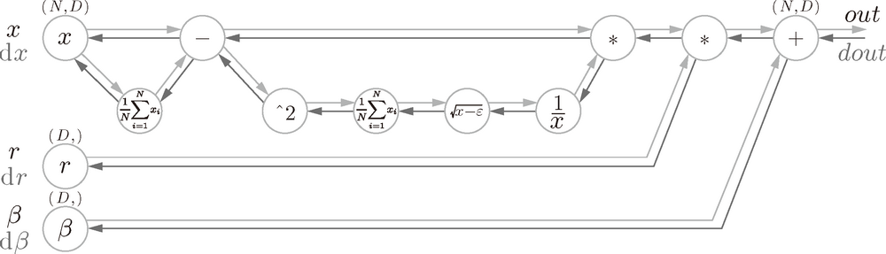
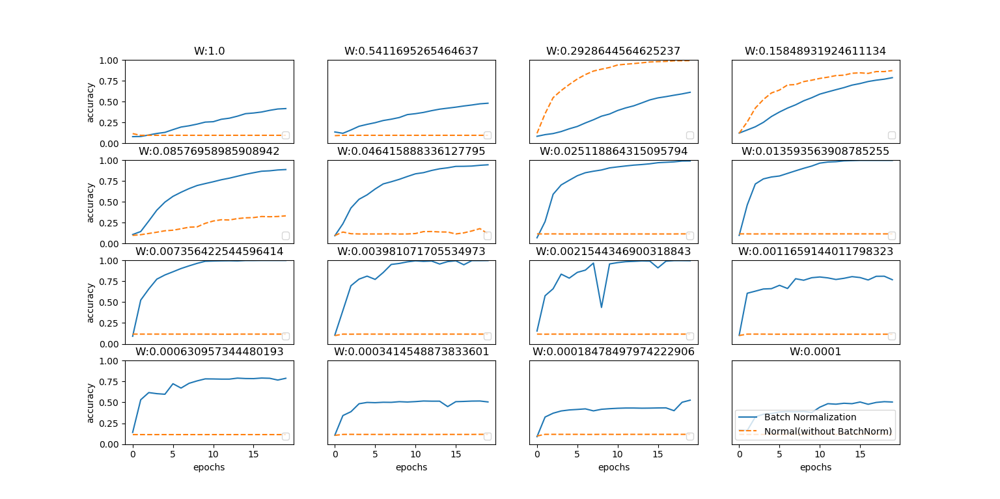
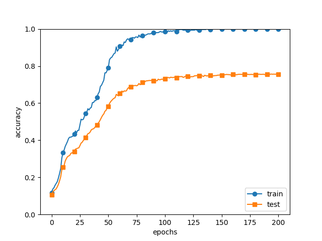
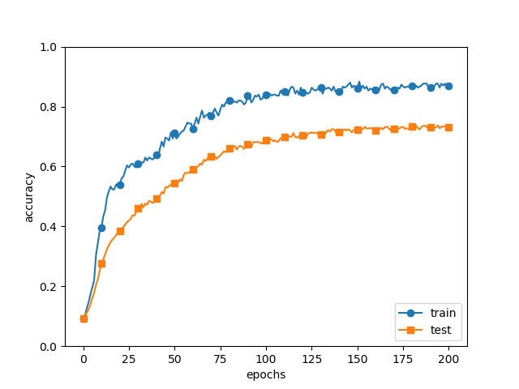
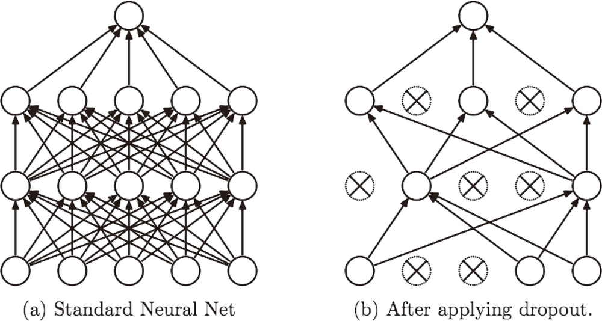
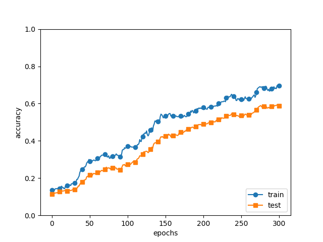

# Basic


<!-- TOC -->

- [Basic](#basic)
    - [0. 思想](#0-思想)
        - [SGD 的设计很丰满，但现实有些骨感](#sgd-的设计很丰满但现实有些骨感)
    - [1. 参数的更新](#1-参数的更新)
        - [1.1 SGD](#11-sgd)
            - [将 SGD 实现为类](#将-sgd-实现为类)
            - [SGD 的缺点——梯度方向并不是目的地方向](#sgd-的缺点梯度方向并不是目的地方向)
        - [1.2 Momentum](#12-momentum)
            - [SGD 没有 “动量”](#sgd-没有-动量)
            - [给 SGD 加上 “动量”](#给-sgd-加上-动量)
            - [“动量” 对 $x$ 和 $y$ 两个分量的影响](#动量-对-x-和-y-两个分量的影响)
            - [数学式](#数学式)
            - [Python 实现](#python-实现)
            - [如果函数的形状均向的](#如果函数的形状均向的)
        - [1.3 AdaGrad](#13-adagrad)
            - [动态调整学习率](#动态调整学习率)
            - [数学式](#数学式-1)
            - [Python 实现](#python-实现-1)
            - [RMSProp 方法防治 $\boldsymbol{h}$ 减少到 0](#rmsprop-方法防治-\boldsymbolh-减少到-0)
        - [1.4 Adam](#14-adam)
        - [1.5 基于 MNIST 数据集的更新方法的比较](#15-基于-mnist-数据集的更新方法的比较)
    - [2. 权重的初始值](#2-权重的初始值)
        - [2.1 可以将权重初始值设为 0 吗](#21-可以将权重初始值设为-0-吗)
        - [2.2 隐藏层的激活值的分布](#22-隐藏层的激活值的分布)
            - [2.2.1 梯度消失](#221-梯度消失)
            - [2.2.2 “表现力受限”](#222-表现力受限)
            - [2.2.3 Xavier 初始值](#223-xavier-初始值)
                - [`tanh` 函数](#tanh-函数)
        - [2.3 ReLU 的权重初始值](#23-relu-的权重初始值)
            - [2.3.1 不同初始值时，激活函数使用 ReLU 时激活值的分布](#231-不同初始值时激活函数使用-relu-时激活值的分布)
    - [3. Batch Normalization](#3-batch-normalization)
        - [3.1 Batch Normalization 的算法](#31-batch-normalization-的算法)
        - [3.2 Batch Normalization的评估](#32-batch-normalization的评估)
    - [4. 正则化](#4-正则化)
        - [4.1 过拟合](#41-过拟合)
        - [4.2 权值衰减 不懂](#42-权值衰减-不懂)
        - [4.3 Dropout](#43-dropout)
            - [4.3.1 关于集成学习](#431-关于集成学习)
    - [5. 超参数的验证](#5-超参数的验证)
        - [5.1 验证数据](#51-验证数据)
        - [5.2 超参数的最优化](#52-超参数的最优化)
    - [References](#references)

<!-- /TOC -->


## 0. 思想
### SGD 的设计很丰满，但现实有些骨感
1. 要寻找 “谷底”，如果能看到 “谷底” 的方向，那么就可以直接朝着 “谷底” 的方向走就行了。
2. 但现在是看不到 “谷底” 的方向，只能知道当前位置的坡度。所以 SGD 很巧妙的通过不断寻找最陡的方向下降来试图寻找最终的谷底。
3. 粗略的想象，如果我们用很小的步子不断梯度下降，就会知道谷底。但现实是没办法用很小的步子。很小的步子不仅会导致下降的速度过慢，更严重的是会陷入局部极小值。
4. 所以步子不能太小，所以在函数的形状是非均向时，就会出现明显的低效。


## 1. 参数的更新
### 1.1 SGD
$\boldsymbol{W}\leftarrow\boldsymbol{W}-\eta\frac{\partial L}{\partial\boldsymbol{W}}$

#### 将 SGD 实现为类
1. Python 实现
    ```py
    class SGD:
        def __init__(self, lr=0.01):
            self.lr = lr #  learning rate

        def update(self, params, grads):
            for key in params.keys():
                params[key] -= self.lr * grads[key]
    ```
2. 使用这个 SGD 类，可以按如下方式进行神经网络的参数的更新
    ```py
    network = TwoLayerNet(...)
    optimizer = SGD()

    for i in range(10000):
        ...
        x_batch, t_batch = get_mini_batch(...) # mini-batch
        grads = network.gradient(x_batch, t_batch)
        params = network.params
        optimizer.update(params, grads)
        ...
    ```

#### SGD 的缺点——梯度方向并不是目的地方向
1. 我们来思考一下求下面这个函数的最小值的问题

    $$f(x,y)=\frac{1}{20}x^2+y^2$$

2. 该函数的图像和函数值大小等高线如下图
    
3. 可以直观的看出来，在大多数地方，y 的偏导都明显大于 x。通过等高线也能看出来，沿着 y 轴方向变化可以很高效的改变函数值，而沿着 x 轴变化则没那么容易。
4. 如果用图表示梯度的话，则如下图所示
    
5. 这个梯度的特征是，在大多数的地方，y 轴方向上梯度大，x 轴方向上梯度小。换句话说，就是 y 轴方向的坡度大，而 x 轴方向的坡度小。
6. 这里需要注意的是，虽然函数的最小值在 $(x, y) = (0, 0)$ 处，但是上图中的梯度在很多地方并没有指向 `(0, 0)`。
7. 这也就是 SGD 的问题：某个位置的梯度只是指向了当前位置函数减小最多的方向，但只是对当前位置而言，而不是整体的目的地而言。
7. 考虑函数图像中高处左侧的一点，当前 y 的梯度是一个比较大的值，而 x 的梯度是一个比较小的值，这类似于在该点所有的两个方向的力。
8. 类似合力的规则，可以知道本次移动在 y 轴方向上移动的比较多，而在 x 轴方向上移动的比较下。也就是说在该点的 "合力" 梯度会指向竖直向下然后稍微向右偏一点点的，因为这个方向的改变会使得本次移动函数值减少最多。但其实如果它够智能，那就应该朝着原点的方向移动，这样才能尽快的到达真正的目的地。
9. 也就是说，每个位置的梯度下降，只是实现了自己眼前的利益最大化，而没有从全局来考虑。
10. 我们来尝试对这个函数应用 SGD。从 $(x, y) = (-7.0, 2.0)$ 处开始搜索，结果如下图所示
    
11. SGD 呈 “之” 字形移动，因为这种基本竖直的移动，就是对应当前的梯度，这种移动会导致当前位置函数值变化最大。
12. 想象一个在上图函数图像中移动的样子，就像是在 U 型池里，从左侧偏上的一个点开始放手一个小球，在重力的作用下，以及在这个 U 型池的形状约束下，它会不断的荡来荡去，大部分的运动都是在 y 方向轴上来回往返，但每次在 x 轴方向上只会移动一点点。
13. 也就是说，SGD 的缺点是，如果函数的形状非均向（anisotropic），比如呈延伸状，搜索的路径就会非常低效。
14. 从上图看，其实如果它每次少移动一点，其实反而会更高效，可以粒度更细的确定梯度，而不是像现在这样用一个不高效的梯度一下就走了那么远。不知道有没有针对这种情况的优化。

### 1.2 Momentum
#### SGD 没有 “动量”
1. 从百度百科看到一句动量的描述：一个物体的动量指的是这个物体在它运动方向上保持运动的趋势。
2. SGD 的梯度下降的距离，是我通过 $\eta\frac{\partial L}{\partial\boldsymbol{W}}$ 指定的，它运动了这么远之后，就立刻停下来，并不会继续滑动知道静止。
3. 也就是说，我命令的下降结束后，它因为没有动量，所以不会保持运动。它不会继续下降，也不会缓缓减速，而是立刻停止。
4. 而这正是 SGD 的特点，按照最陡的方向下降一点，就立刻停止，然后再次寻找当前位置最陡的方向。如果有了动量，那么运动一小段之后继续滑行，滑行的方向大概率就不是最陡的方向了。
5. SGD 就是要尽量沿着每个位置的最陡方向——也就是梯度方向——移动，所以 SGD 不能有动量。
6. 再看前面 U 型池的例子，对于 SGD 的情况，其实滑板并不是在重力的作用下反复运动的，而是在 $\eta\frac{\partial L}{\partial\boldsymbol{W}}$ 的明确命令下。想象成手指滑板更准确，手指滑板中，可以认为重力是不存在的，运动都是由明确的由人指定开始和停止的，动量几乎可以忽略不计。

#### 给 SGD 加上 “动量”
1. 上面说到手指滑板其实也有动量，但几乎可以忽略。Momentum 方法就是在每次梯度下降时，叠加上一个大到不能忽略的 “动量”。
2. 继续想象前面手指滑板 U 型池的情况，假设现在操纵滑板的手指还是按照 SGD 的方式和力量操纵滑板一次次的滑动（梯度下降）。但是，在每次梯度下降的时候，都会加上一个比当前动量小一点的动量。
3. 想象当手指操纵滑板滑到一个最高点时，此时手指将要控制滑板向下（梯度下降），但在此时加上了动量，这个动量有保持滑板继续向上的趋势。但这个动量并不是此时真正的动量大小，而是要小一写，这样这个动量就不会完全抵消手指向下的施力，滑板还是可以掉头进行下一次的梯度下降。
4. 此时滑板仍然会向下（梯度下降），但是因为有了这个反方向的动量，所以这一次梯度下降的作用就被削弱了，就不会下降的那么多。
5. 同样，本次滑动到对面的一个最高点时，又加上了一个基于此时的动量大小担忧小一些的动量。于是下一次的梯度下降的强度又被削弱了。
6. 可以想象，本来这个滑板可以在 U 型池里荡很多下，但因为有了动量的假如，荡不了几下就会停下来。

#### “动量” 对 $x$ 和 $y$ 两个分量的影响
1. 上面分析的动量的影响，是在梯度下降反复变向的情况下的。每次变到反方向时，动量都会给这一次的梯度下降产生一个 “阻力”。按照上面的例子，对于 $y$ 分量，每次梯度下降时，动量都是起到削弱的作用。
2. 那么对于 $x$ 分量，因为每次梯度下降时方向都是相同的，也就是说每次加上的动量都是和梯度下降的方向相同，起到了正向的叠加作用。
3. 所以，引入动量后，会不断抑制 $y$ 方向的下降，同时增强 $x$ 方向的下降。这样，在整体寻找最小值的过程中，之前反复的 $y$ 方向震荡就会很快的逼近 $y$ 轴零点，而之前缓慢的 $x$ 方向移动就会加快。如下图所示
    

#### 数学式
$$\boldsymbol{v}\leftarrow\alpha\boldsymbol{v}-\eta\frac{\partial L}{\partial\boldsymbol{W}}$$
$$\boldsymbol{W}\leftarrow\boldsymbol{W}+\boldsymbol{v}$$

1. $\alpha\boldsymbol{v}$ 就是每次加的动量。可以看到，如果不加动量，则梯度下降是和 SGD 一样的。
2. 因为每次梯度下降时的动量都是基于当前 “速度” 的，所以第一个式子是会基于当前的 $\boldsymbol{v}$ 计算下一次梯度下降时的 $\boldsymbol{v}$。
3. 第一次下降时，是从静止开始，$\boldsymbol{v}$ 是 $0$ ，所以只有普通的梯度下降，没有动量。
4. 第二次下降时，$\alpha\boldsymbol{v}-\eta\frac{\partial L}{\partial\boldsymbol{W}}$ 中的 $\boldsymbol{v}$ 就是上一次梯度下降的值。
5. 从方向上来说，对于 $y$ 轴方向，$\boldsymbol{v}$ 和本次将要进行的梯度下降（$-\eta\frac{\partial L}{\partial\boldsymbol{W}}$）方向相反；对于 $x$ 轴方向，两者的方向相同。
6. 从绝对值来说，$\boldsymbol{v}$ 的绝对值要大于 $-\eta\frac{\partial L}{\partial\boldsymbol{W}}$。乘以一个小于 1 的系数 $\alpha$ （设定为 0.9 之类的值）后，会小于 $-\eta\frac{\partial L}{\partial\boldsymbol{W}}$。TODO，代码运行测试。
7. 因此，在 $y$ 轴方向上，因为方向相反，所以会对下一次的梯度下降起到抑制的作用；而在 $x$ 轴方向上，因为方向相同，所以会抑制叠加促进作用。
8. TODO 每次梯度下降本身的下降值都会减小，虽然动量也乘了一个小于一的系数，但有没有可能，梯度下降的值仍然小于这个动量，导致动量比梯度下降更大了？

#### Python 实现
```py
class Momentum:
    def __init__(self, lr=0.01, momentum=0.9):
        self.lr = lr
        self.momentum = momentum
        self.v = None

    def update(self, params, grads):
        if self.v is None:
            self.v = {}
            for key, val in params.items():
                self.v[key] = np.zeros_like(val)

        for key in params.keys():
            self.v[key] = self.momentum*self.v[key] - self.lr*grads[key]
            params[key] += self.v[key]
```


#### 如果函数的形状均向的
1. 可以看到，在函数的形状是非均向时，momentum 的梯度下降比 SGD 效率要好，那如果是均向的呢？
2. 虽然不是很确定，但是看起来，如果是均向的，那么就不会出现在某个轴向上明显的正负震荡的情况。
3. 那么此时在大多数情况下，一个方向上的运动大多数时候要么都是在正方向逼近 0 要么就都是在负方向逼近 0。
4. 因为没有方向变换，所以向量就是起到促进加速的作用的。

### 1.3 AdaGrad
#### 动态调整学习率
1. 在神经网络的学习中，学习率（$η$）的值很重要。学习率过小，会导致学习花费过多时间；反过来，学习率过大，则会导致学习发散而不能正确进行。
2. 在关于学习率的有效技巧中，有一种被称为 **学习率衰减**（learning rate decay）的方法，即随着学习的进行，使学习率逐渐减小。实际上，一开始 “多” 学，然后逐渐 “少” 学的方法，在神经网络的学习中经常被使用。
3. 逐渐减小学习率的想法，相当于将 “全体” 参数的学习率值一起降低。而 **AdaGrad** 进一步发展了这个想法，针对 “一个一个” 的参数，赋予其 “定制” 的值。
4. AdaGrad 会为参数的每个元素适当地调整学习率，与此同时进行学习（AdaGrad 的 Ada 来自英文单词 Adaptive）。

#### 数学式
$$\boldsymbol{h}\leftarrow\boldsymbol{h}+\frac{\partial L}{\partial\boldsymbol{W}}\odot\frac{\partial L}{\partial\boldsymbol{W}}$$
$$\boldsymbol{W}\leftarrow\boldsymbol{W}-\eta\frac{1}{\sqrt{\boldsymbol{h}}}\frac{\partial L}{\partial\boldsymbol{W}}$$

1. 变量 $\boldsymbol{h}$ 保存了以前的所有梯度值的平方和（$\odot$ 表示对应矩阵元素的乘法）。
2. 然后，在更新参数时，通过乘以 $\frac{1}{\sqrt{\boldsymbol{h}}}$，就可以调整学习的尺度。
3. 随着学习的不断进行，$\boldsymbol{h}$ 会越来越大，实际的学习率就会越来越小。
    
4. 而且，之前学习率越大的参数，实际学习率减小的就越快。
5. 比如说前面例子的 y 轴参数，开始的时候因为梯度绝对值很大，本来会按照 SGD 那样大幅下降。但因为此时它的 $\boldsymbol{h}$ 也很大，所以就明显削弱了下降效果。
6. 另外还有一点就是，如果某个参数在某个位置时 $\boldsymbol{h}$ 小于 1，那么实际上 $\boldsymbol{h}$ 会增大下一次的学习率。
7. 比如上图第一次下降时，本来 x 轴方向的梯度是小于 1 的，因此如果按照 SGD 只会向右移动一点。但因为此时它的 $\boldsymbol{h}$ 会变成一个明显大于 1 的数，所以向右移动的就比较明显了。

#### Python 实现
```py
class AdaGrad:
    def __init__(self, lr=0.01):
        self.lr = lr
        self.h = None

    def update(self, params, grads):
        if self.h is None:
           self.h = {}
           for key, val in params.items():
               self.h[key] = np.zeros_like(val)

        for key in params.keys():
            self.h[key] += grads[key] * grads[key]
            params[key] -= self.lr * grads[key] / (np.sqrt(self.h[key]) + 1e-7)
```

1. 这里需要注意的是，最后一行加上了微小值 `1e-7`。这是为了防止当 `self.h[key]` 中有 0 时，将 0 用作除数的情况。
2. 在很多深度学习的框架中，这个微小值也可以设定为参数。

#### RMSProp 方法防治 $\boldsymbol{h}$ 减少到 0
1. AdaGrad 会记录过去所有梯度的平方和。因此，学习越深入，更新的幅度就越小。实际上，如果无止境地学习，更新量就会变为 0，完全不再更新。
2. 为了改善这个问题，可以使用 RMSProp 方法。RMSProp 方法并不是将过去所有的梯度一视同仁地相加，而是逐渐地遗忘过去的梯度，在做加法运算时将新梯度的信息更多地反映出来。
3. 这种操作从专业上讲，称为 “指数移动平均”，呈指数函数式地减小过去的梯度的尺度。

### 1.4 Adam

### 1.5 基于 MNIST 数据集的更新方法的比较
1. 这个实验以一个 5 层神经网络为对象，其中每层有 100 个神经元。激活函数使用的是 ReLU。
2. 源码在 `./demos/optimizer_compare_mnist.py`。测试代码
    ```py
    # 0:读入MNIST数据==========
    (x_train, t_train), (x_test, t_test) = load_mnist(normalize=True)

    train_size = x_train.shape[0]
    batch_size = 128
    max_iterations = 2000


    # 1:进行实验的设置==========
    optimizers = {}
    optimizers['SGD'] = SGD()
    optimizers['Momentum'] = Momentum()
    optimizers['AdaGrad'] = AdaGrad()
    optimizers['Adam'] = Adam()
    #optimizers['RMSprop'] = RMSprop()

    networks = {}
    train_loss = {}
    for key in optimizers.keys():
        networks[key] = MultiLayerNet(
            input_size=784, hidden_size_list=[100, 100, 100, 100],
            output_size=10)
        train_loss[key] = []    


    # 2:开始训练==========
    for i in range(max_iterations):
        batch_mask = np.random.choice(train_size, batch_size)
        x_batch = x_train[batch_mask]
        t_batch = t_train[batch_mask]
        
        for key in optimizers.keys():
            grads = networks[key].gradient(x_batch, t_batch)
            optimizers[key].update(networks[key].params, grads)
        
            loss = networks[key].loss(x_batch, t_batch)
            train_loss[key].append(loss)
        
        if i % 100 == 0:
            print( "===========" + "iteration:" + str(i) + "===========")
            for key in optimizers.keys():
                loss = networks[key].loss(x_batch, t_batch)
                print(key + ":" + str(loss))


    # 3.绘制图形==========
    markers = {"SGD": "o", "Momentum": "x", "AdaGrad": "s", "Adam": "D"}
    x = np.arange(max_iterations)
    for key in optimizers.keys():
        plt.plot(x, smooth_curve(train_loss[key]), marker=markers[key], markevery=100, label=key)
    plt.xlabel("iterations")
    plt.ylabel("loss")
    plt.ylim(0, 1)
    plt.legend()
    plt.show()
    ```
3. 输出
    ```sh
    ===========iteration:0===========
    SGD:2.364396210789146
    Momentum:2.4261217609322223
    AdaGrad:2.16233190366153
    Adam:2.1661379304797
    ===========iteration:100===========
    SGD:1.601901336213604
    Momentum:0.33852454157953293
    AdaGrad:0.15668511172030972
    Adam:0.24641438197582696
    ===========iteration:200===========
    SGD:0.7393239598895716
    Momentum:0.17921059986376953
    AdaGrad:0.10122272612654373
    Adam:0.17239291868891393
    ===========iteration:300===========
    SGD:0.5404846036953992
    Momentum:0.16180479904047199
    AdaGrad:0.056495541355878795
    Adam:0.09364112561863941
    ===========iteration:400===========
    SGD:0.402306100952132
    Momentum:0.1509189413549606
    AdaGrad:0.07641001538530545
    Adam:0.12163857898874754
    ===========iteration:500===========
    SGD:0.4880400590934778
    Momentum:0.27585848041696853
    AdaGrad:0.11990903582422144
    Adam:0.18868752650931356
    ===========iteration:600===========
    SGD:0.24947051968119136
    Momentum:0.07308552129379102
    AdaGrad:0.03620177981793199
    Adam:0.03714246759185307
    ===========iteration:700===========
    SGD:0.22857651628931547
    Momentum:0.07979241338942146
    AdaGrad:0.03937541573984139
    Adam:0.039893350873912894
    ===========iteration:800===========
    SGD:0.2605554156718135
    Momentum:0.13450934429900124
    AdaGrad:0.051321940992241785
    Adam:0.05911354829085156
    ===========iteration:900===========
    SGD:0.28081470144087645
    Momentum:0.08644721475741925
    AdaGrad:0.04290114330243809
    Adam:0.0769565489434546
    ===========iteration:1000===========
    SGD:0.22098605072297728
    Momentum:0.07739233872168308
    AdaGrad:0.048948428590088744
    Adam:0.0651119742118878
    ===========iteration:1100===========
    SGD:0.19547780230994916
    Momentum:0.07105618859069646
    AdaGrad:0.05777807847387521
    Adam:0.06458094319080315
    ===========iteration:1200===========
    SGD:0.2076861046482508
    Momentum:0.06838910309773819
    AdaGrad:0.015910327664932965
    Adam:0.05445698620367115
    ===========iteration:1300===========
    SGD:0.2968531021215531
    Momentum:0.1209324520069992
    AdaGrad:0.07006251602589637
    Adam:0.07763953789008499
    ===========iteration:1400===========
    SGD:0.2501930116366662
    Momentum:0.08023199786631298
    AdaGrad:0.030748186319871106
    Adam:0.022148843866858833
    ===========iteration:1500===========
    SGD:0.24713199194592703
    Momentum:0.09090543059097704
    AdaGrad:0.054440722050496895
    Adam:0.061407984164772444
    ===========iteration:1600===========
    SGD:0.22097165571998878
    Momentum:0.052704326085007136
    AdaGrad:0.021394664280808284
    Adam:0.043184760575209466
    ===========iteration:1700===========
    SGD:0.24074511157011802
    Momentum:0.09980322090754362
    AdaGrad:0.06024174907732138
    Adam:0.04353083286248491
    ===========iteration:1800===========
    SGD:0.24732756833521186
    Momentum:0.0811026151474386
    AdaGrad:0.030369929181226964
    Adam:0.036395466746393115
    ===========iteration:1900===========
    SGD:0.24498889914749805
    Momentum:0.125026293687864
    AdaGrad:0.03430576539406276
    Adam:0.0635555903617698
    ```
4. 结果比较
    
5. 上图的结果中可知，与 SGD 相比，其他 3 种方法学习得更快，而且速度基本相同，仔细看的话，AdaGrad 的学习进行得稍微快一点。
6. 这个实验需要注意的地方是，实验结果会随学习率等超参数、神经网络的结构（几层深等）的不同而发生变化。不过，一般而言，与 SGD 相比，其他 3 种方法可以学习得更快，有时最终的识别精度也更高。


## 2. 权重的初始值
### 2.1 可以将权重初始值设为 0 吗
1. 后面我们会介绍抑制过拟合、提高泛化能力的技巧——权值衰减（weight decay）。简单地说，权值衰减就是一种以减小权重参数的值为目的进行学习的方法。通过减小权重参数的值来抑制过拟合的发生。
2. 如果想减小权重的值，一开始就将初始值设为较小的值才是正途。那么如果我们把权重初始值全部设为 0 以减小权重的值，会怎么样呢？
3. 从结论来说，将权重初始值设为 0 不是一个好主意。事实上，将权重初始值设为 0 的话，将无法正确进行学习。
4. 为什么不能将权重初始值设为 0 呢？严格地说，为什么不能将权重初始值设成一样的值呢？
5. 这是因为在误差反向传播法中，所有的权重值都会进行相同的更新。
6. 比如，在 2 层神经网络中，假设第 1 层和第 2 层的权重为 0。这样一来，正向传播时，因为输入层的权重为 0，经过第一个 affine 层后，输出的每个值都是一样的，都是偏置的值，所以第 2 层的神经元中全部输入相同的值。
7. 这意味着，反向传播时第 2 层的权重全部都会进行相同值的更新。因此，权重被更新为相同的值，并拥有了对称的值（重复的值）。这使得神经网络拥有许多不同的权重的意义丧失了，因为最优的权重肯定不会是对称的。
8. 为了防止 “权重均一化”（严格地讲，是为了瓦解权重的对称结构），必须随机生成初始值。

### 2.2 隐藏层的激活值的分布
1. 我们来做一个简单的实验，观察权重初始值是如何影响隐藏层的激活值的分布的。
2. 这里要做的实验是，向一个 5 层神经网络（激活函数使用 sigmoid 函数）传入随机生成的输入数据，用直方图绘制各层激活值的数据分布。
3. 这里假设神经网络有 5 层，每层有 100 个神经元。然后，用高斯分布随机生成 1000 个数据作为输入数据，并把它们传给 5 层神经网络。

#### 2.2.1 梯度消失
1. 首先试验对权重使用标准差为 1 的高斯分布，
    ```py
    w = np.random.randn(node_num, node_num) * 1
    ```
2. 得到 5 层神经网络激活值的分布
    
3. 可以看到，各层的激活值呈偏向 0 和 1 的分布，说明在当前标准差较大的权重设定下，仿射层计算震动比较剧烈，导致结果都拥有很大的绝对值。
4. 应为是 sigmoid 函数，所以随着激活值不断地靠近 0 或 1，它的导数的值逐渐接近 0。
5. 因此，偏向 0 和 1 的数据分布会造成反向传播中梯度的值不断变小，最后消失。这个问题称为 **梯度消失**（gradient vanishing）。
6. 层次加深的深度学习中，梯度消失的问题可能会更加严重。当梯度很小以至趋于消失是，梯度下降应该就会很慢甚至停止吧。

#### 2.2.2 “表现力受限”
1. 现在对权重使用标准差为 0.01 的高斯分布，
    ```py
    w = np.random.randn(node_num, node_num) * 0.01
    ```
2. 得到 5 层神经网络激活值的分布
    
3. 可以看到，这次各层的激活值呈集中在 0.5 附近的分布。说明在当前标准差较小的权重设定下，仿射层计算震动比较小，导致结果都拥有很小的绝对值。
4. 因为不像刚才的例子那样偏向 0 和 1，所以不会发生梯度消失的问题。但是，激活值的分布有所偏向，说明在表现力上会有很大问题。
5. 为什么这么说呢？因为如果有多个神经元都输出几乎相同的值，那它们就没有存在的意义了。比如在 `Theories\AI\NeuralNetwork\Basic.md` “神经网络基本工作模式的例子” 中介绍的情况，必须要有某些神经元体现出不同的值，才能体现出对关键因素的识别。

#### 2.2.3 Xavier 初始值
1. 接着，我们尝试使用 Xavier Glorot 等人的论文中推荐的权重初始值（俗称“Xavier 初始值”）。现在，在一般的深度学习框架中，Xavier 初始值已被作为标准使用。
2. Xavier 的论文中，为了使各层的激活值呈现出具有相同广度的分布，推导了合适的权重尺度。推导出的结论是，如果前一层的节点数为 `n`，则初始值使用标准差为 `\frac{1}{\sqrt{n}}` 的分布
    ```py
    w = np.random.randn(node_num, node_num) * np.sqrt(node_num)
    ```
3. 使用 Xavier 初始值后，前一层的节点数越多，要设定为目标节点的初始值的权重尺度就越小。
4. 得到 5 层神经网络激活值的分布
    
5. 从这个结果可知，越是后面的层，图像变得越歪斜，但是呈现了比之前更有广度的分布。因为各层间传递的数据有适当的广度，所以 sigmoid 函数的表现力不受限制，有望进行高效的学习。

##### `tanh` 函数
1. 上图的分布中，后面的层的分布呈稍微歪斜的形状。如果用 `tanh` 函数（双曲线函数）代替 `sigmoid` 函数，这个稍微歪斜的问题就能得到改善。
2. 实际上，使用 `tanh` 函数后，会呈漂亮的吊钟型分布。`tanh` 函数和 `sigmoid` 函数同是 S 型曲线函数，但 `tanh` 函数是关于原点 $(0, 0)$ 对称的 S 型曲线，而 `sigmoid` 函数是关于 $(x, y)=(0, 0.5)$ 对称的 S 型曲线。
3. 众所周知，用作激活函数的函数最好具有关于原点对称的性质。不懂

### 2.3 ReLU 的权重初始值
1. Xavier 初始值是以激活函数是线性函数为前提而推导出来的。因为 `sigmoid` 函数和 `tanh` 函数左右对称，且中央附近可以视作线性函数，所以适合使用 Xavier 初始值。
2. 但当激活函数使用 ReLU 时，一般推荐使用 ReLU 专用的初始值，也就是 Kaiming He 等人推荐的初始值，也称为“He 初始值”。
3. 当前一层的节点数为 `n` 时，He 初始值使用标准差为 $\sqrt{\frac{2}{n}}$ 的高斯分布。
4. 不懂。当 Xavier 初始值是 $\sqrt{\frac{2}{n}}$ 时，（直观上）可以解释为，因为 ReLU 的负值区域的值为 0，为了使它更有广度，所以需要 2 倍的系数。

#### 2.3.1 不同初始值时，激活函数使用 ReLU 时激活值的分布


1. 观察实验结果可知，当 $std = 0.01$ 时，各层的激活值非常小。神经网络上传递的是非常小的值，说明逆向传播时权重的梯度也同样很小。这是很严重的问题，实际上学习基本上没有进展。
2. 接下来是初始值为 Xavier 初始值时的结果。在这种情况下，随着层的加深，偏向一点点变大。实际上，层加深后，激活值的偏向变大，学习时会出现梯度消失的问题。
3. 而当初始值为 He 初始值时，各层中分布的广度相同。由于即便层加深，数据的广度也能保持不变，因此逆向传播时，也会传递合适的值。
4. 基于 MNIST 数据集的权重初始值的比较，源码在 `./demos/weight_init_compare.py`
    


## 3. Batch Normalization
### 3.1 Batch Normalization 的算法
1. Batch Normalization（下文简称 Batch Norm） 有以下优点。
    * 可以使学习快速进行（可以增大学习率）。
    * 不那么依赖初始值（对于初始值不用那么神经质）。
    * 抑制过拟合（降低 Dropout 等的必要性）。
2. Batch Norm） 的思路是调整各层的激活值分布使其拥有适当的广度。为此，要向神经网络中插入对数据分布进行正规化的层，即 Batch Norm） 层
    
3. Batch Norm，顾名思义，以进行学习时的 mini-batch 为单位，按 mini-batch 进行正规化。具体而言，就是进行使数据分布的均值为 0、方差为 1 的正规化。用数学式表示的话，如下所示。

    $$
    \begin{aligned}\mu_B&\leftarrow\frac{1}{m}\sum^m_{i=1}x_i\\\sigma^2_B&\leftarrow\frac{1}{m}\sum^m_{i=1}(x_i-\mu_B)^2\\\hat{x}_i&\leftarrow\frac{x_i-\mu_B}{\sqrt{\sigma^2_B+\varepsilon}}\end{aligned}
    $$

4. 这里对 mini-batch 的 m 个输入数据的集合 $B=\{x_1,x_2\cdots,x_m\}$ 求均值 $\mu_B$ 和方差 $\sigma^2_B$。然后，对输入数据进行均值为 0、方差为 1（合适的分布）的正规化。
5. $ε$ 是一个微小值（比如，10e-7 等），它是为了防止出现除以 0 的情况。
6. 通过将这个处理插入到激活函数的前面（或者后面），可以减小数据分布的偏向。
7. 接着，Batch Norm 层会对正规化后的数据进行缩放和平移的变换，用数学式可以如下表示。

    $$
    y_i\leftarrow\gamma\hat{x}_i+\beta
    $$

8. 这里，γ 和 β 是参数。一开始 γ = 1，β = 0，然后再通过学习调整到合适的值。
9. 上面就是 Batch Norm 的算法。这个算法是神经网络上的正向传播。如果使用计算图，Batch Norm 可以表示为
    
10. Batch Norm 的反向传播的推导有些复杂，Frederik Kratzert 的博客 “Understanding the backward pass through Batch Normalization Layer” 里有详细说明。

### 3.2 Batch Normalization的评估


1. 实线是使用了 Batch Norm 时的结果，虚线是没有使用 Batch Norm 时的结果，源码在 `./demos/batch_norm_test.py`。
2. 通过使用 Batch Norm，可以推动学习的进行。并且，对权重初始值变得健壮（“对初始值健壮” 表示不那么依赖初始值）。


## 4. 正则化
1. 机器学习的问题中，过拟合是一个很常见的问题。过拟合指的是只能拟合训练数据，但不能很好地拟合不包含在训练数据中的其他数据的状态。
2. 机器学习的目标是提高泛化能力，即便是没有包含在训练数据里的未观测数据，也希望模型可以进行正确的识别。
3. 我们可以制作复杂的、表现力强的模型，但是相应地，抑制过拟合的技巧也很重要。

### 4.1 过拟合
1. 发生过拟合的原因，主要有以下两个。
    * 模型拥有大量参数、表现力强。
    * 训练数据少。
2. 这里，我们故意满足这两个条件，制造过拟合现象。为此，要从 MNIST 数据集原本的 60000 个训练数据中只选定 300 个，并且，为了增加网络的复杂度，使用 7 层网络（每层有 100 个神经元，激活函数为 ReLU）。
3. 源码在 `./demos/overfit_weight_decay.py`。注意和下面的权值衰减用的同一套代码，只不过控制衰减的超参数 `weight_decay_lambda` 设置为了 0
    
4. 过了 100 个 epoch 左右后，用训练数据测量到的识别精度几乎都为 100%。但是，对于测试数据，离 100% 的识别精度还有较大的差距。
5. 如此大的识别精度差距，是只拟合了训练数据的结果。从图中可知，模型对训练时没有使用的一般数据（测试数据）拟合得不是很好。

### 4.2 权值衰减 不懂
1. 权值衰减是一直以来经常被使用的一种抑制过拟合的方法。该方法通过在学习的过程中对大的权重进行惩罚，来抑制过拟合。很多过拟合原本就是因为权重参数取值过大才发生的。
2. 神经网络的学习目的是减小损失函数的值，这时，例如为损失函数加上权重的平方范数（L2 范数）。这样一来，就可以抑制权重变大。
3. 用符号表示的话，如果将权重记为 $\boldsymbol{W}$，L2 范数的权值衰减就是 $\frac{1}{2}\lambda\boldsymbol{W}^2$，然后将这个 $\frac{1}{2}\lambda\boldsymbol{W}^2$ 加到损失函数上。
4. 这里，$λ$ 是控制正则化强度的超参数。$λ$ 设置得越大，对大的权重施加的惩罚就越重。此外，$\frac{1}{2}\lambda\boldsymbol{W}^2$ 开头的 $\frac{1}{2}$  是用于将 $\frac{1}{2}\lambda\boldsymbol{W}^2$ 的求导结果变成 $\lambda\boldsymbol{W}$ 的调整用常量。
5. 对于所有权重，权值衰减方法都会为损失函数加上 $\frac{1}{2}\lambda\boldsymbol{W}^2$。因此，在求权重梯度的计算中，要为之前的误差反向传播法的结果加上正则化项的导数 $\lambda\boldsymbol{W}$。
6. 比较效果。源码在 `./demos/overfit_weight_decay.py`。注意超参数 `weight_decay_lambda` 要设置为 0.1。
    
7. 虽然训练数据的识别精度和测试数据的识别精度之间有差距，但是与没有使用权值衰减的结果相比，差距变小了。这说明过拟合受到了抑制。
8. 此外，还要注意，训练数据的识别精度没有达到 100%（1.0）。

### 4.3 Dropout
1. 权值衰减方法可以简单地实现，在某种程度上能够抑制过拟合。但是，如果网络的模型变得很复杂，只用权值衰减就难以应对了。在这种情况下，我们经常会使用 Dropout 方法。
2. Dropout 是一种在学习的过程中随机删除神经元的方法。训练时，随机选出隐藏层的神经元，然后将其删除。被删除的神经元不再进行信号的传递，
    
3. 训练时，每传递一次数据，就会随机选择要删除的神经元。然后，测试时，虽然会传递所有的神经元信号，但是对于各个神经元的输出，要乘上训练时的删除比例后再输出。
4. 实现 Dropout
    ```py
    class Dropout:
        def __init__(self, dropout_ratio=0.5):
            self.dropout_ratio = dropout_ratio
            self.mask = None

        def forward(self, x, train_flg=True):
            if train_flg:
                self.mask = np.random.rand(*x.shape) > self.dropout_ratio
                return x * self.mask
            else:
                return x * (1.0 - self.dropout_ratio)

        def backward(self, dout):
            return dout * self.mask
    ```
5. 这里的要点是，每次正向传播时，`self.mask` 中都会以 `False` 的形式保存要删除的神经元。`self.mask` 会随机生成和 x 形状相同的数组，并将值比 `dropout_ratio` 大的元素设为 `True`。
6. 反向传播时的行为和 ReLU 相同。也就是说，正向传播时传递了信号的神经元，反向传播时按原样传递信号；正向传播时没有传递信号的神经元，反向传播时信号将停在那里。
7. 试验。源码在 `./demos/overfit_dropout.py`
    


#### 4.3.1 关于集成学习
1. 机器学习中经常使用集成学习。所谓集成学习，就是让多个模型单独进行学习，推理时再取多个模型的输出的平均值。
2. 用神经网络的语境来说，比如，准备 5 个结构相同（或者类似）的网络，分别进行学习，测试时，以这 5 个网络的输出的平均值作为答案。
3. 实验告诉我们，通过进行集成学习，神经网络的识别精度可以提高好几个百分点。
4. 这个集成学习与 Dropout 有密切的关系。这是因为可以将 Dropout 理解为，通过在学习过程中随机删除神经元，从而每一次都让不同的模型进行学习。
5. 并且，推理时，通过对神经元的输出乘以删除比例（比如，0.5 等），可以取得模型的平均值。不懂
6. 也就是说，可以理解成，Dropout 将集成学习的效果（模拟地）通过一个网络实现了。


## 5. 超参数的验证
1. 神经网络中，除了权重和偏置等参数，超参数（hyper-parameter）也经常出现。这里所说的超参数是指，比如各层的神经元数量、batch 大小、参数更新时的学习率或权值衰减等。
2. 如果这些超参数没有设置合适的值，模型的性能就会很差。
3. 虽然超参数的取值非常重要，但是在决定超参数的过程中一般会伴随很多的试错。

### 5.1 验证数据
1. 之前我们使用的数据集分成了训练数据和测试数据，训练数据用于学习，测试数据用于评估泛化能力。由此，就可以评估是否过度拟合了训练数据（是否发生了过拟合），以及泛化能力如何等。
2. 下面我们要对超参数设置各种各样的值以进行验证。这里要注意的是，不能使用测试数据评估超参数的性能。这一点非常重要，但也容易被忽视。
3. 这是因为如果使用测试数据调整超参数，超参数的值会对测试数据发生过拟合。换句话说，用测试数据确认超参数的值的 “好坏”，就会导致超参数的值被调整为只拟合测试数据。这样的话，可能就会得到不能拟合其他数据、泛化能力低的模型。不懂，使用验证数据不会让超参数只拟合验证数据吗？
4. 因此，调整超参数时，必须使用超参数专用的确认数据。用于调整超参数的数据，一般称为 **验证数据**（validation data）。我们使用这个验证数据来评估超参数的好坏。
5. 训练数据用于参数（权重和偏置）的学习，验证数据用于超参数的性能评估。为了确认泛化能力，要在最后使用（比较理想的是只用一次）测试数据。

### 5.2 超参数的最优化
1. 进行超参数的最优化时，一开始先大致设定一个范围，从这个范围中随机选出一个超参数（采样），用这个采样到的值进行识别精度的评估；然后，多次重复该操作，观察识别精度的结果，根据这个结果缩小超参数的最优的范围。通过重复这一操作，就可以逐渐确定超参数的合适范围。
2. 有报告显示，在进行神经网络的超参数的最优化时，与网格搜索等有规律的搜索相比，随机采样的搜索方式效果更好。这是因为在多个超参数中，各个超参数对最终的识别精度的影响程度不同。
3. 超参数的范围只要 “大致地指定” 就可以了。所谓 “大致地指定”，是指像 0.001（10-3）到 1000（103）这样，以“10 的阶乘” 的尺度指定范围（也表述为 “用对数尺度（log scale）指定”）。
4. 在超参数的最优化中，要注意的是深度学习需要很长时间（比如，几天或几周）。因此，在超参数的搜索中，需要尽早放弃那些不符合逻辑的超参数。于是，在超参数的最优化中，减少学习的 epoch，缩短一次评估所需的时间是一个不错的办法。
5. 这里介绍的超参数的最优化方法是实践性的方法。不过，这个方法与其说是科学方法，倒不如说有些实践者的经验的感觉。在超参数的最优化中，如果需要更精炼的方法，可以使用贝叶斯最优化（Bayesian optimization）。贝叶斯最优化运用以贝叶斯定理为中心的数学理论，能够更加严密、高效地进行最优化。


## References
* [《深度学习入门》](https://book.douban.com/subject/30270959/)