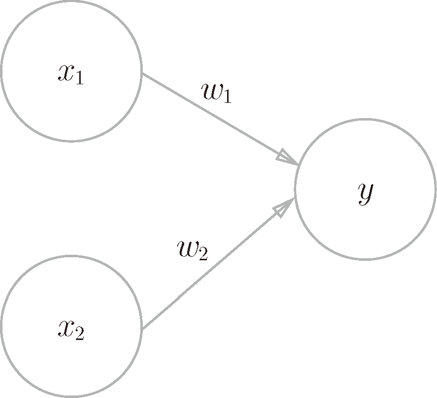
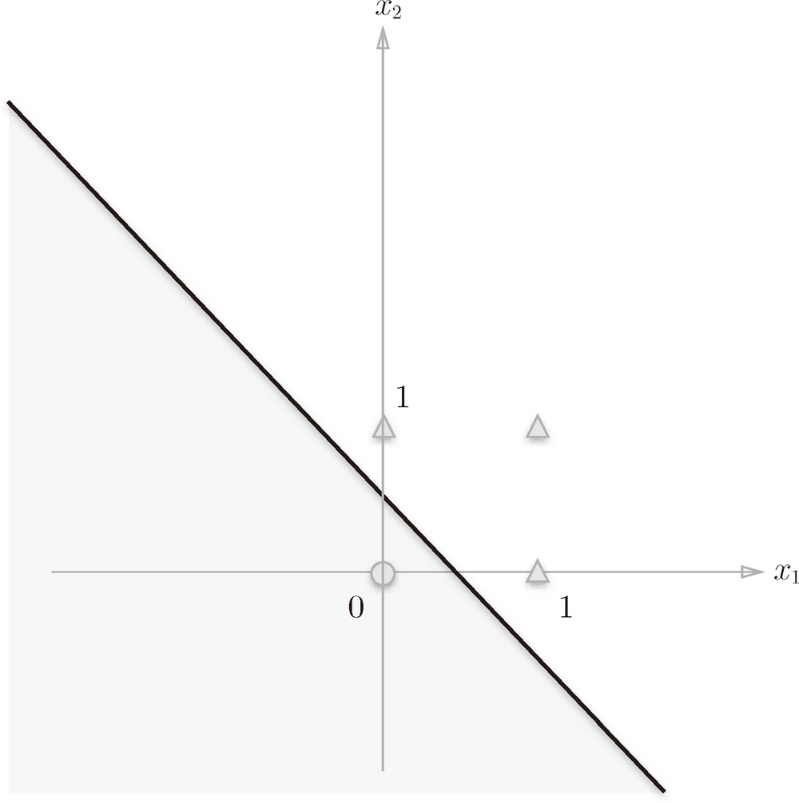
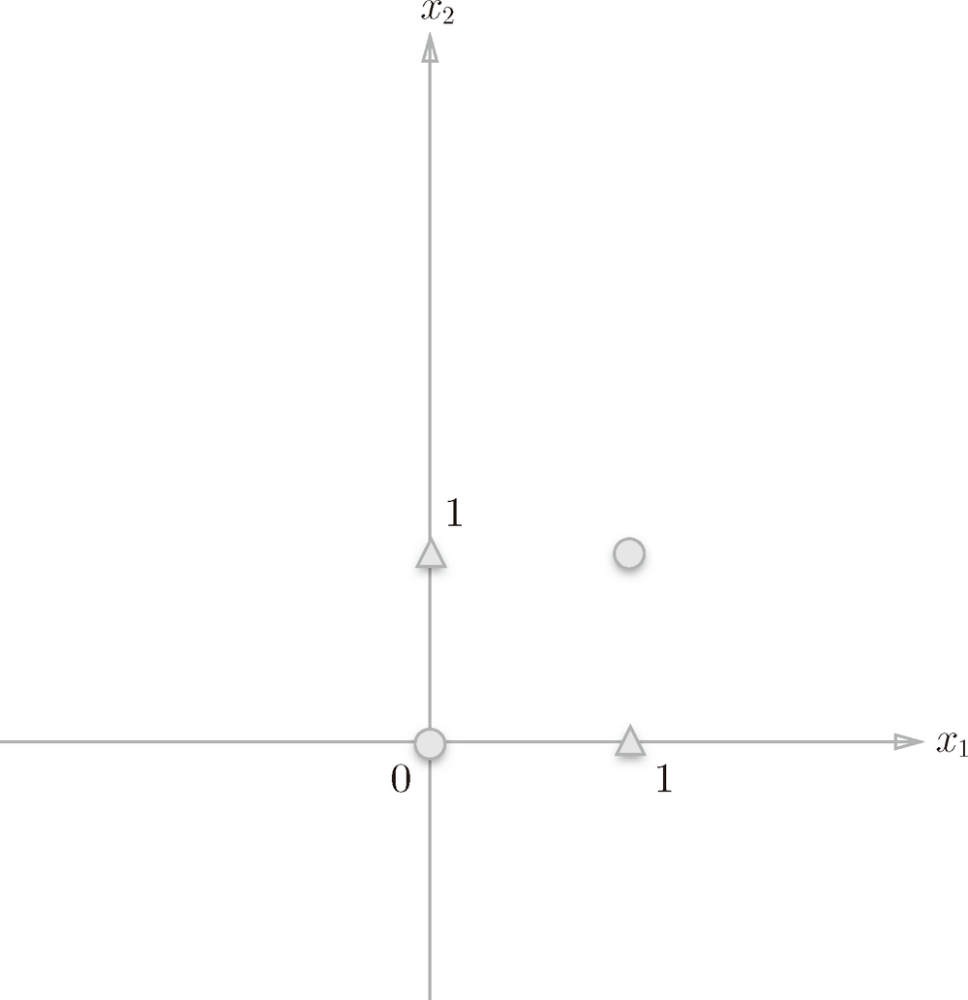
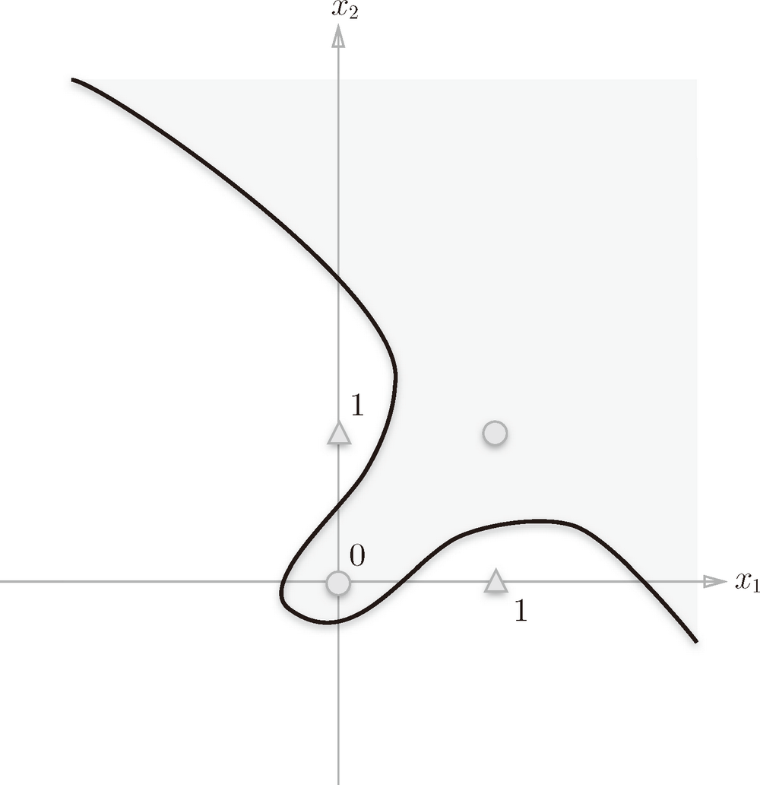
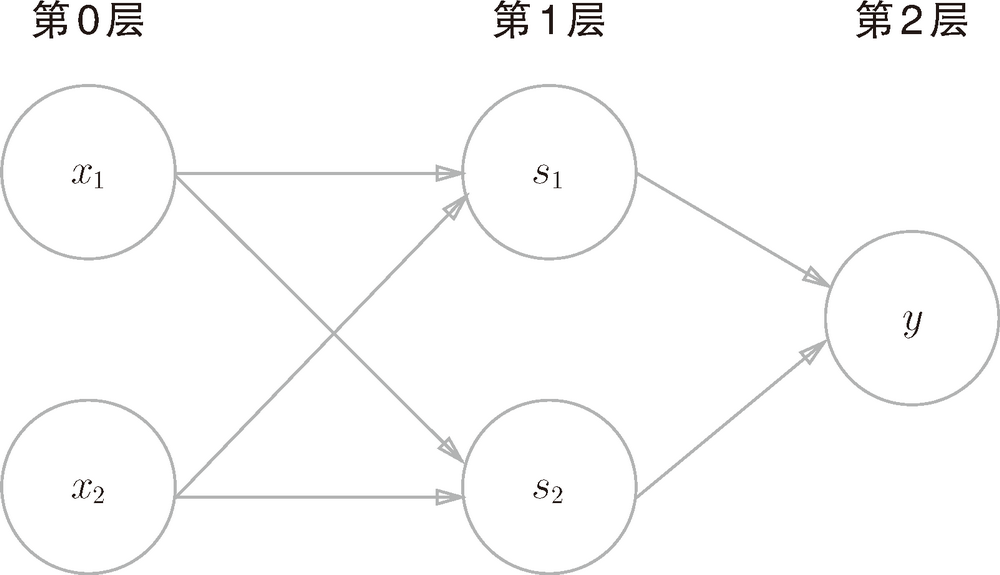
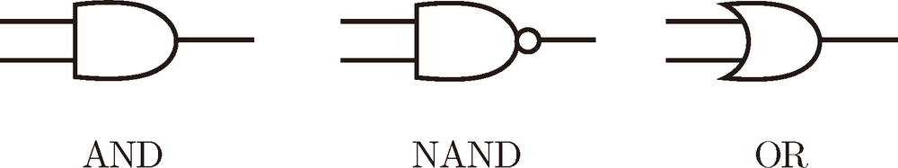
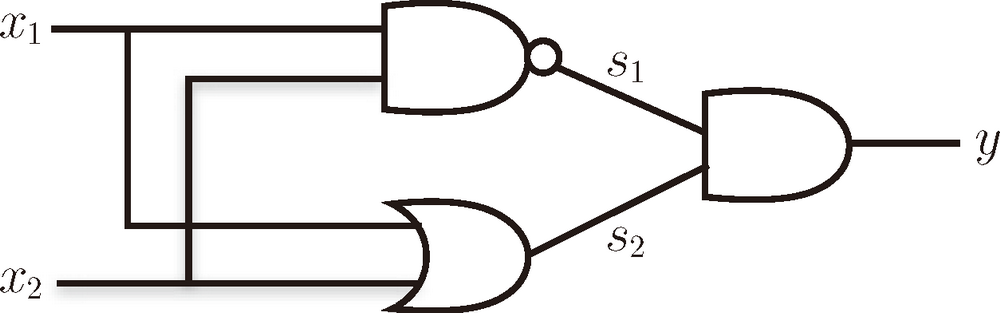

# Basic


## 感知机是什么
1. 感知机接收多个输入信号，输出一个信号。想想生物的情况，也是接收信息并做出反应。
2. 感知机的信号只有1/0两种取值。对生物来说，在更高层上可能会接收所谓的复杂信号，但其实分解到底层神经元上，也是很简单的电信号。
3. 一个输入信号值乘以它的权重`w`，就是神经元节点接收到的信号实际值。显然对生物来说，不同的信息输入有不同的重要性。

    

4. 神经元会计算传送过来的信号的总和，只有当这个总和超过了某个界限值时，才会输出 1。这也称为“神经元被激活”。这里将这个界限值称为阈值，用符号`θ`表示。对生物来说，某种刺激太弱也不会做出相应的反应。
    * w1x2 + w2x2 <= θ，y 输出 0
    * w1x2 + w2x2 > θ， y 输出 1
5. 后续使用中，将使用偏置`b`来代替阈值`θ`，变形如下：
    * b + w1x2 + w2x2 <= 0，y 输出 0
    * b + w1x2 + w2x2 > 0， y 输出 1


## 用感知机简单逻辑电路
### 与门
1. x1、x2 的输入和对应的 y 输入应如下：
    x1 | x2 | y
    --|--|--
    0 | 0 | 0
    1 | 0 | 0
    0 | 1 | 0
    1 | 1 | 1
2. 要用感知机实现，就需要设定合适的偏置和权重，使得上表前三行的 x1、x2 的输入的计算结果小于等于0，第四行输入的计算结果大于0。
2. python 实现如下
    ```py
    import numpy as np

    def AND(x1, x2):
        x = np.array([x1, x2])
        w = np.array([0.5, 0.5]) # 设定权重
        b = -0.7 # 设定偏置
        tmp = np.sum(w*x) + b
        if tmp <= 0:
            return 0
        else:
            return 1
    ```

### 与非门
1. 真值表
    x1 | x2 | y
    --|--|--
    0 | 0 | 1
    1 | 0 | 1
    0 | 1 | 1
    1 | 1 | 0
2. python 实现
    ```py
    def NAND(x1, x2):
        x = np.array([x1, x2])
        w = np.array([-0.5, -0.5])
        b = 0.7
        tmp = np.sum(w*x) + b
        if tmp <= 0:
            return 0
        else:
            return 1
    ```

### 或门
1. python 实现
    ```py
    def OR(x1, x2):
        x = np.array([x1, x2])
        w = np.array([0.5, 0.5])
        b = -0.2
        tmp = np.sum(w*x) + b
        if tmp <= 0:
        return 0
        else:
        return 1
    ```


## 感知机的图像表示
1. 从上面的描述可以看出，偏置和权重作为设定的参数，x1 和 x2 作为实际的变量，感知机可以用直角坐标系加上一条直线来表示。例如下面`-0.5 + x1 + x2`的或门实现（偏置为-0.5，权重为1的感知机）

    

2. 给定参数的感知机，它的图形意义就是：在x 1、x2 直角坐标系里画出一条直线，这个直线上的每一点和 `b + w1x1 + w2x2 = 0`的 x1、x2 的取值一一对应。也就是说，这条直线就是根据 `b + w1x1 + w2x2 = 0`画出来的。
3. 当直线左倾时，直线上的一点不管是向左还是向下移动，都是一个值不变另一个值减小，因此上面式子的结果就会小于零；同理，不管是向右还是向上移动，上面式子的结果都会大于零。
4. 再考虑到右倾（一个权重正一个权重负）和水平垂直的情况，可以看到，直线一侧的坐标值求得结果都是负数，而另一侧求得的结果都是整数。
5. 因此在上图中，只要设定合适的参数，让输入(0,0)在条直线左侧让(0, 1)(1, 0)(1, 1)在直线右侧，就可以以此参数实现或门感知机。

## 感知机的局限
1. 考虑异或门的输入和输出，要求在坐标轴中划出一条直线，使得两个三角形在一侧（表达式大于零）两个圆形在另一侧（表达式小于零）

    

2. 显然是画不出这样的直线的

### 线性和非线性
1. 感知机的局限性就在于它只能表示由一条直线分割的空间。下图这样弯曲的曲线无法用感知机表示。

    

2. 这样的曲线分割而成的空间称为非线性空间，由直线分割而成的空间称为线性空间。


## 多层感知机
1. 通过叠加层实现多层感知机（multi-layered perceptron）。

    

2. 异或门的实现

      
    <br />
    

    ```py
    def XOR(x1, x2):
        s1 = NAND(x1, x2)
        s2 = OR(x1, x2)
        y = AND(s1, s2)
        return y
    ```