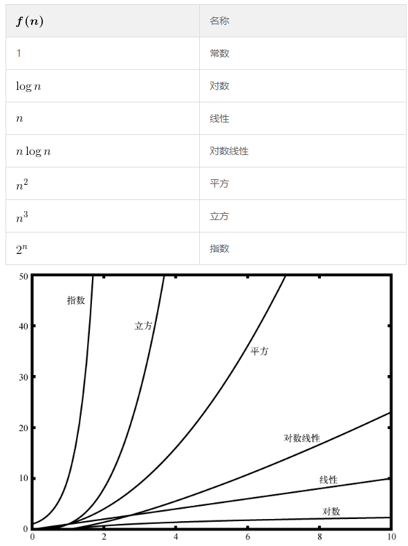
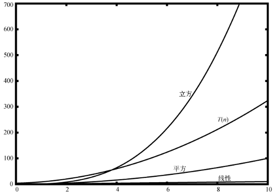

# 算法分析基础


算法分析的基础是 **科学方法**，它是科学家们为获取自然界知识所使用的一系列为大家所认同的方法。我们将会使用 **数学分析** 为算法成本建立简洁的模型并使用 **实验数据** 验证这些模型。


<!-- TOC -->

- [算法分析基础](#算法分析基础)
    - [0. 思想](#0-思想)
        - [科学方法](#科学方法)
    - [1. 科学方法](#1-科学方法)
    - [何谓算法分析](#何谓算法分析)
        - [算法和程序的区别](#算法和程序的区别)
        - [基于所使用的计算资源](#基于所使用的计算资源)
            - [使用基准分析进行时间分析的例子](#使用基准分析进行时间分析的例子)
        - [基准测试的缺陷](#基准测试的缺陷)
    - [大 O 记法](#大-o-记法)
        - [使用步骤书来描述一个算法的复杂度](#使用步骤书来描述一个算法的复杂度)
        - [取函数的数量级函数用来近似计算复杂度，和求极限原理相同](#取函数的数量级函数用来近似计算复杂度和求极限原理相同)
        - [数据对算法性能的影响](#数据对算法性能的影响)
        - [常见的大 O 函数](#常见的大-o-函数)
        - [一例](#一例)
        - [异序词检测示例](#异序词检测示例)
            - [方案 1：清点法](#方案-1清点法)
            - [方案 2：排序法](#方案-2排序法)
            - [方案 3：蛮力法](#方案-3蛮力法)
            - [方案 4：计数法](#方案-4计数法)
    - [时间与空间](#时间与空间)
    - [References](#references)

<!-- /TOC -->


## 0. 思想
### 科学方法
1. 下面科学方法的笔记摘录自 [算法（第4版）](https://book.douban.com/subject/19952400/)，说的真好。
2. 虽然是出自一本算法的书，但是显然这是所有科学通用的方法思想。


## 1. 科学方法
1. 科学家用来理解自然世界的方法对于研究计算机程序的运行时间同样有效：
    1. 细致地 **观察** 真实世界的特点，通常还要有精确的测量；
    2. 根据观察结果提出 **假设** 模型；
    3. 根据模型 **预测** 未来的事件；
    4. 继续观察并 **核实** 预测的准确性；
    5. 如此反复直到确认预测和观察一致。
2. 科学方法的一条关键原则是我们所设计的实验必须是 **可重现** 的，这样他人也可以自己验证假设的真实性。
3. 所有的假设也必须是 **可证伪** 的，这样我们才能确认某个假设是错误的（并需要修正）。正如爱因斯坦的一句名言所说：“再多的实验也不一定能够证明我是对的，但只需要一个实验就能证明我是错的。”
4. 我们永远也没法知道某个假设是否绝对正确，我们只能验证它和我们的观察的一致性。


## 何谓算法分析
### 算法和程序的区别
1. 程序和它所代表的算法是不同的。
2. 算法是为逐步解决问题而设计的一系列通用指令。给定某个输入，算法能得到对应的结果——算法就是解决问题的方法。
3. 程序则是用某种编程语言对算法编码。
4. 同一个算法可以对应许多程序，这取决于程序员和编程语言。
5. 算法分析是一种独立于实现的算法度量方法。

### 基于所使用的计算资源
1. 算法分析关心的是基于所使用的计算资源比较算法。我们说甲算法比乙算法好，依据是甲算法有更高的资源利用率或使用更少的资源。
2. 如果有两个算法的编程实践，一个可读性好一个可读性差，但只要它们对计算资源的利用情况相同，那么在算法分析的层面上，它们是相同的。
3. 计算资源究竟指什么？思考这个问题很重要。有两种思考方式。一是考虑算法在解决问题时要占用的空间或内存。解决方案所需的空间总量一般由问题实例本身决定，但算法往往也会有特定的空间需求。另一种思考方式是根据算法执行所需的时间进行分析和比较。这个指标有时称作算法的执行时间或运行时间。

#### 使用基准分析进行时间分析的例子
1. 需求是计算前 n 个自然数之和。
2. 先用累加算法计算并进行基准分析
    ```py
    import time

    def sumOfN1(n):
        start = time.time()

        theSum = 0
        for i in range(1, n+1):
            theSum = theSum + i

        end = time.time()

        return theSum, end-start


    for i in range(5):
        print("Sum is %d required %10.7f seconds" % sumOfN1(10000))

    # Sum is 50005000 required  0.0009973 seconds
    # Sum is 50005000 required  0.0000000 seconds
    # Sum is 50005000 required  0.0009973 seconds
    # Sum is 50005000 required  0.0010083 seconds
    # Sum is 50005000 required  0.0009875 seconds
    ```
3. 而且如果增加 n 的值，计算时间也会相应增长
    ```py
    for i in range(5):
        print("Sum is %d required %10.7f seconds" % sumOfN1(100000))

    # Sum is 5000050000 required  0.0049865 seconds
    # Sum is 5000050000 required  0.0049884 seconds
    # Sum is 5000050000 required  0.0050058 seconds
    # Sum is 5000050000 required  0.0069606 seconds
    # Sum is 5000050000 required  0.0059812 seconds
    ```
4. 但是如果使用下面求和公式的算法来计算，时间已经少到了无法正常显示，而且增大 n 也不会有耗时上的变化
    ```py
    import time

    def sumOfN2(n):
        start = time.time()

        theSum = (n*(n+1))/2

        end = time.time()

        return theSum, end-start


    for i in range(5):
        print("Sum is %d required %10.7f seconds" % sumOfN2(10000))

    # Sum is 50005000 required  0.0000000 seconds
    # Sum is 50005000 required  0.0000000 seconds
    # Sum is 50005000 required  0.0000000 seconds
    # Sum is 50005000 required  0.0000000 seconds
    # Sum is 50005000 required  0.0000000 seconds
    ```

### 基准测试的缺陷
1. 这里有个问题。如果在另一台计算机上运行这个函数，或用另一种编程语言来实现，很可能会得到不同的结果。如果计算机再旧些，`sumOfN1` 的执行时间也会更长。
2. 可以看出来，基准测试计算的是执行算法的实际时间。这不是一个有用的指标，因为它依赖于特定的计算机、程序、时间、编译器与编程语言。
3. 所以，我们需要更好的方式来描述算法的执行时间。我们希望找到一个独立于程序或计算机的指标。这样的指标在评价算法方面会更有用，可以用来比较不同实现下的算法。


## 大 O 记法
### 使用步骤书来描述一个算法的复杂度
1. 试图摆脱程序或计算机的影响而描述算法的效率时，量化算法的操作或步骤很重要。
2. 如果将每一步看成基本计算单位，那么可以将算法的执行时间描述成解决问题所需的步骤数。
3. 确定合适的基本计算单位很复杂，也依赖于算法的实现。
4. 对于累加算法，计算总和所用的赋值语句的数目就是一个很好的基本计算单位。在 `sumOfN1` 函数中，赋值语句数是 1（`theSum = 0`）加上 n（`theSum = theSum + i` 的运行次数）。
5. 可以将其定义成函数 `T`，令 `T(n)=1+n`。参数 `n` 常被称作 **问题规模**，可以将函数解读为 “当问题规模为 `n` 时，解决问题所需的时间是 `T(n)`，即需要 `1+n` 步”。

### 取函数的数量级函数用来近似计算复杂度，和求极限原理相同
1. 精确的步骤数并没有 $T(n)$ 函数中起决定性作用的部分重要。也就是说，随着问题规模的增长，$T(n)$ 函数的某一部分会比其余部分增长得更快。最后比较的其实就是这一起决定性作用的部分。
2. 数量级函数描述的就是，当 $n$ 增长时，$T(n)$ 增长最快的部分。**数量级**（order of magnitude）常被称作 **大O记法**（O 指 order），记作 $O(f(n))$。
3. 它提供了步骤数的一个有用的近似方法。$f(n)$ 函数为 $T(n)$ 函数中起决定性作用的部分提供了简单的表示。
4. 对于 $T(n)=1+n$，随着 $n$ 越来越大，常数 $1$ 对最终结果的影响越来越小。如果要给出 $T(n)$ 的近似值，可以舍去 $1$，直接说执行时间是 $O(n)$。
5. 再举个例子，假设某算法的步骤数是 $T(n)=5n^2+27n+1005$。当 $n$ 很小时，比如说 $1$ 或 $2$，常数 $1005$看起来是这个函数中起决定性作用的部分。
6. 然而，随 $n$ 着增长，$n^2$ 变得更重要。实际上，当 $n$ 很大时，另两项的作用对于最终结果来说就不显著了，因此可以忽略这两项，只关注 $5n^2$。另外，当 $n$ 变大时，系数 $5$ 的作用也不显著了。
7. 因此可以说，函数 $T(n)$ 的数量级是 $f(n)=n^2$，或者直接说是 $O(n^2)$。

### 数据对算法性能的影响
1. 算法的性能有时不仅依赖于问题规模，还依赖于数据值。
2. 对于这种算法，要用 **最坏情况**、**最好情况** 和 **普通情况** 来描述性能。
3. 最坏情况指的是某一个数据集会让算法的性能极差；另一个数据集可能会让同一个算法的性能极好（最好情况）。大部分情况下，算法的性能介于两个极端之间（普通情况）。
4. 计算机科学家要理解这些区别，以免被某个特例误导。

### 常见的大 O 函数
1. 要判断哪一个才是 `T(n)` 的决定性部分，必须了解它们在 `n` 变大时彼此有多大差别。
2. 注意，当 `n` 较小时，这些函数之间的界限不是很明确，很难看出哪个起主导作用。随着 `n` 的增长，它们之间的差别就很明显了。
    

### 一例
1. 代码
    ```py
    a = 5
    b = 6
    c = 10
    for i in range(n):
        for j in range(n):
            x = i * i
            y = j * j
            z = i * j
    for k in range(n):
        w = a * k + 45
        v = b * b
    d = 33
    ```
2. 赋值操作的数量是 4 项之和：$T(n)=3+3n^2+2n+1$。
3. 很容易看出来，$n^2$ 起主导作用，所以这段代码的时间复杂度是 $O(n^2)$。当 $n$ 变大时，其他项以及主导项的系数都可以忽略。
4. 下图展示了一部分常见的大 O 函数与这里的 $T(n)$ 函数的对比情况。注意，$T(n)$ 一开始比立方函数大。然而，随着 `n` 的增长，立方函数很快就超越了 `T(n)`。
    

### 异序词检测示例
1. 如果一个字符串只是重排了另一个字符串的字符，那么这个字符串就是另一个的异序词，比如 heart 与 earth，以及 python 与 typhon。
2. 为了简化问题，假设要检查的两个字符串长度相同，并且都是由 26 个英文字母的小写形式组成的。
3. 我们的目标是编写一个布尔函数，它接受两个字符串，并能判断它们是否为异序词。

#### 方案 1：清点法
1. 清点第 1 个字符串的每个字符，看看它们是否都出现在第 2 个字符串中。
2. 因为 Python 中的字符串是不可修改的，所以先要将第 2 个字符串转换成列表
    ```py
    def anagramSolution1(s1, s2):
        alist = list(s2)

        pos1 = 0
        stillOK = True

        while pos1 < len(s1) and stillOK:
            pos2 = 0
            found = False
            while pos2 < len(alist) and not found:
                if s1[pos1] == alist[pos2]:
                    found = True
                else:
                    pos2 = pos2 + 1

            if found:
                alist[pos2] = None
            else:
                stillOK = False

            pos1 = pos1 + 1

        return stillOK
    ```
3. 这个方法应该是最容易想到的，因为异序词的主要特征就是字母都相同。
4. 如果两个字符串确实是异序词的话，那 `s2` 中的每一个字符都要被内层的 `while` 遍历到，遍历到每个字符的步数就是该字符的 index 再加一。
5. 所以内层遍历的次数就是 $\frac{(1+ n)n}{2}$，时间复杂度是 $O(n^2)$。

#### 方案 2：排序法
1. 如果按照字母表顺序给字符排序，异序词得到的结果将是同一个字符串
    ```py
    def anagramSolution2(s1, s2):
        alist1 = list(s1)
        alist2 = list(s2)

        alist1.sort()
        alist2.sort()

        pos = 0
        matches = True

        while pos < len(s1) and matches:
            if alist1[pos] == alist2[pos]:
                pos = pos + 1
            else:
                matches = False

    return matches
    ```
2. 如果不考虑排序，看起来只需要遍历一遍，时间复杂度是 $O(n)$。
3. 但是，排序的时间复杂度基本上是 $O(n^2)$ 或 $O(n\log n)$，所以排序操作起主导作用。
4. 也就是说，该算法和排序过程的数量级相同。

#### 方案 3：蛮力法
1. 我以为清点法就是蛮力法了，没想到真正的蛮力法是生成第一个字符串的所有异序词！还真没想到这个方法。
2. 因为要遍历所有可能的结果，所以在这个例子，复杂度高达 $n!$。但这也是一个思路，而且也许在某些场景下这还是最优的方法。

#### 方案 4：计数法
1. 最后一个方案基于这样一个事实：两个异序词有同样数目的 a、同样数目的 b、同样数目的 c，等等。
2. 要判断两个字符串是否为异序词，先统计一下每个字符出现的次数。因为字符可能有 26 种，所以使用 26 个计数器，对应每个字符。每遇到一个字符，就将对应的计数器加 1。
3. 最后，如果两个计数器列表相同，那么两个字符串肯定是异序词。
    ```py
    def anagramSolution4(s1, s2):
        c1 = [0] * 26
        c2 = [0] * 26
            
        for i in range(len(s1)):
            pos = ord(s1[i]) - ord('a')
            c1[pos] = c1[pos] + 1
            
        for i in range(len(s2)):
            pos = ord(s2[i]) - ord('a')
            c2[pos] = c2[pos] + 1
                    
        j = 0
        stillOK = True
        while j < 26 and stillOK:
            if c1[j] == c2[j]:
                j = j + 1
            else:
                stillOK = False
                
        return stillOK
    ```
4. 前两个 `for` 循环的次数都是 n，最后一个 `while` 循环遍历字母表，最多是 26。时间复杂度为 $T(n)=2n+26$，即 $O(n)$。
5. 尽管这个方案的执行时间是线性的，它还是要用额外的空间来存储计数器。也就是说，这个算法用空间换来了时间。


## 时间与空间
1. 大 O 记法只是从时间维度来衡量算法的优劣。不过很多时候，都需要在时间和空间之间进行权衡。
2. 在异序词算法中，因为占用空间不大，所以使用空间换时间是值得的。但如果有些问题的算法会占用很大的空间，那就要另当别论了。
3. 面对多种算法和具体的问题，计算机科学家需要决定如何利用好计算资源。


## References
* [算法（第4版）](https://book.douban.com/subject/19952400/)
* [Python数据结构与算法分析（第2版）](https://book.douban.com/subject/34785178/)