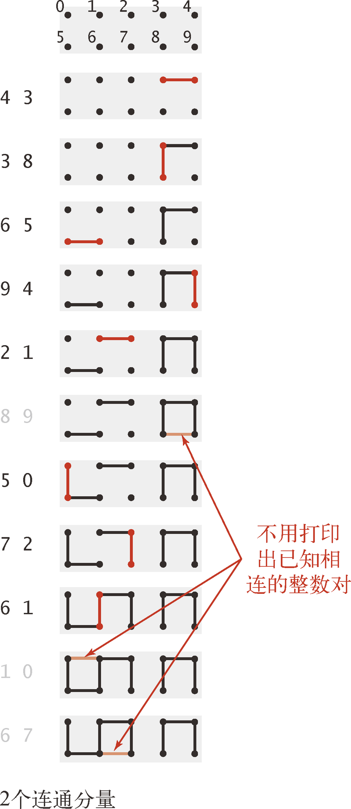
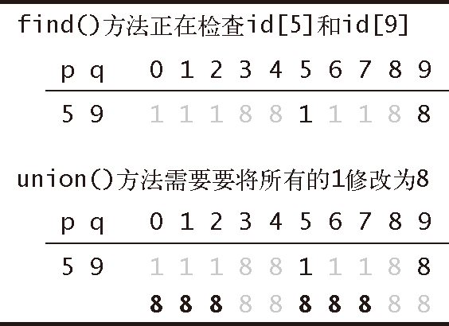
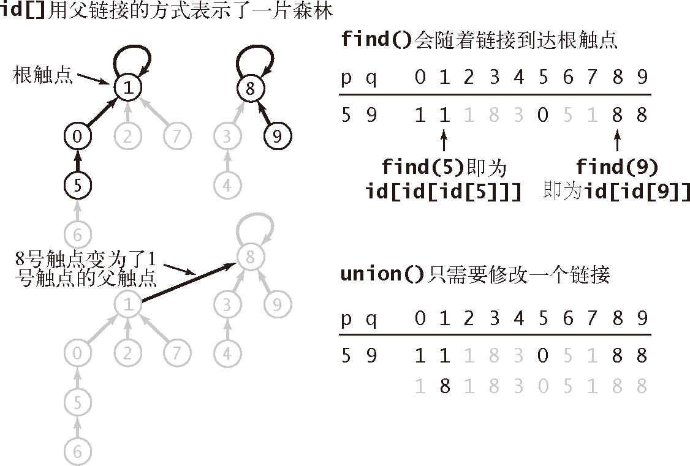
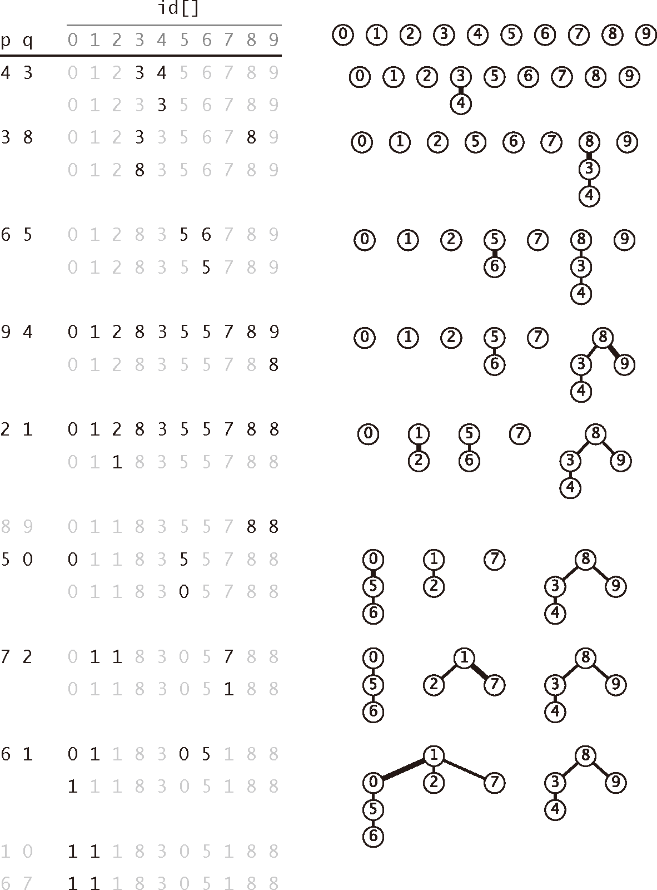
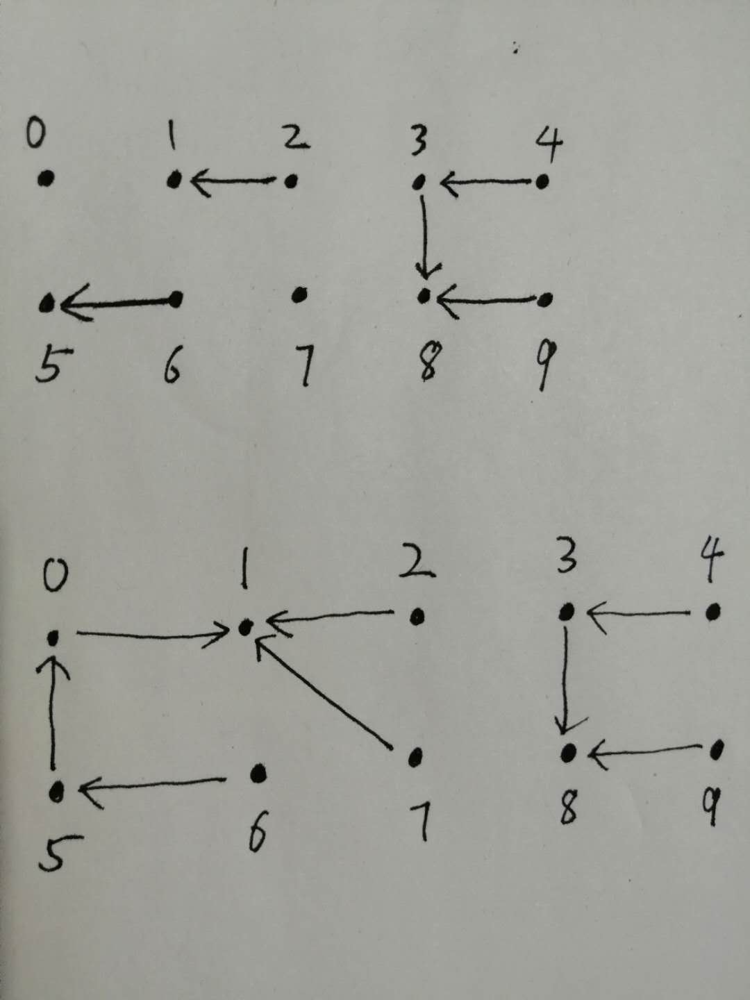
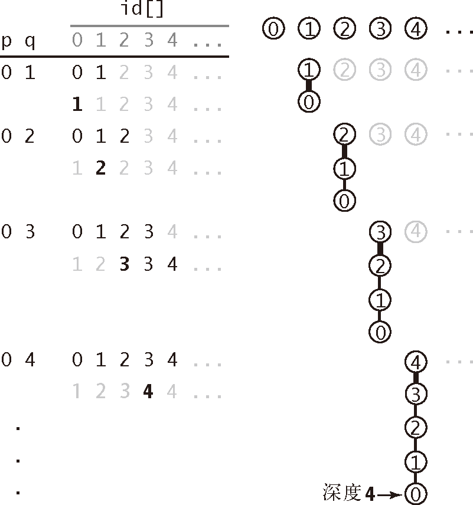

# union-find


<!-- TOC -->

- [union-find](#union-find)
    - [设计思想](#设计思想)
        - [考虑改变数据结构——quick-union](#考虑改变数据结构quick-union)
        - [链接分组法](#链接分组法)
    - [抽象本质](#抽象本质)
    - [动态连通性](#动态连通性)
        - [连通性](#连通性)
        - [建立连通性时要先验证两个对象是否已经相连](#建立连通性时要先验证两个对象是否已经相连)
    - [应用场景](#应用场景)
        - [网络](#网络)
        - [变量名等价性](#变量名等价性)
        - [数学集合](#数学集合)
    - [准备工作](#准备工作)
        - [约定](#约定)
        - [API](#api)
        - [数据结构](#数据结构)
    - [实现](#实现)
        - [quick-find 算法](#quick-find-算法)
            - [JavaScript 实现](#javascript-实现)
            - [分析](#分析)
                - [`find`](#find)
                - [`union` 中的对两个触点的一次归并操作](#union-中的对两个触点的一次归并操作)
            - [考虑对 N 个触点的操作](#考虑对-n-个触点的操作)
        - [quick-union 算法](#quick-union-算法)
            - [JavaScript 实现](#javascript-实现-1)
            - [quick-union 算法的分析](#quick-union-算法的分析)
        - [加权 quick-union 算法](#加权-quick-union-算法)
            - [JavaScript 实现](#javascript-实现-2)
            - [加权 quick-union 算法的分析](#加权-quick-union-算法的分析)
        - [最优算法](#最优算法)
        - [均摊成本的图像](#均摊成本的图像)
    - [References](#references)

<!-- /TOC -->


## 设计思想
优秀的算法因为能够解决实际问题而变得更为重要；
高效算法的代码也可以很简单；
理解某个实现的性能特点是一项有趣而令人满足的挑战；
在解决同一个问题的多种算法之间进行选择时，科学方法是一种重要的工具；
迭代式改进能够让算法的效率越来越高。

### 考虑改变数据结构——quick-union

### 链接分组法


## 抽象本质
连通性的抽象本质


## 动态连通性
### 连通性
1. 问题的输入是一列整数对，其中每个整数都表示一个某种类型的对象。
2. 一对整数 `p q` 的输入意味着要将让它们的状态变为 “相连的”。我们假设 “相连” 是一种 **等价** 关系，这也就意味着它具有：
    * 自反性：`p` 和 `p` 是相连的；
    * 对称性：如果 `p` 和 `q` 是相连的，那么 `q` 和 `p` 也是相连的；
    * 传递性：如果 `p` 和 `q` 是相连的且 `q` 和 `r` 是相连的，那么 `p` 和 `r` 也是相连的。
3. 等价关系能够将所有的对象分为多个 **等价类**。在这里，当且仅当两个对象相连时它们才属于同一个等价类。
4. 例如 `p` 和 `p` 相连，则它们可以组合为一个等价类；之后 `q` 和 `r` 又相连了，则 `p`、`q` 和 `r` 就可以组合成一个新的更大的等价类。

### 建立连通性时要先验证两个对象是否已经相连
1. 当程序从输入中读取了整数对 `p q` 时，如果已知的所有整数对都不能说明 `p` 和 `q` 是相连的，也就是说它们不在一个等价类里面，那么就将这一对整数写入到输出中。
2. 如果已知的数据可以说明 `p` 和 `q` 是相连的，那么程序应该忽略 `p q` 这对整数并继续处理输入中的下一对整数。
3. 如下图，在输入整数对 `8 9` 时，它们其实已经通过 `3` 和 `4` 相连了，所以就不需要再进行连接操作了
    


## 应用场景
###　网络
1. 输入中的整数表示的可能是一个大型计算机网络中的计算机，而整数对则表示网络中的连接。
2. 这个程序能够判定我们是否需要在 `p` 和 `q` 之间架设一条新的连接才能进行通信，或是我们可以通过已有的连接在两者之间建立通信线路；
3. 或者这些整数表示的可能是电子电路中的触点，而整数对表示的是连接触点之间的电路；
4. 或者这些整数表示的可能是社交网络中的人，而整数对表示的是朋友关系。
5. 在此类应用中，我们可能需要处理数百万的对象和数十亿的连接。

### 变量名等价性
某些编程环境允许声明两个等价的变量名（指向同一个对象的多个引用）。在一系列这样的声明之后，系统需要能够判别两个给定的变量名是否等价。这种较早出现的应用（如 FORTRAN 语言）推动了我们即将讨论的算法的发展。

### 数学集合
1. 在更高的抽象层次上，可以将输入的所有整数看做属于不同的数学集合。
2. 在处理一个整数对 `p q` 时，我们是在判断它们是否属于相同的集合。如果不是，我们会将 p 所属的集合和 q 所属的集合归并到同一个集合。


## 准备工作
### 约定
1. 为了进一步限定话题，我们会在本节以下内容中使用网络方面的术语，将对象称为 **触点**，将整数对称为 **连接**，将等价类称为 **连通分量** 或是简称 **分量**。
2. 简单起见，假设我们有用 0 到 N-1 的整数所表示的 N 个触点。

### API
```java
public class UF
             UF(int N)	                // 以整数标识（0 到 ）初始化  个触点
      void   union(int p, int q)	    // 在 p 和 q 之间添加一条连接
       int   find(int p)	            // p（0 到 N-1）所在的分量的标识符
   boolean   connected(int p, int q)	// 如果 p 和 q 存在于同一个分量中则返回 true
       int   count()	                // 连通分量的数量
```

### 数据结构
1. 众所周知，数据结构的性质将直接影响到算法的效率，因此数据结构和算法的设计是紧密相关的。
2. API 已经说明触点和分量都会用 `int` 值表示，所以我们可以用一个以触点为索引的数组 `id[]` 作为基本数据结构来表示所有分量。
3. 我们将使用分量中的某个触点的名称作为分量的标识符，因此你可以认为每个分量都是由它的触点之一所表示的。
4. 一开始，我们有 N 个分量，每个触点都构成了一个只含有它自己的分量，因此我们将 `id[i]` 的值初始化为 `i`，其中 `i` 在 0 到 N-1 之间。
5. 对于每个触点 `i`，我们将 `find()` 方法用来判定它所在的分量所需的信息保存在 `id[i]` 之中。`connected()` 方法的实现只用一条语句 `find(p) == find(q)`，它返回一个布尔值，我们在所有方法的实现中都会用到 `connected()` 方法。


## 实现
我们将讨论三种不同的实现，它们均根据以触点为索引的 id[] 数组来确定两个触点是否存在于相同的连通分量中。

### quick-find 算法
1. 这种方法是当且仅当 `id[p]` 等于 `id[q]` 时 `p` 和 `q` 是连通的。换句话说，在同一个连通分量中的所有触点在 `id[]` 中的值必须全部相同。这意味着 `connected(p, q)` 只需要判断 `id[p] == id[q]`。
2. 为了调用 `union(p, q)` 时确保这一点，我们首先要检查它们是否已经存在于同一个连通分量之中。
3. 如果是我们就不需要采取任何行动，否则我们面对的情况就是 `p` 所在的连通分量中的所有触点的 `id[]` 值均为同一个值，而 `q` 所在的连通分量中的所有触点的 `id[]` 值均为另一个值。
4. 要将两个分量合二为一，我们必须将两个集合中所有触点所对应的 `id[]` 元素变为同一个值，如下图所示
    
5. 为此，我们需要遍历整个数组，将所有和 `id[p]` 相等的元素的值变为 `id[q]` 的值。我们也可以将所有和 `id[q]` 相等的元素的值变为 `id[p]` 的值——两者皆可。
6. `find()` 和 `union()` 的实现如下
    ```java
    public int find(int p)
    {  return id[p];  }

    public void union(int p, int q)
    {  // 将p和q归并到相同的分量中
        int pID = find(p);
        int qID = find(q);

        // 如果p和q已经在相同的分量之中则不需要采取任何行动
        if (pID == qID) return;

        // 将p的分量重命名为q的名称
        for (int i = 0; i < id.length; i++)
            if (id[i] == pID) id[i] = qID;
        count--;
    }
    ```

#### JavaScript 实现
```js
class UF {
    constructor ( N ) {
        this.ids = Array.from( {length: N}, (v, i) => i);
        this.count = N;
    }

    find ( int ) {
        return this.ids[int];
    }

    connected ( p, q ) {
        return this.find( p ) === this.find( q );
    }

    union ( p, q ) {
        let pID = this.find( p );
        let qID = this.find( q );

        if ( pID === qID ) {
            return;
        }

        for ( let i=0; i<this.ids.length; i++ ) {
            if ( this.ids[i] === pID ) {
                this.ids[i] = qID;
            }
        }

        this.count--;
    }
}

let uf = new UF( 10 );

uf.union( 4, 3 );
uf.union( 3, 8 );
uf.union( 6, 5 );
uf.union( 9, 4 );
uf.union( 2, 1 );

console.log ( uf )
// count: 5
// ids: (10) [0, 1, 1, 8, 8, 5, 5, 7, 8, 8]

setTimeout(() => {
    uf.union( 8, 9 );
    uf.union( 5, 0 );
    uf.union( 7, 2 );
    uf.union( 6, 1 );
    uf.union( 1, 0 );
    uf.union( 6, 7 );
    
    console.log ( uf )
    // count: 2
    // ids: (10) [1, 1, 1, 8, 8, 1, 1, 1, 8, 8]
}, 3333)
```

#### 分析
##### `find` 
只需要访问一次数组。

##### `union` 中的对两个触点的一次归并操作
1. 分析归并操作，就说明分析的情况是 `pID === qID` 为 `false` 的情况。
2. `union` 一开始会先调用两次 `find`，对数组的访问次数是：$2$。
3. 接下来进入 `for` 循环。里面的 `if` 判断每次都要访问数组，总次数是 N。
4. 如果 `if` 判断为 `true`，则还要进行里面的赋值操作，会再访问一次数组。
5. 在这个 `for` 循环归并操作中:
    * 最少可能只需要改变一个触点的 ID，所以这次 `for` 循环对数组的访问次数是：$N + 1$;
    * 最多可能要改变 N-1 个触点的 ID，所以这次 `for` 循环对数组的访问次数是：$N + (N -1)$。
6. 综上，一次会执行归并操作的 `union` 调用中，对数组的访问次数在 $N + 3$ 到 $2N + 1$ 之间。

#### 考虑对 N 个触点的操作
1. 假设我们对 N 个触点的数据使用 quick-find 算法来解决动态连通性问题并且最后只得到了一个连通分量，这至少需要调用 N-1 次 `union()`。
2. 例如 100 个触点的时，调用 `union` 的传参依次是 `0 1`，`1 2`，`2 3` … `97 98`，`98 99`。
3. 因此至少要进行 $(N+3)(N-1)\sim N^2$ 次数组访问，即平方级别。

### quick-union 算法
1. 现在，我们将使用一种新的连通分量逻辑结构来提高 `union` 操作的效率。
2. quick-find 算法的 `union` 操作效率比较低下的原因是，需要把一个分量中的每一个触点都 **独立的** 变为另一个分享的，所以需要遍历数组来一个一个的改变。
3. 但想想，既然这些要改变的触点都是同一个分量，而且也是要统一改变为同一个分量，那为什么不能统一改变呢？
4. 想要统一改变，就要把一个分量里面的处理编为一组，这样才能整体改变。
5. quick-union 算法就是进行了这样的编组，结构类似于散列表的分离链接。
6. 确切地说，每个触点所对应的 `id[]` 元素都是同一个分量中的另一个触点的名称（也可能是它自己）——我们将这种联系称为 **链接**。
7. 在实现 `find()` 方法时，我们从给定的触点开始，由它的链接得到另一个触点，再由这个触点的链接到达第三个触点，如此继续跟随着链接直到到达一个 **根触点**，即链接指向自己的触点。
8. 当且仅当分别由两个触点开始的这个过程到达了同一个根触点时它们存在于同一个连通分量之中。
9. 进行 `union(p, q)` 操作时，我们由 `p` 和 `q` 的链接分别找到它们的根触点，然后只需将一个根触点链接到另一个即可将一个分量重命名为另一个分量，因此这个算法叫做 quick-union。
    
10. `find()` 和 `union()` 的实现如下
    ```java
    private int find(int p)
    {  // 找出分量的名称
        while (p != id[p]) p = id[p];
        return p;
    }

    public void union(int p, int q)
    {  // 将p和q的根节点统一
        int pRoot = find(p);
        int qRoot = find(q);
        if (pRoot == qRoot) return;

        id[pRoot] = qRoot;

        count--;
    }
    ```
11. 下图展示了 quick-union 算法的轨迹
    

#### JavaScript 实现
```js
class UF {
    constructor ( N ) {
        this.ids = Array.from( {length: N}, (v, i) => i);
        this.count = N;
    }

    find ( int ) {
        while ( int !== this.ids[int] ) {
            int = this.ids[int];
        }
        return int;
    }

    connected ( p, q ) {
        return this.find( p ) === this.find( q );
    }

    union ( p, q ) {
        let pRoot = this.find( p );
        let qRoot = this.find( q );

        if ( pRoot === qRoot ) {
            return;
        }

        this.ids[pRoot] = qRoot;

        this.count--;
    }
}

let uf = new UF( 10 );

uf.union( 4, 3 );
uf.union( 3, 8 );
uf.union( 6, 5 );
uf.union( 9, 4 );
uf.union( 2, 1 );


console.log ( uf )
// count: 5
// ids: (10) [0, 1, 1, 8, 3, 5, 5, 7, 8, 8]

setTimeout(() => {
    uf.union( 8, 9 );
    uf.union( 5, 0 );
    uf.union( 7, 2 );
    uf.union( 6, 1 );
    uf.union( 1, 0 );
    uf.union( 6, 7 );
    
    console.log ( uf )
    // count: 2
    // ids: (10) [1, 1, 1, 8, 3, 0, 5, 1, 8, 8]
}, 3333)
```
下图是上面两部分输出时的链接


#### quick-union 算法的分析
1. 如果查找的是根触点，那么只需要一次数组访问就会找到。
2. 如果不是根触点，那就要遍历连通分量找到根触点。假如该触点和根触点的距离为 $D$，那么就需要访问数组 $2D + 1$ 次。
3. 也就是说，如果我们的 `union` 操作的参数节点尽可能是根触点或者靠近根触点，那效率就高；反之则会低。
4. 下图展示了最坏的情况
    
5. 对于 N 个触点的情况，如果按照上图这样的方式进行 `union`，每次 `union` 访问数组的次数如下:
    * `0 1`：$1 + 1 + 1 = 3$，最后一个 1 是连接根触点时的数组访问
    * `0 2`：$3 + 1 + 1 = 5$
    * `0 3`：$5 + 1 + 1 = 7$
    * `0 N-1`：$((N-2)*2 + 1) + 1 + 1 = 2N - 1$
6. 总的数组访问次数为 $n^2 - 2N + 1 \sim N^2$。

### 加权 quick-union 算法
1. 我们只需简单地修改 quick-union 算法就能保证像上面的糟糕情况不再出现。
2. 与其在 `union()` 中随意将一棵树连接到另一棵树，我们现在会记录每一棵树的大小并总是将较小的树连接到较大的树上。
3. 这项改动需要添加一个数组和一些代码来记录树中的节点数

#### JavaScript 实现
```js
class UF {
    constructor ( N ) {
        this.ids = Array.from( {length: N}, (v, i) => i);
        this.sizes = Array.from( {length: N}, () => 1); // 每个分量的触点数
        this.count = N;
    }

    find ( int ) {
        while ( int !== this.ids[int] ) {
            int = this.ids[int];
        }
        return int;
    }

    connected ( p, q ) {
        return this.find( p ) === this.find( q );
    }

    union ( p, q ) {
        let pRoot = this.find( p );
        let qRoot = this.find( q );

        if ( pRoot === qRoot ) {
            return;
        }

        // 小分量合并到大分量上
        if ( this.sizes[pRoot] < this.sizes[qRoot] ) {
            this.ids[pRoot] = qRoot;
            this.sizes[qRoot] += this.sizes[pRoot];
        }
        else {
            this.ids[qRoot] = pRoot;
            this.sizes[pRoot] += this.sizes[qRoot];
        }

        this.count--;
    }
}

let uf = new UF( 10 );

uf.union( 4, 3 );
uf.union( 3, 8 );
uf.union( 6, 5 );
uf.union( 9, 4 );
uf.union( 2, 1 );


console.log ( uf )
// count: 5
// ids: (10) [0, 2, 2, 4, 4, 6, 6, 7, 4, 4]
// sizes: (10) [1, 1, 2, 1, 4, 1, 2, 1, 1, 1]

setTimeout(() => {
    uf.union( 8, 9 );
    uf.union( 5, 0 );
    uf.union( 7, 2 );
    uf.union( 6, 1 );
    uf.union( 1, 0 );
    uf.union( 6, 7 );
    
    console.log ( uf )
    // count: 2
    // ids: (10) [6, 2, 6, 4, 4, 6, 6, 2, 4, 4]
    // sizes: (10) [1, 1, 3, 1, 4, 1, 6, 1, 1, 1]
}, 3333)
```

#### 加权 quick-union 算法的分析
TODO 不懂

### 最优算法
TODO

### 均摊成本的图像
TODO


## References
* [算法（第4版）](https://book.douban.com/subject/19952400/)