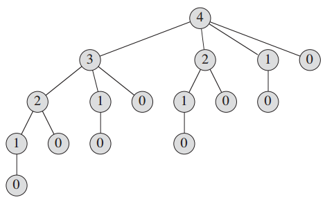
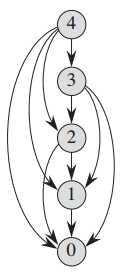

# Dynamic Programming


<!-- TOC -->

- [Dynamic Programming](#dynamic-programming)
    - [TODO](#todo)
    - [设计思想](#设计思想)
        - [递归和动态规划](#递归和动态规划)
        - [拆分大问题](#拆分大问题)
        - [缓存就挺好，为啥要之前之前每一种找零方案？](#缓存就挺好为啥要之前之前每一种找零方案)
    - [本质](#本质)
    - [用途](#用途)
    - [思路](#思路)
        - [分治与动态规划](#分治与动态规划)
        - [整体步骤](#整体步骤)
        - [因果链起点的寻找](#因果链起点的寻找)
        - [从起点开始推导每一种情况（如果需要，寻找每种情况最优解）](#从起点开始推导每一种情况如果需要寻找每种情况最优解)
        - [一种情况的可以依赖之前情况的结果](#一种情况的可以依赖之前情况的结果)
    - [以钢条切割问题为例](#以钢条切割问题为例)
        - [自顶向下的递归实现](#自顶向下的递归实现)
        - [使用动态规划的解决思路](#使用动态规划的解决思路)
        - [带备忘的自顶向下方法](#带备忘的自顶向下方法)
        - [自底向上方法](#自底向上方法)
    - [时间复杂度](#时间复杂度)
    - [子问题图](#子问题图)
        - [自底向上的情况](#自底向上的情况)
        - [子问题图和动态规划复杂度](#子问题图和动态规划复杂度)
    - [计算最优解](#计算最优解)
    - [如果切割有成本](#如果切割有成本)
    - [最少硬币找零问题](#最少硬币找零问题)
        - [最优子结构](#最优子结构)
        - [自顶向下的递归求解](#自顶向下的递归求解)
        - [带备忘的自顶向下](#带备忘的自顶向下)
            - [JS 实现](#js-实现)
        - [自底向上的动态规划实现](#自底向上的动态规划实现)
            - [JS 实现](#js-实现-1)
    - [Referecens](#referecens)

<!-- /TOC -->


## TODO
最优解问题中，不同的解有部分相同的子问题，所以适合用动态规划？？


## 设计思想
### 递归和动态规划
1. 在硬币找零的问题上，可以看出递归和严格动态规划的区别。
2. 其实两者都是通过一层层的使用规模较小的问题来解决规模较大的问题，但是它们的逻辑方向是不同的。
3. 递归可以说是一种反向的结构：想要求一个结果，就要先去求这个结果的原因；而为了求这个原因，还要继续去求这个原因的原因；以此类推。这是这种反向的逻辑结构，也常常使得递归理解起来比较困难。
4. 而动态规划则是正向的结构：想要求一个结果，动态规划会直接找到整条因果链的起点，然后从起点一步步的推导每一步的结果，一直推导到要求的那个结果。
5. 但实际上，递归的逻辑结构，其实真正的计算，也是一种正向。就像是递归解决阶乘，虽然开始一直反向的叠加调用栈，但最后实际的阶乘计算，还是不断出栈的过程。
6. 只不过递归的方法并不是系统的计算每一种情况，它只是从需要解决的问题出发，这个问题需要计算哪些就计算哪些，而不会进行多余的计算，不会像动态规划那样结算所有的情况。
7. 这就像解决一个问题的两种学习思路一样：递归式的思路是从问题入手，这个问题需要什么我就一层层的学习什么知识；而动态规划就是直接把这个问题的知识体系从头学一遍。

### 拆分大问题
1. 分治法和动态规划都是将复杂的大问题拆分为若干个子问题，然后递归的，子问题还可以拆分为子子问题。
2. 在面对复杂的大问题时，拆分常常是个好策略。

### 缓存就挺好，为啥要之前之前每一种找零方案？


## 本质


## 用途


## 思路
1. 动态规划是一种解决问题的思想。这种思想的本质是，一个规模比较大的问题，是通过规模比较小的若干问题的结果来得到的。
2. 例如递归求解斐波那契数列的思路就是很明确的动态规划思想。该数列的定义就已经明确的说出了算法，5 的结果 `f(5)` 就是用 4 的结果 `f(4)` 加 3 的结果 `f(3)`。通过逐步求解小的问题，最终解得大的问题。

### 分治与动态规划
1. 动态规划和分治算法相似，都是通过组合子问题的解来求解原问题。
2. 分治算法将问题划分为 **互不相交** 的子问题，递归的求解子问题，再将它们的解组合起来求出原问题；而动态规划应用于 **子问题重叠** 的情况，即不同的子问题具有公共的子子问题。 
3. 在子问题重叠的情况下，分治算法会做很多不必要的工作，反复地求解公共子子问题；而动态规划算法对于每个子子问题只求解一次。
4. 动态规划通常用来求解 **最优化问题**（optimization problems）。这类问题可以有很多可行解法，每个解法都有一个值，我们希望寻找具有最优值的解法。
5. 我们称这样的解法为问题的 *一个* **最优解**（optimal solution）。一个问题可能有不止一个最优解。

### 整体步骤
1. 我们通常按如下 4 个步骤来设计一个动态规划算法
    1. 分析原问题怎么拆解为规模更小但结构相同的子问题，描绘最优解的结构，构建最优子结构。
    2. 递归的定义最优解的值。
    3. 计算最优解的值，通常使用自底向上方法：先解决最小的子问题，然后利用小子问题的解逐级解决更大的子问题，直到最后解决原问题。
    4. 利用计算的信息构造一个最优解。
2. 之所以要构建最优子结构，是因为原问题比较复杂，所以寻找方法将其化解为若干子问题，而子问题又可以转化为子子问题，这就降低了求解的难度。想一下，其实所有动态规划的初衷都是原问题太复杂所以要化解为若干子问题。
2. 步骤 1~3 是动态规划算法求解问题的基础，可以求出问题的 **最优解的值**。但如果要得出 **最优解本身**，则有时需要在步骤 3 的过程中维护一些信息，以便来构造一个最优解。

### 因果链起点的寻找
1. 不管是递归还是动态规划，其实都是要寻找因果链的起点。寻找的方法，其实也都是找到自变量的初始条件。
2. 除了单变量的情况，也会有双变量甚至多变量的情况。例如背包问题的变量就是物品和容量两个。那么这时的起点就是所有自变量都为初始值的情况。比如背包问题中，起点就是只有一个物品和容量只有一个单位。

### 从起点开始推导每一种情况（如果需要，寻找每种情况最优解）
1. 对于单变量的情况，其实就是计算自变量从初始值到目标值每一个值，也就是考虑所有可能值的一个一维数组。
2. 对于多变量的情况，则需要考虑多维数组。以双变量情况为例，其实就是考虑二维矩阵的每一个值。
3. 例如背包问题中，目标问题中如果有 4 个物品和 5 单位容量，那就是要率 $4*5=20$ 中自变量组合，也就是从 $f(1,1)$ 到 $f(4, 5)$。当然其中有些组合可以很快的跳过。
4. 如果需要，则寻找每种状态下的最优解。比如找零问题，每种状态都有若干种找零方案，那么在每种状态下都要比较出最优解。

### 一种情况的可以依赖之前情况的结果
1. 斐波那契数列就是个很典型的说明。同样作为单变量的找零问题，虽然没有那么直观，但也是一种找零结果可以通过之前的找零结果来结算。
2. 多变量的情况也是一样，


## 以钢条切割问题为例
1. 这个问题针对某一个给定的钢条有很多个解，而我们现在需要寻找一个最优解。
2. 现在假设要切割长度为 $n$ 英寸的钢条，想象最优解的情况。钢条会被完整售出或者被切成好几段，理论上在任何一英寸的位置都有切割或不切割两种选择，所以总的切割方案有 $2^{n-1}$ 种（包括了完整售出，也就是在所有的位置上都不切割）。
3. 如果要遍历所有这些方案，对于 $n$ 比较小的时候还是比较容易做到的，但是如果 $n$ 比较大，复杂度就会太高。
4. 当我们面对一个复杂的大问题时，就可以考虑将其拆分，就像分治法的思路一样。
5. 所以这里也考虑将原问题拆分为两个子问题，只不过这里不能像归并排序那样平均分割原问题，因为这是一个最优化问题，要从若干种可能里选择一个。所以要考虑若干种一分为二的可能性，也就是从钢条的每个英寸处进行切割的可能性。
6. 这里会划分出 $n$ 中切割方案，其中一种是返券不切割的，剩下都是在不同的英寸处进行一次切割。切割完之后就把原来的一个大问题划分成了两个子问题。也就是《算法导论》表达式 15.1。
7. 对于每种可能中分割出的两个子问题，我们会继续分别求得它们的最优解的值，然后两个值相加得出原问题的解的值
    ```cpp
    #define PRICE_NUM 10

    int prices[PRICE_NUM+1] = {0, 1, 5, 8, 9, 10, 17, 17, 20, 24, 30};


    int cut_rod (int size) {
        if (size <= 0) {
            return 0;
        }
        if (size == 1) {
            return prices[size];
        }

        // 设置一个基础的 max 值
        // 如果钢条的长度是在价格表的长度范围内的，那基础的 max 值就可以设置为为不切割的价格；
        // 但如果超过了价格表的长度范围，则没有不切割的价格。
        int max;
        if (size <= PRICE_NUM) {
            max = prices[size];
        }
        else {
            max = 0;
        }

        // size-1 种二分切割方案
        for (int i=1; i<size; i++) {
            int r = cut_rod(i) + cut_rod(size-i);
            if (r > max) {
                max = r;
            }
        }
        return max;
    }
    ```
8. 为了求解原问题，我们先求解形式完全一样但规模更小的子问题。通过组合每种可能中两个子问题的最优解，比较得出原问题的最优解。
9. 原问题的最优解由子问题的最优解组合而成，这样的结构就是 **最优子结构**，而最优子结构就是可以使用动态规划求解的重要特种。
10. 如果按照《算法导论》中的情况，钢条最长不会超过价格表里最长的长度，那就可以简化上面的算法。上面是把原问题分解为两个子问题分别求解，但如果切下来的第一段是表里的长度，那就可以直接查表得到结果，而不用再递归计算，只需要对剩下的部分递归计算。《算法导论》表达式 15.2。
11. 假设是 4 英寸的钢条，那么根据先切下来一段的长度进行分类，那就有 4 种切法：
    * 先切掉 1 英寸，再对剩下的 3 英寸进行若干次切割
    * 先切掉 2 英寸，再对剩下的 2 英寸进行若干次切割
    * 先切掉 3 英寸，再对剩下的 1 英寸进行若干次切割（不用切割了）
    * 先切掉 4 英寸，也就是不用切割，直接出售这个 4 英寸的

### 自顶向下的递归实现
1. 实现如下
    ```cpp
    #define PRICE_NUM 10

    int prices[PRICE_NUM+1] = {0, 1, 5, 8, 9, 10, 17, 17, 20, 24, 30};

    int cut_rod(int size) {
        if (size == 0) {
            return 0;
        }

        int max = 0;
        int r;

        for (int i=1; i<=size; i++) {
            r = prices[i] + cut_rod(size - i);
            if (r > max) {
                max = r;
            }
        }

        return max;
    }
    ```
2. 这个实现的问题是，一旦输入规模稍微变大，程序运行时间就会变得很长。实际上，每当将数组增加 1，程序运行时间差不多就会增加 1 倍
    ```cpp
    #define PRICE_NUM 10
    int prices[PRICE_NUM+1] = {0, 1, 5, 8, 9, 10, 17, 17, 20, 24, 30};

    int times = 0;

    int cut_rod(int size) {
        times++;
        if (size == 0) {
            return 0;
        }

        int max = 0;
        int r;

        for (int i=1; i<=size; i++) {
            r = prices[i] + cut_rod(size - i);
            if (r > max) {
                max = r;
            }
        }

        return max;
    }

    int main(void) {
        int n; 


        times = 0;
        cut_rod(4);
        printf("%d\n", times); // 16

        times = 0;
        cut_rod(5);
        printf("%d\n", times); // 32

        times = 0;
        cut_rod(6);
        printf("%d\n", times); // 64

    }
    ```
3. 因为自顶向下的实现会反复的使用相同的参数进行递归调用，也就是反复的求解相同的子问题。下图显示了 `cut_rod(4)` 的调用过程
    
4. 从父节点到子节点的边表示从钢条左边切下一段，再往下就是递归的对剩下的部分进行切割。从根节点到叶节点的一条路径对应长度为 $n$ 的钢条的的 $2^{n-1}$ 中切割方案中的一种。TODO，证明。

### 使用动态规划的解决思路
1. 动态规划方法对每个子问题只求解一次，并将结果保存下来，之后再求解时就不用重复计算。
2. Dynamic programming thus uses additional memory to save computation time; it serves an example of a **time-memory trade-off**. 
3. The savings may be dramatic: an exponential-time solution may be transformed into a polynomial-time solution. A dynamic-programming approach runs in polynomial time when the number of distinct subproblems involved is polynomial in the input size and we can solve each such subproblem in polynomial time.
4. 动态规划有两种实现方法：一种是带备忘（memoization）的自顶向下方法，一种是自底向上方法。

### 带备忘的自顶向下方法
其实就是给自顶向下的方法加上备忘缓存
```cpp
#define PRICE_NUM 10
int prices[PRICE_NUM+1] = {0, 1, 5, 8, 9, 10, 17, 17, 20, 24, 30};
int revenues[PRICE_NUM+1] = {0};

int cached_cut_rod (int size) {
    if (size <= 0) {
        return 0;
    }
    if (revenues[size]) {
        return revenues[size];
    }

    int max = 0;
    int r;
    for (int i=1; i<=size; i++) {
        r = prices[i] + cached_cut_rod(size-i);
        if (r > max) {
            max = r;
        }
    }
    revenues[size] = max;
    return max;
}
```

### 自底向上方法
1. 这个方法需要定义子问题 “规模” 的大小，任何子问题的求解都要依赖于规模更小的子问题的求解。
2. 我们将所有的子问题按照规模从小到大的顺序依次求解。这样，当解决一个子问题时，它所依赖的更小的子问题都已经求解完成并保存了结果。
3. 对于钢条切割问题来说，子问题的规模就是钢条的长度。为了求解长度为 $n$ 的钢条的最优解，我们依次计算长度为 $1, 2, ..., n$ 的钢条的最优解。实现如下
    ```cpp
    int bottom_up_cut_rod (int size) {
        if (size <= 0) {
            return 0;
        }
        if (revenues[size]) {
            return revenues[size];
        }

        // 依次求解长度从 1 到 size 的钢条的最优解
        for (int i=1; i<=size; i++) {
            int max = 0;
            int r;
            // 求解长度为 i 的钢条的最优解
            for (int j=1; j<=i; j++) {
                // 此时小于 i 的钢条的最优解都已经求解过并保存了，
                // 所以切完一刀后的剩余部分不需要再递归求解了。
                r = prices[j] + revenues[i-j];
                if (r > max) {
                    max = r;
                }
            }
            revenues[i] = max;
        }
        return revenues[size];
    }
    ```


## 时间复杂度
1. 自底向上方法和自顶向下方法拥有相同的渐进运行时间，因为对于每种尺寸的钢条最多只会求解一次。
2. 区别在于，在某些特殊的情况下，自顶向下的方法不会递归的求解所有子问题。
3. 由于没有频繁的递归函数调用的开销，自底向上的方法的时间复杂性函数通常具有更小的系数。
4. 自底向上方法的内部是一个嵌套的循环，不难看出运行时间为 $Θ(n^2)$。
5. 自顶向下方法的分析稍微麻烦一下：
    1. 当求解一个之前已经计算过的子问题时，函数会立刻返回备忘的结果，所以 `cached_cut_rod` 对每个子问题只会求解一次；
    2. 它同样一共求解了 $1, 2, ..., n$ 一共 $n$ 个子问题；
    3. 而在求解每个规模为 $m$ 的子问题时，`cached_cut_rod` 中的 `for` 循环也会迭代 `m` 次，所以也是 $Θ(n^2)$。


## 子问题图
1. 当思考一个动态规划问题时，我们应该弄清楚所涉及的子问题以及子问题之间的依赖关系。
2. **子问题图**（subproblem graph）表达了这一信息。下图是 $n=4$ 时钢条切割问题的子问题图
    
3. 它是一个有向图，每个节点唯一的对应一个子问题。
4. 如果要求子问题 x 的最优解时，需要用到子问题 y 的最优解，那么在子问题图中就会有一条从 x 到 y 的有向边。
5. 我们可以将子问题图看作是上面自顶向下递归调用树的简化版或收缩版，因为树中所有对应相同子问题的节点都合并为子问题图中的单一节点。

### 自底向上的情况
1. 对于自底向上的情况，在求解子问题 x 之前，要先求解子问题 y。
2. 如果使用图的术语来描述，对于动态规划的子问题图，自底向上的方法是按照逆拓扑序来处理图中的顶点。也就是对于任何子问题，要等待它依赖的所有子问题都求解完成后才会求解它。
3. 类似的，对于自顶向下的方法，也可以用图算法中深度优先搜索的算法逻辑来描述。

### 子问题图和动态规划复杂度
1. 子问题图 $G=(V, E)$ 的规模可以帮助我们确定动态规划算法的运行时间。由于每个子问题只求解一次，因此算法运行时间等于每个子问题求解时间之和。
2. 通常，一个子问题的求解时间与子问题图中对应顶点的度成正比，而子问题的数目等于子问题图的顶点数。
3. 因此，通常情况下，动态规划算法的运行时间与顶点和边的数量呈线性关系。


## 计算最优解
1. 上面的动态规划算法返回了最优解的收益值，但并未返回解本身。我们可以扩展算法，使之对每个子问题不仅保存最优解。
2. 不过其实并不需要对每个子问题都保存完整的最优解（完整的切割方案列表），因为每个子问题的最优解都是一个最左侧的切割方法加上剩下的更小规模的最优解，所以对每个子问题只要记录最优解的最左侧切割长度，至于剩下的更小规模的最优解可以可以依次查看之前的结果。例如 5 的最优解是 2+3，那其实只要保存 2，然后剩下的部分长度为 3 就去查 3 的最优解。
3. 这也体现出了动态规划的递归感，也就是每次计算都是利用前一次计算的结果进行计算。
4. 实现如下
    ```cpp
    #define PRICE_NUM 10

    int prices[PRICE_NUM+1] = {0, 1, 5, 8, 9, 10, 17, 17, 20, 24, 30};


    int revenues[PRICE_NUM+1] = {0};
    int solutions[PRICE_NUM+1] = {0};

    int bottom_up_cut_rod (int size) {
        if (size <= 0) {
            return 0;
        }
        if (revenues[size]) {
            return revenues[size];
        }

        for (int i=1; i<=size; i++) {
            int max = 0;
            int p;
            int r;
            for (int j=1; j<=i; j++) {
                p = prices[j] + revenues[i-j];
                if (p > max) {
                    max = p;
                    r = j;
                }
            }
            revenues[i] = max;
            solutions[i] = r;
        }
        return revenues[size];
    }

    void print_solution(int size) {
        int p = revenues[size];
        int n = size;
        printf("solution %2d: ", size);
        while (n > 0) {
            printf("%d ", solutions[n]);
            n = n - solutions[n];
        }
        printf("\n");
    }


    int main(void) {

        bottom_up_cut_rod(10);

        printf("revenues:  ");
        for (int i=1; i<=PRICE_NUM; i++) {
            printf("%3d ", revenues[i]);
        }
        printf("\n");

        printf("solutions: ");
        for (int i=1; i<=PRICE_NUM; i++) {
            printf("%3d ", solutions[i]);
        }
        printf("\n");
        printf("\n");

        print_solution(10);
        print_solution(9);
        print_solution(8);
        print_solution(7);
        print_solution(6);
        print_solution(5);
        print_solution(4);
        print_solution(3);
        print_solution(2);
        print_solution(1);

        return 0;
    }
    ```
    输出如下：
    ```
    revenues:    1   5   8  10  13  17  18  22  25  30
    solutions:   1   2   3   2   2   6   1   2   3  10

    solution 10: 10
    solution  9: 3 6
    solution  8: 2 6
    solution  7: 1 6
    solution  6: 6
    solution  5: 2 3
    solution  4: 2 2
    solution  3: 3
    solution  2: 2
    solution  1: 1
    ```


## 如果切割有成本
1. 练习 15.1-3。每次切割成本为 `COST`。
2. 每次切割时减去切割成本
    ```cpp
    int bottom_up_cut_rod (int size) {
        if (size <= 0) {
            return 0;
        }
        if (revenues[size]) {
            return revenues[size];
        }

        for (int i=1; i<=size; i++) {
            int max = 0;
            int p;
            int r;
            for (int j=1; j<=i; j++) {
                p = prices[j] + revenues[i-j];
                if (i != j) {
                    p -= COST;
                }
                if (p > max) {
                    max = p;
                    r = j;
                }
            }
            revenues[i] = max;
            solutions[i] = r;
        }
        return revenues[size];
    }
    ```
3. 现在对长度为 10 钢条进行计算，当 `COST` 等于 1 时，得到的 `revenues` 和 `solutions` 如下
    ```
    1   5   8   9   12  17  17  21  24  30
    1   2   3   2   2   6   1   2   3   10
    ```
    

## 最少硬币找零问题
### 最优子结构
1. 给定一定的金额，找零方案可能有若干种，其中至少存在一个最优解。我们现在需要描述出可能的解的结构，然后从其中找出最优解。
2. 思路和钢条切割问题相同，对于一定金额 $sum$ 有若干种找零方案，每种方案都是一种硬币加上剩余金额的最优解的值。
3. 假定硬币面额为 `[1, 5, 10, 25]`
    * 钱数为 0 时，找零硬币数为 0 个，即 $f(0) = 0$
    * 钱数为 1 时，找零硬币数为 1 个，即 $f(1) = 1 + f(0)$
    * 钱数为 $sum$ 时，找零方案最多有以下四种：
        * $1$ 元硬币加上 $f(sum-1)$，即 $f(sum) = 1 + f(sum-1)$
        * $5$ 元硬币加上 $f(sum-5)$，即 $f(sum) = 1 + f(sum-5)$
        * $10$ 元硬币加上 $f(sum-10)$，即 $f(sum) = 1 + f(sum-10)$
        * $25$ 元硬币加上 $f(sum-25)$，即 $f(sum) = 1 + f(sum-25)$

### 自顶向下的递归求解
```cpp
#define COIN_NUM 4

int coins[COIN_NUM] = {1, 5, 10, 25};

int make_change(int sum) {
    if (sum < coins[0]) {
        return 0;
    }

    int min = sum;
    int n;

    for (int i=0; i<COIN_NUM; i++) {
        if (coins[i] > sum) {
            // 如果确定 coins 是升序排列，那么这里可以直接 break
            continue;
        }
        n = 1 + make_change(sum - coins[i]);
        if (n < min) {
            min = n;
        }
    }

    return min;
}
```

### 带备忘的自顶向下
```cpp
#define COIN_NUM 4

int coins[COIN_NUM+1] = {0, 1, 5, 10, 25};

int* cache;
int* solutions; // 同时也记录最优解

// 因为金额 sum 不确定，所以 cache 和 solutions 的大小也是不确定的，所以为这两个数组动态分配内存
// cached_make_change 先进行上述分配内存用及初始化，然后再调用 make_change 进行实际的计算
int cached_make_change (int sum) {
    cache = calloc(sum+1, sizeof(int));
    solutions = calloc(sum+1, sizeof(int));
    if (cache == NULL || solutions == NULL) {
        printf("calloc failed in cached_make_change\n");
        exit(EXIT_FAILURE);
    }
    // 这里要初始化为 1，因为默认最坏的情况是全部用单位金额硬币找零
    for (int i=1; i<=sum; i++) {
        solutions[i] = 1;
    }
    return make_change(sum);
}

int make_change(int sum) {
    if (sum < coins[0]) {
        return 0;
    }
    if (cache[sum]) {
        return cache[sum];
    }

    int min = sum;
    int n;

    for (int i=1; i<=COIN_NUM; i++) {
        if (coins[i] > sum) {
            continue;
        }
        n = 1 + make_change(sum - coins[i]);
        if (n < min) {
            min = n;
            // 如果上面不初始化为 1 而保持 0 的话，5 以下的 sum（1 到 4）求得的 solution 就都是 0，
            // 因为 1 到 4 的最优解就是默认的全部用单位面额找零的情况，所以根本进入不了这里的 if。
            solutions[sum] = coins[i];
        }
    }
    cache[sum] = min;
    return min;
}

void print_solution (int sum) {
    printf("[");
    while (sum > 0) {
        printf("%d ", solutions[sum]);
        sum -= solutions[sum];
    }   
    printf("]");
    printf("\n");
}


int main (void) {

    int sum = 36;
    cached_make_change(sum);

    printf("caches: ");
    for (int i=1; i<=sum; i++) {
        printf("%d ", cache[i]);
    }
    printf("\n");

    printf("solutios: ");
    for (int i=1; i<=sum; i++) {
        printf("%d ", solutions[i]);
    }
    printf("\n");

    print_solution(36);
    print_solution(8);

    return 0;
}
```
输出为：
```
caches: 1 2 3 4 1 2 3 4 5 1 2 3 4 5 2 3 4 5 6 2 3 4 5 6 1 2 3 4 5 2 3 4 5 6 2 3
solutios: 1 1 1 1 5 1 1 1 1 10 1 1 1 1 5 1 1 1 1 10 1 1 1 1 25 1 1 1 1 5 1 1 1 1 10 1
[1 10 25 ]
[1 1 1 5 ]
```

#### JS 实现
```js
class MinCoinChange {
    constructor ( coins=[] ) {
        this.coins = coins.sort( (m, n) => m - n );
        this.cache = {};
    }

    makeChange ( amount ) {
        if ( this.cache[amount] !== undefined ) {
            return this.cache[amount]; // 命中缓存
        }

        if ( amount < this.coins[0] ) { // 找零钱数小于最小硬币面额
            return [];
        }

        if ( this.coins.includes(amount) ) { // 找零钱数等于某个硬币面额
            return [amount];
        }

        // 存储最优方案
        // 默认是全用 1 元硬币找零
        let min = Array.from({length: amount}, ()=>1); 

        for ( let i = 0; i < this.coins.length; i++ ) { // 遍历尝试可能的每种方案
            let currCoin = this.coins[i];

            // 如果当前方案的这枚硬币面额大于要找零的钱数，则该方案不可行
            if ( currCoin > amount ) {
                break;
            }

            // 得出一种可行方案的硬币数组
            let arr = [currCoin].concat( this.makeChange(amount - currCoin) );

            // 如果该方案的硬币数更小，则该方案作为最优方案
            if ( arr.length < min.length ) {
                min = arr;
            }
        }

        if ( this.cache[amount] === undefined ) {
            return this.cache[amount] = min;
        }

        return min;
    }
}


let minCoinChange_4 = new MinCoinChange([1, 5, 10, 25]);
console.log(minCoinChange_4.makeChange(36)); // [1, 10 ,25]

let minCoinChange_3 = new MinCoinChange([1, 3, 4]);
console.log(minCoinChange_3.makeChange(6)); // [3, 3]  

minCoinChange_4.cache = {};
console.log(minCoinChange_4.makeChange(8)); // [1, 1, 1, 5]
console.log(minCoinChange_4.cache);
// { 
//   '2': [ 1, 1 ],
//   '3': [ 1, 1, 1 ],
//   '6': [ 1, 5 ],
//   '7': [ 1, 1, 5 ],
//   '8': [ 1, 1, 1, 5 ] 
// }
```

### 自底向上的动态规划实现
```cpp
// 外层函数不变，就改了一下名字
int bottom_up_make_change (int sum) {
    cache = calloc(sum+1, sizeof(int));
    solutions = calloc(sum+1, sizeof(int));
    if (cache == NULL || solutions == NULL) {
        printf("calloc failed in cached_make_change\n");
        exit(EXIT_FAILURE);
    }
    for (int i=1; i<=sum; i++) {
        solutions[i] = 1;
    }
    return make_change(sum);
}

int make_change(int sum) {
    if (sum < coins[0]) {
        return 0;
    }
    if (cache[sum]) {
        return cache[sum];
    }

    for (int i=1; i<=sum; i++) {
        int min = i;
        int n;
        for (int j=1; j<=COIN_NUM; j++) {
            if (coins[j] > i) {
                continue;
            }
            n = 1 + cache[i - coins[j]];
            if (n < min) {
                min = n;
                solutions[i] = coins[j];
            }
        }
        cache[i] = min;
    }
    return cache[sum];
}
```

#### JS 实现
```js
class MinCoinChange_DP {
    // coins 为硬币种类
    constructor ( coins=[] ) {
        this.coins = coins.sort( (m, n) => m - n );
        this.minCountList = [0]; // 所有金额的找零最小硬币数
        this.lastCoinList = [0]; // 每种金额找零方案的最后一枚硬币金额，用于得出该方案的所有硬币
    }

    padMinCountList ( amount ) {
        let oldLen = this.minCountList.length;
        let padded = Array.from({length: amount + 1 - oldLen}, (item, index)=>index);
        this.minCountList = [...this.minCountList, ...padded];
    }

    makeChange ( amount ) {
        if ( amount > this.minCountList.length+1 ) {
            this.padMinCountList ( amount );
        }
        

        if ( amount < this.coins[0] ) { // 找零钱数小于最小硬币面额，无法找零
            return [];
        }

        if ( this.coins.includes(amount) ) { // 找零钱数等于某个硬币面额
            this.lastCoinList[amount] = amount;
            return 1;
        }

        // 求解 amount 金额的最小找零方案时，动态规划算法会从最小单位金额开始，
        // 递增计算每一个金额的找零方案直到 amount。
        for ( let i=1; i<=amount; i++ ) {
            let minCount = i; // 最少硬币数。初始值为金额数，即全部用单位金额硬币找零。
            let lastCoin = 1; // 该找零方案的最后一枚硬币

            // 遍历当前 amount 的若干种可能找零方案
            this.coins.forEach((coin) => {
                if ( coin > amount ) {
                    return;
                }
                let n = 1 + this.minCountList[i-coin];
                if ( n < minCount ) {
                    minCount = n;
                    lastCoin = coin;
                }
            });

            this.minCountList[i] = minCount;
            // minCountList 存储的是从 1 到 amount 的每一个金额的最小找零方案的最后一个币值。
            // 但我们是想知道每个方案具体有哪些币值，这里只为每个方案存储了最后一个币值有什么用？
            //  从下面的 printCoins 的实现可以看到，只需要知道最后方案的最后一个币值。
            //  就能依次推导出来该方案的所有币值。
            this.lastCoinList[i] = lastCoin;
        }

        return this.minCountList[amount];
    }

    // 打印某个金额的最小找零方案
    printCoins (amount) {
        let arr = [];
        //  知道了金额 amount 的找零方案的最后一个币值 x，所以我们知道该方案是金额 amount-x 的最优方案
        // 再加上一个 x；于是就可以再看金额 amount-x 方案的最后一个币值，以此类推。
        // 以 8 的找零方案 [5, 1, 1, 1] 为例
        // 第一轮循环时，获取到 8 的最后一个找的硬币 1，coin 变成 8 的最优方案的上一轮基础，即 7
        // 第二轮循环时，获取到 7 的最后一个找的硬币 1，coin 变成 7 的最优方案的上一轮基础，即 6
        // 第三轮循环时，获取到 6 的最后一个找的硬币 1，coin 变成 6 的最优方案的上一轮基础，即 5
        // 第四轮循环时，获取到 5 的最后一个找的硬币 5，coin 变成 0，退出循环
        while ( amount > 0 ) {
            let last = this.lastCoinList[amount];
            arr.unshift( last );
            amount -= last;
        }
        return arr;
    }
}


let minCoinChange_4 = new MinCoinChange_DP([1, 5, 10, 25]);
console.log(minCoinChange_4.makeChange(36)); // 3
console.log(minCoinChange_4.makeChange(8)); // 4
console.log( minCoinChange_4.printCoins(8) ); // [5, 1, 1, 1]

let minCoinChange_3 = new MinCoinChange_DP([1, 3, 4]);
console.log(minCoinChange_3.makeChange(6)); // 2
console.log(minCoinChange_3.printCoins(6)); // [3, 3]
```


## Referecens
* [算法导论](https://book.douban.com/subject/20432061/)
* [从最简单的斐波那契数列来学习动态规划（JavaScript版本）](https://developer.51cto.com/art/202005/616273.htm)
* [动态规划系列（2）——找零钱问题](https://www.jianshu.com/p/9ea65dd9e792)
* [《Python数据结构与算法分析（第2版）》第四章](https://book.douban.com/subject/34785178/)
* [CLRS Solutions](https://walkccc.me/CLRS/Chap15/15.1/)