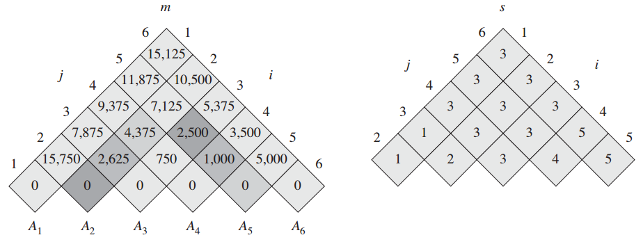

# Matrix Chain Multiplication


<!-- TOC -->

- [Matrix Chain Multiplication](#matrix-chain-multiplication)
    - [完全括号化的（fully parenthesized）矩阵乘积链](#完全括号化的fully-parenthesized矩阵乘积链)
        - [矩阵链乘法问题](#矩阵链乘法问题)
    - [描述最优解的结构](#描述最优解的结构)
    - [递归求解方案](#递归求解方案)
    - [自底向上计算最优代价](#自底向上计算最优代价)
        - [子问题图](#子问题图)
        - [下面列出子矩阵链长度为 2 和 3 时的计算过程](#下面列出子矩阵链长度为-2-和-3-时的计算过程)
            - [长度为 2，只计算 $p*q*r$](#长度为-2只计算-pqr)
            - [长度为 3](#长度为-3)
                - [$m[1, 3]$](#m1-3)
                - [$m[2, 4]$](#m2-4)
                - [$m[3, 5]$](#m3-5)
                - [$m[4, 6]$](#m4-6)
        - [复杂度](#复杂度)
        - [构造最优解](#构造最优解)
        - [实际计算矩阵链乘积](#实际计算矩阵链乘积)
    - [Referecens](#referecens)

<!-- /TOC -->


## 完全括号化的（fully parenthesized）矩阵乘积链
1. A product of matrices is fully parenthesized if it is either a single matrix or the product of two fully parenthesized matrix products, surrounded by parentheses.
2. 注意这个定义就是递归的。初始状态的单个矩阵是完全括号化的；然后两个单个矩阵加上括号相乘也是完全括号化的；相乘的结果再加上括号乘以单个矩阵或者乘以其他相乘的结果，还是完全括号化的。
3. 矩阵相乘是满足交换律的，所以一个矩阵序列不管按照什么顺序相乘结果都一样。但是，按照不同的顺序相乘的成本可能是不同的。
4. 矩阵相乘算法如下
    ```cpp
    #include <stdio.h>

    #define p 2
    #define q 3
    #define r 4

    int A[p][q] = {
        {1, 2, 3},
        {1, 2, 3},
    };

    int B[q][r] = {
        {4, 5, 6, 7},
        {4, 5, 6, 7},
        {4, 5, 6, 7}
    };

    void matrix_multiply(int A[p][q], int B[q][r], int C[p][r]) {
        for (int i=0; i<p; i++) {
            for (int j=0; j<r; j++) {
                for (int k=0; k<q; k++) {
                    C[i][j] += A[i][k] * B[k][j];
                }
            }
        }
    }

    int main(void) {
        int C[p][r] = {0};
        matrix_multiply(A, B, C);

        for (int i=0; i<p; i++) {
            for (int j=0; j<r; j++) {
                printf("%-2d ", C[i][j]);
            }
            printf("\n");
        }
    }
    ```
5. 因为有三层循环，所以两个矩阵相乘的成本是 $p*q*r$。

### 矩阵链乘法问题
1. 看书，《算法导论》211 页。
2. 解决这个问题并不是为了优化矩阵链乘法，因为解决这个问题本身花费的时间要比它带来的优化时间还多。


## 描述最优解的结构
1. 动态规划方法的第一步是寻找最优子结构，然后就可以利用这种子结构从子问题的最优解构造出原问题的最优解。
2. 在钢条切割和硬币找零问题时，我们设想的最优解结构的两部分是一块钢条（一枚硬币）和剩下部分的最优解；但是在这里，最优解的结构不一定就是一个矩阵和剩下的矩阵的最优解，也可能是若干个矩阵的最优解和剩下的若干个矩阵的最优解。也就是说最优解不是一对多，而是多对多。
3. 看《算法导论》212 页的数学描述。


## 递归求解方案
1. 所以，最优解的矩阵相乘成本包括三部分：
    * 前半部分若干个矩阵的最优计算成本
    * 后半部分若干个矩阵的最优计算成本
    * 前后两个乘积矩阵相乘的计算成本
2. 再考虑平凡和非平凡的情况：如果矩阵链就只有一个矩阵，那没有成本；如果有超过一个矩阵，那就要按照上面三部分的结构来计算。
3. 看《算法导论》212 页的数学描述。


## 自底向上计算最优代价
1. 怎么自底向上？为了计算一个矩阵链的代价，我们可能需要它内部所有组合的代价。
2. 也就是说为了计算 $m[1, n]$，对于 $1 \leq i \leq j \leq n$，我们需要计算 $C_n^2$ 种可能的 `[i, j]` 组合。
3. 因此，我们自底向上的：
    1. 先计算所有两个矩阵相乘的代价；
    2. 再计算所有三个矩阵相乘的代价；
    3. 再计算所有四个矩阵相乘的代价；
    4. ……
    5. 再计算所有 $n-1$ 个矩阵相乘的代价；
    6. 最后的出 $n$ 个矩阵相乘的代价。
4. 上面除了第一步计算两个矩阵相乘的代价以外，每一步的计算都会用到之前计算的结果。所以要把每次计算你的结果存入表中。
5. 注意因为矩阵链的顺序是固定的，所以在计算几个矩阵相乘时候，它们肯定是连在一起的。例如两个矩阵相乘肯定只有 $n-1$ 中可能。如果我们不固定矩阵的顺序，也考虑进去顺序的变化，也就是说矩阵位置可以任意调整，那两个矩阵相乘就有更多的可能性了。
6. 根据第三步的描述：我们要循环 $2...n$，在每轮循环里面遍历当前所有可能的组合；通过不同的分隔位置计算每种组合的最优代价，并保存最优代价。
7. 看《算法导论》213 页的数学描述。
8. 实现如下
    ```js
    const costs = [];
    const splitPoints = [];


    function matrix_chain_order (chain) {
        let len = chain.length;

        if (len === 1) {
            return 0;
        }

        // 从 1 开始计数，计算比较好理解，最后输出的表格也好理解
        let _chain = chain.slice(0);
        _chain.unshift({});

        initTables(len, costs, splitPoints);

        for (let count = 2; count <= len; count++) { // 遍历每种子链长度
            for (let i = 1; i <= len-count+1; i++) { // 遍历当前子链中所有的矩阵组合
                let j = i + count - 1;
                let min = Number.POSITIVE_INFINITY;
                let kPos = 0;
                for (let k = i; k <= j-1; k++ ) { // 遍历所有分隔符的位置来计算代价
                    let c = costs[i][k] + costs[k+1][j] + subchainMultiplyCost(_chain, i, k, j);
                    if (c < min) {
                        min = c;
                        kPos = k;
                    }
                }
                costs[i][j] = min;
                splitPoints[i][j] = kPos;
            }
        }
        return costs[1][len];
    }


    // 初始化两个表格
    // 两个表格的逻辑有些不同，所以各自使用了独立的循环来初始化更好理解
    function initTables(chainLen, cTable, spTable) {
        // 初始化最优成本表格
        // i 等于 chainLen 时就是最末尾的单个矩阵的成本，其实成本就是 0
        for (let i=1; i<=chainLen; i++) {
            cTable[i] = [];
            for (let j=1; j<=chainLen; j++) {
                // i 小于 j 时是矩阵链相乘的成本；
                // i 等于 j 时是单个矩阵的成本，虽然是 0，但仍然是有意义的；
                // i 大于 j 就没有意义了。
                if (i <= j) {
                    cTable[i][j] = 0;
                }
            }
        }
        // 初始化最优分割点表格
        // i 如果等于 chainLen 时就是最末尾的单个矩阵，单个矩阵不存在分割点
        for (let i=1; i<chainLen; i++) {
            spTable[i] = [];
            for (let j=1; j<=chainLen; j++) {
                // 单个矩阵不存在分割点，所以没有 i 等于 j 的情况
                if (i < j) {
                    spTable[i][j] = 0;
                }
            }
        }
    }
    // 两个子矩阵链的结果再相乘的成本
    function subchainMultiplyCost(chain, i, k, j) {
        return chain[i].r * chain[k].c * chain[j].c;
    }


    const chain = [
        {r: 30, c: 35},
        {r: 35, c: 15},
        {r: 15, c: 5 },
        {r: 5,  c: 10},
        {r: 10, c: 20},
        {r: 20, c: 25},
    ];
    matrix_chain_order(chain);
    ```
9. 下图展示了对于上面示例的矩阵链，每个子矩阵链的相乘最优代价和对应的分割位置
    

### 子问题图
1. n 个矩阵的链为例，子问题包括 n 类：
    * 所有单个矩阵的最优成本，共 n 个；
    * 所有二连矩阵的最优成本，共 n-1 个；
    * 所有三连矩阵的最优成本，共 n-2 个；
    * 所有四连矩阵的最优成本，共 n-3 个；
    * ……
    * 所有 n-1 连矩阵的最优成本，共 2 个；
    * 所有 n 连矩阵的最优成本，共 1 个。
2. 所有子问题图的节点一共有 $\frac{(n+1)n}{2}$。
3. 边的数量  TODO

### 下面列出子矩阵链长度为 2 和 3 时的计算过程
#### 长度为 2，只计算 $p*q*r$
1. $A_1 * A_2$: 30 * 35 * 15 = 15750
2. $A_2 * A_3$: 35 * 15 * 5  = 2625
3. $A_3 * A_4$: 15 * 5  * 10 = 750 
4. $A_4 * A_5$: 5  * 10 * 20 = 1000
5. $A_5 * A_6$: 10 * 20 * 25 = 5000

#### 长度为 3
##### $m[1, 3]$
* $A_1 * (A_2 * A_3): 2625 + 30 * 35 * 5  = 7875$    (最优解)
* $(A_1 * A_2) * A_3: 15750 + 30 * 15 * 5 = 18000$ 

##### $m[2, 4]$
* $A_2 * (A_3 * A_4): 750 + 35 * 15 * 10 = 6000$
* $(A_2 * A_3) * A_4: 2625 + 35 * 5 * 10 = 4375$     (最优解)

##### $m[3, 5]$
* $A_3 * (A_4 * A_5): 1000 + 15 * 5 * 20 = 2500$     (最优解)
* $(A_3 * A_4) * A_5: 750 + 15 * 10 * 20 = 3750$

##### $m[4, 6]$
* $A_4 * (A_5 * A_6): 5000 + 5 * 10 * 25 = 6250$
* $(A_4 * A_5) * A_6: 1000 + 5 * 20 * 25 = 3500$     (最优解)


### 复杂度
* 时间复杂度为  $O(n^3)$
* 存储表的空间复杂度为 $Θ(n^2)$

 $O$、大 $Θ$ 和大 $Ω$

### 构造最优解
1. 根据分割位置的表格来递归的构造一个最优解
    1. `splitPoints[1][6]` 的值是最外层的分隔位置，值为 3；
    2. 因此 `splitPoints[1][3]` 和 `splitPoints[4][6]` 是第二层的分隔位置，值为 1 和 5；
    3. 因此 `splitPoints[2][3]` 和 `splitPoints[4][5]` 是第三层的分隔位置；
2. 实现如下
    ```js
    let optimalPositions = [];
    function optimalSolution (i, j) {
        if (i < j) { // i 等于 j 的时候就是分割到只剩一个矩阵了
            let pos = splitPoints[i][j];
            optimalPositions.push(pos);
            optimalSolution(i, pos);
            optimalSolution(pos+1, j);
        }
    }

    optimalSolution(1, 6);
    console.log(optimalPositions); // [3, 1, 2, 5, 4]
    ```
3. 改造一下还可以直接打印出来结果的示意
    ```js
    let str = "";
    function printOptimalSolution (i, j) {
        if (i < j) {
            str += " ( ";
            let pos = splitPoints[i][j];
            printOptimalSolution(i, pos);
            printOptimalSolution(pos+1, j);
            str += " ) ";
        }
        else {
            str += ` A${i} `;
        }
    }

    printOptimalSolution(1, 6);
    console.log(str); //  (  (  A1  (  A2  A3  )  )  (  (  A4  A5  )  A6  )  )
    ```

### 实际计算矩阵链乘积
《算法导论》练习 15.2-2。实现如下，两个矩阵相乘的方法 `matrix_multiply` 没有实现
```js
function matrix_chain_multiply (chain, splitPoints, i, j) {
    if (i < j) { // i 等于 j 的时候就是分割到只剩一个矩阵了
        let pos = splitPoints[i][j];
        let a1 = optimalSolution(i, pos);
        let a2 = optimalSolution(pos+1, j);
        return matrix_multiply(a1, a2);
    }
    return chain[i];
}
```


## Referecens
* [算法导论](https://book.douban.com/subject/20432061/)