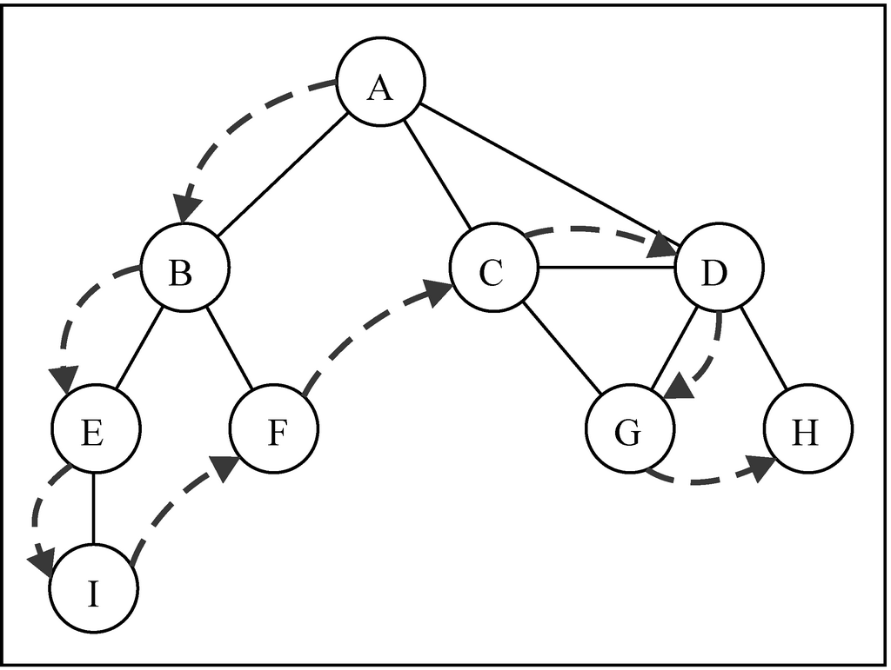
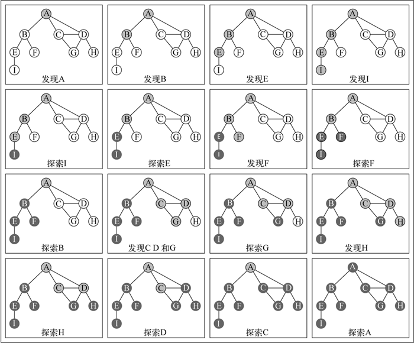
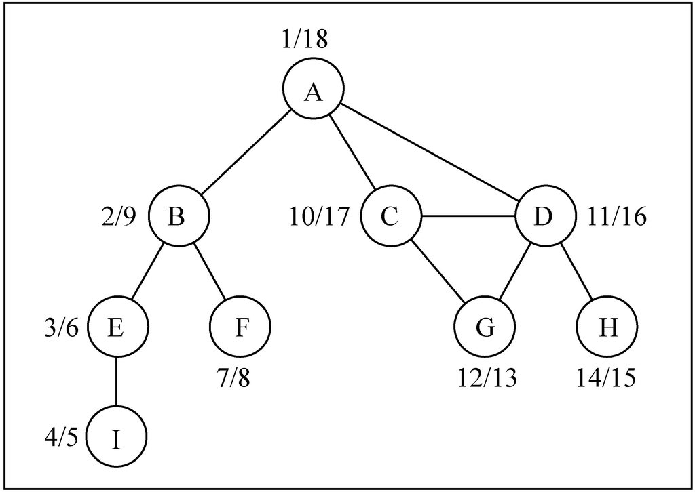
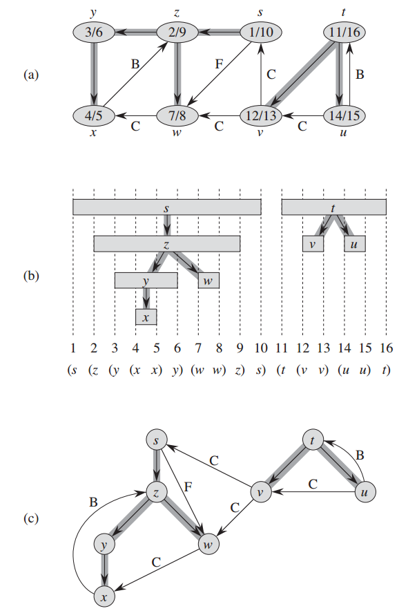

# 深度优先搜索


<!-- TOC -->

- [深度优先搜索](#深度优先搜索)
    - [深度优先遍历](#深度优先遍历)
        - [设计思想和用途](#设计思想和用途)
            - [尝试树状逻辑结构的每一条路径](#尝试树状逻辑结构的每一条路径)
            - [纵深型的逻辑结构](#纵深型的逻辑结构)
        - [实现](#实现)
        - [记录更多信息的深度遍历](#记录更多信息的深度遍历)
        - [前驱子图](#前驱子图)
    - [性质](#性质)
        - [括号化结构](#括号化结构)
        - [白色路径定理（《算法导论》定理 22.9）](#白色路径定理算法导论定理-229)
    - [边的类型](#边的类型)
        - [四种边（参考上图 (a) 中标注）](#四种边参考上图-a-中标注)
        - [类型判断](#类型判断)
        - [《算法导论》定理 22.10](#算法导论定理-2210)
    - [References](#references)

<!-- /TOC -->

## 深度优先遍历


### 设计思想和用途
#### 尝试树状逻辑结构的每一条路径
比如说简单棋类游戏的穷举法，可以在每一步都穷举不同下法的最终结果。

#### 纵深型的逻辑结构
与广度优先剥洋葱的行为模式相对

### 实现


1. 类的实例方法，遍历的入口
    ```js
    normalDFS (callback) {
        let colorMapping = initializeColorMapping(this.vertices);
        // 遍历每一个节点，如果某个节点还未被探索，则对它进行深度探索。
        // 但因为是递归遍历，如果图是无向的，那么从一个节点开始的第一轮 forEach 里面，
        // 就会遍历了所有后代节点，所以其实之后轮的 forEach 里面 vertex 都已经不是 white 了。
        // 但是在有向图中，从一个节点开始并不一定会遍历到所有节点。所以还是要用 forEach，
        // 在一次遍历到无可遍历但还有节点没有遍历到的时候，再从其他没有遍历的节点新开一轮遍历。
        this.vertices.forEach((vertex)=>{
            if (colorMapping[vertex] === 'white') {
                exploreForNormalDFS(vertex, this.adjacencyList, colorMapping, callback);
            }
        });
    }
    ```
2. 用来递归的私有方法。里面的两个 `console.log` 可以直观的显示递归关系
    ```js
    let normalDFS_indent = 0;
    function exploreForNormalDFS (vertex, adjacencyList, colorMapping, callback) {
        colorMapping[vertex] = 'grey';
        
        callback && callback(vertex);

        console.log(' '.repeat(normalDFS_indent) + 'Discovered ' + vertex);
        normalDFS_indent += 4;

        let neighborList = adjacencyList.get(vertex);
        neighborList.forEach((neighbor) => {
            if ( colorMapping[neighbor] === 'white' ) {
                exploreForNormalDFS( neighbor, adjacencyList, colorMapping, callback );
            }
        });
        colorMapping[vertex] = 'black';

        normalDFS_indent -= 4;
        console.log(' '.repeat(normalDFS_indent) + 'Explored ' + vertex);
    }
    ```
3. 测试
    ```js
    let graph = new Graph();
    let vertices = ['A','B','C','D','E','F','G','H','I'];

    vertices.forEach(vertex=>{
        graph.addVertex(vertex);
    });

    graph.addEdge('A', 'B');
    graph.addEdge('A', 'C');
    graph.addEdge('A', 'D');
    graph.addEdge('B', 'E');
    graph.addEdge('B', 'F');
    graph.addEdge('C', 'D');
    graph.addEdge('C', 'G');
    graph.addEdge('D', 'G');
    graph.addEdge('D', 'H');
    graph.addEdge('E', 'I');


    graph.normalDFS();
    // Discovered A
    //     Discovered B
    //         Discovered E
    //             Discovered I
    //             Explored I
    //         Explored E
    //         Discovered F
    //         Explored F
    //     Explored B
    //     Discovered C
    //         Discovered D
    //             Discovered G
    //             Explored G
    //             Discovered H
    //             Explored H
    //         Explored D
    //     Explored C
    // Explored A
    ```

### 记录更多信息的深度遍历
1. 通过 `discoveredTime` 记录每个节点的发现时间，通过 `exploredTime` 记录每个节点的探索完成时间；通过 `predecessors` 记录每个节点的前溯节点，从而可以构建出递归的顺序图
    
2. 类的实例方法，遍历的入口
    ```js
    DFSWidthMoreInfo () {
        let colorMapping = initializeColorMapping(this.vertices);
        const info = {
            discoveredTime: {},
            exploredTime: {},
            predecessors: {},
        }
        DFSWidthMoreInfo_time = 0;

        // 初始化每个顶点的发现时间、探索完成时间和前溯节点
        this.vertices.forEach((vertex) => {
            info.exploredTime[vertex] = 0;
            info.discoveredTime[vertex] = 0;
            info.predecessors[vertex] = null;
        });

        this.vertices.forEach((vertex) => {
            if (colorMapping[vertex] === 'white') {
                exploreForDFSWidthMoreInfo(vertex, this.adjacencyList, colorMapping, info);
            }
        });
        return info;
    }
    ```
3. 用来递归的私有方法
    ```js
    let DFSWidthMoreInfo_indent = 0;
    let DFSWidthMoreInfo_time = 0;
    function exploreForDFSWidthMoreInfo (vertex, adjacencyList, colorMapping, info) {
        colorMapping[vertex] = 'grey';

        info.discoveredTime[vertex] = ++DFSWidthMoreInfo_time;

        let neighborList = adjacencyList.get(vertex);
        neighborList.forEach((neighbor) => {
            if (colorMapping[neighbor] === 'white') {
                // 记录 vertex 为其相邻节点的前溯节点
                info.predecessors[neighbor] = vertex; 
                // 递归
                exploreForDFSWidthMoreInfo(neighbor, adjacencyList, colorMapping, info);
            }
        });

        // vertex 节点的所有子节点都遍历完成
        colorMapping[vertex] = 'black';
        info.exploredTime[vertex] = ++DFSWidthMoreInfo_time;
    };
    ```
4. 测试
    ```js
    let info = graph.DFSWidthMoreInfo();
    console.log( JSON.stringify(info, null, 4));
    // {
    //     "discoveredTime": {
    //         "A": 1,
    //         "B": 2,
    //         "C": 10,
    //         "D": 11,
    //         "E": 3,
    //         "F": 7,
    //         "G": 12,
    //         "H": 14,
    //         "I": 4
    //     },
    //     "exploredTime": {
    //         "A": 18,
    //         "B": 9,
    //         "C": 17,
    //         "D": 16,
    //         "E": 6,
    //         "F": 8,
    //         "G": 13,
    //         "H": 15,
    //         "I": 5
    //     },
    //     "predecessors": {
    //         "A": null,
    //         "B": "A",
    //         "C": "A",
    //         "D": "C",
    //         "E": "B",
    //         "F": "B",
    //         "G": "D",
    //         "H": "D",
    //         "I": "E"
    //     }
    // }
    ```

### 前驱子图
TODO 《算法导论》说 BFS 的前驱子图是一棵树，DFS 的前驱子图可能是多棵树。为什么可能是多棵树？如果是无向图那只需要一个起点就能遍历完成了吧，而如果是有向图，那 DFS 也同样可能需要多个起点。


## 性质
### 括号化结构
1. 参考《算法导论》的图 22-5
    
2. 从图 22-5 首先可以看到 DFS 的深度优先森林由两棵树组成；而且能看出在每棵树里面都有规整的括号化嵌套结构：  
    * 第一棵深度优先树的根节点是 s，它有一个子节点 z，z 有两个子节点 y 和 w，y 还有一个子节点 x。
    * 第二棵深度优先树的根节点是 t，它有两个子节点 v 和 u。
3. 因为是深度优先森林，所以图 (b) 和 (c) 里面的边都是树边。 
4. 《算法导论》定理 22.7 说明了在深度优先森林中，两个节点要么是父子关系，要么就是在不同的树里面。如果是父子关系，则子肯定完全嵌套在父的区间内（《算法导论》推论 22.8）。

### 白色路径定理（《算法导论》定理 22.9）
1. 如果是子节点，那肯定至少有一条纯白色路径。如果一条都没有，那就递归不到。
2. 反过来说，有一条纯白色路径，就一定能递归到吗？只要它们是在森林中的同一棵树，那就一定会递归到。在同一棵树里，要么是童一支的祖先和后辈关系，要么就是不同分支的关系；但是如果是不同分支，那就不会有纯白色路径。


## 边的类型
### 四种边（参考上图 (a) 中标注）
* **树边**（Tree edge）：are edges in the depth-first forest $G_{\pi}$。Edge $(u, v)$ is a tree edge if $v$ was first discovered by exploring edge $(u, v)$。例如上图 (a) 中的边 $(t, u)$。
* **后向边**（Back edge）：are those edges $(u, v)$ connecting a vertex $u$ to an ancestor $v$ in a
depth-first tree. 例如上图 (a) 中的边 $(u, t)$ 和 $(x, z)$。We consider self-loops, which may occur in directed graphs, to
be back edges.
* **前向边**（Forward edge）：are those **nontree** edges $(u, v)$ connecting a vertex $u$ to a descendant $v$ in a depth-first tree. 例如上图 (a) 中的边 $(s, w)$。
* **横向边**（Cross edge）：are all other edges. They can go between vertices in the same
depth-first tree, as long as one vertex is not an ancestor of the other, or they can
go between vertices in different depth-first trees. 例如上图 (a) 中的边 $(w, x)$ 和 $(v, w)$。

### 类型判断
TODO，《算法导论》上说的 “第一次探索边”，是在哪个时刻？第三种情况中，“第一次探索 $(u, v)$ 时 $v$ 为黑色”，以前向边 $s, w$ 为例，第一次探索时如果是刚发现 $w$ 时，那它肯定是白色啊，怎么可能是黑色。

### 《算法导论》定理 22.10
TODO


## References
* [学习JavaScript数据结构与算法](https://book.douban.com/subject/26639401/)
* [算法（第4版）](https://book.douban.com/subject/19952400/)
* [Python数据结构与算法分析（第2版）](https://book.douban.com/subject/34785178/)