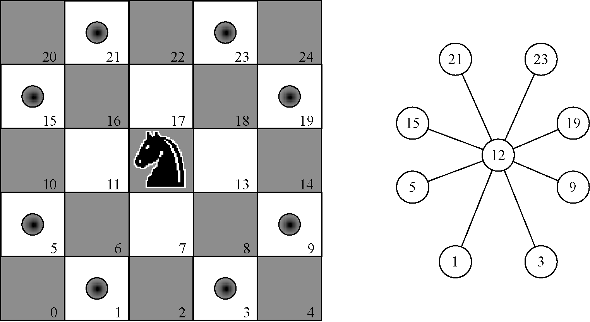
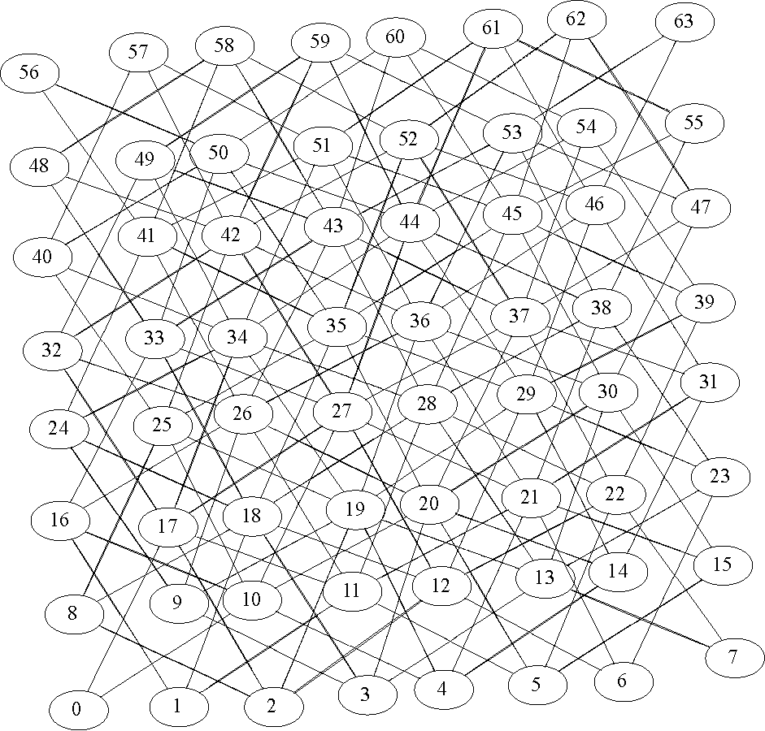

# Knight’s Tour

<!-- TOC -->

- [Knight’s Tour](#knights-tour)
    - [设计思想](#设计思想)
        - [为什么可以用图](#为什么可以用图)
    - [构建图](#构建图)
        - [思路](#思路)
        - [实现](#实现)
        - [构建结果](#构建结果)
    - [实现骑士周游](#实现骑士周游)
        - [深度优先遍历和周游的区别](#深度优先遍历和周游的区别)
        - [周游路径](#周游路径)
        - [思路](#思路-1)
        - [实现](#实现-1)

<!-- /TOC -->


## 设计思想
### 为什么可以用图


## 构建图
### 思路
1. 每个格子都是一个顶点，每个格子都有若干种走法走到其他格子，每种走法对应一条边。
2. 我们需要遍历所有的顶点，然后在每个顶点，根据合理走法的路径来连接若干个顶点
    

### 实现
1. 构建函数
    ```js
    const SIZE = 8;

    function geneKnightGraph () {
        let graph = new Graph();

        // 通过两个循环来遍历每个格子
        for ( let x=0; x<SIZE; x++ ) {
            for ( let y=0; y<SIZE; y++ ) {
                // 使用当前格子的 id 作为节点添加到图里面
                let nodeId = posToNodeId(x, y);
                graph.addVertex(nodeId);
            }
        }

        for ( let x=0; x<SIZE; x++ ) {
            for ( let y=0; y<SIZE; y++ ) {
                // 获取当前格子的 id
                let nodeId = posToNodeId(x, y);
                // 获取从当前位置可以走到的若干个位置
                let legalNodes = genLegalMoves(x, y);
                // 遍历可以走到的位置
                legalNodes.forEach((node) => {
                    // 分别获取 id，并和当前位置的 id 连接为一条边
                    let id = posToNodeId(...node);
                    graph.addEdge(nodeId, id);
                });
            }
        }

        return graph;
    }
    ```
2. `posToNodeId` 函数把每个格子的左边转换为一个顶点 ID
    ```js
    function posToNodeId (x, y) {
        return y*8 + x;
    }
    ```
3. `genLegalMoves` 获取当前格子可以跳到的若干个目标格子，用当前格子和每个目标各自连接为一个边
    ```js
    function genLegalMoves (x, y) {
        let legalNodes = [];
        let moveOffsets = [
            [-1, -2], 
            [-1,  2], 
            [-2, -1], 
            [-2,  1],
            [1,  -2], 
            [1,   2], 
            [2,  -1], 
            [2,   1]
        ];

        moveOffsets.forEach((item) => {
            let newX = x + item[0];
            let newY = y + item[1];
            if ( isLegalCoord(newX, newY) ) {
                legalNodes.push([newX, newY]); 
            }
        });

        return legalNodes;
    }

    function isLegalCoord (x, y) {
        return x >=0 && x < SIZE && y >=0 && y < SIZE;
    }
    ```

### 构建结果
1. 构建出来的图应该是下面这样子的
    
2. 构建结果
    ```js
    let graph = geneKnightGraph();
    console.log(graph.toString());
    // 0 -> 17 10 
    // 8 -> 25 2 18 
    // 16 -> 1 33 10 26 
    // 24 -> 9 41 18 34 
    // 32 -> 17 49 26 42 
    // 40 -> 25 57 34 50 
    // 48 -> 33 42 58 
    // 56 -> 41 50 
    // 1 -> 16 18 11 
    // 9 -> 24 26 3 19 
    // 17 -> 0 32 2 34 11 27 
    // 25 -> 8 40 10 42 19 35 
    // 33 -> 16 48 18 50 27 43 
    // 41 -> 24 56 26 58 35 51 
    // 49 -> 32 34 43 59 
    // 57 -> 40 42 51 
    // 2 -> 8 17 19 12 
    // 10 -> 0 16 25 27 4 20 
    // 18 -> 8 24 1 33 3 35 12 28 
    // 26 -> 16 32 9 41 11 43 20 36 
    // 34 -> 24 40 17 49 19 51 28 44 
    // 42 -> 32 48 25 57 27 59 36 52 
    // 50 -> 40 56 33 35 44 60 
    // 58 -> 48 41 43 52 
    // 3 -> 9 18 20 13 
    // 11 -> 1 17 26 28 5 21 
    // 19 -> 9 25 2 34 4 36 13 29 
    // 27 -> 17 33 10 42 12 44 21 37 
    // 35 -> 25 41 18 50 20 52 29 45 
    // 43 -> 33 49 26 58 28 60 37 53 
    // 51 -> 41 57 34 36 45 61 
    // 59 -> 49 42 44 53 
    // 4 -> 10 19 21 14 
    // 12 -> 2 18 27 29 6 22 
    // 20 -> 10 26 3 35 5 37 14 30 
    // 28 -> 18 34 11 43 13 45 22 38 
    // 36 -> 26 42 19 51 21 53 30 46 
    // 44 -> 34 50 27 59 29 61 38 54 
    // 52 -> 42 58 35 37 46 62 
    // 60 -> 50 43 45 54 
    // 5 -> 11 20 22 15 
    // 13 -> 3 19 28 30 7 23 
    // 21 -> 11 27 4 36 6 38 15 31 
    // 29 -> 19 35 12 44 14 46 23 39 
    // 37 -> 27 43 20 52 22 54 31 47 
    // 45 -> 35 51 28 60 30 62 39 55 
    // 53 -> 43 59 36 38 47 63 
    // 61 -> 51 44 46 55 
    // 6 -> 12 21 23 
    // 14 -> 4 20 29 31 
    // 22 -> 12 28 5 37 7 39 
    // 30 -> 20 36 13 45 15 47 
    // 38 -> 28 44 21 53 23 55 
    // 46 -> 36 52 29 61 31 63 
    // 54 -> 44 60 37 39 
    // 62 -> 52 45 47 
    // 7 -> 13 22 
    // 15 -> 5 21 30 
    // 23 -> 13 29 6 38 
    // 31 -> 21 37 14 46 
    // 39 -> 29 45 22 54 
    // 47 -> 37 53 30 62 
    // 55 -> 45 61 38 
    // 63 -> 53 46 
    ```


## 实现骑士周游
### 深度优先遍历和周游的区别
1. 只要是无向图，深度优先遍历就一定会不重复的遍历所有的节点
    
2. 使用 “不重复” 这个描述都是不必要的，深度优先遍历根本没有重复这个概念，它就只会取访问还没有被访问的节点，而不考虑当前节点和接下来要访问的节点是否连接。例如上图中访问了 I 之后下一个访问的不连接的 F。
3. 而周游则要求下一个访问的节点必须和当前节点连接，所以上图中是无法实现不重复周游的。

### 周游路径
1. 因为深度优先遍历是先沿着一条路径走到底，然后再回退尝试其他路径。这样的每一条路径都是一种周游尝试。
2. 例如在上图中，有 4 条路径，分别是
    * A-B-E-I
    * A-B-F
    * A-C-D-G
    * A-C-D-H
3. 如果从 A 开始尝试周游的话，这四条路径都无法实现周游。

### 思路
1. 在分析深度优先遍历的时候，总结了深度优先遍历是依次尝试每一种可能性。先从一条路一路走到黑，如果不行就回退尝试其他可能性，一个一个的尝试。
2. 骑士周游正好就可以使用这样的思路：从任意一个起点开始，都会有若干个岔路，而每一个岔路又会有若干个岔路。最终会形成很多条路径。
3. 使用深度优先遍历依次尝试每一种路径，看看在当前路径上能不能不重复的访问 64 个节点。如果可以那就算是一个解，如果不行就再回退尝试其他路径。

### 实现
1. 首先是总的函数，用来获得可能的完整巡游路径
    ```js
    function getTourPath (graph) {
        let colorMapping = initializeColorMapping(graph.vertices);
        let path = []; // 用来记录巡游路径
        let adjacencyList = graph.adjacencyList;

        // 依次尝试每个格子作为巡游起点，知道找到一个完整的巡游路径
        // knightTourDFS 返回 true 表示不重复的走完了所有格子
        graph.vertices.some((v)=>{
            return knightTourDFS(v, adjacencyList, colorMapping, path);
        });

        return path;
    }
    ```
2. `knightTourDFS` 实现深度优先遍历的巡游 
    ```js
    const LEN = 64;

    function knightTourDFS (vertex, adjacencyList, colorMapping, path) {
        colorMapping[vertex] = 'grey';

        path.push(vertex);
        let isDone = false;

        // 如果递归记录的路径达到了 64 个，就证明已经巡游完成了所有的格子
        if ( path.length < LEN ) {
            let neighborList = adjacencyList.get(vertex);
            // 依次尝试每个分支的路径
            for ( let neighbor of neighborList) {
                if (colorMapping[neighbor] === 'white') { // 不能到重复的格子去
                    isDone = knightTourDFS(neighbor, adjacencyList, colorMapping, path);
                    // 递归返回 true 就证明当前这个路径完成了 64 个格子的巡游
                    // 跳出循环，之后会也会向父级的调用返回值为 true 的 isDone
                    if ( isDone ) {
                        break;
                    }
                }
            }
            // 如果递归返回了 false，证明最终该条路径没有走通，
            // 也就是到了某个格子后，还不够 64 但已经没有没走过的格子可以跳了
            // 那么当前这条路径的尝试就作废了，当前节点要从路径栈中出栈完成回退
            // 同时，当前格子也要再变回白色，因为其他路径的尝试还会再试图访问这个格子
            if ( !isDone ) {
                path.pop();
                colorMapping[vertex] = 'white';
            }
        }
        else {
            isDone = true;
        }

        return isDone;
    }
    ```
3. 一种巡游结果
    ```js
    let path = getTourPath (graph);
    console.log(path);
    // [0, 17, 32, 49, 34, 24, 9, 26, 16, 1, 18, 8, 25, 40, 57, 42, 48, 33, 50, 56, 41, 58, 43, 28, 11, 5, 20, 10, 27, 12, 2, 19, 4, 14, 29, 35, 52, 62, 47, 37, 31, 46, 63, 53, 59, 44, 61, 51, 36, 30, 15, 21, 6, 23, 38, 55, 45, 60, 54, 39, 22, 7, 13, 3]
    ```
    从第一个格子开始就可以完成完整巡游