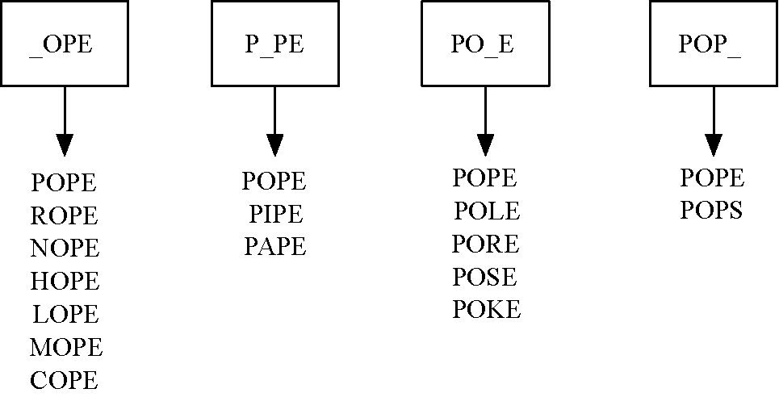

# Word ladder


<!-- TOC -->

- [Word ladder](#word-ladder)
    - [设计思想](#设计思想)
        - [为什么可以使用广度优先遍历模型](#为什么可以使用广度优先遍历模型)
        - [单词桶的思想](#单词桶的思想)
    - [单词桶的建立](#单词桶的建立)
    - [图的建立和遍历](#图的建立和遍历)
    - [References](#references)

<!-- /TOC -->


## 设计思想
### 为什么可以使用广度优先遍历模型
1. 广度优先遍历的一种抽象是：一些对象和目标相差 1 个单位，一些对象和目标相差 2 个单位……
2. 而计算最短路径的作为广度优先遍历的一个用途，就是计算一个距离目标 N 个单位的对象，中间是哪 N-2 各中间对象。
3. 关键词：差别若干个单位，差别的中间对象。
4. 词梯问题中，两个单词差了若干个字母，而且想知道怎么从一个单词以字母为单位的逐步转换到另一个单词。

### 单词桶的思想
1. 开始的问题是，我们有一个目标单词，然后需要找到所有和目标单词只差一个字母的单词。
2. 穷举法很容易想到，但是是平方级别的复杂度。
3. 穷举法的思想是，目标单词逐一的和其他单词比较，看看两者能不能建立起某种关系。这里的关系就是只差一个字母。
4. 如果可以建立起关系，就可以说这两个单词是 **一类** 的。
5. 有 N 个单词，就有 N 个类别。我们需要查看每一个单词都属于哪几个类别。
6. 上面的思路是每次拿出一个类别，然后再遍历单词看看有哪些单词属于这个类别。而另一种相反的思路就是每次拿出一个单词，然后遍历所有的类别看看它属于哪几个类别。
7. 遍历最慢是 $O(n)$ 的复杂度，但如果用哈希表则可以达到 $O(1)$ 的复杂度。
8. 如果把类别作为哈希表的键，那符合该类别的单词组成的列表就可以作为对应的值。
9. 上面说到的类别是某个单词，那么可能会想到将每个单词都作为一个键。但实际上不少单词都是属于同一个类别的，比如 `nope` 和 `hope`，它们不应该作为两个独立的键，而是应该作为对应的值里面的两个项。
10. 所以键不应该是具体的单词，而应该是一个抽象的表示，即 `*ope`。


## 单词桶的建立
1. 因为图的相邻节点都是相差一个单位，所以这里就应该把只差一个字母的单词建立为相邻节点。建立好之后的图大概是这个样子
    
2. 为了连接这些顶点，可以将每个单词与列表中的其他所有单词进行比较。对于只有少量单词的情况，这个算法还不错。但是，假设列表中有 5110 个单词，将一个单词与列表中的其他所有单词进行比较，时间复杂度为 $O(n^2)$。对于 5110 个单词来说，这意味着要进行 $(5109 + 1) * 5109 / 2 = 13053495$ 次比较。
3. 采用下述方法，可以更高效地构建这个关系图。假设有数目巨大的桶，每一个桶上都标有一个长度为 4 的单词，但是某一个字母被下划线代替。下图展示了一些例子
    
4. 当处理列表中的每一个单词时，将它与桶上的标签进行比较。使用下划线作为通配符，我们将 POPE 和 POPS 放入同一个桶中。一旦将所有单词都放入对应的桶中之后，我们就知道，同一个桶中的单词一定是相连的。
5. 桶列表的实现如下
    ```js
    function createBucketList ( words ) {
        let bucketList = {};
        words.forEach((word) => {
            [...word].forEach((char, index) => {
                let bucket = word.slice(0, index) + '*' + word.slice(index+1);
                if ( bucket in bucketList ) {
                    bucketList[bucket].push(word);
                }
                else {
                    bucketList[bucket] = [word];
                }
            });
        });
        return bucketList;
    }
    ```
6. 可以看出来，外循环的次数是单词数量，每个内循环的次数是当前单词的字母数，也就是实际的比较次数是所有单词的字母数总和，时间复杂度是 $O(n)$。


## 图的建立和遍历
1. 有了桶列表，就可以构建图了
    ```js
    let graph = new Graph();
    let vertices = words;

    vertices.forEach(vertex=>{
        graph.addVertex(vertex);
    });

    Object.entries(list).forEach(([bucketName, words]) => {
        let len = words.length;
        for ( let i=0; i<len-1; i++ ) {
            for ( let j=i+1; j<len; j++ ) {
                graph.addEdge( words[i], words[j]);
            }
        }
    });

    console.log(graph.toString());
    // fool -> pool cool foul foil 
    // foul -> fool foil 
    // foil -> fool foul fail 
    // fail -> foil fall 
    // fall -> fail pall 
    // pall -> fall poll pale 
    // pole -> pale pope poll 
    // poll -> pall pole pool 
    // pool -> fool cool poll 
    // cool -> fool pool 
    // pope -> pole 
    // sale -> pale sage 
    // pale -> pall pole sale page 
    // sage -> sale page 
    // page -> pale sage 
    ```
2. 然后可以遍历查找最短路径，这里以计算 fool-sage 为例
```js
console.log( graph.getShortestPaths('fool').sage ); // fool-pool-poll-pall-pale-sale-sage
```


## References
* [Python数据结构与算法分析（第2版）第 7 章](https://www.ituring.com.cn/book/tupubarticle/27759)