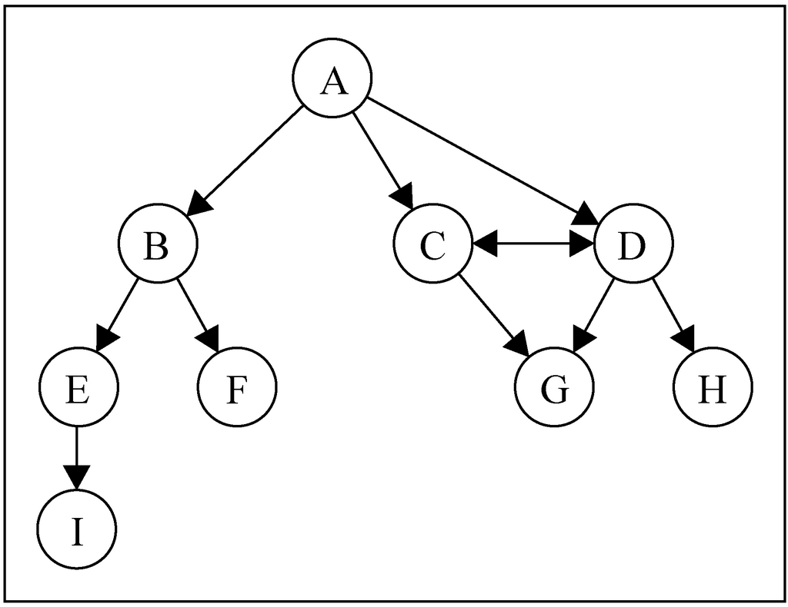
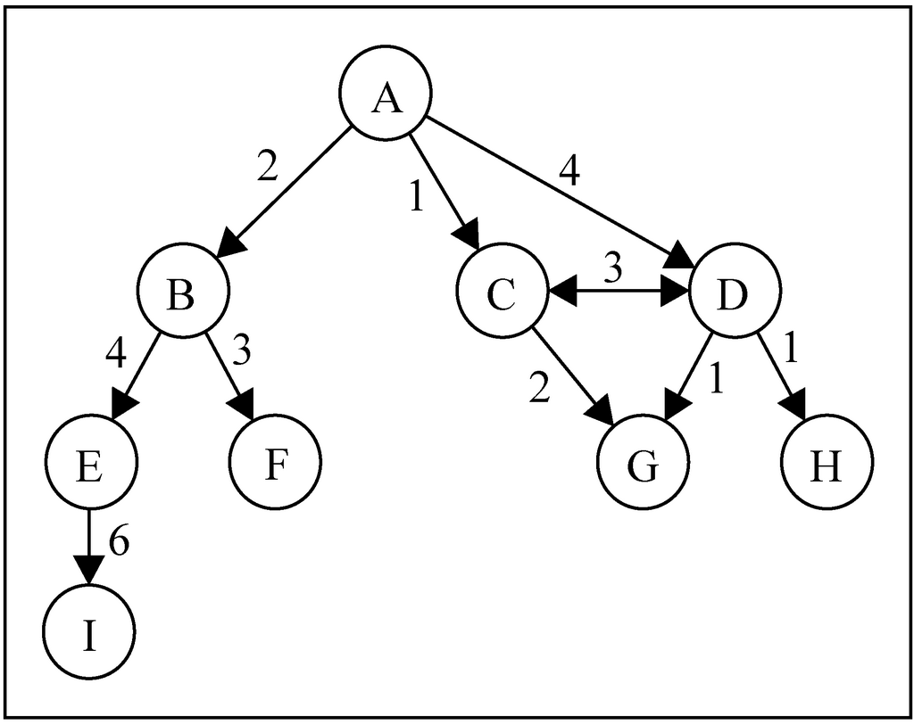
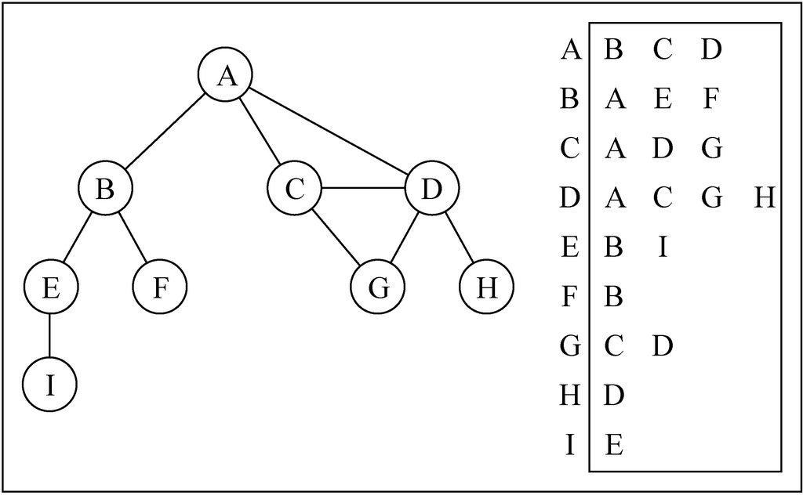
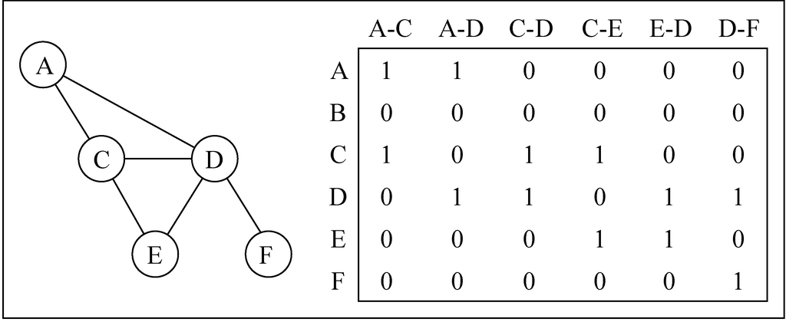
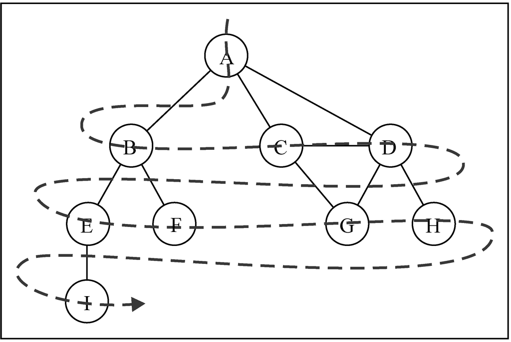
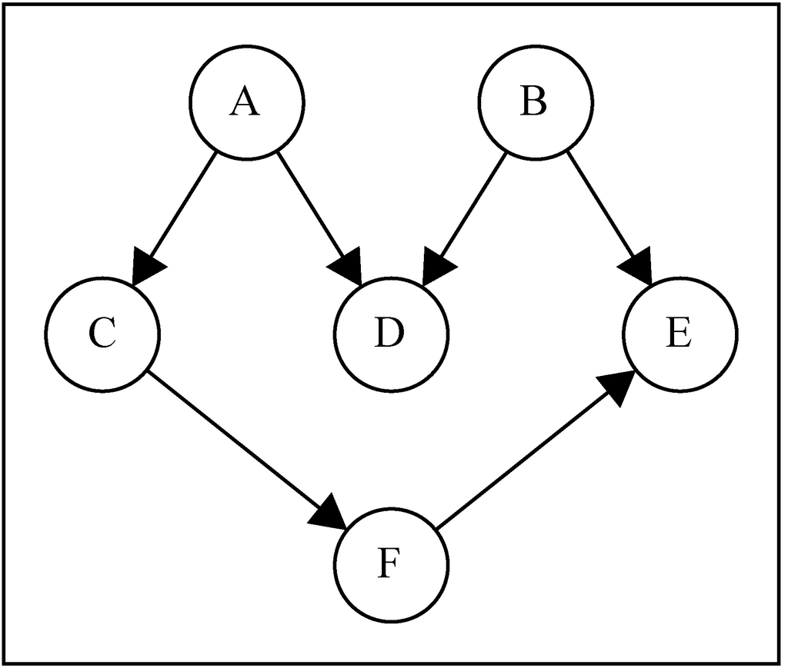

# Graph


<!-- TOC -->

- [Graph](#graph)
    - [设计思想](#设计思想)
        - [抽象为纯数学概念](#抽象为纯数学概念)
    - [抽象本质——基于现实关系的抽象](#抽象本质基于现实关系的抽象)
        - [建立边的依据——连接意味着什么？](#建立边的依据连接意味着什么)
        - [广度优先遍历](#广度优先遍历)
            - [广度优先——强调先完成一层再处理下一层](#广度优先强调先完成一层再处理下一层)
            - [层次次序感——按层顺序向外扩散，强调距离起点的远近亲疏](#层次次序感按层顺序向外扩散强调距离起点的远近亲疏)
        - [广度优先遍历计算差别](#广度优先遍历计算差别)
        - [最短路径](#最短路径)
        - [深度优先遍历](#深度优先遍历)
            - [依次尝试每一种可能性](#依次尝试每一种可能性)
            - [点对点的因果（或层级）关系](#点对点的因果或层级关系)
    - [用途](#用途)
        - [广度优先遍历计算对象差距](#广度优先遍历计算对象差距)
        - [深度优先遍历穷举法](#深度优先遍历穷举法)
    - [概念](#概念)
        - [路径和环](#路径和环)
        - [连通性](#连通性)
        - [有向图和无向图](#有向图和无向图)
        - [加权性](#加权性)
    - [图的表示](#图的表示)
        - [邻接矩阵](#邻接矩阵)
        - [邻接表](#邻接表)
        - [关联矩阵](#关联矩阵)
    - [使用邻接表创建图](#使用邻接表创建图)
    - [图的遍历综述](#图的遍历综述)
        - [遍历的关键逻辑](#遍历的关键逻辑)
        - [不规则的遍历](#不规则的遍历)
    - [广度优先搜索](#广度优先搜索)
        - [设计思想和用途](#设计思想和用途)
            - [逐层探索，剥洋葱](#逐层探索剥洋葱)
            - [获得层级距离关系](#获得层级距离关系)
        - [逻辑顺序](#逻辑顺序)
            - [关键点](#关键点)
        - [实现](#实现)
        - [有向图的 BFS](#有向图的-bfs)
            - [实现](#实现-1)
        - [记录更多信息的广度遍历](#记录更多信息的广度遍历)
        - [复杂度](#复杂度)
    - [使用 `BFSWidthMoreInfo` 寻找最短路径](#使用-bfswidthmoreinfo-寻找最短路径)
    - [深度优先遍历](#深度优先遍历-1)
        - [设计思想和用途](#设计思想和用途-1)
            - [尝试树状逻辑结构的每一条路径](#尝试树状逻辑结构的每一条路径)
            - [纵深型的逻辑结构](#纵深型的逻辑结构)
        - [实现](#实现-2)
        - [记录更多信息的深度遍历](#记录更多信息的深度遍历)
        - [拓扑排序](#拓扑排序)
    - [References](#references)

<!-- /TOC -->


## 设计思想
### 抽象为纯数学概念
1. 广度优先遍历中，我们有了距离的概念。
2. 从物理的距离抽象到虚拟的距离，我们有了朋友关系的虚拟距离模型。
3. 在解决词梯问题问题是，我们把 “距离” 的概念进一步抽象为 “差别”。本来距离是一个长度、远近的概念，但现在抽象为差距之后，就有了更广泛的适用场景，就可以用来模拟词梯问题问题中两个单词的差距。
4. 一个概念越抽象，就越具有普适性。


## 抽象本质——基于现实关系的抽象
1. 多个对象之间的关系。
2. 任何表示若干对象关系的逻辑都可以抽象成图的数据结构。
3. 或者说，任何现实事物都可以抽象成任何数据结构模型，就看合适程度。

### 建立边的依据——连接意味着什么？
1. 如果要把一组对象建立为图的模型，怎么确定哪些对象为相邻的边？
2. 从下面广度优先遍历的分析中可以看出来，相邻的节点具有一个单位的差别。
3. 所以，当我们以某种维度的属性作为差别来分析一组对象时，互相连接的就应该是具有一个单位差别的对象。
4. 在词梯的例子中，互相连接的两个单词是只有一个字母差别的。

### 广度优先遍历
#### 广度优先——强调先完成一层再处理下一层
1. 每次探索一个节点，都要先找到它的所有相邻节点，才会再探索其中每一个相邻节点。
2. 先优先探索完一个节点，再探索它的相邻节点。探索完它的所有相邻节点后，再探索这些相邻节点的相邻节点。

#### 层次次序感——按层顺序向外扩散，强调距离起点的远近亲疏
1. 在一个关系网中，是可以用层次关系来表示的。例如：我的朋友——我的朋友的朋友——我的朋友的朋友的朋友，广度优先就是按照这种层次关系来遍历的，因此可以很好的反应出整个关系网中的每个节点和起始节点的层次关系。
2. 又因为这种从起点逐层向外扩展的遍历方式，所以也很方便确定起始点距离任何节点的层级距离。

### 广度优先遍历计算差别
1. 广度优先计算距离的过程，实际上就是计算每个节点和起始节点的差别多少。
2. 这个差别可能是距离、可能是级别，可能是任何可量化的差别。
3. 任何可以抽象为 “和目标有一个单位差别、两个单位差别……” 这样的情况，都有可能能用广度优先遍历来模拟。

### 最短路径
1. 可以抽象为最少步骤或者是最少差别。
2. 其实不管是说 “步骤” 还是 “差别”，都还是不够抽象，所以其他一些可以用广度优先遍历解决的问题并不是关于步骤或者差别的。

### 深度优先遍历
#### 依次尝试每一种可能性
1. 事物从一个起始状态开始发展，会经历很多个选择节点，每个选择节点都会导致不同的结果，这样会形成一个庞大的树状结构，最终形成很多个终点结果。
2. 深度优先遍历会从起始状态开始，依次遍历从起点到终点的每一条路径。
3. 先一根筋到底尝试一种可能性，不撞南墙不回头。
4. 撞了南墙，走到了这条路的终点，再回退尝试其他的路径。

#### 点对点的因果（或层级）关系
1. 广度优先也是有层级关系有顺序的，第一层不完成则不可能进到第二层，因此使用广度优先也可以实现拓扑排序。
2. 但广度优先的层级关系是以层为单位的，第一层和第二层之间，整层的层级关系。
3. 而深度优先则是两个节点之间的层级关系。这种节点级别的层级关系，更适合用来描述因果关系。
4. 深度优先适合用来描述 “做完这件事才能做那件事”，广度优先适合用来描述 “做完第一阶段的若干任务后，再做第二阶段的若干任务”。
5. 也可以是单点对多点或者多点对单点。比如说 A 部门和 B 部门平级，A 部门的经理可以管 A 部门的员工，但 B 部门的经理就不能管 A 部门的员工。


## 用途
1. 首先，图就是对现实世界抽象的一种数据结构，它本身只是现实世界的模型。
2. 可以说图本身是并没有什么用的，就看你要用这个数据结构来做什么。甚至更进一步说，对图的遍历操作，也仅仅是一种没有实际意义的操作，但它却是对实际的用途提供了一种重要的方法。

### 广度优先遍历计算对象差距

### 深度优先遍历穷举法
1. 骑士巡游问题就是穷举每一条路径，直到找到一条合理的。


## 概念


### 路径和环
1. **简单路径** 要求不包含重复的节点。A D G 是一条简单路径。
2. A D C A 是一个 **环**。如果图中不存在环，则称该图是 **无环** 的。

### 连通性
如果图中每两个节点间都存在路径，则该图是 **连通的**。

### 有向图和无向图
1. 图可以是 **无向的**（边没有方向）或是 **有向的**（有向图）。如上图所示，有向图的边有一个方向。
2. 如果图中每两个节点间在双向上都存在路径，则该图是 **强连通的**。例如，C 和 D 是强连通的，而 A 和 B 不是强连通的。

### 加权性
图还可以是 **未加权的** 或是 **加权的**。如下图所示，加权图的边被赋予了权值：



## 图的表示
### 邻接矩阵
1. 我们用一个二维数组来表示节点之间的连接。如果索引为 `i` 的节点和索引为 `j` 的节点相邻，则 `array[i][j] === 1`，否则 `array[i][j] === 0`
    
2. 不是强连通的图（稀疏图）如果用邻接矩阵来表示，则矩阵中将会有很多 0，这意味着我们浪费了计算机存储空间来表示根本不存在的边。例如，找给定节点的相邻节点，即使该节点只有一个相邻节点，我们也不得不迭代一整行。
3. 邻接矩阵表示法不够好的另一个理由是，图中节点的数量可能会改变，而 2 维数组不太灵活。

### 邻接表
1. 我们也可以使用一种叫作邻接表的动态数据结构来表示图。邻接表由图中每个节点的相邻节点列表所组成。
2. 存在好几种方式来表示这种数据结构。我们可以用列表（数组）、链表，甚至是散列表或是字典来表示相邻节点列表。
    
3. 尽管邻接表可能对大多数问题来说都是更好的选择，但以上两种表示法都很有用，且它们有着不同的性质（例如，要找出节点 v 和 w 是否相邻，使用邻接矩阵会比较快）。

### 关联矩阵
1. 我们还可以用关联矩阵来表示图。在关联矩阵中，矩阵的行表示节点，列表示边。如下图所示，我们使用二维数组来表示两者之间的连通性
    
2. 关联矩阵通常用于边的数量比节点多的情况下，以节省空间和内存。不懂为什么


## 使用邻接表创建图
1. 整体分两步：
    1. 创建节点
    2. 创建连接节点之间的边
2. 先初始化
    ```js
    constructor(isDirected=false) {
        this.vertices = [];
        this.adjacencyList = new Map(); // 会使用顶点的名字作为键，邻接顶点列表作为值
        this.isDirected = isDirected; // 是否为有向图
    }
    ```
3. 添加节点
    ```js
    addVertex (v) {
        this.vertices.push(v);
        // 在邻接表中为新添加的节点建一个列表，用来保存与它相连接的节点
        // 使用 Set 而不是数组的原因，见 addEdge 方法
        this.adjacencyList.set(v, new Set());
    }
    ```
4. 添加边
    ```js
    addEdge (v, w) {
        this.adjacencyList.get(v).add(w); // 给节点 v 添加一个与它相邻的节点 w
        // 如果是有向图，那只是从 v 到 w 单方向的边；如果不是，就要双向添加
        if (!this.isDirected) {
            this.adjacencyList.get(w).add(v);
        }
        // 相邻的节点列表之所有用 Set 而不用数组，就是因为这里的双向添加。如果使用数组，
        // 比如调用方法 addEdge('A', 'B') 会双向添加，之后如果再调用 addEdge('B', 'A')，
        // 那就会重复添加了，导致 A 的相邻节点里就会有两个 B，B 的相邻节点里也会有两个 A。
    }
    ```
5. 创建一个打印的函数来查看邻接表
    ```js
    toString () {
        let str = '';
        this.vertices.forEach(vertex=>{
            str += vertex + ' -> ';
            let neighbors = this.adjacencyList.get(vertex);
            neighbors.forEach(neighbor=>{
                str += neighbor + ' ';
            });
            str += '\n';
        });
        return str;
    }
    ```
6. 测试
    ```js
    let graph = new Graph();
    let vertices = ['A','B','C','D','E','F','G','H','I'];

    vertices.forEach(vertex=>{
        graph.addVertex(vertex);
    });

    graph.addEdge('A', 'B');
    graph.addEdge('A', 'C');
    graph.addEdge('A', 'D');
    graph.addEdge('B', 'E');
    graph.addEdge('B', 'F');
    graph.addEdge('C', 'D');
    graph.addEdge('C', 'G');
    graph.addEdge('D', 'G');
    graph.addEdge('D', 'H');
    graph.addEdge('E', 'I');


    console.log(graph.toString());
    // A -> B C D 
    // B -> A E F 
    // C -> A D G 
    // D -> A C G H 
    // E -> B I 
    // F -> B 
    // G -> C D 
    // H -> D 
    // I -> E 
    ```


## 图的遍历综述
1. 和树数据结构类似，我们可以访问图的所有节点。
2. 有两种算法可以对图进行遍历：广度优先搜索（Breadth-First Search，BFS）和深度优先搜索（Depth-First Search，DFS）。
3. 图遍历可以用来寻找特定的节点或寻找两个节点之间的路径，检查图是否连通，检查图是否含有环等。

### 遍历的关键逻辑
TODO 为什么要三种颜色，两种行不行？黑色好像没什么用处

### 不规则的遍历
考虑传染病，如果把人作为节点，第一个患者作为起点，把传播过程作为遍历，显然这个遍历过程既不是广度优先也不是深度优先。


## 广度优先搜索


### 设计思想和用途
#### 逐层探索，剥洋葱
希望完全探索完一层再进入下一层，或者说是按批次执行任务。执行完第一批的所有任务，才能执行第二批的。

#### 获得层级距离关系
1. 根据层次的多少来获得两个对象的层级距离。
2. 正是这种逐层且具有层级距离关系的特点，所以广度优先可以计算关系网中两个点的最短距离。

### 逻辑顺序
1. 选中图中的一个节点作为遍历的起点，记为 V。
2. 访问并记录 V 的所有相邻点。完成了从起点开始向外辐射的第一层节点遍历。
3. 之所以在访问的同时还要记录，是因为下一步还要访问与这些节点相邻的新的节点。
4. 再从第一层的节点开始，访问并记录每一个节点的相邻节点。注意这一次寻找相邻节点时，要排除 V 以及相邻的其他已发现第一层节点。虽然第一层的节点都和 V 相连，但 V 已经访问过了。
5. 经过上一步的遍历记录，我们获得了第二层的节点。下一步就是访问并记录第二层中每一个节点的相邻节点。同样，这一波在访问相邻节点时，要排除已经访问过的第一层节点。
6. 以此类推，直到我们记录的节点都已经访问过了。

#### 关键点
1. 先访问完一层的所有节点，才能访问靠外的一层。在你没访问完第一层的所有节点时，不能访问第二层的节点。
2. 但是，访问第一层的时候，却需要记录与它相邻的第二层节点。把它们加入到队列中，等待第一层节点访问完之后再被访问。

### 实现
```js
bfs (v, callback) {
    let colorMapping = initializeColorMapping(this.vertices);
    let queue = [];
    queue.push(v); // 遍历起始节点

    // 遍历每一个节点
    while ( queue.length !== 0 ) {
        let u = queue.shift();
        let neighbors = this.adjacencyList.get(u);
        colorMapping[u] = 'grey'; // 该节点现在已经访问
        // 访问该节点的相邻节点
        neighbors.forEach((item) => {
            if (colorMapping[item] === 'white') {
                colorMapping[item] = 'grey';
                // 被访问的节点加入队列，之后会被探索
                queue.push(item);
            }
        });
        // 该节点的所有相邻节点都已经被访问，现在该节点就是被完全探索的状态
        colorMapping[u] = 'black'; 
        if (callback) {
            callback(u);
        }
    }
}
...

function initializeColorMapping (vertices) {
    let colorMapping = {};
    vertices.forEach(vertex=>{
        colorMapping[vertex] = 'white';
    });
    return colorMapping;
}
```

### 有向图的 BFS
1. 对于无向图来说，从任何一个节点开始遍历，都可以遍历所有的节点。
2. 而对于有向图来说，因为某些路径是单向的，所以如果只从一个节点出发进行遍历，很可变无法到达所有的节点。
3. 比如上面的有向图，如果从 A 开始，可以到达所有节点；但如果从 B 开始，就只能到达 E、F 和 I。
4. 所有有向图的遍历不能指定一个起点，因为很可能要从多个点出发才能遍历整个图。

#### 实现
参考深度优先搜索实现了兼容有向图的 BFS
```js
bfsCompatibleWithDirected (callback) {
    let colorMapping = initializeColorMapping(this.vertices);

    this.vertices.forEach((vertex)=>{
        if (colorMapping[vertex] === 'white') {
            let queue = [];
            queue.push(vertex);

            while ( queue.length !== 0 ) {
                let u = queue.shift();
                let neighbors = this.adjacencyList.get(u);
                colorMapping[u] = 'grey';

                neighbors.forEach((item) => {
                    if (colorMapping[item] === 'white') {
                        colorMapping[item] = 'grey';
                        // 被访问的节点加入队列，之后会被探索
                        queue.push(item);
                    }
                });

                colorMapping[u] = 'black';

                if (callback) {
                    callback(u);
                }
            }
        }
    });
}
```

### 记录更多信息的广度遍历
遍历获得每个节点和起始节点的距离以及每个节点的前溯节点
```js
BFSWidthMoreInfo (v) {
    let colorMapping = initializeColorMapping(this.vertices);
    let queue = [];
    queue.push(v);

    let distances = {};   // 记录每个节点距离起始节点的距离
    let predecessors = {}; // 记录每个节点的前溯节点

    // 初始化每个节点距离起始节点的距离和前溯节点
    this.vertices.forEach((vertex) => {
        distances[vertex] = 0;
        predecessors[vertex] = null;
    });

    while ( queue.length !== 0 ) {
        let u = queue.shift();
        colorMapping[u] = 'grey';

        this.adjacencyList.get(u).forEach((item) => {
            if (colorMapping[item] === 'white') {
                colorMapping[item] = 'grey';

                // 因为节点 item 是 u 的相邻节点，所以距离起始节点的距离就比 u 大一
                distances[item] = distances[u] + 1;
                predecessors[item] = u;
                queue.push(item);
            }
        });

        colorMapping[u] = 'black';
    }

    return {
        distances,
        predecessors,
    };
}
```

### 复杂度
1. 每次 `while` 对应一次 `dequeue`，而每个节点只会一次 `enqueue`，所以 `while` 内部的执行次数是节点数，时间复杂度记为 $O(V)$。
TODO


## 使用 `BFSWidthMoreInfo` 寻找最短路径
1. 因为 BFS 是逐层往外搜索，并不会有跳跃的情况，所以就可以确定任意一个节点相对于顶点来说关系最近的层数，或者说要几步才能把顶点和某个节点连接起来。
2. 使用 `BFSWidthMoreInfo` 中记录的每个节点的前溯节点，来查找某个节点到顶点的最短路径
    ```js
    getShortestPaths (v) {
        let {predecessors} = this.BFSWidthMoreInfo(v); // 获得每个节点的前溯节点
        let pathes = {};
        for (let key in predecessors) { // 遍历记录每个节点距离顶点的最短路径
            let predecessor = predecessors[key];
            if (predecessor === null) continue;
            pathes[key] = key;
            while (predecessor) {
                pathes[key] = predecessor + '-' + pathes[key];
                predecessor = predecessors[predecessor];
            }
        }
        return pathes;
    }
    ```


## 深度优先遍历


### 设计思想和用途
#### 尝试树状逻辑结构的每一条路径
比如说简单棋类游戏的穷举法，可以在每一步都穷举不同下法的最终结果。

#### 纵深型的逻辑结构
与广度优先剥洋葱的行为模式相对

### 实现


1. 类的实例方法，遍历的入口
    ```js
    normalDFS (callback) {
        let colorMapping = initializeColorMapping(this.vertices);
        // 遍历每一个节点，如果某个节点还未被探索，则对它进行深度探索。
        // 但因为是递归遍历，如果图是无向的，那么从一个节点开始的第一轮 forEach 里面，
        // 就会遍历了所有后代节点，所以其实之后轮的 forEach 里面 vertex 都已经不是 white 了。
        // 但是在有向图中，从一个节点开始并不一定会遍历到所有节点。所以还是要用 forEach，
        // 在一次遍历到无可遍历但还有节点没有遍历到的时候，再从其他没有遍历的节点新开一轮遍历。
        this.vertices.forEach((vertex)=>{
            if (colorMapping[vertex] === 'white') {
                exploreForNormalDFS(vertex, this.adjacencyList, colorMapping, callback);
            }
        });
    }
    ```
2. 用来递归的私有方法。里面的两个 `console.log` 可以直观的显示递归关系
    ```js
    let normalDFS_indent = 0;
    function exploreForNormalDFS (vertex, adjacencyList, colorMapping, callback) {
        colorMapping[vertex] = 'grey';
        
        callback && callback(vertex);

        console.log(' '.repeat(normalDFS_indent) + 'Discovered ' + vertex);
        normalDFS_indent += 4;

        let neighborList = adjacencyList.get(vertex);
        neighborList.forEach((neighbor) => {
            if ( colorMapping[neighbor] === 'white' ) {
                exploreForNormalDFS( neighbor, adjacencyList, colorMapping, callback );
            }
        });
        colorMapping[vertex] = 'black';

        normalDFS_indent -= 4;
        console.log(' '.repeat(normalDFS_indent) + 'Explored ' + vertex);
    }
    ```
3. 测试
    ```js
    let graph = new Graph();
    let vertices = ['A','B','C','D','E','F','G','H','I'];

    vertices.forEach(vertex=>{
        graph.addVertex(vertex);
    });

    graph.addEdge('A', 'B');
    graph.addEdge('A', 'C');
    graph.addEdge('A', 'D');
    graph.addEdge('B', 'E');
    graph.addEdge('B', 'F');
    graph.addEdge('C', 'D');
    graph.addEdge('C', 'G');
    graph.addEdge('D', 'G');
    graph.addEdge('D', 'H');
    graph.addEdge('E', 'I');


    graph.normalDFS();
    // Discovered A
    //     Discovered B
    //         Discovered E
    //             Discovered I
    //             Explored I
    //         Explored E
    //         Discovered F
    //         Explored F
    //     Explored B
    //     Discovered C
    //         Discovered D
    //             Discovered G
    //             Explored G
    //             Discovered H
    //             Explored H
    //         Explored D
    //     Explored C
    // Explored A
    ```

### 记录更多信息的深度遍历
1. 通过 `discoveredTime` 记录每个节点的发现时间，通过 `exploredTime` 记录每个节点的探索完成时间；通过 `predecessors` 记录每个节点的前溯节点，从而可以构建出递归的顺序图
    
2. 类的实例方法，遍历的入口
    ```js
    DFSWidthMoreInfo () {
        let colorMapping = initializeColorMapping(this.vertices);
        const info = {
            discoveredTime: {},
            exploredTime: {},
            predecessors: {},
        }
        DFSWidthMoreInfo_time = 0;

        // 初始化每个顶点的发现时间、探索完成时间和前溯节点
        this.vertices.forEach((vertex) => {
            info.exploredTime[vertex] = 0;
            info.discoveredTime[vertex] = 0;
            info.predecessors[vertex] = null;
        });

        this.vertices.forEach((vertex) => {
            if (colorMapping[vertex] === 'white') {
                exploreForDFSWidthMoreInfo(vertex, this.adjacencyList, colorMapping, info);
            }
        });
        return info;
    }
    ```
3. 用来递归的私有方法
    ```js
    let DFSWidthMoreInfo_indent = 0;
    let DFSWidthMoreInfo_time = 0;
    function exploreForDFSWidthMoreInfo (vertex, adjacencyList, colorMapping, info) {
        colorMapping[vertex] = 'grey';

        info.discoveredTime[vertex] = ++DFSWidthMoreInfo_time;

        let neighborList = adjacencyList.get(vertex);
        neighborList.forEach((neighbor) => {
            if (colorMapping[neighbor] === 'white') {
                // 记录 vertex 为其相邻节点的前溯节点
                info.predecessors[neighbor] = vertex; 
                // 递归
                exploreForDFSWidthMoreInfo(neighbor, adjacencyList, colorMapping, info);
            }
        });

        // vertex 节点的所有子节点都遍历完成
        colorMapping[vertex] = 'black';
        info.exploredTime[vertex] = ++DFSWidthMoreInfo_time;
    };
    ```
4. 测试
    ```js
    let info = graph.DFSWidthMoreInfo();
    console.log( JSON.stringify(info, null, 4));
    // {
    //     "discoveredTime": {
    //         "A": 1,
    //         "B": 2,
    //         "C": 10,
    //         "D": 11,
    //         "E": 3,
    //         "F": 7,
    //         "G": 12,
    //         "H": 14,
    //         "I": 4
    //     },
    //     "exploredTime": {
    //         "A": 18,
    //         "B": 9,
    //         "C": 17,
    //         "D": 16,
    //         "E": 6,
    //         "F": 8,
    //         "G": 13,
    //         "H": 15,
    //         "I": 5
    //     },
    //     "predecessors": {
    //         "A": null,
    //         "B": "A",
    //         "C": "A",
    //         "D": "C",
    //         "E": "B",
    //         "F": "B",
    //         "G": "D",
    //         "H": "D",
    //         "I": "E"
    //     }
    // }
    ```


### 拓扑排序
1. 给定下图，假定每个顶点都是一个我们需要去执行的任务：
    
2. 这是一个有向图，意味着任务的执行是有顺序的。例如，任务 F 不能在任务 A 之前执行；只有 A 和 B 都完成之后才能执行 D。
3. 注意这个图没有环，意味着这是一个无环图。所以，我们可以说该图是一个有向无环图（DAG）。
4. 当我们需要以一定的顺序编排一些任务或步骤时，这称为 **拓扑排序**（topological sorting、topsort 或 toposort）。拓扑排序只能应用于 DAG。
5. 根据深度优先搜索的算法，E 一定会在 B 和 F 之前完成，因为当探索到 B 或 F 时，就要再深度优先的探索和完成 E。
6. 假如从 A 开始遍历，则肯定是 E 完成了 A 才能完成；而 B 则会在 A 的所有后代节点及 A 本身完成之后才完成，因为 B 是在 A 深度遍历完之后重新开了一次遍历，而不是来自某个节点。
7. 即 DFS 的完成顺序是：一个节点完成之后，它的所有父节点才会完成。
8. 而拓扑排序的要求是：一个节点的所有父节点都完成了，这个节点才能完成。这正好和 DFS 的完成顺序相反，所以只要把 DFS 的完成顺序颠倒过来，就是拓扑排序要求的顺序。
    ```js
    topoSort () {
        let {exploredTime} = this.DFSWidthMoreInfo();
        console.log(exploredTime)
        let entries = Object.entries(exploredTime).sort((a, b) => {
            return b[1] - a[1];
        })
        console.log(entries)
        return entries.map(item=>item[0]);
    }
    ```
9. 注意因为是有向图，所以实例化的时候需要实例化为有向的
    ```js
    let graph = new Graph(true);
    ```


## References
* [学习JavaScript数据结构与算法](https://book.douban.com/subject/26639401/)
* [算法（第4版）](https://book.douban.com/subject/19952400/)
* [Python数据结构与算法分析（第2版）](https://book.douban.com/subject/34785178/)