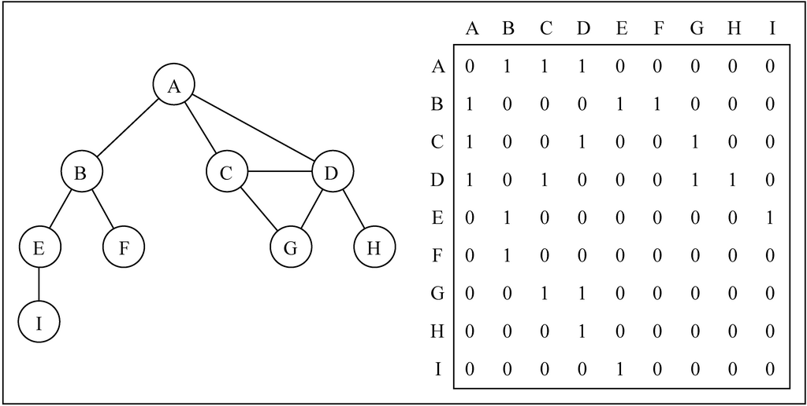

# Graph


<!-- TOC -->

- [Graph](#graph)
    - [设计思想](#设计思想)
        - [抽象为纯数学概念](#抽象为纯数学概念)
    - [抽象本质——基于现实关系的抽象](#抽象本质基于现实关系的抽象)
        - [建立边的依据——连接意味着什么？](#建立边的依据连接意味着什么)
    - [用途](#用途)
    - [概念](#概念)
        - [路径和环](#路径和环)
        - [连通性](#连通性)
        - [有向图和无向图](#有向图和无向图)
        - [加权性](#加权性)
    - [图的表示](#图的表示)
        - [邻接表](#邻接表)
        - [邻接矩阵](#邻接矩阵)
        - [关联矩阵](#关联矩阵)
    - [使用邻接表创建图](#使用邻接表创建图)
        - [JS 实现](#js-实现)
        - [C 实现](#c-实现)
    - [转置图](#转置图)
        - [邻接表实现](#邻接表实现)
        - [邻接矩阵实现](#邻接矩阵实现)
    - [References](#references)

<!-- /TOC -->


## 设计思想
### 抽象为纯数学概念
1. 广度优先遍历中，我们有了距离的概念。
2. 从物理的距离抽象到虚拟的距离，我们有了朋友关系的虚拟距离模型。
3. 在解决词梯问题时，我们把 “距离” 的概念进一步抽象为 “差别”。本来距离是一个长度、远近的概念，但现在抽象为差距之后，就有了更广泛的适用场景，就可以用来模拟词梯问题中两个单词的差距。
4. 一个概念越抽象，就越具有普适性。


## 抽象本质——基于现实关系的抽象
1. 多个对象之间的关系。
2. 任何表示若干对象关系的逻辑都可以抽象成图的数据结构。
3. 或者说，任何现实事物都可以抽象成任何数据结构模型，就看合适程度。

### 建立边的依据——连接意味着什么？
1. 如果要把一组对象建立为图的模型，怎么确定哪些对象为相邻的边？
2. 从下面广度优先遍历的分析中可以看出来，相邻的节点具有一个单位的差别。
3. 所以，当我们以某种维度的属性作为差别来分析一组对象时，互相连接的就应该是具有一个单位差别的对象。
4. 在词梯的例子中，互相连接的两个单词是只有一个字母差别的。


## 用途
1. 首先，图就是对现实世界抽象的一种数据结构，它本身只是现实世界的模型。
2. 可以说图本身是并没有什么用的，就看你要用这个数据结构来做什么。甚至更进一步说，对图的遍历操作，也仅仅是一种没有实际意义的操作，但它却是对实际的用途提供了一种重要的方法。


## 概念


### 路径和环
1. **简单路径** 要求不包含重复的节点。A D G 是一条简单路径。
2. A D C A 是一个 **环**。如果图中不存在环，则称该图是 **无环** 的。

### 连通性
如果图中每两个节点间都存在路径，则该图是 **连通的**。

### 有向图和无向图
1. 图可以是 **无向的**（边没有方向）或是 **有向的**（有向图）。如上图所示，有向图的边有一个方向。
2. 如果图中每两个节点间在双向上都存在路径，则该图是 **强连通的**。例如，C 和 D 是强连通的，而 A 和 B 不是强连通的。

### 加权性
图还可以是 **未加权的** 或是 **加权的**。如下图所示，加权图的边被赋予了权值：


## 图的表示
1. 邻接表因为在表示 **稀疏图**（边的条数 $E$ 远远小于 $V^2$ 的图）时非常紧凑而成为通常的选择。因为链表节点数等于实际的图顶点数，空间利用率很高。
2. 不过，在 **稠密图**（$E$ 接近 $V^2$ 的图）的情况下，我们可能倾向于使用邻接矩阵表示。
3. 另外，如果要快速判断任意两个节点之间是否有边相连，可能也需要使用邻接矩阵表示法，因为二维数组数组项的访问时间是常数级别的。

### 邻接表
1. 邻接表由图中每个节点的相邻节点列表所组成。
2. 存在好几种方式来表示这种数据结构。我们可以用列表（数组）、链表，甚至是散列表或是字典来表示相邻节点列表。
    
3. 如果 $G$ 是一个有向图，那么所有链接表的长度之和等于 $E$；如果 $G$ 是一个无向图，那么所有链接表的长度之和等于 $2E$。但不管是有向图还是无向图，邻接链表表示法的空间需求均为 $Θ(V+E)$。
4. 相比于邻接矩阵，邻接表不能快速的查询给定的两个节点是否连通。

### 邻接矩阵
1. 我们用一个二维数组来表示节点之间的连接。如果索引为 `i` 的节点和索引为 `j` 的节点相邻，则 `array[i][j] == 1`，否则 `array[i][j] == 0`
    
2. 稀疏图如果用邻接矩阵来表示，则矩阵中将会有很多 0，这意味着我们浪费了计算机存储空间来表示根本不存在的边。例如，找给定节点的相邻节点，即使该节点只有一个相邻节点，我们也不得不迭代一整行。
3. 无向图的邻接矩阵是一个对称矩阵，无向图的邻接矩阵就是自己的转置。因此在某些应用中，可能只需要存放对角线及其以上的这部分邻接矩阵，从而将图存储空间需求减少几乎一半。
4. 邻接矩阵表示法不够好的另一个理由是，图中节点的数量可能会改变，而 2 维数组不太灵活。
5. 邻接矩阵表示法更简单，因此在图的规模比较小时，可能更倾向于使用邻接矩阵。
6. 而且，对于无向图来说，邻接矩阵还有一个优势，就是每个记录项只需要 1 位的空间。

### 关联矩阵
1. 我们还可以用关联矩阵来表示图。在关联矩阵中，矩阵的行表示节点，列表示边。如下图所示，我们使用二维数组来表示两者之间的连通性
    
2. 关联矩阵通常用于边的数量比节点多的情况下，以节省空间和内存。不懂为什么


## 使用邻接表创建图
### JS 实现
1. JS 实现邻接表时，节点的相邻节点集合不使用比较麻烦的链表，可以使用更方便的数组或类数组对象。（实际上这里使用的 `Set`）。
2. 所以节点不需要 `next` 属性，那节点本身应该实现为对象（带 `key` 和 `value`）还是单纯的直接用基础类型 `key` 呢？
3. 可能有些时候实现为对象更好，不过至少在这里，节点直接用 `key` 更方便。
4. 而且，图其实并不需要是对象的组织形式，大部分时候只是对象的关系表达。也就是说，从语义上来说，并不是若干个对象实际组成一个称为图的结构，图只是反映出了这些对象的关系而已。
5. 所以，图不需要包含对象本身，只需要通过 `key` 反映出关系，调用图的环境自己通过 `key` 的关系可以转换到对象的关系。
6. 实现
    ```js
    class Graph {
        constructor(isDirected=false) {
            this.adjacencyList = new Map(); // 会使用节点的 key 作为键，邻接节点列表作为值
            this.isDirected = isDirected; // 是否为有向图
            this.vertices = []; // 记录所有的节点
        }

        hasVertex (key) {
            return this.vertices.includes(key);
        }

        addEdge (key1, key2) {
            if ( !this.hasVertex(key1) ) {
                this.vertices.push(key1);
                this.adjacencyList.set(key1, new Set());
            }
            if ( !this.hasVertex(key2) ) {
                this.vertices.push(key2);
                this.adjacencyList.set(key2, new Set());
            }

            this.adjacencyList.get(key1).add(key2); // 给节点 key1 添加一个与它相邻的节点 key2
            // 如果是有向图，那只是从 key1 到 key2 单方向的边；如果不是，就要双向添加
            if ( !this.isDirected ) {
                this.adjacencyList.get(key2).add(key1);
            }
            // 相邻的节点列表之所有用 Set 而不用数组，就是因为这里的双向添加。如果使用数组，
            // 比如调用方法 addEdge('A', 'B') 会双向添加，之后如果再调用 addEdge('B', 'A')，
            // 那就会重复添加了，导致 A 的相邻节点里就会有两个 B，B 的相邻节点里也会有两个 A。
        }

        transpose () {
            if ( !this.isDirected ) return this;
            let newG = new Graph(true);

            this.vertices.forEach((v) => {
                this.adjacencyList.forEach((set, headV) => {
                    if (set.has(v)) {
                        newG.addEdge(v, headV);
                    }
                });
            });
            return newG;
        }

        toString () {
            let str = '';
            this.vertices.forEach(vertex=>{
                let neighbors = this.adjacencyList.get(vertex);
                if ( neighbors.size ) {
                    str += vertex + ' -> ';
                    neighbors.forEach(neighbor=>{
                        str += neighbor + ' ';
                    });
                    str += '\n';
                }
            });
            return str;
        }
    }


    let graph = new Graph();

    graph.addEdge('A', 'B');
    graph.addEdge('A', 'C');
    graph.addEdge('A', 'D');
    graph.addEdge('B', 'E');
    graph.addEdge('B', 'F');
    graph.addEdge('C', 'D');
    graph.addEdge('C', 'G');
    graph.addEdge('D', 'G');
    graph.addEdge('D', 'H');
    graph.addEdge('E', 'I');

    console.log(graph.toString());
    // A -> B C D 
    // B -> A E F 
    // C -> A D G 
    // D -> A C G H 
    // E -> B I 
    // F -> B 
    // G -> C D 
    // H -> D 
    // I -> E 
    ```
7. 下面是之前将节点实现为对象的实现
    ```js
    class Node {
        constructor (key, value) {
            if ( !key ) {
                throw new TypeError("Initiatint Node must have a key.");
            }
            this.key = key;
            this.value = value;
        }
    }


    class Graph {
        constructor(isDirected=false) {
            this.vertices = [];
            this.adjacencyList = new Map(); // 会使用顶点的名字作为键，邻接顶点列表作为值
            this.isDirected = isDirected; // 是否为有向图
        }

        addVertex (node) {
            if (this.vertices.includes(node)) return;
            this.vertices.push(node);
            // 在邻接表中为新添加的节点建一个列表，用来保存与它相连接的节点
            // 使用 Set 而不是数组的原因，见 addEdge 方法
            this.adjacencyList.set(node, new Set());
        }

        getVertex (key) {
            return this.vertices.find((v) => v.key === key);
        }

        addEdge (key1, key2) {
            let node1 = this.vertices.find((v) => v.key === key1);
            let node2 = this.vertices.find((v) => v.key === key2);
            if ( !node1 ) {
                throw new TypeError(`First argument ${key1} in addEdge is not a key of added node.`);
            }
            if ( !node2 ) {
                throw new TypeError(`Second argument ${key2} in addEdge is not a key of added node.`);
            }
            this.adjacencyList.get(node1).add(node2); // 给节点 node1 添加一个与它相邻的节点 node2
            // 如果是有向图，那只是从 node1 到 node2 单方向的边；如果不是，就要双向添加
            if (!this.isDirected) {
                this.adjacencyList.get(node2).add(node1);
            }
            // 相邻的节点列表之所有用 Set 而不用数组，就是因为这里的双向添加。如果使用数组，
            // 比如调用方法 addEdge('A', 'B') 会双向添加，之后如果再调用 addEdge('B', 'A')，
            // 那就会重复添加了，导致 A 的相邻节点里就会有两个 B，B 的相邻节点里也会有两个 A。
        }

        toString () {
            let str = '';
            this.vertices.forEach(vertex=>{
                let neighbors = this.adjacencyList.get(vertex);
                if ( neighbors.size ) {
                    str += vertex.key + ' -> ';
                    neighbors.forEach(neighbor=>{
                        str += neighbor.key + ' ';
                    });
                    str += '\n';
                }
            });
            return str;
        }
    }


    let graph = new Graph();
    let vertexKeys = ['A','B','C','D','E','F','G','H','I'];

    vertexKeys.forEach(key=>{
        graph.addVertex(new Node(key));
    });


    graph.addEdge('A', 'B');
    graph.addEdge('A', 'C');
    graph.addEdge('A', 'D');
    graph.addEdge('B', 'E');
    graph.addEdge('B', 'F');
    graph.addEdge('C', 'D');
    graph.addEdge('C', 'G');
    graph.addEdge('D', 'G');
    graph.addEdge('D', 'H');
    graph.addEdge('E', 'I');


    console.log(graph.toString());
    // A -> B C D 
    // B -> A E F 
    // C -> A D G 
    // D -> A C G H 
    // E -> B I 
    // F -> B 
    // G -> C D 
    // H -> D 
    // I -> E 
    ```

### C 实现
1. 最初实现如下
    ```cpp
    #define GRAPH_SIZE 10 // 最大节点数量


    typedef struct Node {
        int key;
        int value;
        struct Node* next;
    } Node;


    static Node* nodes[GRAPH_SIZE] = {}; // 所有节点组成的数组

    static int nodeCount = 0; // 当前节点数量

    // 当前 key 所在的节点是否存在
    bool hasNode (int key) {
        nodes[0]->key == key;
        for (int i=0; i<nodeCount; i++) {
            if (nodes[i]->key == key) return true;
        }
        return false;
    }

    // 根据 key 获得节点
    Node* getNode (int key) {
        for (int i=0; i<nodeCount; i++) {
            if (nodes[i]->key == key) return nodes[i];
        }
        return NULL;
    }

    // 向图的节点列表里添加一个节点，但还没有建立边
    void addNode (int key, int value) {
        if (key < 0 || key >= GRAPH_SIZE) {
            printf("Function addNode: key must in range [0, %d]\n", GRAPH_SIZE-1);
            exit(EXIT_FAILURE);
        }
        if (nodeCount == GRAPH_SIZE) {
            printf("Function addNode: graph is full\n");
            exit(EXIT_FAILURE);
        }
        if (hasNode(key)) {
            getNode(key)->value = value;
            return;
        }
        Node* node = (Node*) malloc(sizeof(Node));
        if (node == NULL) {
            printf("malloc fails in addNode\n");
            exit(EXIT_FAILURE);
        }
        node->key = key;
        node->value = value;
        node->next = NULL;
        nodes[key] = node;
        nodeCount++;   
    }

    // 将两个节点连为边
    void addEdge (int key1, int key2, bool isDirected) {
        if ( !hasNode(key1) ) {
            printf("First argument %d in addEdge is not a key of added node.\n", key1);
            exit(EXIT_FAILURE);
        }
        if ( !hasNode(key2) ) {
            printf("Second argument %d in addEdge is not a key of added node.\n", key2);
            exit(EXIT_FAILURE);
        }

        Node* node1 = getNode(key1);
        Node* node2 = getNode(key2);

        Node* curr1 = node1;
        while ( curr1->next ) {
            curr1 = curr1->next;
        }
        curr1->next = node2;
        
        if ( !isDirected ) {
            Node* curr2 = node2;
            while ( curr2->next ) {
                curr2 = curr2->next;
            }
            curr2->next = node1;
        }
    }

    // 打印所有节点的 key
    void printNodeKeys () {
        for (int i=0; i<nodeCount; i++) {
            printf("%d ", nodes[i]->key);
        }
        printf("\n");
    }

    // 打印整个邻接表
    void printAdjacencyList () {
        for (int i=0; i<nodeCount; i++) {
            Node* curr = nodes[i];
            printf("%d: ", curr->key);
            while (curr->next) {
                curr = curr->next;
                printf("%d ", curr->key);
            }
            printf("\n");
        }
    }


    int main (void) {

        addNode(0, 0);
        addNode(1, 111);
        addNode(2, 222);
        addNode(3, 333);
        addNode(4, 444);
        addNode(5, 555);
        addNode(6, 666);
        addNode(7, 777);
        addNode(8, 888);
        addNode(9, 999);

        printNodeKeys();

        addEdge(1, 3);

        printAdjacencyList();

        return 0;
    }
    ```
2. 运行的时候，`printAdjacencyList` 中的 `while` 会陷入无限循环，反复的打印 1 和 3。因为 1 是和 3 连接的节点，3 也是和 1 连接的节点。按照 `addEdge` 的逻辑，它们互为 `next`。
3. 而且还有一个问题是，如果同一个节点出现在不同的列表里，它们的 `next` 指向会是不同的的。比如一个链表是 `3->5->6->9`，另一个链表表示 `4->5->7>8`。在这里，5 既和 3 相连也和 4 相连，所以它出现在两个链表里。但因为 5 之后分别添加了 `3-6` 的边和 `4-7` 的边，所以在两个李安表示 5 的 `next` 是不同的。
4. 从 GeeksforGeeks 上找到的一个实现，它的解决方法是，不单独的添加顶点，而是直接添加边，并且每次添加边时的两个顶点都会独立实例化。
5. 例如上面的例子中，添加边 `3-5` 和 `4-5` 时，会独立的实例化节点 5。虽然可以解决上面的问题，不过感觉也挺奇怪，因为从语义上来说节点就应该只有一个。实现如下
    ```cpp
    // 邻接表的节点
    typedef struct Node {
        int key;
        struct Node* next;
    } Node;

    // 邻接表的一个链表
    typedef struct List {
        Node* head;
    } List;

    // 以邻接表表示的图
    typedef struct Graph {
        int V; // 节点数，也就是链表数
        List* listArray; // 指向链表组成的数组
    } Graph;


    // 该函数实例化一个节点并初始化，然后返回该节点的指针
    Node* createNode(int key) {
        Node* newNode = (Node*) malloc(sizeof(Node));
        if (newNode == NULL) {
            printf("malloc failed in function createNode.\n");
            exit(EXIT_FAILURE);
        }
        newNode->key = key;
        newNode->next = NULL;
        return newNode;
    }

    // 该函数实例化一个使用邻接表表示的图并初始化，然后返回该图的指针
    Graph* createGraph(int V) {
        Graph* graph = (Graph*) malloc(sizeof(Graph));
        if (graph == NULL) {
            printf("malloc failed in function createGraph.\n");
            exit(EXIT_FAILURE);
        }
        graph->V = V;

        // 为 V 个链表分配内存，graph->listArray 指向这些链表组成的数组
        graph->listArray = (List*) malloc(V * sizeof(List));
        if (graph->listArray == NULL) {
            printf("malloc failed in function createGraph.\n");
            exit(EXIT_FAILURE);
        }

        // 每个链表初始化为空
        for (int i = 0; i < V; i++) {
            graph->listArray[i].head = NULL;
        }

        return graph;
    }

    Node* getNode (Graph* graph, int key) {
        return graph->listArray[key].head;
    }

    // 两个节点是否连接
    bool isEdge (Graph* graph, int key1, int key2) {
        Node* node1 = getNode(graph, key1);
        if (node1) {
            Node* curr = node1->next;
            while (curr) {
                if (curr->key == key2) {
                    return true;
                }
                curr = curr->next;
            }
        }
        return false;
    }

    // 添加边
    void addEdge(Graph* graph, int key1, int key2, bool isDirected) {
        // 避免重复添加
        if ( isEdge(graph, key1, key2) ) {
            return;
        }

        Node* node2 = createNode(key2);
        // 新加的节点作为链表的 head
        node2->next = graph->listArray[key1].head;
        graph->listArray[key1].head = node2;
        
        // 双向添加
        if ( !isDirected ) {
            Node* node1 = createNode(key1);
            node1->next = graph->listArray[key2].head;
            graph->listArray[key2].head = node1;
        }
    }

    void printGraph(Graph* graph) {
        for (int i = 0; i < graph->V; i++) {
            Node* pCurr = graph->listArray[i].head;
            printf("\n Adjacency list of vertex %d\n head ", i);
            while (pCurr) {
                printf("-> %d", pCurr->key);
                pCurr = pCurr->next;
            }
            printf("\n");
        }
    }

    int main() {
        struct Graph* graph = createGraph(5);

        addEdge(graph, 0, 1);
        addEdge(graph, 0, 4);
        addEdge(graph, 1, 2);
        addEdge(graph, 1, 3);
        addEdge(graph, 1, 4);
        addEdge(graph, 2, 3);
        addEdge(graph, 3, 4);
        addEdge(graph, 1, 0); // 重复添加

        printGraph(graph);
        // Adjacency list of vertex 0
        // head -> 4-> 1

        // Adjacency list of vertex 1
        // head -> 4-> 3-> 2-> 0

        // Adjacency list of vertex 2
        // head -> 3-> 1

        // Adjacency list of vertex 3
        // head -> 4-> 2-> 1

        // Adjacency list of vertex 4
        // head -> 3-> 1-> 0

        return 0;
    }
    ```
6. 我后来想到一个方法，就是每个链表的头部单独实现新的类型 `Head`，与普通的节点 `Node` 不同类型。这样遍历邻接表的时候只是遍历链表的 `Head`，而不遍历具体的节点。
7. 比如 `addEdge(1, 3)` 之后，是在 `key` 为 1 的 `Head` 的链表里添加了 `key` 为 3 的 `Node`，并且在  `key` 为 3 的 `Head` 的链表里添加了 `key` 为 3 的 `Node`。
8. 实现如下
    ```cpp
    #define GRAPH_SIZE 10 // 最大节点数量


    typedef struct Head {
        int key;
        int value;
        struct Node* next;
    } Head;

    typedef struct Node {
        int key;
        int value;
        struct Node* next;
    } Node;


    static Head* heads[GRAPH_SIZE] = {};

    static Node* nodes[GRAPH_SIZE] = {}; // 所有节点组成的数组

    static int nodeCount = 0; // 当前节点数量

    // 当前 key 所在的节点是否存在
    bool hasNode (int key) {
        heads[0]->key == key;
        for (int i=0; i<nodeCount; i++) {
            if (heads[i]->key == key) return true;
        }
        return false;
    }

    // 根据 key 获得节点
    static Head* getHead (int key) {
        for (int i=0; i<nodeCount; i++) {
            if (heads[i]->key == key) return heads[i];
        }
        return NULL;
    }
    Node* getNode (int key) {
        for (int i=0; i<nodeCount; i++) {
            if (nodes[i]->key == key) return nodes[i];
        }
        return NULL;
    }

    // 向图的节点列表里添加一个节点，但还没有建立边
    void addNode (int key, int value) {
        if (key < 0 || key >= GRAPH_SIZE) {
            printf("Function addNode: key must in range [0, %d]\n", GRAPH_SIZE-1);
            exit(EXIT_FAILURE);
        }
        if (nodeCount == GRAPH_SIZE) {
            printf("Function addNode: graph is full\n");
            exit(EXIT_FAILURE);
        }
        if (hasNode(key)) {
            getNode(key)->value = value;
            return;
        }
        Node* node = (Node*) malloc(sizeof(Node));
        Head* head = (Head*) malloc(sizeof(Head));
        if (node == NULL || head == NULL) {
            printf("malloc fails in addNode\n");
            exit(EXIT_FAILURE);
        }
        node->key = key;
        node->value = value;
        node->next = NULL;
        nodes[key] = node;
        head->key = key;
        head->value = value;
        head->next = NULL;
        heads[key] = head;
        nodeCount++;   
    }

    // 将两个节点连为边，无向图
    void addEdge (int key1, int key2, bool isDirected) {
        if ( !hasNode(key1) ) {
            printf("First argument %d in addEdge is not a key of added node.\n", key1);
            exit(EXIT_FAILURE);
        }
        if ( !hasNode(key2) ) {
            printf("Second argument %d in addEdge is not a key of added node.\n", key2);
            exit(EXIT_FAILURE);
        }

        Head* head1 = getHead(key1);
        Head* head2 = getHead(key2);
        Node* node1 = getNode(key1);
        Node* node2 = getNode(key2);

        Node* next1 = head1->next;
        head1->next = node2;
        node2->next = next1;
        if ( !isDirected ) {
            Node* next2 = head2->next;
            head2->next = node1;
            node1->next = next2;
        }
    }

    // 打印所有节点的 key
    void printNodeKeys () {
        for (int i=0; i<nodeCount; i++) {
            printf("%d ", heads[i]->key);
            printf("\n");
        }
        printf("\n");
    }

    int c = 0;
    // 打印整个邻接表
    void printAdjacencyList () {
        for (int i=0; i<nodeCount; i++) {
            printf("%d : ", heads[i]->key);
            Node* node = heads[i]->next;
            while (node) {
                printf("%d ", node->key);
                node = node->next;
                if (c++ > 10) {
                    break;
                }
            }
            printf("\n");
        }
    }


    int main (void) {

        addNode(0, 0);
        addNode(1, 111);
        addNode(2, 222);
        addNode(3, 333);
        addNode(4, 444);
        addNode(5, 555);
        addNode(6, 666);
        addNode(7, 777);
        addNode(8, 888);
        addNode(9, 999);

        // printNodeKeys();

        addEdge(1, 3);
        // 1 : 3 
        // 2 : 
        // 3 : 1 

        printAdjacencyList();

        return 0;
    }
    ```
9. 这里解决了第一个那个 1-3 边的问题。但是第二个问题还是没有解决。现在尝试继续添加第二条边
    ```cpp
    addEdge(1, 3);
    // 1 : 3 
    // 2 : 
    // 3 : 1 
    addEdge(2, 1);
    // 1 : 2 3 
    // 2 : 1
    // 3 : 1 
    ```
    看起来还是正常的。
10. 不过如果在添加一个就不正常了
    ```cpp
    addEdge(1, 3);
    // 1 : 3 
    // 2 : 
    // 3 : 1 
    addEdge(2, 1);
    // 1 : 2 3 
    // 2 : 1
    // 3 : 1 
    addEdge(3, 2);
    // 1 : 2 1 
    // 2 : 3 1
    // 3 : 2 1
    ```
11. 看一下添加第三条边时发生了什么。按照上面 `addEdge` 的逻辑，首先会在 `key` 为 3 的 `Head` 后面插入 `key` 为 2 的 `Node`。注意，插入逻辑有一步是 `node2->next = next1`，所以 2 的 next 要变成 1，而且是所有的 2！如下
    ```cpp
    // 1 : 2 1 // 这里 2 的 next 也会变成 1
    // 2 : 1
    // 3 : 2 1 
    ```
    之后反过来在 `key` 为 2 的 `Head` 后面插入 `key` 为 3 的 `Node` 时倒是没有冲突。因为这个冲突已经通过新添加的 `Head` 来解决了
    ```cpp
    // 1 : 2 1
    // 2 : 3 1
    // 3 : 2 1 
    ```


## 转置图
### 邻接表实现
1. 本来我是可以按照定义，直接构建转置的邻接表
    ```js
    transpose () {
        if ( !this.isDirected ) return this;
        
        let newG = new Graph(true);
        newG.vertices = this.vertices;

        // 遍历每个节点
        this.vertices.forEach((v) => {
            // 为每个节点建立相邻节点列表
            newG.adjacencyList.set(v, new Set());
            // 在原来的邻接表里查找当前节点和哪些节点相连
            this.adjacencyList.forEach((set, headV) => {
                if (set.has(v)) {
                    // 建立反向连接
                    newG.adjacencyList.get(v).add(headV);
                }
            });
        });

        return newG;
    }
    ```
2. 不过其实既然已经实现了邻接表的接口，那就可以直接调用接口添加边
    ```js
    transpose () {
        if ( !this.isDirected ) return this;
        let newG = new Graph(true);

        this.vertices.forEach((v) => {
            this.adjacencyList.forEach((set, headV) => {
                if (set.has(v)) {
                    newG.addEdge(v, headV);
                }
            });
        });
        return newG;
    }
    ```
3. 测试
    ```js
    let graph = new Graph(true); // 有向图

    graph.addEdge('A', 'B');
    graph.addEdge('A', 'C');
    graph.addEdge('A', 'D');
    graph.addEdge('B', 'E');
    graph.addEdge('B', 'F');
    graph.addEdge('C', 'D');
    graph.addEdge('C', 'G');
    graph.addEdge('D', 'G');
    graph.addEdge('D', 'H');
    graph.addEdge('E', 'I');


    let newGraph = graph.transpose();
    console.log(newGraph.toString());
    // B -> A 
    // C -> A 
    // D -> A C 
    // E -> B 
    // F -> B 
    // G -> C D 
    // H -> D 
    // I -> E 

    console.log(graph.toString()); // 原来的图不受影响
    // A -> B C D 
    // B -> E F 
    // C -> D G 
    // D -> G H 
    // E -> I 
    ```
4. `new Graph` 是常数时间；两个 `forEach` 实际上是遍历了所有的边并反向添加，数量是 $E$；添加所有的节点，节点数量是 $V$。所以整体时间复杂度是 $O(E+V)$。

### 邻接矩阵实现
矩阵转置，复杂度是$O(V*V)$。


## References
* [学习JavaScript数据结构与算法](https://book.douban.com/subject/26639401/)
* [算法（第4版）](https://book.douban.com/subject/19952400/)
* [Python数据结构与算法分析（第2版）](https://book.douban.com/subject/34785178/)
* [算法导论（原书第3版）](https://book.douban.com/subject/20432061/)
* [Graph and its representations](https://www.geeksforgeeks.org/graph-and-its-representations/)