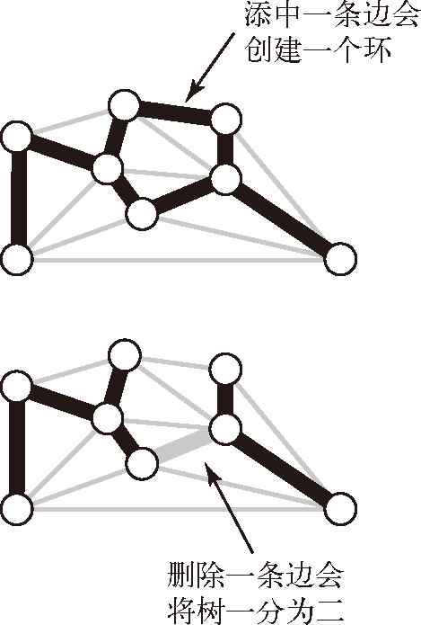
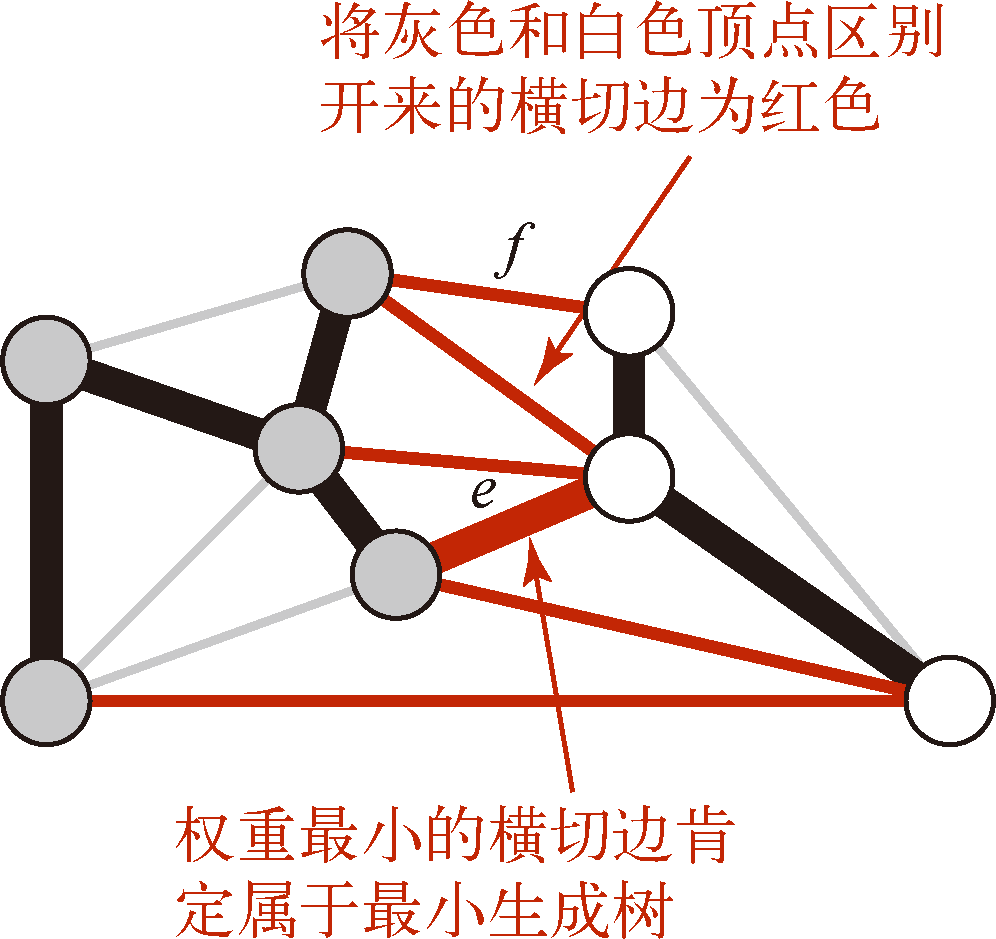
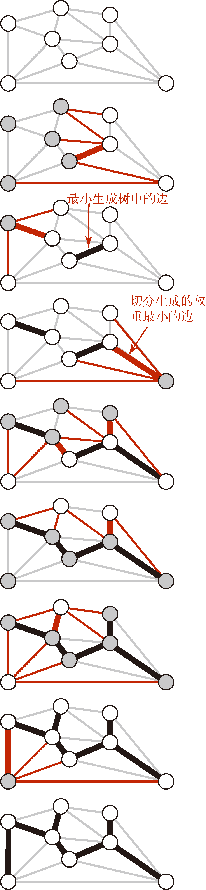
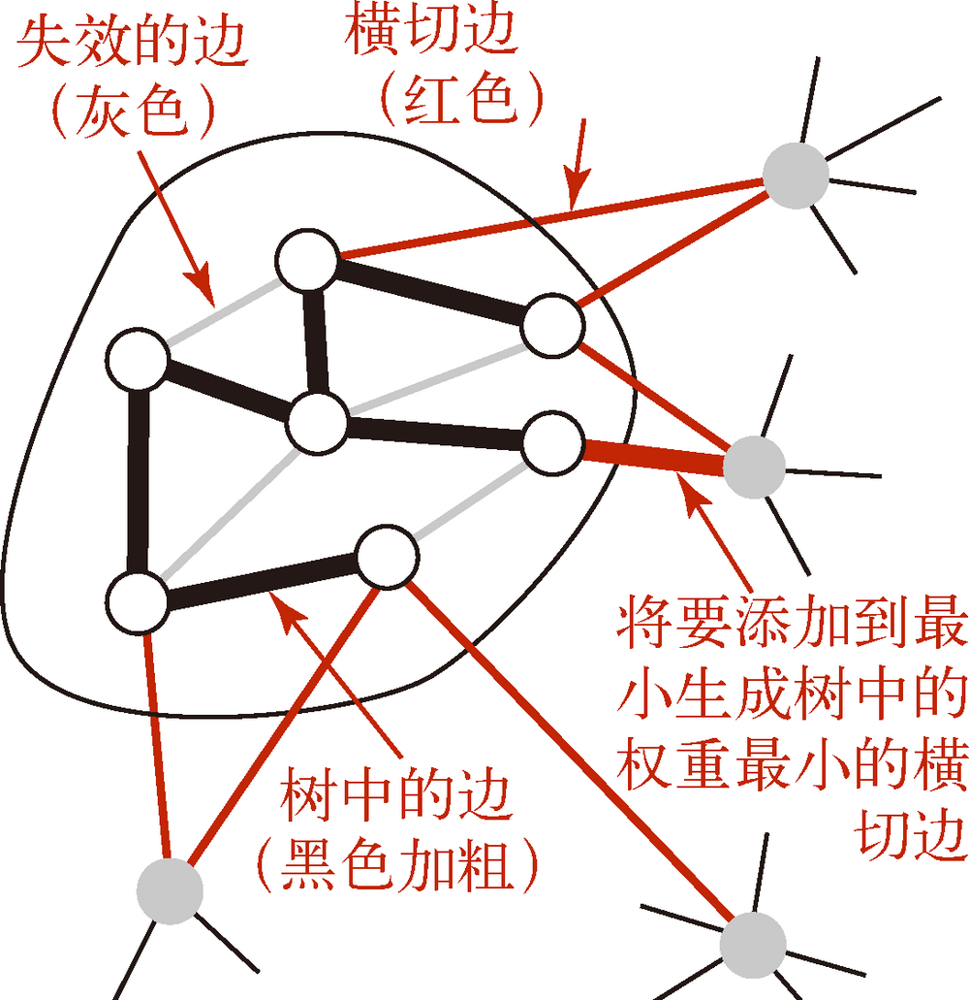
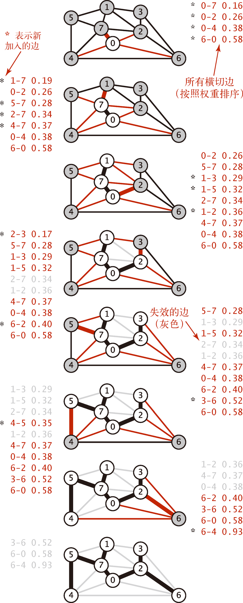
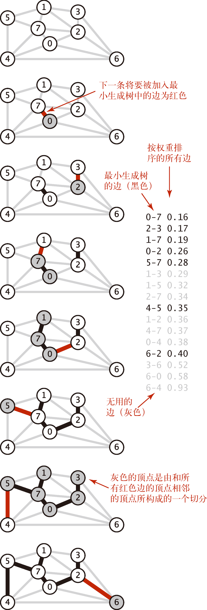

# Minimum Spanning Trees


<!-- TOC -->

- [Minimum Spanning Trees](#minimum-spanning-trees)
    - [Summary](#summary)
    - [原理](#原理)
        - [回顾树的两个基本性质](#回顾树的两个基本性质)
        - [切分定理](#切分定理)
        - [贪心算法](#贪心算法)
    - [Prim 算法](#prim-算法)
        - [数据结构](#数据结构)
        - [维护横切边的集合](#维护横切边的集合)
        - [实现](#实现)
        - [复杂度](#复杂度)
    - [Kruskal 算法](#kruskal-算法)
        - [实现](#实现-1)
    - [References](#references)

<!-- /TOC -->


## Summary
1. 图的 **生成树** 是它的一棵含有其所有顶点的无环连通子图。一幅加权图的 **最小生成树**（MST）是它的一棵权值（树中所有边的权值之和）最小的生成树。
2. 我们对生成树的定义意味着最小生成树只可能存在于连通图中。如果一幅图是非连通的，我们只能使用这个算法来计算它的所有连通分量的最小生成树，合并在一起称其为 **最小生成森林**。
3. 边的权重可能是 0 或者负数。


## 原理
### 回顾树的两个基本性质
* 用一条边连接树中的任意两个顶点都会产生一个新的环。
* 从树中删去一条边将会得到两棵独立的树。


### 切分定理
1. 我们称之为 **切分定理** 的这条性质将会把加权图中的所有顶点分为两个集合、检查横跨两个集合的所有边并识别哪条边应属于图的最小生成树。
2. 图的一种 **切分** 是将图的所有顶点分为两个非空且不重叠的两个集合。**横切边** 是一条连接两个属于不同集合的顶点的边。
3. 通常，我们通过指定一个顶点集并隐式地认为它的补集为另一个顶点集来指定一个切分。这样，一条横切边就是连接该集合的一个顶点和不在该集合中的另一个顶点的一条边。如下图所示，我们将切分中一个集合的顶点都画为了灰色，另一个集合的顶点则为白色
    
4. **切分定理**：在一幅加权图中，给定任意的切分，它的横切边中的权重最小者必然属于图的最小生成树。
5. 可以想象，把节点切分为两拨，那么生成树肯定要把这两拨连起来。有几条横切边就有几种连接方法，就会生成几种生成树。而权重最小的那个横切边连接起来的，就是最小生成树。

### 贪心算法
1. 切分定理是解决最小生成树问题的所有算法的基础。这些算法都是一种贪心算法的特殊情况：使用切分定理找到最小生成树的一条边，不断重复直到找到最小生成树的所有边。
2. 下面这种方法会将含有 $V$ 个顶点的任意加权连通图中属于最小生成树的边标记为黑色：
    1. 初始状态下所有边均为灰色。
    2. 找到一种切分，它产生的横切边均不为黑色。
    3. 将它权重最小的横切边标记为黑色。
    4. 重复 2、3，直到标记了 $V-1$ 条黑色边为止。
3. 下图所示的是这个贪心算法运行的典型轨迹。每一幅图表现的都是一次切分，其中算法识别了一条权重最小的横切边（红色加粗）并将它加入最小生成树之中
    
4. 每次没有黑色横切边的切分，都意味着两边是将要被连起来的生成树的一部分，标记权重最小的横切边为黑色就意味着记录下最小生成树中的一条边。


## Prim 算法
1. Prim 算法的每一步都会为一棵生长中的树添加一条边。
2. 一开始这棵树只有一个顶点，然后会向它添加 V-1 条边。
3. 每次总是将下一条连接树中的顶点与不在树中的顶点且权重最小的边（即由树中的顶点所定义的切分中的一条横切边）加入树中
    
4. 如上图中黑色圆圈所示，这棵不断生长的树的所有节点和树以外的其他节点的边界定义了一个切分，然后选取权重最小的横切边并根据贪心算法不断将它们标记为黑色。

### 数据结构
* **标记生成树的顶点**：使用一个由顶点索引的布尔数组 `marked`，如果顶点 `v` 在树中，那么 `marked[v]` 的值为 `true`。
* **横切边**：使用一条优先队列 `MinPQ` 来保存不同权重的横切边。

### 维护横切边的集合
1. 每当我们向树中添加了一条边之后，也向树中添加了一个新顶点。
2. 要维护一个包含所有横切边的集合，就要将连接这个新顶点和树外顶点的边（用 `marked` 来识别这样的边）加入优先队列。
3. 连接新顶点与其他已经在树中顶点的所有边都 **失效** 了，这样的边都已经不是横切边了，因为它的两个顶点都在树中。
4. Prim 算法的 **即时** 实现可以将这样的边从优先队列中删掉，但我们先来学习这个算法的一种 **延时** 实现，将这些边先留在优先队列中，等到要删除它们的时候再检查边的有效性。
5. 下图是一颗最小生成树延时实现的轨迹，每一张都是算法访问过一个顶点之后图和优先队列的状态。（顶点被添加到树中，该顶点邻接链表中的边也已经被处理完成）
    
6. 在添加了 V 个顶点（以及 V-1 条边）之后，最小生成树就完成了。优先队列中的余下的边都是无效的，不需要再去检查它们。
7. 注意在把 0-2 加入到生成树之后，之前保留在优先队列里面的边 1-2 和 7-2 就失效了。即时实现会从优先队列里删掉这些边，而延时实现中，即使某个失效边的权重是最小的，也不会把出列加入到生成树中。
8. 比如在把 7-5 加入生成树之后，有三个失效边的权重都比边 4-5 要小，但接下来还是应该把 4-5 加入生成树。

### 实现
```js
// 移除无效边
function removeInvalidEdge (edge_pq, newEdge) {
    let edges = edge_pq.items.filter(el=>el.element.value === newEdge.element.value);
    for (let i=edges.length-1; i>-1; i--) {
        edge_pq.remove(edges[i]);
    }
}

// 计算生成树
function lazyPrimMST (graph, startVertex) {
    let treeNodes = [startVertex];
    let edges = [];
    let edge_pq = new PriorityQueue();

    let newEdge;
    let neighbors;
    let newVertex = startVertex;

    while (edges.length < graph.vertices.length-1) {
        neighbors = graph.adjacencyList.get(newVertex);
        neighbors.forEach(n=>{
            if (!treeNodes.includes(n.value)) {
                edge_pq.enqueue(n, n.weight);
            }
        });

        newEdge = edge_pq.dequeue();
        edges.push(newEdge.element);
        newVertex = newEdge.element.value;
        treeNodes.push(newVertex);
        removeInvalidEdge (edge_pq, newEdge);
    }

    let weight = 0;
    edges.forEach((e)=>{
        weight += e.weight;
    })

    return {
        edges,
        weight
    };
}


// 加权无向图的实现
class Edge {
    constructor (from, value, weight=1) {
        this.from = from;
        this.value = value;
        this.weight = weight;
    }
}
class EdgeWeightedGraph {
    constructor () {
        this.vertices = [];
        this.adjacencyList = new Map();
    }

    addVertex (v) {
        this.vertices.push(v);
        this.adjacencyList.set(v, new Set());
    }

    addEdge (v, w, weight=1) {
        this.adjacencyList.get(v).add(new Edge(v, w, weight));
        this.adjacencyList.get(w).add(new Edge(w, v, weight));
    }

    toString () {
        let str = '';
        this.vertices.forEach(vertex=>{
            let neighbors = this.adjacencyList.get(vertex);
            if ( neighbors.size ) {
                str += vertex + ' -> ';
                neighbors.forEach(n=>{
                    str += n.value + `(${n.weight}) `;
                });
                str += '\n';
            }
        });
        return str;
    }
}


// 优先对立的实现
class QueueElement {
    constructor(element, priority) {
        this.element = element;
        this.priority = priority;
    }
}
class PriorityQueue {
    constructor(){
        this.items = [];
    }

    enqueue (element, priority) {
        let queueElement = new QueueElement(element, priority);

        if (this.isEmpty()) {
            return this.items.push(queueElement);
        } 
        else {
            for (let i = 0; i < this.items.length; i++) {
                if (queueElement.priority < this.items[i].priority) {
                    this.items.splice(i, 0, queueElement);
                    return this.items.length + 1;
                }
            }
            return this.items.push(queueElement);
        }
    }

    dequeue () {
        return this.items.shift();
    }

    remove (item) {
        let index = this.items.indexOf(item);
        if (index === -1 ) {
            return;
        }
        else {
            this.items.splice(index, 1);
        }
    }

    isEmpty () {
        return this.items.length === 0;
    }
}


// 测试  使用 《算法（第4版）》图 4.3.10 的示例数据
let graph = new EdgeWeightedGraph();
let vertices = [0, 1, 2, 3, 4, 5, 6, 7];

vertices.forEach(vertex=>{
    graph.addVertex(vertex);
});

graph.addEdge(0, 2, 0.26);
graph.addEdge(0, 4, 0.38);
graph.addEdge(0, 6, 0.58);
graph.addEdge(0, 7, 0.16);
graph.addEdge(1, 2, 0.36);
graph.addEdge(1, 3, 0.29);
graph.addEdge(1, 5, 0.32);
graph.addEdge(1, 7, 0.19);
graph.addEdge(2, 3, 0.17);
graph.addEdge(2, 6, 0.40);
graph.addEdge(2, 7, 0.34);
graph.addEdge(3, 6, 0.52);
graph.addEdge(4, 5, 0.35);
graph.addEdge(4, 6, 0.93);
graph.addEdge(4, 7, 0.37);
graph.addEdge(5, 7, 0.28);

console.log(graph.toString());
// 0 -> 2(0.26) 4(0.38) 6(0.58) 7(0.16) 
// 1 -> 2(0.36) 3(0.29) 5(0.32) 7(0.19) 
// 2 -> 0(0.26) 1(0.36) 3(0.17) 6(0.4) 7(0.34) 
// 3 -> 1(0.29) 2(0.17) 6(0.52) 
// 4 -> 0(0.38) 5(0.35) 6(0.93) 7(0.37) 
// 5 -> 1(0.32) 4(0.35) 7(0.28) 
// 6 -> 0(0.58) 2(0.4) 3(0.52) 4(0.93) 
// 7 -> 0(0.16) 1(0.19) 2(0.34) 4(0.37) 5(0.28) 

console.log( JSON.stringify(lazyPrimMST(graph, 0), null, 4) );
// {
//     "edges": [
//         {
//             "from": 0,
//             "value": 7,
//             "weight": 0.16
//         },
//         {
//             "from": 7,
//             "value": 1,
//             "weight": 0.19
//         },
//         {
//             "from": 0,
//             "value": 2,
//             "weight": 0.26
//         },
//         {
//             "from": 2,
//             "value": 3,
//             "weight": 0.17
//         },
//         {
//             "from": 7,
//             "value": 5,
//             "weight": 0.28
//         },
//         {
//             "from": 5,
//             "value": 4,
//             "weight": 0.35
//         },
//         {
//             "from": 2,
//             "value": 6,
//             "weight": 0.4
//         }
//     ],
//     "weight": 1.81
// }
```

### 复杂度


## Kruskal 算法
1. Kruskal 算法的主要思想是按照边的权重顺序从小到大处理它们，将边加入最小生成树中（下图中的黑色边）。
2. 加入的边不会与已经加入的边构成环，直到树中含有 V-1 条边为止。
3. 这些黑色的边逐渐由一片森林合并为一棵树，也就是图的最小生成树
    
4. Prim 算法是一条边一条边地来构造最小生成树，每一步都为一棵树添加一条边。Kruskal 算法构造最小生成树的时候也是一条边一条边地构造，但不同的是它寻找的边会连接一片森林中的两棵树。
5. 我们从一片由 V 棵 **单顶点**的树构成的森林开始并不断将两棵树合并（用可以找到的最短边）直到只剩下一棵树，它就是最小生成树。
6. 不断合并的过程中同样也要检查待合并的边是不是无效边，否则就会合并出环

### 实现
1. 因为要获得所有的边，所以 `EdgeWeightedGraph` 增加一个 `getEdges` 方法
    ```js
    getEdges () {
        let searchedVertices = [];
        let edges = [];
        this.vertices.forEach((v) => {
            searchedVertices.push(v);
            this.adjacencyList.get(v).forEach((e) => {
                if ( !searchedVertices.includes(e.value) ) {
                    edges.push(e);
                }
            });
        });
        return edges;
    }
    ```
2. 因为是无向图，一条边会被两个节点分别添加。所以使用 `searchedVertices` 记录已经遍历过的节点，如果发现一条边的尾节点在 `searchedVertices` 中，就说明该条边已经加入了 `edges`。
3. 在把一条边加入到生成树中前，要先检查是不是无效边，如果这个边的两个节点属于同一棵子树，那么就是无效边，例如上图中的边 1-3.
4. 检查的方法是保证每棵子是都有唯一的 ID。因为一开始有 V 棵子树，就有 V 个ID，在两棵子树合并时，要是的两棵子树的所有节点都有相同的 ID。
5. 使用一个映射来记录 ID
    ```js
    const KruskalMST_ID = new Map();
    ```
6. 初始化时每个单节点子树的 ID 都是自身的值
    ```js
    graph.vertices.forEach((v)=>{
        KruskalMST_ID.set(v, v);
    });
    ```
7. 在合并两个子树时，通过 `unionID` 函数来让一棵子树里节点的 ID 变得和另一棵一样
    ```js
    function unionID (v, w) {
        // 两个节点分别属于两个子树，而同一个子树里所有节点都有着同样的 ID
        let vID = KruskalMST_ID.get(v);
        let wID = KruskalMST_ID.get(w);
        if (vID === wID) {
            return;
        }
        else {
            // 把 v 节点所在子树的每个节点的 ID 都变成 w 所在子树的节点 ID
            KruskalMST_ID.forEach((id, key)=>{
                if (id === vID) {
                    KruskalMST_ID.set(key, wID);
                }
            });
        }
    }
    ```
8. 检测一个边是否无效就是检测两个节点是否有同样的 ID
    ```js
    function isConnected (v, w) {
        return KruskalMST_ID.get(v) === KruskalMST_ID.get(w);
    }
    ```
9. 因为使用了 `isConnected` 来跳过无效边，所以就不适用 Prim 算法中的 `removeInvalidEdge`。
10. 完整实现，这里只列出和 Prim 相比有改动的部分
    ```js
    const KruskalMST_ID = new Map();
    function unionID (v, w) {
        let vID = KruskalMST_ID.get(v);
        let wID = KruskalMST_ID.get(w);
        if (vID === wID) {
            return;
        }
        else {
            KruskalMST_ID.forEach((id, key)=>{
                if (id === vID) {
                    KruskalMST_ID.set(key, wID);
                }
            });
        }
    }
    function isConnected (v, w) {
        return KruskalMST_ID.get(v) === KruskalMST_ID.get(w);
    }


    // 不需要第二个起始节点参数，因为会按照边权重降序依次添加
    function KruskalMST (graph) {
        let treeEdges = [];

        // 初始化每个子树的 ID
        graph.vertices.forEach((v)=>{
            KruskalMST_ID.set(v, v);
        });

        // 边降序
        let graphEdges = graph.getEdges();
        graphEdges.sort((e1, e2)=>e1.weight-e2.weight);

        // 生成
        for (let i=0; i<graphEdges.length; i++) {
            let edge = graphEdges[i];
            let {from: v, value: w} = edge;
            if ( !isConnected(v, w) ) {
                treeEdges.push(edge);
                unionID(v, w);
            }
            if (treeEdges.length === graph.vertices.length-1) break;
        }

        let weight = 0;
        treeEdges.forEach((e)=>{
            weight += e.weight;
        })

        return {
            treeEdges,
            weight
        };
    }


    class EdgeWeightedGraph {
        constructor () {
            this.vertices = [];
            this.adjacencyList = new Map();
        }

        addVertex (v) {
            this.vertices.push(v);
            this.adjacencyList.set(v, new Set());
        }

        addEdge (v, w, weight=1) {
            this.adjacencyList.get(v).add(new Edge(v, w, weight));
            this.adjacencyList.get(w).add(new Edge(w, v, weight));
        }

        getEdges () {
            let searchedVertices = [];
            let edges = [];
            this.vertices.forEach((v) => {
                searchedVertices.push(v);
                this.adjacencyList.get(v).forEach((e) => {
                    if ( !searchedVertices.includes(e.value) ) {
                        edges.push(e);
                    }
                });
            });
            return edges;
        }

        toString () {
            let str = '';
            this.vertices.forEach(vertex=>{
                let neighbors = this.adjacencyList.get(vertex);
                if ( neighbors.size ) {
                    str += vertex + ' -> ';
                    neighbors.forEach(n=>{
                        str += n.value + `(${n.weight}) `;
                    });
                    str += '\n';
                }
            });
            return str;
        }
    }
    ```

## References
* [算法（第4版）](https://book.douban.com/subject/19952400/)
* [Python数据结构与算法分析（第2版）](https://book.douban.com/subject/34785178/)
* [算法导论（原书第3版）](https://book.douban.com/subject/20432061/)