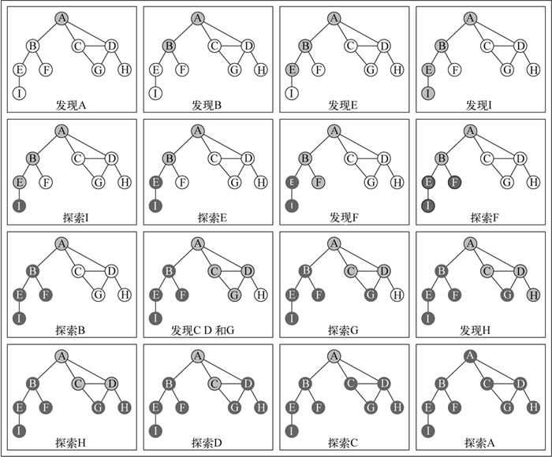

# Searching


<!-- TOC -->

- [Searching](#searching)
    - [TODO](#todo)
    - [设计思想](#设计思想)
        - [深度优先搜索](#深度优先搜索)
            - [逐层探索，剥洋葱](#逐层探索剥洋葱)
            - [获得层级距离关系](#获得层级距离关系)
        - [广度优先搜索](#广度优先搜索)
            - [尝试树状逻辑结构的每一条路径](#尝试树状逻辑结构的每一条路径)
            - [纵深型的逻辑结构](#纵深型的逻辑结构)
    - [抽象本质——基于现实关系的抽象](#抽象本质基于现实关系的抽象)
        - [广度优先遍历](#广度优先遍历)
            - [广度优先——强调先完成一层再处理下一层](#广度优先强调先完成一层再处理下一层)
            - [层次次序感——按层顺序向外扩散，强调距离起点的远近亲疏](#层次次序感按层顺序向外扩散强调距离起点的远近亲疏)
        - [广度优先遍历计算差别](#广度优先遍历计算差别)
        - [最短路径](#最短路径)
        - [深度优先遍历](#深度优先遍历)
            - [依次尝试每一种可能性](#依次尝试每一种可能性)
            - [点对点的因果（或层级）关系](#点对点的因果或层级关系)
    - [用途](#用途)
        - [广度优先遍历计算对象差距](#广度优先遍历计算对象差距)
        - [深度优先遍历穷举法](#深度优先遍历穷举法)
    - [图的遍历综述](#图的遍历综述)
        - [遍历的关键逻辑](#遍历的关键逻辑)
        - [不规则的遍历](#不规则的遍历)
    - [广度优先搜索](#广度优先搜索-1)
        - [遍历逻辑](#遍历逻辑)
            - [标记已遍历节点](#标记已遍历节点)
            - [记录节点更多信息](#记录节点更多信息)
        - [实现](#实现)
        - [复杂度](#复杂度)
            - [如果用邻接矩阵实现](#如果用邻接矩阵实现)
        - [广度优先树和前驱子图](#广度优先树和前驱子图)
        - [有向图的 BFS](#有向图的-bfs)
            - [实现](#实现-1)
    - [Depth-first search](#depth-first-search)
        - [规则](#规则)
        - [实现](#实现-2)
        - [复杂度](#复杂度-1)
        - [Properties of depth-first search](#properties-of-depth-first-search)
        - [Classification of edges](#classification-of-edges)
        - [栈实现](#栈实现)
    - [References](#references)

<!-- /TOC -->


## TODO 
* 练习 22.3-8


## 设计思想
### 深度优先搜索
#### 逐层探索，剥洋葱
希望完全探索完一层再进入下一层，或者说是按批次执行任务。执行完第一批的所有任务，才能执行第二批的。

#### 获得层级距离关系
1. 根据层次的多少来获得两个对象的层级距离。
2. 正是这种逐层且具有层级距离关系的特点，所以广度优先可以计算关系网中两个点的最短距离。

### 广度优先搜索
#### 尝试树状逻辑结构的每一条路径
比如说简单棋类游戏的穷举法，可以在每一步都穷举不同下法的最终结果。

#### 纵深型的逻辑结构
与广度优先剥洋葱的行为模式相对。


## 抽象本质——基于现实关系的抽象
### 广度优先遍历
#### 广度优先——强调先完成一层再处理下一层
1. 每次探索一个节点，都要先找到它的所有相邻节点，才会再探索其中每一个相邻节点。
2. 先优先探索完一个节点，再探索它的相邻节点。探索完它的所有相邻节点后，再探索这些相邻节点的相邻节点。

#### 层次次序感——按层顺序向外扩散，强调距离起点的远近亲疏
1. 在一个关系网中，是可以用层次关系来表示的。例如：我的朋友——我的朋友的朋友——我的朋友的朋友的朋友，广度优先就是按照这种层次关系来遍历的，因此可以很好的反应出整个关系网中的每个节点和起始节点的层次关系。
2. 又因为这种从起点逐层向外扩展的遍历方式，所以也很方便确定起始点距离任何节点的层级距离。

### 广度优先遍历计算差别
1. 广度优先计算距离的过程，实际上就是计算每个节点和起始节点的差别多少。
2. 这个差别可能是距离、可能是级别，可能是任何可量化的差别。
3. 任何可以抽象为 “和目标有一个单位差别、两个单位差别……” 这样的情况，都有可能能用广度优先遍历来模拟。

### 最短路径
1. 可以抽象为最少步骤或者是最少差别。
2. 其实不管是说 “步骤” 还是 “差别”，都还是不够抽象，所以其他一些可以用广度优先遍历解决的问题并不是关于步骤或者差别的。

### 深度优先遍历
#### 依次尝试每一种可能性
1. 事物从一个起始状态开始发展，会经历很多个选择节点，每个选择节点都会导致不同的结果，这样会形成一个庞大的树状结构，最终形成很多个终点结果。
2. 深度优先遍历会从起始状态开始，依次遍历从起点到终点的每一条路径。
3. 先一根筋到底尝试一种可能性，不撞南墙不回头。
4. 撞了南墙，走到了这条路的终点，再回退尝试其他的路径。

#### 点对点的因果（或层级）关系
1. 广度优先也是有层级关系有顺序的，第一层不完成则不可能进到第二层，因此使用广度优先也可以实现拓扑排序。
2. 但广度优先的层级关系是以层为单位的，第一层和第二层之间，整层的层级关系。
3. 而深度优先则是两个节点之间的层级关系。这种节点级别的层级关系，更适合用来描述因果关系。
4. 深度优先适合用来描述 “做完这件事才能做那件事”，广度优先适合用来描述 “做完第一阶段的若干任务后，再做第二阶段的若干任务”。
5. 也可以是单点对多点或者多点对单点。比如说 A 部门和 B 部门平级，A 部门的经理可以管 A 部门的员工，但 B 部门的经理就不能管 A 部门的员工。


## 用途
### 广度优先遍历计算对象差距

### 深度优先遍历穷举法
1. 骑士巡游问题就是穷举每一条路径，直到找到一条合理的。


## 图的遍历综述
1. 和树数据结构类似，我们可以访问图的所有节点。
2. 有两种算法可以对图进行遍历：**广度优先搜索**（Breadth-First Search，BFS）和 **深度优先搜索**（Depth-First Search，DFS）。
3. 图遍历可以用来寻找特定的节点或寻找两个节点之间的路径，检查图是否连通，检查图是否含有环等。

### 遍历的关键逻辑
TODO 为什么要三种颜色，两种行不行？黑色好像没什么用处

### 不规则的遍历
考虑传染病，如果把人作为节点，第一个患者作为起点，把传播过程作为遍历，显然这个遍历过程既不是广度优先也不是深度优先。


## 广度优先搜索


### 遍历逻辑
1. 选中图中的一个节点作为遍历的起点，记为 V。
2. 遍历并保存 V 的所有相邻节点，这是从起点向外辐射的第一层节点。
3. 再从上面第一层的节点开始，遍历并保存其中每一个节点的相邻节点。注意这一次寻找相邻节点时，要排除 V 以及相邻的其他已遍历的第一层节点（通过下面标记已遍历节点中的方法）。例如上图中再遍历 D 的相邻节点时，要排除掉已经遍历过的 A 和 C。
4. 经过上一步的遍历，我们保存了第二层的节点。下一步就是用同样的防范遍历第二层中每一个节点的为遍历相邻节点。
5. 以此类推，直到我们记录的节点都已经访问过了。

#### 标记已遍历节点
1. 一个惯例是使用颜色属性。初始时所有的节点的颜色属性都是 `white`；遍历到之后就变成 `gray`，然后加入到队列；从队列里取出一个 `gray` 节点后，遍历它的相邻节点中仍然是 `white` 的节点并加入队列；当一个 `gray` 节点的所有 `white` 节点都遍历完成后，这个 `gray` 节点会变成 `black` 节点。
2. 不过其实，最后让节点变成 `black` 从功能上来说是没有必要的，因为只要是 `gray` 就不会被再次遍历和加入队列了。只不过黑色状态更明确的说明这个节点的所有相邻节点都已经被遍历了。
3. 如果不适用 `black`，那就有两种状态了，所以也可以用一个布尔值之类的来记录节点是否被遍历和加入队列。

#### 记录节点更多信息
1. 遍历的过程中，可以记录每个节点到源节点的距离。每向外遍历一层，该层的节点距离就加一。因此每层节点的距离可以根据上一层节点的距离来获得。源节点的距离为 0。
2. 每次从一个 `gray` 节点遍历它的 `white` 相邻节点时，我们称这个 `gray` 节点是它的 `white` 相邻节点的 **前驱**（predecessor）或者 **父节点**（parent）。我们因此可以记录每个节点的前驱是谁。源节点的前驱为空。

### 实现
1. 使用三种颜色的实现
    ```js
    // 定义三种颜色常量
    const COLORS = {
        WHITE: "white",
        GRAY:  "gray",
        BLACK: "black",
    };

    class Graph {
        // 省略其他方法

        bfs (sourceKey, cb) {
            if ( !this.vertices.includes(sourceKey) ) {
                throw new Error(`Key ${sourceKey} is not a graph vertex key.`);
            }

            let bfsQueue = []; // 遍历时保存节点的队列
            let vertexColors = {}; // 记录节点的颜色

            let searchingKeyList = []; // 遍历顺序的 key 列表
            let distances = {}; // 记录节点距离源节点的距离
            let predecessors = {}; // 记录节点的前驱节点

            // 初始化
            this.vertices.forEach((key) => {
                vertexColors[key] = COLORS.WHITE;
                distances[key] = 0;
                predecessors[key] = null;

            });

            // 源节点默认被发现并首先被加入队列
            vertexColors[sourceKey] = COLORS.GRAY;
            bfsQueue.push(sourceKey);
            
            while (bfsQueue.length) {
                let vertex = bfsQueue.shift();
                let neighbors = this.adjacencyList.get(vertex);
                neighbors.forEach((key) => {
                    // 筛选出尚未被加入队列的节点，加入队列并标记，同时记录距离和前驱
                    if (vertexColors[key] === COLORS.WHITE) {
                        bfsQueue.push(key);
                        vertexColors[key] = COLORS.GRAY;
                        distances[key] = distances[vertex] + 1;
                        predecessors[key] = vertex;
                    }
                });
                vertexColors[vertex] = COLORS.BLACK;
                searchingKeyList.push(vertex);
                cb && cb(vertex);
            }

            return {
                searchingKeyList,
                distances,
                predecessors,
            }
        }
    }


    let graph = new Graph();

    graph.addEdge('A', 'B');
    graph.addEdge('A', 'C');
    graph.addEdge('A', 'D');
    graph.addEdge('B', 'E');
    graph.addEdge('B', 'F');
    graph.addEdge('C', 'D');
    graph.addEdge('C', 'G');
    graph.addEdge('D', 'G');
    graph.addEdge('D', 'H');
    graph.addEdge('E', 'I');

    // console.log(graph.toString());
    // A -> B C D 
    // B -> A E F 
    // C -> A D G 
    // D -> A C G H 
    // E -> B I 
    // F -> B 
    // G -> C D 
    // H -> D 
    // I -> E 


    let result= graph.bfs('A', (key)=>{
        console.log(key);
    });
    // console.log(JSON.stringify(result, null, 4));
    // {
    //     "searchingKeyList": [
    //         "A",
    //         "B",
    //         "C",
    //         "D",
    //         "E",
    //         "F",
    //         "G",
    //         "H",
    //         "I"
    //     ],
    //     "distances": {
    //         "A": 0,
    //         "B": 1,
    //         "C": 1,
    //         "D": 1,
    //         "E": 2,
    //         "F": 2,
    //         "G": 2,
    //         "H": 2,
    //         "I": 3
    //     },
    //     "predecessors": {
    //         "A": null,
    //         "B": "A",
    //         "C": "A",
    //         "D": "A",
    //         "E": "B",
    //         "F": "B",
    //         "G": "C",
    //         "H": "D",
    //         "I": "E"
    //     }
    // }
    ```
2. 不使用颜色，也不使用第三种对应 `black` 的状态
    ```js
    bfs (sourceKey, cb) {
        if ( !this.vertices.includes(sourceKey) ) {
            throw new Error(`Key ${sourceKey} is not a graph vertex key.`);
        }

        let bfsQueue = [];
        let searchedStates = {}; // 是否被遍历到，保存布尔值

        let searchingKeyList = [];
        let distances = {};
        let predecessors = {};

        this.vertices.forEach((key) => {
            searchedStates[key] = false;
            distances[key] = 0;
            predecessors[key] = null;

        });

        bfsQueue.push(sourceKey);
        searchedStates[sourceKey] = true;
        
        while (bfsQueue.length) {
            let vertex = bfsQueue.shift();
            let neighbors = this.adjacencyList.get(vertex);
            neighbors.forEach((key) => {
                if (searchedStates[key] === false) {
                    bfsQueue.push(key);
                    searchedStates[key] = true;
                    distances[key] = distances[vertex] + 1;
                    predecessors[key] = vertex;
                }
            });
            searchingKeyList.push(vertex);
            cb && cb(vertex);
        }

        return {
            searchingKeyList,
            distances,
            predecessors,
        }
    }
    ```
3. C 实现
    ```cpp
    void bfs (Graph* graph, int sourceKey, 
                int* searchingKeyList, int* predecessors, int* distances) {
        Node* sourceNode = getNode(graph, sourceKey);
        if (sourceNode == NULL) {
            printf("Key %d is not a graph vertex key.\n", sourceKey);
            exit(EXIT_FAILURE);
        }
        int* searchedStates = calloc(graph->V, sizeof(int));
        if (searchedStates == NULL) {
            printf("calloc failed in function createGraph.\n");
            exit(EXIT_FAILURE);
        }

        for (int i=0; i<graph->V; i++) {
            searchedStates[i] = 0;
            predecessors[i] = -1;
            distances[i] = -1;
        }

        Queue q;
        initQueue(&q, graph->V);

        enqueue(&q, sourceKey);
        searchedStates[sourceKey] = 1;
        distances[sourceKey] = 0;

        int index = 0; // searchingKeyList 用到的序号

        while ( !isEmpty(&q) ) {
            int key = dequeue(&q);
            List* neighborList = &(graph->listArray[key]);
            Node* curr = neighborList->head;
            while (curr) {
                if (searchedStates[curr->key] == 0) {
                    enqueue(&q, curr->key);
                    searchedStates[curr->key] = 1;
                    predecessors[curr->key] = key;
                    distances[curr->key] = distances[key] + 1;
                }
                curr = curr->next;
            }
            searchingKeyList[index++] = key;
        }
    }


    int main() {

        int graphSize = 9;
        struct Graph* graph = createGraph(graphSize);

        // 因为前面 JS 实现的节点是使用字母，而且上面配图也是使用字母，
        // 而前面 C 实现是使用整数，所以这里把字母转换为整数进行计算，最后输出时再转回字母
        addEdge(graph, 'A'-'A', 'B'-'A', false);
        addEdge(graph, 'A'-'A', 'C'-'A', false);
        addEdge(graph, 'A'-'A', 'D'-'A', false);
        addEdge(graph, 'B'-'A', 'E'-'A', false);
        addEdge(graph, 'B'-'A', 'F'-'A', false);
        addEdge(graph, 'C'-'A', 'D'-'A', false);
        addEdge(graph, 'C'-'A', 'G'-'A', false);
        addEdge(graph, 'D'-'A', 'G'-'A', false);
        addEdge(graph, 'D'-'A', 'H'-'A', false);
        addEdge(graph, 'E'-'A', 'I'-'A', false);


        int searchingKeyList[graphSize];
        int predecessors[graphSize];
        int distances[graphSize];
        bfs(graph, 'A'-'A', searchingKeyList, predecessors, distances);

        printf("Searching key list:\n");
        for (int i=0; i<graphSize; i++) {
            printf("%c ", searchingKeyList[i] + 'A');
        }
        printf("\n\n");

        printf("Predecessor:\n");
        for (int i=0; i<graphSize; i++) {
            int key = searchingKeyList[i]; // 按照 searchingKeyList 的顺序遍历
            if (i == 0) {
                printf("%c: %c\n", key + 'A', ' ');
            }
            else {
                printf("%c: %c\n", key + 'A', predecessors[key] + 'A');
            }
        }
        printf("\n\n");

        printf("Distances:\n");
        for (int i=0; i<graphSize; i++) {
            int key = searchingKeyList[i];
            printf("%c: %d\n", key + 'A', distances[key]);
        }
        printf("\n");


        // 完整输出：

        // Searching key list:
        // A D C B H G F E I

        // Predecessor:
        // A:
        // D: A
        // C: A
        // B: A
        // H: D
        // G: D
        // F: B
        // E: B
        // I: E


        // Distances:
        // A: 0
        // D: 1
        // C: 1
        // B: 1
        // H: 2
        // G: 2
        // F: 2
        // E: 2
        // I: 3

        return 0;
    }
    ```

### 复杂度
1. 根据 C 的实现来计算。
2. 初始化操作的时间复杂度是 $O(V)$；
3. 每次外层 `while` 对应一次 `dequeue`，而每个节点只会一次 `enqueue`，所以 `while` 内部的执行次数是节点数，时间复杂度为 $O(V)$；
4. 每个 dequeue 的节点，要遍历它的链表；因此会遍历所有的链表，每个链表只遍历一次；每个链表节点对应一个边，一共有 2E 个边，所以遍历所有链表的时间是 $O(E)$。
5. 因此广度优先搜索的总运行时间为 $O(V+E)$。

#### 如果用邻接矩阵实现
1. 初始化操作的时间复杂度仍然是 $O(V)$；
2. 外层 `while` 仍然是 $O(V)$；
3. 但是遍历一个节点的相邻节点时，需要完整的遍历邻接矩阵的一行，也就是 $O(V)$；也就是说，内层 `while` 时间仍然是 $O(V)$；
4. 因此整体时间是 $O(V+V^2)$；

### 广度优先树和前驱子图
1. BFS 搜索的过程会创建一棵以源节点为根节点的 **广度优先树**。或者说，我们以 BFS 的角度来看待这个图，那么它就变成了一棵广度优先树。
2. 现在，这棵树的每一条边被称为 **树边**。可以看到，并不是图的每条边都是树边，只有沿着 BFS 的过程的边才是广度优先树的树边。
3. 《算法导论》上在这里讲到的 **前驱子图**，实际上是和本来的图一样的，有着一样的节点和边，只不过因为 BFS 的存在，让我们从前驱属性来看待这个图。也就是，让我们理解每个节点的前驱节点是什么。
4. 打印一个节点距离源节点的最短路径
    ```cpp
    void print_path (Graph* graph, int* predecessors, int key) {
        int currKey = key;
        do {
            printf("%d ", currKey);
            currKey = predecessors[currKey];
        }
        while (currKey >= 0);
    }
    ```
    
### 有向图的 BFS
1. 对于无向图来说，从任何一个节点开始遍历，都可以遍历所有的节点。
2. 而对于有向图来说，因为某些路径是单向的，所以如果只从一个节点出发进行遍历，很可变无法到达所有的节点。
3. 比如上面的有向图，如果从 A 开始，可以到达所有节点；但如果从 B 开始，就只能到达 E、F 和 I。
4. 所有有向图的遍历不能指定一个起点，因为很可能要从多个点出发才能遍历整个图。

#### 实现
参考深度优先搜索实现了兼容有向图的 BFS
```js
bfsCompatibleWithDirected (callback) {
    let colorMapping = initializeColorMapping(this.vertices);

    this.vertices.forEach((vertex)=>{
        if (colorMapping[vertex] === 'white') {
            let queue = [];
            queue.push(vertex);

            while ( queue.length !== 0 ) {
                let u = queue.shift();
                let neighbors = this.adjacencyList.get(u);
                colorMapping[u] = 'grey';

                neighbors.forEach((item) => {
                    if (colorMapping[item] === 'white') {
                        colorMapping[item] = 'grey';
                        // 被访问的节点加入队列，之后会被探索
                        queue.push(item);
                    }
                });

                colorMapping[u] = 'black';

                if (callback) {
                    callback(u);
                }
            }
        }
    });
}
```


## Depth-first search


### 规则



1. The strategy followed by depth-first search is, as its name implies, to search “deeper” in the graph whenever possible. 递归感。
2. Depth-first search explores edges out of the most recently discovered vertex $v$ that still has unexplored edges leaving it. 
3. 例如最新发现了 B 之后，就先访问它的相邻节点 E 和 F，而不是像宽度优先那样先访问 C 和 D。
4. 那么，接下来访问 E 时，E 就成了当前最新发现的，所以要先访问 E 的相邻节点 I。就像是不断的递归调用。
5. Once all of $v$’s edges have been explored, the search “backtracks” to explore edges leaving the vertex from which $v$ was discovered. 
6. 当 B 的相邻节点 E、F 访问完成后（在此过程中已经递归的访问了 I），就返回到 B 的前溯节点 A（相当于 B 对应的函数调用返回，返回到外层函数的调用），接下来访问 A 的第二个相邻节点 C。
7. This process continues until we have discovered all the vertices that are reachable from the original source vertex.
8. If any undiscovered vertices remain, then depth-first search selects one of them as a new source, and it repeats the search from that source. 
9. 如果是有向图，有可能无法一次遍历到所有的节点。那么一次遍历结束后，还要从其他没遍历的节点中选一个起点继续第二轮的遍历。例如上面的有向图遍历中，完成第 (m) 步之后，本轮遍历就结束了，因为无法连接到右边的两个边。
10. 实现方法是尝试从每个节点作为起点进行深度优先搜索，但只在节点未被标记为已遍历时才开启深度优先搜索。例如在第一次深度优先搜索结束后，会有很多节点的状态变为已遍历，那接下来就从一个之前深度优先搜索没有遍历到的节点开始第二轮的深度优先搜索。
11. 因为可能有多个起点的多次遍历，所以就可能会形成多棵 **深度优先树**（depth-first trees），进而组成 **深度优先森林**（depth-first forest）。
12. The algorithm repeats this entire process until it has discovered every vertex.
13. 深度优先算法还会记录每个节点的发现时间和完成（完成发现该节点的所有相邻节点）时间，使用序号来表示。这些时间戳提供了图结构的重要信息，通常能够帮助推断深度优先搜素算法的行为
    

### 实现
1. 类的接口方法，内部会进行初始化，并启动递归调用
    ```js
    // 可以传两个回调函数，一个在节点发现时调用，一个在节点完成时调用
    dfs (discoveredCB, finishedCB) {
        // 递归调用时需要传递的遍历信息
        let info = {
            searchedStates: {},
            // 发现时间序号和完成时间序号
            time: { 
                discoveredTime: {},
                finishedTime: {},
                index: 0,
            },
            predecessors: {}, 
        };

        // 初始化
        this.vertices.forEach((v) => {
            info.searchedStates[v] = false;
            info.predecessors[v] = null;
        });
        
        // 尝试从每个节点开始深度优先搜索
        this.vertices.forEach((v) => {
            // 只有上一轮没有遍历到的节点，才能开启新一轮的深度优先搜索
            if ( !info.searchedStates[v] ) {
                this._dfs(v, info, discoveredCB, finishedCB); // 递归的深度优先搜索
            }
        });

        return {
            discoveredTime: info.time.discoveredTime, 
            finishedTime: info.time.finishedTime, 
            predecessors: info.predecessors,
        };
    }
    ```
2. 实际的递归调用方法
    ```js
    _dfs (vertex, info, discoveredCB, finishedCB) {
        discoveredCB && discoveredCB(vertex);

        // 记录 vertex 发现时间
        info.time.discoveredTime[vertex] = info.time.index++;

        // 找到 vertex 未被遍历到的相邻节点
        // 下面本来是找到相邻节点后直接筛选掉已经被遍历过的，而不是在下面的 neighbors.forEach 中筛选；
        // 但这样是有问题的。例如 vertex 是 A 时，这里的 neighbors 就是 [B, C, D]，三个都是没被遍历的，
        // 所以之后三个都会被遍历一遍；
        // 但是在下面 forEach 遍历 C 的时候，D 作为 C 的相邻节点就会被遍历了，之后再遍历就是重复遍历了；
        // 所以还是应该在下面 forEach 实际准备遍历的时候在进行筛选，而不是在这里提前筛选。
        // let neighbors = [...this.adjacencyList.get(vertex)].filter((v)=>!info.searchedStates[v]);
        let neighbors = this.adjacencyList.get(vertex);
        
        // 标记为已遍历
        info.searchedStates[vertex] = true;
        
        // 对每个相邻节点，递归的深度优先搜索
        neighbors.forEach((n)=>{
            if ( !info.searchedStates[n] ) {
                info.predecessors[n] = vertex;
                this._dfs(n, info, discoveredCB, finishedCB);
            }
        });
        
        // 记录 vertex 的完成时间
        info.time.finishedTime[vertex] = info.time.index++;
        
        finishedCB && finishedCB(vertex);
    }  
    ```
3. 测试
    ```js
    let graph = new Graph();

    graph.addEdge('A', 'B');
    graph.addEdge('A', 'C');
    graph.addEdge('A', 'D');
    graph.addEdge('B', 'E');
    graph.addEdge('B', 'F');
    graph.addEdge('C', 'D');
    graph.addEdge('C', 'G');
    graph.addEdge('D', 'G');
    graph.addEdge('D', 'H');
    graph.addEdge('E', 'I');

    // 两个回调缩进的显示节点的发现时间和结束时间，体现出递归结构
    let indent = 0;
    function discoveredCB (key) {
        console.log(`${' '.repeat(indent)}Discovered ${key}`);
        indent += 4;
    }
    function finishedCB (key) {
        indent -= 4;
        console.log(`${' '.repeat(indent)}Finished ${key}`);
    }

    let info = graph.dfs(discoveredCB, finishedCB);
    // Discovered A
    //     Discovered B
    //         Discovered E
    //             Discovered I
    //             Finished I
    //         Finished E
    //         Discovered F
    //         Finished F
    //     Finished B
    //     Discovered C
    //         Discovered D
    //             Discovered G
    //             Finished G
    //             Discovered H
    //             Finished H
    //         Finished D
    //     Finished C
    // Finished A

    console.log(JSON.stringify(info, null, 4));
    // {
    //     "discoveredTime": {
    //         "A": 0,
    //         "B": 1,
    //         "E": 2,
    //         "I": 3,
    //         "F": 6,
    //         "C": 9,
    //         "D": 10,
    //         "G": 11,
    //         "H": 13
    //     },
    //     "finishedTime": {
    //         "I": 4,
    //         "E": 5,
    //         "F": 7,
    //         "B": 8,
    //         "G": 12,
    //         "H": 14,
    //         "D": 15,
    //         "C": 16,
    //         "A": 17
    //     },
    //     "predecessors": {
    //         "A": null,
    //         "B": "A",
    //         "C": "A",
    //         "D": "C",
    //         "E": "B",
    //         "F": "B",
    //         "G": "D",
    //         "H": "D",
    //         "I": "E"
    //     }
    // }
    ```
4. C 实现
    ```cpp
    void _dfs (Graph* graph, int key, int* index,
                int* discoveredTime, int* finishedTime, 
                int* predecessors, int* searchedStates) {
        discoveredTime[key] = (*index)++;
        searchedStates[key] = 1;
        List* neighbors = &(graph->listArray[key]);
        Node* curr = neighbors->head;
        while (curr) {
            int k = curr->key;
            if (searchedStates[k] == 0) {
                predecessors[k] = key;
                searchedStates[k] = 1;
                _dfs(graph, k, index,
                        discoveredTime, finishedTime, 
                        predecessors, searchedStates);
            } 
            curr = curr->next;  
        }
        finishedTime[key] = (*index)++;
    }
    void dfs (Graph* graph, int* discoveredTime, int* finishedTime, int* predecessors) {
        int searchedStates[graph->V];
        for (int i=0; i<graph->V; i++) {
            searchedStates[i] = 0;
            predecessors[i] = -1;
        }
        int index = 0;
        for (int key=0; key<graph->V; key++) {
            if (searchedStates[key] == 0) {
                _dfs(graph, key, &index,
                        discoveredTime, finishedTime, 
                        predecessors, searchedStates);
            }
        }
    }


    int main() {

        int graphSize = 9;
        struct Graph* graph = createGraph(graphSize);

        addEdge(graph, 'A'-'A', 'B'-'A', false);
        addEdge(graph, 'A'-'A', 'C'-'A', false);
        addEdge(graph, 'A'-'A', 'D'-'A', false);
        addEdge(graph, 'B'-'A', 'E'-'A', false);
        addEdge(graph, 'B'-'A', 'F'-'A', false);
        addEdge(graph, 'C'-'A', 'D'-'A', false);
        addEdge(graph, 'C'-'A', 'G'-'A', false);
        addEdge(graph, 'D'-'A', 'G'-'A', false);
        addEdge(graph, 'D'-'A', 'H'-'A', false);
        addEdge(graph, 'E'-'A', 'I'-'A', false);

        int discoveredTime[graphSize];
        int finishedTime[graphSize];
        int predecessors[graphSize];
        dfs (graph, discoveredTime, finishedTime, predecessors);
        
        printf("DiscoveredTime: \n");
        for (int i=0; i<graphSize; i++) {
            printf("%c: %2d\n", i+'A', discoveredTime[i]);
        }
        // DiscoveredTime:
        // A:  0
        // B:  9
        // C:  5
        // D:  1
        // E: 12
        // F: 10
        // G:  4
        // H:  2
        // I: 13
        printf("\n\n");
        
        printf("FinishedTime: \n");
        for (int i=0; i<graphSize; i++) {
            printf("%c %2d\n", i+'A', finishedTime[i]);
        }
        // FinishedTime:
        // A 17
        // B 16
        // C  6
        // D  8
        // E 15
        // F 11
        // G  7
        // H  3
        // I 14
        printf("\n\n");
        
        printf("Predecessors: \n");
        for (int i=0; i<graphSize; i++) {
            printf("Predecessor of %c is: %c \n", i+'A', predecessors[i]+'A');
        }
        // Predecessors:
        // Predecessor of A is: @
        // Predecessor of B is: A
        // Predecessor of C is: G
        // Predecessor of D is: A
        // Predecessor of E is: B
        // Predecessor of F is: B
        // Predecessor of G is: D
        // Predecessor of H is: D
        // Predecessor of I is: E
        printf("\n\n");

        return 0;
    }
    ```

### 复杂度
1. 以 C 实现分析。
2. 初始化所需的时间是 $Θ(V)$。
3. 每个节点对应一次 `_dfs` 调用。
4. 每次 `_dfs` 调用时，内部的 `while` 会遍历当前节点的边；因此所有的 `_dfs` 调用中所有的 `while` 加起来会遍历图的所有边，时间为 $Θ(E)$。
5. 因此深度优先搜索的总时间为 $Θ(V+E)$。

### Properties of depth-first search
1. 看《算法导论》351 页。
2. 其中的一些性质需要将节点划分为三种状态（例如白、灰、黑），只有未发现和已发现两种状态不够。

### Classification of edges
1. 看《算法导论》3535 页。
2. 其中的一些性质需要将节点划分为三种状态（例如白、灰、黑），只有未发现和已发现两种状态不够。
3. 结合定理 22.7 和 练习 22.3-5。

### 栈实现
1. 深度优先搜索的结构有着明显的栈结构特性，可以使用栈而非递归实现。参考《算法导论》352 页的图。
2. 每次发现一个节点，接下来要入栈的，就是这个节点的第一个未遍历相邻节点。入栈就标志着该节点被发现。
3. 这个过程会递归的进行，直到一个节点没有未遍历的相邻节点。也就是说这个节点没有后代节点了，因此此时这个节点成为完成状态，出栈，栈顶变为该节点的前溯节点。
4. 这个前溯节点继续找它现在的第一个未遍历相邻节点进行入栈；或者已经没有未遍历相邻节点了，那就也出栈。
5. 当最后一个节点出栈，也就是最后一个节点完成后，当前的深度优先树就遍历完成了。如果还有节点没有遍历，那就开启第二个深度优先树的遍历。
6. 外层 `dfs` 方法不变，内层修改如下
    ```js
    _dfs (vertex, info, discoveredCB, finishedCB) {
        let stack = [];

        stack.push(vertex); // 遍历起点

        // 起点已被发现
        discoveredCB && discoveredCB(vertex);
        info.searchedStates[vertex] = true;
        info.time.discoveredTime[vertex] = info.time.index++;

        // 只要栈不清空，那就是在同一棵深度优先树
        while (stack.length) {
            // 获取栈顶元素的第一个未遍历相邻节点
            let top = stack[stack.length-1];
            let neighbors = [...this.adjacencyList.get(top)];
            let firstUnsearchedNeighbor = neighbors.find((key)=>!info.searchedStates[key]);
            
            // 如果有未遍历相邻节点
            if (firstUnsearchedNeighbor) {
                // 递归的发现该相邻节点，也就是该相邻节点入栈
                stack.push(firstUnsearchedNeighbor);
                discoveredCB && discoveredCB(firstUnsearchedNeighbor);
                info.searchedStates[firstUnsearchedNeighbor] = true;
                info.predecessors[firstUnsearchedNeighbor] = top;
                info.time.discoveredTime[firstUnsearchedNeighbor] = info.time.index++;
            }
            // 如果没有未遍历相邻节点
            else {
                // 该节点称为完成状态，出栈，下一轮循环检查前溯节点
                stack.pop();
                info.time.finishedTime[top] = info.time.index++;
                finishedCB && finishedCB(top);
            }
        }
    }
    ```
7. 使用《算法导论》351 页的有向图测试。这个图是不连通的，因此会形成两棵深度优先树
    ```js
    let graph = new Graph(true);

    graph.addEdge('u', 'v', true);
    graph.addEdge('u', 'x', true);
    graph.addEdge('x', 'v', true);
    graph.addEdge('v', 'y', true);
    graph.addEdge('y', 'x', true);
    graph.addEdge('w', 'y', true);
    graph.addEdge('w', 'z', true);
    graph.addEdge('z', 'z', true);

    let indent = 0;
    function discoveredCB (key) {
        console.log(`${' '.repeat(indent)}Discovered ${key}`);
        indent += 4;
    }
    function finishedCB (key) {
        indent -= 4;
        console.log(`${' '.repeat(indent)}Finished ${key}`);
    }

    let info = graph.dfs(discoveredCB, finishedCB);
    // Discovered u
    //     Discovered v
    //         Discovered y
    //             Discovered x
    //             Finished x
    //         Finished y
    //     Finished v
    // Finished u
    // Discovered w
    //     Discovered z
    //     Finished z
    // Finished w

    console.log(JSON.stringify(info, null, 4));
    // {
    //     "discoveredTime": {
    //         "u": 0,
    //         "v": 1,
    //         "y": 2,
    //         "x": 3,
    //         "w": 8,
    //         "z": 9
    //     },
    //     "finishedTime": {
    //         "x": 4,
    //         "y": 5,
    //         "v": 6,
    //         "u": 7,
    //         "z": 10,
    //         "w": 11
    //     },
    //     "predecessors": {
    //         "u": null,
    //         "v": "u",
    //         "x": "y",
    //         "y": "v",
    //         "w": null,
    //         "z": "w"
    //     }
    // }
    ```


## References
* [学习JavaScript数据结构与算法](https://book.douban.com/subject/26639401/)
* [算法（第4版）](https://book.douban.com/subject/19952400/)
* [Python数据结构与算法分析（第2版）](https://book.douban.com/subject/34785178/)
* [算法导论（原书第3版）](https://book.douban.com/subject/20432061/)
* [Graph and its representations](https://www.geeksforgeeks.org/graph-and-its-representations/)