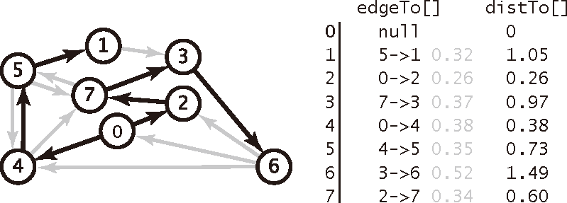
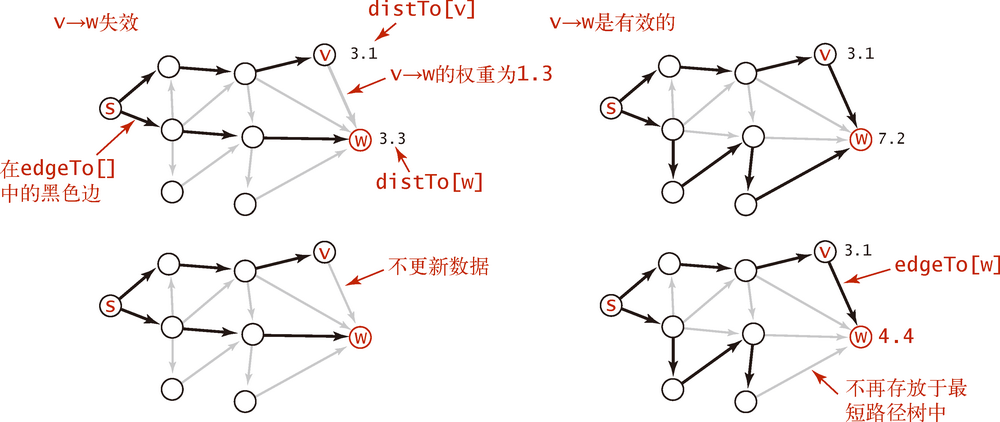

# Single-Source Shortest Paths


<!-- TOC -->

- [Single-Source Shortest Paths](#single-source-shortest-paths)
    - [Summary](#summary)
        - [负权重的边](#负权重的边)
        - [环路](#环路)
        - [Optimal substructure of a shortest path](#optimal-substructure-of-a-shortest-path)
    - [最短路径树](#最短路径树)
    - [实现加权有向图数据结构](#实现加权有向图数据结构)
    - [最短路径的数据结构](#最短路径的数据结构)
    - [边的松弛](#边的松弛)
        - [顶点的松弛](#顶点的松弛)
    - [Dijkstra 算法](#dijkstra-算法)
    - [References](#references)

<!-- /TOC -->


## Summary
看《算法导论》第 24 章第一节前面的部分。这里做一些笔记。

### 负权重的边
1. 某些单元最短路径问题可能包含负权重的边，但只要从源节点开始的路径不包含 **权重为负值的环路**，那最短权重路径都是有明确定义的，即使是某条最短路径权重为负值也没有问题。
2. 但如果某条路径能到达权重为负值的环路，则可以想象，我们一直走这个环，当前路径的总权重就会不断变小，那么这条路径的权重可以说就是负无穷的，并没有有意义的最短路径。

### 环路
1. 如果路径如果包含负权重环路，那它就可以无限小，所以不能包含。
2. 对于正权重环路，同样也不能包含。因为只要把该正环路删除，就可以得到一套同样能到达但是权重更小的路径。
3. 最后对于权重为零的环路，如果路径上有权重为零的环路，那我们就可以没有影响的删除这个环路，而得到一条同样权重但更简洁的路径。
4. 因为我们找到的最短路径就应该是没有环路的。
5. 对于图 $G=(V, E)$ 来说，任意无环路径最多包含 $V$ 个不同的节点，也就是最多包含 $V-1$ 条边，所以我们寻找的最短路径肯定最多也只会包含 $V-1$ 条边。

### Optimal substructure of a shortest path
1. Shortest-paths algorithms typically rely on the property that **a shortest path between two vertices contains other shortest paths within it**. 
2. The Edmonds-Karp maximum-flow algorithm also relies on this property. Optimal substructure is one of the key indicators that dynamic programming and the greedy method might apply. Dijkstra’s algorithm is a greedy algorithm, and the FloydWarshall algorithm, which finds shortest paths between all pairs of vertices is a dynamic-programming algorithm. 
3. The following lemma states the optimal-substructure property of shortest paths more precisely: **Subpaths of shortest paths are shortest paths**.（数学描述看《算法导论》的 lemma 24.1）
4. 因为如果某一段子路径不是最短子路径，那父路径就可以把这一段子路径换成最短的子路径，从而让自己更短。如果能更短，那就说明本来的父路径就不是最短路径。


## 最短路径树
1. 对于单源最短路径问题，给出了起点 `s`，计算的结果是一棵 **最短路径树** (SPT)，它包含了顶点 `s` 到所有可达的顶点的最短路径。
2. 下图展示了对于一个加权有向图，依次以每个节点作为起点，得到的最短路径树
    
3. **最短路径树的定义**：给定一幅加权有向图和一个顶点 `s`，以 `s` 为起点的一棵最短路径树是图的一幅子图，它包含 `s` 和从 `s` 可达的所有顶点。这棵有向树的根结点为 `s`，树的每条路径都是有向图中的一条最短路径。


## 实现加权有向图数据结构
比加权无向图简单一些
```js
class DirectedEdge {
    constructor (from, value, weight=1) {
        this.from = from;
        this.value = value;
        this.weight = weight;
    }
}

class EdgeWeightedDirectedGraph {
    constructor () {
        this.vertices = [];
        this.adjacencyList = new Map();
    }

    addVertex (v) {
        this.vertices.push(v);
        this.adjacencyList.set(v, new Set());
    }

    addEdge (v, w, weight=1) {
        this.adjacencyList.get(v).add(new DirectedEdge(v, w, weight));
    }

    getEdges () {
        let edges = [];
        this.vertices.forEach((v) => {
            this.adjacencyList.get(v).forEach((e) => {
                edges.push(e);
            });
        });
        return edges;
    }

    toString () {
        let str = '';
        this.vertices.forEach(vertex=>{
            let neighbors = this.adjacencyList.get(vertex);
            if ( neighbors.size ) {
                str += vertex + ' -> ';
                neighbors.forEach(n=>{
                    str += n.value + `(${n.weight}) `;
                });
                str += '\n';
            }
        });
        return str;
    }
}
```


## 最短路径的数据结构
1. 表示最短路径所需的数据结构如下图所示
    
2. **短路径树中的边**(`edgeTo[]`)。通过前溯节点来记录
3. **节点和起点之间的距离**(`distTo[]`)。
4. 一开始我们只知道图的边和它们的权重，`distTo[]` 中只有起点所对应的元素的值为 0，其余元素的值均被初始化为无穷;`edgeTo[]` 也都初始化为 `null`，因为现在我们还不知道最短路径树里每个节点的前溯是谁。
5. `distTo[]` 最终会是每个节点的最短路径值，在计算的过程中它们会从正无穷不断减少。我们把保存这里面的值称为节点 $v$ 到 起点 $s$ 的 **最短路径估计**（shortest-path estimate）。


## 边的松弛
1. 最短路径的算法都基于一个被称为 **松弛**（relaxation）的简单操作。
2. 随着算法的执行，它将起点到其他顶点的最短路径信息存入了 `edgeTo[]` 和 `distTo[]` 数组中。
3. 在遇到新的边时，通过更新这些信息就可以得到新的最短路径，而更新的方法就是对边进行松弛。
4. 对边 $(v, w)$ 的松弛的过程如下：将起点 $s$ 到节点 $v$ 的最短路径距离再加上 $(v, w)$ 的权重，和当前的 $s$ 到 $w$ 的最短路径估值进行比较，如果前者更短，那就可以更新 `edgeTo[w]` 和 `distTo[w]` 的数据了，也就是更新前溯节点和更新最短路径估计
    ```js
    function relax (edge) {

    }
    ```
5. 下图显示的是边的松弛操作之后可能出现的两种情况。一种情况是边失效（左边的例子），不更新任何数据；另一种情况是 v → w 就是到达 w 的最短路径上的边（右边的例子），这将会更新 `edgeTo[w]` 和 `distTo[w]`（这可能会使另一些边失效，但也可能产生一些新的有效边）
    

### 顶点的松弛
实际上，实现会放松从一个给定顶点指出的所有边。重载上面的 `relax` 方法
```js
function relax (vertex) {
    // TODO 过滤有效边
    let edgeList = this.adjacencyList.get(vertex);
    edgeList.forEach(edge=>{
        let {from: v, value: w} = edge;
        if (distTo[w] > distTo[v] + edge.weight) {
            distTo[w] = distTo[v] + edge.weight;
            edgeTo[w] = edge;
        }
    });
}
```


## Dijkstra 算法
TODO
```js
class QueueElement {
    constructor(element, priority) {
        this.element = element;
        this.priority = priority;
    }
}

class PriorityQueue {
    constructor(){
        this.items = [];
    }

    enqueue (element, priority) {
        let queueElement = new QueueElement(element, priority);

        if (this.isEmpty()) {
            return this.items.push(queueElement);
        } 
        else {
            for (let i = 0; i < this.items.length; i++) {
                if (queueElement.priority < this.items[i].priority) {
                    this.items.splice(i, 0, queueElement);
                    return this.items.length + 1;
                }
            }
            return this.items.push(queueElement);
        }
    }

    dequeue () {
        return this.items.shift();
    }

    remove (item) {
        let index = this.items.indexOf(item);
        if (index === -1 ) {
            return;
        }
        else {
            this.items.splice(index, 1);
        }
    }

    isEmpty () {
        return this.items.length === 0;
    }
}


class DirectedEdge {
    constructor (from, value, weight=1) {
        this.from = from;
        this.value = value;
        this.weight = weight;
    }
}

class EdgeWeightedDirectedGraph {
    constructor () {
        this.vertices = [];
        this.adjacencyList = new Map();
    }

    addVertex (v) {
        this.vertices.push(v);
        this.adjacencyList.set(v, new Set());
    }

    addEdge (v, w, weight=1) {
        this.adjacencyList.get(v).add(new DirectedEdge(v, w, weight));
    }

    getEdges () {
        let edges = [];
        this.vertices.forEach((v) => {
            this.adjacencyList.get(v).forEach((e) => {
                edges.push(e);
            });
        });
        return edges;
    }

    toString () {
        let str = '';
        this.vertices.forEach(vertex=>{
            let neighbors = this.adjacencyList.get(vertex);
            if ( neighbors.size ) {
                str += vertex + ' -> ';
                neighbors.forEach(n=>{
                    str += n.value + `(${n.weight}) `;
                });
                str += '\n';
            }
        });
        return str;
    }
}


// function relax (edge) {
//     let {from: v, value: w} = edge;
//     if (distTo[w] > distTo[v] + edge.weight) {
//         distTo[w] = distTo[v] + edge.weight;
//         edgeTo[w] = edge;
//     }
// }


const INFI = 10;
const distTo = new Map();
const edgeTo = new Map();
let pq = new PriorityQueue();
let tree_vertices = [];

function isInvalid (edge) {
    tree_vertices
}
function relax (graph, vertex, pq) {
    // TODO 过滤有效边
    let edgeList = graph.adjacencyList.get(vertex.element);
    
    edgeList.forEach(edge=>{
        let {from: v, value: w, weight} = edge;
        if (distTo.get(w) > distTo.get(v) + edge.weight) {
            distTo.set(w, distTo.get(v) + edge.weight);
            edgeTo.set(w, edge);
        }
        pq.enqueue(w, weight);
    });
    console.log(pq.items);
    debugger;
}

function init(vertices, start) {
    vertices.forEach((v) => {
        if (v !== start) {
            distTo.set(v, INFI);
        }
        else {
            distTo.set(start, 0);
        }
        edgeTo.set(v, null);  
        pq.enqueue(v, v.weight);
    });
    
}

function dijkstra (graph, start) {
    let vertices = graph.vertices;
    init(vertices, start);

    // console.log()
    let vertex;
    // while (!pq.isEmpty()) {
    //     vertex = pq.dequeue();
    //     tree_vertices.push(vertex);
    //     relax(graph, vertex, pq);
    // }

    
    console.log(distTo);
    console.log(edgeTo);
    console.log(pq);
    // enqueue();

    // return tree_vertices;
}


let graph = new EdgeWeightedDirectedGraph();
let vertices = [0, 1, 2, 3, 4, 5, 6, 7];

vertices.forEach(vertex=>{
    graph.addVertex(vertex);
});

graph.addEdge(0, 2, 0.26);
graph.addEdge(0, 4, 0.38);
graph.addEdge(1, 3, 0.29);
graph.addEdge(2, 7, 0.34);
graph.addEdge(3, 6, 0.52);
graph.addEdge(4, 5, 0.35);
graph.addEdge(4, 7, 0.37);
graph.addEdge(5, 1, 0.32);
graph.addEdge(5, 4, 0.35);
graph.addEdge(5, 7, 0.28);
graph.addEdge(6, 0, 0.58);
graph.addEdge(6, 2, 0.40);
graph.addEdge(6, 4, 0.93);
graph.addEdge(7, 3, 0.39);
graph.addEdge(7, 5, 0.28);

// console.log(graph.toString());
// console.log(graph.getEdges());
let result = dijkstra (graph, 0);
console.log(result);
```

## References
* [算法（第4版）](https://book.douban.com/subject/19952400/)
* [Python数据结构与算法分析（第2版）](https://book.douban.com/subject/34785178/)
* [算法导论（原书第3版）](https://book.douban.com/subject/20432061/)