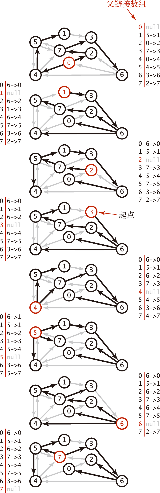

# Single-Source Shortest Paths

<!-- TOC -->

- [Single-Source Shortest Paths](#single-source-shortest-paths)
    - [Summary](#summary)
        - [负权重的边](#负权重的边)
        - [环路](#环路)
        - [Optimal substructure of a shortest path](#optimal-substructure-of-a-shortest-path)
    - [最短路径树](#最短路径树)
    - [References](#references)

<!-- /TOC -->

## Summary
看《算法导论》第 24 章第一节前面的部分。这里做一些笔记。

### 负权重的边
1. 某些单元最短路径问题可能包含负权重的边，但只要从源节点开始的路径不包含 **权重为负值的环路**，那最短权重路径都是有明确定义的，即使是某条最短路径权重为负值也没有问题。
2. 但如果某条路径能到达权重为负值的环路，则可以想象，我们一直走这个环，当前路径的总权重就会不断变小，那么这条路径的权重可以说就是负无穷的，并没有有意义的最短路径。

### 环路
1. 如果路径如果包含负权重环路，那它就可以无限小，所以不能包含。
2. 对于正权重环路，同样也不能包含。因为只要把该正环路删除，就可以得到一套同样能到达但是权重更小的路径。
3. 最后对于权重为零的环路，如果路径上有权重为零的环路，那我们就可以没有影响的删除这个环路，而得到一条同样权重但更简洁的路径。
4. 因为我们找到的最短路径就应该是没有环路的。
5. 对于图 $G=(V, E)$ 来说，任意无环路径最多包含 $V$ 个不同的节点，也就是最多包含 $V-1$ 条边，所以我们寻找的最短路径肯定最多也只会包含 $V-1$ 条边。

### Optimal substructure of a shortest path
1. Shortest-paths algorithms typically rely on the property that **a shortest path between two vertices contains other shortest paths within it**. 
2. The Edmonds-Karp maximum-flow algorithm also relies on this property. Optimal substructure is one of the key indicators that dynamic programming and the greedy method might apply. Dijkstra’s algorithm is a greedy algorithm, and the FloydWarshall algorithm, which finds shortest paths between all pairs of vertices is a dynamic-programming algorithm. 
3. The following lemma states the optimal-substructure property of shortest paths more precisely: **Subpaths of shortest paths are shortest paths**.（数学描述看《算法导论》的 lemma 24.1）
4. 因为如果某一段子路径不是最短子路径，那父路径就可以把这一段子路径换成最短的子路径，从而让自己更短。如果能更短，那就说明本来的父路径就不是最短路径。

## 最短路径树
1. 对于单源最短路径问题，给出了起点 `s`，计算的结果是一棵 **最短路径树** (SPT)，它包含了顶点 `s` 到所有可达的顶点的最短路径。
2. 下图展示了对于一个加权有向图，依次以每个节点作为起点，得到的最短路径树
    
3. **最短路径树的定义**：给定一幅加权有向图和一个顶点 `s`，以 `s` 为起点的一棵最短路径树是图的一幅子图，它包含 `s` 和从 `s` 可达的所有顶点。这棵有向树的根结点为 `s`，树的每条路径都是有向图中的一条最短路径。

## References
* [算法（第4版）](https://book.douban.com/subject/19952400/)
* [Python数据结构与算法分析（第2版）](https://book.douban.com/subject/34785178/)
* [算法导论（原书第3版）](https://book.douban.com/subject/20432061/)