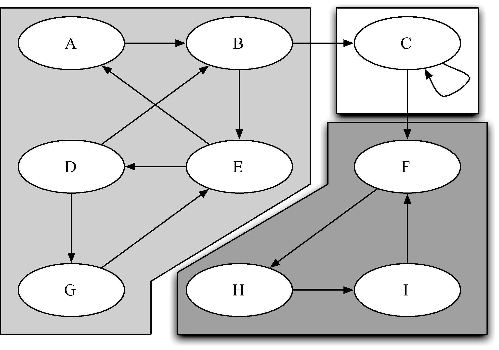
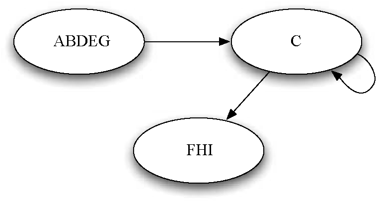

# Graph


<!-- TOC -->

- [Graph](#graph)
    - [Strongly connected components](#strongly-connected-components)
    - [计算强连通分量](#计算强连通分量)
    - [References](#references)

<!-- /TOC -->


## Strongly connected components
1. 对于有向图 $G=(V, E)$，强连通分量是一个最大节点结合 $C\subset V$，其中对于每一对节点 $v,w\in C$，都有一条从 $v$ 到 $w$ 的路径和一条从 $w$ 到 $v$ 的路径。
2. 下图展示了一个包含 3 个强连通单元的简单图，不同的强连通单元通过不同的阴影来表现
    
3. 定义强连通单元之后，就可以把强连通单元中的所有顶点组合成单个顶点，从而将图简化
    


## 计算强连通分量
1. 首先对图计算一遍 DFS，获得完成时间
    ```js
    let {exploredTime} = graph.DFSWidthMoreInfo();
    ```
2. 然后获得转置图
    ```js
    let transposed = graph.transpose();
    ```
3. 再对转置图进行 DFS，但是外层循环的节点循序要按照第一遍完成时间的降序。所以先根据完成时间获得降序的节点列表
    ```js
    let sorted = Object.entries(exploredTime).sort((v1, v2)=>v2[1]-v1[1]);
    let descendingVertices = Object.keys(Object.fromEntries(sorted));
    ```
4. 执行 DFS，获得深度优先森林
    ```js
    let info = transposed.DFSWidthMoreInfo(sortFn)
    ```
5. 其中的每一棵树就是一个强连通分量。这里使用《算法导论》 22-9 的图作为示例，构建图
    ```js
    let graph = new Graph(true);
    let vertices = ['A','B','C','D','E','F','G','H'];

    vertices.forEach(vertex=>{
        graph.addVertex(vertex);
    });

    graph.addEdge('A', 'B');
    graph.addEdge('B', 'C');
    graph.addEdge('B', 'E');
    graph.addEdge('B', 'F');
    graph.addEdge('C', 'D');
    graph.addEdge('C', 'G');
    graph.addEdge('D', 'C');
    graph.addEdge('D', 'H');
    graph.addEdge('E', 'A');
    graph.addEdge('E', 'F');
    graph.addEdge('F', 'G');
    graph.addEdge('G', 'F');
    graph.addEdge('G', 'H');
    graph.addEdge('H', 'H');
    ```
6. 深度优先森林中如下
    ```js
    console.log( JSON.stringify(info.predecessors, null, 4) );
    // {
    //     "A": "B",
    //     "B": null,
    //     "E": "A",
    //     "C": null,
    //     "G": "F",
    //     "F": null,
    //     "D": "C",
    //     "H": null
    // }
    ```
    有 4 个节点的前溯节点 `null`，所以它们分别对应 4 棵树的根节点。


## References
* [学习JavaScript数据结构与算法](https://book.douban.com/subject/26639401/)
* [算法（第4版）](https://book.douban.com/subject/19952400/)
* [Python数据结构与算法分析（第2版）](https://book.douban.com/subject/34785178/)
* [算法导论（原书第3版）](https://book.douban.com/subject/20432061/)