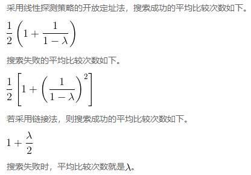

# HashTable


<!-- TOC -->

- [HashTable](#hashtable)
    - [Summary](#summary)
    - [设计思想](#设计思想)
        - [碰撞和处理](#碰撞和处理)
    - [相关定义](#相关定义)
        - [槽](#槽)
        - [散列函数](#散列函数)
        - [载荷因子](#载荷因子)
    - [散列函数实现](#散列函数实现)
        - [折叠法](#折叠法)
        - [平方取中法](#平方取中法)
        - [基于字符的元素创建散列函数](#基于字符的元素创建散列函数)
    - [处理冲突（Collision）](#处理冲突collision)
        - [线性探测（Linear Probing）方法](#线性探测linear-probing方法)
            - [扩展线性探测](#扩展线性探测)
            - [平方探测](#平方探测)
    - [链接法（Chaining）散列](#链接法chaining散列)
        - [实现](#实现)
        - [复杂度](#复杂度)
            - [查找元素](#查找元素)
            - [插入元素](#插入元素)
            - [删除元素](#删除元素)
        - [分析散列搜索算法](#分析散列搜索算法)
    - [散列表的优势](#散列表的优势)
    - [References](#references)

<!-- /TOC -->


## Summary
1. A hash table is an effective data structure for implementing dictionaries. 
2. Although searching for an element in a hash table can take as long as searching for an element in a linked list — $O(n)$ time in the worst case — in practice, hashing performs extremely well. 
3. Under reasonable assumptions, the average time to search for an element in a hash table is $O(1)$.


## 设计思想
1. 数据在保存的时候分类的越高效，则搜索的时候也就越高效。
2. 除了类似于图书分类法这样分层的、抽象属性分类方法以外，还有一大类分类方法就是按照数值范围分类的，比如按照名次分班。
3. 例如按照 50 人一个班来分，当你想找上次考试排 128 名的人，就应该去 3 班找。但除非 3 班是按照名次排座位，否则你去了3班还是要在 50 个人里面一个一个找，而不能快速定位。
4. 那么进一步，假设 10 人一班，这样你可以快速先定位到 13 班，在 13 班里只需要在 10 个人里面一个一个找，会快很多。
5. 最极端的情况是 1 个人一班，那么你只要定位到 128 班，就立刻找到了那个人，你在班里不用再找了。
6. 这时看起来找班级变成了低效的事情，但实际的情况是，班级都是按照顺序依次排列的，所以比如一层 10 班，128 班就在 13 层。
7. 在计算机中只要是按照顺序，那么寻址的速度还是高效的。
8. 所以如果能把客观的学生都映射到唯一的数字名次上，那么想找到一个名次的人就会很高效。

### 碰撞和处理
1. 将学生映射为名次的话，显然就会出现成绩相同名次相同的情况。
2. 名次的情况，一般都是按照链接法来解决冲突，即并列第几名。把两个名次相同的学生排在一个班，这样找起来也是很方便的。
3. 当然也可以很变态的采用线性探测法，成绩一样的也名次递增，也是挨在一起的。
4. 归根结底都是让搜索时如果发现冲突可以很快的找到重复的元素。
5. 至于为了避免基础线性探测元素聚集而加入步长的情况，如果使用简单高效的步长计算方法，找到重复元素也不会明显的变慢。


## 相关定义
### 槽
1. 散列表中的每个位置通常被称为 **槽**，其中可以存储一个元素。
2. 槽用一个从 0 开始的整数标记，例如 0 号槽、1 号槽、2 号槽，等等。
3. 初始情形下，散列表中没有元素，每个槽都是空的。

### 散列函数
1. 散列函数将散列表中的元素与其所属位置对应起来。对散列表中的任一元素，散列函数返回一个介于 `0` 和 `槽长度-1` 之间的整数。
2. 假设有一个由整数元素 54、26、93、17、77 和 31 构成的集合及一个 11 个槽的散列表。
3. 首先来看第一个散列函数，它有时被称作 “取余函数”，即用一个元素除以散列表的大小，并将得到的余数作为散列值（`h(item) = item%11`）。取余函数是一个很常见的散列函数，这是因为结果必须在槽编号范围内。
4. 计算出散列值后，就可以将每个元素插入到相应的位置。
5. 搜索目标元素时，仅需使用散列函数计算出该元素的槽编号，并查看对应的槽中是否有值。
6. 因为计算散列值并找到相应位置所需的时间是固定的，所以搜索操作的时间复杂度是 $O(1)$。如果一切正常，那么我们就已经找到了常数阶的搜索算法。
7. 但只有当每个元素的散列值不同时，这个技巧才有用。如果两个元素的散列值相同这就有问题了。
8. 散列函数确实会将两个元素都放入同一个槽，这种情况被称作冲突，也叫 “碰撞”。需要其他方法解决碰撞问题，但时间复杂度就会有所增加。

### 载荷因子
槽位占用率被称作载荷因子，记作 $λ$。


## 散列函数实现
1. 给定一个元素集合，能将每个元素映射到不同的槽，这种散列函数称作 **完美散列函数**。
2. 如果元素已知，并且集合不变，那么构建完美散列函数是可能的。不幸的是，给定任意一个元素集合，没有系统化方法来保证散列函数是完美的。所幸，不完美的散列函数也能有不错的性能。
3. 构建完美散列函数的一个方法是增大散列表，使之能容纳每一个元素，这样就能保证每个元素都有属于自己的槽。这样的散列表就成为了一个 **直接寻址表**。
4. 当元素个数少时，这个方法是可行的，不过当元素很多时，就不可行了。如果元素是 9 位的社会保障号，这个方法需要大约 10 亿个槽。如果只想存储一个班上 25 名学生的数据，这样做就会浪费极大的内存空间。
5. 我们的目标是创建这样一个散列函数：冲突数最少，计算方便，元素均匀分布于散列表中。有多种常见的方法来扩展取余函数，下面介绍其中的几种。
6. 你也许能想到多种计算散列值的其他方法。重要的是，散列函数一定要高效，以免它成为存储和搜索过程的负担。如果散列函数过于复杂，计算槽编号的工作量可能比在进行顺序搜索或二分搜索时的更大，这可不是散列的初衷。

### 折叠法
1. 折叠法先将元素切成等长的部分（最后一部分的长度可能不同），然后将这些部分相加，得到散列值。
2. 假设元素是电话号码 436-555-4601，以 2 位为一组进行切分，得到 43、65、55、46 和 01。将这些数字相加后，得到 210。假设散列表有 11 个槽，接着需要用 210 除以 11，并保留余数 1。所以，电话号码 436-555-4601 被映射到散列表中的 1 号槽。
3. 有些折叠法更进一步，在加总前每隔一个数反转一次。就本例而言，反转后的结果是：43+56+55+64+01=219，219%11=10。

### 平方取中法
1. 另一个构建散列函数的数学技巧是平方取中法：先将元素取平方，然后提取中间几位数。
2. 如果元素是 44，先计算 44^2=1936，然后提取中间两位 93，继续进行取余的步骤，得到 5（93%11）。

### 基于字符的元素创建散列函数
1. 我们也可以为基于字符的元素（比如字符串）创建散列函数。可以将单词 “cat” 看作序数值序列:
    ```sh
    >>> ord('c')
    99
    >>> ord('a')
    97
    >>> ord('t')
    116
    ```
    因此，可以将这些序数值相加，并采用取余法得到散列值
2. 为字符串构建简单的散列函数
    ```py
    def hash(astring, tablesize):
        sum = 0
        for pos in range(len(astring)):
            sum = sum + ord(astring[pos])

        return sum%tablesize
    ```
3. 有趣的是，针对同素异序词，这个散列函数总是得到相同的散列值。要弥补这一点，可以用字符位置作为权重因子
    ```py
    def hash(astring, tablesize):
        sum = 0
        for pos in range(len(astring)):
            sum = sum + ord(astring[pos])*(pos+1)

        return sum%tablesize


    print(hash('cat', 11)) # 3
    print(hash('tac', 11)) # 2
    ```


## 处理冲突（Collision）
1. 当两个元素被分到同一个槽中时，必须通过一种系统化方法在散列表中安置第二个元素。这个过程被称为处理冲突。
2. 前文说过，如果散列函数是完美的，冲突就永远不会发生。然而，这个前提往往不成立，因此处理冲突是散列计算的重点。

### 线性探测（Linear Probing）方法
1. 注意，为了遍历散列表，可能需要往回检查第一个槽。也就是说一直找到散列表最后一个仍然没有空位，则循环到头部再检测。
2. 这个过程被称为开放定址法，它尝试在散列表中寻找下一个空槽或地址。由于是逐个访问槽，因此这个做法被称作线性探测。
3. 线性探测有个缺点，那就是会使散列表中的元素出现聚集现象。也就是说，如果一个槽发生太多冲突，线性探测会填满其附近的槽，而这会影响到后续插入的元素，有时要越过数个槽位才能找到一个空槽。

#### 扩展线性探测
1. 要避免元素聚集，一种方法是扩展线性探测，不再依次顺序查找空槽，而是跳过一些槽，这样做能使引起冲突的元素分布得更均匀。
2. 例如采用 “加3” 探测策略处理冲突后时，如果发生冲突时，为了找到空槽，该策略每次跳两个槽。
3. **再散列** 泛指在发生冲突后寻找另一个槽的过程。
4. 采用线性探测时，再散列函数是 `newhashvalue = rehash(oldhashvalue)`，并且 `rehash(pos) = (pos + 1)%sizeoftable`。“加3” 探测策略的再散列函数可以定义为 `rehash(pos) = (pos + 3)%sizeoftable`。
5. 也就是说，可以将再散列函数定义为 `rehash(pos) = (pos + skip)%sizeoftable`。
6. 注意，“跨步”（skip）的大小要能保证表中所有的槽最终都被访问到，否则就会浪费槽资源。要保证这一点，常常建议散列表的大小为素数 TODO 素数原理。

#### 平方探测
1. 平方探测是线性探测的一个变体，它不采用固定的跨步大小，而是通过再散列函数递增散列值。
2. 如果第一个散列值是 $h$，后续的散列值就是 $h+1$、$h+4$、$h+9$、$h+16$，等等。换句话说，平方探测的跨步大小是一系列完全平方数。
3. 例如集合 `[54, 26, 93, 17, 77, 31, 44, 55, 20]` 放入 11 槽位的散列表中：
    1. 77 计算散列值 $h$ 为 0，会先占据槽位 0；
    2. 之后 44 计算散列值 $h$ 也为 0，这时的 skip 为 1，所以占据槽位 1；
    3. 最后 55 计算散列值 $h$ 也为 0，这时的 skip 为 4，所以占据槽位 4；


## 链接法（Chaining）散列
1. 另一种处理冲突的方法是让每个槽有一个指向元素集合（比如链表）的引用。链接法允许散列表中的同一个位置上存在多个元素。发生冲突时，元素仍然被插入其散列值对应的槽中。
2. 不过，随着同一个位置上的元素越来越多，搜索变得越来越困难。
3. 搜索目标元素时，我们用散列函数算出它对应的槽编号。由于每个槽都有一个元素集合，因此需要再搜索一次，才能得知目标元素是否存在。
4. 链接法的优点是，平均算来，每个槽的元素不多，因此搜索可能更高效。

### 实现
```cpp
#include <stdio.h>
#include <stdlib.h>

#define SIZE 9

typedef struct Node{
    int key;
    struct Node* prev;
    struct Node* next;
} Node;

// 若干个散列函数
int hash_fn_mod (int key);

// 散列表是一个数组，每个数组项指向一个槽位链表的 head 节点
Node* table[SIZE];
void hash_init(void);
void hash_put(int key);
Node* hash_get(int key);
void hash_delete(Node*);
void print_list(int idx);
void print_table(void);

// 确定当前使用的散列函数
int (*hash_fn)(int) = hash_fn_mod;


int main(void) {

    hash_init();
    
    hash_put(5);
    hash_put(23);
    hash_put(14);
    hash_put(4);
    hash_put(9);
    hash_put(7);
    print_table();

    printf("--------------------\n");
    hash_delete(hash_get(14));
    print_table();

    return 0;
}

int hash_fn_mod (int key) {
    return key % SIZE;
}
void hash_init(void) {
    for (int i=0; i<SIZE; i++) {
        table[i] = NULL;
    }
}
void hash_put (int key) {
    int pos = hash_fn(key);
    Node* head = table[pos];
    Node* newNode = malloc(sizeof(Node));
    if (newNode == NULL) {
        printf("Create node fail.");
        exit(EXIT_FAILURE);
    }
    newNode->key = key;
    table[pos] = newNode;
    newNode->next = head;
    newNode->prev = NULL;
    if (head != NULL) {
        head->prev = newNode;
    }
}
Node* hash_get (int key) {
    int pos = hash_fn(key);
    Node* curr = table[pos];
    while (curr != NULL && curr->key != key) {
        curr = curr->next;
    }
    return curr;
}
void hash_delete (Node* node) {
    Node* prev = node->prev;
    Node* next = node->next;

    // 只要有 next，不管 prev 只不是 NULL 都可以
    // 如果没有 next，说明 node 是 tail，删掉后后面也不会有受影响的节点
    if (next != NULL) {
        next->prev = prev;
    }

    // 只要有 prev，不管 next 是不是 NULL 都可以
    // 但 prev 是 NULL 的话，还有一步要处理，因为此时 node 就是 head，
    // 所以 table[idx] 还在引用 node，因此还必须要让 table[idx] 引用 next
    if (prev != NULL) {
        prev->next = next;
    }
    else {
        int idx = hash_fn(node->key);
        table[idx] = next;
    }

    free(node);
}
void print_list(int idx) {
    Node* curr = table[idx];
    while (curr != NULL) {
        printf("%d->", curr->key);
        curr = curr->next;
    }
    printf("\n");
}
void print_table(void) {
    for (int i=0; i<SIZE; i++) {
        printf("%d: ", i);
        print_list(i);
    }
    printf("\n");
}
```

### 复杂度
1. 给定一个存放 $n$ 个元素、拥有 $m$ 个槽位的散列表 $T$，定义 $T$ 的**装载因子**(load factor) $α$ 为 $n/m$, 也就是每个链表的平均存储元素数。
2. 我们的分析将基于 $α$ 值，它可能小于、等于或大于 1。
3. 链接法最坏的情况是 $O(n)$ 级别的，也就是 $n$ 个元素都放到了同一个链表中。
4. 平均的情况依赖于所选取的散列函数的性能，也就是该函数能在多大程度上将 $n$ 个元素均匀的分布在 $m$ 个槽位中。
5. 这里先假设可以均匀分布，以此实现的散列就是 **简单均匀散列**(simple uniform hashing)。

#### 查找元素
1. 分为两种情况来考虑：查找的元素不在散列表中（查找失败），查找的元素在散列表中（查找成功）。
2. 查找失败时会遍历整个链表因此时间复杂度为 $O(α)$。查找成功时，虽然不一会遍历整个链表，但时间复杂度仍然为 $O(α)$。 
3. 《算法导论》这里（146页）的推导没看懂，但意思就：随着数据量的增加，我们使用的槽位数也会相应的增加，这样平均每个链表的长度 $α$ 就是一个不大的常数。所以 $O(α)$ 实际上就是常数级别 $O(1)$。

#### 插入元素
插入操作把元素插入到当前槽位链表的头部，所以最坏情况运行时间是 $O(1)$。

#### 删除元素
1. 通过直接指定待删除元素而不是待删除元素的 key，可以在 $O(1)$ 时间内从散列表中找到该元素。
2. 如果使用的是双向链表，则可以直接删除该元素，所以删除操作的运行时间就是 $O(1)$。
3. 如果是单向列表，因为没有 prev 指针，不能从待删除元素找到 prev 元素，所以必须从链表头部遍历找到 prev 元素，因此删除操作的运行时间和查找操作相同。


### 分析散列搜索算法
1. 在最好情况下，散列搜索算法的时间复杂度是 O(1)，即常数阶。然而，因为可能发生冲突，所以比较次数通常不会这么简单。
2. 在分析散列表的使用情况时，最重要的信息就是载荷因子 $λ$。
3. 从概念上来说，如果 $λ$ 很小，那么发生冲突的概率就很小，元素也就很有可能各就各位。如果 $λ$ 很大，则意味着散列表很拥挤，发生冲突的概率也就很大。
4. 因此，冲突解决起来会更难，找到空槽所需的比较次数会更多。一个不错的经验规则是：一旦 $λ$ 大于 0.7，就调整散列表的长度。
5. 若采用链接法，冲突越多，每条链上的元素也越多。
6. 和之前一样，来看看搜索成功和搜索失败的情况 TODO
    


## 散列表的优势
1. 假设我们要存储大量的映射数据。
2. 因为必须要存储映射，所以不能使用速度快得多的数组结构。
3. 基础的情况下，当我们想要查找一个元素时，只有一个一个的遍历，这时很耗时的。
4. 散列表可以让我们根据一个 key 直接找到它对应的 value，而不需要遍历。通过散列函数，将每个 key 转换为一个数字值，然后就可以使用高效的数组来保存映射。
5. 从很简单 lose lose hash function 可以看出原理：
    ```js
    function loseloseHashCode(key) {
        let hash = 0;                          
        for (let i = 0; i < key.length; i++) { 
            hash += key.charCodeAt(i);         
        }
        let index = hash % 37;
        console.log(key +' => '+ index);
        return index;
    }

    let persons = {
        Gandalf:  'gandalf@email.com',
        John:     'johnsnow@email.com',
        Tyrion:   'tyrion@email.com',
        Aaron:    'aaron@email.com',
        Donnie:   'donnie@email.com',
        Ana:      'ana@email.com',
        Jonathan: 'jonathan@email.com',
        Jamie:    'jamie@email.com',
        Sue:      'sue@email.com',
        Mindy:    'mindy@email.com',
        Paul:     'paul@email.com',
        Nathan:   'nathan@email.com',
    };


    Object.keys(persons).forEach(key => {
        loseloseHashCode(key);
    });

    // Gandalf  => 19
    // John     => 29
    // Tyrion   => 16
    // Aaron    => 16
    // Donnie   => 13
    // Ana      => 13
    // Jonathan => 5
    // Jamie    => 5
    // Sue      => 5
    // Mindy    => 32
    // Paul     => 32
    // Nathan   => 10
    ```
6. 本来数据如果存储在对象`person`中，则每次查找都效率都比较低。现在把所有的 key 都转化为数值，则“字符串-字符串”的映射就变成了“数值-字符串”的映射，因此可以使用数组来保存。
7. 但问题也很明显，就是很多 key 转换为的数值都是相同的。这一方面可以通过使用更好的散列函数来减少重复，但根本上还是要通过彻底的解决冲突的方法来保证不会有冲突。


## References
* [《Python数据结构与算法分析（第2版）》](https://book.douban.com/subject/34785178/)
* [《算法图解》](https://book.douban.com/subject/26979890/)
* [算法导论](https://book.douban.com/subject/20432061/)