# Euclidean Algorithm

<!-- TOC -->

- [Euclidean Algorithm](#euclidean-algorithm)
    - [核心思想](#核心思想)
    - [设计思想](#设计思想)
    - [数学证明](#数学证明)
    - [几何图解](#几何图解)
        - [使用线段](#使用线段)
        - [使用矩形](#使用矩形)
    - [References](#references)

<!-- /TOC -->

## 核心思想
* 分析事物特征
* 分析事物关系
* 转换或化简问题

## 设计思想
1. 不知道欧几里得最初是怎么想到辗转相除的，但现在我知道了这个方法，就在此基础上，设想一下怎么想出辗转相除法。
2. 拿到这个问题，分析一下 **事物的关系**。或者，在数学里面，就是 **函数关系**。
3. 函数有两个自变量，是两个自然数（$x$、$y$）；因变量就是这两个自变量的最大公约数（$z$）。
4. 那么这个问题就是，找到这三者之间的 **某种关系**。
5. 一开始肯定也不知道怎么下手，但可以先 **尽量寻找三个事物的特征，以及特征之间的联系**。
6. 这个过程比较发散，没有什么明确的规律可遵循。不过归根结底，你是要寻找两个自变量的某个共同属性。
7. 那么就可以看看这两个自变量有什么 **共同之处**，以及这个共同之处和因变量的 **关系**；同时，从 **反面** 思考也可能收到启发，就是想想这两个自变量有什么 **不同之处**，以及这个不同之处和因变量的 **关系**。
8. 共同之处就是，$x$ 是 $z$ 的整数倍，$y$ 是 $z$ 的整数倍；至于不同之处，也许需要一点点运气和时间，你会想到它们的差，然后想想这个差和 $z$ 的关系，也是 $z$ 的整数倍。
9. 现在，就得出来了一个有意义的关系：$x$ 和 $y$ 的差值也是 $z$ 的整数倍。
10. 本来我们是困在那里的，但现在有了一个新的关系，我们就可以利用它，**对现有的问题进行变形、拆解或者化简**。
11. 又需要一点点运气和时间，我们意识到了问题可以简化为寻找较小的那个自变量和因变量的最大公约数。毕竟，当要计算的数字变小时，难度也会下降一点。
12. 到了这一步其实也就可以想到辗转相除了。

## 数学证明
1. 参考 [这个视频](https://www.bilibili.com/video/BV1mJ411q7xw/)。
2. 对于整数 $p$ 和 $q$，如果 $d$ 是它们的公约数，则 $d$ 一定是 $p/q$ 的余数 $r$ 的公约数。因为 $p$ 是 $d$ 的整数倍，$q$ 也是 $d$ 的整数倍，那 $r$ 也一定是 $d$ 的整数倍。
3. 也就是说，$p$ 和 $q$ 的所有公约数，也一定都是 $q$ 和 $r$ 的公约数。
4. 以此类推，即辗转相除。
5. 辗转相除若干步之后，当前的 $r$ 可以除尽当前的 $q$，即 $q/r$ 的余数是 0。
6. 这就说明，当前的 $r$ 是 当前的 $q$ 的约数；而显然当前的 $r$ 是它自身的最大约数；所以当前 $r$ 就是当前 $r$ 和当前 $q$ 的最大公约数。
6. 那么当前的 $r$ 也就是最初的 $p$ 和 $q$ 的最大公约数。

## 几何图解
### 使用线段
在一个叫 Algorithms 的 APP 上，看到了这个图解。求 1112 和 695 的最大公约数。
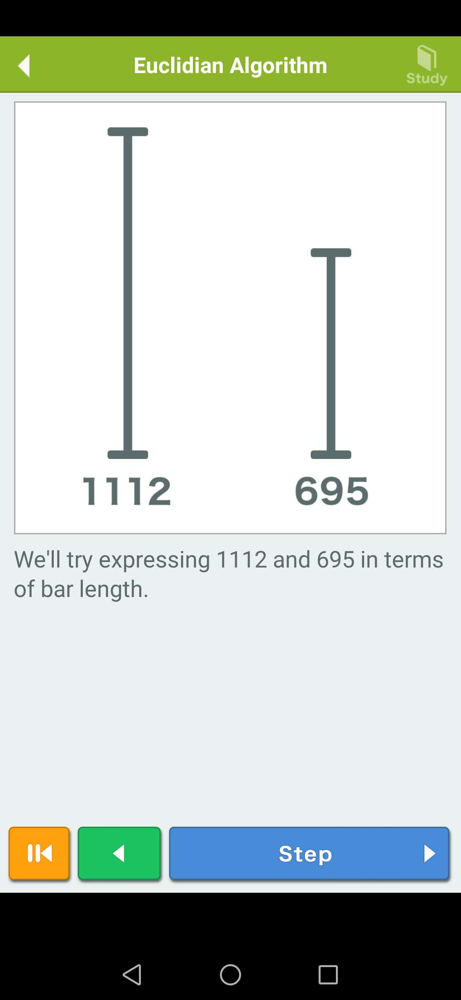
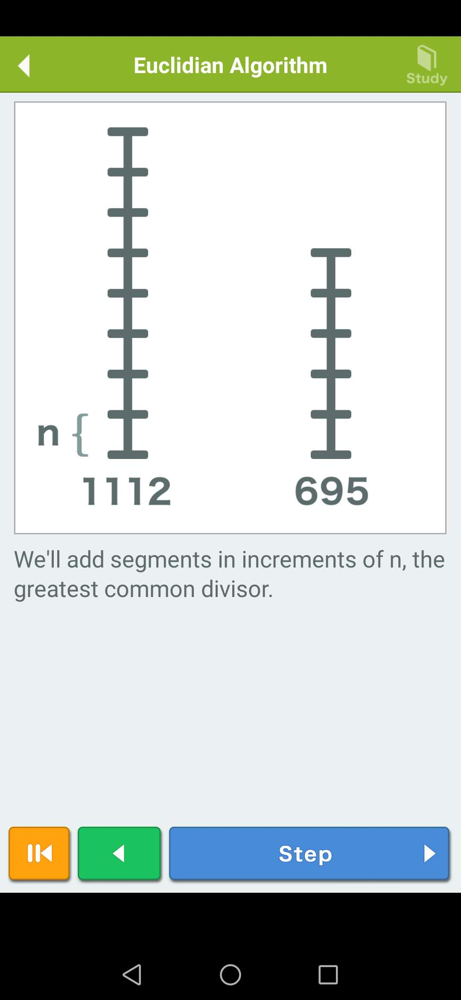
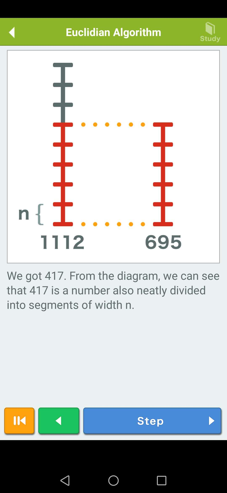
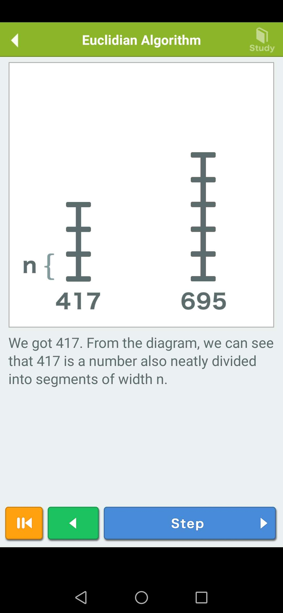
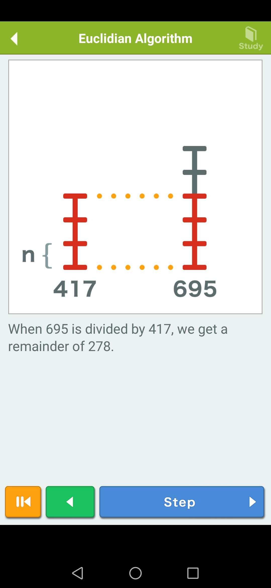
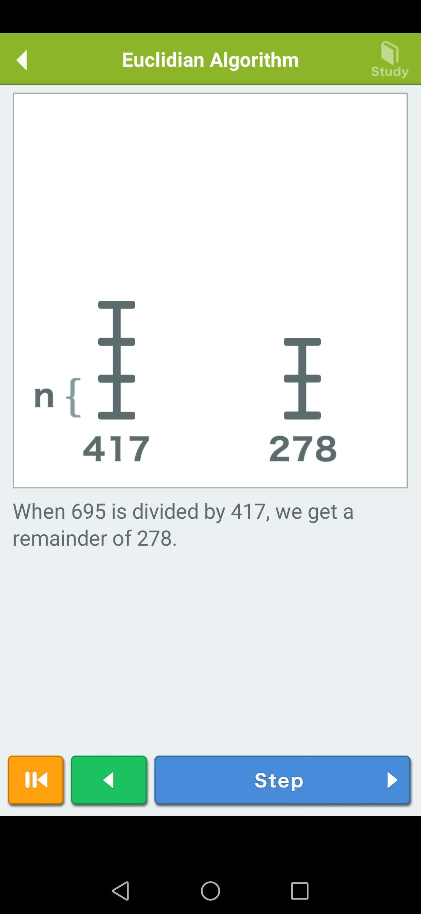
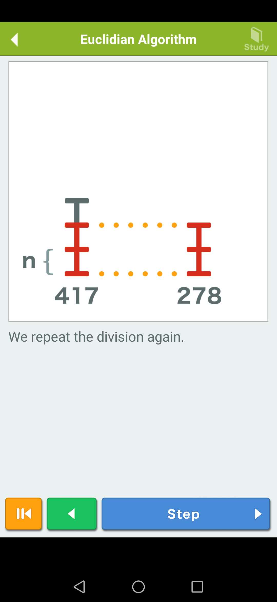
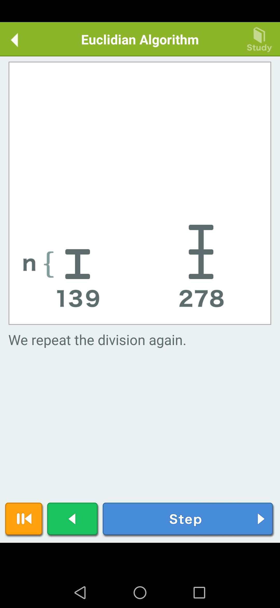
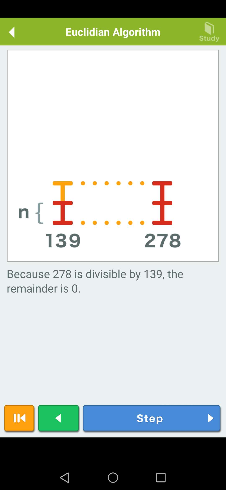
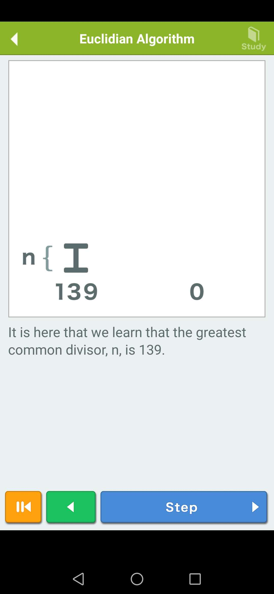
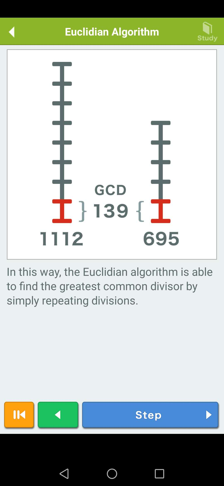

### 使用矩形
1. [这个视频](https://www.bilibili.com/video/BV1mJ411q7xw/)。
2. 相比于线段图解，这个稍微有点绕。刚开始看的时候，对于 “填满” 的意义，容易错误的理解为面积的填满，实际上 “填满” 的意义是正好对齐边长。

## References
* [15岁女孩参加世界顶尖科学家大会！她研究的贝祖数是什么？](https://www.bilibili.com/video/BV1mJ411q7xw/)
* 一个叫 Algorithms 的 APP