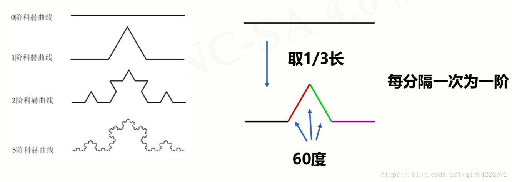

# 递归思想


<!-- TOC -->

- [递归思想](#递归思想)
    - [抽象本质](#抽象本质)
        - [递归是对数学归纳法的应用](#递归是对数学归纳法的应用)
    - [设计思想](#设计思想)
        - [递归转迭代](#递归转迭代)
    - [递归和循环的比较](#递归和循环的比较)
        - [示例代码](#示例代码)
        - [设计思想的比较](#设计思想的比较)
    - [递归思路](#递归思路)
        - [有递归感时](#有递归感时)
        - [没有递归感时](#没有递归感时)
    - [任务拆分思想](#任务拆分思想)
        - [Koch 曲线的 Python 实现](#koch-曲线的-python-实现)
            - [单边](#单边)
            - [完整的三角形只需要再加上另外两条边的调用](#完整的三角形只需要再加上另外两条边的调用)
    - [References](#references)

<!-- /TOC -->

## 抽象本质
### 递归是对数学归纳法的应用
我们只要知道了递归链中每一个节点都可以以某种相同的方式推演出下一个节点，并且能够解决递归链初始节点的求值，那我们就可以对递归链中的任意一个节点求值。


## 设计思想
### 递归转迭代
1. 看一下 BST 搜索的递归版本和迭代版本对比
    ```cpp
    Node* tree_search(Node* root, int key) {
        if (root == NULL || key == root->key) {
            return root;
        }

        if (key < root->key) {
            return tree_search(root->left, key);
        }
        else {
            return tree_search(root->right, key);
        }
    }

    Node* interative_tree_search(Node* root, int key) {
        while (root != NULL && key != root->key) {
            if (key < root->key) {
                root = root->left;
            }
            else {
                root = root->right;
            }
        }
        return root;
    }
    ```
2. 一次迭代对应着一次递归调用：新一层的递归调用时传递新的参数，对应新一轮的迭代设置新的值，都是新一轮的新数据；递归的结束条件就是就是迭代的结束条件。


## 递归和循环的比较
### 示例代码 
两种方法计算 Fibonacci 数
```js
function f1 (n) {
    if ( n === 0 ) {
        return 0;
    }
    if ( n === 1 ) {
        return 1;
    }
    return f1(n-2) + f1(n-1);
}

function f2 (n) {
    if ( n === 0 ) {
        return 0;
    }
    if ( n === 1 ) {
        return 1;
    }

    let a = 0;
    let b = 1;

    let result = 0;
    for ( let i=2; i<=n; i++ ) {
        result = a + b;
        a = b;
        b = result; 
    }

    return result;
}
```

### 设计思想的比较
1. 计算斐波那契数涉及到了一个序列，这两种计算方法是两种不同的序列维护方式。
2. 先看第二种的循环，是通过一种显式的循环来维护这个序列的，可以很明确的看到是一步一步的计算出整个数列的。
3. 而第一种的递归，严格来说，代码本身并没有主动的 “维护” 序列，但实际上这个序列仍然是存在的——调用栈维护了这个序列！


## 递归思路
### 有递归感时
1. 核心逻辑是：**用前一层或前几层的成果（返回）再做些什么事情**，进而得到一个递进的结果。
2. 这样思考的时候，有时是要把初始的一层或几层状态忽略掉，因为初始的状态可能比较特殊，并不在这种递归的结构里。
3. 高层级的计算递归的利用低一层级的计算结果，列出来的形式，就是最高层级的函数中递归的调用低一层级的函数，例如下面阶乘的递归实现。
4. 用前一层的成果（返回）再做些事情的例子，考虑阶乘：
    ```py
    def factorial(n):
        if n == 1:
            return 1
        else:
            # 用前一层的成果（返回值）factorial(n-1)再乘以当前层的n
            return n * factorial(n-1)
    ```
5. 用前两层的成果（返回）再做些事情的例子，考虑斐波那契数列：
    ```py
    def Fibonacci(n):
        if n < 3:
            return 1
        else:
            # 用前两层的成果（返回值）相乘
            return Fibonacci(n-1) + Fibonacci(n-2)
    ```
6. 用多个前一层的成果（返回）再做些事情的例子，考虑科赫曲线：
    
    * 第1层用第0层的成果（直线）画带尖线
    * 第2层用第1层的成果（一维带尖线）画带尖线。因为是直接用一维带尖线画的带尖线，所以画出来的带尖线就是二维带尖线。
    * 第3层用第2层的成果（二维带尖线）画带尖线。因为是直接用二维带尖线画的带尖线，所以画出来的带尖线就是三维带尖线。

### 没有递归感时
* 汉诺塔
* 坛子装水


## 任务拆分思想
1. Koch 曲线的递归实现中，把整个三角形作为基本单元和把一条边作为基本单元，其实最终都是可以实现。
2. 但是在拆分并没有什么明显成本前提下，拆分会降低算法的复杂度，那就是很好的。

### Koch 曲线的 Python 实现
#### 单边
```py
import turtle

def KochCurve(size, level):
    if level == 0:
        # 第0层直接画直线
        turtle.fd(size)
    else:
        # 其它层都是用三个之前层的返回值画带尖线
        size /= 3.0
        KochCurve(size, level-1) 
        turtle.left(60) 
        KochCurve(size, level-1) 
        turtle.right(120) 
        KochCurve(size, level-1) 
        turtle.left(60) 
        KochCurve(size, level-1) 

window = turtle.getscreen()
turtle.speed('fastest')
level = 3
size = 200
KochCurve(size, level)
window.exitonclick()
```

#### 完整的三角形只需要再加上另外两条边的调用
```py
window = turtle.getscreen()
turtle.speed('fastest')
level = 3
size = 200
KochCurve(size, level)
turtle.right(120)
KochCurve(size, level)
turtle.right(120)
KochCurve(size, level)
window.exitonclick()
```


## References
* [Python——科赫曲线绘制](https://blog.csdn.net/weixin_43272781/article/details/102788201)
* [图解算法](https://book.douban.com/subject/26979890/)