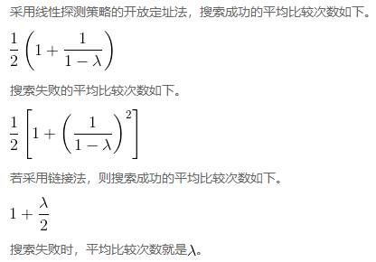

# 搜索算法分析

<!-- TOC -->

- [搜索算法分析](#搜索算法分析)
    - [设计思想](#设计思想)
        - [查找就是分类并选择](#查找就是分类并选择)
    - [顺序搜索](#顺序搜索)
        - [设计思想](#设计思想-1)
        - [列表未排序的情况](#列表未排序的情况)
        - [列表已排序的情况（假设升序）](#列表已排序的情况假设升序)
    - [二分搜索](#二分搜索)
        - [设计思想](#设计思想-2)
        - [复杂度](#复杂度)
        - [与顺序搜索的比较](#与顺序搜索的比较)
    - [散列](#散列)
        - [设计思想](#设计思想-3)
            - [碰撞和处理](#碰撞和处理)
        - [相关定义](#相关定义)
            - [槽](#槽)
            - [散列函数](#散列函数)
            - [载荷因子](#载荷因子)
        - [散列函数实现](#散列函数实现)
            - [折叠法](#折叠法)
            - [平方取中法](#平方取中法)
            - [基于字符的元素创建散列函数](#基于字符的元素创建散列函数)
        - [处理冲突](#处理冲突)
            - [线性探测方法](#线性探测方法)
                - [扩展线性探测](#扩展线性探测)
                - [平方探测](#平方探测)
            - [链接法方法](#链接法方法)
        - [实现映射抽象数据类型](#实现映射抽象数据类型)
            - [代码实现](#代码实现)
        - [分析散列搜索算法](#分析散列搜索算法)
    - [References](#references)

<!-- /TOC -->


## 设计思想
### 查找就是分类并选择
通过若干次分类，把查找范围缩小到很少，然后逐个比较。如果有时最后一步分类中，目标元素正好独占一类，就不用再比较了。


## 顺序搜索
1. 在分析搜索算法之前，需要定义计算的基本单元，这是解决此类问题的第一步。
2. 对于搜索来说，统计比较次数是有意义的。每一次比较只有两个结果：要么找到目标元素，要么没有找到。
3. 假设列表有 n 个元素。

### 设计思想
1. 基础版就是最机械的挨个比较，直到找到或者比较结束。
2. 先排序再比较的情况，其实和二分比较的思想是一样的：先分类再搜索，根据类的特征，可以很快的排除某些类。只不过二分搜索是把全员分成两类，而这里的排序顺序搜索就像是动态分类，在逐个比较的过程中，会不断试探那个分类的关键值，如果找到了那个关键值，就确定之后的元素都是一类，它们的共同特征是都比要找的元素大或者小。

### 列表未排序的情况
1. 考虑目标元素不存在于列表的情况，搜索算法必须要比较完每一个元素才能确定其不存在，所以这种情况下，比较次数只能是 n。
2. 再考虑目标元素存在于列表里的情况：
    * 运气最好的情况下，第一项就是目标元素，所以比较次数是 1；
    * 运气最差的情况下，最后一个才是目标元素，所以比较次数是 n；
    * 运气普通的情况下，目标元素位于列表中间，所以比较次数是 n/2。
3. 结果
    状态 | 最好 | 最坏 | 普通
    -- | -- | -- | --
    存在目标元素 | 1 | n | n/2
    不存在目标元素 | n | n | n

### 列表已排序的情况（假设升序）
1. 仍然先考虑目标元素不存在于列表里的情况：
    * 运气最好的情况下，第一项就比目标元素大，立刻知道目标元素不存在，这时比较次数是 1；
    * 运气最差的情况下，最后一项都比目标元素小，所以要比较到最后一个才知道目标元素不存在，这时比较次数是 n；
    * 运气普通的情况下，列表中间项比目标元素大，所以比较次数是 n/2。
2. 再考虑目标元素存在于列表里的情况，其实和未排序的情况一样，顺序并没有提供帮助。
3. 结果
    状态 | 最好 | 最坏 | 普通
    -- | -- | -- | --
    存在目标元素 | 1 | n | n/2
    不存在目标元素 | 1 | n | n/2


## 二分搜索
1. 最好的情况是要目标元素就在列表中间，只要一次比较就能找到元素。
2. 最坏的情况是目标元素位于头尾或者根本不存在，需要不断二分到只剩一个元素时才能比较确定。
3. 列表元素数量为 $n$ 时进行最坏的二分直到列表只剩一项，即需要满足 $\frac{n}{2^i} = 1$， $i$ 为二分比较次数。可得出 $i$ 的值为 $log_2 n$，也就是这种情况下的时间复杂度。

### 设计思想
1. 想想现实中的信息搜索，比如老式的图书馆方法检索，要搜索一本书时，要先知道它在哪个馆哪个架第几号，比如 “文学馆-F架-123号”。
2. 那么在实际的查找过程中，就是要先使用第一个维度的 “馆” 对整个图书馆的书分若干个大类，并在若干馆类里面找到文学馆。经过这一步的分类并选择正确的类，就从比如说全馆几万本书里面缩小范围到不到一万本了。
3. 然后使用第二个维度的 “架” 进行分类，并在文学馆的若干个架类里面找到 F 架；经过这个一步的分类并选择正确的类，目标范围就从不到一万本缩小为比如几百本了。
4. 现在我们来到了 F 架面前，虽然可能图书馆在这里不会再有分类了，但因为书的摆放是按顺序排好的，所以读者并不需要进行顺序搜索，肯定还是会跳跃性的查看序号，比如 23-95-145-132-126-125-124-123 这样，很快的找到 123 这本书。
5. 最后这一步其实也还是分类，从 23-95-145-132-126 这几步，每一步都是分为两类：“比 123 大” 的类 和 “比 123 小” 的类，然后选择正确的类（二分搜索）；最后的 126-125-124-123，因为范围已经很小了，已经不需要再分类了，只要使用顺序搜索一个个排查就行了。
6. 二分搜索也就是这样基础的分类思想。可以想象，如果数据的特征维度有更多，数据量更庞大的时候，还可以建立多级多维度的分类搜索。

### 复杂度
1. 二分查找是不断的平分分类然后选择正确的类，直到最后正确的类只有一个元素。（并不会想前面图书馆的例子里面最后会有小范围的顺序搜索）
2. 所以分类的次数就是要求：n 个元素不断的平分，几次后分出来的类别只有一个元素，即 $log_2 n$

### 与顺序搜索的比较
1. 尽管二分搜索通常优于顺序搜索，但当 n 较小时，排序引起的额外开销可能并不划算。
2. 实际上应该始终考虑，为了提高搜索效率，额外排序是否值得。如果排序一次后能够搜索多次，那么排序的开销不值一提。然而，对于大型列表而言，只排序一次也会有昂贵的计算成本，因此从头进行顺序搜索可能是更好的选择。


## 散列
1. 散列搜索算法尝试通过散列构建一个时间复杂度为 $O(1)$ 的数据结构。
2. 要做到这一点，需要了解更多关于元素位置的信息。如果每个元素都在它该在的位置上，那么搜索算法只需比较一次即可。
3. 不过，实际情况并非总是如此。

### 设计思想
1. 数据在保存的时候分类的越高效，则搜索的时候也就越高效。
2. 除了类似于图书分类法这样分层的、抽象属性分类方法以外，还有一大类分类方法就是按照数值范围分类的，比如按照名次分班。
3. 例如按照 50 人一个班来分，当你想找上次考试排 128 名的人，就应该去 3 班找。但除非 3 班是按照名次排座位，否则你去了3班还是要在 50 个人里面一个一个找，而不能快速定位。
4. 那么进一步，假设 10 人一班，这样你可以快速先定位到 13 班，在 13 班里只需要在 10 个人里面一个一个找，会快很多。
5. 最极端的情况是 1 个人一班，那么你只要定位到 128 班，就立刻找到了那个人，你在班里不用再找了。
6. 这时看起来找班级变成了低效的事情，但实际的情况是，班级都是按照顺序依次排列的，所以比如一层 10 班，128 班就在 13 层。
7. 在计算机中只要是按照顺序，那么寻址的速度还是高效的。
8. 所以如果能把客观的学生都映射到唯一的数字名次上，那么想找到一个名次的人就会很高效。

#### 碰撞和处理
1. 将学生映射为名次的话，显然就会出现成绩相同名次相同的情况。
2. 名次的情况，一般都是按照链接法来解决冲突，即并列第几名。把两个名次相同的学生排在一个班，这样找起来也是很方便的。
3. 当然也可以很变态的采用线性探测法，成绩一样的也名次递增，也是挨在一起的。
4. 归根结底都是让搜索时如果发现冲突可以很快的找到重复的元素。
5. 至于为了避免基础线性探测元素聚集而加入步长的情况，如果使用简单高效的步长计算方法，找到重复元素也不会明显的变慢。

### 相关定义
#### 槽
1. 散列表中的每个位置通常被称为 **槽**，其中可以存储一个元素。
2. 槽用一个从 0 开始的整数标记，例如 0 号槽、1 号槽、2 号槽，等等。
3. 初始情形下，散列表中没有元素，每个槽都是空的。

#### 散列函数
1. 散列函数将散列表中的元素与其所属位置对应起来。对散列表中的任一元素，散列函数返回一个介于 `0` 和 `槽长度-1` 之间的整数。
2. 假设有一个由整数元素 54、26、93、17、77 和 31 构成的集合及一个 11 个槽的散列表。
3. 首先来看第一个散列函数，它有时被称作 “取余函数”，即用一个元素除以散列表的大小，并将得到的余数作为散列值（`h(item) = item%11`）。取余函数是一个很常见的散列函数，这是因为结果必须在槽编号范围内。
4. 计算出散列值后，就可以将每个元素插入到相应的位置。
5. 搜索目标元素时，仅需使用散列函数计算出该元素的槽编号，并查看对应的槽中是否有值。
6. 因为计算散列值并找到相应位置所需的时间是固定的，所以搜索操作的时间复杂度是 $O(1)$。如果一切正常，那么我们就已经找到了常数阶的搜索算法。
7. 但只有当每个元素的散列值不同时，这个技巧才有用。如果两个元素的散列值相同这就有问题了。
8. 散列函数确实会将两个元素都放入同一个槽，这种情况被称作冲突，也叫 “碰撞”。需要其他方法解决碰撞问题，但时间复杂度就会有所增加。

#### 载荷因子
槽位占用率被称作载荷因子，记作 $λ$。

### 散列函数实现
1. 给定一个元素集合，能将每个元素映射到不同的槽，这种散列函数称作 **完美散列函数**。
2. 如果元素已知，并且集合不变，那么构建完美散列函数是可能的。不幸的是，给定任意一个元素集合，没有系统化方法来保证散列函数是完美的。所幸，不完美的散列函数也能有不错的性能。
3. 构建完美散列函数的一个方法是增大散列表，使之能容纳每一个元素，这样就能保证每个元素都有属于自己的槽。
4. 当元素个数少时，这个方法是可行的，不过当元素很多时，就不可行了。如果元素是 9 位的社会保障号，这个方法需要大约 10 亿个槽。如果只想存储一个班上 25 名学生的数据，这样做就会浪费极大的内存空间。
5. 我们的目标是创建这样一个散列函数：冲突数最少，计算方便，元素均匀分布于散列表中。有多种常见的方法来扩展取余函数，下面介绍其中的几种。
6. 你也许能想到多种计算散列值的其他方法。重要的是，散列函数一定要高效，以免它成为存储和搜索过程的负担。如果散列函数过于复杂，计算槽编号的工作量可能比在进行顺序搜索或二分搜索时的更大，这可不是散列的初衷。

#### 折叠法
1. 折叠法先将元素切成等长的部分（最后一部分的长度可能不同），然后将这些部分相加，得到散列值。
2. 假设元素是电话号码 436-555-4601，以 2 位为一组进行切分，得到 43、65、55、46 和 01。将这些数字相加后，得到 210。假设散列表有 11 个槽，接着需要用 210 除以 11，并保留余数 1。所以，电话号码 436-555-4601 被映射到散列表中的 1 号槽。
3. 有些折叠法更进一步，在加总前每隔一个数反转一次。就本例而言，反转后的结果是：43+56+55+64+01=219，219%11=10。

#### 平方取中法
1. 另一个构建散列函数的数学技巧是平方取中法：先将元素取平方，然后提取中间几位数。
2. 如果元素是 44，先计算 44^2=1936，然后提取中间两位 93，继续进行取余的步骤，得到 5（93%11）。

#### 基于字符的元素创建散列函数
1. 我们也可以为基于字符的元素（比如字符串）创建散列函数。可以将单词 “cat” 看作序数值序列:
    ```sh
    >>> ord('c')
    99
    >>> ord('a')
    97
    >>> ord('t')
    116
    ```
    因此，可以将这些序数值相加，并采用取余法得到散列值
2. 为字符串构建简单的散列函数
    ```py
    def hash(astring, tablesize):
        sum = 0
        for pos in range(len(astring)):
            sum = sum + ord(astring[pos])

        return sum%tablesize
    ```
3. 有趣的是，针对同素异序词，这个散列函数总是得到相同的散列值。要弥补这一点，可以用字符位置作为权重因子
    ```py
    def hash(astring, tablesize):
        sum = 0
        for pos in range(len(astring)):
            sum = sum + ord(astring[pos])*(pos+1)

        return sum%tablesize


    print(hash('cat', 11)) # 3
    print(hash('tac', 11)) # 2
    ```

### 处理冲突
1. 当两个元素被分到同一个槽中时，必须通过一种系统化方法在散列表中安置第二个元素。这个过程被称为处理冲突。
2. 前文说过，如果散列函数是完美的，冲突就永远不会发生。然而，这个前提往往不成立，因此处理冲突是散列计算的重点。

#### 线性探测方法
1. 注意，为了遍历散列表，可能需要往回检查第一个槽。也就是说一直找到散列表最后一个仍然没有空位，则循环到头部再检测。
2. 这个过程被称为开放定址法，它尝试在散列表中寻找下一个空槽或地址。由于是逐个访问槽，因此这个做法被称作线性探测。
3. 线性探测有个缺点，那就是会使散列表中的元素出现聚集现象。也就是说，如果一个槽发生太多冲突，线性探测会填满其附近的槽，而这会影响到后续插入的元素，有时要越过数个槽位才能找到一个空槽。

##### 扩展线性探测
1. 要避免元素聚集，一种方法是扩展线性探测，不再依次顺序查找空槽，而是跳过一些槽，这样做能使引起冲突的元素分布得更均匀。
2. 例如采用 “加3” 探测策略处理冲突后时，如果发生冲突时，为了找到空槽，该策略每次跳两个槽。
3. **再散列** 泛指在发生冲突后寻找另一个槽的过程。
4. 采用线性探测时，再散列函数是 `newhashvalue = rehash(oldhashvalue)`，并且 `rehash(pos) = (pos + 1)%sizeoftable`。“加3” 探测策略的再散列函数可以定义为 `rehash(pos) = (pos + 3)%sizeoftable`。
4. 也就是说，可以将再散列函数定义为 `rehash(pos) = (pos + skip)%sizeoftable`。
5. 注意，“跨步”（skip）的大小要能保证表中所有的槽最终都被访问到，否则就会浪费槽资源。要保证这一点，常常建议散列表的大小为素数 TODO 素数原理。

##### 平方探测
1. 平方探测是线性探测的一个变体，它不采用固定的跨步大小，而是通过再散列函数递增散列值。
2. 如果第一个散列值是 $h$，后续的散列值就是 $h+1$、$h+4$、$h+9$、$h+16$，等等。换句话说，平方探测的跨步大小是一系列完全平方数。
3. 例如集合 `[54, 26, 93, 17, 77, 31, 44, 55, 20]` 放入11槽位的散列表中：
    1. 77 计算散列值 $h$ 为 0，会先占据槽位 0；
    2. 之后 44 计算散列值 $h$ 也为 0，这时的 skip 为 1，所以占据槽位 1；
    3. 最后 55 计算散列值 $h$ 也为 0，这时的 skip 为 4，所以占据槽位 4；

#### 链接法方法
1. 另一种处理冲突的方法是让每个槽有一个指向元素集合（或链表）的引用。链接法允许散列表中的同一个位置上存在多个元素。发生冲突时，元素仍然被插入其散列值对应的槽中。
2. 不过，随着同一个位置上的元素越来越多，搜索变得越来越困难。
3. 搜索目标元素时，我们用散列函数算出它对应的槽编号。由于每个槽都有一个元素集合，因此需要再搜索一次，才能得知目标元素是否存在。
4. 链接法的优点是，平均算来，每个槽的元素不多，因此搜索可能更高效。

### 实现映射抽象数据类型
1. 使用字典的一大优势是，给定一个键，能很快找到其关联的值。
2. 为了提供这种快速查找能力，需要能支持高效搜索的实现方案。虽然可以使用列表进行顺序搜索或二分搜索，但用前面描述的散列表更好，这是因为散列搜索算法的时间复杂度可以达到 O(1)。

#### 代码实现
```py
class HashTable:
    def __init__(self):
        # 散列表的大小选用一个素数可以尽可能地提高冲突处理算法的效率。
        self.size = 11
        # 使用两个列表创建 HashTable 类，以此实现映射抽象数据类型。
        # 其中，名为 slots 的列表用于存储键，名为 data 的列表用于存储值。
        # 两个列表中的键与值一一对应。
        self.slots = [None] * self.size
        self.data = [None] * self.size

    # 除非键已经在 self.slots 中，否则总是可以分配一个空槽。
    # 该函数计算初始的散列值，如果对应的槽中已有元素，就循环运行 rehash 函数，直到遇见一个空槽。
    # 如果槽中已有这个键，就用新值替换旧值。
    def put(self, key, data):
        hashvalue = self.hashfunction(key, len(self.slots))

        if self.slots[hashvalue] == None:
            self.slots[hashvalue] = key
            self.data[hashvalue] = data
        else:
            if self.slots[hashvalue] == key:
                self.data[hashvalue] = data # 替换
            else:
                nextslot = self.rehash(hashvalue, len(self.slots))
                while self.slots[nextslot] != None and self.slots[nextslot] != key:
                    nextslot = self.rehash(nextslot, len(self.slots))

                if self.slots[nextslot] == None:
                    self.slots[nextslot] = key
                    self.data[nextslot] = data
                else:
                    self.data[nextslot] = data # 替换

    def get(self, key):
        startslot = self.hashfunction(key, len(self.slots))

        data = None
        stop = False
        found = False
        position = startslot
        while self.slots[position] != None and not found and not stop:
            if self.slots[position] == key: # 找到
                found = True
                data = self.data[position]
            else:
                position = self.rehash(position, len(self.slots)) # hash 值重复，再散列
                if position == startslot: # 循环一遍回到初始槽，说明已经检查完所有可能的槽
                    stop = True
        return data

    # 下面的两个内置方法允许该类使用中括号语法读取和设置
    def __getitem__(self, key):
        return self.get(key)

    def __setitem__(self, key, data):
        self.put(key, data)

    # 使用简单的取余散列函数
    def hashfunction(self, key, size):
        return key%size

    # 再散列函数使用 加1 方案
    def rehash(self, oldhash, size):
        return (oldhash + 1)%size


H = HashTable()
H[54] = "cat"
H[26] = "dog"
H[93] = "lion"
H[17] = "tiger"
H[77] = "bird"
H[31] = "cow"
H[44] = "goat"
H[55] = "pig"
H[20] = "chicken"
print(H.slots)
# [77, 44, 55, 20, 26, 93, 17, None, None, 31, 54]
print(H.data)
# ['bird', 'goat', 'pig', 'chicken', 'dog', 'lion', 'tiger', None, None, 'cow', 'cat']

print(H[20])
# 'chicken'
print(H[17])
# 'tiger'
H[20] = 'duck'
print(H[20])
# 'duck'
print(H.data)
# ['bird', 'goat', 'pig', 'duck', 'dog', 'lion', 'tiger', None, None, 'cow', 'cat']
print(H[99])
# None
```

### 分析散列搜索算法
1. 在最好情况下，散列搜索算法的时间复杂度是 O(1)，即常数阶。然而，因为可能发生冲突，所以比较次数通常不会这么简单。
2. 在分析散列表的使用情况时，最重要的信息就是载荷因子 $λ$。
3. 从概念上来说，如果 $λ$ 很小，那么发生冲突的概率就很小，元素也就很有可能各就各位。如果 $λ$ 很大，则意味着散列表很拥挤，发生冲突的概率也就很大。
4. 因此，冲突解决起来会更难，找到空槽所需的比较次数会更多。一个不错的经验规则是：一旦 $λ$ 大于 0.7，就调整散列表的长度。
5. 若采用链接法，冲突越多，每条链上的元素也越多。
6. 和之前一样，来看看搜索成功和搜索失败的情况 TODO
    


## References
* [《Python数据结构与算法分析（第2版）》](https://book.douban.com/subject/34785178/)
* [《算法图解》](https://book.douban.com/subject/26979890/)
