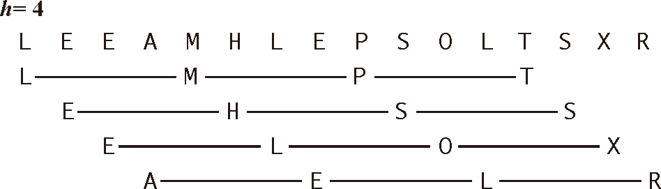

# ElementarySorts


<!-- TOC -->

- [ElementarySorts](#elementarysorts)
    - [Bubble sort](#bubble-sort)
    - [Selection Sort](#selection-sort)
        - [原理](#原理)
        - [实现](#实现)
        - [分析](#分析)
            - [时间复杂度](#时间复杂度)
            - [复杂度和输入无关](#复杂度和输入无关)
            - [数据移动是最少的](#数据移动是最少的)
    - [Insertion Sort](#insertion-sort)
        - [原理](#原理-1)
        - [实现](#实现-1)
        - [分析](#分析-1)
    - [Shell Sort](#shell-sort)
        - [原理](#原理-2)
        - [递增序列的确定及即 h 的递减](#递增序列的确定及即-h-的递减)
        - [实现](#实现-2)
        - [分析](#分析-2)

<!-- /TOC -->


## Bubble sort
1. [动画](https://www.programming-algorithms.net/article/39344/Bubble-sort)
2. 想象很多种不同密度的液体分层在一起，密度小的肯定要往上升，相对的密度大的就会下沉。最终，这些液体就会按照密度大小排好顺序。
3. 当然，在现实中上面的例子肯定是很多层液体一起运动的。但冒泡排序的算法是简化且变形的，体现在以下两点：
    * 即每次只有最底层的液体上升，而不是所有液体一起运动排序
    * 当该上升的液体遇到比它密度大的液体时，自然会发生位置交换，然后继续上升；但如果遇到一个比它密度还小的液体时，本轮运动并不会停下来，而是改为由那个密度更小的液体继续上升。这样就保证了，第一轮的运动会把密度最小的送到最顶层；第二轮运动会把剩下的密度最小的送到最顶层；以此类推，最终排好顺序。
4. 时间复杂度是`O(n^2)`级别的，具体为
    ```js
    function cost(len) {
        len--;
        return (1 + len) * len三+ len;
六 }
    ```
5. 看起来相比于真实的液体排序，这种简化版本的要慢。但是慢多少呢？以及，真实液体的排序要如何实现？


## Selection Sort
### 原理
1. [动画](https://www.programming-algorithms.net/article/39430/Selection-sort)
2. 比冒泡排序还要直观，每次从未排序的项里面选出最小的排到已排序队列里就行了。
3. 已排序队列可以是一个单独的数组，也可以使用原数组，即把每次找到的最小的值和未排序数组项的最左边一项交换位置。
4. 在现实中排一队人可能会使用一个新的队伍用来排已经排好的，也占不了多少地方。不过在程序中就没必要再占用内存开辟一个新数组，毕竟程序中可能会处理很大的数组。
5. 每次选择最小的过程，从思维映射到算法的建模过程比较有趣。如果直接让一个人从一堆数字里面选一个最小的，当数字的数量很少是，我觉得对普通人来说极限就是 5 个了，这时只要看一眼就能得出结果，快到都没法分析整个的思维过程。但如果数字的数量更大时，就可以看到明显的思维过程了：先看几个，找出一个最小的记住；然后再看其他的几个，找出最小的，和前一批中最小的相比，确定这两批里面最小的；记住这个最小的，然后再看下一批。全部看完后，把最小的排到第一个。

### 实现
```js
function selectionSort( arr ) {
    let len = arr.length;

    for ( let i=0; i<len-1; i++ ) {
        let minIndex = i;
        for ( let j=i+1; j<len; j++ ) {
            if ( arr[j] < arr[minIndex] ) {
                minIndex = j; 
            }
        }

        if ( minIndex !== i ) {
            swap(arr, i, minIndex);
        }
    }
    return arr;
}
```

### 分析
#### 时间复杂度
比较的次数是 $\frac{n(n-1)}{2}$，交换的次数最坏的情况下是 $n-1$。时间复杂度是 $O(n^2)$
```js
function cost(len) {
    len--;
    return (1 + len) * len / 2 + len;
}
```

#### 复杂度和输入无关
1. 为了找出最小的元素而扫描一遍数组并不能为下一遍扫描提供什么信息。
2. 这种性质在某些情况下是缺点，一个已经有序的数组或是主键全部相等的数组，和一个元素随机排列的数组所用的比较次数是一样的，而比较次数是该算法复杂度的决定因素。
3. 我们将会看到，其他算法会更善于利用输入的初始状态。

#### 数据移动是最少的
1. 每次交换都会改变两个数组元素的值，因此选择排序用了 $n-1$ 次交换——交换次数和数组的大小是线性关系。
2. 我们将研究的其他任何算法都不具备这个特征（大部分的增长数量级都是线性对数或是平方级别）。


## Insertion Sort
### 原理
1. [动画](https://www.programming-algorithms.net/article/39459/Insertion-sort)
2. 从左到右，依次把每个元素向左比较，排到比它小的第一个元素的右边。这样，在当前操作的元素左边的所有元素就是升序排列的了。

### 实现
1. 上面的动画里是先找到合适的位置，然后让中间的所有元素依次向右移动一个位置。按照这个思路，实现如下
    ```js
    function insertionSort( arr ) {
        let len = arr.length;

        for ( let i=1; i<len; i++ ) {
            let currItem = arr[i]; // 本轮比较要插入到合适位置的项
            let j = i;
            let prev = i-1; // 记录中间要移动的元素

            // 通过不断地向左比较，找到 currItem 合适的位置
            count_compare++; // 记录比较次数
            while ( j > 0 && currItem < arr[j-1] ) {
                count_compare++;  // 记录比较次数
                j--;
            }

            // 所有比 currItem 大的，依次右移一个位置
            while ( prev >= j ) {
                count_swap++;  // 记录交换次数
                arr[prev+1] = arr[prev];
                prev--;
            }

            // 这里本来是想通过判断，在值相同的情况下不用进行赋值操作
            // 但判断本身就是依次访问操作，里面还要再进行一次赋值操作，不如直接只进行一次赋值操作
            // if ( arr[j] !== currItem ) {
                count_swap++;  // 记录交换次数
                arr[j] = currItem;
            // }
        }
        
        return arr;
    }
    ```
2. 这个实现本身已经没什么问题了，不过如果愿意的话可以把两个 `while` 合并为一个，一边比较一边移动，而不是比较完之后再统一移动。两个方法在性能上是一样的，只是减少一点代码量然后省掉了变量 `prev` 而已
    ```js
    function insertionSort( arr ) {
        let len = arr.length;

        for ( let i=1; i<len; i++ ) {
            let currItem = arr[i];
            let j = i;

            // 依次和前面已排序的项比较
            // 如果比前一项小，则把前一项向后移动一位，前一项会空出来（为一个重复值）
            count_compare++;
            while ( j > 0 && currItem < arr[j-1] ) {
                count_compare++;
                count_swap++;
                arr[j] = arr[j-1];
                j--;
            }
            
            count_swap++;
            arr[j] = currItem;
        }

        return arr;
    }
    ```

### 分析
1. 相比于选择排序每次都要遍历剩下的所有项来选择最小的方式，插入排序在每次和左边已经排好的项比较时，并不需要和每一项比较，只需要找到一个比自己大的就可以停下来插入了。
2. 也就是说，相比于选择排序的效率不会因为数据而改变，选择排序的效率则会受到数据的明显影响。数据本身越有序，则插入排序需要比较的次数也就越少。
3. 在最好的情况下，也就是数据已经是按顺序排好的情况下，插入排序的比较根本不会进入 `while` 内部，因此比较次数和交换次数都是 $n-1$。$O(n)$ 级别。
4. 最坏的情况下，也就是数据完全逆序的情况下，`while` 为 `true` 的比较次数是 $\frac{n(n-1)}{2}$，所以 `while` 内部的交换也是 $\frac{n(n-1)}{2}$ 次；每轮 `for` 循环还有一次 `while` 为 `false` 的比较，以及一次最后的赋值交换；所以最坏情况下比较次数和交换次数都是 $\frac{(n-1)(n+2)}{2}$。$O(n^2)$ 级别。
5. 平均的情况下，一个元素移动的步数概率介于完全不用移动和移动到底之间（TODO，直觉是这样，书上也是这么说，但还需要证明一下），所以 `while` 内部的比较和交换是 $\frac{n(n-1)}{2}$ 次，再加上外面 $n-1$ 次的比较和交换，一共是 $\frac{(n-1)(n+4)}{4}$。也是 $O(n^2)$ 级别，不过大概是最坏情况下的一半。
6. 我们要考虑的更一般的情况是 **部分有序** 的数组。**倒置** 指的是数组中的两个顺序颠倒的元素。比如 E X A M P L E 中有 11 对倒置：E-A、X-A、X-M、X-P、X-L、X-E、M-L、M-E、P-L、P-E 以及 L-E。如果数组中倒置的数量小于数组大小的某个倍数，那么我们说这个数组是部分有序的。下面是几种典型的部分有序的数组：
    * 数组中每个元素距离它的最终位置都不远；
    * 一个有序的大数组接一个小数组；
    * 数组中只有几个元素的位置不正确。
7. 事实上，当顺序倒置的数量很少时，插入排序很可能比常见的其他任何算法都要快。因此插入排序对于实际应用中常见的某些类型的非随机数组很有效。
8. 插入排序中 `while` 循环的次数等于数组中倒置的数量。
9. 总的来说，插入排序对于部分有序的数组十分高效，也很适合小规模数组。这很重要，因为这些类型的数组在实际应用中经常出现，而且它们也是高级排序算法的中间过程。


## Shell Sort
1. 希尔排序为了加快速度简单地改进了插入排序，交换不相邻的元素以对数组的局部进行排序，并最终用插入排序将局部有序的数组排序。

### 原理
1. 希尔排序的思想是使数组中任意间隔为 h 的元素都是有序的。这样的数组被称为 **h 有序数组**。换句话说，一个 h 有序数组就是 h 个互相独立的有序数组编织在一起组成的一个数组。
    
2. 在进行排序时，如果 h 很大，我们就能将元素移动到很远的地方，为实现更小的 h 有序创造方便。用这种方式，对于任意以 1 结尾的 h 序列，我们都能够将数组排序。
3. 以 10 项数组为例，h 分别为 5、2、1
4. h 为 5 时，跨度为 5 的选取同组项。因为跨度很大，很快就跨过了整个数组，所以一组内的数量很少，只有两个。也就是说把整个数组分为了五个子数组。
5. 下面要分别对这五个子数组进行插入排序。排序结束后，数组的整体有序性得到了一些提升。
6. 然后再使用 h 为 2 对整体数组进行分组，分为两个子组。再对这两个子数组分别进行插入排序。数组的有序性进一步提升。最后是 h 为 1，也就是普通的插入排序，因为数组已经很有序，所以排序的效率也会很高。
    

### 递增序列的确定及即 h 的递减
1. 为了选定初始的 h，我们需要通过一个递增的序列来确定。我们把这个序列称为 **递增序列**。
2. 下面的算法中，将使用 $\frac{3^k-1}{2}$ 这个递增序列，其中 $k = 1, 2, 3...$。因此该序列为 $1, 4, 13, 40, 121, 364, 1093, ...$，其中 $1$ 为序列初始值。
3. 在确定了该序列后，通过下面的循环来确定 h 的初始值
    ```js
    while (h < N/3) {
        h = 3*h + 1
    }
    ```
4. 例如，如果数组项 `N` 为 100，那 h 的初始值就是 40。
5. 然后在排序的过程中，h 再以以下的序列递减
    ```js
    h = Math.floor( h/3 );
    ```
5. 上面是我们这里选择的递增序列。但是，在不同的情况下如何选择合适递增序列呢？要回答这个问题并不简单。算法的性能不仅取决于 h，还取决于 h 之间的数学性质，比如它们的公因子等。
6. 有很多论文研究了各种不同的递增序列，但都无法证明某个序列是 “最好的”。上面简单的递增序列和其他复杂递增序列的性能接近，但可以证明复杂的序列在最坏情况下的性能要好于我们所使用的递增序列。更加优秀的递增序列有待我们去发现。
7. 在实际应用中，上面的递增序列基本就足够了。
8. 使用递增序列 $1, 4, 13, 40, 121, 364…$ 的希尔排序所需的比较次数不会超出 N 的若干倍乘以递增序列的长度。大量的实验证明平均每个增幅所带来的比较次数约为 $N^{1/5}$，但只有在 N 很大的时候这个增长幅度才会变得明显。这个性质似乎也和输入模型无关。

### 实现
1. 想想插入排序的规则，当对一个数组进行排序时，开始时是选取数组的第二项，而不是第一项。所以下面第二层 `for` 循环时的 `i` 设定为 h 值，正好是第一个子数组的第二项。之后 `i` 递增，是第二个子数组的第二项。以此类推。
2. 与直接插入排序不同的是，这里进行插入排序的是以 h 为间距分散开的数组，所以在 `while` 循环中，当前项的前一项不是减 1 而是减去 h。
    ```js
    function shellSort( arr ) {
        let len = arr.length;
        let h = 1;
        while ( h < len/3 ) {
            h = 3*h + 1;
        }

        // 外层的 for 循环每次都使用一个 h 来对数组进行分组
        // 每一次的 h 都比前一次的小，因此分的组数会越来越少，每组的元素会越来越多
        // （同时每组里面也会越来越有序） 
        for ( ; h > 0; h = Math.floor(h / 3) ) {
            // 下面这个 for 循环就是插入排序，只不过向左比较的步幅不是 1 而是 h
            for ( let i = h; i < len; i++ ) {
                let currItem = arr[i];
                let j = i;

                while ( j - h >= 0 && currItem < arr[j - h] ) {
                    arr[j] = arr[j - h];
                    j = j - h;
                }
                arr[j] = currItem;
            }
        }
        return arr;
    }
    ```
3. 需要注意的是，这里比如当 h 为 2 时，整体数组分成两个 5 项子数组后进行插入排序时，并不是排完了第一个子数组再排第二个子数组，而是两个子数组一个排一步。步骤如下：
    1. 第一个子数组先用其第二项（整体数组第三项）往前比较，然后第二个数组用其第二项（整体数组第四项）往前比较；
    2. 第一个子数组先用其第三项（整体数组第五项）往前比较，然后第二个数组用其第三项（整体数组第六项）往前比较；
    3. 第一个子数组先用其第四项（整体数组第七项）往前比较，然后第二个数组用其第四项（整体数组第八项）往前比较；
    4. 第一个子数组先用其第五项（整体数组第九项）往前比较，然后第二个数组用其第五项（整体数组第十项）往前比较。

### 分析
1. 希尔排序更高效的原因是它权衡了子数组的规模和有序性。
2. 和 quick sort 的思路有些像，都是不断地粗糙但是快速的使数组大体上更有序，以降低之后排序的时间消耗。
3. 根据插入排序的算法分析，希尔排序在数组有序性比较差的时候，将其分为很多个子数组，每个子数组都比较小，使用插入排序效率就比较高；之后分组的子数组越来越大，但有序性会越来越高，所以仍然可以保证较高的插入排序效率。
4. 和选择排序以及插入排序形成对比的是，希尔排序也可以用于大型数组。它对任意排序（不一定是随机的）的数组表现也很好。实际上，对于一个给定的递增序列，构造一个使希尔排序运行缓慢的数组并不容易。
5. 希尔排序比插入排序和选择排序要快得多，并且数组越大，优势越大。
6. 研究希尔排序性能需要的数学论证超出了这里的范围。至于性能，目前最重要的结论是它的运行时间达不到平方级别。例如，已知在最坏的情况下，比较次数和 $N^{3/2}$ 成正比。
7. 在输入随机排序数组的情况下，我们在数学上还不知道希尔排序所需要的平均比较次数。人们发明了很多递增序列来渐进式地改进最坏情况下所需的比较次数（N^{4/3},~N^{5/4},~N^{6/5}\cdots），但这些结论大多只有学术意义，因为对于实际应用中的 N 来说它们的递增序列的生成函数（以及与 N 乘以一个常数因子）之间的区别并不明显。
8. 透彻理解希尔排序的性能至今仍然是一项挑战。实际上，该算法是我们唯一无法准确描述其对于乱序的数组的性能特征的排序方法。 
9. 有经验的程序员有时会选择希尔排序，因为对于中等大小的数组它的运行时间是可以接受的。它的代码量很小，且不需要使用额外的内存空间。在下面的几节中我们会看到更加高效的算法，但除了对于很大的 N，它们可能只会比希尔排序快两倍（可能还达不到），而且更复杂。如果你需要解决一个排序问题而又没有系统排序函数可用（例如直接接触硬件或是运行于嵌入式系统中的代码），可以先用希尔排序，然后再考虑是否值得将它替换为更加复杂的排序算法。


* [算法（第4版）](https://book.douban.com/subject/19952400/)
* [学习JavaScript数据结构与算法](https://book.douban.com/subject/26639401/)
* [图解排序算法(二)之希尔排序](https://www.cnblogs.com/chengxiao/p/6104371.html)