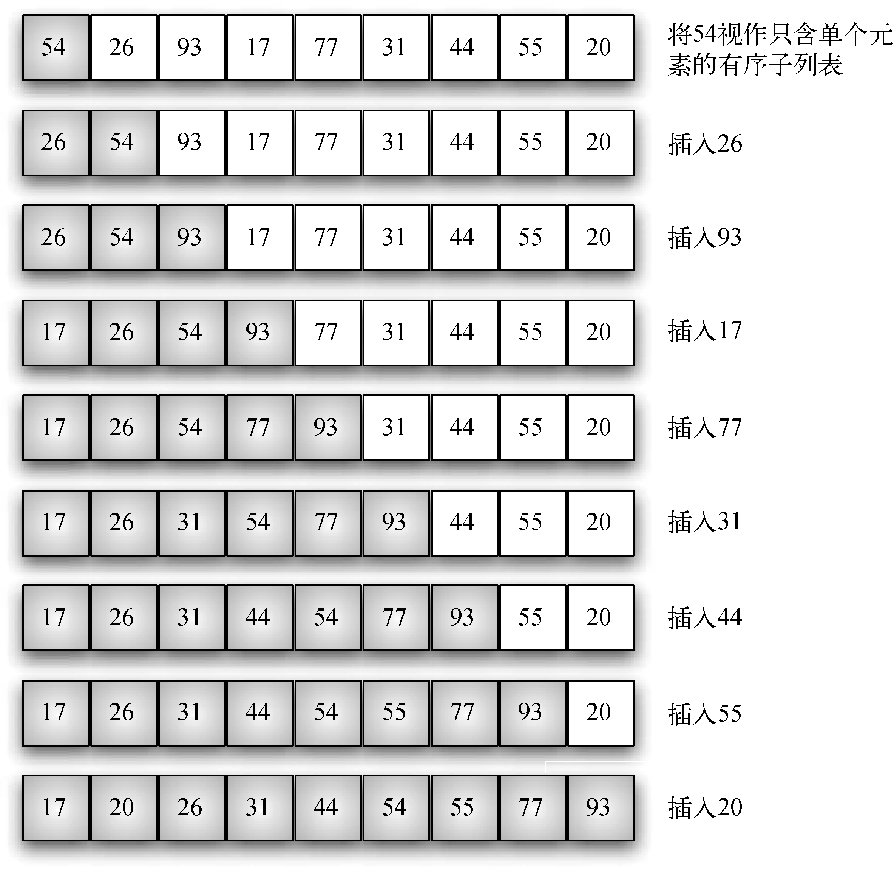
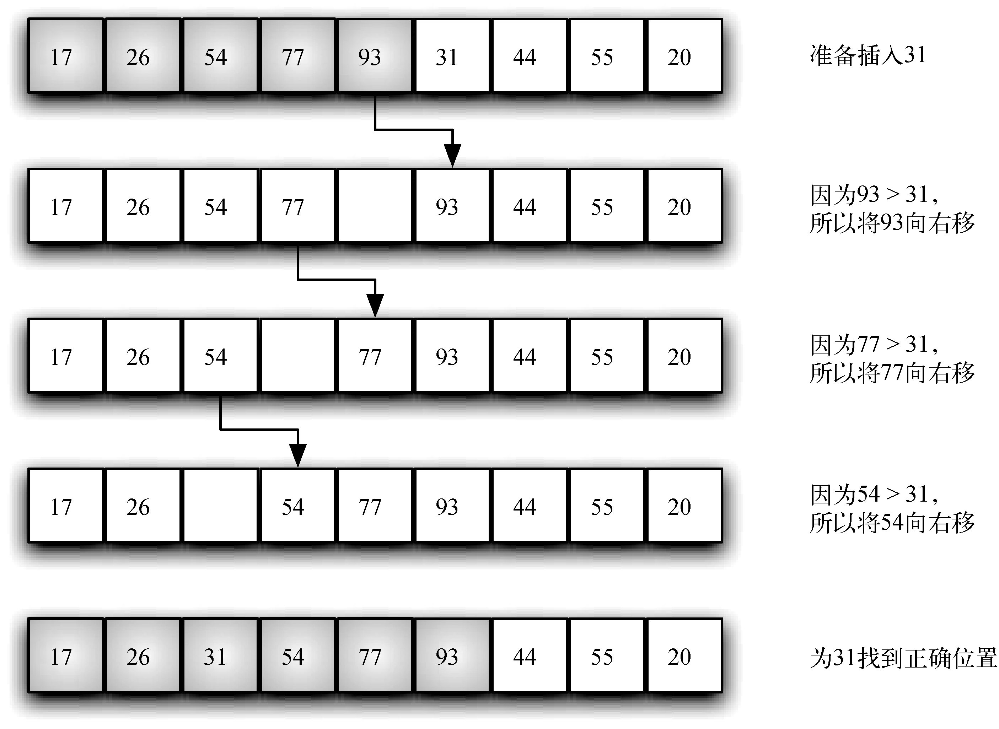

# ElementarySorts


<!-- TOC -->

- [ElementarySorts](#elementarysorts)
    - [设计细节](#设计细节)
        - [进行稍复杂的操作就可以考虑先检查有没有必要](#进行稍复杂的操作就可以考虑先检查有没有必要)
    - [最简单的排序](#最简单的排序)
        - [设计思想](#设计思想)
    - [Selection Sort](#selection-sort)
        - [原理](#原理)
        - [设计思想](#设计思想-1)
        - [实现](#实现)
        - [分析](#分析)
            - [时间复杂度](#时间复杂度)
            - [复杂度和输入无关](#复杂度和输入无关)
            - [数据移动是最少的](#数据移动是最少的)
    - [Bubble Sort](#bubble-sort)
        - [设计思想](#设计思想-2)
        - [逻辑](#逻辑)
    - [Insertion Sort](#insertion-sort)
        - [设计思想](#设计思想-3)
        - [思路](#思路)
            - [原址排序](#原址排序)
            - [循环不变式](#循环不变式)
        - [实现](#实现-1)
        - [分析](#分析-1)
        - [练习](#练习)
            - [《算法导论》2.1-4](#算法导论21-4)
    - [Shell Sort](#shell-sort)
        - [设计思想](#设计思想-4)
            - [宏观预处理——先宏观整体处理再微观精细处理](#宏观预处理先宏观整体处理再微观精细处理)
            - [权衡](#权衡)
        - [原理](#原理-1)
        - [递增序列的确定及即 h 的递减](#递增序列的确定及即-h-的递减)
        - [实现](#实现-2)
        - [分析](#分析-2)
    - [References](#references)

<!-- /TOC -->


## 设计细节
### 进行稍复杂的操作就可以考虑先检查有没有必要
1. 插入排序每轮比较完之后的插入操作，并不总是必要的。如果实际上并没有发生交换，那这一步的交换就是多余的数组写入操作。
2. 因此可以在比较前先通过索引判断一下是否发生了交换。
3. 不过也要考虑，如果大多数情况下都发生了交换，那么索引判断在大多数时候就是多余的了。因此需要权衡到底那种情况效率更高。


## 最简单的排序
1. 在日常生活中，当排序数量不是很多的情况下，比如给班级的学生排名次，我们会很自然的使用的方法，就是每次都挑出来列表里最大的元素，然后排到结果列表里面
    ```py
    def easiestSort (list):
        count_compare = 0
        count_swap = 0

        result = []

        while len(list) > 1:
            maxIndex = 0
            for index in range(1, len(list)):
                count_compare += 1
                if list[index] > list[maxIndex]:
                    maxIndex = index
            
            count_swap += 1
            popped = list.pop(maxIndex)
            result.append(popped)

        result.append(list[0])

        print('count_compare', count_compare) # 36
        print('count_swap', count_swap) # 8
        return result

    list = [54, 26, 93, 17, 77, 31, 44, 55, 20]
    res = easiestSort(list)
    print(res)
    ```
2. 选择排序其实就是这样的思路，唯一不同的就是选择排序没有单独的结果列表，而是直接把结果放在原数组。
3. 这种思路要比冒泡排序更好理解啊。

### 设计思想
1. 在排序前，我们心中会想象出结果数组的样子：排第一的是最大的、排第二的是第二大的，以此类推。
2. 排序时，我们就按照想象中结果数组数组项的样子去当前数组里寻找。先找最大的、再找第二大的，以此类推。
3. 完全按照结果明确的样子去执行。


## Selection Sort
### 原理
1. [动画](https://www.programming-algorithms.net/article/39430/Selection-sort)
2. 比冒泡排序还要直观，每次从未排序的项里面选出最小的排到已排序队列里就行了。
3. 已排序队列可以是一个单独的数组，也可以使用原数组，即把每次找到的最小的值和未排序数组项的最左边一项交换位置。
4. 在现实中排一队人可能会使用一个新的队伍用来排已经排好的，也占不了多少地方。不过在程序中就没必要再占用内存开辟一个新数组，毕竟程序中可能会处理很大的数组。
5. 每次选择最小的过程，从思维映射到算法的建模过程比较有趣。如果直接让一个人从一堆数字里面选一个最小的，当数字的数量很少时，我觉得对普通人来说极限就是 5 个了，这时只要看一眼就能得出结果，快到都没法分析整个的思维过程。但如果数字的数量更大时，就可以看到明显的思维过程了：先看几个，找出一个最小的记住；然后再看其他的几个，找出最小的，和前一批中最小的相比，确定这两批里面最小的；记住这个最小的，然后再看下一批。全部看完后，把最小的排到第一个。

### 设计思想
和上面最简单的排序方法是一样的。

### 实现
1. 初步实现
    ```js
    function swap(arr, index1, index2) {
        let aux = arr[index1];
        arr[index1] = arr[index2];
        arr[index2] = aux;
    }

    function selectionSort( arr ) {
        let len = arr.length;

        for ( let i=0; i<len-1; i++ ) {
            let minIndex = i;
            for ( let j=i+1; j<len; j++ ) {
                if ( arr[j] < arr[minIndex] ) {
                    minIndex = j; 
                }
            }

            if ( minIndex !== i ) {
                swap(arr, i, minIndex);
            }
        }
    }
    ```
2. `if ( arr[j] < arr[minIndex] )` 中的 `arr[minIndex]` 会随着每次内层循环都进行重复的读数组的操作？编译器之类的可能会有类似于缓存之类优化，如果没有的话，可以在内层循环外面将它的值保存到一个变量里
    ```js
    function select_sort (arr) {
        let size = arr.length;
        let minVal;
        let minIdx;
        for (let i=0; i<size-1; i++) {
            minVal = arr[i];
            minIdx = i;
            for (let j=i+1; j<size; j++) {
                if (arr[j] < minVal) {
                    minVal = arr[j];
                    minIdx = j;
                }
            }
            if (minIdx !== i) {
                swap(arr, minIdx, i);
            }
        }
    }
    ```

### 分析
#### 时间复杂度
1. 比较的次数是 $\frac{n(n-1)}{2}$，交换的次数最坏的情况下是 $n-1$。时间复杂度是 $O(n^2)$
    ```js
    function cost(len) {
        len--;
        return (1 + len) * len / 2 + len;
    }
    ```
2. 使用《算法导论》的逐行分析法
    ```js
    function selectionSort( arr ) {
        let len = arr.length;                        // c1   1

        for ( let i=0; i<len-1; i++ ) {              // c2   n
            let minIndex = i;                        // c3   n-1
            for ( let j=i+1; j<len; j++ ) {          // c4   (n+2)*(n-1)/2
                if ( arr[j] < arr[minIndex] ) {      // c5   ((n-1)+1)*(n-1)/2
                    minIndex = j;                    // c6   设为 x，最坏是 c5 的次数；最好是 0
                }
            }

            if ( minIndex !== i ) {                  // c7   n-1
                swap(arr, i, minIndex);              // c8   设为 y，最坏是 c7 的次数，
                                                    //        但因为 swap 函数面有 3 行， 
                                                    //        所以最坏是 c7 次数的 3倍；最好是 0
            }
        }
    }
    ```
    加总算下来最坏和最好都是 $an^2 + bn + c$。

#### 复杂度和输入无关
1. 为了找出最小的元素而扫描一遍数组并不能为下一遍扫描提供什么信息，每次都要遍历剩下的所有元素。
2. 这种性质在某些情况下是缺点，一个已经有序的数组或是主键全部相等的数组，和一个元素随机排列的数组所用的比较次数是一样的，而比较次数是该算法复杂度的决定因素。
3. 我们将会看到，其他算法会更善于利用输入的初始状态。

#### 数据移动是最少的
1. 每次交换都会改变两个数组元素的值，因此选择排序用了 $n-1$ 次交换——交换次数和数组的大小是线性关系。
2. 我们将研究的其他任何算法都不具备这个特征（大部分的增长数量级都是线性对数或是平方级别）。


## Bubble Sort
### 设计思想
1. 看看这个 [动画效果](https://www.programming-algorithms.net/article/39344/Bubble-sort)
2. 整体的思路和选择排序是一样的：先选出第一小的，再选出第二小的、再选出第三小的，以此类推。
4. 每轮怎么选出最小的思路看起来和选择排序不一样，但其实 **本质上也是像选择排序一样，先确定一个当前最小的，然后不断比较再不断确定当前最小的**。
5. 考虑下面一轮的降序（每轮选择最小的）冒泡：
    ```
    (3 2 8 7 6)
    (3 2 8 7 6)
    (3 8 2 7 6)
    (3 8 7 2 6)
    (3 8 7 6 2)
    ```
    1. 第一次 3 2 比较时，就是在两个里面选择了一个最小的 2，这个是当前最小的。
    2. 和选择排序一样，下一步是要用当前最小的 2 和新元素 8 比较，最小的依然是 2。
    3. 下一步同样用 2 和新元素 7 比较，最小的依然是 2。
    4. 最后一步依然用 2 和新元素 6 比较，最小的依然是 2，2 就是这一轮里最小的。
    5. 这一轮排序完成。
6. 虽然和选择排序本质上一样，但是这里的比较还多余出来了交换的步骤。选择排序是比较的时候只比较，一轮比较完成之后再直接把最小的放到最终的位置上；而冒泡排序是比较的时候就直接移动最小元素，边比较边移动。
7. 想象前面老师排名次的例子，这里可以想象成体育老师排身高的例子，老师希望一队学生按照大小个排好顺序，并且这一队学生的身高差别都很小，不是很容易一眼看出来谁高谁低，要背靠背站好自己比较才行。
8. 所以老师只能先从对位的两个人背靠背比较，然后找出比较矮的那个再背靠背和第三个人比较，这次比较中比较小的再和第四个背靠背比较。这个过程就是最矮的人不断交换冒泡的过程了。
9. 可以看出来，大多数情况下，相比于选择排序，这种不断交换的过程是没有必要的。

### 逻辑
1. 可以看到对于 n 个元素的列表，第一轮需要比较 n-1 次，最后一轮需要比较 1 次，所以总的比较次数是`(n-1 + 1)*(n-1)/2 = (n)*(n-1)/2`次，是二次方时间复杂度。
    ```py
    def swap(list, i, j):
        list[i], list[j] =  list[j], list[i]

    def bubbleSort (list):
        count_compare = 0
        count_swap = 0
        length = len(list)
        
        for index in range(length):
            for inner_index in range(0, length-index-1):
                count_compare += 1
                if list[inner_index] > list[inner_index+1]:
                    swap(list, inner_index, inner_index+1)
                    count_swap += 1
                    
        print('count_compare', count_compare) # 36
        print('count_swap', count_swap) # 20

    list = [54, 26, 93, 17, 77, 31, 44, 55, 20]
    bubbleSort(list)
    ```
    ```js
    function bubbleSort ( arr ) {
        let len = arr.length;

        for ( let i=len-1; i>0; i-- ) {
            for ( let j=0; j<i; j++ ) {
                if ( arr[j] > arr[j+1] ) {
                    swap(arr, j, j+1);
                }
            }
        }
    }
    ```
2. 冒泡排序通常被认为是效率最低的排序算法，因为在确定最终的位置前必须交换元素。多余的交换操作代价很大。
3. 不过，由于冒泡排序要遍历列表中未排序的部分，因此它具有其他排序算法没有的用途。特别是，如果在一轮遍历中没有发生元素交换，就可以确定列表已经有序。
4. 可以修改冒泡排序函数，使其在遇到这种情况时提前终止。对于只需要遍历几次的列表，冒泡排序可能有优势，因为它能判断出有序列表并终止排序过程。这种排序通常被称作 **短冒泡**。
    ```py
    def shortBubbleSort (list):
        count_compare = 0
        count_swap = 0
        length = len(list)
        exchanged = False
        
        for index in range(length):
            for inner_index in range(0, length-index-1):
                count_compare += 1
                if list[inner_index] > list[inner_index+1]:
                    swap(list, inner_index, inner_index+1)
                    count_swap += 1
                    exchanged = True

            if exchanged == False:
                print('count_compare1', count_compare) # 8
                print('count_swap', count_swap) # 0
                return
            else:
                exchanged = False    

        print('count_compare', count_compare)
        print('count_swap', count_swap)


    list = [1, 2, 3, 4, 5, 6, 7, 8, 9]
    shortBubbleSort(list)
    ```


## Insertion Sort
### 设计思想
1. 插入排序在向结果列表中插值的思路和冒泡排序、选择排序不同。《算法导论》中扑克牌揭牌的例子很形象的说明了插入排序，只是需要注意因为这里要进行原址排序，所以可以说手上的牌和桌上的排都在同一个数组里。
2. 后两者都是按照 “第一、第二、第三……” 这样的既定顺序寻找并插入元素的，所以每轮都会选择当前的最大值。
3. 插入排序并不在乎按照既定顺序选择待排序元素，所以每轮选择值可以随意选择，当然最方便的就是选择第一个值。
4. 但是因为不是按照既定顺序选择，所以向结果列表中插值时就不能像冒泡排序、选择排序那样直接 push，而是要在插值的时候进行排序。
5. 也就是说，冒泡排序、选择排序是在选择阶段进行排序的，而插入排序是在插入阶段进行排序的。
6. 因为结果列表是排好序的，所以往里面插值的逻辑比较简单，就是依次找到合适的位置插入。
7. 可以想象，列表项很多时，往里面插值还可以用到比如二分搜索之类的高效搜索方法找到位置，而不用一个接一个的比较。
8. [动画](https://www.programming-algorithms.net/article/39459/Insertion-sort)。

### 思路
#### 原址排序
1. 在数组中重排这些数，在任何时候，最多只有常数个数字存储在数组外。
2. 从《算法导论》第 10 页的伪代码看，每次 `for` 循环只有一个当前待排序的数保存在变量 `key` 中。

#### 循环不变式
1. 参考《算法导论》第 10 页的伪代码，元素 $A[1..(j-1)]$ 就是 **原来** 在位置 $1$ 到 $j-1$ 的元素，但现在已排序。
2. 我们把 $A[1..(j-1)]$ 的这些性质形式的表示为一个 **循环不变式**。直接看《算法导论》第 10 页的讲解。
3. $A[1..(j-1)]$ 可以原地排序，那整个数组也就可以原地排序。

### 实现
1. 基本排序逻辑
    
    
2. 实现：
    ```cpp
    void insertion_sort (int* arr, int startIdx, int endIdx) {
        for (int i = startIdx + 1; i <= endIdx; i++) { // 因为要和左边的比较，所以是从第二个开始
            int j = i - 1; // 用 j 来遍历左边待比较的元素
            int curr = arr[i]; // curr 依次和左边的元素进行比较
            while (j >= 0 && curr < arr[j]) { // 如果小于左边的元素并且还没有到头，
                arr[j+1] = arr[j];
                j--;
            }
            arr[j+1] = curr; // 没比过 arr[j]，所以要放到 arr[j] 的右边
        }
    }
    ```

### 分析
0. 《算法导论》14-16 页很详细且精确的分析了插入排序的复杂度，并给出了复杂度分析的通用模式，务必仔细看。

### 练习
#### 《算法导论》2.1-4
```js
function foo (a, b) {
    let len = a.length;
    let c = [];
    let isCarry = 0; // 是否进位
    // 从个位数开始计算，数组最后一项视为个位
    for (let i=len-1; i>=0; i--) {
        // 因为 c 数组多了一位，所以是 c[i+1]
        c[i+1] = (a[i] + b[i] + isCarry) % 2;
        isCarry = Number(a[i] + b[i] + isCarry >= 2);
    }
    c[0] = isCarry;
    return c;
}

let a = [1, 0, 0, 1, 1, 0];
let b = [1, 1, 0, 0, 1, 1];
let c = foo(a, b);
console.log(c); // [1, 0, 1, 1, 0, 0, 1]
```


## Shell Sort
### 设计思想
#### 宏观预处理——先宏观整体处理再微观精细处理
1. 插入排序的每一轮其实都是精准的按顺序排序。但正是这种精确性的追求，也是它低效的原因，因为比较的时候元素都是老老实实的一个一个相邻的依次比较和移动。
2. 而希尔排序的每一轮都只是在使得数组在整体上大概的有序。大致的有序虽然在开始的时候鱼龙混杂，但是这种大致的处理是很节省资源的，并且为后面的精细化处理奠定了基础。
3. 希尔排序更高效的原因是它权衡了子数组的规模和有序性。排序之初，各个子数组都很短，排序之后子数组都是部分有序的，这两种情况都很适合插入排序。

#### 权衡
1. 就像开发一款产品时的两种思路。一种是一开始就慢工出细活打造精品，一鸣惊人；另一种是开始先做一个能用的，后期再慢慢打磨。
2. 两种思路肯定都有各自的优势，需要根据具体情况具体抉择。希尔排序也不是在所有时候都比直接使用插入排序更高效。

### 原理
1. 希尔排序的思想是使数组中任意间隔为 h 的元素都是有序的。这样的数组被称为 **h 有序数组**。换句话说，一个 h 有序数组就是 h 个互相独立的有序数组编织在一起组成的一个数组。
    
2. 在进行排序时，如果 h 很大，我们就能将元素移动到很远的地方，为实现更小的 h 有序创造方便。用这种方式，对于任意以 1 结尾的 h 序列，我们都能够将数组排序。
3. 以 10 项数组为例，h 分别为 5、2、1
4. h 为 5 时，跨度为 5 的选取同组项。因为跨度很大，很快就跨过了整个数组，所以一组内的数量很少，只有两个。也就是说把整个数组分为了五个子数组。
5. 下面要分别对这五个子数组进行插入排序。排序结束后，数组的整体有序性得到了一些提升。
6. 然后再使用 h 为 2 对整体数组进行分组，分为两个子组。再对这两个子数组分别进行插入排序。数组的有序性进一步提升。最后是 h 为 1，也就是普通的插入排序，因为数组已经很有序，所以排序的效率也会很高。
    

### 递增序列的确定及即 h 的递减
1. 为了选定初始的 h，我们需要通过一个递增的序列来确定。我们把这个序列称为 **递增序列**。
2. 下面的算法中，将使用 $\frac{3^k-1}{2}$ 这个递增序列，其中 $k = 1, 2, 3...$。因此该序列为 $1, 4, 13, 40, 121, 364, 1093, ...$，即 $h = 3*h + 1$ 的递增，其中 $1$ 为序列初始值。
3. 在确定了该序列后，通过下面的循环来确定 h 的初始值
    ```js
    while (h < N/3) {
        h = 3*h + 1
    }
    ```
4. 例如，如果数组项 `N` 为 100，那 h 的初始值就是 40。
5. 然后在排序的过程中，h 再以以下的序列递减
    ```js
    h = Math.floor( h/3 );
    ```
5. 上面是我们这里选择的递增序列。但是，在不同的情况下如何选择合适递增序列呢？要回答这个问题并不简单。算法的性能不仅取决于 h，还取决于 h 之间的数学性质，比如它们的公因子等。
6. 有很多论文研究了各种不同的递增序列，但都无法证明某个序列是 “最好的”。上面简单的递增序列和其他复杂递增序列的性能接近，但可以证明复杂的序列在最坏情况下的性能要好于我们所使用的递增序列。更加优秀的递增序列有待我们去发现。
7. 在实际应用中，上面的递增序列基本就足够了。
8. 使用递增序列 $1, 4, 13, 40, 121, 364…$ 的希尔排序所需的比较次数不会超出 N 的若干倍乘以递增序列的长度。大量的实验证明平均每个增幅所带来的比较次数约为 $N^{1/5}$，但只有在 N 很大的时候这个增长幅度才会变得明显。这个性质似乎也和输入模型无关。

### 实现
1. 想想插入排序的规则，当对一个数组进行排序时，开始时是选取数组的第二项，而不是第一项。所以下面第二层 `for` 循环时的 `i` 设定为 h 值，正好是第一个子数组的第二项。之后 `i` 递增，是第二个子数组的第二项。以此类推。
2. 与直接插入排序不同的是，这里进行插入排序的是以 h 为间距分散开的数组，所以在 `while` 循环中，当前项的前一项不是减 1 而是减去 h。
    ```js
    function shellSort( arr ) {
        let len = arr.length;
        let h = 1;
        while ( h < len/3 ) {
            h = 3*h + 1;
        }

        // 外层的 for 循环每次都使用一个 h 来对数组进行分组
        // 每一次的 h 都比前一次的小，因此分的组数会越来越少，每组的元素会越来越多
        // 同时每组里面也会越来越有序
        for ( ; h > 0; h = Math.floor(h / 3) ) {
            // arr[h] 到 arr[2h-1] 是所有子数组第二项，
            // arr[2h] 到 arr[3h-1] 是所有子数组第三项，以此类推。
            for ( let i = h; i < len; i++ ) {
                let currItem = arr[i];
                let j = i;
            
                // while 循环就是具体的比较，只不过向左比较的步幅不是 1 而是 h
                while ( j - h >= 0 && currItem < arr[j - h] ) {
                    arr[j] = arr[j - h];
                    j = j - h;
                }
                arr[j] = currItem;
            }
        }
    }
    ```
3. 需要注意的是，这里比如当整体数组分成两个 5 项的子数组后，进行插入排序时，并不是排完了第一个子数组再排第二个子数组，而是两个子数组一个排一步。步骤如下：
    1. 第一个子数组先用其第二项（整体数组第三项）往前比较，然后第二个数组用其第二项（整体数组第四项）往前比较；
    2. 第一个子数组先用其第三项（整体数组第五项）往前比较，然后第二个数组用其第三项（整体数组第六项）往前比较；
    3. 第一个子数组先用其第四项（整体数组第七项）往前比较，然后第二个数组用其第四项（整体数组第八项）往前比较；
    4. 第一个子数组先用其第五项（整体数组第九项）往前比较，然后第二个数组用其第五项（整体数组第十项）往前比较。

### 分析
1. 希尔排序更高效的原因是它权衡了子数组的规模和有序性。
2. 和 quick sort 的思路有些像，都是不断地粗糙但是快速的使数组大体上更有序，以降低之后排序的时间消耗。
3. 根据插入排序的算法分析，希尔排序在数组有序性比较差的时候，将其分为很多个子数组，每个子数组都比较小，使用插入排序效率就比较高；之后分组的子数组越来越大，但有序性会越来越高，所以仍然可以保证较高的插入排序效率。
4. 和选择排序以及插入排序形成对比的是，希尔排序也可以用于大型数组。它对任意排序（不一定是随机的）的数组表现也很好。实际上，对于一个给定的递增序列，构造一个使希尔排序运行缓慢的数组并不容易。
5. 希尔排序比插入排序和选择排序要快得多，并且数组越大，优势越大。
6. 研究希尔排序性能需要的数学论证超出了这里的范围。至于性能，目前最重要的结论是它的运行时间达不到平方级别。例如，已知在最坏的情况下，比较次数和 $N^{3/2}$ 成正比。
7. 在输入随机排序数组的情况下，我们在数学上还不知道希尔排序所需要的平均比较次数。人们发明了很多递增序列来渐进式地改进最坏情况下所需的比较次数（$N^{4/3},~N^{5/4},~N^{6/5}\cdots$），但这些结论大多只有学术意义，因为对于实际应用中的 N 来说它们的递增序列的生成函数（以及与 N 乘以一个常数因子）之间的区别并不明显。
8. 透彻理解希尔排序的性能至今仍然是一项挑战。实际上，该算法是我们唯一无法准确描述其对于乱序的数组的性能特征的排序方法。 
9. 有经验的程序员有时会选择希尔排序，因为对于中等大小的数组它的运行时间是可以接受的。它的代码量很小，且不需要使用额外的内存空间。
10. 在下面的几节中我们会看到更加高效的算法，但除了对于很大的 N，它们可能只会比希尔排序快两倍（可能还达不到），而且更复杂。
11. 如果你需要解决一个排序问题而又没有系统排序函数可用（例如直接接触硬件或是运行于嵌入式系统中的代码），可以先用希尔排序，然后再考虑是否值得将它替换为更加复杂的排序算法。


## References
* [算法（第4版）](https://book.douban.com/subject/19952400/)
* [学习JavaScript数据结构与算法](https://book.douban.com/subject/26639401/)
* [图解排序算法(二)之希尔排序](https://www.cnblogs.com/chengxiao/p/6104371.html)
* [算法导论](https://book.douban.com/subject/20432061/)