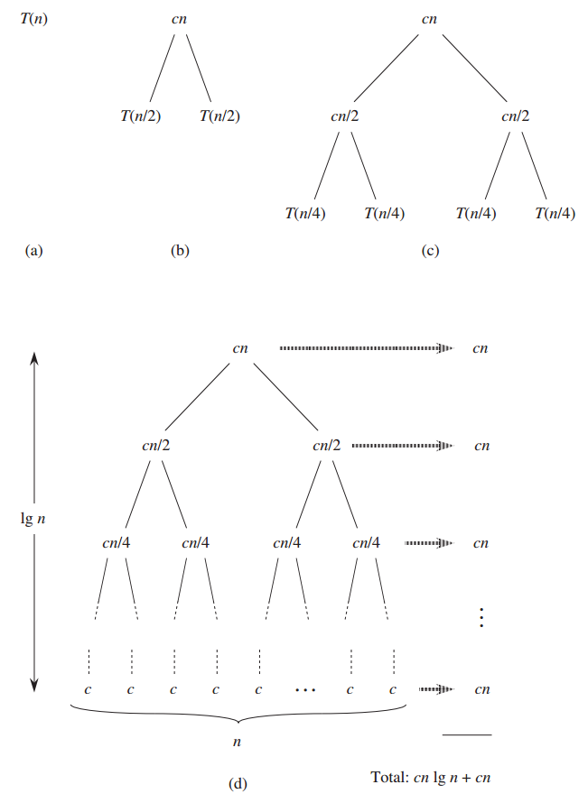
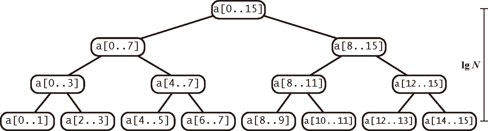
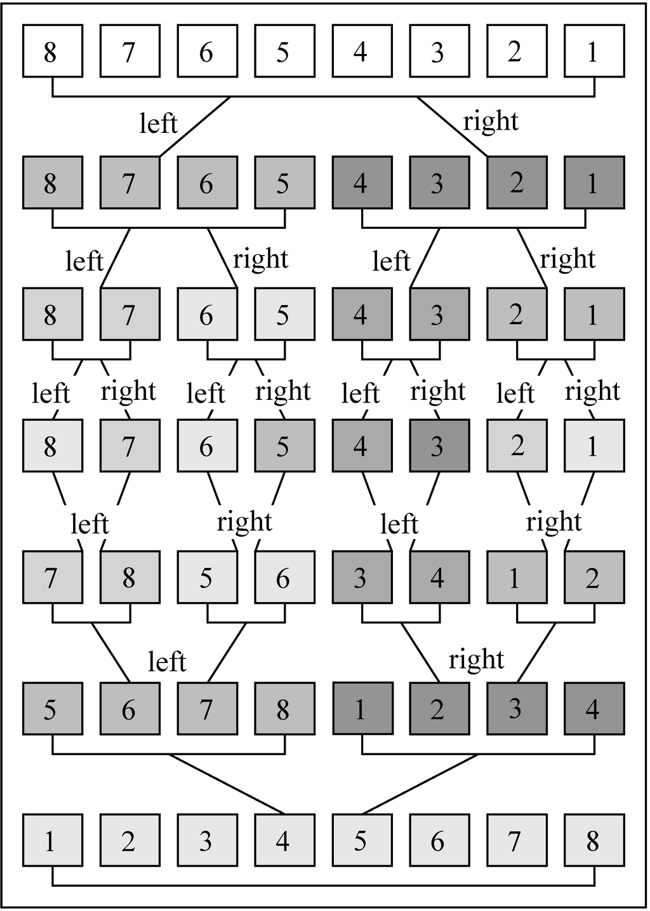
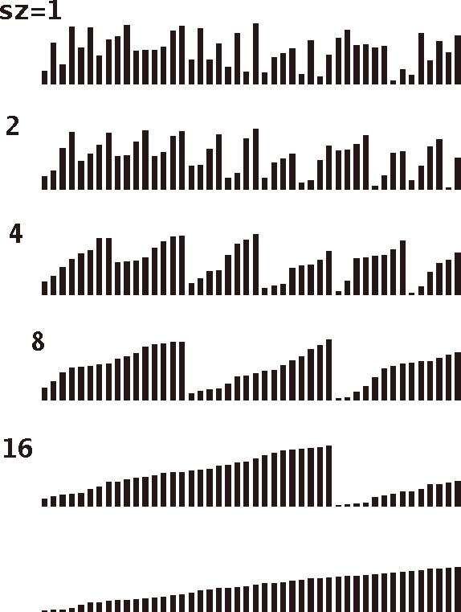
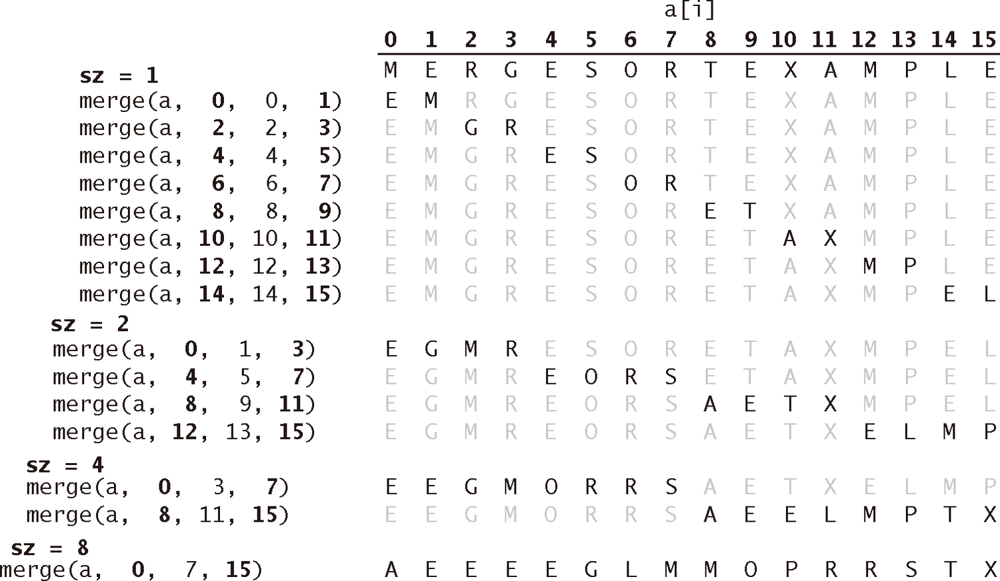
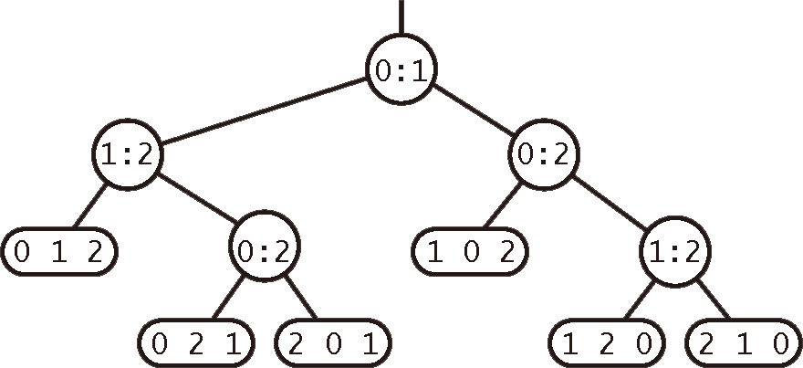
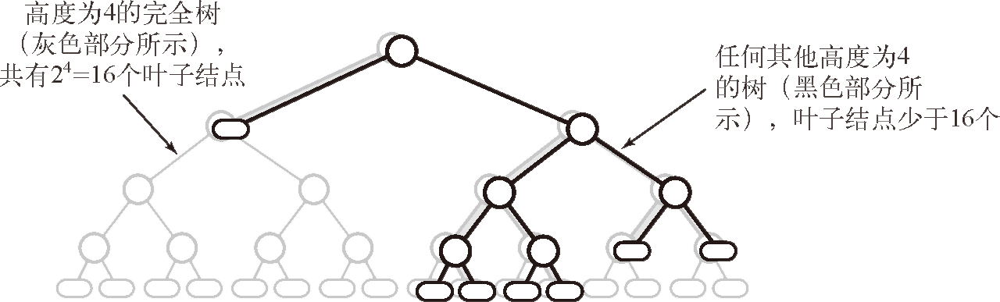
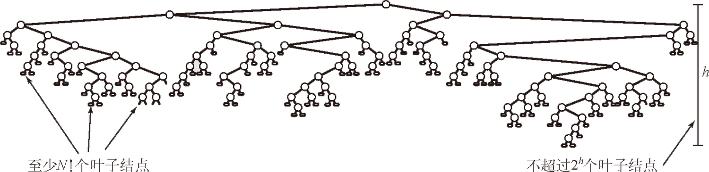

# Merge Sort


<!-- TOC -->

- [Merge Sort](#merge-sort)
    - [设计思想](#设计思想)
        - [分治](#分治)
    - [设计细节](#设计细节)
        - [进行稍复杂的操作时就应该考虑先检查有没有必要](#进行稍复杂的操作时就应该考虑先检查有没有必要)
    - [归并](#归并)
        - [使用上面的归并方法实现排序](#使用上面的归并方法实现排序)
        - [分治思想](#分治思想)
    - [Analyzing divide-and-conquer algorithms](#analyzing-divide-and-conquer-algorithms)
    - [分析](#分析)
        - [数组长度和高度（层数-1）的关系](#数组长度和高度层数-1的关系)
        - [`mergeSort` 的调用次数](#mergesort-的调用次数)
        - [比较次数](#比较次数)
        - [访问次数](#访问次数)
        - [线性对数](#线性对数)
    - [改进](#改进)
        - [对小规模子数组使用插入排序](#对小规模子数组使用插入排序)
        - [测试数组是否已经有序](#测试数组是否已经有序)
        - [不将元素复制到辅助数组](#不将元素复制到辅助数组)
    - [TODO 迭代实现归并排序](#todo-迭代实现归并排序)
    - [非原地归并](#非原地归并)
        - [两个已排序的数组归并排序为一个大的数组](#两个已排序的数组归并排序为一个大的数组)
        - [`merge` 的调用次数是数组长度减一](#merge-的调用次数是数组长度减一)
        - [使用上面的归并方法实现排序](#使用上面的归并方法实现排序-1)
    - [自底向上的归并排序](#自底向上的归并排序)
        - [分析](#分析-1)
    - [排序算法的复杂度](#排序算法的复杂度)
        - [命题：没有任何基于比较的算法能够保证使用少于 $\lg(N!)\sim N\lg N$ 次比较将长度为 N 的数组排序](#命题没有任何基于比较的算法能够保证使用少于-\lgn\sim-n\lg-n-次比较将长度为-n-的数组排序)
        - [归并排序是一种渐进最优的基于比较排序的算法](#归并排序是一种渐进最优的基于比较排序的算法)
        - [和希尔排序的比较](#和希尔排序的比较)
    - [练习](#练习)
        - [2.2.4](#224)
        - [2.2.6](#226)
        - [2.2.7](#227)
        - [2.2.8](#228)
    - [TODO](#todo)
    - [References](#references)

<!-- /TOC -->


## 设计思想
### 分治
1. 分治模式在每层递归时都有三个步骤
    1. **分解**：分解原问题为若干子问题，这些子问题是原问题的规模较小的实例。
    2. **解决**：递归地求解各个子问题。若子问题的规模足够小，就可以直接求解。
    3. **合并**：把这些子问题的解合并为原问题的解。
2. 归并排序算法完全遵守分治模式。直观上的操作如下
    1. **分解**：分解待排序的 $n$ 个元素的序列成各具 $n/2$ 个元素的两个子序列。
    2. **解决**：使用归并排序递归地排序两个子序列。
    3. **合并**：合并两个已排序的子序列已产生已排序的答案。


## 设计细节
### 进行稍复杂的操作时就应该考虑先检查有没有必要
* `merge` 之前检查两个子数组是否已经有序


## 归并
1. 归并排序算法的关键操作是合并两个已排序的子序列，也就是将已排序的前半部分和已排序的后半部分合并排序为整体排好序的状态。
2. 为了方便排序，我们先把两个子序列拷贝到两个临时序列中，然后对它们进行合并排序，按照顺序放回到原序列中。
3. 因为两个临时序列最小的元素都在最前面，所以我们可以不断的比较两个临时序列最前面的元素，选出两个里面更小的移动到原序列中。
4. 两个中更大的那个不会被移动，会留下来和另一个序列中新的最前面的元素再进行比较。
5. 这个过程保证了最终序列都是按照从小到大的顺序。
6. 但要注意比较的边界。这样的比较，肯定是有一个临时序列首先变为空的，而此时另一个序列还会剩下一个或多个。
7. 这种情况下，只需要把剩下的依次放回到原序列就可以了。
8. 也就是说，在比较的过程中需要知道什么时候其中一个序列已经为空了
    ```cpp
    void merge (int* arr, int low, int mid, int high) {

        int leftSize = mid - low + 1;
        int rightSize = high - mid;

        // 虽然是原地归并，但为了重排序，还是要创建临时数组的
        // 不过这两个临时数组会在本次 merge 调用完就会被回收
        int* left = calloc(leftSize, sizeof(int));
        int* right = calloc(rightSize, sizeof(int));
        if (left == NULL || right == NULL)  {
            printf("Error: calloc failed in merge.\n");
            exit (EXIT_FAILURE);
        }

        // 复制到临时数组中
        for (int i=0; i<leftSize; i++) {
            *(left+i) = arr[low+i];
        }
        for (int i=0; i<rightSize; i++) {
            *(right+i) = arr[mid+1+i];
        }

        int leftIdx = 0;
        int rightIdx = 0;
        // for 循环限定了次数，移动完所有的元素后就会结束，因此不需要判断是否两个临时序列都移动完了
        for (int i=low; i<=high; i++) {
            // 左边的临时序列还没有被移动完 且 左边最小的小于右边最小的
            if ( leftIdx < leftSize && left[leftIdx] < right[rightIdx] ) {
                arr[i] = left[leftIdx++];
            }
            // 左边的临时序列已经被移动完了 或 左边最小的大于等于右边最小的
            else {
                arr[i] = right[rightIdx++];
            }
        }

        // 回收临时数组内存
        free(left);
        free(right);
    }
    ```
9. 《算法导论》中的方法是在两个临时序列的底部分别放一个极大值，这样在一个序列移动到只剩下这个极大值时就只会移动另一个序列。不过觉得实现起来更麻烦
    ```cpp
    void merge (int* arr, int low, int mid, int high) {

        int leftSize = mid - low + 1;
        int rightSize = high - mid;

        // 这里要多个临时序列分配一个位置来存放极大值
        int* left = calloc((leftSize+1), sizeof(int));
        int* right = calloc((rightSize+1), sizeof(int));
        if (left == NULL || right == NULL)  {
            printf("Error: calloc failed in merge.\n");
            exit (EXIT_FAILURE);
        }

        for (int i=0; i<leftSize; i++) {
            *(left+i) = arr[low+i];
        }
        *(left+leftSize) = INT_MAX; // 加入极大值
        for (int i=0; i<rightSize; i++) {
            *(right+i) = arr[mid+1+i];
        }
        *(right+rightSize) = INT_MAX; // 加入极大值

        int leftIdx = 0;
        int rightIdx = 0;
        for (int i=low; i<=high; i++) {
            if ( left[leftIdx] < right[rightIdx] ) {
                arr[i] = left[leftIdx++];
            }
            else {
                arr[i] = right[rightIdx++];
            }
        }

        free(left);
        free(right);
    }
    ```

### 使用上面的归并方法实现排序
1. 下面的算法基于原地归并的抽象实现了另一种递归归并，这也是应用高效算法设计中 **分治思想** 的最典型的一个例子。
2. 这段递归代码是归纳证明算法能够正确地将数组排序的基础：如果它能将两个子数组排序，它就能够通过归并两个子数组来将整个数组排序。
    ```js
    function mergeSort ( arr, low, high ) {
        if ( low >= high ) { 
            return;
        }

        let mid = Math.floor( (low + high) / 2 );

        mergeSort( arr, low, mid );
        mergeSort( arr, mid+1, high );
        merge ( arr, low, mid, high );
    }
    ```

### 分治思想
递归实现的归并排序是算法设计中分治思想的典型应用。我们将一个大问题分割成小问题分别解决，然后用所有小问题的答案来解决整个大问题。尽管我们考虑的问题是归并两个大数组，实际上我们归并的数组大多数都非常小。


## Analyzing divide-and-conquer algorithms
这里以归并排序为例讲解了分治算法的分析方法，仔细看《算法导论》 2.3.2。


## 分析
### 数组长度和高度（层数-1）的关系


1. 图上的 $lg n$ 是指高度，不包过根，所以比层数少 1。
2. 每分出一层，高度加一，新层的子数组元素个数都是前一层的一半，也就是除以 2。
3. 最后一层只有一个，所以 $\frac{n}{2^{高度}} = 1$，也就是 $2^{高度} = n$。例如 $n = 4$ 时，高度就是 $2$；$n = 2$ 时，高度就是 $1$；$n = 1$ 时，高度就是 $0$。
4. 所以如果有 $n$ 个元素，那分出的高度就是 $lg n$。$lg$ 指 $log_2$。

### `mergeSort` 的调用次数
1. 刚开始调用一次，之后每次划分都会调用两次 `mergeSort`，最后划分为单项数组时，每个单向数组调用一次。
2. 调用的总次数是 $2^0 + 2^1 + 2^2 +...+ n/2 + n$，最后两项实际上就是 $2^{lg{n-1}}$ 和 $2^{lg{n}}$。
3. 等比数列求和 $\frac{1-n*2}{1-2} = 2n-1$。

### 比较次数
1. 命题：对于长度为 $N$ 的任意数组，自顶向下的归并排序需要 $\frac{1}{2}N\log_2 N$ 至 $N\log_2 N$ 次比较。
2. 可以通过下图所示的树状图来理解这个命题
    
3. 每个节点都表示一个 `mergeSort()` 方法通过 `merge()` 方法归并而成的子数组。
4. 对于这样一个 $n$ 层的树，我们定义最顶上完整的数组是第 $0$ 层，最底下第一次 merge 之后层是第 $n-1$ 层。
5. 对于 $0$ 到 $n-1$ 之间的任意第 $k$ 层，有 $2^k$ 个子数组。因为每次都一分为二成两个子数组。
5. 我们假定这个数组的长度是 2 的幂（《算法导论》上说到这种简化不影响递归式解的增长量级），那么最底下一行就有 $2^{n-1}$ 个两项子数组，所以完整数组的长度 $N= 2^n$。
6. 每层所有子数组的长度总和就是完整数组的长度。所以任意一个子数组的长度为 $2^{n-k}$。
7. 根据归并的算法，归并两个长度为 $x$ 的数组，最少需要 $x$ 次比较，最多需要 $2x$ 次比较。也就是说在归并排序中，对于长度为 $N$ 的数组，最少需要 $\frac{1}{2}N$ 次比较，最多需要 $N$ 次比较。
8. 那么对于第 $k$ 层的任意长度为 $2^{n-k}$ 的子数组，在归并排序中就最多需要 $2^{n-k}$ 次比较。
9. 因此每层的比较次数最多为 $2^k\times2^{n-k}=2^n$；$n$ 层总共的比较次数最多为 $n2^n = N\log_2 N$，最少$\frac{1}{2}N\log_2 N$。

### 访问次数
1. 命题：对于长度为 N 的任意数组，自顶向下的归并排序最多需要访问数组 $6N\log_2 N$ 次。
2. 上面已经确定了比较次数最多是 $N\log_2 N$。从 `merge` 方法可以看出来，在这种最坏的比较情况下，一次比较本身涉及两次数组的访问（`aux[i] < aux[j]`）；而比较之后的赋值也涉及两次数组访问（`arr[k] = aux[i]`）；另外，刚开始把 `arr` 复制到 `aux` 的过程，循环次数也是和最坏的比较次数一样多的，而每次循环也是两次数组访问。 

### 线性对数
1. 归并排序所需的时间和 $N\log_2 N$ 成正比，这表明我们只需要比遍历整个数组多个对数因子的时间就能将一个庞大的数组排序。可以用归并排序处理数百万甚至更大规模的数组，这是插入排序或者选择排序做不到的。
2. 归并排序的主要缺点是辅助数组所使用的额外空间和 N 的大小成正比。另一方面，通过一些细致的思考我们还能够大幅度缩短归并排序的运行时间。不懂，原地归并不是只会在 `merge` 的局部作用域创建一个数组并且调用完就会被回收吗？因为不会并行所以也不会同时调用好几个 `merge`，为什么会有成正比的空间占用呢？回收不及时？


## 改进
### 对小规模子数组使用插入排序
1. 用不同的方法处理小规模问题能改进大多数递归算法的性能，因为递归会使小规模问题中方法的调用过于频繁，所以改进对它们的处理方法就能改进整个算法。
2. 对排序来说，我们已经知道插入排序（或者选择排序）非常简单，因此很可能在小数组上比归并排序更快。使用插入排序处理小规模的子数组（比如长度小于 15）一般可以将归并排序的运行时间缩短 10% ～ 15%。
3. 需要先改造一下插入排序，让它支持指定的起始位置，来配合归并排序的方式
    ```js
    function insertionSortForMergeSort ( arr, low, high ) {
        for ( let i=low + 1; i<=high; i++ ) {
            let curr = arr[i]; 
            let j = i - 1; 
            while ( j >= low && curr < arr[j] ) {
                arr[j+1] = arr[j];
                j--;
            }
            if ( j < i-1 ) {
                arr[j+1] = curr;
            }
        }
    }
    ```
4. 然后应用到归并排序里
    ```js
    function mergeSort ( arr, low, high ) {
        if ( high - low < 14 ) {
            insertionSortForMergeSort( arr, low, high );
            return;
        }

        if ( low >= high ) { 
            return;
        }

        let mid = Math.floor( low + (high-low) / 2 );

        mergeSort( arr, low, mid );
        mergeSort( arr, mid+1, high );
        merge ( arr, low, mid, high );
    }
    ```

### 测试数组是否已经有序
1. 我们可以添加一个判断条件，如果 `a[mid]` 小于等于 `a[mid+1]`，我们就认为数组已经是有序的并跳过 `merge()` 方法
    ```js
    function mergeSort ( arr, low, high ) {
        if ( high - low < 14 ) {
            insertionSortForMergeSort( arr, low, high );
            return;
        }

        if ( low >= high ) { 
            return;
        }

        let mid = Math.floor( low + (high-low) / 2 );

        mergeSort( arr, low, mid );
        mergeSort( arr, mid+1, high );
        if ( arr[mid] > arr[mid+1] ) {
            merge ( arr, low, mid, high );
        }
    }
    ```
2. 这个改动不影响排序的递归调用，但是任意有序的子数组算法的运行时间就变为线性的了。

### 不将元素复制到辅助数组
TODO


## TODO 迭代实现归并排序


## 非原地归并
### 两个已排序的数组归并排序为一个大的数组
1. 实现归并的一种直截了当的办法是将两个不同的有序数组归并到第三个数组中。
2. 实现的方法很简单，创建一个大的数组然后将两个输入数组中的元素一个个从小到大放入这个数组中。
    ```js
    function merge(left, right) {
        let result = [];
        let leftIndex = 0;
        let rightIndex = 0;
        let leftLen = left.length;
        let rightLen = right.length;

        // 两个数组都还有元素没有比较完，不断比较并按顺序加入新数组
        while ( leftIndex < leftLen && rightIndex < rightLen ) {
            if ( left[leftIndex] < right[rightIndex] ) {
                result.push( left[leftIndex] );
                leftIndex++;
            } 
            else {
                result.push( right[rightIndex] );
                rightIndex++;
            }
        }

        // 右边数组的元素已经全部加入了新数组，左边数组还有剩下的
        while ( leftIndex < leftLen ) {
            result.push( left[leftIndex] );
            leftIndex++;
        }

        // 左边数组的元素已经全部加入了新数组，右边数组还有剩下的
        while ( rightIndex < rightLen ) {
            result.push( right[rightIndex] );
            rightIndex++;
        }

        return result;
    }

    let arr1 = [2, 10, 17, 27, 29, 35, 37, 67, 91, 94];
    let arr2 = [6, 21, 26, 33, 38, 42, 50, 55, 68, 79];

    console.log( merge( arr1, arr2 ) ); 
    // [2, 6, 10, 17, 21, 26, 27, 29, 33, 35, 37, 38, 42, 50, 55, 67, 68, 79, 91, 94]
    ```

### `merge` 的调用次数是数组长度减一
1. 归并排序会把一个数组不断拆分直到全部都是单一元素，然后再不断 merge 回到一个整个的数组。
2. 想象 10 块单独的积木，你想把它们用胶水粘成一排，一共要涂几次胶水？
3. 不管你以怎样的排列和组合，最终都要是要涂 9 次胶水。

### 使用上面的归并方法实现排序
1. 上面的归并方法，让我们掌握了一种对数组进行排序的方法，但前提是这个数组里的两个子数组必须是各自有序的。
2. 不过既然我们掌握了这个排序方法，那就可以用这个方法来对两个子数组进行排序。
3. 递归感出来了。只要我们递归的对子数组进行归并排序，最终就能对整个数组进行排序。
4. 递归的终点，或者说起点，是子数组只有一个元素的情况。
5. 从这个起点回溯，归并排序这两个单元素数组
    
6. 我们定义这个排序方法 `mergeSort`，这个方法会 `merge` 两个子数组；这两个子数组也需要是排序好的，那么我们就递归的用 `mergeSort` 去排序这两个子数组
    ```js
    function mergeSort ( arr ) {
        let len = arr.length;
        if ( len === 1 ) {
            return arr;
        }

        let midIndex = Math.floor( len/2 );
        let left = arr.slice( 0, midIndex );
        let right = arr.slice( midIndex );

        return merge( mergeSort( left ), mergeSort( right ) );
    }
    ```


## 自底向上的归并排序
1. 自顶向下的归并排序是不断的递归平分数组，平分到单元素数组时，再反向递归的归并排序。
2. 实现归并排序的另一种被称为自底向上的归并排序，方法如下图所示，这种实现方法比标准递归方法所需要的代码量更少
    
3. 自底向上的归并排序会多次遍历整个数组，根据子数组大小进行两两归并。子数组的大小 `size` 的初始值为 1，每次加倍。最后一个子数组的大小只有在数组大小是 `size` 的偶数倍的时候才会等于 `size`（否则它会比 `size` 小）。
3. 实现
    ```js
    function MergeBU ( arr ) {
        let len = arr.length;
        
        for ( let size=1; size<len; size*=2 ) {
            for ( let low=0; low<len-size; low+=size*2 ) {
                let mid = low + size - 1;
                let high = Math.min( (low + size*2 - 1), (len-1) );
                merge( arr, low, mid, high);
            }
        }
    }
    ```

### 分析
1. 命题：对于长度为 N 的任意数组，自底向上的归并排序需要 $\frac{1}{2}N\log_2 N$ 至 $N\log_2 N$ 次比较；最多需要访问数组 $6N\log_2 N$ 次。
2. 第一轮 size 归并完的数组长度是 $2^1$，第二轮 size 归并完的数组长度是 $2^2$，第 $n$ 轮 size 归并完整个数组，归并完的数组长度 $2^n = N$。所以归并完长度为 N 的数组需要 $log_2 N$ 轮。
    
3. 根据前面分析的 `merge` 算法：即归并两个长度为 N/2 的子数组，比较次数最少为 N/2 最多为 N，在最坏的 N 比较次数的情况下，访问数组的次数是 6N。
4. 因为每一轮归并都会对所有的 N 个元素进行归并一次，所以命题可证。
5. 当数组长度为 2 的幂时，自顶向下和自底向上的归并排序所用的比较次数和数组访问次数正好相同，只是顺序不同。其他时候，两种方法的比较和数组访问的次序会有所不同。
5. 自底向上的归并排序比较适合用链表组织的数据。想象一下将链表先按大小为 1 的子链表进行排序，然后是大小为 2 的子链表，然后是大小为 4 的子链表等。这种方法只需要重新组织链表链接就能将链表原地排序，不需要创建任何新的链表节点。
6. 用自顶向下或是自底向上的方式实现任何分治类的算法都很自然。归并排序告诉我们，当能够用其中一种方法解决一个问题时，你都应该试试另一种。你是希望那样化整为零（然后递归地解决它们）的方式解决问题，还是希望循序渐进地解决问题呢？


## 排序算法的复杂度
1. 学习归并排序的一个重要原因是它是证明计算复杂性领域的一个重要结论的基础，而计算复杂性能够帮助我们理解排序自身固有的难易程度。
2. 研究复杂度的第一步是建立一个计算模型。一般来说，研究者会尽量寻找一个和问题相关的最简单的模型。
3. 对排序来说，我们的研究对象是基于比较的算法，它们对数组元素的操作方式是由主键的比较决定的。
4. 一个基于比较的算法在两次比较之间可能会进行任意规模的计算，但它只能通过主键之间的比较得到关于某个主键的信息。

### 命题：没有任何基于比较的算法能够保证使用少于 $\lg(N!)\sim N\lg N$ 次比较将长度为 N 的数组排序
1. 我们使用二叉树来表示所有的比较。树中的节点要么是一片 **叶节点**，表示排序完成且原输入的排列顺序是 $a[i_0], a[i_1], ..., a[i_{N-1}]$，要么是一个 **内部节点**，表示 $a[i]$ 和 $a[j]$ 之间的一次比较操作，它的左子树表示 $a[i]$ 小于 $a[j]$ 时进行的其他比较，右子树表示 $a[i]$ 大于 $a[j]$ 时进行的其他比较。
2. 从根节点到叶子节点每一条路径都对应着算法在建立叶子节点所示的顺序时进行的所有比较。例如，这是一棵 N=3 时的比较树：
    
3. 先比较 $a[0]$ 和 $a[1]$，如果 $a[0]$ 小，则走左边分支，再比较 $a[1]$ 和 $a[2]$，如果 $a[1]$ 小，那就还是走左边分支，此时就完成了排序，顺序是 $[a[0], a[1], a[2]]$。
4. 从比较树观察得到的第一个重要结论是这棵树应该至少有 $N!$ 个叶子节点，因为 $N$ 个不同的主键会有 $N!$ 种不同的排列。如果叶子节点少于 $N!$，那肯定有一些排列顺序被遗漏了。不懂，“至少有 $N!$”，那如果更多的情况，也就是说排序算法会排出若干个重复的结果？
5. 从根节点到叶子节点的一条路径上的内部节点的数量即是某种输入下算法进行比较的次数。我们感兴趣的是这种路径能有多长（也就是树的高度），因为这也就是算法比较次数的最坏情况。
6. 二叉树的一个基本的组合学性质就是高度为 $h$ 的树最多只可能有 $2^h$ 个叶子节点，拥有 $2^h$ 个节点的树是完美平衡的，或称为完全树。下图所示的就是一个 $h=4$ 的例子
    
7. 因此，任意基于比较的排序算法都对应着一棵高 $h$ 的比较树，其中：$N!\leqslant 叶子结点的数量 \leqslant2^h$
    
8. $h$ 的值就是最坏情况下的比较次数，因此对不等式的两边取对数即可得到任意算法的比较次数至少是 $\log_2 N!$。根据斯特林公式对阶乘函数的近似可得 $\log_2 N!\sim N\log_2 N$。
9. 这个结论告诉了我们在设计排序算法的时候能够达到的最佳效果。例如，如果没有这个结论，我们可能会去尝试设计一个在最坏情况下比较次数只有归并排序的一半的基于比较的算法。


### 归并排序是一种渐进最优的基于比较排序的算法
1. 归并排序在最坏情况下的比较次数为 $\sim N\log_2 N$。这是开发其他排序算法复杂度的 **上限**，也就是说要开发其他更好的算法就需要保证使用的比较次数要更少才行。
2. 同时，上面的命题说明没有任何排序算法能够用少于 $\sim N\log_2 N$ 次比较将数组排序，这是其他排序算法复杂度的 **下限**。也就是说，即使是最好的算法在最坏的情况下也至少需要这么多次比较。
3. 将两者结合起来也就意味着：归并排序在最坏情况下的比较次数和任意基于比较的排序算法所需的最少比较次数都是 $\sim N\log_2 N$。
3. 归并排序最坏的情况下比较次数近似于基于比较的排序算法的理论最优值？！！在快速排序的地方会比较归并排序并说明快速排序更快的情况。《算法图解》也讲到了这一点，快速排序平均情况下也是 $\sim N\log_2 N$，但它前面的常数值要小于归并排序，因此往往要比归并排序快。
4. 需要强调的是，和计算模型一样，我们需要精确地定义最优算法。例如，我们可以严格地认为仅仅只需要 $\lg N!$ 次比较的算法才是最优的排序算法。我们不这么做的原因是，即使对于很大的 N，这种严格的最优算法和（比如说）归并排序之间的差异也并不明显。
5. 或者我们也可以放宽最优的定义，使之包含任意在最坏情况下的比较次数都在 $N\lg N$ 的某个常数因子范围之内的排序算法。我们不这么做的原因是对于很大的 N，这种勉强跻身最优算法行列的算法和归并排序之间的差距还是很明显的。
6. 归并排序的最优性并不是结束，也不代表在实际应用中我们不会考虑其他的方法了，因为本节中的理论还是有许多局限性的，例如：
    * 归并排序的空间复杂度不是最优的；
    * 在实践中不一定会遇到最坏情况；
    * 除了比较，算法的其他操作（例如访问数组）也可能很重要；
    * 不进行比较也能将某些数据排序。

### 和希尔排序的比较
1. 在实际应用中，它们的运行时间之间的差距在常数级别之内，因此相对性能取决于具体的实现。
2. 理论上来说，还没有人能够证明希尔排序对于随机数据的运行时间是线性对数级别的，因此存在平均情况下希尔排序的性能的渐进增长率（即运行时间的近似函数）更高的可能性。在最坏情况下，这种差距的存在已经被证实了，但这对实际应用没有影响。
3. TODO 深入分析。以及，在数据不是很大并且比较有序的情况下，希尔排序应该会更好吧？


## 练习
### 2.2.4
1. 是否当且仅当两个输入的子数组都有序时原地归并的抽象方法才能得到正确的结果？证明你的结论，或者给出一个反例。
3. 因为归并的算法只是和另一个数组里的元素比较大小，而不比较本数组内部的元素大小顺序，所以要想正确归并就要先保证子数组已经是有序的。比如 `[5, 2]` 和 `[3, 8]` 会被归并为 `[3, 5, 2, 8]`。

### 2.2.6
1. 编写一个程序来计算自顶向下和自底向上的归并排序访问数组的准确次数。使用这个程序将 N=1 至 512 的结果绘成曲线图，并将其和上限 $6N\log_2 N$ 比较。
2. 代码
    ```js
    let count_accesses = 0;

    function merge ( arr, low, mid, high ) {
        let i = low;
        let j = mid+1;
        let aux = [];


        for ( let k=low; k<=high; k++ ) {
            aux[k] = arr[k];
            count_accesses += 2;
        }

        for ( let k=low; k<=high; k++ ) {
            if ( i > mid ) {
                arr[k] = aux[j];
                count_accesses += 2;
                j++;
            }
            else if ( j > high ) {
                arr[k] = aux[i];
                i++;
                count_accesses += 2;
            }
            else if ( aux[i] < aux[j] ) {
                arr[k] = aux[i];
                i++;
                count_accesses += 4;
            }
            else {
                arr[k] = aux[j];
                j++;
                count_accesses += 2;
            }
        }
    }

    function count (n) {
        count_accesses = 0;

        let arr = Array.from({length: n}, ()=>{
            return Math.floor( Math.random() * n* 10 );
        });

        mergeSort( arr, 0, n-1 )
        // MergeBU(arr)

        console.log(count_accesses);
        let worst = Math.ceil( 6 * n * Math.log2(n) );
        console.log( worst );
        console.log( (count_accesses / worst).toFixed(2) );

    }

    for (let i=2; i<=512; i++) {
        console.log( i + '-------------------------');
        count(i)
        console.log('')
    }
    ```
3. 两种归并实现的比较次数和上限 $6N\log_2 N$ 的比值在 0.8-0.85 之间浮动。

### 2.2.7
1. 证明归并排序的比较次数是单调递增的（即对于 N>0，C(N+1)>C(N)）。
2. 看看比较部分的代码
    ```js
    for ( let k=low; k<=high; k++ ) {
        // count_compare++; // 第一种计算比较的位置
        if ( i > mid ) {
            arr[k] = aux[j];
            j++;
        }
        else if ( j > high ) {
            arr[k] = aux[i];
            i++;
        }
        else if ( aux[i] < aux[j] ) {
            arr[k] = aux[i];
            i++;
            // count_compare++; // 第二种计算比较的位置，要结合下面的一次
        }
        else {
            arr[k] = aux[j];
            j++;
            // count_compare++; // 第二种计算比较的位置，要结合上面的一次
        }
    }
    ```
3. 如果使用第一种计算比较次数的方法，那么多一个元素，递归拆分到最后就会多一个子数组，多一次 merge，就会至少多一次比较。
4. 如果使用第一种计算比较次数的方法，也就是不计算一个数组提前排完的情况，那么还会受到数据本身顺序的影响。也就是说元素多了一个的数组，虽然会多一次 merge，但有可能 merge 时有更多的数组提前排完的情况，比较次数反而会少一点。

### 2.2.8
1. 假设将自顶向下的归并排序算法修改为：只要 `a[mid] <= a[mid+1]` 就不调用 `merge()` 方法，请证明用归并排序处理一个已经有序的数组所需的比较次数是线性级别的。
2. 如果是这样的话，显然完全不会调用 `merge`。不过答案说的那个不懂

## TODO 
2.2.10 及以后的练习


## References
* [算法（第4版）](https://book.douban.com/subject/19952400/)
* [学习JavaScript数据结构与算法](https://book.douban.com/subject/26639401/)
* [图解排序算法(二)之希尔排序](https://www.cnblogs.com/chengxiao/p/6104371.html)
* [算法导论](https://book.douban.com/subject/20432061/)