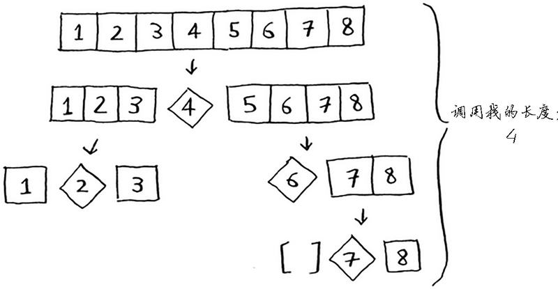

# QuickSort


<!-- TOC -->

- [QuickSort](#quicksort)
    - [设计思想](#设计思想)
    - [基本算法](#基本算法)
        - [实现](#实现)
    - [注意点](#注意点)
        - [对输入数组乱序](#对输入数组乱序)
        - [比较交换的停止条件](#比较交换的停止条件)
        - [指针移动的边界条件](#指针移动的边界条件)
                - [考虑 `if ( i === rightIndex )` 成立时](#考虑-if--i--rightindex--成立时)
                - [考虑 `if ( j === leftIndex )` 成立时](#考虑-if--j--leftindex--成立时)
        - [为什么内层循环不包括等于](#为什么内层循环不包括等于)
        - [为什么 (1) 处交换条件不包括等于](#为什么-1-处交换条件不包括等于)
        - [原地切分](#原地切分)
    - [性能分析](#性能分析)
        - [命题：将长度为 $N$ 的无重复数组排序，快速排序平均需要 $\sim2N\ln N$ 次比较（以及 1/6 的交换）。](#命题将长度为-n-的无重复数组排序快速排序平均需要-\sim2n\ln-n-次比较以及-16-的交换)
        - [命题：快速排序最多需要约 $N^2/2$ 次比较，但随机打乱数组能够预防这种情况](#命题快速排序最多需要约-n^22-次比较但随机打乱数组能够预防这种情况)
    - [算法改进](#算法改进)
        - [切换到插入排序](#切换到插入排序)
        - [三取样切分](#三取样切分)
        - [熵最优的排序](#熵最优的排序)
            - [实现](#实现-1)
            - [分析](#分析)
    - [References](#references)

<!-- /TOC -->

## 设计思想


## 基本算法
1. 快速排序是一种分治的排序算法。它将一个数组分成两个子数组，将两部分独立地排序。
2. 快速排序和归并排序是互补的：归并排序将数组分成两个子数组分别排序，并将有序的子数组归并以将整个数组排序；而快速排序将数组排序的方式则是当两个子数组都有序时整个数组也就自然有序了。
3. 在第一种情况中，递归调用发生在处理整个数组之前；在第二种情况中，递归调用发生在处理整个数组之后。
4. 在归并排序中，一个数组被等分为两半；在快速排序中，切分（partition）的位置取决于数组的内容。
5. 主要缺点是非常脆弱，在实现时要非常小心才能避免低劣的性能。已经有无数例子显示许多种错误都能致使它在实际中的性能只有平方级别。幸好我们将会看到，由这些错误中学到的教训也大大改进了快速排序算法，使它的应用更加广泛。

### 实现
```js
function partition ( arr, leftIndex, rightIndex ) {
    let pivot = arr[leftIndex];
    let i = leftIndex + 1;
    let j = rightIndex;

    while ( i <= j ) { // 注意不能是 <，必须是 <=
        // 左边的指针右移直到找到一个比 pivot 大的元素
        while ( arr[i] < pivot ) {
            i++;
            // if ( i === rightIndex ) { // 没必要，下述
            //     break;
            // }
        }

        // 右边的指针左移直到找到一个比 pivot 小的元素
        while ( arr[j] > pivot ) {
            j--;
            // if ( j === leftIndex ) { // 没必要，下述
            //     break;
            // }
        }
        // 两边暂停移动后，如果没有相遇，则交换。
        // 通过该次交换，保证了从起始位置到当前位置，
        // 左边所有的项都是小于 pivot 的值，右边所有的项都是大于 pivot 的值
        if (i < j) { 
            // 交换后两个指针移到下一个没有探索的位置，继续探索
            swap(arr, i++, j--); // (1)
        }
    }
    swap(arr, leftIndex, j); // (2)
    return j;
}

function quickSort ( arr, leftIndex, rightIndex ) {
    if ( leftIndex >= rightIndex ) {
        return;
    }
    let index = partition( arr, leftIndex, rightIndex );
    quickSort( arr, leftIndex, index-1);
    quickSort( arr, index+1, rightIndex);
}


// 实际使用时，先对数组进行乱序操作，消除初始状态小可能的有序
// ...
shuffle(arr);
quickSort(arr, 0, SIZE-1);
```


## 注意点
### 对输入数组乱序
1. 这能够防止出现最坏情况并使运行时间可以预计。Hoare 在 1960 年提出这个算法的时候就推荐了这种方法——它是一种（也是第一批）偏爱随机性的算法。
2. 假设你总是将第一个元素用作基准值，且要处理的数组是有序的。由于快速排序算法不检查输入数组是否有序，因此它依然尝试对其进行排序
    
3. 注意，数组并没有被分成两半，相反，其中一个子数组始终为空，这导致调用栈非常长。
4. 现在假设你总是将中间的元素用作基准值，在这种情况下，调用栈如下
    
5. 调用栈短得多！因为你每次都将数组分成两半，所以不需要那么多递归调用。
6. 第一个示例展示的是最糟情况，而第二个示例展示的是最佳情况。在最糟情况下，栈长为 $O(N)$，而在最佳情况下，栈长为 $O(log N)$。
7. 而不管是最糟情况还是最佳情况，在调用栈的每层都涉及 $N$ 个元素。
8. 所以，最糟情况下快速排序的时间复杂度为 $O(N^2)$，而最佳情况的时间复杂度是 $O(N log N)$。
9. 而且要注意的是，这里的最佳情况其实也就是数组乱序的情况，所以其实它也就是平均情况。只要你每次都随机地选择一个数组元素作为基准值，快速排序的平均运行时间就将为 $O(N log N)$。
    
### 比较交换的停止条件
1. 也就是外层 `while` 的停止条件。该循环继续的条件是 `i <= j`，而不能是 `i < j`。也就是说，当两个指针相遇时，依然不能停止循环。
2. 因为循环停止后，就要交换 `arr[leftIndex]` 和 `arr[j]`，而交换的前提就是 `arr[j] <= arr[leftIndex]`。
3. 问题是，两个指针相遇时所在的元素，不能保证小于等于 `arr[leftIndex]`。
4. 考虑 `[44, 157, 138, 16, 229]`。在进行一次对调后，变为 `[44, 16, 138, 157, 229]`，`i` 和 `j` 在 `138` 处相遇。这是如果退出外层循环并交换 `arr[leftIndex]` 和 `arr[j]` 的话就会错误。
5. `i` 和 `j` 相遇，意味着它们的左边都是小于等于 `pivot` 的，而右边都是大于等于 `pivot` 的。当前的 `i` 和 `j`，最多只能有其中一个移动一步，也可能都不会移动。
6. 如果当前位置小于 `pivot`，那 `i` 会移动一步然后停止，`j` 不会移动，退出外层循环；如果当前位置大于 `pivot`，那 `j` 会移动一步然后停止，`i` 不会移动，退出外层循环；如果当前位置等于 `pivot`，那 `i` 和 `j` 都不会移动，直接退出外层循环。
7. 无论以三种情况中的哪一种退出循环后，`j` 所在的位置都是小于等于 `pivot` 的，所以可以正确交换。
8. 因为 `j` 一定会止步在小于等于 `pivot` 的元素上，而 `i` 一定会止步在大于等于 `pivot` 的元素上。它俩要么擦肩而过落在各自的终点，要么恰好一起落在等于 `pivot` 的元素上。

### 指针移动的边界条件
1. 如果 `pivot` 是数组中最小或最大的那个元素，我们就要小心别让扫描指针跑出数组的边界。
2. 如果 `pivot` 是最小的，则左指针不会移动，右指针会一直移动到 `pivot` 的位置；如果 `pivot` 是最大的，则左指针会一直移动到数组末尾，而有指针不会移动。
3. 上面两种情况会有指针移出数组的担心，所以上面的代码两个内循环 `while` 中注释的部分本来加上了判断来防止移出。但是，这两个判断其实没有必要：

##### 考虑 `if ( i === rightIndex )` 成立时
1. 说明 `j` 停留在最右边没有动，`i` 一直走到了 `j` 的位置。如果这时不通过 `break` 跳出，而是再次试图循环，循环条件 `arr[i] < pivot` 可能成立也可能不成立。
2. 如果可以继续一次循环，说明最后一个元素仍然小于 `pivot`，`i` 自增后大于 `j`。下面的 `while` 循环 `j` 不会移动。(1) 出的 swap 不会发生，(2) 处的 swap 正常交换。`pivot` 是数组中的最大元素。
3. 如果不能再循环了，说明最后一个元素大于等于 `pivot`，`i` 停留在当前位置。下面的 `while` 循环 `j` 中，如果当前元素等于 `pivot`，`j` 停留在原地；如果当前元素大于 `pivot`，`j` 移动一步然后停止。(1) 处的 swap 不会发生，(2) 处的 swap 正常交换。`pivot` 要么是并列数组最大元素要么就是数组第二大元素。

##### 考虑 `if ( j === leftIndex )` 成立时
1. 说明 `i` 停留在其实位置（`pivot` 右边）没有动，`j` 越过 `i` 移动到了 `pivot` 的位置。
2. 说明 `i` 的元素比 `pivot` 大，`pivot` 右边所有的元素都比它大。这时如果这是不通过 `break` 跳出，`while` 循环也不会继续了，因为 `arr[j]` 现在就是 `pivot` 了。

### 为什么内层循环不包括等于
1. 也就是说，指针所在的元素等于 `pivot` 的时候，也会停下来等待互换。
2. 仅从互换本身的效果来看，把一个等于 `pivot` 的元素换到另一边并没有什么意义，只是增加了工作量。
3. 但在某些典型应用中，它能够避免算法的运行时间变为平方级别

### 为什么 (1) 处交换条件不包括等于
如果 (1) 处的交换条件是 `i <= j`，那相等的情况就是 `i` 和 `j` 落到了和 `pivot` 一样大的元素上，此时的交换没有任何意义。

### 原地切分
如果使用一个辅助数组，我们可以很容易实现切分，但将切分后的数组复制回去的开销也许会使我们得不偿失。一个初级程序员甚至可能会将空数组创建在递归的切分方法中，这会大大降低排序的速度。


## 性能分析
1. 快速排序切分方法的内循环会用一个递增的索引将数组元素和一个定值比较。这种简洁性也是快速排序的一个优点，很难想象排序算法中还能有比这更短小的内循环了。例如，归并排序和希尔排序一般都比快速排序慢，其原因就是它们还在内循环中移动数据。
2. 总的来说，可以肯定的是对于大小为 $N$ 的数组，快速排序的运行时间在 $1.39N\lg N$ 的某个常数因子的范围之内。归并排序也能做到这一点，但是快速排序一般会更快（尽管它的比较次数多 39%），因为它移动数据的次数更少。这些保证都来自于数学概率，你完全可以相信它。

### 命题：将长度为 $N$ 的无重复数组排序，快速排序平均需要 $\sim2N\ln N$ 次比较（以及 1/6 的交换）。
1. 令 $C_N$ 为将 $N$ 个不同元素排序平均所需的比较次数。显然 $C_0=C_1=0$，对于 $N>1$，由递归程序可以得到以下归纳关系：

    $$
    C_N = (N+1) + (C_0+C_1+\cdots+C_{N-2}+C_{N-1})/N + (C_{N-1}+C_{N-2}+\cdots+C_0)/N
    $$

2. $N+1$ 是两个指针所在的元素和 `pivot` 比较的次数，也就是两个内循环 `while` 的次数。
3. $(C_0+C_1+\cdots+C_{N-2}+C_{N-1})/N$ 是左子数组（长度可能是 0 到 N-1）排序的平均比较次数。
4. $(C_{N-1}+C_{N-2}+\cdots+C_0)/N$ 是将右子数组（长度和左子数组相同）排序的平均比较次数。
5. 将等式左右两边乘以 $N$ 并整理各项得到：
    
    $$
    NC_N=N(N+1)+2(C_0+C_1+\cdots+C_{N-2}+C_{N-1})
    $$

6. 将该等式减去 $N-1$ 时的相同等式可得：
   
    $$
    NC_N-(N-1)C_{N-1}=2N+2C_{N-1}
    $$

7. 整理等式并将两边除以 N(N+1) 可得：

    $$
    \frac{C_N}{N+1}=\frac{C_{N-1}}{N} + \frac{2}{N+1} 
    $$

8. 后面的不懂 TODO

### 命题：快速排序最多需要约 $N^2/2$ 次比较，但随机打乱数组能够预防这种情况
1. 尽管快速排序有很多优点，它的基本实现仍有一个潜在的缺点：在切分不平衡时这个程序可能会极为低效。例如，如果第一次从最小的元素切分，第二次从第二小的元素切分，如此这般，每次调用只会移除一个元素。这会导致一个大子数组需要切分很多次。我们要在快速排序前将数组随机排序的主要原因就是要避免这种情况。它能够使产生糟糕的切分的可能性降到极低，我们就无需为此担心了。
2. 根据刚才的证明，在每次切分后两个子数组之一总是空的情况下，比较次数为：

    $$
    N+(N-1)+(N-2)+\cdots+2+1=(N+1)N/2
    $$

3. 这不仅说明算法所需的时间是平方级别的，也显示了算法所需的空间是线性的，而这对于大数组来说是不可接受的。
4. 但是（经过一些复杂的工作）通过扩展对一般情况的分析我们可以得到比较次数的标准差约为 $0.65N$。因此，随着 $N$ 的增大，运行时间会趋近于平均数，且不可能与平均数偏差太大。
5. 例如，对于一个有 100 万个元素的数组，由 Chebyshev 不等式可以粗略地估计出运行时间是平均所需时间的 10 倍的概率小于 0.000 01（且真实的概率还要小得多）。对于大数组，运行时间是平方级别的概率小到可以忽略不计


## 算法改进
1. 几乎从 Hoare 第一次发表这个算法开始，人们就不断地提出各种改进方法。并不是所有的想法都可行，因为快速排序的平衡性已经非常好，改进所带来的提高可能会被意外的副作用所抵消。但其中一些，也是我们现在要介绍的，非常有效。
2. 如果你的排序代码会被执行很多次或者会被用在大型数组上（特别是如果它会被发布成一个库函数，排序的对象数组的特性是未知的），那么下面所讨论的这些改进意见值得你参考。
3. 需要注意的是，你需要通过实验来确定改进的效果并为实现选择最佳的参数。一般来说它们能将性能提升 20% ～ 30%。


### 切换到插入排序
1. 和大多数递归排序算法一样，改进快速排序性能的一个简单办法基于以下两点：
    * 对于小数组，快速排序比插入排序慢；
    * 因为递归，快速排序的 $sort()$ 方法在小数组中也会调用自己。
2. 因此，在排序小数组时应该切换到插入排序。小数组边界大小的最佳值是和系统相关的，但是 5 ～ 15 之间的任意值在大多数情况下都能令人满意
    ```js
    function quickSort ( arr, leftIndex, rightIndex ) {
        if ( leftIndex + 10 >= rightIndex ) {
            insertionSortForMergeSort( arr, leftIndex, rightIndex );
            return;
        }
        let index = partition( arr, leftIndex, rightIndex );
        quickSort( arr, leftIndex, index-1);
        quickSort( arr, index+1, rightIndex);
    }
    ```

### 三取样切分

### 熵最优的排序
1. 实际应用中经常会出现含有大量重复元素的数组，在这些情况下，我们实现的快速排序的性能尚可，但还有巨大的改进空间。例如，一个元素全部重复的子数组就不需要继续排序了，但我们的算法还会继续将它切分为更小的数组。
2. 在有大量重复元素的情况下，快速排序的递归性会使元素全部重复的子数组经常出现，这就有很大的改进潜力，将当前实现的线性对数级的性能提高到线性级别。
3. 一个简单的想法是将数组切分为三部分，分别对应小于、等于和大于切分元素的数组元素。
4. 从左到右遍历数组一次，维护一个指针 `lt` 使得 `arr[lo..lt-1]` 中的元素都小于 `pivot`，一个指针 `gt` 使得 `arr[gt+1..hi]` 中的元素都大于 `pivot`，一个指针 `i` 使得 `arr[lt..i-1]` 中的元素都等于` pivot`，`arr[i..gt]` 中的元素都还未确定
    
5. 注意三个指针所在的边界：`lt` 所在的元素是等于 `pivot`，`i` 指针和 `gt` 指针所在的元素都是未确定的。
6. 一开始 `i` 和 `lo` 相等，对 `arr[i]` 进行三向比较来直接处理以下情况：
    * `arr[i]` 小于 `pivot`，将 `arr[lt]` 和 `arr[i]` 交换；将 `lt` 和 `i` 加一，`lt` 重新指向第一个和 `pivot` 相等的元素，`i` 指向新的待比较的元素。
    * `arr[i]` 大于 `pivot`，将 `arr[gt]` 和 `arr[i]` 交换；将 `gt` 减一，`gt` 重新指向最后一个未确定的元素，`i` 不用动因为换到它这里的是之前 `gt` 所在的最后一个未确定元素。
    * `arr[i]` 等于 `pivot`，将 `i` 加一。
7. 这些操作都会保证数组元素不变且缩小 `gt-i` 的值（这样循环才会结束）。另外，除非和切分元素相等，其他元素都会被交换。

#### 实现
```js
function quickSort ( arr, leftIndex, rightIndex ) {
    if ( leftIndex >= rightIndex ) {
        return;
    }

    let lt = leftIndex;
    let i = leftIndex + 1;
    let gt = rightIndex;
    let pivot = arr[leftIndex];

    while ( i<= gt ) {
        if ( arr[i] < pivot ) {
            swap(arr, lt++, i++);
        }
        else if ( arr[i] > pivot ) {
            swap(arr, gt--, i);
        }
        else {
            i++;
        }
    }
    quickSort( arr, leftIndex, lt-1);
    quickSort( arr, gt+1, rightIndex);
}
```

#### 分析
TODO


## References
* [算法（第4版）](https://book.douban.com/subject/19952400/)
* [学习JavaScript数据结构与算法](https://book.douban.com/subject/26639401/)
* [图解排序算法(二)之希尔排序](https://www.cnblogs.com/chengxiao/p/6104371.html)