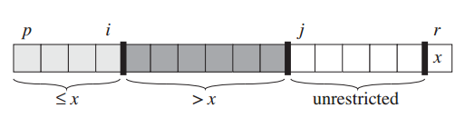
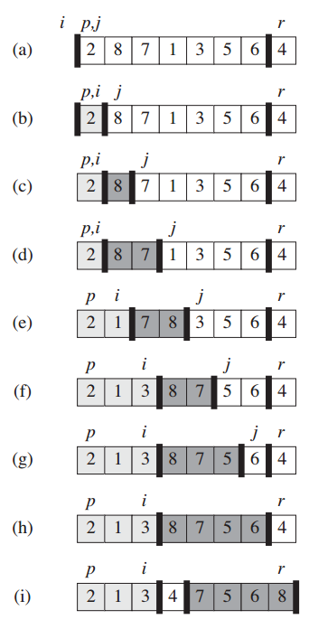
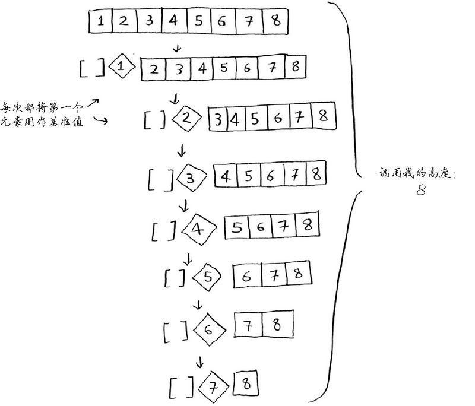
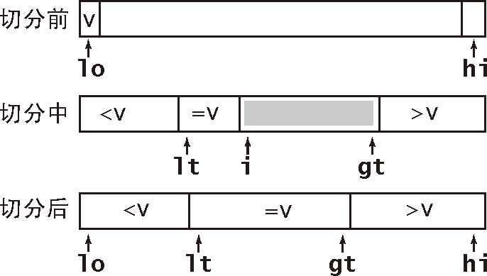

# QuickSort


<!-- TOC -->

- [QuickSort](#quicksort)
    - [设计思想](#设计思想)
        - [`partition` 中的 `i`](#partition-中的-i)
    - [概述](#概述)
    - [分治描述](#分治描述)
    - [`partition` 实现](#partition-实现)
        - [划分要点](#划分要点)
    - [时间复杂度](#时间复杂度)
        - [`partition` 的时间复杂度](#partition-的时间复杂度)
        - [最坏的输入情况](#最坏的输入情况)
        - [最好的输入情况](#最好的输入情况)
        - [常数比例的划分，时间复杂度都是 $O(n \lg n)$](#常数比例的划分时间复杂度都是-on-\lg-n)
        - [对于平均情况的直观观察](#对于平均情况的直观观察)
        - [如果想按照递减的顺序排序](#如果想按照递减的顺序排序)
    - [随机化版本](#随机化版本)
        - [乱序输入数据](#乱序输入数据)
        - [随机抽样选择 pivot](#随机抽样选择-pivot)
    - [算法改进](#算法改进)
        - [切换到插入排序](#切换到插入排序)
        - [针对相同元素值的快速排序](#针对相同元素值的快速排序)
            - [《算法（第4版）》的实现](#算法第4版的实现)
        - [三取样切分](#三取样切分)
    - [从两边向中间靠拢的 `partition` 版本](#从两边向中间靠拢的-partition-版本)
    - [References](#references)

<!-- /TOC -->

## 设计思想
### `partition` 中的 `i`
保持语义，避免意外的错误。


## 概述
1. The quicksort algorithm has a worst-case running time of $O(n^2)$ on an input array
of n numbers. Despite this slow worst-case running time, quicksort is often the best
practical choice for sorting because it is remarkably efficient on the average: its
expected running time is $O(n \lg n)$, and the constant factors hidden in the $O(n \lg n)$
notation are quite small. 
2. It also has the advantage of sorting in place, and it works well even in virtual-memory environments.


## 分治描述
1. **分解**：确定一个 pivot，把数组分为两个子数组，一个子数组的每个元素都小于等于 pivot，另一个子数组的每个元素都大于 pivot。
2. **解决**：对两个子数组递归调用快速排序。
3. **合并**：因为子数组都是原址排序，所以不需要合并。
4. 递归的结构如下
    ```cpp
    void quickSort (int* arr, int leftIdx, int rightIdx) {
        if (leftIdx < rightIdx) {
            int pivotIdx = partition(arr, leftIdx, rightIdx);
            quickSort(arr, leftIdx, pivotIdx-1);
            quickSort(arr, pivotIdx+1, rightIdx);
        }
    }
    ```
    

## `partition` 实现
1. `partition` 会先确定一个元素作为 pivot ，然后根据 pivot 的值将数组划分为两部分。
2. 在划分的过程中，除了 pivot 以外，数组是被划分为三部分的：小于等于 pivot 的、大于 pivot 的、尚未被划分的
    
3. 这里把数组最后一个元素作为 pivot，然后如上图设定两个索引来把其余部分划分为三部分。索引 `i` 标记比 pivot 大的区间的前一个位置、索引 `j` 标记比 pivot 大的区间的后一个位置。排序过程如下
    
4. 排序开始的时候，因为还没有比 pivot 大的，所以 `i` 在 `leftIndex` 的左边，`j` 在 `leftIndex` 的右边；将要被探索的元素是第一个元素。
5. 每次探索一个元素，该元素分为两种情况
    * 如果大于 pivot：直接 `j` 加一。因为是以 `j` 作为循环的索引，所以循环体内什么都不用做。
    * 如果小于等于 pivot：把当前元素和深色区域第一个元素交换，然后 `i` 加一；`j` 作为循环的索引自动加一。
6. 循环结束后，`j` 走到 pivot 的位置，把 pivot 和深色区域最左边的交换后，整个数组就是被 pivot 一分为二了。
7. 最初实现如下，功能上是没有问题
    ```cpp
    int partition (int* arr, int leftIdx, int rightIdx) {
        int pivot = arr[rightIdx];
        int i = leftIdx - 1; // 比 pivot 大的区间之前的第一个元素的索引
        int j = leftIdx; // 比 pivot 大的区间之后的第一个元素的索引

        for (; j<rightIdx; j++) {
            if (arr[j] <= pivot) {
                swap(arr, ++i, j);
            }
        }
 
        swap(arr, i+1, rightIdx);

        return i+1;
    }
    ```
8. `i` 标记的是大的区间之前的第一个元素，但是在第二个 `swap` 之后，`i` 右边换过来了 pivot 元素，现在 `i` 就不是大的区间之前的第一个元素了。所以这里应该也让 `i` 自增，保持正确的语义。另外，最后也可以简单的直接返回 `i`
    ```cpp
    int partition (int* arr, int leftIdx, int rightIdx) {
        int pivot = arr[rightIdx];
        int i = leftIdx - 1;
        int j = leftIdx;

        for (; j<rightIdx; j++) {
            if (arr[j] <= pivot) {
                swap(arr, ++i, j);
            }
        }

        swap(arr, ++i, rightIdx);

        return i;
    }
    ```

### 划分要点
* 如果第一个元素就小于等于 pivot，正好是该元素和它本身交换，然后产生第一个浅色区域；
* 如果所有元素都小于等于 pivot，最后 pivot 就是和自己交换；


## 时间复杂度
1. The running time of quicksort depends on whether the partitioning is balanced or unbalanced, which in turn depends on which elements are used for partitioning.
2. If the partitioning is balanced, the algorithm runs asymptotically as fast as merge sort. If the partitioning is unbalanced, however, it can run asymptotically as slowly as insertion sort.

### `partition` 的时间复杂度
1. `for` 之前和之后的操作都输常数次数。
2. `for` 的次数是 $n-1$，里面的每次比较和交换也都是常数次数。
3. 所示整体的时间复杂度是 $O(n)$。

### 最坏的输入情况
1. 输入数据最坏情况是，快速排序的每次 `partition` 产生的两部分分别包含 $n-1$ 和 0 个元素。
2. 在这种情况下，快速排序运行时间的递归式为 $T(n) = O(n) + T(n-1) + T(0) = T(n-1) + O(n)$。
3. 可以想象，随着不断的递归，会得到一个算术级数，结果为 $O(n^2)$。
4. 所以在最坏的输入情况下，快速排序并不比插入排序更好。
5. 进一步的，如果输入数组本来就是有序的（包括升序、降序和所有元素都相等的情况），快速排序的算法时间复杂度就是这里的 $O(n^2)$；而插入排序此时只需要 $O(n)$。

### 最好的输入情况
1. 输入数据最好情况是，快速排序的每次 `partition` 产生的两部分都不大于 $n/2$：一个子问题的规模为 $\lfloor n/2 \rfloor$，另一个为 $\lceil n/2 \rceil - 1$。
2. 在这种情况下，快速排序运行时间的递归式为 $T(n) = O(n) + 2T(n/2)$。
3. 和归并排序的复杂度一样，$O(n \lg n)$。

### 常数比例的划分，时间复杂度都是 $O(n \lg n)$
1. 快速排序的平均运行时间更接近于最好情况，而非最坏情况。
2. 假设划分算法总是产生 1:9 的划分，看起来是很不平衡的。递归式为 $T(n) = cn + T(n/10) + T(9n/10)$。
3. 这样的划分会产生左右很不平衡的递归树。看《算法导论》98 页的图：
    * 最左边的分支因为一直除以 $10$ 除到 $1$，所以会最早结束，高度是 $\log_{10} n$；
    * 最右边的分支因为一直除以 $10/9$ 除到 $1$，所以会最晚结束，高度是 $\log_{10/9} n$。
4. 在最短的分支还没递归结束之前，对于整棵树来说，每层的划分代价都是 $cn$，$O(n)$ 级别；最短的分支递归完了之后，对于整棵树来说，每层的划分代价的上限是 $cn$（书上说是小于等于 $cn$，难道不是小于？），$O(n)$ 级别。
5. 所以纵观整棵树：每层的代价都是 $O(n)$ 级别，而深度 $\log_{10/9} n$ 为 $O(\lg n)$ 级别，所以整棵树总的复杂度还是 $O(n \lg n)$。

### 对于平均情况的直观观察
1. 这里直接看《算法导论》99 页。TODO
2. 在平均的情况中，每次的划分情况有好有坏，所以总的层数会比最好情况要多。
3. 但这种层数的加深仍然只是常数倍的；而且整体来说，都是要对 $n$ 个元素进行划分，不平衡的划分在分出一个比最好情况时大的子数组时，也会分出一个比最会好情况时小的子数组。
4. 所以整体来说，在平均情况下，时间复杂度还是 $O(n \lg n)$。

### 如果想按照递减的顺序排序
1. 思考一下现有的 `partition` 逻辑，左边的两部分分别是小于等于 pivot 的和大于 pivot 的。
2. 那么只要把这两部分变成大于等于 pivot 的和小于 pivot 的就行了，也就是只需要把 `if (val <= pivot)` 改成  `if (val >= pivot)` 就行了。


## 随机化版本
1. 前面说到如果输入数据是有序的（包括所有元素都相等），那么快速排序就会变成 $O(n^2)$ 复杂度
    
2. 这是最糟的情况，数组并没有被分成两半，相反，其中一个子数组始终为空，这导致调用栈非常长，为 $O(n)$，而在最佳情况下，栈高为 $O(\lg n)$。
3. 而不管是最糟情况还是最佳情况，在调用栈的每层都涉及 $n$ 个元素。所以，最糟情况下快速排序的时间复杂度为 $O(n^2)$，而最佳情况的时间复杂度是 $O(n \lg n)$。
4. 即使输入数据不是完全有序的，很多时候也是比较有序的，完全的随机常常是需要设计之后才能实现的抽样结果。
5. 这样的数据虽然不一定会导致 $O(n^2)$ 的复杂度，但也会让快速排序无法发挥出最快的速度。因此我们希望可以在算法中引入随机性，从而使算法对于所有的输入都能获得较好的期望性能。
6. 一种方法是在排序之前先对输入数据进行乱序，另一种方法是采用 **随机抽样**（random sampling）技术选择 pivot。

### 乱序输入数据
1. 使用一个 $O(n)$ 复杂度的乱序算法先对输入数据乱序再进行快速排序。
2. 但是如果输入数据的元素都是相同的，那么乱序也没有效果，每次 `partition` 还是会进行最低效的划分。

### 随机抽样选择 pivot
1. 随机抽样选择 pivot 可以不用对输入数据进行额外的乱序。
2. 与每次都选择子数组中最右（`rightIdx`）元素作为 pivot 不同，随机抽样是每次都随机选择一个元素作为 pivot。
3. 实现方法是每次随机选出一个元素和 `rightIdx` 元素交换来作为 pivot
    ```cpp
    int randomized_partition (int* arr, int leftIdx, int rightIdx) {
        int randIdx = rand() % (rightIdx-leftIdx+1) + leftIdx;
        swap(arr, randIdx, rightIdx);
        return partition(arr, leftIdx, rightIdx);
    }
    ```
4. 仍然无法解决子数组都相同的方法。下面会讲到一个方法，在重复数据比较多的情况下甚至可以降低算法的复杂度。


## 算法改进
1. 几乎从 Hoare 第一次发表这个算法开始，人们就不断地提出各种改进方法。并不是所有的想法都可行，因为快速排序的平衡性已经非常好，改进所带来的提高可能会被意外的副作用所抵消。但其中一些，也是我们现在要介绍的，非常有效。
2. 如果你的排序代码会被执行很多次或者会被用在大型数组上（特别是如果它会被发布成一个库函数，排序的对象数组的特性是未知的），那么下面所讨论的这些改进意见值得你参考。
3. 需要注意的是，你需要通过实验来确定改进的效果并为实现选择最佳的参数。一般来说它们能将性能提升 20% ～ 30%。

### 切换到插入排序
1. 和大多数递归排序算法一样，改进快速排序性能的一个简单办法基于以下两点：
    * 对于小数组，快速排序比插入排序慢；
    * 因为递归，快速排序的 `quickSort()` 方法在小数组中也会调用自己。
2. 因此，在排序小数组时应该切换到插入排序。小数组边界大小的最佳值是和系统相关的，但是 5 ～ 15 之间的任意值在大多数情况下都能令人满意
    ```cpp
    void quickSort (int* arr, int leftIdx, int rightIdx) {
        if (leftIdx < rightIdx) {
            if (leftIdx + 10 > rightIdx) {
               insertionSort(arr, leftIdx, rightIdx);
            }
            else {
                int pivotIdx = partition(arr, leftIdx, rightIdx);
                quickSort(arr, leftIdx, pivotIdx-1);
                quickSort(arr, pivotIdx+1, rightIdx);
            }
        }
    }
    ```

### 针对相同元素值的快速排序
1. 之前的划分是把以比较的划分为两部分：小于等于 pivot 的，和大于 pivot 的。这里的改进是要划分为三部分：小于 pivot 的，等于 pivot 的，大于 pivot 的。这样，在划分之后的递归调用 `quickSort` 就可以直接略过相同的那部分。
2. 在上面 `partition` 的基础上，在小于等于 pivot 和大于 pivot 的区段中间，再加上等于 pivot 的区段。
3. 最后返回的需要是两个索引值，用来指明中间区段的范围，以便只需要对两边的区段进行递归排序。下面的实现没有返回索引值，而是直接设置了索引值指针参数的值
    ```cpp
    void threePart_quickSort (int* arr, int leftIdx, int rightIdx) {
        if (leftIdx < rightIdx) {
            int l, r;
            // l 和 r 会被设置为左侧子数组的最右索引和右侧子数组的最左索引
            threePart_partition(arr, leftIdx, rightIdx, &l, &r);
            threePart_quickSort(arr, leftIdx, l);
            threePart_quickSort(arr, r, rightIdx);
        }
    }

    void threePart_partition (int* arr, int leftIdx, int rightIdx, int* l, int* r) {
        int pivot = arr[rightIdx];
        int i = leftIdx - 1; // 小于 pivot 的区段的最后一个
        int m = leftIdx - 1; // 等于 pivot 的区段的最后一个
        int j = leftIdx; // 当前待比较的

        for (; j<rightIdx; j++) {
            if (arr[j] == pivot) {
                swap(arr, ++m, j);
            }
            else if (arr[j] < pivot) {
                // 先把 j 所在的元素交换到中间区段，然后再进一步交换到左边区段
                swap(arr, ++m, j);
                swap(arr, ++i, m);
            }
        }

        swap(arr, ++m, rightIdx);
        *l = i;
        *r = m+1;
    }
    ```
4. 要交换到小于 pivot 的区段时，因为中间要跨域两个区段，所以必须要进行两次交换。参考《算法（第4版）》的实现，把大于 pivot 的区段放到最右边，这样在未排序的左边就只有两个区段
    ```cpp
    void threePart_partition (int* arr, int leftIdx, int rightIdx, int* l, int* r) {
        int pivot = arr[rightIdx];
        int i = leftIdx - 1; // 小于 pivot 的区段的最后一个
        int j = leftIdx; // 当前待比较的
        int k = rightIdx; // 大于 pivot 的区段的最左边的

        // 本来这里的终止条件还是用的之前的 j<rightIdx，
        // 不过现在因为右边有了大于 pivot 的区段，索引应该是小于 k
        for (; j<k; j++) {
            if (arr[j] < pivot) {
                swap(arr, ++i, j);
            }
            else if (arr[j] > pivot) {
                // 这里的 --k 因为还是没比较的元素，所以交换过来后仍然需要比较，因此 j 不能自增
                swap(arr, --k, j--);
            }
        }

        swap(arr, j, rightIdx);
        *l = i;
        *r = k;
    }
    ```
5. 上面有个奇怪的 `j--` 用来抵消 `for` 的自增，不如直接换成 `while`，然后在内部明确的自增 `j`，看起来也比隐晦的 `j` 自增更容易理解
    ```cpp
    void threePart_partition (int* arr, int leftIdx, int rightIdx, int* l, int* r) {
        count++;
        int pivot = arr[rightIdx];
        int i = leftIdx - 1; // 小于 pivot 的区段的最后一个
        int j = leftIdx; // 当前待比较的
        int k = rightIdx; // 大于 pivot 的区段的最左边的

        while (j < k) {
            if (arr[j] < pivot) {
                swap(arr, ++i, j++);
            }
            else if (arr[j] > pivot) {
                swap(arr, --k, j);
            }
            else {
                j++;
            }
        }

        swap(arr, j, rightIdx);
        *l = i;
        *r = k;
    }
    ```
    
#### 《算法（第4版）》的实现
1. 选择最左侧元素作为 `pivot`，从左到右遍历数组一次，维护一个指针 `lt` 使得 `a[leftIndex..lt-1]` 中的元素都小于 `v`，一个指针 `gt` 使得 `a[gt+1..rightIndex]` 中的元素都大于 `v`，一个指针 `i` 使得 `a[lt..i-1]` 中的元素都等于 `v`，`a[i..gt]` 中的元素都还未确定，如下图所示
    
2. 在比较的过程中：`lt` 指向最左侧的和 `pivot` 相等的元素，`i` 指向待比较元素，`gt` 指向最右侧的不确定元素。
3. 每次比较：
    * 如果 `arr[i]` 小于 `v`，将 `arr[lt]` 和 `arr[i]` 交换，将 `lt` 和 `i` 加一；
    * 如果 `arr[i]` 大于 `v`，将 `arr[gt]` 和 `arr[i]` 交换，将 `gt` 减一；因为之前 `gt` 位的元素也是不确定的，所以这里交换到 `i` 位之后要继续进行比较； 
    * 如果 `arr[i]` 等于 `v`，将 `i` 加一。
4. 上述比较会不断缩小不确定的 `arr[i..gt]`。当 `i` 等于 `gt` 时，还剩最后一个待排序的元素，此时的比较规则还是一样的，只不过比较之后 `gt` 所在的元素就不是不确定的了，而是最右侧的等于 `pivot` 的元素。
5. 实现
    ```js
    function quickSort (arr, leftIndex, rightIndex) {
        if ( leftIndex + 10 >= rightIndex ) {
            insertionSort(arr, leftIndex, rightIndex);
            return;
        }
        
        let [l, r] = partition(arr, leftIndex, rightIndex);
        quickSort( arr, leftIndex, l-1);
        quickSort( arr, r+1, rightIndex);
    }
    function partition (arr, leftIndex, rightIndex) {
        let randIdx = Math.floor(Math.random() * (rightIndex - leftIndex + 1) + leftIndex);
        swap(arr, randIdx, rightIndex);

        let pivot = arr[leftIndex];
        let low = leftIndex;
        let i = leftIndex + 1;
        let high = rightIndex;

        while (i <= high) {
            if (arr[i] < pivot) {
                swap(arr, low++, i++);
            }
            else if (arr[i] > pivot) {
                swap(arr, i, high--)
            }
            else{
                i++;
            }
        }

        return [low, high];
    }
    ```

### 三取样切分


## 从两边向中间靠拢的 `partition` 版本
这是快速排序最初的划分方法，但是在分析和处理边界条件时比较麻烦，还是上面的版本更好理解。
```js
function hoare_partition (arr, leftIndex, rightIndex) {
    let pivot = arr[leftIndex];
    let i = leftIndex;
    let j = rightIndex + 1;

    while (true) { 
        
        while (arr[++i] < pivot) {
            if (i === rightIndex) {
                break;
            }
        }

        while (arr[--j] > pivot) {

        }
        
        if (i >= j) {
            break; 
        }
        swap(arr, i, j);
    }
    swap(arr, leftIndex, j);
    return j;
}
```


## References
* [算法导论](https://book.douban.com/subject/20432061/)
* [算法（第4版）](https://book.douban.com/subject/19952400/)
* [学习JavaScript数据结构与算法](https://book.douban.com/subject/26639401/)
* [图解排序算法(二)之希尔排序](https://www.cnblogs.com/chengxiao/p/6104371.html)
* [《算法图解》](https://book.douban.com/subject/26979890/)